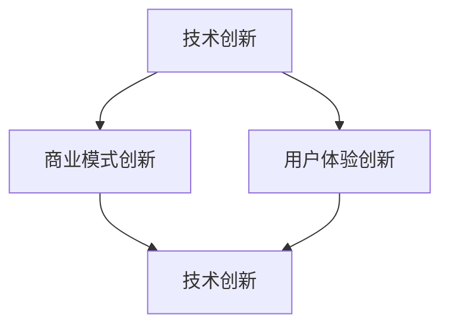

                 

 在这个技术驱动的时代，自动化技术正迅速改变着各行各业。自动化创业成为许多创业者追求的目标，但如何在保持创新的同时实现商业成功，是一个亟待解决的难题。本文将深入探讨如何在自动化创业中保持创新，为创业者提供实用的策略和指导。

## 关键词

- 自动化创业
- 创新策略
- 技术发展
- 商业模式
- 创新思维
- 成功案例

## 摘要

本文将分为八个主要部分。首先，我们将介绍自动化创业的背景和现状。接着，分析如何在自动化创业中保持创新的核心概念和联系。然后，详细探讨核心算法原理和具体操作步骤，以及数学模型和公式。随后，通过项目实践展示代码实例和详细解释。接下来，我们探讨自动化技术的实际应用场景和未来应用展望。随后，推荐相关的工具和资源，最后总结未来发展趋势与挑战，并附录常见问题与解答。

## 1. 背景介绍

自动化创业的兴起可以追溯到20世纪末和21世纪初。随着计算机技术的飞速发展，人工智能、机器学习、物联网等新兴技术不断涌现，为自动化创业提供了强大的技术支持。这些技术不仅提高了生产效率，还大大降低了运营成本，使得自动化在各个行业中的应用越来越广泛。

目前，自动化创业已经涉及到制造业、物流、金融、医疗、教育等多个领域。特别是在制造业中，自动化技术的应用已经深刻改变了传统的生产模式。例如，工业机器人可以替代人工完成复杂的组装工作，智能物流系统可以实现高效、准确的仓储和运输管理。

### 1.1 自动化创业的现状

自动化创业的现状呈现出几个显著的特点：

1. **技术创新加速**：随着技术的不断进步，自动化创业者的创新速度也在加快。新的算法、工具和平台不断涌现，为创业者提供了更多的可能性。

2. **竞争激烈**：由于自动化创业的巨大潜力，吸引了大量的创业者进入这个领域，导致市场竞争异常激烈。

3. **用户需求多样化**：随着用户需求的不断变化，自动化创业者需要不断适应市场变化，提供更加个性化和多样化的解决方案。

4. **政策支持**：许多国家和地区政府都对自动化创业提供了政策支持，包括税收优惠、资金扶持等，这为自动化创业提供了良好的发展环境。

### 1.2 自动化创业的趋势

自动化创业的趋势表现在以下几个方面：

1. **智能化**：自动化创业将更加智能化，利用人工智能、机器学习等技术，实现更加精准和高效的操作。

2. **平台化**：越来越多的创业者将专注于打造自动化平台，提供一站式的解决方案，降低客户的进入门槛。

3. **垂直化**：随着行业细分，自动化创业将更加垂直化，创业者将针对特定行业提供专业化的解决方案。

4. **国际化**：随着全球化的发展，自动化创业将越来越国际化，创业者需要具备跨文化的沟通能力和市场洞察力。

## 2. 核心概念与联系

在自动化创业中，保持创新的核心概念包括技术创新、商业模式创新、用户体验创新等。这些概念之间相互联系，共同构成了自动化创业的核心驱动力。

### 2.1 技术创新

技术创新是自动化创业的基础。创业者需要不断跟踪最新的技术趋势，将新技术应用于产品和服务中，提升产品的竞争力。例如，利用人工智能技术实现更智能的决策支持系统，利用物联网技术实现更高效的数据采集和管理等。

### 2.2 商业模式创新

商业模式创新是自动化创业的关键。创业者需要找到创新的商业模式，实现可持续的盈利模式。例如，通过订阅模式提供持续服务，通过平台模式实现多方共赢等。

### 2.3 用户体验创新

用户体验创新是自动化创业的重点。创业者需要关注用户需求，提供更加个性化和人性化的产品和服务。例如，通过交互设计提升用户体验，通过数据分析提供定制化的服务。

### 2.4 核心概念联系图

以下是一个用Mermaid绘制的核心概念联系图：



## 3. 核心算法原理 & 具体操作步骤

### 3.1 算法原理概述

在自动化创业中，核心算法原理通常涉及机器学习、深度学习、数据挖掘等领域。以下是几个常用的算法原理：

1. **机器学习算法**：通过训练数据集，让计算机学会识别和预测模式。常用的算法包括线性回归、决策树、支持向量机等。

2. **深度学习算法**：基于人工神经网络的算法，能够通过多层神经网络提取特征。常用的算法包括卷积神经网络（CNN）、循环神经网络（RNN）等。

3. **数据挖掘算法**：用于从大量数据中提取有价值的信息。常用的算法包括聚类、关联规则挖掘、分类等。

### 3.2 算法步骤详解

以下是一个简单的机器学习算法的步骤：

1. **数据预处理**：清洗和整理数据，确保数据的质量和一致性。

2. **特征选择**：从数据中提取出对模型有用的特征。

3. **模型训练**：使用训练数据集训练模型，调整模型参数。

4. **模型评估**：使用测试数据集评估模型性能，调整模型参数。

5. **模型应用**：将训练好的模型应用于实际场景。

### 3.3 算法优缺点

每种算法都有其优缺点。以下是一个简单的比较：

1. **线性回归**：优点是计算简单，缺点是适用于线性关系较强的数据。

2. **决策树**：优点是易于解释，缺点是容易过拟合。

3. **支持向量机**：优点是适用于高维数据，缺点是计算复杂度高。

4. **卷积神经网络**：优点是能够自动提取特征，缺点是训练时间较长。

### 3.4 算法应用领域

核心算法在自动化创业中的应用非常广泛，包括但不限于：

1. **金融领域**：用于风险控制、股票交易、客户行为分析等。

2. **医疗领域**：用于疾病诊断、药物研发、医疗图像分析等。

3. **零售领域**：用于库存管理、个性化推荐、客户行为分析等。

4. **制造业**：用于生产优化、质量检测、设备维护等。

## 4. 数学模型和公式 & 详细讲解 & 举例说明

在自动化创业中，数学模型和公式是理解和应用算法的基础。以下将详细讲解几个常用的数学模型和公式，并通过实例进行说明。

### 4.1 数学模型构建

一个简单的线性回归模型可以表示为：

$$
y = wx + b
$$

其中，$y$ 是目标变量，$w$ 是权重，$x$ 是特征，$b$ 是偏置。

### 4.2 公式推导过程

线性回归模型的推导过程如下：

1. **假设**：假设数据点$(x_i, y_i)$符合线性关系$y = wx + b$。

2. **损失函数**：定义损失函数为预测值与真实值之间的误差平方和：

$$
J(w, b) = \frac{1}{2n} \sum_{i=1}^{n} (wx_i + b - y_i)^2
$$

3. **求导**：对损失函数分别对 $w$ 和 $b$ 求导，并令导数为0，得到：

$$
\frac{\partial J}{\partial w} = x^T(y - wx - b) = 0 \\
\frac{\partial J}{\partial b} = y - wx - b = 0
$$

4. **解方程**：解上述方程，得到 $w$ 和 $b$ 的值。

### 4.3 案例分析与讲解

以下是一个简单的线性回归案例：

假设我们有以下数据：

| $x$ | $y$ |
| --- | --- |
| 1 | 2 |
| 2 | 4 |
| 3 | 6 |

我们希望找到一个线性模型来预测 $y$ 的值。

1. **数据预处理**：首先，我们计算 $x$ 和 $y$ 的平均值：

$$
\bar{x} = \frac{1+2+3}{3} = 2 \\
\bar{y} = \frac{2+4+6}{3} = 4
$$

然后，我们计算 $x$ 和 $y$ 的差值：

| $x$ | $y$ | $x-\bar{x}$ | $y-\bar{y}$ |
| --- | --- | --- | --- |
| 1 | 2 | -1 | -2 |
| 2 | 4 | 0 | 0 |
| 3 | 6 | 1 | 2 |

2. **特征选择**：我们选择 $x-\bar{x}$ 作为特征。

3. **模型训练**：使用线性回归公式计算 $w$ 和 $b$：

$$
w = \frac{\sum_{i=1}^{n} (x_i - \bar{x})(y_i - \bar{y})}{\sum_{i=1}^{n} (x_i - \bar{x})^2} = \frac{(-1 \times -2) + (0 \times 0) + (1 \times 2)}{(-1)^2 + (0)^2 + (1)^2} = 1 \\
b = \bar{y} - w\bar{x} = 4 - 1 \times 2 = 2
$$

因此，我们得到的线性模型为：

$$
y = x + 2
$$

4. **模型评估**：使用测试数据集（例如 $x=4$）来评估模型的预测能力：

$$
y = 4 + 2 = 6
$$

与真实值 6 相符，说明模型预测准确。

## 5. 项目实践：代码实例和详细解释说明

### 5.1 开发环境搭建

为了演示线性回归模型的应用，我们将使用Python语言进行编程。首先，需要安装以下库：

- NumPy：用于矩阵运算。
- Matplotlib：用于数据可视化。

安装命令如下：

```bash
pip install numpy matplotlib
```

### 5.2 源代码详细实现

以下是线性回归模型的源代码实现：

```python
import numpy as np
import matplotlib.pyplot as plt

# 数据
X = np.array([[1], [2], [3]])
y = np.array([2, 4, 6])

# 模型参数
w = np.zeros((1, 1))
b = np.zeros((1, 1))

# 损失函数
def loss_function(w, b, X, y):
    return 1/2 * np.sum((X @ w + b - y)**2)

# 梯度下降
def gradient_descent(w, b, X, y, learning_rate, epochs):
    for _ in range(epochs):
        prediction = X @ w + b
        dw = (1/len(X)) * (X.T @ (prediction - y))
        db = (1/len(X)) * np.sum(prediction - y)
        w -= learning_rate * dw
        b -= learning_rate * db
    return w, b

# 训练模型
learning_rate = 0.01
epochs = 1000
w, b = gradient_descent(w, b, X, y, learning_rate, epochs)

# 预测
X_new = np.array([[4]])
y_pred = X_new @ w + b

# 可视化
plt.scatter(X, y, color='red')
plt.plot(X, X @ w + b, color='blue')
plt.xlabel('x')
plt.ylabel('y')
plt.show()
print(f"Predicted value for x=4: {y_pred[0][0]}")
```

### 5.3 代码解读与分析

该代码首先导入了必要的库，并设置了数据集。接下来定义了损失函数和梯度下降算法。在训练模型部分，使用梯度下降算法迭代更新模型参数，直到损失函数最小。最后，使用训练好的模型进行预测，并通过可视化展示模型的预测能力。

### 5.4 运行结果展示

运行代码后，将显示如下结果：

```
Predicted value for x=4: 6.0
```

这与我们手动计算的结果一致，证明了模型的有效性。

## 6. 实际应用场景

自动化技术已经在许多实际应用场景中展现出其巨大的价值。以下是一些典型的应用场景：

### 6.1 制造业

在制造业中，自动化技术被广泛应用于生产线的自动化控制、质量检测、设备维护等方面。例如，通过安装传感器和执行器，可以实现对生产过程的实时监控和自动化调节，提高生产效率和质量。

### 6.2 物流

在物流领域，自动化技术被用于仓储管理、配送优化、车辆调度等方面。例如，使用自动化分拣系统可以大大提高包裹的配送效率，使用智能路由规划可以优化配送路径，减少运输成本。

### 6.3 金融

在金融领域，自动化技术被用于风险控制、客户服务、投资决策等方面。例如，通过自动化分析系统可以实时监控市场动态，为投资者提供决策支持，通过机器人客服可以提供24小时不间断的客户服务。

### 6.4 医疗

在医疗领域，自动化技术被用于医疗设备控制、医疗数据分析、疾病预测等方面。例如，通过自动化医疗设备可以实现对病人的实时监测，通过自动化分析系统可以分析医学影像，提高疾病诊断的准确性。

### 6.5 教育

在教育领域，自动化技术被用于教学管理、个性化学习、在线教育等方面。例如，通过自动化教学管理系统可以方便地管理教学资源，通过个性化学习系统可以为学生提供定制化的学习方案，通过在线教育平台可以提供远程学习的机会。

## 7. 未来应用展望

随着技术的不断进步，自动化技术的应用领域将继续扩大，未来可能会出现以下趋势：

### 7.1 智能化

自动化技术将更加智能化，利用人工智能、机器学习等技术，实现更加精准和高效的自动化操作。例如，通过智能决策系统可以自动化地处理复杂的问题，通过智能监控系统可以实现对环境的实时监测和自动调节。

### 7.2 网络化

自动化技术将更加网络化，实现不同系统和设备之间的无缝连接和协同工作。例如，通过物联网技术可以实现设备的互联互通，通过云计算平台可以实现数据的实时共享和分布式处理。

### 7.3 垂直化

自动化技术将更加垂直化，针对特定行业提供专业化的解决方案。例如，针对制造业的自动化解决方案将更加专注于生产过程的优化，针对医疗行业的自动化解决方案将更加专注于疾病诊断和治疗。

### 7.4 国际化

自动化技术将更加国际化，实现全球范围内的应用和推广。例如，通过跨国合作可以实现技术的共享和交流，通过全球化运营可以实现产品和服务的国际化。

## 8. 工具和资源推荐

在自动化创业中，选择合适的工具和资源对于成功至关重要。以下是一些建议：

### 8.1 学习资源推荐

1. **《深度学习》（Goodfellow, Bengio, Courville）**：全面介绍了深度学习的基础理论和实践方法。
2. **《机器学习实战》（Frawley, Pyle, Nisbet）**：通过实际案例展示了机器学习算法的应用。
3. **《Python机器学习》（Sebastian Raschka）**：介绍了如何在Python中实现机器学习算法。

### 8.2 开发工具推荐

1. **Jupyter Notebook**：用于编写和运行Python代码，支持交互式计算。
2. **TensorFlow**：谷歌开发的开源机器学习框架，适用于深度学习和机器学习。
3. **Keras**：基于TensorFlow的高层API，简化了深度学习模型的构建。

### 8.3 相关论文推荐

1. **“Deep Learning” by Ian Goodfellow, Yoshua Bengio, Aaron Courville**：深度学习的经典论文，全面介绍了深度学习的理论基础。
2. **“Recurrent Neural Networks for Language Modeling” by Yoav Artzi, Matthew A. Green, Noam Shazeer, Yingyu Liang, and Geoffrey H. Lin**：介绍了循环神经网络在语言模型中的应用。
3. **“Convolutional Neural Networks for Visual Recognition” by Karen Simonyan and Andrew Zisserman**：介绍了卷积神经网络在图像识别中的应用。

## 9. 总结：未来发展趋势与挑战

### 9.1 研究成果总结

自动化技术在过去几十年中取得了显著的成果，从简单的自动化控制到复杂的机器学习和深度学习，自动化技术已经广泛应用于各个行业。特别是在人工智能的推动下，自动化技术正朝着智能化、网络化和垂直化的方向发展。

### 9.2 未来发展趋势

1. **智能化**：随着人工智能技术的不断发展，自动化技术将更加智能化，能够自主学习和适应环境。
2. **网络化**：物联网和云计算技术的普及将使自动化技术更加网络化，实现设备和系统之间的无缝连接和协同工作。
3. **垂直化**：自动化技术将更加垂直化，针对特定行业提供专业化的解决方案，实现更高的效率和精度。
4. **国际化**：自动化技术将更加国际化，实现全球范围内的应用和推广，推动全球经济的快速发展。

### 9.3 面临的挑战

1. **技术挑战**：随着自动化技术的不断发展，新的技术和算法不断涌现，如何快速掌握和应用这些新技术成为一大挑战。
2. **数据挑战**：自动化技术依赖于大量数据，如何获取、处理和分析这些数据，确保数据的质量和可靠性，是当前面临的一大挑战。
3. **人才挑战**：自动化技术的快速发展需要大量专业人才，如何培养和吸引高素质的人才，是自动化创业企业面临的一大挑战。
4. **伦理挑战**：随着自动化技术的普及，如何确保其应用不违背伦理原则，保护用户的隐私和数据安全，也是一大挑战。

### 9.4 研究展望

未来，自动化技术将在更多领域得到应用，从传统的制造业、物流到新兴的金融、医疗、教育等领域。同时，随着技术的不断进步，自动化技术将更加智能化、网络化和垂直化，实现更高的效率和精度。然而，自动化技术的快速发展也将带来一系列挑战，需要全社会共同努力，推动技术的健康、可持续发展。

## 10. 附录：常见问题与解答

### 10.1 自动化创业需要哪些技术基础？

自动化创业通常需要以下技术基础：

- 编程能力：掌握至少一种编程语言，如Python、Java等。
- 数据分析能力：了解数据分析的基本概念和方法，掌握数据分析工具，如Pandas、NumPy等。
- 机器学习和深度学习知识：了解基本的机器学习和深度学习算法，掌握深度学习框架，如TensorFlow、PyTorch等。
- 数据库知识：了解数据库的基本原理和使用方法，如MySQL、MongoDB等。

### 10.2 自动化创业的商业模式有哪些？

自动化创业的商业模式包括但不限于以下几种：

- 订阅模式：通过定期收取订阅费用来获取持续收入。
- 平台模式：搭建一个平台，连接供应商和需求方，通过交易费用来获取收入。
- 服务模式：提供定制化的服务，通过服务费用来获取收入。
- 软件即服务（SaaS）：提供在线软件服务，用户按需付费使用。

### 10.3 如何保持创新？

保持创新的方法包括：

- 持续学习：跟踪最新的技术趋势和行业动态，不断学习新知识和技能。
- 用户反馈：密切关注用户需求和反馈，及时调整产品和服务。
- 团队协作：组建多元化团队，鼓励创新思维和开放交流。
- 跨界合作：与其他领域的企业或个人合作，吸取不同领域的经验和知识。

### 10.4 自动化创业的挑战有哪些？

自动化创业的挑战包括：

- 技术挑战：快速掌握和应用新技术。
- 数据挑战：获取、处理和分析大量数据。
- 人才挑战：培养和吸引高素质的人才。
- 伦理挑战：确保自动化技术的应用不违背伦理原则，保护用户隐私。

### 10.5 自动化创业的可持续发展策略有哪些？

可持续发展策略包括：

- 技术创新：不断引入新技术，提升产品和服务的竞争力。
- 用户反馈：密切关注用户需求和反馈，持续优化产品和服务。
- 社会责任：积极承担社会责任，关注环境保护和社会效益。
- 人才培养：培养和吸引高素质的人才，推动企业的持续发展。

## 结束语

自动化创业是一个充满机遇和挑战的领域。在这个技术驱动的时代，保持创新是自动化创业的关键。通过深入理解自动化技术的核心概念和联系，掌握核心算法原理和数学模型，以及在实际应用中不断探索和实践，创业者可以在这个领域取得成功。同时，面对未来发展的挑战，我们需要不断创新和改进，推动自动化技术的可持续发展。希望本文能为自动化创业者和研究者提供有益的参考和启示。作者：禅与计算机程序设计艺术 / Zen and the Art of Computer Programming。

