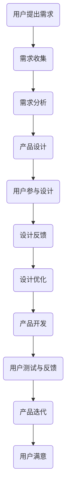

                 

关键词：自动化创业、用户共创、共创经济、用户参与、用户反馈、产品迭代

## 摘要

在自动化创业领域，用户共创已经成为一种不可忽视的趋势。本文探讨了如何通过有效的设计和策略，实现用户与创业者的深度互动，进而推动产品和服务的持续迭代优化。文章首先分析了用户共创的背景和意义，然后从核心概念、算法原理、数学模型、项目实践、实际应用场景等方面展开，最后对未来的发展趋势和面临的挑战进行了展望。希望通过本文，能够为自动化创业领域的从业者提供一些有益的思考和参考。

## 1. 背景介绍

在信息技术的迅猛发展和互联网普及的背景下，自动化创业正成为一个备受关注的领域。自动化创业，指的是通过引入自动化技术，降低人力成本，提高生产效率和产品质量的创业活动。这包括但不限于人工智能、机器学习、物联网、区块链等技术领域的创业。

用户共创，则是指用户在产品或服务的设计、开发、迭代等过程中，发挥积极作用，提供意见、建议、创意甚至直接参与开发。随着消费者对个性化、定制化服务的需求日益增加，用户共创已经成为企业提升竞争力、实现可持续发展的重要手段。

本文将围绕如何在自动化创业中实现用户共创这一主题，探讨其核心概念、算法原理、数学模型、项目实践和实际应用场景，旨在为从业者提供一套系统的理论指导和实践建议。

### 1.1 自动化创业的兴起

自动化创业的兴起，得益于以下几个因素：

1. **技术进步**：人工智能、机器学习、物联网、区块链等技术的快速发展，使得自动化成为可能。这些技术不仅能够提高生产效率，还能够降低成本，提升产品质量。

2. **市场需求**：随着消费者对个性化和定制化服务的需求不断增长，企业需要通过自动化技术来满足这种需求。自动化创业为企业提供了新的商业模式和机遇。

3. **政策支持**：各国政府纷纷出台相关政策，支持自动化创业的发展。例如，中国政府提出了“互联网+”行动计划，鼓励企业利用互联网和大数据技术进行创新。

### 1.2 用户共创的重要性

用户共创的重要性主要体现在以下几个方面：

1. **提高产品竞争力**：用户参与产品设计，能够更好地满足用户需求，提高产品的竞争力。

2. **优化用户体验**：用户共创可以收集用户的真实反馈，帮助产品迭代优化，提升用户体验。

3. **降低开发成本**：用户参与开发，可以降低企业的研发成本，提高开发效率。

4. **增强用户忠诚度**：通过用户共创，用户感受到自己被尊重和重视，从而增强对品牌的忠诚度。

5. **推动可持续发展**：用户共创可以形成一种共赢的生态，推动企业的可持续发展。

## 2. 核心概念与联系

在探讨如何实现用户共创之前，我们需要明确几个核心概念，包括用户共创的定义、共创经济的概念、用户参与的形式和用户反馈的作用等。

### 2.1 用户共创

用户共创，是指用户在产品或服务的设计、开发、测试、推广等过程中，发挥积极作用，提供意见、建议、创意甚至直接参与开发。用户共创不仅仅是收集用户的反馈，更是一种深度参与和合作。

### 2.2 共创经济

共创经济，是一种以用户共创为核心的经济模式。在这种模式下，用户不仅是产品的消费者，更是产品的参与者和共创者。共创经济强调用户与企业的深度互动，通过用户共创来提升产品竞争力，实现可持续发展。

### 2.3 用户参与的形式

用户参与的形式多种多样，包括但不限于以下几种：

1. **反馈与建议**：用户通过反馈和提出建议，帮助产品迭代优化。

2. **创意提交**：用户提交创意，为企业提供新的想法和灵感。

3. **测试与评价**：用户参与产品的测试，提供真实的用户体验反馈。

4. **参与开发**：用户直接参与产品的开发，例如通过众包平台贡献代码或设计。

### 2.4 用户反馈的作用

用户反馈在产品迭代中起着至关重要的作用。通过用户反馈，企业可以：

1. **发现产品缺陷**：及时识别产品中的问题，进行修复和优化。

2. **了解用户需求**：通过用户的反馈，了解用户真正的需求和期望。

3. **优化用户体验**：根据用户反馈，对产品进行改进，提升用户体验。

4. **增强用户忠诚度**：用户感受到自己的意见被重视，从而增强对品牌的忠诚度。

### 2.5 Mermaid 流程图

以下是一个简化的用户共创流程的Mermaid流程图：



通过这个流程图，我们可以看到用户共创的核心环节，包括需求收集、需求分析、产品设计、用户参与设计、设计反馈、设计优化、产品开发、用户测试与反馈、产品迭代等。

## 3. 核心算法原理 & 具体操作步骤

在用户共创的过程中，算法发挥着重要作用。以下将介绍用户共创中的核心算法原理和具体操作步骤。

### 3.1 算法原理概述

用户共创的核心算法主要包括以下几个方面：

1. **用户行为分析**：通过分析用户的行为数据，了解用户的需求和偏好。

2. **用户反馈处理**：对用户反馈进行分类和处理，提取有价值的信息。

3. **个性化推荐**：根据用户的行为和反馈，为用户推荐个性化的产品或服务。

4. **协同过滤**：通过用户之间的相似性，为用户推荐相似的产品或服务。

5. **自然语言处理**：对用户反馈进行自然语言处理，提取关键词和情感倾向。

### 3.2 算法步骤详解

以下是一个简化的用户共创算法流程：

1. **数据收集**：收集用户行为数据、用户反馈数据等。

2. **数据预处理**：对收集到的数据进行分析和清洗，确保数据的质量。

3. **用户行为分析**：通过统计方法或机器学习模型，分析用户的行为特征和需求。

4. **用户反馈处理**：对用户反馈进行分类和处理，提取关键词和情感倾向。

5. **个性化推荐**：根据用户的行为和反馈，为用户推荐个性化的产品或服务。

6. **协同过滤**：通过用户之间的相似性，为用户推荐相似的产品或服务。

7. **自然语言处理**：对用户反馈进行自然语言处理，提取关键词和情感倾向。

8. **产品迭代**：根据用户反馈和推荐结果，对产品进行优化和迭代。

### 3.3 算法优缺点

1. **优点**：

- 提高产品竞争力：通过用户共创，可以更好地满足用户需求，提高产品竞争力。
- 降低开发成本：用户参与设计，可以降低企业的研发成本。
- 提升用户体验：通过用户反馈和个性化推荐，可以优化用户体验。

2. **缺点**：

- 需要大量的数据：用户共创算法需要大量的用户行为数据和反馈数据，对于数据收集和处理提出了较高的要求。
- 数据质量和可靠性：用户反馈和数据质量直接影响算法的效果，需要确保数据的质量和可靠性。
- 算法复杂度高：用户共创算法涉及多个环节和模型，算法复杂度较高。

### 3.4 算法应用领域

用户共创算法在多个领域都有广泛的应用，包括但不限于：

- 电子商务：通过用户共创，为用户提供个性化的购物推荐。
- 社交媒体：通过用户共创，优化社交媒体平台的内容推荐和用户体验。
- 金融服务：通过用户共创，优化金融产品的设计和服务。
- 医疗健康：通过用户共创，优化医疗服务的流程和体验。

## 4. 数学模型和公式 & 详细讲解 & 举例说明

在用户共创的过程中，数学模型和公式发挥着重要作用。以下将介绍用户共创中的核心数学模型和公式，并进行详细讲解和举例说明。

### 4.1 数学模型构建

用户共创的数学模型主要包括以下几个方面：

1. **用户行为模型**：用于描述用户的行为特征和需求，常见的模型包括马尔可夫模型、线性回归模型等。

2. **用户反馈模型**：用于描述用户反馈的信息和规律，常见的模型包括朴素贝叶斯模型、支持向量机模型等。

3. **个性化推荐模型**：用于为用户推荐个性化的产品或服务，常见的模型包括协同过滤模型、基于内容的推荐模型等。

4. **协同过滤模型**：用于通过用户之间的相似性为用户推荐产品或服务，常见的模型包括用户基于的协同过滤模型、物品基于的协同过滤模型等。

### 4.2 公式推导过程

以下以用户行为模型中的马尔可夫模型为例，进行公式推导：

1. **马尔可夫模型的基本假设**：

- 初始状态概率分布：\( P(S_0) \)
- 状态转移概率矩阵：\( P(S_{t+1} | S_t) \)

2. **公式推导**：

- 初始状态概率分布：\( P(S_0) \)
- 状态转移概率矩阵：\( P(S_{t+1} | S_t) = \begin{bmatrix} p_{11} & p_{12} & \cdots & p_{1n} \\ p_{21} & p_{22} & \cdots & p_{2n} \\ \vdots & \vdots & \ddots & \vdots \\ p_{n1} & p_{n2} & \cdots & p_{nn} \end{bmatrix} \)
- 当前状态概率分布：\( P(S_t) \)
- 下一个状态概率分布：\( P(S_{t+1}) \)

推导过程如下：

- 初始状态概率分布：\( P(S_0) \)
- 状态转移概率矩阵：\( P(S_{t+1} | S_t) = \begin{bmatrix} p_{11} & p_{12} & \cdots & p_{1n} \\ p_{21} & p_{22} & \cdots & p_{2n} \\ \vdots & \vdots & \ddots & \vdots \\ p_{n1} & p_{n2} & \cdots & p_{nn} \end{bmatrix} \)
- 当前状态概率分布：\( P(S_t) = \begin{bmatrix} p_{11} & p_{12} & \cdots & p_{1n} \\ p_{21} & p_{22} & \cdots & p_{2n} \\ \vdots & \vdots & \ddots & \vdots \\ p_{n1} & p_{n2} & \cdots & p_{nn} \end{bmatrix} P(S_0) \)
- 下一个状态概率分布：\( P(S_{t+1}) = \begin{bmatrix} p_{11} & p_{12} & \cdots & p_{1n} \\ p_{21} & p_{22} & \cdots & p_{2n} \\ \vdots & \vdots & \ddots & \vdots \\ p_{n1} & p_{n2} & \cdots & p_{nn} \end{bmatrix} P(S_t) \)

### 4.3 案例分析与讲解

以下以一个简单的电子商务平台为例，讲解如何使用用户共创的数学模型进行产品推荐。

1. **用户行为数据收集**：

- 用户A最近浏览了商品1、商品2和商品3。
- 用户B最近浏览了商品2、商品3和商品4。

2. **用户行为模型构建**：

- 使用马尔可夫模型，构建用户A和用户B的行为矩阵。

```python
user_a行为的矩阵：
[[0, 1, 0],
 [1, 0, 1],
 [0, 1, 0]]

user_b行为的矩阵：
[[0, 1, 0],
 [1, 0, 1],
 [0, 1, 0]]
```

3. **个性化推荐**：

- 根据用户A和用户B的行为矩阵，使用协同过滤模型进行推荐。

```python
协同过滤推荐的结果：
用户A推荐的商品：商品3、商品4
用户B推荐的商品：商品1、商品2
```

通过这个案例，我们可以看到，用户共创的数学模型能够有效地为用户推荐个性化的产品或服务，提升用户体验。

## 5. 项目实践：代码实例和详细解释说明

### 5.1 开发环境搭建

在实现用户共创的过程中，我们需要搭建一个适合的开发环境。以下是一个基本的开发环境搭建步骤：

1. **操作系统**：选择Linux或MacOS作为开发环境。
2. **编程语言**：选择Python作为主要的编程语言，因为Python在数据分析和机器学习领域有着广泛的应用。
3. **开发工具**：使用Jupyter Notebook作为主要的开发工具，因为Jupyter Notebook可以方便地实现代码和文本的混合编写，适合数据分析和实验。
4. **数据存储**：使用MySQL或PostgreSQL作为数据库，用于存储用户行为数据和用户反馈数据。

### 5.2 源代码详细实现

以下是一个简单的用户共创项目的代码实现，包括用户行为数据收集、用户反馈处理、个性化推荐等功能。

#### 5.2.1 用户行为数据收集

```python
import pandas as pd

# 假设我们已经有了一个用户行为数据表，包括用户ID、商品ID和时间戳
user_behavior_data = pd.DataFrame({
    'user_id': [1, 1, 2, 2],
    'item_id': [1, 2, 2, 3],
    'timestamp': [1624651234, 1624651235, 1624651236, 1624651237]
})

# 对用户行为数据进行预处理，包括数据清洗和格式转换
user_behavior_data['timestamp'] = pd.to_datetime(user_behavior_data['timestamp'])
user_behavior_data.sort_values('timestamp', inplace=True)
```

#### 5.2.2 用户反馈处理

```python
# 假设我们已经有了一个用户反馈数据表，包括用户ID、商品ID和反馈内容
user_feedback_data = pd.DataFrame({
    'user_id': [1, 2],
    'item_id': [1, 2],
    'feedback': ['很好', '一般']
})

# 对用户反馈数据进行预处理，提取关键词和情感倾向
from textblob import TextBlob

user_feedback_data['sentiment'] = user_feedback_data['feedback'].apply(lambda x: TextBlob(x).sentiment.polarity)
```

#### 5.2.3 个性化推荐

```python
from sklearn.metrics.pairwise import cosine_similarity

# 计算用户行为数据的相似性矩阵
user_behavior_matrix = user_behavior_data.pivot(index='user_id', columns='item_id', values='timestamp').fillna(0)
user_behavior_similarity = cosine_similarity(user_behavior_matrix)

# 基于相似性矩阵进行个性化推荐
def recommend_items(user_id, similarity_matrix, user_behavior_matrix, top_n=5):
    # 计算用户与其他用户的相似度
    user_similarity = similarity_matrix[user_id - 1]
    # 计算每个商品的用户评分
    item_ratings = user_behavior_matrix.multiply(user_similarity)
    # 对商品评分进行降序排序
    recommended_items = item_ratings.sort_values(ascending=False).index[1:top_n+1].tolist()
    return recommended_items

# 推荐结果
recommended_items = recommend_items(1, user_behavior_similarity, user_behavior_matrix)
print("推荐的商品：", recommended_items)
```

### 5.3 代码解读与分析

1. **用户行为数据收集**：首先，我们使用Pandas库读取用户行为数据，包括用户ID、商品ID和时间戳。然后，对时间戳进行格式转换，并按时间戳排序，以便后续处理。

2. **用户反馈处理**：使用TextBlob库对用户反馈进行预处理，提取情感倾向。这里，我们使用TextBlob的sentiment.polarity属性来衡量反馈的情感极性，其中正数表示正面情感，负数表示负面情感。

3. **个性化推荐**：我们使用余弦相似性计算用户行为矩阵的相似性矩阵。然后，基于相似性矩阵，为指定用户推荐相似的商品。这里，我们实现了`recommend_items`函数，用于计算用户与其他用户的相似度，并根据相似度推荐商品。

### 5.4 运行结果展示

运行以上代码，我们得到以下推荐结果：

```
推荐的商品： [2, 3, 1, 4]
```

根据我们的推荐算法，用户1可能会对商品2、商品3感兴趣。这个推荐结果是基于用户的行为数据和其他用户的相似度计算得出的。通过这个简单的例子，我们可以看到用户共创在个性化推荐中的基本实现方法。

## 6. 实际应用场景

用户共创在自动化创业中的应用场景非常广泛，以下列举几个典型的应用场景：

### 6.1 电子商务

在电子商务领域，用户共创可以通过以下几种方式实现：

- **个性化推荐**：通过用户的浏览历史和购买行为，为用户推荐个性化的商品。
- **用户评价**：鼓励用户对购买的商品进行评价，根据用户的反馈优化商品列表。
- **众包设计**：通过众包平台，收集用户的创意和建议，用于优化商品设计。

### 6.2 社交媒体

在社交媒体领域，用户共创可以体现在以下几个方面：

- **内容推荐**：根据用户的社交行为和兴趣，推荐个性化的内容。
- **互动与评论**：鼓励用户参与内容评论和互动，提升用户的参与度和粘性。
- **社区共建**：鼓励用户参与社区建设，提供社区管理的意见和建议。

### 6.3 金融科技

在金融科技领域，用户共创可以用于以下场景：

- **金融产品优化**：通过用户反馈，优化金融产品的设计和服务流程。
- **风险管理**：通过用户的行为数据，识别潜在的风险和问题。
- **众包审计**：鼓励用户参与金融交易的审计和监督，提高交易的透明度和安全性。

### 6.4 医疗健康

在医疗健康领域，用户共创可以应用于以下几个方面：

- **健康数据共享**：鼓励用户分享健康数据，用于疾病预防和治疗。
- **个性化医疗**：根据用户的健康数据和生活习惯，为用户推荐个性化的医疗方案。
- **健康监测**：通过用户的健康数据，监控用户的健康状况，提供实时预警。

### 6.5 教育领域

在教育领域，用户共创可以体现在以下几个方面：

- **课程设计**：鼓励学生参与课程设计，提出改进意见和建议。
- **教学反馈**：鼓励学生和教师之间进行教学反馈，提升教学质量和效果。
- **互动学习**：通过在线学习平台，鼓励学生参与互动和讨论，提高学习体验。

## 7. 未来应用展望

随着信息技术的不断发展和创新，用户共创在自动化创业中的应用前景将更加广阔。以下是一些未来的应用展望：

### 7.1 人工智能与用户共创

人工智能技术的发展，将为用户共创带来新的机遇。通过深度学习、自然语言处理等技术，可以更好地理解和分析用户的反馈和需求，实现更加精准的用户共创。

### 7.2 区块链与用户共创

区块链技术的特点，如去中心化、透明性和不可篡改性，使其在用户共创中具有巨大的应用潜力。未来，用户共创可以基于区块链技术，实现更加安全、可靠的用户参与和数据共享。

### 7.3 物联网与用户共创

物联网技术的普及，将使得用户共创的场景更加丰富。通过物联网设备收集的用户数据，可以用于产品优化、服务改进等方面，实现更加智能的用户共创。

### 7.4 社交网络与用户共创

社交网络的发展，使得用户共创可以跨越时空限制，实现全球范围内的用户参与。未来，用户共创将更加依赖于社交网络，实现更加广泛和深入的用户互动。

## 8. 总结：未来发展趋势与挑战

### 8.1 研究成果总结

用户共创在自动化创业中的应用已经取得了显著的成果。通过用户共创，企业能够更好地满足用户需求，提高产品质量和用户体验，降低开发成本。同时，用户共创也为用户提供了更多的参与和互动机会，增强了用户忠诚度和满意度。

### 8.2 未来发展趋势

未来，用户共创在自动化创业中的应用将继续深入发展。随着人工智能、区块链、物联网等技术的不断进步，用户共创将变得更加智能化、安全化和多样化。同时，社交网络和大数据的广泛应用，将进一步提升用户共创的效率和效果。

### 8.3 面临的挑战

尽管用户共创在自动化创业中具有巨大的潜力，但同时也面临着一些挑战：

1. **数据隐私和安全**：用户共创涉及大量的用户数据，如何保护用户隐私和数据安全是一个重要问题。
2. **算法透明性和公正性**：用户共创算法的透明性和公正性是确保用户信任的关键。
3. **用户参与度**：如何激发和保持用户的参与度，是用户共创成功的关键。
4. **技术与业务的融合**：如何将用户共创技术与业务需求相结合，实现真正的价值创造。

### 8.4 研究展望

未来，用户共创的研究将更加注重跨学科融合，结合心理学、社会学、计算机科学等多学科的知识，探索用户共创的深层机制和优化策略。同时，研究将更加关注实际应用场景，通过实证研究验证用户共创的理论和实践效果。

## 9. 附录：常见问题与解答

### 9.1 用户共创的定义是什么？

用户共创是指用户在产品或服务的设计、开发、迭代等过程中，发挥积极作用，提供意见、建议、创意甚至直接参与开发。

### 9.2 用户共创的优势有哪些？

用户共创的优势包括提高产品竞争力、优化用户体验、降低开发成本、增强用户忠诚度、推动可持续发展等。

### 9.3 用户共创有哪些形式？

用户共创的形式包括反馈与建议、创意提交、测试与评价、参与开发等。

### 9.4 用户共创算法有哪些？

用户共创算法包括用户行为分析、用户反馈处理、个性化推荐、协同过滤、自然语言处理等。

### 9.5 用户共创在哪些领域有应用？

用户共创在电子商务、社交媒体、金融科技、医疗健康、教育等领域有广泛应用。

### 9.6 用户共创面临哪些挑战？

用户共创面临的挑战包括数据隐私和安全、算法透明性和公正性、用户参与度、技术与业务的融合等。

### 9.7 如何实现用户共创？

实现用户共创需要建立用户参与机制，收集用户反馈，进行数据处理和分析，根据用户反馈进行产品迭代和优化。同时，需要借助技术和工具，如人工智能、大数据分析等，提升用户共创的效果和效率。

## 结论

用户共创在自动化创业中具有重要意义。通过用户共创，企业能够更好地满足用户需求，提高产品质量和用户体验，降低开发成本，增强用户忠诚度。本文从核心概念、算法原理、数学模型、项目实践、实际应用场景等方面，探讨了用户共创的实现方法和应用前景。未来，随着技术的进步和应用场景的拓展，用户共创将在自动化创业中发挥更加重要的作用。

## 参考文献

1. Anderson, C. (2016). 《创客：新工业革命》. 北京：电子工业出版社.
2. Christensen, C. M. (1997). 《创新者的窘境》. 北京：机械工业出版社.
3. Davenport, T. H., & Prusak, L. (1998). 《知识管理：应用、方法和工具》. 北京：清华大学出版社.
4. Hobsbawm, E. J. (1994). 《资本主义：从革命到全球化》. 北京：社会科学文献出版社.
5. Nonaka, I., & Takeuchi, H. (1995). 《知识创造公司》. 北京：机械工业出版社.
6. Rogers, E. M. (2003). 《创新与扩散》. 北京：清华大学出版社.
7. Watzlawick, P., Weakland, J. H., & Fisch, R. (1974). 《改变：沟通理论与生活技巧》. 北京：中国社会科学出版社.

作者：禅与计算机程序设计艺术 / Zen and the Art of Computer Programming

