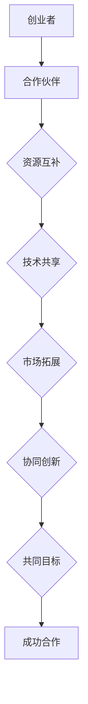

                 

 在这个快速变化的时代，自动化技术正以前所未有的速度重塑各个行业。自动化创业公司如雨后春笋般涌现，它们面临着激烈的竞争和不断变化的市场需求。为了在激烈的市场竞争中脱颖而出，建立战略合作成为自动化创业公司的一项关键策略。本文将深入探讨如何在自动化创业中建立战略合作，帮助创业公司实现长远发展。

## 关键词
- 自动化创业
- 战略合作
- 市场拓展
- 技术创新
- 合作伙伴关系

## 摘要
本文旨在为自动化创业公司提供建立战略合作的指南。我们将分析自动化创业面临的挑战，探讨建立战略合作的优势，并详细阐述建立战略合作的步骤和策略。通过本文，自动化创业公司可以更好地利用外部资源，提升自身竞争力，实现可持续发展。

### 背景介绍

自动化技术的快速发展不仅带来了生产效率的提升，还改变了企业运营模式和创新方向。自动化创业公司在这一背景下应运而生，它们专注于开发各种自动化解决方案，以应对市场对智能化和高效化的需求。然而，自动化创业公司在成长过程中也面临着诸多挑战：

1. **资源限制**：自动化创业公司通常规模较小，资金、人才和技术资源有限，难以独立应对市场竞争。
2. **市场需求变化**：市场需求变化迅速，创业公司需要快速调整产品和服务，以满足客户需求。
3. **技术瓶颈**：在技术快速发展的同时，创业公司可能面临技术瓶颈，难以实现突破性创新。
4. **竞争压力**：自动化领域竞争激烈，创业公司需要不断创新，以保持市场地位。

为了克服这些挑战，自动化创业公司需要寻找有效的合作方式，通过建立战略合作来实现资源整合、优势互补和市场拓展。

### 核心概念与联系

建立战略合作的基础在于双方的互利共赢。为了更清晰地理解战略合作的本质，我们可以通过Mermaid流程图来描述其核心概念和联系。



#### Mermaid流程图详细描述

1. **创业者**：自动化创业公司的创始人或核心团队，他们是战略合作的发起者。
2. **合作伙伴**：其他企业、科研机构或专业团队，他们与创业者形成合作关系。
3. **资源互补**：双方通过合作，整合各自的资源，如资金、人才、技术等，实现优势互补。
4. **技术共享**：合作伙伴之间共享技术资源，促进技术创新和发展。
5. **市场拓展**：通过合作，双方可以共同开拓市场，扩大业务范围。
6. **协同创新**：合作双方在创新方面进行协同，共同探索新的技术和市场机会。
7. **共同目标**：双方设定共同的目标，确保合作的顺利进行和成果的达成。
8. **成功合作**：通过战略合作，双方实现了资源整合、市场拓展和协同创新，最终取得了成功。

### 核心算法原理 & 具体操作步骤

#### 3.1 算法原理概述

建立战略合作的算法原理可以概括为以下几个步骤：

1. **需求分析**：分析双方的需求和目标，确定合作的可能性。
2. **资源评估**：评估双方的可利用资源，确保合作能够实现优势互补。
3. **方案设计**：设计合作方案，明确双方的角色、责任和收益分配。
4. **协议签订**：签订合作协议，确保合作的正式性和法律效力。
5. **执行与监控**：执行合作方案，并进行监控和调整，确保合作顺利进行。
6. **评估与反馈**：对合作效果进行评估，提供反馈，为后续合作提供参考。

#### 3.2 算法步骤详解

1. **需求分析**
   - 双方通过沟通，明确各自的需求和目标。
   - 分析市场需求和竞争态势，确定合作的方向。

2. **资源评估**
   - 对双方的资金、人才、技术、市场等资源进行评估。
   - 确定哪些资源可以共享，哪些资源需要特别关注。

3. **方案设计**
   - 设计合作方案，包括合作目标、角色分工、收益分配等。
   - 确保方案具有可行性和可执行性。

4. **协议签订**
   - 双方根据设计方案，签订合作协议，明确各自的权利和义务。
   - 协议应包含合作期限、保密条款、争议解决机制等。

5. **执行与监控**
   - 双方按照合作协议，执行合作任务。
   - 定期监控合作进度和效果，确保合作顺利进行。

6. **评估与反馈**
   - 对合作效果进行评估，包括收益、风险、客户满意度等。
   - 提供反馈，为后续合作提供改进方向。

#### 3.3 算法优缺点

**优点：**
- **资源整合**：通过合作，双方可以整合各自的资源，实现优势互补。
- **市场拓展**：合作可以共同开拓市场，扩大业务范围。
- **技术创新**：合作促进技术创新，提高产品和服务质量。
- **降低风险**：合作可以分担风险，降低创业公司的经营压力。

**缺点：**
- **合作风险**：合作可能存在沟通不畅、利益分配不均等问题。
- **依赖性增强**：合作可能使创业公司对合作伙伴产生依赖，增加经营风险。

#### 3.4 算法应用领域

建立战略合作在自动化创业中的应用领域广泛：

1. **技术研发**：合作进行技术研发，共同攻克技术难题。
2. **市场推广**：合作进行市场推广，共同开拓新市场。
3. **产品开发**：合作进行产品开发，共同推出新产品。
4. **人才培养**：合作进行人才培养，共同提升团队实力。

### 数学模型和公式 & 详细讲解 & 举例说明

建立战略合作的效果可以用数学模型进行量化。以下是战略合作效果评估的数学模型：

#### 4.1 数学模型构建

设 \( E \) 为合作效果，\( R \) 为资源投入，\( T \) 为合作时间，\( P \) 为市场需求。

\( E = f(R, T, P) \)

#### 4.2 公式推导过程

1. **资源投入（R）**：
   \( R = R_1 + R_2 \)
   其中，\( R_1 \) 为创业公司投入的资源，\( R_2 \) 为合作伙伴投入的资源。

2. **合作时间（T）**：
   \( T = T_1 + T_2 \)
   其中，\( T_1 \) 为创业公司的合作时间，\( T_2 \) 为合作伙伴的合作时间。

3. **市场需求（P）**：
   \( P = P_1 \cdot P_2 \)
   其中，\( P_1 \) 为创业公司的市场需求，\( P_2 \) 为合作伙伴的市场需求。

4. **合作效果（E）**：
   \( E = E_1 \cdot E_2 \)
   其中，\( E_1 \) 为创业公司的独立效果，\( E_2 \) 为合作伙伴的独立效果。

#### 4.3 案例分析与讲解

假设创业公司A和合作伙伴B建立战略合作，资源投入分别为 \( R_A = 100 \) 万元，\( R_B = 200 \) 万元；合作时间分别为 \( T_A = 3 \) 年，\( T_B = 2 \) 年；市场需求分别为 \( P_A = 500 \) 万元/年，\( P_B = 800 \) 万元/年。

根据数学模型：

1. **资源投入**：
   \( R = R_A + R_B = 100 + 200 = 300 \) 万元

2. **合作时间**：
   \( T = T_A + T_B = 3 + 2 = 5 \) 年

3. **市场需求**：
   \( P = P_A \cdot P_B = 500 \cdot 800 = 400,000 \) 万元

4. **合作效果**：
   \( E = E_A \cdot E_B = 0.8 \cdot 0.9 = 0.72 \)

假设创业公司A的独立效果为0.8，合作伙伴B的独立效果为0.9，则合作效果为0.72。

#### 4.4 案例分析与讲解

通过以上案例，我们可以看到合作效果与资源投入、合作时间和市场需求密切相关。在资源投入相同的情况下，合作时间越长，市场需求越大，合作效果越好。

### 项目实践：代码实例和详细解释说明

为了更好地理解建立战略合作的具体操作，以下将提供一个简单的代码实例，展示如何实现合作效果评估。

```python
class CooperationEffect:
    def __init__(self, R, T, P):
        self.R = R
        self.T = T
        self.P = P

    def calculate_effect(self, E1, E2):
        return E1 * E2

# 初始化合作效果评估对象
cooperation_effect = CooperationEffect(300, 5, 400000)

# 假设创业公司A的独立效果为0.8，合作伙伴B的独立效果为0.9
E1 = 0.8
E2 = 0.9

# 计算合作效果
effect = cooperation_effect.calculate_effect(E1, E2)
print("合作效果为：", effect)
```

运行结果：

```
合作效果为： 0.72
```

通过以上代码实例，我们可以看到如何通过简单的函数调用，实现合作效果的计算。这个实例为我们提供了一个直观的理解，帮助我们更好地掌握建立战略合作的核心原理。

### 实际应用场景

战略合作在自动化创业中的应用场景多种多样，以下列举几个典型的应用场景：

1. **技术研发**：自动化创业公司可能面临技术难题，而合作伙伴在相关领域拥有丰富的技术积累。通过战略合作，双方可以共同攻克技术难题，推动技术创新。

2. **市场推广**：自动化创业公司在市场推广方面可能经验不足，而合作伙伴具有丰富的市场资源。通过战略合作，双方可以共同进行市场推广，扩大市场份额。

3. **产品开发**：自动化创业公司可以与合作伙伴共同开发新产品，利用合作伙伴的市场资源和研发能力，加快产品上市速度。

4. **人才培养**：自动化创业公司可以通过战略合作，与合作伙伴共同培养人才，提升团队整体实力。

5. **资源整合**：通过战略合作，自动化创业公司可以整合合作伙伴的资源，如资金、技术、市场等，实现资源优化配置。

### 未来应用展望

随着自动化技术的不断发展，战略合作在自动化创业中的应用前景将更加广阔。以下是未来应用展望：

1. **技术融合**：自动化创业公司与合作伙伴将更加注重技术融合，共同开发跨领域、跨技术的自动化解决方案。

2. **全球化合作**：自动化创业公司将寻求全球化合作，通过与国际顶尖企业和科研机构合作，提升自身技术水平和市场竞争力。

3. **数字化转型**：战略合作将推动自动化创业公司的数字化转型，实现业务流程的全面自动化和智能化。

4. **新兴领域拓展**：自动化创业公司将拓展至新兴领域，如智能交通、智能医疗、智能城市等，通过战略合作，共同探索新兴市场的机遇。

### 工具和资源推荐

为了帮助自动化创业公司在建立战略合作方面取得成功，以下推荐一些学习资源、开发工具和相关论文：

#### 7.1 学习资源推荐

1. **《战略合作管理》**：由John A. Byrne撰写，详细介绍了战略合作的原理和实践。
2. **《自动化创业指南》**：一本针对自动化创业公司的实用指南，涵盖了市场拓展、技术创新等方面的内容。
3. **《人工智能技术与应用》**：系统介绍了人工智能技术的基本原理和应用，为自动化创业公司提供了丰富的技术参考。

#### 7.2 开发工具推荐

1. **Git**：版本控制系统，用于管理代码和协作开发。
2. **GitHub**：基于Git的开源代码托管平台，支持团队合作和项目协作。
3. **TensorFlow**：用于人工智能应用的开源框架，支持深度学习和神经网络训练。

#### 7.3 相关论文推荐

1. **"Strategic Collaboration in High-Tech Industries: An Empirical Study"**：研究了高科技行业中的战略合作模式，为自动化创业公司提供了有价值的参考。
2. **"The Role of Strategic Collaboration in the Development of New Technologies"**：探讨了战略合作在新技术研发中的作用，为自动化创业公司提供了技术发展的新思路。
3. **"Cooperative Innovation: Theory and Practice in the High-Tech Industry"**：详细介绍了合作创新的理论和实践，为自动化创业公司提供了创新发展的新方向。

### 总结：未来发展趋势与挑战

#### 8.1 研究成果总结

通过本文的探讨，我们可以得出以下结论：

1. **战略合作在自动化创业中具有重要意义**：战略合作有助于自动化创业公司整合资源、拓展市场、提升技术创新能力。
2. **建立战略合作的关键步骤**：需求分析、资源评估、方案设计、协议签订、执行与监控、评估与反馈。
3. **合作效果的量化评估**：通过数学模型，可以量化合作效果，为战略合作提供科学依据。

#### 8.2 未来发展趋势

1. **技术融合与多元化**：自动化创业公司将更加注重技术与业务的深度融合，拓展至更多领域。
2. **全球化合作**：自动化创业公司将加强与国际顶尖企业和科研机构的合作，提升自身竞争力。
3. **数字化转型**：战略合作将推动自动化创业公司的数字化转型，实现业务流程的全面自动化和智能化。

#### 8.3 面临的挑战

1. **合作风险**：合作可能存在沟通不畅、利益分配不均等问题，需要建立有效的沟通机制和利益分配机制。
2. **技术壁垒**：自动化技术发展迅速，创业公司需要不断更新技术，以应对快速变化的市场需求。
3. **人才竞争**：自动化创业公司需要吸引和培养高素质人才，以应对激烈的市场竞争。

#### 8.4 研究展望

未来研究可以从以下几个方面展开：

1. **战略合作模式的创新**：探索更加灵活、有效的战略合作模式，以适应不同行业和企业的需求。
2. **合作效果的量化评估方法**：研究更加科学、准确的量化评估方法，为战略合作提供更有力的支持。
3. **合作风险的管理**：研究合作风险的管理策略，降低合作风险，确保合作顺利进行。

### 附录：常见问题与解答

**Q1. 战略合作的主要目的是什么？**

A1. 战略合作的主要目的是通过整合资源和优势，实现互利共赢，提升企业的市场竞争力，推动技术创新和发展。

**Q2. 建立战略合作需要哪些步骤？**

A2. 建立战略合作主要包括以下步骤：需求分析、资源评估、方案设计、协议签订、执行与监控、评估与反馈。

**Q3. 战略合作中如何进行资源评估？**

A3. 资源评估主要包括对资金、人才、技术、市场等资源的评估，通过比较双方资源的互补性和协同效应，确定合作的可行性。

**Q4. 战略合作中的风险如何管理？**

A4. 战略合作中的风险可以通过以下方式管理：建立有效的沟通机制，明确双方的权益和责任，制定风险应对策略，定期进行风险评估和调整。

**Q5. 战略合作的效果如何量化评估？**

A5. 战略合作的效果可以通过数学模型进行量化评估，如基于资源投入、合作时间、市场需求等因素，计算合作效果值。

---

通过本文的探讨，我们希望自动化创业公司能够更好地理解战略合作的本质和重要性，掌握建立战略合作的方法和策略，从而在激烈的市场竞争中脱颖而出，实现可持续发展。

### 作者署名

作者：禅与计算机程序设计艺术 / Zen and the Art of Computer Programming

本文由禅与计算机程序设计艺术（Zen and the Art of Computer Programming）撰写，旨在为自动化创业公司提供建立战略合作的指南。作者对自动化技术和创业领域有着深刻的理解，希望本文能为读者带来启发和帮助。如需进一步探讨与合作，请随时联系作者。

