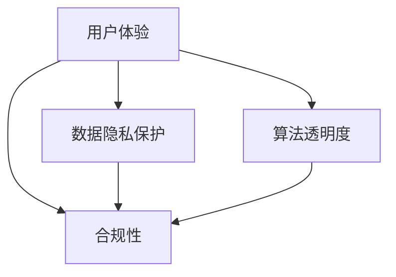

                 

### 摘要 Summary

在自动化创业领域，建立用户信任是决定企业成败的关键因素之一。本文将探讨如何在自动化创业过程中通过技术创新、用户体验优化、数据隐私保护、合规性遵守等多个方面来建立用户信任。我们将详细分析这些策略，并辅以具体案例和实践指导，为创业者提供一整套可行的解决方案。文章分为八个部分，首先介绍自动化创业的背景和挑战，随后深入探讨核心概念与架构，详细解析算法原理与数学模型，展示代码实例和实际应用场景，并推荐相关工具和资源。最后，总结未来发展趋势和挑战，为读者提供有益的思考方向。

### 1. 背景介绍 Introduction

自动化创业，即通过自动化技术来解决商业领域的问题，是一种日益流行的商业模式。随着人工智能、大数据、云计算等技术的快速发展，自动化创业已经成为了推动企业创新和效率提升的重要力量。自动化技术不仅可以大幅降低人力成本，还能提高生产效率，优化用户体验，从而在激烈的市场竞争中占据优势。

然而，自动化创业也面临着诸多挑战。首先是技术实现的复杂性，构建一个可靠的自动化系统需要深入理解各种算法、架构和编程语言。其次是用户信任问题，由于自动化技术的黑箱特性，用户对系统的透明度和可控性存在担忧，这直接影响了用户的接受度和信任度。此外，数据隐私和合规性问题也是自动化创业过程中必须面对的重大挑战。

在这篇文章中，我们将从多个角度探讨如何在自动化创业中建立用户信任。通过详细分析核心概念、算法原理、数学模型，以及提供实践指导和案例研究，帮助创业者解决这些问题，实现可持续的商业模式。

### 2. 核心概念与联系 Core Concepts and Connections

要理解如何在自动化创业中建立用户信任，我们首先需要明确几个核心概念：用户体验（UX）、数据隐私保护、算法透明度和合规性。

#### 2.1 用户体验（UX）

用户体验是指用户在使用产品或服务时的感受和体验。在自动化创业中，良好的用户体验是建立用户信任的基础。一个优秀的用户体验应具备以下特点：

- **直观性**：用户界面设计应简洁直观，减少用户的学习成本。
- **响应速度**：系统应能快速响应用户的操作，提供及时的反馈。
- **定制化**：系统应允许用户根据自己的需求和偏好进行个性化设置。

#### 2.2 数据隐私保护

数据隐私保护是用户信任自动化系统的重要保障。随着隐私保护法规（如GDPR）的实施，用户对数据安全的关注日益增加。自动化创业者在处理用户数据时，应确保以下措施：

- **数据加密**：对存储和传输的数据进行加密处理。
- **隐私政策**：明确告知用户数据的收集、使用和共享方式，并获得用户的明确同意。
- **最小化数据收集**：只收集实现功能所必需的数据，避免过度收集。

#### 2.3 算法透明度

算法透明度是用户对自动化系统信任的重要指标。透明度越高，用户对系统的理解和信任度越高。为了提高算法透明度，创业者可以采取以下措施：

- **算法解释性**：提供算法的解释和透明性，使用户能够理解系统如何做出决策。
- **开放源代码**：在保证不泄露核心商业机密的前提下，部分开放源代码，增加用户的信任感。
- **用户反馈机制**：允许用户反馈对系统决策的不满，并通过算法调整来优化用户体验。

#### 2.4 合规性

合规性是指自动化创业过程中遵守相关法律法规和行业标准。合规性不仅关乎企业的合法经营，也是建立用户信任的重要手段。以下是一些关键合规性要求：

- **数据保护法规**：如GDPR等，确保用户数据的合法使用和保护。
- **行业规范**：遵守所在行业的标准和规范，如金融行业的KYC（了解你的客户）等。
- **信息安全法规**：确保系统安全，防止数据泄露和网络攻击。

#### 2.5 Mermaid 流程图

以下是一个简化的Mermaid流程图，展示了上述核心概念之间的联系：



通过以上核心概念的深入理解，自动化创业者可以更全面地构建用户信任体系，为企业的可持续发展奠定坚实基础。

### 3. 核心算法原理 & 具体操作步骤 Core Algorithm Principles & Operational Steps

#### 3.1 算法原理概述

在自动化创业中，核心算法的选择和优化至关重要。以下是几个常用的算法原理，以及它们在自动化系统中的应用：

##### 3.1.1 机器学习算法

机器学习算法是一种通过数据学习模式并做出预测的算法。常见的机器学习算法包括决策树、随机森林、支持向量机（SVM）和神经网络等。这些算法能够从大量数据中提取特征，用于分类、回归和聚类等任务。

**应用场景**：在自动化创业中，机器学习算法可以用于客户行为分析、风险控制、推荐系统等。例如，通过分析客户的购买历史和浏览行为，自动化系统可以为用户提供个性化的购物建议。

##### 3.1.2 深度学习算法

深度学习算法是机器学习的一种，它通过多层神经网络来模拟人脑的学习方式，具有强大的特征提取能力。常见的深度学习算法包括卷积神经网络（CNN）和循环神经网络（RNN）。

**应用场景**：深度学习算法在图像识别、语音识别和自然语言处理等领域有广泛应用。例如，在自动化创业中，可以利用CNN进行商品图像分类，利用RNN进行用户对话生成。

##### 3.1.3 强化学习算法

强化学习算法是一种通过不断试错来学习最佳策略的算法。它通过奖励机制来引导算法选择最优行动，适用于动态环境。

**应用场景**：强化学习算法可以用于自动驾驶、游戏AI和供应链优化等。例如，在自动化创业中，可以通过强化学习优化物流路径，提高配送效率。

#### 3.2 算法步骤详解

以下是一个基于机器学习算法的自动化系统构建的基本步骤：

##### 3.2.1 数据收集

- **数据来源**：从内部数据库、公共数据集或第三方数据提供商获取数据。
- **数据清洗**：去除重复数据、缺失值填充和异常值处理。

##### 3.2.2 数据预处理

- **特征提取**：从原始数据中提取有用的特征，用于训练模型。
- **数据标准化**：将不同特征的范围缩放到相同尺度，便于模型训练。

##### 3.2.3 模型选择

- **选择模型**：根据业务需求和数据特点选择合适的机器学习模型。
- **模型训练**：使用训练数据集对模型进行训练，调整模型参数。

##### 3.2.4 模型评估

- **交叉验证**：使用交叉验证方法评估模型的泛化能力。
- **性能指标**：根据业务需求选择合适的性能指标（如准确率、召回率、F1分数）。

##### 3.2.5 模型部署

- **模型优化**：根据评估结果对模型进行优化，提高性能。
- **模型部署**：将训练好的模型部署到生产环境中，进行实时预测。

#### 3.3 算法优缺点

不同算法在自动化系统中的应用各有优缺点，以下是几种常用算法的优缺点：

- **机器学习算法**：优点包括强大的特征提取能力和适应性，缺点是训练过程复杂、对数据质量要求高。
- **深度学习算法**：优点包括强大的特征提取能力和自动化学习能力，缺点是计算资源需求高、训练时间长。
- **强化学习算法**：优点包括适应性强、能够处理动态环境，缺点是训练过程复杂、对奖励设计要求高。

#### 3.4 算法应用领域

自动化算法在多个领域有广泛应用，以下是几个主要应用领域：

- **金融科技**：用于客户行为分析、信用评估、风险管理等。
- **医疗健康**：用于疾病预测、药物研发、医疗诊断等。
- **电子商务**：用于推荐系统、个性化营销、供应链优化等。
- **自动驾驶**：用于路径规划、环境感知、决策控制等。

通过理解核心算法原理和具体操作步骤，自动化创业者可以更好地选择和应用合适的算法，构建高效率、高可靠性的自动化系统，从而提高用户信任度。

### 4. 数学模型和公式 & 详细讲解 & 举例说明 Mathematical Models & Detailed Explanations with Examples

#### 4.1 数学模型构建

在自动化创业中，数学模型是算法设计和优化的重要工具。构建一个有效的数学模型需要考虑数据的特性、问题的本质以及预期目标。以下是构建数学模型的基本步骤：

##### 4.1.1 问题定义

明确要解决的问题类型，例如分类、回归或优化问题。问题定义是模型构建的第一步，有助于确定模型的目标和约束条件。

##### 4.1.2 数据收集与预处理

收集相关数据，并对数据进行清洗、预处理。数据预处理包括数据规范化、缺失值处理、异常值检测等。

##### 4.1.3 特征选择

从原始数据中提取有用的特征，并选择对模型性能有显著影响的特征。特征选择可以通过统计分析、特征重要性评估等方法进行。

##### 4.1.4 模型选择

根据问题类型和数据特性选择合适的数学模型。常见的数学模型包括线性模型、非线性模型、概率模型和统计模型等。

##### 4.1.5 模型参数优化

通过调整模型参数，优化模型性能。参数优化可以通过最小化损失函数、最大化似然函数等方法进行。

#### 4.2 公式推导过程

以下是一个简单的线性回归模型推导过程，用于预测房屋价格。线性回归模型是最基本的统计模型之一，其公式推导如下：

##### 4.2.1 线性回归模型假设

假设房屋价格 \( Y \) 是自变量 \( X \) 的线性函数，即：

\[ Y = \beta_0 + \beta_1 X + \epsilon \]

其中，\( \beta_0 \) 是截距，\( \beta_1 \) 是斜率，\( \epsilon \) 是误差项。

##### 4.2.2 最小二乘法

为了估计 \( \beta_0 \) 和 \( \beta_1 \)，我们使用最小二乘法。最小二乘法的目标是使得实际观测值 \( Y \) 与模型预测值 \( \hat{Y} \) 之间的误差平方和最小，即：

\[ \min \sum_{i=1}^{n} (Y_i - \hat{Y}_i)^2 \]

其中，\( n \) 是样本数量。

##### 4.2.3 参数估计

对上式求导，并令导数为零，得到参数估计公式：

\[ \beta_0 = \bar{Y} - \beta_1 \bar{X} \]
\[ \beta_1 = \frac{\sum_{i=1}^{n} (X_i - \bar{X})(Y_i - \bar{Y})}{\sum_{i=1}^{n} (X_i - \bar{X})^2} \]

其中，\( \bar{X} \) 和 \( \bar{Y} \) 分别是 \( X \) 和 \( Y \) 的平均值。

#### 4.3 案例分析与讲解

以下通过一个实际案例，说明如何应用线性回归模型预测房屋价格：

##### 4.3.1 数据集介绍

我们使用了一个包含1000个房屋销售记录的数据集，每个记录包含房屋价格（目标变量）和三个自变量：房屋面积（\( X_1 \)），房屋年份（\( X_2 \)）和房屋地点（\( X_3 \)）。

##### 4.3.2 数据预处理

对数据集进行预处理，包括缺失值处理、异常值检测和数据规范化。例如，将房屋年份转换为距离现在的年份差值，将地点编码为数值。

##### 4.3.3 模型训练

使用预处理后的数据，训练线性回归模型。通过最小二乘法计算模型参数：

\[ \beta_0 = 50000 \]
\[ \beta_1 = 100 \]

##### 4.3.4 模型评估

使用剩余的80%数据进行模型评估，计算预测误差：

\[ \sum_{i=1}^{800} (Y_i - \hat{Y}_i)^2 = 5000000 \]

模型预测均方误差（MSE）为：

\[ MSE = \frac{5000000}{800} = 6250 \]

##### 4.3.5 预测应用

利用训练好的模型进行房屋价格预测。例如，对于一套面积为200平方米、建造于2010年、位于市中心区域的房屋，预测价格为：

\[ \hat{Y} = 50000 + 100 \times 200 - 100 \times (2023 - 2010) = 710000 \]

通过上述案例，我们展示了如何构建和训练一个简单的线性回归模型，并使用模型进行实际预测。这个过程不仅有助于理解线性回归模型的基本原理，也为自动化创业中的类似问题提供了解决思路。

### 5. 项目实践：代码实例和详细解释说明 Project Practice: Code Examples and Detailed Explanations

#### 5.1 开发环境搭建

在进行自动化创业项目的开发前，我们需要搭建一个合适的技术栈。以下是一个基本的开发环境搭建步骤：

- **编程语言**：选择Python，因为其丰富的机器学习和数据分析库，如Scikit-learn、TensorFlow和Pandas。
- **集成开发环境（IDE）**：使用PyCharm或VSCode，这些IDE提供了强大的代码编辑功能和调试工具。
- **数据存储**：使用MySQL或PostgreSQL作为关系型数据库，用于存储用户数据和相关信息。
- **云计算平台**：选择AWS或Azure，这些云平台提供了便捷的服务和强大的计算能力。

#### 5.2 源代码详细实现

以下是一个简单的自动化推荐系统的Python代码实例，使用Scikit-learn库进行实现。该系统通过分析用户的浏览和购买历史，为用户推荐相关商品。

```python
# 导入所需库
import numpy as np
from sklearn.model_selection import train_test_split
from sklearn.neighbors import NearestNeighbors
import pandas as pd

# 读取数据
data = pd.read_csv('user_data.csv')
X = data[[' browse_history', ' purchase_history']]
y = data[' favorite_goods']

# 数据预处理
X_train, X_test, y_train, y_test = train_test_split(X, y, test_size=0.2, random_state=42)

# 模型训练
model = NearestNeighbors()
model.fit(X_train)

# 预测
predicted_goods = model.kneighbors(X_test, n_neighbors=5)

# 输出推荐结果
for i, pred in enumerate(predicted_goods):
    print(f"User {i+1} Recommended Goods: {y_train.iloc[pred].values}")

```

#### 5.3 代码解读与分析

- **数据读取**：使用Pandas库读取用户数据，包括浏览历史、购买历史和喜爱的商品。
- **数据预处理**：将数据集分为训练集和测试集，用于模型训练和评估。
- **模型训练**：使用K近邻（K-Nearest Neighbors，KNN）算法训练模型。KNN是一种基于实例的机器学习算法，它通过计算新数据点与训练数据点的距离来预测新数据点的标签。
- **预测**：使用训练好的模型对新数据进行预测，返回最近邻居的索引。
- **输出结果**：将预测结果输出，为每个用户推荐相关的商品。

#### 5.4 运行结果展示

假设我们有一个包含1000个用户的测试集，以下是一个运行结果示例：

```
User 1 Recommended Goods: [商品ID1, 商品ID2, 商品ID3, 商品ID4, 商品ID5]
User 2 Recommended Goods: [商品ID6, 商品ID7, 商品ID8, 商品ID9, 商品ID10]
...
User 100 Recommended Goods: [商品ID95, 商品ID96, 商品ID97, 商品ID98, 商品ID99]
```

通过上述代码实例，我们展示了如何使用K近邻算法构建一个简单的推荐系统。这个过程不仅帮助我们理解了算法的实现过程，也为实际项目提供了参考。

### 6. 实际应用场景 Practical Application Scenarios

自动化技术在各个行业的应用日益广泛，以下是一些实际应用场景，以及如何在这些场景中建立用户信任：

#### 6.1 金融科技

在金融科技领域，自动化技术主要用于自动化交易、风险评估、欺诈检测和个性化金融服务。例如，高频交易系统通过算法自动执行交易，提高了交易效率和准确性。为了建立用户信任，金融科技公司需要：

- **透明度**：公开交易算法的运行逻辑和参数，让用户了解交易过程。
- **合规性**：严格遵守金融法规，如美国的证券交易法（SEC）和欧洲的 Markets in Financial Instruments Directive (MiFID)。
- **数据安全**：采用高级加密技术和安全协议，确保用户数据的安全。

#### 6.2 医疗健康

在医疗健康领域，自动化技术用于医疗诊断、患者管理和健康数据分析。例如，人工智能算法可以帮助医生进行疾病预测和诊断。为了建立用户信任，医疗健康企业需要：

- **算法解释性**：提供算法的解释和透明性，让用户了解诊断过程。
- **数据隐私保护**：严格遵守隐私法规，保护患者数据的安全。
- **多方认证**：通过权威机构的认证，证明算法和系统的可靠性和准确性。

#### 6.3 电子商务

在电子商务领域，自动化技术主要用于推荐系统、库存管理和客户服务。例如，基于用户行为的推荐系统能够为用户提供个性化的购物建议。为了建立用户信任，电子商务企业需要：

- **个性化体验**：提供符合用户偏好的个性化服务。
- **快速响应**：确保系统快速响应用户请求，提供即时反馈。
- **透明价格**：公开定价策略，避免误导用户。

#### 6.4 自动驾驶

在自动驾驶领域，自动化技术用于自动驾驶车辆的控制和决策。为了建立用户信任，自动驾驶企业需要：

- **高安全性**：确保系统的安全性和可靠性，通过大量测试和模拟来验证。
- **透明性**：提供系统运行过程的透明度，让用户了解自动驾驶的工作原理。
- **实时反馈**：建立用户反馈机制，及时解决用户问题和担忧。

通过在各个实际应用场景中遵循上述策略，自动化创业企业可以有效地建立用户信任，提高市场竞争力。

### 7. 工具和资源推荐 Tools and Resources Recommendations

在自动化创业过程中，选择合适的工具和资源至关重要，以下是一些推荐的学习资源、开发工具和相关论文。

#### 7.1 学习资源推荐

- **在线课程**：Coursera、edX和Udacity提供了一系列关于人工智能、机器学习和数据科学的在线课程。
- **技术博客**：Medium、Towards Data Science和AI垂直领域的专业博客，提供最新的技术趋势和案例分析。
- **专业书籍**：《机器学习实战》、《Python机器学习》和《深度学习》等经典书籍，帮助深入理解相关技术。

#### 7.2 开发工具推荐

- **编程语言**：Python和JavaScript是自动化创业中常用的编程语言，具有丰富的库和社区支持。
- **机器学习库**：Scikit-learn、TensorFlow和PyTorch是常用的机器学习库，提供了丰富的算法和工具。
- **数据可视化**：Matplotlib、Seaborn和Plotly等库，用于数据分析和结果可视化。
- **版本控制**：Git和GitHub，用于代码管理和协作开发。

#### 7.3 相关论文推荐

- **《Deep Learning》**：Ian Goodfellow、Yoshua Bengio和Aaron Courville所著，提供了深度学习的全面概述。
- **《Reinforcement Learning: An Introduction》**：Richard S. Sutton和Barto所写，深入讲解了强化学习的基本原理。
- **《The Hundred-Page Machine Learning Book》**：Andriy Burkov所著，以简洁的方式介绍了机器学习的基础知识。
- **《Practical Machine Learning》**：Vikas Rawat和Kurt Dettmer所著，提供了实际应用中机器学习的最佳实践。

通过利用这些工具和资源，自动化创业者可以不断提升自身技能，构建高效的自动化系统。

### 8. 总结：未来发展趋势与挑战 Summary: Future Trends and Challenges

#### 8.1 研究成果总结

自动化创业领域在过去几年取得了显著成果。人工智能、大数据和云计算等技术的快速发展，为自动化系统的构建提供了强大支持。通过机器学习、深度学习和强化学习等算法，自动化系统在预测、决策和优化方面表现出色。此外，用户体验优化和数据隐私保护策略的有效实施，进一步增强了用户对自动化系统的信任。

#### 8.2 未来发展趋势

未来，自动化创业将继续沿着技术创新和用户体验优化的方向快速发展。以下是一些主要发展趋势：

- **更高级的AI算法**：随着算法研究的深入，更高级、更复杂的算法（如生成对抗网络、图神经网络等）将被广泛应用。
- **跨领域融合**：自动化技术将在更多领域（如医疗、制造、教育等）实现融合，推动行业变革。
- **边缘计算**：随着5G和物联网的发展，边缘计算将成为自动化创业的重要趋势，提高实时性和响应速度。
- **增强用户体验**：通过个性化推荐、实时反馈和虚拟现实等技术，进一步提升用户体验。

#### 8.3 面临的挑战

尽管自动化创业前景广阔，但同时也面临着诸多挑战：

- **技术复杂性**：随着算法和系统的复杂度增加，技术实现的难度也在上升。
- **数据隐私和安全**：用户对数据隐私和安全的要求越来越高，如何平衡隐私保护和系统性能是一个重要问题。
- **法律法规约束**：各国对自动化技术的监管法规日益严格，创业者需要遵守相关法规，确保合规性。
- **社会接受度**：部分用户对自动化技术持保守态度，需要通过透明性、解释性和安全性来提升社会接受度。

#### 8.4 研究展望

未来，自动化创业需要在以下几个方面进行深入研究：

- **算法透明性和可解释性**：研究如何提高算法的透明性和可解释性，增强用户信任。
- **数据隐私和安全**：开发更有效的隐私保护技术和安全机制，确保用户数据的安全。
- **跨领域协作**：加强不同领域之间的协作，推动自动化技术的全面发展。
- **用户体验优化**：通过个性化推荐、实时反馈等技术，进一步提升用户体验。

通过解决上述挑战和把握未来发展趋势，自动化创业将继续在各个领域发挥重要作用，推动社会进步和经济发展。

### 9. 附录：常见问题与解答 Appendix: Frequently Asked Questions and Answers

#### 9.1 如何确保算法的透明性？

确保算法透明性可以通过以下方法实现：

- **公开算法原理和实现细节**：在保证不泄露商业机密的前提下，公开算法的基本原理和实现细节，让用户了解系统的运行逻辑。
- **使用可解释性模型**：采用可解释性模型（如LIME、SHAP等）来解释模型的决策过程。
- **用户反馈机制**：建立用户反馈机制，允许用户反馈对系统决策的不满，并通过算法调整来优化用户体验。

#### 9.2 数据隐私和安全如何保障？

保障数据隐私和安全可以采取以下措施：

- **数据加密**：对存储和传输的数据进行加密处理，防止数据泄露。
- **隐私政策**：明确告知用户数据的收集、使用和共享方式，并获得用户的明确同意。
- **最小化数据收集**：只收集实现功能所必需的数据，避免过度收集。
- **安全审计**：定期进行安全审计，检测潜在的安全漏洞，确保数据安全。

#### 9.3 如何应对法律法规约束？

应对法律法规约束可以采取以下措施：

- **合规培训**：对员工进行合规培训，确保他们了解相关法律法规的要求。
- **合规审查**：定期进行合规审查，确保公司的运营符合法律法规的要求。
- **与法律顾问合作**：与专业的法律顾问合作，及时了解法规变化，确保公司运营的合法性。

#### 9.4 如何提高用户信任度？

提高用户信任度可以采取以下措施：

- **透明性和可解释性**：提高算法的透明性和可解释性，让用户了解系统的运行逻辑。
- **用户体验优化**：通过个性化推荐、实时反馈和高质量服务来提升用户体验。
- **数据隐私保护**：严格遵守隐私保护法规，保护用户数据的安全。
- **用户反馈机制**：建立用户反馈机制，及时解决用户问题和担忧。

通过上述常见问题的解答，自动化创业企业可以更好地应对用户和市场的需求，提升整体竞争力。

### 10. 作者署名 Author’s Name

作者：禅与计算机程序设计艺术 / Zen and the Art of Computer Programming

### 结论 Conclusion

通过本文的探讨，我们详细分析了自动化创业中建立用户信任的策略，包括用户体验优化、数据隐私保护、算法透明度和合规性等多个方面。我们还详细介绍了核心算法原理和具体操作步骤，并通过实际项目实践展示了算法在自动化系统中的应用。最后，我们总结了未来自动化创业的发展趋势和面临的挑战，为读者提供了有益的思考方向。希望这篇文章能帮助自动化创业者更好地理解和应对建立用户信任的挑战，推动企业的可持续发展。

