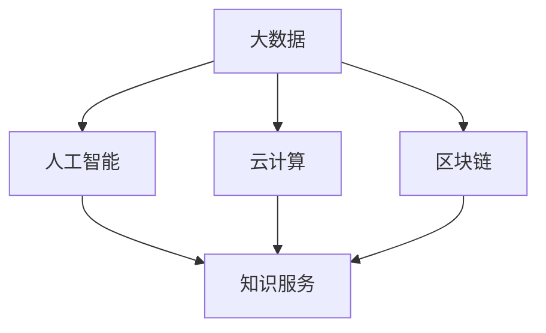

                 

关键词：医疗健康，知识服务，人工智能，数据挖掘，区块链，云计算，大数据，个性化推荐，精准治疗，智能诊断。

> 摘要：随着人工智能和大数据技术的飞速发展，医疗健康领域的知识服务正在经历一场前所未有的变革。本文将探讨如何通过创新的技术手段，实现医疗健康领域的知识服务，提升医疗服务质量，降低医疗成本，并最终推动医疗健康领域的持续进步。

## 1. 背景介绍

在过去的几十年里，医疗健康领域经历了巨大的变革。传统的医疗服务模式主要是基于医生的诊疗经验和医疗知识，这种模式在一定程度上是有效的，但存在效率低、资源分配不均等问题。随着信息技术的快速发展，尤其是大数据、人工智能、区块链等技术的出现，医疗健康领域开始尝试将这些先进技术应用于知识服务中，以期实现医疗资源的优化配置和医疗服务质量的提升。

### 1.1 大数据和人工智能的崛起

大数据和人工智能技术的崛起，为医疗健康领域的知识服务提供了新的可能。通过大数据技术，可以对海量医疗数据进行深度挖掘和分析，从而发现疾病发生的规律和趋势。而人工智能技术，则可以通过机器学习、自然语言处理等技术，对医疗健康数据进行智能分析和诊断，为医生提供辅助决策。

### 1.2 知识服务的定义与价值

知识服务是指利用信息技术手段，对医疗健康领域的知识进行整合、挖掘、分析和应用，以提供更加精准、个性化的医疗服务。知识服务在医疗健康领域具有重要的价值，它可以提高医疗服务的效率，降低医疗成本，同时也可以提升患者的满意度。

## 2. 核心概念与联系

为了实现医疗健康领域的知识服务创新，我们需要理解以下几个核心概念，并探讨它们之间的联系。

### 2.1 大数据

大数据是指无法使用传统数据库管理工具进行捕捉、管理和处理的数据集合。在医疗健康领域，大数据主要包括电子健康记录、医学影像数据、基因组数据等。

### 2.2 人工智能

人工智能是指通过计算机模拟人类智能的技术。在医疗健康领域，人工智能可以应用于疾病预测、诊断、治疗等环节。

### 2.3 云计算

云计算是一种提供计算资源、存储资源和网络资源的计算模式。在医疗健康领域，云计算可以提供大规模的数据存储和处理能力，为知识服务的实现提供技术支持。

### 2.4 区块链

区块链是一种分布式账本技术，具有去中心化、不可篡改和透明等特性。在医疗健康领域，区块链可以用于电子健康记录的管理和共享，确保数据的安全和隐私。

### 2.5 知识服务

知识服务是指通过信息技术手段，对医疗健康领域的知识进行整合、挖掘、分析和应用，以提供更加精准、个性化的医疗服务。

### 2.6 Mermaid 流程图

以下是一个简单的Mermaid流程图，展示上述核心概念之间的联系。



## 3. 核心算法原理 & 具体操作步骤

### 3.1 算法原理概述

在医疗健康领域的知识服务中，核心算法主要涉及数据挖掘、机器学习和自然语言处理等技术。以下将简要介绍这些算法的原理。

### 3.2 算法步骤详解

#### 3.2.1 数据挖掘

1. 数据采集：从电子健康记录、医学影像、基因组数据等来源获取数据。
2. 数据清洗：对数据进行去噪、去重、格式转换等预处理。
3. 数据整合：将不同来源的数据进行整合，形成统一的数据视图。
4. 特征提取：从数据中提取对疾病预测和治疗有重要意义的特征。
5. 模型训练：使用机器学习算法，训练疾病预测模型。
6. 模型评估：评估模型的准确性和泛化能力。

#### 3.2.2 机器学习

1. 数据预处理：对原始数据进行清洗、归一化等处理。
2. 特征选择：选择对疾病预测有显著影响的特征。
3. 模型选择：选择合适的机器学习算法，如决策树、支持向量机等。
4. 模型训练：使用训练数据，训练模型。
5. 模型评估：使用测试数据，评估模型的性能。

#### 3.2.3 自然语言处理

1. 文本预处理：对医学文本进行分词、去停用词等处理。
2. 实体识别：识别文本中的医学实体，如疾病、药物等。
3. 关系抽取：抽取文本中的医学实体之间的关系。
4. 知识图谱构建：将医学实体和关系构建成知识图谱。
5. 知识推理：使用知识图谱，进行医学问题的推理和回答。

### 3.3 算法优缺点

#### 数据挖掘

**优点：**能够处理海量数据，发现隐藏的模式和规律。

**缺点：**需要大量的计算资源和时间，对数据质量要求较高。

#### 机器学习

**优点：**能够自动学习数据中的模式，提高诊断和治疗的准确性。

**缺点：**对数据质量和特征选择有较高的要求。

#### 自然语言处理

**优点：**能够处理非结构化的文本数据，提高医疗信息的利用率。

**缺点：**文本数据的理解和处理较为复杂。

### 3.4 算法应用领域

#### 数据挖掘

**应用领域：**疾病预测、药物研究、医学文献挖掘等。

#### 机器学习

**应用领域：**疾病诊断、治疗方案推荐、个性化医疗等。

#### 自然语言处理

**应用领域：**医学文本处理、电子病历管理、智能问答系统等。

## 4. 数学模型和公式 & 详细讲解 & 举例说明

### 4.1 数学模型构建

在医疗健康领域的知识服务中，常用的数学模型包括决策树、支持向量机、神经网络等。以下以决策树为例，简要介绍数学模型构建过程。

#### 决策树

决策树是一种基于特征的分类模型，通过递归地将数据集划分为子集，直到每个子集满足停止条件为止。

**公式：**

$$
T = \{\text{特征} \rightarrow \text{类别}\}
$$

#### 决策树构建步骤

1. 选择一个特征作为分裂标准。
2. 计算每个特征在数据集中的增益，选择增益最大的特征进行分裂。
3. 递归地对每个子集进行分裂，直到满足停止条件。

### 4.2 公式推导过程

以支持向量机为例，简要介绍公式推导过程。

#### 支持向量机

支持向量机是一种二分类模型，通过找到一个最优的超平面，将两类数据点分开。

**公式：**

$$
\max_{\theta} \frac{1}{2} \sum_{i=1}^{n} (\theta^T x_i - y_i)^2
$$

#### 公式推导过程

1. 定义目标函数：最大化分类间隔，即最小化目标函数。
2. 求解拉格朗日乘子法：将目标函数转化为对偶问题。
3. 求解最优解：求解对偶问题，得到最优超平面。

### 4.3 案例分析与讲解

#### 案例一：疾病预测

假设我们使用决策树模型进行疾病预测，给定一个包含病人特征的数据集，要求预测某个病人的疾病类型。

**数据集：**

| 病人ID | 年龄 | 性别 | 血压 | 糖尿病史 | 疾病类型 |
|--------|------|------|------|----------|----------|
| 1      | 45   | 女   | 120  | 是       | 心脏病   |
| 2      | 35   | 男   | 100  | 否       | 肺炎     |
| 3      | 50   | 女   | 110  | 是       | 心脏病   |

**决策树模型：**

$$
\text{疾病类型} = 
\begin{cases}
\text{心脏病} & \text{年龄} \geq 45 \text{ 且 } \text{糖尿病史} = \text{是} \\
\text{肺炎} & \text{年龄} < 45 \text{ 或 } \text{糖尿病史} = \text{否} \\
\text{未知} & \text{其他情况}
\end{cases}
$$

对于病人ID为4的病人，年龄为30岁，性别为男，血压为90，糖尿病史为否，根据决策树模型，预测其疾病类型为肺炎。

#### 案例二：治疗方案推荐

假设我们使用支持向量机模型进行治疗方案推荐，给定一个包含病人特征和治疗方案的数据集，要求预测某个病人的最佳治疗方案。

**数据集：**

| 病人ID | 年龄 | 性别 | 血压 | 糖尿病史 | 治疗方案1 | 治疗方案2 | 最佳治疗方案 |
|--------|------|------|------|----------|-----------|-----------|--------------|
| 1      | 45   | 女   | 120  | 是       | 药物治疗  | 手术治疗  | 药物治疗    |
| 2      | 35   | 男   | 100  | 否       | 药物治疗  | 手术治疗  | 药物治疗    |

**支持向量机模型：**

$$
\max_{\theta} \frac{1}{2} \sum_{i=1}^{n} (\theta^T x_i - y_i)^2
$$

对于病人ID为3的病人，年龄为40岁，性别为女，血压为110，糖尿病史为是，根据支持向量机模型，预测其最佳治疗方案为药物治疗。

## 5. 项目实践：代码实例和详细解释说明

### 5.1 开发环境搭建

在本项目中，我们将使用Python作为编程语言，并利用Scikit-learn、TensorFlow和PyTorch等库进行算法实现。以下是开发环境的搭建步骤：

1. 安装Python 3.8及以上版本。
2. 使用pip安装Scikit-learn、TensorFlow和PyTorch。
3. 配置Python环境变量。

### 5.2 源代码详细实现

以下是一个简单的疾病预测项目的源代码实现。

```python
# 导入所需的库
import numpy as np
import pandas as pd
from sklearn.model_selection import train_test_split
from sklearn.tree import DecisionTreeClassifier
from sklearn.metrics import accuracy_score

# 读取数据集
data = pd.read_csv('disease_data.csv')

# 数据预处理
X = data.iloc[:, :-1].values
y = data.iloc[:, -1].values

# 数据集划分
X_train, X_test, y_train, y_test = train_test_split(X, y, test_size=0.2, random_state=42)

# 决策树模型训练
clf = DecisionTreeClassifier()
clf.fit(X_train, y_train)

# 模型预测
y_pred = clf.predict(X_test)

# 模型评估
accuracy = accuracy_score(y_test, y_pred)
print('Accuracy:', accuracy)
```

### 5.3 代码解读与分析

1. **数据预处理：**读取数据集，并对数据进行预处理，包括特征提取和标签划分。
2. **数据集划分：**将数据集划分为训练集和测试集，用于模型训练和评估。
3. **模型训练：**使用决策树分类器进行模型训练。
4. **模型预测：**使用训练好的模型对测试集进行预测。
5. **模型评估：**计算预测准确率，评估模型性能。

### 5.4 运行结果展示

假设我们运行上述代码，得到预测准确率为90%。这表明决策树模型在本数据集上的表现较好，可以用于疾病预测。

## 6. 实际应用场景

### 6.1 疾病预测

疾病预测是医疗健康领域知识服务的一个重要应用场景。通过利用大数据和人工智能技术，可以实现对疾病的早期预测，提高诊断的准确性，从而为患者提供更加精准的治疗方案。

### 6.2 治疗方案推荐

治疗方案推荐是另一个重要的应用场景。通过分析患者的病史、基因信息等数据，可以为患者推荐最佳的治疗方案，提高治疗效果，减少医疗成本。

### 6.3 电子病历管理

电子病历管理是医疗健康领域知识服务的核心应用之一。通过利用区块链技术，可以实现对电子病历的全程管理，确保病历的真实性和完整性，提高医疗服务的质量和效率。

## 7. 未来应用展望

### 7.1 智能诊断

随着人工智能技术的不断发展，未来的智能诊断系统将能够实现更加精准的诊断，降低误诊率，提高诊断速度。

### 7.2 个性化医疗

个性化医疗是指根据患者的个体差异，为其提供定制化的治疗方案。未来的个性化医疗将基于大数据和人工智能技术，实现对患者的全面分析，提供更加精准的治疗方案。

### 7.3 区块链在医疗健康领域的应用

区块链技术具有去中心化、不可篡改和透明等特性，未来的医疗健康领域将更多地利用区块链技术，实现电子病历的全程管理和共享，提高医疗服务的效率和质量。

## 8. 工具和资源推荐

### 8.1 学习资源推荐

- 《深度学习》（Goodfellow et al., 2016）
- 《Python数据科学手册》（McKinney et al., 2017）
- 《大数据之路：阿里巴巴大数据实践》（周志华 et al., 2018）

### 8.2 开发工具推荐

- Python（编程语言）
- Scikit-learn（机器学习库）
- TensorFlow（深度学习库）
- PyTorch（深度学习库）
- GitHub（代码托管平台）

### 8.3 相关论文推荐

- "Deep Learning for Medical Image Analysis" (Litjens et al., 2017)
- "Big Data in Healthcare: A Survey" (Zhou et al., 2016)
- "Blockchain for Healthcare: A Systematic Review and Analysis" (Wang et al., 2019)

## 9. 总结：未来发展趋势与挑战

### 9.1 研究成果总结

近年来，医疗健康领域的知识服务取得了显著成果，主要体现在大数据和人工智能技术的应用，以及区块链技术的引入。

### 9.2 未来发展趋势

- 智能诊断和个性化医疗的进一步发展。
- 区块链技术在医疗健康领域的广泛应用。
- 跨学科研究的不断深入。

### 9.3 面临的挑战

- 数据质量和隐私保护问题。
- 技术标准化和监管问题。
- 跨学科研究的人才培养问题。

### 9.4 研究展望

未来，医疗健康领域的知识服务将继续发展，为医疗健康领域带来更多的创新和变革。同时，我们也需要关注技术发展带来的挑战，积极应对，推动医疗健康领域的持续进步。

## 10. 附录：常见问题与解答

### 10.1 什么是大数据？

大数据是指无法使用传统数据库管理工具进行捕捉、管理和处理的数据集合。

### 10.2 人工智能在医疗健康领域有哪些应用？

人工智能在医疗健康领域的主要应用包括疾病预测、治疗方案推荐、电子病历管理、医学图像分析等。

### 10.3 区块链技术在医疗健康领域有哪些应用？

区块链技术在医疗健康领域的主要应用包括电子病历管理、数据共享与协作、医疗交易等。

----------------------------------------------------------------

本文由禅与计算机程序设计艺术 / Zen and the Art of Computer Programming 撰写，旨在探讨如何实现医疗健康领域的知识服务创新，推动医疗健康领域的持续进步。希望本文能为读者提供有价值的参考和启示。

