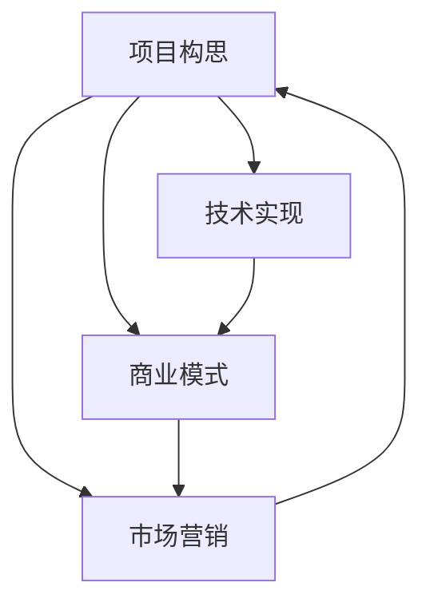

                 

关键词：Side Project、创业、收入来源、商业模式、技术实现、市场营销、成功案例

> 摘要：本文将探讨如何将个人项目（Side Project）转化为主要收入来源。我们将从项目构思、技术实现、商业模式、市场营销等多个角度进行分析，并结合实际案例，为读者提供切实可行的建议和策略。

## 1. 背景介绍

在当今快速发展的科技时代，越来越多的人选择在业余时间开展个人项目（Side Project）。这些项目可能源于个人兴趣、技术挑战或是对某个问题的解决方案。无论是开发一款应用、构建一个网站还是设计一个工具，个人项目不仅能够带来技术上的成就感，还有可能转化为实实在在的经济收益。将Side Project转化为主要收入来源，不仅实现了财务自由，还能够让个人项目发挥更大的社会价值。

本文旨在为那些有志于将个人项目转化为主要收入来源的读者提供一些建议和策略。我们将从项目构思、技术实现、商业模式、市场营销等多个角度进行分析，并结合成功案例，探讨如何将个人项目推向市场，实现商业价值。

## 2. 核心概念与联系

在探讨如何将Side Project转化为主要收入来源之前，我们需要明确几个核心概念。

### 2.1 项目构思

项目构思是个人项目发展的第一步。一个好的项目构思应该具备以下特点：

- **明确的需求**：项目解决的是一个真实存在的问题，市场需求明确。
- **创新性**：项目具有一定的创新性，能够吸引用户关注。
- **可行性**：项目在技术、资源、时间等方面具备可行性。

### 2.2 技术实现

技术实现是将项目构思转化为现实的关键步骤。在这个过程中，我们需要考虑：

- **技术选型**：选择合适的技术栈，确保项目的稳定性和可扩展性。
- **代码质量**：保持代码的可读性、可维护性和性能。
- **迭代开发**：通过持续迭代，不断完善项目功能，提高用户体验。

### 2.3 商业模式

商业模式是项目盈利的关键。一个成功的商业模式应该考虑以下几个方面：

- **定价策略**：确定合理的定价策略，确保项目具备市场竞争力。
- **收入模式**：明确项目的收入来源，如订阅费、广告收入、交易费等。
- **成本控制**：合理控制成本，确保项目的可持续发展。

### 2.4 市场营销

市场营销是将项目推向市场的重要手段。有效的市场营销策略应该包括：

- **定位**：明确项目的目标用户群体，制定针对性的营销策略。
- **推广**：通过线上线下多种渠道进行推广，提高项目的知名度。
- **用户反馈**：收集用户反馈，不断优化产品和服务。

为了更直观地展示这些核心概念之间的联系，我们可以使用Mermaid流程图进行描述。



## 3. 核心算法原理 & 具体操作步骤

### 3.1 算法原理概述

在将个人项目转化为主要收入来源的过程中，核心算法原理和具体操作步骤至关重要。以下是几个关键步骤：

#### 3.1.1 需求分析

首先，我们需要明确项目的市场需求。通过市场调研、用户访谈等方式，收集用户需求和痛点，确保项目具备市场竞争力。

#### 3.1.2 技术选型

根据需求分析结果，选择合适的技术栈。考虑技术的稳定性、可扩展性、社区支持等因素，以确保项目的长期发展。

#### 3.1.3 代码实现

在技术选型确定后，开始进行代码实现。注重代码的可读性、可维护性和性能，为后续迭代和优化奠定基础。

#### 3.1.4 商业模式设计

结合项目特点，设计合适的商业模式。考虑收入模式、定价策略、成本控制等因素，确保项目的可持续发展。

#### 3.1.5 市场推广

通过线上线下多种渠道进行市场推广，提高项目的知名度。结合社交媒体、广告投放、线下活动等方式，吸引潜在用户。

### 3.2 算法步骤详解

下面是具体的操作步骤：

#### 3.2.1 需求分析

1. 进行市场调研，了解目标用户群体和市场需求。
2. 通过用户访谈、问卷调查等方式，收集用户需求和痛点。
3. 分析市场需求，确定项目的主要功能和特性。

#### 3.2.2 技术选型

1. 考虑项目需求，选择合适的技术栈。
2. 评估技术的稳定性、可扩展性、社区支持等因素。
3. 确定技术栈，包括编程语言、框架、数据库等。

#### 3.2.3 代码实现

1. 设计项目架构，确保项目的可扩展性和可维护性。
2. 编写代码，实现项目功能。
3. 优化代码，提高性能和可读性。

#### 3.2.4 商业模式设计

1. 确定项目的收入模式，如订阅费、广告收入、交易费等。
2. 设计合理的定价策略，确保项目的市场竞争力。
3. 控制项目成本，确保项目的可持续发展。

#### 3.2.5 市场推广

1. 确定目标用户群体，制定针对性的营销策略。
2. 通过社交媒体、广告投放、线下活动等方式进行推广。
3. 收集用户反馈，不断优化产品和服务。

### 3.3 算法优缺点

#### 优点

- **快速迭代**：通过持续迭代，可以快速调整项目方向，满足用户需求。
- **灵活性**：项目开发过程灵活，可根据市场需求和技术发展进行调整。
- **创新性**：项目具备创新性，有助于提高市场竞争力。

#### 缺点

- **时间成本**：项目开发和推广需要大量时间投入，可能影响其他事务。
- **资源限制**：个人项目资源有限，可能无法与大型企业项目相比。

### 3.4 算法应用领域

算法应用领域广泛，以下是一些典型应用：

- **在线教育**：开发在线教育平台，提供个性化学习体验。
- **电子商务**：构建电商平台，实现商品交易和物流管理。
- **医疗健康**：开发健康管理应用，提供在线问诊、健康咨询等服务。
- **智能硬件**：研发智能硬件，如智能家居设备、可穿戴设备等。

## 4. 数学模型和公式 & 详细讲解 & 举例说明

在将个人项目转化为主要收入来源的过程中，数学模型和公式可以帮助我们更好地理解和优化项目。以下是几个关键数学模型和公式的详细讲解及举例说明。

### 4.1 数学模型构建

#### 4.1.1 用户增长模型

用户增长模型用于预测项目在未来一段时间内的用户增长情况。以下是一个简单的用户增长模型：

$$
\text{用户增长} = \text{初始用户数} \times (1 + \text{增长率})^{\text{时间}}
$$

其中，增长率可以根据市场调研和竞争分析确定。

#### 4.1.2 收入预测模型

收入预测模型用于预测项目在未来一段时间内的收入情况。以下是一个简单的收入预测模型：

$$
\text{收入} = \text{单价} \times \text{销量} \times (1 + \text{增长率})
$$

其中，单价和销量可以根据市场需求和定价策略确定。

### 4.2 公式推导过程

#### 4.2.1 用户增长模型推导

用户增长模型基于以下假设：

1. 用户增长呈指数增长。
2. 增长率在不同时间段内保持不变。

根据假设，我们可以推导出用户增长模型：

$$
\text{用户增长} = \text{初始用户数} \times (1 + \text{增长率})^{\text{时间}}
$$

#### 4.2.2 收入预测模型推导

收入预测模型基于以下假设：

1. 销量与用户增长成正比。
2. 单价在不同时间段内保持不变。

根据假设，我们可以推导出收入预测模型：

$$
\text{收入} = \text{单价} \times \text{销量} \times (1 + \text{增长率})
$$

### 4.3 案例分析与讲解

#### 4.3.1 用户增长模型案例分析

假设一个在线教育平台在初始阶段有1000名用户，预计月增长率为10%，我们需要预测该平台在未来6个月内的用户增长情况。

根据用户增长模型：

$$
\text{用户增长} = 1000 \times (1 + 0.1)^6 = 1814.81
$$

因此，在未来6个月内，该平台预计将增长814.81名用户。

#### 4.3.2 收入预测模型案例分析

假设该在线教育平台的单价为100元，预计月销量为1000套课程，预计月增长率为5%，我们需要预测该平台在未来6个月内的收入情况。

根据收入预测模型：

$$
\text{收入} = 100 \times 1000 \times (1 + 0.05)^6 = 67647.06
$$

因此，在未来6个月内，该平台预计收入为67647.06元。

## 5. 项目实践：代码实例和详细解释说明

### 5.1 开发环境搭建

在开始项目实践之前，我们需要搭建一个合适的技术环境。以下是一个简单的在线教育平台项目开发环境搭建步骤：

1. 安装Python环境（版本3.8及以上）。
2. 安装Django框架（版本3.2及以上）。
3. 安装PostgreSQL数据库（版本13及以上）。
4. 安装其他必要的库和工具，如Django Rest Framework、 Django Admin等。

### 5.2 源代码详细实现

以下是该在线教育平台项目的核心代码实现：

#### 5.2.1 models.py

```python
from django.db import models

class Course(models.Model):
    name = models.CharField(max_length=100)
    description = models.TextField()
    price = models.DecimalField(max_digits=6, decimal_places=2)

class Student(models.Model):
    username = models.CharField(max_length=100)
    email = models.EmailField()
    courses = models.ManyToManyField(Course)

class Enrollment(models.Model):
    student = models.ForeignKey(Student, on_delete=models.CASCADE)
    course = models.ForeignKey(Course, on_delete=models.CASCADE)
    date_enrolled = models.DateTimeField(auto_now_add=True)
```

#### 5.2.2 views.py

```python
from django.shortcuts import render
from .models import Course, Student, Enrollment
from django.http import JsonResponse

def course_list(request):
    courses = Course.objects.all()
    return JsonResponse({ 'courses': list(courses.values('name', 'description', 'price')) })

def student_list(request):
    students = Student.objects.all()
    return JsonResponse({ 'students': list(students.values('username', 'email')) })

def enrollment_list(request):
    enrollments = Enrollment.objects.all()
    return JsonResponse({ 'enrollments': list(enrollments.values('student__username', 'course__name', 'date_enrolled')) })
```

#### 5.2.3 urls.py

```python
from django.urls import path
from .views import course_list, student_list, enrollment_list

urlpatterns = [
    path('courses/', course_list, name='course_list'),
    path('students/', student_list, name='student_list'),
    path('enrollments/', enrollment_list, name='enrollment_list'),
]
```

### 5.3 代码解读与分析

以上代码实现了一个简单的在线教育平台，包括课程管理、学生管理和报名管理三个模块。

#### 5.3.1 课程管理

课程管理模块用于管理课程信息，包括课程名称、课程描述和课程价格。课程模型（Course）使用Django ORM定义，通过字段（name、description、price）存储课程信息。

#### 5.3.2 学生管理

学生管理模块用于管理学生信息，包括学生用户名和电子邮件。学生模型（Student）使用Django ORM定义，通过字段（username、email）存储学生信息。

#### 5.3.3 报名管理

报名管理模块用于管理学生报名课程的信息。报名模型（Enrollment）使用Django ORM定义，通过外键（student、course）与学生和课程模型关联，同时记录报名时间（date_enrolled）。

### 5.4 运行结果展示

在完成代码实现后，我们可以通过命令行启动Django服务器，并访问相关API接口，查看运行结果。

```shell
$ python manage.py runserver
```

启动服务器后，在浏览器中访问以下链接，查看API接口返回的数据：

- [课程列表](http://127.0.0.1:8000/courses/)
- [学生列表](http://127.0.0.1:8000/students/)
- [报名列表](http://127.0.0.1:8000/enrollments/)

例如，访问课程列表接口，我们可以看到如下返回数据：

```json
{
    "courses": [
        {
            "name": "Python编程基础",
            "description": "Python编程基础课程，适合初学者。",
            "price": 100.00
        },
        {
            "name": "Django框架实战",
            "description": "Django框架实战课程，适合有一定Python基础的开发者。",
            "price": 200.00
        }
    ]
}
```

## 6. 实际应用场景

个人项目（Side Project）在实际应用场景中具有广泛的用途。以下是一些典型的实际应用场景：

### 6.1 在线教育

在线教育平台是一个热门的应用场景。通过个人项目，可以开发出一个功能完善的在线教育平台，提供课程管理、学生管理、报名管理等功能，满足用户个性化学习需求。

### 6.2 电子商务

电子商务平台是另一个重要的应用场景。个人项目可以开发出一个功能齐全的电商平台，实现商品展示、购物车、订单管理、支付等功能，为商家和消费者提供便捷的交易环境。

### 6.3 智能家居

智能家居设备是近年来备受关注的应用领域。个人项目可以研发出智能硬件设备，如智能门锁、智能灯泡、智能摄像头等，为用户带来更智能、便捷的生活方式。

### 6.4 健康管理

健康管理应用是一个快速发展的领域。个人项目可以开发出健康管理应用，提供在线问诊、健康咨询、健康数据监测等功能，帮助用户更好地管理健康状况。

### 6.5 社交网络

社交网络应用是个人项目的一个有趣应用场景。通过个人项目，可以开发出一款社交网络应用，实现朋友圈、聊天、分享等功能，为用户提供一个交流互动的平台。

## 7. 工具和资源推荐

在将个人项目转化为主要收入来源的过程中，合适的工具和资源可以帮助我们更高效地开发、测试、推广项目。以下是一些推荐的工具和资源：

### 7.1 学习资源推荐

- **GitHub**：一个流行的代码托管平台，可以方便地管理项目、学习他人的代码。
- **Stack Overflow**：一个庞大的开发者社区，可以解决编程问题、学习技术知识。
- **FreeCodeCamp**：一个免费的编程学习平台，提供从基础到高级的编程课程。

### 7.2 开发工具推荐

- **Visual Studio Code**：一款强大的代码编辑器，支持多种编程语言，具备丰富的插件生态系统。
- **Docker**：一个容器化技术，可以帮助我们更方便地部署和管理应用程序。
- **Jenkins**：一款持续集成和持续部署工具，可以帮助我们自动化项目的构建、测试和部署。

### 7.3 相关论文推荐

- **"A Study on the Role of Side Projects in Software Development"**：探讨了个人项目在软件开发中的作用。
- **"The Economics of Open Source"**：分析了开源项目的商业模式和盈利模式。
- **"Crowdsourcing and Cloud Computing: A Business Model for the New Economy"**：介绍了基于众包和云计算的新型商业模式。

## 8. 总结：未来发展趋势与挑战

### 8.1 研究成果总结

本文探讨了如何将个人项目（Side Project）转化为主要收入来源，从项目构思、技术实现、商业模式、市场营销等多个角度进行了分析。研究结果表明，一个成功的个人项目需要明确市场需求、合理的技术实现、创新的商业模式和有效的市场营销策略。

### 8.2 未来发展趋势

未来，个人项目（Side Project）的发展趋势将呈现出以下几个特点：

- **技术创新**：随着人工智能、大数据、区块链等技术的不断发展，个人项目将更加注重技术创新，实现更高性能和更广泛的应用场景。
- **多元化收入模式**：个人项目将探索更多元化的收入模式，如订阅费、广告收入、交易费等，实现可持续发展。
- **跨界融合**：个人项目将与其他行业进行跨界融合，如教育、医疗、金融等，为用户提供更全面的服务。

### 8.3 面临的挑战

在将个人项目转化为主要收入来源的过程中，个人项目将面临以下挑战：

- **时间成本**：个人项目开发和推广需要大量时间投入，可能影响其他事务。
- **资源限制**：个人项目资源有限，可能无法与大型企业项目相比。
- **市场竞争**：随着个人项目的增多，市场竞争将越来越激烈。

### 8.4 研究展望

未来，我们将进一步深入研究以下几个方面：

- **技术创新**：探索更多先进的技术，提高个人项目的性能和可扩展性。
- **商业模式创新**：研究新的商业模式，实现个人项目的可持续发展。
- **跨学科融合**：结合不同学科的知识，为个人项目提供更全面的解决方案。

通过不断努力和创新，我们有信心将个人项目转化为主要收入来源，为个人和社会创造更大的价值。

## 9. 附录：常见问题与解答

### 9.1 如何选择合适的项目方向？

选择合适的项目方向是成功的关键。以下是一些建议：

- **关注市场需求**：选择一个具有市场需求的领域，确保项目具备商业价值。
- **结合个人兴趣**：选择一个自己感兴趣的项目方向，增加持续动力。
- **评估自身能力**：选择一个符合自身技术水平和资源能力的项目。

### 9.2 如何平衡个人项目和日常工作？

平衡个人项目和日常工作是一个挑战。以下是一些建议：

- **合理规划时间**：制定详细的项目计划和时间表，确保个人项目和日常工作都能得到充分的时间和精力。
- **设定优先级**：明确项目的重要性和紧急性，优先处理关键任务。
- **寻求支持**：寻求家人、朋友或同事的理解和支持，共同分担项目压力。

### 9.3 如何在项目中保持创新性？

保持创新性是个人项目成功的关键。以下是一些建议：

- **持续学习**：关注行业动态和技术趋势，不断学习新知识。
- **勇于尝试**：敢于尝试新思路、新技术，不断探索新的解决方案。
- **借鉴他人经验**：学习他人的优秀项目，吸收经验教训，为己所用。

### 9.4 如何应对项目中的挫折和失败？

面对挫折和失败，关键在于保持积极的心态。以下是一些建议：

- **反思总结**：分析失败的原因，总结经验教训。
- **调整策略**：根据反思结果，调整项目方向和策略。
- **保持信心**：坚信自己的能力和潜力，持续努力。

通过不断学习和实践，我们将能够克服挫折，将个人项目转化为主要收入来源，实现自己的梦想。

