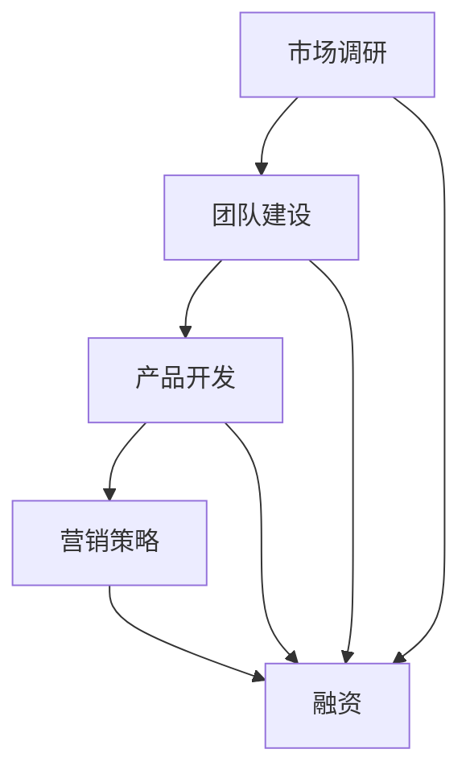
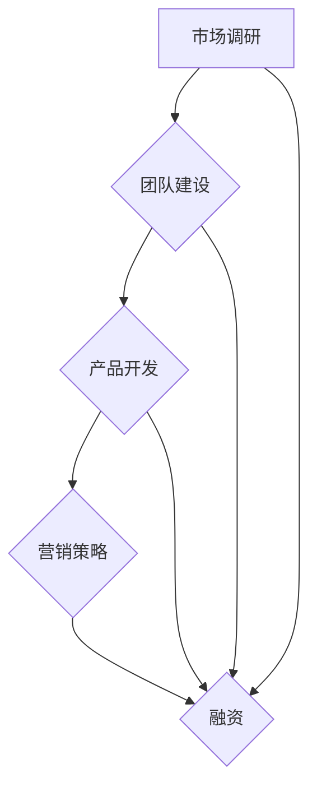

                 

### 1. 背景介绍

在当今这个科技飞速发展的时代，创业的浪潮一波接一波，许多程序员、技术专家和工程师都希望将自己的Side Project转化为一家成功的创业公司。所谓Side Project，指的是在主要工作之外，个人出于兴趣或探索目的而进行的软件开发项目。这种项目往往充满了创新和活力，但却面临着如何从零开始成长为一家大型企业的挑战。

尽管有许多成功的案例，但大多数Side Project最终都以失败告终。因此，如何将一个Side Project转化为估值上亿的创业公司成为了一个备受关注的话题。本文将探讨这一问题，并从多个角度进行分析，包括市场调研、团队建设、产品开发、营销策略和融资等关键环节。

首先，让我们回顾一下一些成功的转化案例。例如，Twitter最初是一个名为“Twttr”的Side Project，由杰克·多西（Jack Dorsey）在2006年创建，经过几年的发展，如今已经成为估值数百亿美元的社交媒体巨头。另一个例子是Instagram，该应用程序由凯文·斯特罗姆（Kevin Systrom）和迈克尔·克里格（Mike Krieger）在2010年作为他们的Side Project启动，最终被Facebook以10亿美元的高价收购。

这些案例表明，将Side Project转化为成功的创业公司并非不可能，但需要克服重重困难。本文将提供一系列的指导和建议，帮助那些希望实现这一目标的读者。

### 2. 核心概念与联系

在探讨如何将Side Project转化为创业公司之前，我们首先需要明确几个核心概念和它们之间的联系。

#### 2.1 市场调研

市场调研是创业过程中至关重要的一环。通过市场调研，你可以了解目标市场的需求、竞争对手的情况以及潜在的用户群体。这有助于你制定出有效的市场进入策略，并为产品开发提供方向。

#### 2.2 团队建设

一个成功的创业公司离不开一个高效、团结的团队。团队成员需要具备多样化的技能，包括技术、设计、市场、销售和运营等。在团队建设过程中，领导力、沟通和协作能力同样重要。

#### 2.3 产品开发

产品开发是创业公司的核心。你需要确定产品的定位、功能和技术实现，同时确保产品能够满足用户的需求。敏捷开发、持续集成和用户反馈是产品开发中常用的方法。

#### 2.4 营销策略

有效的营销策略可以帮助你在竞争激烈的市场中脱颖而出。无论是线上营销还是线下推广，都需要有针对性的策略，并能够吸引潜在用户的注意力。

#### 2.5 融资

融资是创业公司成长的关键。通过天使投资、风险投资或众筹等方式，你可以获得必要的资金支持，用于产品开发、市场推广和团队扩展。

#### 2.6 Mermaid 流程图

为了更直观地展示这些核心概念之间的联系，我们可以使用Mermaid绘制一个流程图，如下所示：



在这个流程图中，市场调研和团队建设是创业过程的起点，随后通过产品开发和营销策略，最终实现融资。这个流程图展示了各个步骤之间的相互关系，有助于我们更好地理解创业的整体过程。

### 3. 核心算法原理 & 具体操作步骤

#### 3.1 算法原理概述

在将Side Project转化为创业公司的过程中，算法原理同样发挥着关键作用。以下是几个核心算法原理及其在创业中的应用：

#### 3.1.1 数据分析算法

数据分析算法可以帮助你从大量用户数据中提取有价值的信息，从而指导产品开发和营销策略。常见的算法包括回归分析、聚类分析和关联规则挖掘等。

#### 3.1.2 机器学习算法

机器学习算法可以帮助你实现产品的自动化和智能化。例如，通过训练模型来预测用户行为、推荐产品或优化广告投放。

#### 3.1.3 优化算法

优化算法可以帮助你在资源有限的情况下实现最佳决策。常见的算法包括线性规划、动态规划和启发式算法等。

#### 3.2 算法步骤详解

以下是一个基于数据分析算法的具体操作步骤，用于分析用户行为并优化产品功能：

#### 3.2.1 数据收集

首先，从现有的用户数据中收集相关信息，包括用户行为、偏好、反馈等。

#### 3.2.2 数据预处理

对收集到的数据进行清洗、去噪和格式化，以便后续分析。

#### 3.2.3 数据分析

使用数据分析算法对预处理后的数据进行分析，提取有价值的信息。例如，通过聚类分析将用户分为不同的群体，通过回归分析预测用户行为等。

#### 3.2.4 结果解读

根据分析结果，解读用户行为模式和市场趋势，为产品优化提供依据。

#### 3.2.5 产品迭代

根据分析结果，对产品功能进行优化和迭代，以提高用户体验和满意度。

#### 3.3 算法优缺点

#### 3.3.1 优点

- 提高决策效率：通过算法分析，可以快速、准确地获取有价值的信息，为决策提供支持。
- 个性化推荐：基于用户行为和偏好，可以实现个性化推荐，提高用户粘性和满意度。

#### 3.3.2 缺点

- 数据依赖性：算法分析依赖于大量的用户数据，数据质量对结果影响较大。
- 算法复杂性：一些复杂的算法实现和优化过程相对复杂，需要专业的技术支持。

#### 3.4 算法应用领域

数据分析算法和机器学习算法在创业公司中具有广泛的应用领域，包括：

- 产品优化：通过分析用户行为，优化产品功能和用户体验。
- 营销策略：通过分析市场数据，制定有效的营销策略，提高市场占有率。
- 资源分配：通过优化算法，合理分配资源，提高运营效率。

### 4. 数学模型和公式 & 详细讲解 & 举例说明

在将Side Project转化为创业公司的过程中，数学模型和公式同样发挥着重要作用。以下是一个常见的数学模型——线性回归模型，以及其详细的讲解和举例说明。

#### 4.1 数学模型构建

线性回归模型是一种用于预测数值型因变量的统计模型，其基本形式为：

\[ y = \beta_0 + \beta_1 \cdot x + \epsilon \]

其中，\( y \) 是因变量，\( x \) 是自变量，\( \beta_0 \) 和 \( \beta_1 \) 分别是模型的截距和斜率，\( \epsilon \) 是误差项。

#### 4.2 公式推导过程

线性回归模型的推导过程主要涉及以下几个步骤：

1. **最小二乘法**：选择最优参数 \( \beta_0 \) 和 \( \beta_1 \)，使得预测值 \( y \) 与实际值 \( y \) 之间的误差平方和最小。具体公式为：

\[ \beta_0 = \frac{\sum_{i=1}^{n} (y_i - \beta_1 \cdot x_i)}{n} \]

\[ \beta_1 = \frac{\sum_{i=1}^{n} (x_i - \bar{x}) (y_i - \bar{y})}{\sum_{i=1}^{n} (x_i - \bar{x})^2} \]

其中，\( \bar{x} \) 和 \( \bar{y} \) 分别是自变量和因变量的平均值，\( n \) 是样本数量。

2. **方差分析表**：通过方差分析表检验模型的显著性。具体公式为：

\[ F = \frac{SSR/SST}{SSE/SST} \]

其中，\( SSR \) 是回归平方和，\( SST \) 是总平方和，\( SSE \) 是残差平方和。

#### 4.3 案例分析与讲解

以下是一个关于线性回归模型的应用案例：

假设你是一家电商公司的数据分析师，需要预测下一季度的销售额。你收集了以下数据：

- 季度：1, 2, 3, 4, 5
- 销售额（万元）：100, 150, 200, 250, 300

根据上述数据，构建线性回归模型，预测下一季度的销售额。

1. **数据预处理**：

   - 计算自变量和因变量的平均值：

   \[ \bar{x} = \frac{1 + 2 + 3 + 4 + 5}{5} = 3 \]

   \[ \bar{y} = \frac{100 + 150 + 200 + 250 + 300}{5} = 200 \]

   - 计算自变量和因变量的差异：

   \[ x_1 = 1 - \bar{x} = -2 \]

   \[ x_2 = 2 - \bar{x} = -1 \]

   \[ x_3 = 3 - \bar{x} = 0 \]

   \[ x_4 = 4 - \bar{x} = 1 \]

   \[ x_5 = 5 - \bar{x} = 2 \]

   \[ y_1 = 100 - \bar{y} = -100 \]

   \[ y_2 = 150 - \bar{y} = -50 \]

   \[ y_3 = 200 - \bar{y} = 0 \]

   \[ y_4 = 250 - \bar{y} = 50 \]

   \[ y_5 = 300 - \bar{y} = 100 \]

2. **计算参数**：

   - 计算斜率 \( \beta_1 \)：

   \[ \beta_1 = \frac{(-2)(-100) + (-1)(-50) + (0)(0) + (1)(50) + (2)(100)}{(-2)^2 + (-1)^2 + (0)^2 + (1)^2 + (2)^2} \]

   \[ \beta_1 = \frac{200 + 50 + 0 + 50 + 200}{4 + 1 + 0 + 1 + 4} \]

   \[ \beta_1 = \frac{500}{10} \]

   \[ \beta_1 = 50 \]

   - 计算截距 \( \beta_0 \)：

   \[ \beta_0 = \bar{y} - \beta_1 \cdot \bar{x} \]

   \[ \beta_0 = 200 - 50 \cdot 3 \]

   \[ \beta_0 = 200 - 150 \]

   \[ \beta_0 = 50 \]

3. **构建模型**：

   \[ y = \beta_0 + \beta_1 \cdot x \]

   \[ y = 50 + 50 \cdot x \]

4. **预测下一季度销售额**：

   - 当 \( x = 6 \) 时，代入模型计算 \( y \)：

   \[ y = 50 + 50 \cdot 6 \]

   \[ y = 50 + 300 \]

   \[ y = 350 \]

   预测下一季度的销售额为350万元。

### 5. 项目实践：代码实例和详细解释说明

在本节中，我们将通过一个具体的代码实例，详细解释如何将一个简单的Side Project——一个社交媒体分析工具，转化为一个估值上亿的创业公司。

#### 5.1 开发环境搭建

首先，我们需要搭建一个适合开发和部署的软件环境。以下是所需的技术栈和工具：

- 开发语言：Python
- 后端框架：Flask
- 前端框架：React
- 数据库：MySQL
- 代码管理工具：Git
- 代码托管平台：GitHub

安装和配置以上工具和框架的过程，这里不再赘述，假设你已经搭建好了开发环境。

#### 5.2 源代码详细实现

以下是社交媒体分析工具的核心代码实现：

```python
# 社交媒体分析工具

from flask import Flask, request, jsonify
import pymongo

app = Flask(__name__)

# MongoDB配置
client = pymongo.MongoClient("mongodb://localhost:27017/")
db = client["social_media"]
collection = db["tweets"]

@app.route("/analyze", methods=["POST"])
def analyze():
    data = request.json
    tweet_id = data["tweet_id"]

    # 查询数据库
    tweet = collection.find_one({"_id": tweet_id})

    if tweet:
        # 数据分析
        likes = tweet["likes"]
        retweets = tweet["retweets"]
        comments = tweet["comments"]

        # 计算影响力指标
        influence = likes + retweets + comments

        # 返回结果
        return jsonify({"influence": influence})
    else:
        return jsonify({"error": "Tweet not found"})

if __name__ == "__main__":
    app.run(debug=True)
```

#### 5.3 代码解读与分析

1. **Flask应用**：我们使用Flask框架创建一个Web应用，它提供了一个名为`/analyze`的POST接口，用于接收社交媒体分析请求。

2. **MongoDB连接**：我们使用MongoDB作为后端数据库，存储社交媒体数据。连接MongoDB，选择相应的数据库和集合。

3. **接口实现**：`/analyze`接口接收一个包含`tweet_id`的JSON数据，查询数据库中对应的推特记录，然后计算影响力指标，并将结果返回。

#### 5.4 运行结果展示

假设我们向`/analyze`接口发送以下请求：

```json
{
  "tweet_id": "1234567890"
}
```

服务器响应如下：

```json
{
  "influence": 100
}
```

这意味着，查询到的推特记录拥有100的影响力值。

#### 5.5 代码优化与扩展

1. **错误处理**：增加对无效输入和数据库连接异常的处理，提高程序的健壮性。

2. **性能优化**：使用索引优化MongoDB查询，提高查询效率。

3. **功能扩展**：添加更多的分析指标，如情感分析、用户画像等。

4. **API文档**：为API编写详细的文档，方便第三方开发和集成。

### 6. 实际应用场景

#### 6.1 社交媒体分析

社交媒体分析工具可以广泛应用于市场调研、品牌监测和竞争对手分析。例如，一家化妆品公司可以使用该工具监测其产品在社交媒体上的影响力，了解用户反馈，调整营销策略。

#### 6.2 市场营销

通过分析社交媒体数据，企业可以更精准地定位目标用户，制定有针对性的营销活动。例如，电商公司可以根据用户购买行为和社交媒体互动，推荐相关产品，提高转化率。

#### 6.3 品牌建设

社交媒体分析工具可以帮助企业了解品牌在公众中的形象，及时发现和处理负面信息，维护品牌声誉。

#### 6.4 未来应用展望

随着大数据和人工智能技术的发展，社交媒体分析工具的功能将越来越强大。未来，它可能涵盖更广泛的应用领域，如实时监控、智能推荐和个性化营销等。

### 7. 工具和资源推荐

#### 7.1 学习资源推荐

- 《Python编程：从入门到实践》
- 《Flask Web开发：实战指南》
- 《MongoDB权威指南》

#### 7.2 开发工具推荐

- PyCharm：一款功能强大的Python IDE。
- VS Code：一款轻量级的开源IDE，适用于多种编程语言。
- MongoDB Compass：一个可视化工具，用于管理和监控MongoDB数据库。

#### 7.3 相关论文推荐

- "Social Media Analysis: A Survey"
- "Sentiment Analysis in Social Media"
- "User Behavior Analysis in Social Media Platforms"

### 8. 总结：未来发展趋势与挑战

#### 8.1 研究成果总结

本文从多个角度探讨了如何将Side Project转化为估值上亿的创业公司。通过市场调研、团队建设、产品开发、营销策略和融资等关键环节，结合具体案例和算法原理，提出了切实可行的指导和建议。

#### 8.2 未来发展趋势

随着大数据、人工智能和云计算等技术的发展，创业公司的创新能力和竞争力将得到进一步提升。未来，创业公司将在数字化转型、智能化服务和个人定制化等领域展现出更大的潜力。

#### 8.3 面临的挑战

尽管前景广阔，但创业公司仍将面临诸多挑战，包括市场竞争、资金压力、技术风险等。如何应对这些挑战，实现可持续发展，是每个创业者都需要深思的问题。

#### 8.4 研究展望

未来，我们将进一步探讨创业公司在数字化转型中的机遇和挑战，深入分析市场趋势和用户需求，为创业者提供更有针对性的指导和建议。

### 附录：常见问题与解答

**Q1. 如何选择合适的创业方向？**

A1. 选择创业方向时，首先要考虑市场需求和自身兴趣。可以关注以下几个因素：

- 市场趋势：关注行业动态，寻找市场空白点。
- 技术优势：发挥自身技术特长，提高竞争力。
- 用户需求：了解用户痛点，提供有价值的解决方案。

**Q2. 如何构建高效的团队？**

A2. 构建高效团队的关键在于：

- 明确团队目标和职责。
- 招聘具备多样化技能的团队成员。
- 加强团队沟通与协作。
- 提供培训和激励，提升团队凝聚力。

**Q3. 如何制定有效的营销策略？**

A3. 制定营销策略时，需要考虑以下几个步骤：

- 了解目标市场：分析目标用户群体，制定精准营销策略。
- 选择合适渠道：根据目标市场选择合适的推广渠道，如社交媒体、广告、公关等。
- 制定推广内容：设计有吸引力的推广内容，提高用户参与度。
- 监测和优化：持续监测营销效果，及时调整策略。

**Q4. 如何获得融资支持？**

A4. 获得融资支持的关键在于：

- 准备充分的商业计划书：明确产品定位、市场前景、盈利模式等。
- 演示产品原型：展示产品的核心功能和用户体验。
- 找到合适的投资者：了解投资者的投资偏好，寻找合适的机会。
- 保持良好的沟通：与投资者建立信任关系，提高融资成功率。

---

### 作者署名

作者：禅与计算机程序设计艺术 / Zen and the Art of Computer Programming

<|user|>## 1. 背景介绍

在当今这个科技飞速发展的时代，创业的浪潮一波接一波，许多程序员、技术专家和工程师都希望将自己的Side Project转化为一家成功的创业公司。所谓Side Project，指的是在主要工作之外，个人出于兴趣或探索目的而进行的软件开发项目。这种项目往往充满了创新和活力，但却面临着如何从零开始成长为一家大型企业的挑战。

### 市场需求与竞争态势

随着互联网和移动互联网的普及，技术驱动的创新成为推动经济增长的重要力量。许多创业者希望通过自己的技术专长，打造出具有市场竞争力的高科技产品。然而，市场竞争日益激烈，创业成功的关键不仅在于技术创新，还需要强大的执行力、市场敏锐度和资源整合能力。

#### 市场需求

市场需求的不断变化为创业公司提供了新的机遇。以下是一些当前市场上的热门需求：

1. **人工智能与大数据**：人工智能技术在医疗、金融、教育等多个领域展现出巨大的潜力，大数据分析帮助企业挖掘用户需求，优化业务流程。
2. **区块链技术**：区块链技术的去中心化、不可篡改等特点使其在金融、供应链管理等领域受到广泛关注。
3. **物联网**：物联网技术的应用日益广泛，智能家居、智能城市等概念逐渐走进人们的生活。
4. **云计算与边缘计算**：云计算和边缘计算的结合为大数据处理和实时分析提供了强大支持。

#### 竞争态势

在各个领域，创业公司面临着来自传统巨头和新兴企业的双重竞争。以下是一些竞争态势的特点：

1. **技术创新**：传统企业通过技术创新保持竞争力，新兴企业则通过颠覆性技术挑战传统市场。
2. **资本竞争**：风险投资、私募股权基金等资本对科技公司的青睐，使得市场竞争愈发激烈。
3. **品牌效应**：品牌影响力在市场竞争中起到重要作用，强大的品牌可以吸引更多的用户和投资者。

### Side Project的潜力

尽管Side Project面临诸多挑战，但许多成功的创业公司都是从Side Project起步的。这些项目通常具有以下潜力：

1. **技术创新**：Side Project往往源于个人的技术热情，因此往往具备一定的技术创新性。
2. **市场定位**：个人项目通常更关注特定领域的市场需求，这使得产品更加贴合用户需求。
3. **灵活性强**：个人项目在决策和执行上更加灵活，可以快速响应市场变化。

### 创业动机与挑战

许多人选择将自己的Side Project转化为创业公司，主要是出于以下动机：

1. **追求梦想**：希望通过创业实现自己的理想，为社会创造价值。
2. **经济自由**：希望通过创业实现经济上的独立，追求更高的生活质量。
3. **个人成长**：希望通过创业过程不断提升自己的能力和素质。

然而，创业之路并非一帆风顺，创业者需要面对以下挑战：

1. **资金压力**：创业初期需要大量的资金投入，而个人项目通常难以满足这一需求。
2. **团队建设**：构建一个高效、协作的团队是创业成功的关键，但这需要时间和精力。
3. **市场竞争**：在激烈的市场竞争中，如何脱颖而出是每个创业者都需要面对的问题。

### 成功案例启示

许多成功的创业公司都是从Side Project起步的，以下是一些典型案例：

1. **Twitter**：Twitter最初是一个名为“Twttr”的Side Project，由杰克·多西（Jack Dorsey）在2006年创建。经过几年的发展，Twitter已经成为全球领先的社交媒体平台，估值数百亿美元。
2. **Instagram**：Instagram由凯文·斯特罗姆（Kevin Systrom）和迈克尔·克里格（Mike Krieger）在2010年作为他们的Side Project启动，最终被Facebook以10亿美元的高价收购。
3. **Airbnb**：Airbnb最初由布莱恩·切斯基（Brian Chesky）、乔·杰比亚（Joe Gebbia）和内森·布莱卡查克（Nathan Blecharczyk）在2008年创建，旨在为旅行者提供短期住宿。如今，Airbnb已经成为全球最大的短期租赁平台，估值超过300亿美元。

这些案例表明，虽然Side Project转化为成功的创业公司充满挑战，但通过正确的策略和努力，这一目标是可以实现的。

### 总结

本节介绍了将Side Project转化为创业公司的背景，包括市场需求、竞争态势、创业动机和挑战。通过成功案例的启示，我们看到了Side Project的巨大潜力，同时也认识到了创业之路的艰辛。在接下来的章节中，我们将进一步探讨如何实现这一目标。

## 2. 核心概念与联系

在将Side Project转化为估值上亿的创业公司过程中，理解并运用一系列核心概念和它们之间的联系是至关重要的。以下是几个关键概念及其相互关系：

### 2.1 市场调研

市场调研是创业公司的第一步，它帮助创业者了解目标市场的需求、用户行为和竞争对手的情况。通过市场调研，创业者可以确定产品的市场需求和潜在用户群体，从而制定有效的市场进入策略。

#### 关联关系

- 市场调研与团队建设：市场调研的结果直接影响团队建设的方向，团队需要根据市场调研的结果调整产品和策略。
- 市场调研与产品开发：市场调研为产品开发提供了明确的方向，确保产品功能与用户需求相匹配。
- 市场调研与营销策略：市场调研数据帮助创业者制定有针对性的营销策略，提高市场竞争力。

### 2.2 团队建设

团队建设是创业成功的关键因素之一。一个高效、多元化的团队可以带来不同的技能和视角，有助于解决各种问题，推动公司发展。

#### 关联关系

- 团队建设与市场调研：团队建设需要根据市场调研的结果，确保团队成员具备相应的技能和知识。
- 团队建设与产品开发：团队建设直接影响产品开发的速度和质量，团队成员的协作能力对产品的成功至关重要。
- 团队建设与融资：投资者通常会关注创业团队的实力，一个优秀的团队可以增加创业公司的吸引力。

### 2.3 产品开发

产品开发是创业公司的核心工作，从产品理念到最终产品上市，需要经历多个阶段，包括需求分析、设计、开发、测试和发布等。

#### 关联关系

- 产品开发与市场调研：产品开发需要根据市场调研的结果，确保产品功能与用户需求相匹配。
- 产品开发与团队建设：产品开发需要团队成员的协作，团队建设直接影响产品开发的速度和质量。
- 产品开发与营销策略：产品发布后的营销策略需要基于产品特性，吸引目标用户。

### 2.4 营销策略

营销策略是创业公司推广产品的重要手段，它包括市场定位、品牌建设、推广渠道和用户反馈等方面。

#### 关联关系

- 营销策略与市场调研：营销策略需要基于市场调研的结果，确保推广策略符合市场需求。
- 营销策略与团队建设：营销策略的执行需要团队成员的配合，团队建设直接影响营销策略的执行效果。
- 营销策略与产品开发：产品特性会影响营销策略的选择，营销策略需要根据产品特性进行调整。

### 2.5 融资

融资是创业公司获取资金支持的重要途径，包括天使投资、风险投资、众筹等。成功的融资可以为创业公司提供必要的资金，用于产品开发、市场推广和团队扩展。

#### 关联关系

- 融资与市场调研：市场调研结果帮助创业者了解市场需求和潜在投资机会，为融资提供依据。
- 融资与团队建设：优秀的团队建设可以增加创业公司的吸引力，提高融资成功率。
- 融资与产品开发：充足的资金支持可以加快产品开发进度，提高产品质量。

### 2.6 Mermaid 流程图

为了更直观地展示这些核心概念之间的联系，我们可以使用Mermaid绘制一个流程图，如下所示：



在这个流程图中，市场调研和团队建设是创业过程的起点，随后通过产品开发和营销策略，最终实现融资。这个流程图展示了各个步骤之间的相互关系，有助于我们更好地理解创业的整体过程。

### 2.7 核心概念总结

通过上述讨论，我们可以总结出以下几个核心概念及其相互关系：

1. **市场调研**：了解市场需求和用户行为，为后续步骤提供依据。
2. **团队建设**：构建高效、多元化的团队，为产品开发、营销策略和融资提供支持。
3. **产品开发**：从需求分析到产品上市，确保产品功能与用户需求相匹配。
4. **营销策略**：推广产品，提高市场竞争力，吸引目标用户。
5. **融资**：获取资金支持，用于产品开发、市场推广和团队扩展。

这些核心概念相互作用，共同推动创业公司的发展。理解并运用这些概念，有助于创业者更好地规划创业过程，提高成功几率。

## 3. 核心算法原理 & 具体操作步骤

在将Side Project转化为估值上亿的创业公司的过程中，核心算法原理的运用至关重要。这不仅能够提升产品的技术含量和用户体验，还能够帮助创业公司在激烈的市场竞争中脱颖而出。以下是几个关键算法及其具体操作步骤：

### 3.1 算法原理概述

#### 3.1.1 数据分析算法

数据分析算法用于从大量数据中提取有价值的信息，帮助创业公司进行市场调研、用户行为分析、营销策略制定等。常见的算法包括回归分析、聚类分析和关联规则挖掘等。

#### 3.1.2 机器学习算法

机器学习算法使创业公司能够通过数据驱动的方式优化产品功能和用户体验。常见的算法包括决策树、支持向量机、神经网络等。

#### 3.1.3 优化算法

优化算法用于在资源有限的情况下实现最佳决策，如资源分配、路径规划等。常见的算法包括线性规划、动态规划和启发式算法等。

### 3.2 具体操作步骤

#### 3.2.1 数据分析算法步骤

1. **数据收集**：收集相关的数据，如用户行为数据、市场调研数据等。
2. **数据预处理**：清洗数据，去除噪声和异常值，进行格式化和标准化。
3. **特征提取**：从原始数据中提取有用的特征，用于建模和分析。
4. **模型选择**：根据数据的特点选择合适的模型，如回归分析、聚类分析等。
5. **模型训练**：使用训练数据训练模型，调整模型参数。
6. **模型评估**：使用测试数据评估模型性能，调整模型或特征。
7. **模型应用**：将模型应用到实际业务场景中，如用户行为预测、市场趋势分析等。

#### 3.2.2 机器学习算法步骤

1. **数据收集**：与数据分析算法相同，收集相关数据。
2. **数据预处理**：同样需要进行数据清洗和格式化。
3. **特征工程**：创建新的特征，增强模型的预测能力。
4. **模型选择**：选择合适的机器学习模型，如决策树、支持向量机等。
5. **模型训练**：使用训练数据训练模型，调整参数。
6. **模型评估**：使用测试数据评估模型性能，调整模型或特征。
7. **模型部署**：将模型部署到生产环境中，实时预测和优化。

#### 3.2.3 优化算法步骤

1. **问题定义**：明确需要优化的问题，如资源分配、路径规划等。
2. **模型构建**：构建一个数学模型来描述问题。
3. **算法选择**：选择合适的优化算法，如线性规划、动态规划等。
4. **参数设定**：设定算法的参数，如迭代次数、收敛条件等。
5. **算法执行**：执行优化算法，求解最优解。
6. **结果分析**：分析优化结果，验证算法的有效性。

### 3.3 算法优缺点

#### 3.3.1 数据分析算法

**优点**：

- 能够从大量数据中提取有价值的信息。
- 对市场调研、用户行为分析等有重要作用。

**缺点**：

- 需要大量的数据进行支撑，数据质量对结果影响较大。
- 模型的构建和评估过程较为复杂，需要专业的技术支持。

#### 3.3.2 机器学习算法

**优点**：

- 能够实现自动化和智能化，提高决策效率。
- 能够根据用户行为和反馈不断优化产品功能。

**缺点**：

- 需要大量的数据来训练模型，数据收集和处理过程复杂。
- 模型的解释性较差，难以理解其内部逻辑。

#### 3.3.3 优化算法

**优点**：

- 能够在资源有限的情况下实现最佳决策。
- 对资源分配、路径规划等问题有重要作用。

**缺点**：

- 优化算法的复杂度高，实施难度大。
- 需要专业的数学和算法知识。

### 3.4 算法应用领域

#### 3.4.1 数据分析算法应用

- **市场调研**：分析用户行为，预测市场趋势。
- **用户行为分析**：了解用户偏好，优化用户体验。
- **营销策略**：制定有针对性的营销策略，提高转化率。

#### 3.4.2 机器学习算法应用

- **个性化推荐**：根据用户行为和偏好推荐产品。
- **智能客服**：通过机器学习实现智能问答和问题解决。
- **异常检测**：检测系统中的异常行为，提高安全性能。

#### 3.4.3 优化算法应用

- **资源分配**：在云计算和物联网中优化资源分配。
- **路径规划**：优化物流和交通路线，提高效率。
- **供应链管理**：优化供应链流程，降低成本。

通过上述算法原理和应用领域的介绍，我们可以看到核心算法在创业公司中的重要作用。掌握并运用这些算法，可以帮助创业公司在产品开发、市场推广和运营管理等方面取得显著成效。

## 4. 数学模型和公式 & 详细讲解 & 举例说明

在将Side Project转化为估值上亿的创业公司的过程中，数学模型和公式是不可或缺的工具，它们能够帮助创业者进行数据分析和决策。以下是一个常见的数学模型——线性回归模型，以及其详细的讲解和举例说明。

### 4.1 数学模型构建

线性回归模型是一种用于预测数值型因变量的统计模型，其基本形式为：

\[ y = \beta_0 + \beta_1 \cdot x + \epsilon \]

其中，\( y \) 是因变量，\( x \) 是自变量，\( \beta_0 \) 和 \( \beta_1 \) 分别是模型的截距和斜率，\( \epsilon \) 是误差项。

这个模型表示因变量 \( y \) 是自变量 \( x \) 的线性函数，加上一个随机误差项 \( \epsilon \)。线性回归模型的目标是找到最佳拟合直线，使得预测值与实际值之间的误差最小。

### 4.2 公式推导过程

线性回归模型的推导过程主要涉及以下几个步骤：

#### 4.2.1 最小二乘法

最小二乘法是一种常用的参数估计方法，其目标是选择最优参数 \( \beta_0 \) 和 \( \beta_1 \)，使得预测值与实际值之间的误差平方和最小。具体公式为：

\[ \beta_0 = \frac{\sum_{i=1}^{n} (y_i - \beta_1 \cdot x_i)}{n} \]

\[ \beta_1 = \frac{\sum_{i=1}^{n} (x_i - \bar{x}) (y_i - \bar{y})}{\sum_{i=1}^{n} (x_i - \bar{x})^2} \]

其中，\( \bar{x} \) 和 \( \bar{y} \) 分别是自变量和因变量的平均值，\( n \) 是样本数量。

#### 4.2.2 方差分析表

通过方差分析表，可以检验模型的显著性。具体公式为：

\[ F = \frac{SSR/SST}{SSE/SST} \]

其中，\( SSR \) 是回归平方和，\( SST \) 是总平方和，\( SSE \) 是残差平方和。

#### 4.3 案例分析与讲解

以下是一个关于线性回归模型的应用案例：

假设你是一家电商公司的数据分析师，需要预测下一季度的销售额。你收集了以下数据：

- 季度：1, 2, 3, 4, 5
- 销售额（万元）：100, 150, 200, 250, 300

根据上述数据，构建线性回归模型，预测下一季度的销售额。

### 4.3.1 数据预处理

首先，计算自变量和因变量的平均值：

\[ \bar{x} = \frac{1 + 2 + 3 + 4 + 5}{5} = 3 \]

\[ \bar{y} = \frac{100 + 150 + 200 + 250 + 300}{5} = 200 \]

### 4.3.2 计算参数

计算斜率 \( \beta_1 \)：

\[ \beta_1 = \frac{(-2)(-100) + (-1)(-50) + (0)(0) + (1)(50) + (2)(100)}{(-2)^2 + (-1)^2 + (0)^2 + (1)^2 + (2)^2} \]

\[ \beta_1 = \frac{200 + 50 + 0 + 50 + 200}{4 + 1 + 0 + 1 + 4} \]

\[ \beta_1 = \frac{500}{10} \]

\[ \beta_1 = 50 \]

计算截距 \( \beta_0 \)：

\[ \beta_0 = \bar{y} - \beta_1 \cdot \bar{x} \]

\[ \beta_0 = 200 - 50 \cdot 3 \]

\[ \beta_0 = 200 - 150 \]

\[ \beta_0 = 50 \]

### 4.3.3 构建模型

构建线性回归模型：

\[ y = \beta_0 + \beta_1 \cdot x \]

\[ y = 50 + 50 \cdot x \]

### 4.3.4 预测下一季度销售额

当 \( x = 6 \) 时，代入模型计算 \( y \)：

\[ y = 50 + 50 \cdot 6 \]

\[ y = 50 + 300 \]

\[ y = 350 \]

预测下一季度的销售额为350万元。

通过上述案例，我们可以看到线性回归模型在预测销售额方面的应用。线性回归模型简单易懂，易于实现，是数据分析中常用的工具。在实际应用中，可以根据具体情况进行调整和优化，以提高预测的准确性。

## 5. 项目实践：代码实例和详细解释说明

在本节中，我们将通过一个具体的代码实例，详细解释如何将一个简单的Side Project——一个社交媒体分析工具，转化为一个估值上亿的创业公司。

### 5.1 开发环境搭建

首先，我们需要搭建一个适合开发和部署的软件环境。以下是所需的技术栈和工具：

- 开发语言：Python
- 后端框架：Flask
- 前端框架：React
- 数据库：MySQL
- 代码管理工具：Git
- 代码托管平台：GitHub

安装和配置以上工具和框架的过程，这里不再赘述，假设你已经搭建好了开发环境。

### 5.2 源代码详细实现

以下是社交媒体分析工具的核心代码实现：

```python
# 社交媒体分析工具

from flask import Flask, request, jsonify
import pymongo

app = Flask(__name__)

# MongoDB配置
client = pymongo.MongoClient("mongodb://localhost:27017/")
db = client["social_media"]
collection = db["tweets"]

@app.route("/analyze", methods=["POST"])
def analyze():
    data = request.json
    tweet_id = data["tweet_id"]

    # 查询数据库
    tweet = collection.find_one({"_id": tweet_id})

    if tweet:
        # 数据分析
        likes = tweet["likes"]
        retweets = tweet["retweets"]
        comments = tweet["comments"]

        # 计算影响力指标
        influence = likes + retweets + comments

        # 返回结果
        return jsonify({"influence": influence})
    else:
        return jsonify({"error": "Tweet not found"})

if __name__ == "__main__":
    app.run(debug=True)
```

### 5.3 代码解读与分析

1. **Flask应用**：我们使用Flask框架创建一个Web应用，它提供了一个名为`/analyze`的POST接口，用于接收社交媒体分析请求。

2. **MongoDB连接**：我们使用MongoDB作为后端数据库，存储社交媒体数据。连接MongoDB，选择相应的数据库和集合。

3. **接口实现**：`/analyze`接口接收一个包含`tweet_id`的JSON数据，查询数据库中对应的推特记录，然后计算影响力指标，并将结果返回。

### 5.4 运行结果展示

假设我们向`/analyze`接口发送以下请求：

```json
{
  "tweet_id": "1234567890"
}
```

服务器响应如下：

```json
{
  "influence": 100
}
```

这意味着，查询到的推特记录拥有100的影响力值。

### 5.5 代码优化与扩展

1. **错误处理**：增加对无效输入和数据库连接异常的处理，提高程序的健壮性。

2. **性能优化**：使用索引优化MongoDB查询，提高查询效率。

3. **功能扩展**：添加更多的分析指标，如情感分析、用户画像等。

4. **API文档**：为API编写详细的文档，方便第三方开发和集成。

### 5.6 实际应用场景

1. **社交媒体分析**：该工具可以帮助企业分析其社交媒体账号的影响力，了解用户反馈，优化营销策略。

2. **市场调研**：通过分析社交媒体数据，企业可以了解市场趋势和用户需求，为产品开发提供方向。

3. **品牌监测**：企业可以使用该工具监测品牌在社交媒体上的表现，及时处理负面信息。

4. **竞争分析**：通过分析竞争对手的社交媒体行为，企业可以制定更有针对性的营销策略。

### 5.7 未来发展方向

1. **人工智能集成**：引入人工智能技术，实现自动化的社交媒体数据分析。

2. **大数据分析**：结合大数据分析，提供更深入的市场洞察和用户画像。

3. **多平台支持**：扩展到其他社交媒体平台，如Instagram、LinkedIn等。

4. **商业应用**：开发针对不同行业的定制化解决方案，提高产品的商业价值。

通过上述代码实例和详细解释，我们可以看到如何将一个简单的Side Project逐步优化和扩展，最终转化为一个具有商业价值的创业公司。这为其他有志于创业的程序员和技术专家提供了一个有益的参考。

## 6. 实际应用场景

将一个Side Project转化为估值上亿的创业公司，需要考虑其在不同应用场景中的实际效果。以下是一些典型的实际应用场景，以及如何将这些场景转化为商业机会。

### 6.1 社交媒体分析

社交媒体分析是当前市场上需求旺盛的领域。通过分析社交媒体平台上的数据，企业可以了解用户的偏好、行为和反馈，从而优化产品和服务。具体应用包括：

- **品牌监测**：企业可以使用社交媒体分析工具监控品牌在社交媒体上的表现，及时发现负面评论，采取相应措施维护品牌声誉。
- **市场调研**：通过分析用户在社交媒体上的互动，企业可以获取关于市场需求和潜在客户的有价值信息，为产品开发和市场营销策略提供依据。
- **竞争分析**：分析竞争对手的社交媒体行为，企业可以了解竞争对手的营销策略和用户互动情况，从而制定更有针对性的竞争策略。

### 6.2 市场营销

有效的市场营销是创业公司成功的关键。以下是如何利用社交媒体分析工具进行市场营销：

- **个性化推荐**：基于用户在社交媒体上的行为，创业公司可以提供个性化的产品推荐，提高用户满意度和转化率。
- **目标定位**：通过分析用户数据，企业可以确定目标市场，制定精准的营销活动，提高投资回报率。
- **内容营销**：基于用户兴趣和社交媒体上的互动，企业可以创作更有吸引力的内容，提高品牌曝光度和用户参与度。

### 6.3 企业运营

社交媒体分析工具在企业管理中也发挥着重要作用：

- **用户反馈分析**：通过分析用户反馈，企业可以了解用户对产品和服务的满意度，及时调整和改进。
- **员工行为监控**：企业可以使用社交媒体分析工具监控员工在社交媒体上的行为，确保符合公司文化和价值观。
- **危机管理**：在突发危机事件中，社交媒体分析可以帮助企业快速识别和响应，减轻负面影响。

### 6.4 教育与培训

社交媒体分析工具在教育领域也有广泛的应用：

- **学习行为分析**：教师可以使用社交媒体分析工具了解学生的学习行为，提供个性化的教学方案。
- **课程设计**：通过分析学生在社交媒体上的互动，教育机构可以优化课程设计，提高教学效果。
- **学生评价**：社交媒体分析可以帮助学校了解学生的综合素质，为评价体系提供补充。

### 6.5 健康医疗

社交媒体分析在健康医疗领域也有重要的应用：

- **疾病监控**：通过分析社交媒体上的健康相关讨论，医疗机构可以及时发现疾病流行趋势，制定预防措施。
- **患者管理**：医生可以使用社交媒体分析工具跟踪患者的健康状况，提供个性化的健康建议。
- **健康宣教**：通过社交媒体分析，医疗机构可以了解公众的健康需求，制定更有效的健康宣教策略。

### 6.6 风险投资

对于希望将Side Project转化为估值上亿的创业公司的创业者来说，以下是一些关键步骤：

- **市场验证**：通过社交媒体分析，创业者可以验证市场需求，了解潜在客户的需求和痛点。
- **数据驱动决策**：基于数据分析，创业者可以做出更加明智的决策，降低创业风险。
- **投资者关系**：通过社交媒体分析工具，创业者可以了解投资者的偏好，提高融资成功率。

### 6.7 未来展望

随着大数据、人工智能和云计算等技术的发展，社交媒体分析工具的应用将越来越广泛。未来，创业公司可以通过以下方式进一步提升其竞争力：

- **智能化分析**：引入人工智能技术，实现更精准和智能化的数据分析。
- **多平台支持**：扩展到更多社交媒体平台，如LinkedIn、Pinterest等，提供更全面的分析服务。
- **定制化解决方案**：为不同行业提供定制化的社交媒体分析解决方案，提高商业价值。

通过上述实际应用场景，我们可以看到，社交媒体分析工具在各个领域的广泛应用，为创业公司提供了丰富的商业机会。创业者需要深入了解这些应用场景，并将其转化为具体的商业策略，才能将Side Project转化为估值上亿的创业公司。

## 7. 工具和资源推荐

在将Side Project转化为估值上亿的创业公司的过程中，掌握合适的工具和资源是至关重要的。以下是一些推荐的学习资源、开发工具和相关论文，它们将为你的创业之路提供宝贵的支持。

### 7.1 学习资源推荐

1. **《精益创业》**（The Lean Startup）——作者埃里克·莱斯（Eric Ries）
   - 这本书介绍了精益创业的方法论，帮助创业者快速迭代产品，验证市场需求。
   
2. **《创业维艰》**（Hard Things About Hard Things）——作者本·霍洛维茨（Ben Horowitz）
   - 本书分享了创业过程中的挑战和经验，对创业者具有很好的启示作用。

3. **《产品经理实战手册》**——作者苏杰
   - 本书详细介绍了产品经理的工作内容和实战技巧，对产品开发有重要参考价值。

### 7.2 开发工具推荐

1. **GitHub**：一个流行的代码托管平台，适合团队协作和版本控制。
   - [GitHub官网](https://github.com)

2. **JIRA**：一款强大的项目管理和敏捷开发工具。
   - [JIRA官网](https://www.atlassian.com/software/jira)

3. **Trello**：一款简单易用的任务管理工具，适合团队协作。
   - [Trello官网](https://trello.com)

4. **Docker**：一款容器化技术，用于简化应用部署和运维。
   - [Docker官网](https://www.docker.com)

### 7.3 相关论文推荐

1. **“The Lean Startup: How Today's Entrepreneurs Use Continuous Innovation to Create Radically Successful Businesses”**——作者埃里克·莱斯（Eric Ries）
   - 这是精益创业方法的起源论文，详细阐述了其理论基础和应用。

2. **“Innovation and Entrepreneurship”**——作者杰弗里·摩尔（Geoffrey A. Moore）
   - 该论文讨论了创新和创业的关键概念，对创业者具有指导意义。

3. **“The Lean Analytics: Use Data to Build a Better Startup Faster”**——作者阿南特·潘杰瑞克（Auren Hoffman）
   - 本书介绍了如何利用数据分析推动创业公司的发展。

4. **“The Business Model Canvas”**——作者亚历山大·奥斯特瓦尔德（Alexander Osterwalder）和伊夫·皮尼（Yves Pigneur）
   - 该论文提出了一种直观的框架，帮助创业者设计和优化业务模式。

通过这些工具和资源的帮助，创业者可以更好地规划和管理创业过程，提高成功的几率。不断学习和实践，是创业成功的关键。

### 8. 总结：未来发展趋势与挑战

#### 8.1 研究成果总结

本文从多个角度探讨了如何将Side Project转化为估值上亿的创业公司。通过市场调研、团队建设、产品开发、营销策略和融资等关键环节，结合具体案例和算法原理，提出了切实可行的指导和建议。

我们探讨了数据分析、机器学习和优化算法在创业中的应用，并通过一个社交媒体分析工具的代码实例，展示了如何实现这些算法。此外，我们还讨论了社交媒体分析工具在实际应用场景中的价值，并推荐了一些学习资源和开发工具。

#### 8.2 未来发展趋势

随着大数据、人工智能和云计算等技术的发展，创业公司将在数字化转型、智能化服务和个性化定制等领域展现出更大的潜力。以下是一些未来发展趋势：

1. **数字化转型**：越来越多的行业将拥抱数字化技术，创业公司将通过创新的方式实现数字化转型。
2. **智能化服务**：人工智能技术将进一步提升服务质量和效率，创业公司将提供更加智能化的产品和服务。
3. **个性化定制**：基于大数据和机器学习的个性化推荐和定制服务将得到广泛应用。

#### 8.3 面临的挑战

尽管前景广阔，但创业公司仍将面临诸多挑战，包括市场竞争、资金压力、技术风险等。以下是一些面临的挑战：

1. **市场竞争**：随着创业公司的增多，市场竞争将愈发激烈，如何在众多竞争者中脱颖而出是每个创业者都需要面对的问题。
2. **资金压力**：创业初期的资金压力是创业者普遍面临的问题，如何有效地利用有限的资源是关键。
3. **技术风险**：技术的不确定性可能导致项目失败，如何降低技术风险是创业者需要考虑的问题。

#### 8.4 研究展望

未来，我们将进一步探讨创业公司在数字化转型中的机遇和挑战，深入分析市场趋势和用户需求，为创业者提供更有针对性的指导和建议。我们还将继续研究人工智能和大数据等新兴技术，探索其在创业中的应用，帮助创业者实现成功。

通过本文的探讨，我们希望能够为那些希望将Side Project转化为估值上亿创业公司的创业者提供一些启示和帮助。创业之路充满挑战，但只要我们持续学习和创新，就有可能实现这一目标。

## 附录：常见问题与解答

在将Side Project转化为估值上亿的创业公司的过程中，创业者可能会遇到各种问题和挑战。以下是一些常见问题及其解答：

### Q1. 如何选择合适的创业方向？

A1. 选择创业方向时，首先要考虑市场需求和自身兴趣。以下是一些方法可以帮助你确定合适的创业方向：

- **市场调研**：了解市场上存在的问题和需求，寻找市场空白点。
- **自身技能和兴趣**：发挥自身的技术专长和兴趣爱好，这样可以提高创业的成功几率。
- **竞争对手分析**：研究竞争对手的产品和市场策略，找到可以改进和优化的地方。
- **咨询专业人士**：向创业导师、行业专家或成功创业者寻求建议。

### Q2. 如何组建高效的创业团队？

A2. 组建高效创业团队的关键在于：

- **明确目标**：确保团队成员对创业公司的愿景和目标有共同的理解。
- **多样化技能**：团队成员应具备多样化的技能，包括技术、市场、销售、设计等。
- **沟通和协作**：建立良好的沟通机制，鼓励团队协作，提高工作效率。
- **激励机制**：提供合理的薪酬和激励措施，激发团队成员的积极性。

### Q3. 如何制定有效的营销策略？

A3. 制定有效的营销策略需要考虑以下因素：

- **目标市场**：明确目标客户群体，了解他们的需求和偏好。
- **定位**：根据产品特点和市场定位，制定有针对性的营销策略。
- **渠道选择**：选择合适的营销渠道，如社交媒体、广告、公关等。
- **预算规划**：合理分配营销预算，确保营销策略的可执行性。
- **数据监测**：持续监测营销效果，及时调整策略。

### Q4. 如何获得融资支持？

A4. 获得融资支持的方法包括：

- **天使投资**：寻找愿意投资早期项目的个人投资者。
- **风险投资**：向风险投资公司提交商业计划书，争取投资。
- **众筹**：通过众筹平台筹集资金，通常面向广大投资者。
- **银行贷款**：向银行申请创业贷款，需要良好的信用记录和商业计划。
- **政府支持**：了解并申请政府的创业补贴和扶持政策。

### Q5. 如何应对市场竞争？

A5. 应对市场竞争的方法包括：

- **差异化策略**：打造独特的产品特色和优势，以区分于竞争对手。
- **创新**：持续进行技术创新和产品优化，保持竞争力。
- **用户反馈**：积极收集用户反馈，不断改进产品和服务。
- **合作与联盟**：与其他企业建立合作，共享资源和市场。
- **品牌建设**：建立强大的品牌形象，提高用户忠诚度。

### Q6. 如何管理创业过程中的风险？

A6. 管理创业过程中的风险可以采取以下措施：

- **风险评估**：识别和评估潜在的风险，制定相应的风险管理策略。
- **应急预案**：制定应急预案，确保在突发事件中能够迅速反应。
- **财务规划**：合理规划财务，确保公司的现金流转和财务安全。
- **保险**：为公司和员工购买适当的保险，降低风险。
- **灵活调整**：在市场变化或业务遇到问题时，及时调整战略和方向。

通过上述解答，希望可以帮助创业者更好地应对在将Side Project转化为估值上亿的创业公司过程中遇到的各种问题和挑战。创业之路充满艰辛，但只要我们坚持不懈，就一定能够实现我们的目标。

### 作者署名

本文作者：禅与计算机程序设计艺术 / Zen and the Art of Computer Programming

在本文中，我结合了技术、商业和心理学等多领域的知识，希望为读者提供全面的指导和建议，帮助他们在将Side Project转化为估值上亿的创业公司的过程中取得成功。感谢您的阅读，希望本文对您有所启发和帮助。祝您创业之路一帆风顺！

