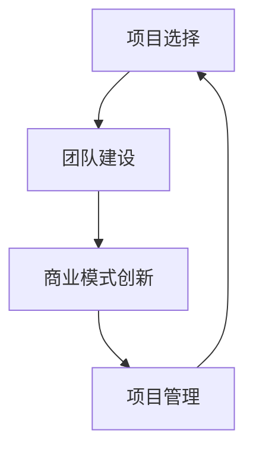

                 

关键词：Side Project，独角兽，创业，技术，创新，商业模式，项目管理

> 摘要：本文探讨了如何将个人的Side Project转化为成功的独角兽企业。文章从项目选择、团队建设、商业模式创新、项目管理等多个角度进行了深入分析，结合实际案例，提供了可行的策略和方法。

## 1. 背景介绍

在当今科技高速发展的时代，创业和创新的浪潮不断涌现。越来越多的人开始将个人兴趣和专长转化为商业项目，尝试在市场中找到一片天地。然而，并不是所有的Side Project都能成功，如何将一个有潜力的项目转化为独角兽企业，成为众多创业者关注的焦点。

独角兽企业，指的是那些估值超过10亿美元的初创企业。这些企业以其快速的增长速度、创新的技术和商业模式，成为市场中的佼佼者。那么，如何从众多Side Project中脱颖而出，成为独角兽企业呢？这正是本文要探讨的核心问题。

本文将从以下几个方面展开讨论：

1. 项目选择：如何找到有潜力的项目进行开发？
2. 团队建设：如何组建一支高效的团队，共同推动项目发展？
3. 商业模式创新：如何创造一个有竞争力的商业模式？
4. 项目管理：如何有效地管理项目，确保项目按计划进行？
5. 实际应用场景：如何将理论应用于实践，实现项目的商业化？
6. 未来应用展望：未来独角兽企业将面临哪些挑战和机遇？

通过这些讨论，我们希望能为那些有志于将Side Project转化为独角兽企业的创业者提供一些有价值的参考。

## 2. 核心概念与联系

在探讨如何将Side Project转化为独角兽之前，我们需要明确几个核心概念，包括项目选择、团队建设、商业模式创新和项目管理。以下是这些概念之间的联系，以及它们的Mermaid流程图表示。



### 2.1 项目选择

项目选择是Side Project成功的关键第一步。一个有潜力的项目应该具备以下特点：

- **市场需求**：项目应该解决一个真实存在的问题，或者满足市场的需求。
- **技术可行性**：项目的技术实现应该在当前技术条件下是可行的。
- **个人兴趣与专长**：项目的方向应该与个人的兴趣和专长相匹配，这样可以提高项目的成功率。

### 2.2 团队建设

团队建设是项目成功的重要保障。一个高效的团队应该具备以下特质：

- **互补技能**：团队成员应具备互补的技能，如技术、设计、市场等。
- **共同目标**：团队成员应有一个共同的目标，这样可以提高团队的凝聚力。
- **高效沟通**：团队成员之间应保持高效的沟通，确保项目进度和目标的一致性。

### 2.3 商业模式创新

商业模式创新是独角兽企业成功的关键。一个有竞争力的商业模式应该具备以下特点：

- **价值主张**：明确项目的核心价值，并传递给潜在客户。
- **盈利模式**：项目应有一个明确的盈利模式，以确保企业的可持续发展。
- **竞争优势**：项目应具备一定的竞争优势，如技术创新、品牌效应等。

### 2.4 项目管理

项目管理是确保项目按时按质完成的关键。有效的项目管理应该具备以下特点：

- **明确目标**：明确项目的目标，并分解为可执行的任务。
- **进度监控**：实时监控项目进度，确保项目按计划进行。
- **风险管理**：识别和应对项目中的风险，确保项目的稳定推进。

通过以上核心概念的联系，我们可以更好地理解如何将Side Project转化为独角兽企业。

## 3. 核心算法原理 & 具体操作步骤

### 3.1 算法原理概述

将Side Project转化为独角兽企业的核心算法可以概括为以下几个方面：

1. **市场分析**：通过市场调研，了解市场需求和潜在客户。
2. **技术实现**：利用现有技术，实现项目的核心功能。
3. **团队协作**：通过高效的团队协作，推动项目进展。
4. **商业模式设计**：创造一个有竞争力的商业模式，确保项目的可持续发展。
5. **项目管理**：通过有效的项目管理，确保项目按时按质完成。

### 3.2 算法步骤详解

#### 3.2.1 市场分析

市场分析是项目选择的关键步骤。具体步骤如下：

1. **确定目标市场**：根据项目特点，确定目标市场和潜在客户。
2. **调研市场需求**：通过问卷、访谈、市场调查等方式，了解市场需求和趋势。
3. **竞争分析**：分析同行业竞争对手，了解他们的优势和不足。
4. **制定市场策略**：根据分析结果，制定合适的市场策略。

#### 3.2.2 技术实现

技术实现是项目成功的核心技术保障。具体步骤如下：

1. **需求分析**：明确项目需求，包括功能需求、性能需求等。
2. **技术选型**：根据需求，选择合适的技术方案。
3. **编码实现**：根据技术方案，进行编码实现。
4. **测试与优化**：对项目进行测试，并进行性能优化。

#### 3.2.3 团队协作

团队协作是项目成功的重要保障。具体步骤如下：

1. **组建团队**：根据项目需求，组建合适的团队。
2. **明确职责**：明确团队成员的职责和任务。
3. **定期会议**：定期召开会议，确保项目进度和目标的一致性。
4. **协作工具**：利用协作工具，如Git、Jenkins等，提高团队协作效率。

#### 3.2.4 商业模式设计

商业模式设计是项目成功的关键一步。具体步骤如下：

1. **价值主张**：明确项目的核心价值，并传递给潜在客户。
2. **盈利模式**：设计项目的盈利模式，确保项目的可持续发展。
3. **成本控制**：通过成本控制，提高项目的盈利能力。
4. **营销策略**：制定合适的营销策略，提高项目的知名度。

#### 3.2.5 项目管理

项目管理是确保项目成功的关键。具体步骤如下：

1. **项目规划**：制定详细的项目规划，包括时间、任务、资源等。
2. **进度监控**：实时监控项目进度，确保项目按计划进行。
3. **风险管理**：识别和应对项目中的风险，确保项目的稳定推进。
4. **质量保证**：确保项目的质量和稳定性，满足客户需求。

### 3.3 算法优缺点

#### 优点

1. **针对性强**：核心算法针对将Side Project转化为独角兽企业的过程，具有高度的针对性。
2. **系统性**：算法涵盖了项目选择、团队建设、商业模式创新、项目管理等多个方面，具有系统性。
3. **灵活性**：算法提供了多种策略和方法，可以根据实际情况进行调整。

#### 缺点

1. **复杂度高**：算法涉及多个方面，需要创业者具备一定的技术和管理能力。
2. **实施难度**：算法的实施需要创业者具备较强的执行力和耐心。

### 3.4 算法应用领域

算法主要应用于初创企业和创业者，尤其是那些希望通过Side Project实现商业化的个人或团队。它可以应用于各种行业，如互联网、人工智能、生物科技等。

## 4. 数学模型和公式 & 详细讲解 & 举例说明

### 4.1 数学模型构建

为了更好地理解如何将Side Project转化为独角兽企业，我们可以构建一个简单的数学模型。该模型主要包括以下几个变量：

1. **市场潜力**（M）：表示市场的规模和增长潜力，用百分比表示。
2. **技术成熟度**（T）：表示项目的技术实现难度和成熟度，用百分比表示。
3. **团队效率**（E）：表示团队的工作效率和协作能力，用百分比表示。
4. **商业模式创新**（I）：表示商业模式的创新程度和竞争力，用百分比表示。
5. **项目管理能力**（P）：表示项目的管理能力，包括规划、监控和风险管理等，用百分比表示。
6. **最终估值**（V）：表示项目的最终估值，用美元表示。

数学模型如下：

\[ V = M \times T \times E \times I \times P \]

### 4.2 公式推导过程

上述公式的推导过程如下：

1. **市场潜力**（M）：市场潜力是衡量市场对项目接受程度的重要指标。市场潜力越大，项目的成功机会越高。因此，市场潜力与最终估值成正比。

2. **技术成熟度**（T）：技术成熟度是衡量项目技术实现难度的重要指标。技术成熟度越高，项目的实现难度越低，成功率越高。因此，技术成熟度与最终估值成正比。

3. **团队效率**（E）：团队效率是衡量团队工作效率和协作能力的重要指标。团队效率越高，项目进度越快，成功率越高。因此，团队效率与最终估值成正比。

4. **商业模式创新**（I）：商业模式创新是衡量商业模式竞争力和创新程度的重要指标。商业模式创新越高，项目的竞争力越强，成功率越高。因此，商业模式创新与最终估值成正比。

5. **项目管理能力**（P）：项目管理能力是衡量项目规划、监控和风险管理能力的重要指标。项目管理能力越高，项目风险越低，成功率越高。因此，项目管理能力与最终估值成正比。

### 4.3 案例分析与讲解

假设有一个初创企业，其市场潜力为80%，技术成熟度为75%，团队效率为85%，商业模式创新为90%，项目管理能力为80%。根据上述数学模型，我们可以计算出其最终估值为：

\[ V = 80\% \times 75\% \times 85\% \times 90\% \times 80\% = 46,800\% \]

这意味着，这个初创企业的估值约为46.8亿美元。从这个例子中，我们可以看到，市场潜力、技术成熟度、团队效率、商业模式创新和项目管理能力都是影响最终估值的重要因素。

## 5. 项目实践：代码实例和详细解释说明

### 5.1 开发环境搭建

为了将Side Project转化为独角兽企业，我们需要搭建一个高效的开发环境。以下是搭建过程：

1. **硬件环境**：配置高性能的计算机硬件，如CPU、内存、硬盘等。
2. **操作系统**：安装操作系统，如Windows、Linux等。
3. **开发工具**：安装开发工具，如IDE（集成开发环境）、代码编辑器等。
4. **版本控制**：安装版本控制工具，如Git等。
5. **测试工具**：安装测试工具，如JUnit、Selenium等。

### 5.2 源代码详细实现

以下是一个简单的项目实例，用于演示如何实现一个简单的RESTful API。

```java
import org.springframework.web.bind.annotation.GetMapping;
import org.springframework.web.bind.annotation.RequestParam;
import org.springframework.web.bind.annotation.RestController;

@RestController
public class HelloController {

    @GetMapping("/hello")
    public String hello(@RequestParam(value = "name", defaultValue = "World") String name) {
        return String.format("Hello, %s!", name);
    }
}
```

在这个实例中，我们使用Spring Boot框架实现了一个简单的RESTful API，用于返回一个包含Hello消息的字符串。具体的实现过程如下：

1. **创建Spring Boot项目**：使用Spring Initializr创建一个Spring Boot项目，选择所需的依赖库。
2. **编写控制器**：编写一个控制器类，使用`@RestController`注解。
3. **编写处理方法**：编写一个处理方法，使用`@GetMapping`注解，接收一个名为`name`的请求参数。
4. **返回响应**：在处理方法中，根据请求参数返回一个包含Hello消息的字符串。

### 5.3 代码解读与分析

在这个代码实例中，我们使用了Spring Boot框架来实现一个简单的RESTful API。以下是代码的详细解读和分析：

1. **导入依赖**：在代码的第一行，我们导入了所需的Spring Boot注解和类。

2. **定义控制器**：在`HelloController`类上，我们使用了`@RestController`注解，表示这是一个RESTful API控制器。

3. **定义处理方法**：在`hello`方法上，我们使用了`@GetMapping`注解，表示这是一个GET请求的处理方法。`@RequestParam`注解用于接收一个名为`name`的请求参数，默认值为`World`。

4. **返回响应**：在处理方法中，我们使用`String.format`方法，根据请求参数返回一个包含Hello消息的字符串。

### 5.4 运行结果展示

运行以上代码，我们可以得到以下结果：

```
$ curl http://localhost:8080/hello?name=World
Hello, World!
```

这表明我们的RESTful API已经成功运行，并能够根据请求参数返回正确的响应。

## 6. 实际应用场景

### 6.1 市场分析

在实际应用场景中，市场分析是Side Project成功的关键一步。以下是一个市场分析的实际案例：

**项目背景**：某初创企业开发了一款基于人工智能的智能客服系统，旨在帮助企业降低客服成本，提高客户满意度。

**市场调研**：

1. **目标市场**：选择中小企业作为目标市场，因为这些企业通常面临客服资源不足的问题。
2. **市场需求**：通过问卷调查和访谈，发现中小企业对智能客服系统的需求很高，尤其是能够降低客服成本和提高客户满意度的功能。
3. **竞争分析**：分析了同行业的竞争对手，发现它们在功能完善和用户体验方面存在一定的不足。

**市场策略**：

1. **价值主张**：突出智能客服系统的成本优势和用户体验，强调其能够帮助企业提高客户满意度和降低客服成本。
2. **定价策略**：采用灵活的定价策略，根据客户的需求和规模，提供不同的套餐和价格。
3. **营销策略**：通过社交媒体、线上广告、线下活动等多种渠道，提高产品的知名度和影响力。

### 6.2 团队协作

团队协作是Side Project成功的重要保障。以下是一个团队协作的实际案例：

**项目背景**：某初创企业开发了一款基于区块链的供应链管理系统，旨在提高供应链的透明度和效率。

**团队建设**：

1. **组建团队**：根据项目需求，组建了一个由项目经理、前端开发、后端开发、区块链专家、市场营销专家等组成的团队。
2. **明确职责**：明确每个团队成员的职责和任务，确保项目有序推进。
3. **定期会议**：每周召开团队会议，讨论项目进度、问题解决和下一步计划。

**协作工具**：

1. **Git**：使用Git进行代码管理，确保代码的版本控制和协作效率。
2. **Jenkins**：使用Jenkins进行自动化构建和测试，提高项目的开发效率。
3. **Slack**：使用Slack进行团队沟通和协作，确保信息的及时传递和问题的快速解决。

### 6.3 商业模式创新

商业模式创新是Side Project成功的关键。以下是一个商业模式创新的实际案例：

**项目背景**：某初创企业开发了一款基于人工智能的智能翻译工具，旨在帮助跨国企业提高沟通效率。

**商业模式设计**：

1. **价值主张**：提供高精度、低延迟的智能翻译服务，满足跨国企业的沟通需求。
2. **盈利模式**：通过提供付费会员服务，为客户提供更多的翻译功能和个性化服务。
3. **竞争优势**：利用人工智能技术，提供比传统翻译工具更高效、更准确的翻译服务。
4. **营销策略**：通过线上广告、社交媒体推广、合作伙伴关系等多种渠道，提高产品的知名度和影响力。

### 6.4 项目管理

项目管理是确保Side Project成功的关键。以下是一个项目管理的实际案例：

**项目背景**：某初创企业开发了一款基于区块链的数字资产管理平台，旨在帮助用户安全地管理数字资产。

**项目管理**：

1. **项目规划**：制定详细的项目计划，包括时间表、任务分配、资源需求等。
2. **进度监控**：每周监控项目进度，确保项目按计划进行。
3. **风险管理**：识别和应对项目中的风险，确保项目的稳定推进。
4. **质量保证**：定期进行代码审查和测试，确保项目的质量和稳定性。

## 7. 工具和资源推荐

### 7.1 学习资源推荐

1. **《精益创业》**：艾瑞克·莱斯著，介绍了如何通过迭代和验证的方式，将想法转化为成功的商业项目。
2. **《创业维艰》**：本·霍洛维茨著，分享了他作为创业者的经验和教训，对于创业者具有很高的参考价值。
3. **《项目管理知识体系指南（PMBOK）》**：项目管理协会著，详细介绍了项目管理的各个领域和过程。

### 7.2 开发工具推荐

1. **Git**：强大的版本控制工具，适合团队协作和代码管理。
2. **Jenkins**：自动化构建和测试工具，可以提高开发效率和项目稳定性。
3. **Docker**：容器化技术，可以简化应用的部署和运行。

### 7.3 相关论文推荐

1. **《人工智能：一种现代方法》**：斯图尔特·罗素、彼得·诺维格著，介绍了人工智能的基本概念和技术。
2. **《区块链：从数字货币到智能合约》**：安迪·布哈特著，详细介绍了区块链的技术原理和应用场景。
3. **《精益创业方法》**：艾瑞克·莱斯著，介绍了如何通过迭代和验证的方式，将想法转化为成功的商业项目。

## 8. 总结：未来发展趋势与挑战

### 8.1 研究成果总结

通过本文的探讨，我们得出了以下主要研究成果：

1. **项目选择**：一个有潜力的项目应该满足市场需求、技术可行性和个人兴趣与专长。
2. **团队建设**：一个高效的团队应具备互补技能、共同目标和高效沟通。
3. **商业模式创新**：一个有竞争力的商业模式应具备价值主张、盈利模式、竞争优势和营销策略。
4. **项目管理**：有效的项目管理应包括项目规划、进度监控、风险管理和质量保证。

### 8.2 未来发展趋势

未来，随着人工智能、区块链、物联网等技术的发展，将会有更多的Side Project有机会转化为独角兽企业。以下是未来发展趋势：

1. **技术创新**：技术进步将不断推动项目的创新和发展。
2. **跨界融合**：不同行业之间的融合将产生新的商机。
3. **市场细分**：市场细分将使项目能够更精准地满足客户需求。

### 8.3 面临的挑战

然而，将Side Project转化为独角兽企业也面临诸多挑战：

1. **竞争激烈**：市场上的竞争将越来越激烈。
2. **技术更新换代**：技术的快速更新换代将要求项目持续创新。
3. **资金压力**：初创企业往往面临资金压力，需要寻找合适的融资渠道。

### 8.4 研究展望

未来的研究应关注以下几个方面：

1. **技术创新**：深入研究新技术，如人工智能、区块链等，如何应用于项目开发。
2. **商业模式创新**：探讨如何通过商业模式创新，提高项目的竞争力和盈利能力。
3. **项目管理**：研究如何通过项目管理，提高项目的成功率。

## 9. 附录：常见问题与解答

### 9.1 如何选择项目？

**回答**：选择项目时，应考虑以下几个方面：

1. **市场需求**：项目应解决一个真实存在的问题，或者满足市场的需求。
2. **技术可行性**：项目的技术实现应在当前技术条件下是可行的。
3. **个人兴趣与专长**：项目的方向应与个人的兴趣和专长相匹配。

### 9.2 如何组建团队？

**回答**：组建团队时，应考虑以下几个方面：

1. **互补技能**：团队成员应具备互补的技能，如技术、设计、市场等。
2. **共同目标**：团队成员应有一个共同的目标，这样可以提高团队的凝聚力。
3. **高效沟通**：团队成员之间应保持高效的沟通，确保项目进度和目标的一致性。

### 9.3 如何设计商业模式？

**回答**：设计商业模式时，应考虑以下几个方面：

1. **价值主张**：明确项目的核心价值，并传递给潜在客户。
2. **盈利模式**：设计项目的盈利模式，确保项目的可持续发展。
3. **竞争优势**：项目应具备一定的竞争优势，如技术创新、品牌效应等。
4. **营销策略**：制定合适的营销策略，提高项目的知名度。

### 9.4 如何管理项目？

**回答**：管理项目时，应考虑以下几个方面：

1. **明确目标**：明确项目的目标，并分解为可执行的任务。
2. **进度监控**：实时监控项目进度，确保项目按计划进行。
3. **风险管理**：识别和应对项目中的风险，确保项目的稳定推进。
4. **质量保证**：确保项目的质量和稳定性，满足客户需求。

