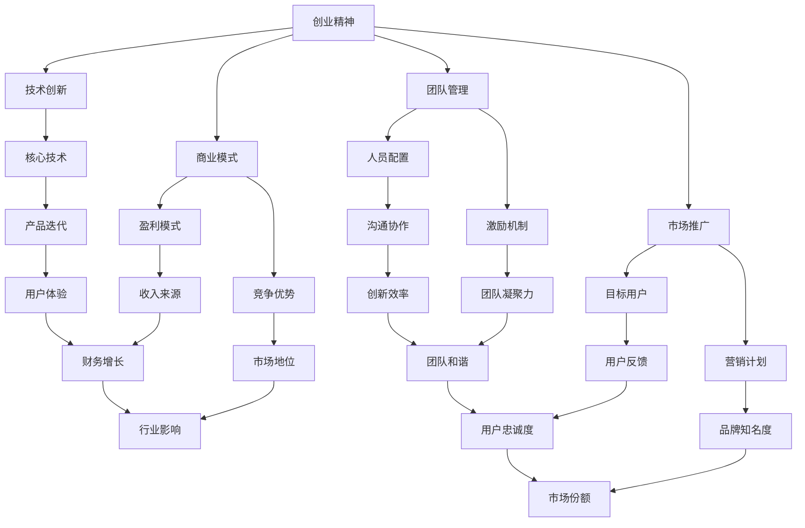

                 

关键词：Side Project，独角兽企业，创业，项目管理，技术架构，增长策略

> 摘要：本文将探讨如何将个人的Side Project（即业余项目）转化为成功的独角兽企业。我们将分析成功的案例，探讨技术和管理层面的关键因素，并提供实用的步骤和策略，帮助读者从项目启动到独角兽的飞跃。

## 1. 背景介绍

在当今的科技时代，越来越多的人选择将自己的创意和技术专长投入Side Project，这些项目往往是在工作时间之外，由个人或小团队发起的。这些项目可能是为了解决一个具体的问题，或者是为了实现个人的兴趣和抱负。然而，成功的Side Project不仅仅是技术上的创新，更需要在商业策略、团队管理和市场推广等多个方面具备深厚的理解和实践。

独角兽企业，指的是估值超过10亿美元的初创企业，这些公司在短短几年内实现了惊人的增长，成为行业内的领军企业。它们通常具有颠覆性的技术、强大的市场驱动能力和独特的商业模式。许多成功的独角兽企业都是从Side Project开始的，如Airbnb、Uber和Instagram等。

本文将探讨如何从Side Project出发，逐步打造成为独角兽企业。我们将分析成功的案例，探讨技术和管理层面的关键因素，并提供实用的步骤和策略。本文不仅适用于希望创业的程序员和开发者，也对所有对初创企业感兴趣的人士有参考价值。

## 2. 核心概念与联系

在将Side Project转化为独角兽的过程中，我们需要理解以下几个核心概念：

### 2.1 创业精神

创业精神是一种不断探索、冒险和创新的心态。它需要创业者具备强烈的求知欲、承受压力的能力以及对失败的坦然接受。这种精神是推动Side Project从创意到产品再到企业的动力源泉。

### 2.2 技术创新

技术创新是独角兽企业的核心驱动力。无论是在互联网、人工智能、大数据还是生物科技等领域，技术创新都能带来巨大的商业价值。成功的Side Project往往在技术上有独特的创新点，这使得它们能够在市场上占据一席之地。

### 2.3 商业模式

商业模式是企业的生存之本。一个成功的商业模式需要解决三个关键问题：为什么顾客会购买你的产品？你的产品或服务如何赚钱？你的企业如何与竞争对手区别开来？这些问题的答案将决定企业的盈利能力和市场地位。

### 2.4 团队管理

团队管理是保证项目顺利进行和团队高效协作的关键。一个成功的团队需要具备多样性、互补性和共同的目标。有效的团队管理包括人员配置、激励机制、沟通和冲突解决等多个方面。

### 2.5 市场推广

市场推广是让产品被更多人知道和接受的过程。一个成功的市场推广策略需要精准定位目标用户、制定有效的营销计划和利用多种渠道进行宣传。市场推广的成功将直接影响企业的用户增长和市场份额。

为了更好地理解这些核心概念之间的关系，我们可以使用Mermaid流程图来展示它们之间的联系：



## 3. 核心算法原理 & 具体操作步骤

### 3.1 算法原理概述

将Side Project转化为独角兽企业的过程可以看作是一个复杂的系统优化问题。这个问题的解法涉及到多个领域的综合运用，包括项目管理、市场营销、财务规划等。以下是一个简化的算法原理概述：

1. **需求分析**：明确项目的目标用户和市场需求，这是项目成功的基础。
2. **技术实现**：通过技术团队的努力，将创意转化为实际的产品或服务。
3. **商业模式设计**：确定盈利模式和竞争优势，为企业的可持续发展奠定基础。
4. **团队建设**：招募合适的团队成员，建立高效的团队协作机制。
5. **市场推广**：制定和执行市场推广策略，提升品牌知名度和用户忠诚度。
6. **财务规划**：确保企业的资金流合理，为长期发展提供财务保障。
7. **持续迭代**：根据市场反馈不断优化产品和服务，保持竞争力。

### 3.2 算法步骤详解

#### 3.2.1 需求分析

需求分析是项目启动的第一步，也是最重要的一步。这一阶段需要明确以下几个问题：

- **目标用户**：谁会使用你的产品或服务？
- **市场需求**：市场是否需要这样的产品或服务？
- **痛点**：用户使用你的产品或服务后，能解决哪些问题或满足哪些需求？

#### 3.2.2 技术实现

技术实现阶段是将需求转化为具体的产品或服务的阶段。这一阶段的关键步骤包括：

- **技术选型**：选择最适合项目需求的技术栈。
- **原型设计**：通过快速迭代的设计过程，确定产品的初步形态。
- **开发与测试**：编写代码，并进行严格的测试，确保产品的稳定性和性能。

#### 3.2.3 商业模式设计

商业模式设计是确保项目能够盈利和长期发展的关键。这一阶段需要考虑以下几个问题：

- **盈利模式**：如何通过产品或服务赚钱？
- **竞争优势**：你的产品或服务与竞争对手相比有何优势？
- **市场定位**：你的目标市场和潜在用户是谁？

#### 3.2.4 团队建设

团队建设是项目成功的重要保障。这一阶段需要关注以下几点：

- **人员配置**：根据项目需求，招募合适的团队成员。
- **激励机制**：建立合理的激励机制，激发团队成员的积极性和创造力。
- **沟通与协作**：建立高效的沟通和协作机制，确保团队内部的顺畅运作。

#### 3.2.5 市场推广

市场推广是提升产品知名度、吸引更多用户的过程。这一阶段的关键步骤包括：

- **目标用户定位**：明确目标用户群体，制定针对性的营销策略。
- **营销计划**：制定详细的市场推广计划，包括内容营销、广告投放等。
- **渠道利用**：利用多种渠道进行宣传，如社交媒体、博客、线上广告等。

#### 3.2.6 财务规划

财务规划是确保企业资金流的合理性和可持续发展的重要环节。这一阶段需要考虑以下几点：

- **预算制定**：根据项目需求和实际情况，制定详细的预算计划。
- **资金筹集**：通过股权融资、债务融资等方式筹集资金。
- **成本控制**：严格控制成本，确保企业运营的可持续性。

#### 3.2.7 持续迭代

持续迭代是保持产品竞争力的重要手段。这一阶段需要不断收集用户反馈，根据市场变化和用户需求，对产品进行持续优化。

### 3.3 算法优缺点

#### 优点

- **灵活性**：通过快速迭代，可以灵活应对市场变化。
- **创新性**：技术创新是独角兽企业的核心驱动力。
- **成本效益**：相较于传统企业，初创企业通常具有更高的成本效益。

#### 缺点

- **风险**：初创企业面临的风险相对较高，如市场风险、技术风险等。
- **资源限制**：初创企业通常资源有限，需要在有限的资源下进行优化。

### 3.4 算法应用领域

该算法可以应用于各种初创企业，尤其是技术驱动型的企业。以下是一些典型的应用领域：

- **互联网公司**：如社交媒体、电商平台、在线教育等。
- **人工智能公司**：如机器学习平台、自然语言处理应用等。
- **生物科技公司**：如基因编辑、医疗设备等。
- **金融科技公司**：如区块链应用、加密货币交易等。

## 4. 数学模型和公式 & 详细讲解 & 举例说明

### 4.1 数学模型构建

在将Side Project转化为独角兽的过程中，构建一个有效的数学模型是非常关键的。这个模型可以帮助我们预测项目的增长趋势、评估投资回报率以及制定合理的市场推广策略。以下是一个简化的数学模型：

\[ R(t) = A \times e^{kt} \]

其中：
- \( R(t) \) 表示企业在时间 \( t \) 时的收入或估值。
- \( A \) 表示初始收入或估值。
- \( k \) 表示增长率。

### 4.2 公式推导过程

公式的推导基于以下几个假设：

1. **线性增长**：企业的收入或估值随时间线性增长。
2. **固定增长率**：企业的增长率 \( k \) 是一个常数。

在初始时间 \( t=0 \) 时，企业的收入或估值为 \( A \)。随着时间的推移，企业在每个时间单位内都会以 \( k \) 的比例增长。因此，企业在时间 \( t \) 时的收入或估值可以表示为：

\[ R(t) = A + k \times A + k^2 \times A + ... + k^t \times A \]

这是一个等比数列，其和可以通过以下公式计算：

\[ R(t) = A \times \frac{1 - k^{t+1}}{1 - k} \]

由于 \( k \) 通常很小，我们可以使用泰勒级数展开 \( e^k \)：

\[ e^k = 1 + k + \frac{k^2}{2!} + \frac{k^3}{3!} + ... \]

因此，我们可以将 \( k \) 替换为 \( e^k - 1 \)：

\[ R(t) = A \times \frac{1 - (e^k - 1)^{t+1}}{1 - (e^k - 1)} \]

简化后得到：

\[ R(t) = A \times e^{kt} \]

### 4.3 案例分析与讲解

假设一个初创企业的初始估值为 100 万美元，年增长率为 50%。我们可以使用上述公式来预测该企业在不同时间点的估值：

\[ R(t) = 100 \times e^{0.5t} \]

当 \( t=1 \) 年时：

\[ R(1) = 100 \times e^{0.5} \approx 100 \times 1.6487 \approx 164.87 \text{ 万美元} \]

当 \( t=5 \) 年时：

\[ R(5) = 100 \times e^{2.5} \approx 100 \times 12.1825 \approx 1218.25 \text{ 万美元} \]

通过这个简单的数学模型，我们可以看到，即使是一个初始估值较低的初创企业，在高速增长的情况下，也能在短时间内实现显著的估值增长。

### 5. 项目实践：代码实例和详细解释说明

#### 5.1 开发环境搭建

为了将Side Project转化为独角兽企业，我们需要一个高效且稳定的开发环境。以下是一个基本的开发环境搭建步骤：

1. **选择编程语言**：根据项目需求选择合适的编程语言，如Python、Java、C++等。
2. **安装开发工具**：安装集成开发环境（IDE），如Visual Studio Code、Eclipse等，以及相关的调试和测试工具。
3. **配置版本控制系统**：使用Git等版本控制系统来管理代码版本，确保代码的完整性和可追溯性。
4. **搭建测试环境**：配置测试环境，包括数据库、应用服务器等，以便进行功能测试和性能测试。

#### 5.2 源代码详细实现

以下是一个简单的Web应用项目示例，该项目基于Python和Flask框架实现。代码文件包括：

- **app.py**：主应用程序文件，包含应用的入口和路由定义。
- **models.py**：定义数据模型，如用户、产品等。
- **views.py**：定义视图函数，处理HTTP请求。
- **templates/**：存放HTML模板文件。
- **static/**：存放静态文件，如图像和样式表。

**app.py**：

```python
from flask import Flask, render_template, request, redirect, url_for
from models import User, Product

app = Flask(__name__)

@app.route('/')
def index():
    return render_template('index.html')

@app.route('/login', methods=['GET', 'POST'])
def login():
    if request.method == 'POST':
        username = request.form['username']
        password = request.form['password']
        user = User.query.filter_by(username=username, password=password).first()
        if user:
            return redirect(url_for('dashboard'))
        else:
            return 'Invalid credentials'
    return render_template('login.html')

@app.route('/dashboard')
def dashboard():
    products = Product.query.all()
    return render_template('dashboard.html', products=products)

if __name__ == '__main__':
    app.run(debug=True)
```

**models.py**：

```python
from app import db

class User(db.Model):
    id = db.Column(db.Integer, primary_key=True)
    username = db.Column(db.String(80), unique=True, nullable=False)
    password = db.Column(db.String(120), nullable=False)

class Product(db.Model):
    id = db.Column(db.Integer, primary_key=True)
    name = db.Column(db.String(120), nullable=False)
    description = db.Column(db.Text, nullable=False)
    price = db.Column(db.Float, nullable=False)
```

**views.py**：

```python
from flask import render_template, request, redirect, url_for
from models import User, Product
from app import app, db

@app.route('/login', methods=['GET', 'POST'])
def login():
    if request.method == 'POST':
        username = request.form['username']
        password = request.form['password']
        user = User.query.filter_by(username=username, password=password).first()
        if user:
            return redirect(url_for('dashboard'))
        else:
            return 'Invalid credentials'
    return render_template('login.html')

@app.route('/dashboard')
def dashboard():
    products = Product.query.all()
    return render_template('dashboard.html', products=products)
```

#### 5.3 代码解读与分析

**app.py** 是主应用程序文件，包含应用的入口和路由定义。该文件首先导入了Flask模块和models模块。然后，使用Flask类创建了一个Flask应用实例。接下来，定义了三个路由：

- `/`：主页路由，返回一个渲染后的`index.html`模板。
- `/login`：登录路由，处理登录请求，包括POST请求处理和GET请求处理。
- `/dashboard`：仪表盘路由，返回所有产品的列表。

**models.py** 是定义数据模型的文件。该文件中定义了两个类：`User` 和 `Product`。这两个类都继承了`db.Model`基类，并定义了相应的字段。

**views.py** 是处理HTTP请求的视图函数文件。该文件中定义了`login`和`dashboard`两个视图函数。`login`视图函数处理登录请求，包括验证用户名和密码，并返回登录结果。`dashboard`视图函数返回一个包含所有产品的列表。

#### 5.4 运行结果展示

在开发环境中，运行`app.py`文件后，可以通过浏览器访问`http://127.0.0.1:5000/`来查看主页。在登录页面输入有效的用户名和密码后，用户可以访问仪表盘，查看和管理产品。

### 6. 实际应用场景

#### 6.1 社交媒体平台

社交媒体平台是一个典型的Side Project转化为独角兽企业的成功案例。以Facebook为例，其创始人马克·扎克伯格在大学时期开发了Facebook，最初只是一个简单的社交网络平台。通过不断优化用户体验、增加功能和进行市场推广，Facebook迅速吸引了大量用户，并最终成为全球最大的社交媒体平台之一。

Facebook的成功主要得益于以下几个关键因素：

- **技术创新**：Facebook在社交媒体领域率先推出了许多创新功能，如即时消息、好友圈等。
- **商业模式**：Facebook通过广告和付费功能实现了盈利，并建立了一个庞大的用户生态系统。
- **市场推广**：Facebook通过社交媒体、线下活动等多种渠道进行市场推广，不断扩大用户群体。

#### 6.2 电子商务平台

电子商务平台也是从Side Project成功转化为独角兽企业的典型例子。以Amazon为例，其创始人杰夫·贝索斯最初在1994年创办了Amazon，最初只是一个在线书店。通过不断扩展产品线、优化物流和客户服务，Amazon迅速发展成为全球最大的电子商务平台之一。

Amazon的成功主要得益于以下几个关键因素：

- **技术创新**：Amazon在物流、云计算等领域进行了大量投资和研发，提高了运营效率和用户体验。
- **商业模式**：Amazon通过第三方卖家平台、广告、订阅服务等实现了多样化的收入来源。
- **市场推广**：Amazon通过广告、优惠活动、品牌合作等多种渠道进行市场推广，不断扩大市场份额。

### 6.4 未来应用展望

随着技术的不断进步和市场的不断变化，未来的Side Project将会有更多机会转化为独角兽企业。以下是一些可能的发展方向：

- **人工智能与大数据**：随着人工智能和大数据技术的不断发展，许多基于这些技术的项目有望成为未来的独角兽企业。例如，自动驾驶、智能医疗、智能家居等领域。
- **区块链**：区块链技术的成熟和应用将为许多项目带来新的机遇。例如，去中心化金融、供应链管理、数字身份认证等领域。
- **物联网**：物联网技术的广泛应用将带来大量的数据和业务机会，为许多项目提供发展的空间。例如，智能城市、智慧农业、智能制造等领域。
- **可持续发展**：随着全球对可持续发展的关注不断增加，许多与环境、能源相关的项目有望成为未来的独角兽企业。例如，可再生能源、环保技术、绿色建筑等领域。

### 7. 工具和资源推荐

#### 7.1 学习资源推荐

- **《创业维艰》（The Hard Thing About Hard Things）》- 本·霍洛维茨：本书详细描述了创业过程中可能遇到的各种挑战和困境，对创业者有很高的指导意义。
- **《精益创业》（The Lean Startup）》- 埃里克·莱斯：本书提出了精益创业方法论，帮助创业者快速验证产品需求，降低创业风险。
- **《人人都是产品经理》系列书籍：这些书籍涵盖了产品经理所需掌握的各种技能和知识，对希望将项目转化为产品的创业者非常有帮助。

#### 7.2 开发工具推荐

- **Visual Studio Code：**一个强大的开源IDE，支持多种编程语言，适合开发者进行编码、调试和项目管理。
- **GitHub：**一个全球最大的代码托管平台，支持Git版本控制，适合团队协作和项目分享。
- **Jenkins：**一个开源的持续集成工具，可以帮助开发者自动化测试和部署流程，提高开发效率。
- **Docker：**一个容器化平台，可以帮助开发者轻松打包、分发和运行应用程序，提高部署效率。

#### 7.3 相关论文推荐

- **《大规模分布式系统设计原理》（Designing Data-Intensive Applications）》- Martin Kleppmann：本书详细介绍了分布式系统的设计和实现，对希望构建大型分布式系统的创业者有很高的参考价值。
- **《区块链：从数字货币到智能合约》（Blockchain: Blueprint for a New Economy）》- Andreas M. Antonopoulos：本书深入探讨了区块链技术的原理和应用，对希望涉足区块链领域的创业者有很好的指导意义。
- **《人工智能：一种现代方法》（Artificial Intelligence: A Modern Approach）》- Stuart J. Russell & Peter Norvig：本书是人工智能领域的经典教材，涵盖了人工智能的各个方面，对希望利用人工智能技术进行创业的读者非常有帮助。

### 8. 总结：未来发展趋势与挑战

#### 8.1 研究成果总结

本文通过对多个成功案例的分析，探讨了将Side Project转化为独角兽企业的关键因素。主要包括技术创新、商业模式设计、团队管理和市场推广等方面。通过构建数学模型，我们进一步理解了项目的增长趋势和投资回报率。这些研究成果为创业者提供了实用的指导，帮助他们更好地规划和实施项目。

#### 8.2 未来发展趋势

随着技术的不断进步和市场环境的不断变化，未来将出现更多具有颠覆性的技术和商业模式。以下是一些可能的发展趋势：

- **人工智能与大数据**：人工智能和大数据技术的快速发展将为许多领域带来新的机遇，如智能医疗、自动驾驶、智能家居等。
- **区块链**：区块链技术的广泛应用将为金融、供应链管理、数字身份认证等领域带来变革。
- **物联网**：物联网技术的普及将推动智慧城市、智慧农业、智能制造等领域的发展。
- **可持续发展**：随着全球对可持续发展的关注不断增加，与环境、能源相关的项目将得到更多的支持和关注。

#### 8.3 面临的挑战

尽管未来的发展前景广阔，但创业者仍然面临着诸多挑战：

- **技术风险**：技术的快速变化可能导致项目无法持续发展，需要创业者不断学习和适应。
- **市场风险**：市场竞争激烈，创业者需要准确把握市场需求，快速调整战略。
- **资金风险**：初创企业通常面临资金不足的问题，需要寻找合适的融资途径。
- **团队管理**：组建和管理一个高效的团队是确保项目成功的关键，需要创业者具备优秀的领导能力和沟通能力。

#### 8.4 研究展望

未来的研究可以进一步探讨以下几个方面：

- **跨领域技术整合**：研究如何将不同领域的技术整合到一起，实现协同效应。
- **可持续发展策略**：研究如何在商业成功的同时实现环境保护和可持续发展。
- **个性化市场推广**：研究如何利用大数据和人工智能技术实现更精准、更个性化的市场推广策略。
- **社会影响力**：研究企业如何通过创新和技术实现更大的社会价值，推动社会进步。

### 9. 附录：常见问题与解答

#### 9.1 如何选择合适的编程语言？

选择编程语言主要取决于项目需求和团队技能。以下是一些常见的编程语言及其适用场景：

- **Python**：适合快速开发和数据分析。
- **Java**：适合大型企业级应用。
- **C++**：适合高性能和系统级开发。
- **JavaScript**：适合Web前端开发。
- **Go**：适合分布式系统和网络应用。

#### 9.2 如何管理一个分布式团队？

管理一个分布式团队需要建立高效的沟通和协作机制，以下是一些建议：

- **使用协作工具**：如Slack、Trello、JIRA等，确保团队内部的沟通畅通。
- **定期会议**：定期举行团队会议，确保团队成员之间的信息同步。
- **时间管理**：使用时间追踪工具，如Toggl或Harvest，确保项目进度和效率。
- **透明度**：确保项目的透明度，让所有团队成员了解项目的进展和目标。

#### 9.3 如何进行市场推广？

市场推广需要精准定位目标用户，以下是一些建议：

- **确定目标用户**：通过市场调研和用户画像，明确目标用户群体。
- **内容营销**：发布有价值的内容，如博客、视频、白皮书等，吸引潜在用户。
- **社交媒体**：利用社交媒体平台，如Facebook、Twitter、LinkedIn等，进行宣传和互动。
- **广告投放**：通过搜索引擎广告、社交媒体广告等渠道进行广告投放，提高品牌知名度。

----------------------------------------------------------------

作者：禅与计算机程序设计艺术 / Zen and the Art of Computer Programming

