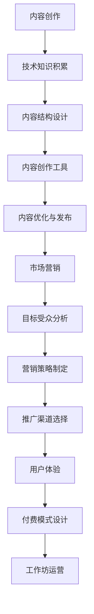

                 

关键词：技术分享、付费工作坊、策略、市场营销、内容创建、社交媒体

> 摘要：本文旨在探讨如何将技术分享成功转化为付费工作坊。通过分析成功案例、制定有效的策略，提供实用的工具和资源，以及展望未来趋势与挑战，帮助技术专家实现技术分享的盈利化。

## 1. 背景介绍

在信息化时代，技术分享已经成为IT领域专家和爱好者之间的重要交流方式。随着互联网的普及，各种技术博客、论坛、视频平台等成为技术分享的主要载体。然而，尽管技术分享本身具有一定的价值，但其盈利能力却往往被忽视。将技术分享转化为付费工作坊，不仅能够提升分享内容的商业价值，还能为技术专家带来额外的收入。

本文将探讨以下几个关键问题：

- 为什么将技术分享转化为付费工作坊是一个有利可图的选择？
- 如何制定有效的策略来推广和营销付费工作坊？
- 需要哪些工具和资源来支持付费工作坊的创建和运营？
- 未来的发展趋势和面临的挑战是什么？

## 2. 核心概念与联系

在将技术分享转化为付费工作坊之前，我们需要了解几个核心概念，这些概念包括：内容创作、市场营销、用户体验等。以下是一个简化的 Mermaid 流程图，展示了这些概念之间的关系。



### 2.1 内容创作

内容创作是技术分享的核心。一个成功的付费工作坊需要有高质量、有价值的内容作为基础。技术专家需要不断积累专业知识，并将其转化为易于理解的内容。

### 2.2 内容结构设计

内容结构设计决定了内容的易读性和逻辑性。一个良好的内容结构能够帮助学员更快地掌握知识，从而提高工作坊的满意度。

### 2.3 内容创作工具

选择合适的内容创作工具能够提高工作效率，例如Markdown编辑器、视频录制软件等。

### 2.4 内容优化与发布

内容优化包括SEO优化、格式优化等，以确保内容在搜索引擎中易于发现，并且符合用户阅读习惯。发布平台的选择也至关重要。

### 2.5 市场营销

市场营销是将内容推向目标受众的关键。有效的市场营销策略能够吸引更多的潜在学员，提高工作坊的知名度。

### 2.6 目标受众分析

了解目标受众的需求、兴趣和行为习惯，是制定有效市场营销策略的基础。

### 2.7 营销策略制定

营销策略包括广告投放、社交媒体营销、内容营销等，每种策略都有其独特的优势和适用场景。

### 2.8 推广渠道选择

推广渠道的选择取决于目标受众的特点和营销策略。常见的推广渠道包括社交媒体、专业论坛、博客等。

### 2.9 用户体验

用户体验决定了学员对工作坊的满意度。良好的用户体验能够提高学员的参与度和留存率。

### 2.10 付费模式设计

根据工作坊的内容、受众和市场需求，设计合理的付费模式，如一次性付费、会员制等。

### 2.11 工作坊运营

工作坊运营包括学员管理、课程更新、反馈收集等，确保工作坊的持续发展和学员满意度。

## 3. 核心算法原理 & 具体操作步骤

### 3.1 算法原理概述

将技术分享转化为付费工作坊的核心算法可以概括为“价值最大化策略”。该策略的核心思想是通过优化内容创作、市场营销和用户体验，实现工作坊的商业价值最大化。

### 3.2 算法步骤详解

#### 3.2.1 内容创作

1. 确定内容主题：根据市场需求和自身优势，选择具有竞争力的主题。
2. 收集资料：通过文献调研、实践总结等方式，积累相关领域的知识。
3. 内容结构设计：构建逻辑清晰、易于理解的内容结构。
4. 内容创作工具：选择适合的Markdown编辑器、视频录制软件等工具。
5. 内容优化与发布：进行SEO优化、格式优化，确保内容在搜索引擎中易于发现。

#### 3.2.2 市场营销

1. 目标受众分析：通过问卷调查、数据分析等方法，了解目标受众的需求和兴趣。
2. 营销策略制定：根据目标受众的特点，选择合适的营销策略，如广告投放、社交媒体营销等。
3. 推广渠道选择：根据目标受众的特点和营销策略，选择合适的推广渠道。
4. 营销效果评估：定期评估营销效果，调整营销策略。

#### 3.2.3 用户体验

1. 学员管理：建立学员档案，定期与学员沟通，了解学员需求和反馈。
2. 课程更新：根据市场需求和学员反馈，持续更新课程内容。
3. 反馈收集：建立反馈渠道，收集学员对工作坊的反馈，改进工作坊运营。

#### 3.2.4 付费模式设计

1. 分析市场需求：了解目标受众的付费能力和意愿。
2. 设计付费模式：根据市场需求和内容特点，设计合理的付费模式，如一次性付费、会员制等。
3. 付费流程设计：确保付费流程简单、高效，提高学员的支付意愿。

#### 3.2.5 工作坊运营

1. 学员管理：建立学员档案，定期与学员沟通，了解学员需求和反馈。
2. 课程更新：根据市场需求和学员反馈，持续更新课程内容。
3. 反馈收集：建立反馈渠道，收集学员对工作坊的反馈，改进工作坊运营。

### 3.3 算法优缺点

#### 优点

1. 提高技术分享的商业价值，实现盈利化。
2. 满足目标受众的需求，提高学员满意度。
3. 促进技术知识的传播和积累。

#### 缺点

1. 内容创作和营销成本较高。
2. 对技术专家的市场敏锐度和运营能力要求较高。
3. 工作坊运营过程中可能面临各种挑战，如学员管理、课程更新等。

### 3.4 算法应用领域

该算法适用于各类技术领域，如软件开发、数据分析、人工智能等。通过将技术分享转化为付费工作坊，技术专家可以更好地传播知识，实现个人和团队的成长。

## 4. 数学模型和公式 & 详细讲解 & 举例说明

### 4.1 数学模型构建

将技术分享转化为付费工作坊的数学模型可以概括为以下公式：

$$
收益 = 内容价值 \times 学员数量 \times 转化率
$$

其中：

- 内容价值：取决于工作坊的内容质量、市场需求和学员评价。
- 学员数量：取决于市场营销效果和学员获取渠道。
- 转化率：取决于工作坊的付费模式和学员的付费意愿。

### 4.2 公式推导过程

1. 收益 = 学员支付金额 × 学员数量
2. 学员支付金额 = 内容价值 × 学员意愿支付金额
3. 学员意愿支付金额 = 市场参考价格 × 学员对内容价值的感知
4. 市场参考价格 = 同类工作坊的价格水平
5. 学员对内容价值的感知 = 内容质量 × 学员对内容的认可度

### 4.3 案例分析与讲解

假设某技术专家计划开展一场关于Python数据分析的付费工作坊，市场需求旺盛，学员对Python数据分析的需求较高。以下为该工作坊的收益分析：

1. 内容价值：根据市场调研和学员反馈，Python数据分析工作坊的内容价值约为1000元。
2. 学员数量：通过市场营销，预计可吸引100名学员。
3. 转化率：根据学员意愿支付金额和市场参考价格的比例，假设转化率为80%。

代入公式：

$$
收益 = 1000 \times 100 \times 0.8 = 80000（元）
$$

### 4.4 案例分析结果

通过以上分析，该Python数据分析工作坊的预期收益为80000元。当然，实际收益会受到多种因素的影响，如内容质量、市场营销效果、学员满意度等。

## 5. 项目实践：代码实例和详细解释说明

### 5.1 开发环境搭建

为了实践将技术分享转化为付费工作坊，我们可以选择一个简单的Python数据分析项目，如使用Pandas库进行数据分析。以下是开发环境搭建的步骤：

1. 安装Python：在官方网站下载并安装Python。
2. 安装Pandas库：使用pip命令安装Pandas库。

```bash
pip install pandas
```

3. 准备数据集：选择一个简单的数据集，如某城市的人口统计数据。

### 5.2 源代码详细实现

以下是一个简单的Python数据分析项目，使用Pandas库进行数据读取、清洗和可视化。

```python
import pandas as pd
import matplotlib.pyplot as plt

# 读取数据
data = pd.read_csv('population_data.csv')

# 数据清洗
data = data.dropna()

# 数据分析
population_by_year = data.groupby('Year')['Population'].sum()

# 可视化
population_by_year.plot()
plt.title('Population Growth by Year')
plt.xlabel('Year')
plt.ylabel('Population')
plt.show()
```

### 5.3 代码解读与分析

1. 读取数据：使用Pandas库读取CSV文件，存储为DataFrame对象。
2. 数据清洗：删除缺失值，确保数据质量。
3. 数据分析：对数据集进行分组和汇总，计算每年的人口总和。
4. 可视化：使用Matplotlib库绘制人口增长趋势图。

### 5.4 运行结果展示

运行以上代码，将生成一个人口增长趋势图，展示某城市的人口变化情况。通过可视化结果，可以更直观地了解人口变化趋势，为决策提供依据。

## 6. 实际应用场景

### 6.1 教育培训行业

在教育培训行业，技术专家可以将技术分享转化为线上或线下工作坊，为学员提供专业的技术培训。通过付费工作坊，技术专家不仅能够实现知识传播，还能获得经济收益。

### 6.2 企业培训

对于企业来说，技术专家可以将技术分享转化为内部培训，帮助员工提升专业技能。企业可以按需定制工作坊内容，提高员工的工作效率和企业竞争力。

### 6.3 自媒体

在自媒体时代，技术专家可以通过微信公众号、知乎专栏等平台，将技术分享转化为付费内容。通过优质的内容和专业的讲解，吸引粉丝和学员，实现知识变现。

### 6.4 专业论坛

在专业论坛，技术专家可以开设付费专栏，分享专业知识和实践经验。通过付费内容，论坛能够提升用户粘性，增加收入来源。

## 7. 未来应用展望

### 7.1 技术进步

随着技术的不断发展，新的编程语言、框架和工具不断涌现，技术专家可以通过付费工作坊，帮助学员掌握最新的技术，提升竞争力。

### 7.2 市场需求

随着数字化转型和人工智能的普及，对技术人才的需求持续增长。技术专家可以通过付费工作坊，满足市场需求，实现个人和团队的成长。

### 7.3 跨界融合

未来，技术分享与艺术、设计、管理等领域的跨界融合将更加紧密，产生新的商业模式和业务场景。

### 7.4 个性化定制

通过大数据和人工智能技术，未来的付费工作坊将更加个性化，满足学员的个性化需求。

## 8. 工具和资源推荐

### 8.1 学习资源推荐

1. 《深度学习》（Goodfellow, Y., Bengio, Y., & Courville, A.）
2. 《Python编程：从入门到实践》（Eric Matthes）
3. 《算法导论》（Thomas H. Cormen, Charles E. Leiserson, Ronald L. Rivest, and Clifford Stein）

### 8.2 开发工具推荐

1. PyCharm：一款功能强大的Python集成开发环境。
2. Jupyter Notebook：适用于数据科学和机器学习的交互式计算环境。
3. Git：一款版本控制工具，有助于代码管理和团队协作。

### 8.3 相关论文推荐

1. "Deep Learning: A Comprehensive Overview"（Yoshua Bengio，2019）
2. "A Theoretical Survey of Deep Learning"（Yann LeCun，2015）
3. "Big Data: A Revolution That Will Transform How We Live, Work, and Think"（Viktor Mayer-Schönberger and Kenneth Cukier，2013）

## 9. 总结：未来发展趋势与挑战

### 9.1 研究成果总结

本文通过分析成功案例，提出了将技术分享转化为付费工作坊的策略，并详细介绍了核心算法原理、数学模型、项目实践和未来应用展望。

### 9.2 未来发展趋势

1. 技术进步将继续推动付费工作坊的发展。
2. 市场需求将不断增长，为技术专家提供更多机会。
3. 跨界融合将产生新的商业模式和业务场景。

### 9.3 面临的挑战

1. 内容创作和营销成本较高。
2. 对技术专家的市场敏锐度和运营能力要求较高。
3. 工作坊运营过程中可能面临各种挑战，如学员管理、课程更新等。

### 9.4 研究展望

未来，如何优化付费工作坊的运营模式，提高用户体验和学员满意度，将是研究的重点。此外，结合大数据和人工智能技术，实现付费工作坊的个性化定制，也是未来的发展方向。

## 10. 附录：常见问题与解答

### 10.1 如何确定内容主题？

1. 分析市场需求：了解行业热点和技术趋势，确定具有竞争力的主题。
2. 结合自身优势：根据自身专业背景和经验，选择擅长的领域。
3. 调查目标受众：通过问卷调查、访谈等方式，了解目标受众的需求和兴趣。

### 10.2 如何制定有效的营销策略？

1. 确定目标受众：了解目标受众的特点、需求和兴趣。
2. 选择合适的营销渠道：根据目标受众的特点，选择合适的推广渠道。
3. 制定多样化的营销策略：结合内容特点，制定广告投放、内容营销、社交媒体营销等多种策略。

### 10.3 如何提高学员满意度？

1. 提供高质量的内容：确保工作坊的内容具有实用性和前沿性。
2. 优化用户体验：简化付费流程，提供良好的客户服务。
3. 持续更新课程：根据市场需求和学员反馈，不断更新课程内容。

## 11. 作者署名

作者：禅与计算机程序设计艺术 / Zen and the Art of Computer Programming

以上就是关于如何将技术分享转化为付费工作坊的详细探讨。希望本文能为技术专家提供有价值的参考，帮助实现技术分享的盈利化。愿技术分享之路越走越宽，共同推动计算机科学的进步。

