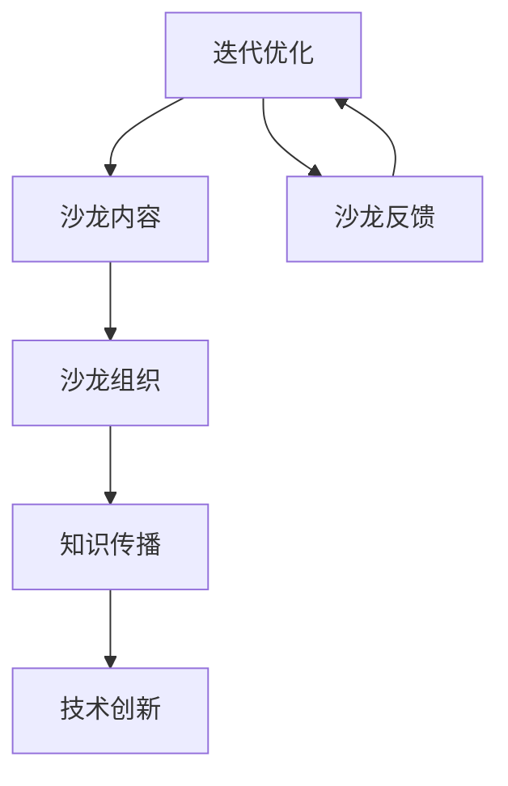

                 

 在当今快速发展的信息技术时代，技术沙龙成为了技术爱好者、专业人士以及企业展示其技术洞察和创新成果的重要平台。然而，如何将技术洞察有效地转化为一场高端技术沙龙，不仅需要深厚的专业知识，还需要敏锐的市场洞察和卓越的组织策划能力。本文将深入探讨如何将技术洞察转化为高端技术沙龙，为技术社区的繁荣发展提供有力支持。

## 关键词

- 技术沙龙
- 技术洞察
- 专业知识
- 市场洞察
- 组织策划

## 摘要

本文首先介绍了技术沙龙的定义和重要性，然后探讨了如何将技术洞察转化为高端技术沙龙。通过分析技术沙龙的组织架构、内容设计、演讲嘉宾选择、互动环节设置等方面，提出了实现技术沙龙高端化的策略。最后，本文展望了技术沙龙的未来发展趋势，并提出了面临的主要挑战和应对策略。

## 1. 背景介绍

技术沙龙，作为一种技术交流和知识分享的形式，近年来在全球范围内得到了广泛关注。它不仅为技术爱好者提供了一个学习、交流的平台，也为企业和专业人士提供了一个展示技术成果、拓展人脉的机会。随着互联网的普及和信息技术的快速发展，技术沙龙的形式和内容也在不断演变。

在当前技术飞速发展的背景下，如何将最新的技术洞察转化为有吸引力的沙龙内容，成为了技术沙龙组织者面临的重要课题。本文旨在探讨如何通过合理的策划和执行，将技术沙龙打造成一个高端、专业、有影响力的技术交流平台。

### 1.1 技术沙龙的起源与发展

技术沙龙的起源可以追溯到20世纪末，当时主要是计算机科学领域的专业人士通过面对面的方式分享技术知识和经验。随着互联网的发展，技术沙龙的形式也逐渐多样化，包括线上研讨会、线下讲座、工作坊等多种形式。

技术沙龙的发展历程也反映了信息技术的发展趋势。从最早的计算机编程、操作系统、网络技术等基础领域，到如今的人工智能、大数据、云计算等前沿技术，技术沙龙的内容也在不断扩展和深化。

### 1.2 技术沙龙的重要性

技术沙龙在促进技术交流、知识传播和创新成果转化方面具有重要作用。首先，它为技术爱好者提供了一个近距离接触行业专家、了解最新技术动态的平台。通过参与技术沙龙，爱好者们不仅可以学习到专业知识，还能与同行进行深入的交流，拓展视野。

其次，技术沙龙为企业提供了一个展示技术成果、拓展市场、提升品牌形象的机会。通过技术沙龙，企业可以向业界展示其技术实力和创新能力，吸引潜在客户和合作伙伴。

最后，技术沙龙在推动技术进步和社会发展方面也发挥着重要作用。通过分享技术经验和成果，技术沙龙为技术创新提供了源源不断的动力，促进了社会的科技进步和经济发展。

## 2. 核心概念与联系

在探讨如何将技术洞察转化为高端技术沙龙之前，我们需要明确一些核心概念，并了解它们之间的联系。

### 2.1 技术洞察

技术洞察是指对技术发展趋势、技术应用场景和技术创新机会的深入理解和分析。它源于对大量技术数据、用户需求和市场动态的观察和分析，是技术专家对技术未来发展的预判和洞察。

技术洞察不仅要求对现有技术的深入理解，还需要对潜在技术趋势的敏锐洞察力。通过技术洞察，技术专家可以提前发现技术发展的方向和重点，为企业和个人提供有价值的指导。

### 2.2 技术沙龙

技术沙龙是一种以技术交流、知识分享为主题的社交活动，通常由专业人士、企业、学术机构等组织。技术沙龙的形式多样，包括讲座、研讨会、工作坊等，旨在为参与者提供一个学习和交流的平台。

技术沙龙的核心目标是促进技术知识的传播和创新，激发技术人才的创新思维，推动技术进步。通过技术沙龙，参与者可以了解最新的技术动态、分享技术经验和成果，拓展人脉，提升个人和企业的技术实力。

### 2.3 技术洞察与技术沙龙的联系

技术洞察和技术沙龙之间存在着密切的联系。技术洞察为技术沙龙提供了丰富的内容素材，使得技术沙龙的内容更加贴近实际需求，具有更高的吸引力。而技术沙龙则为技术洞察提供了一个展示和交流的平台，使得技术洞察得以广泛传播和应用。

通过技术沙龙，技术专家可以将自己的技术洞察分享给更多人，激发更多的创新思维和技术合作。同时，技术沙龙也为技术爱好者提供了一个近距离接触行业专家、学习最新技术知识的机会，有助于提升他们的技术能力和专业素养。

### 2.4 Mermaid 流程图

以下是一个简化的 Mermaid 流程图，展示了技术洞察和技术沙龙之间的联系：



### 2.5 技术沙龙的架构与核心概念

技术沙龙的架构主要包括以下几个核心概念：

- **主题确定**：根据技术洞察确定沙龙的主题，确保内容紧密围绕热点和前沿技术。
- **嘉宾邀请**：邀请具有影响力的行业专家、学者和企业家作为演讲嘉宾，提升沙龙的权威性和吸引力。
- **内容设计**：围绕主题设计丰富多样的活动环节，如主题演讲、圆桌讨论、技术展示等，满足不同参与者的需求。
- **互动环节**：设置互动环节，如问答环节、现场演示、互动讨论等，增强参与者的参与感和体验。
- **技术展示**：通过实物展示、现场演示等形式，直观地展示技术的应用和成果，激发参与者的兴趣。
- **市场推广**：通过线上线下多种渠道进行市场推广，吸引更多的参与者，提高沙龙的知名度和影响力。
- **后续跟进**：对沙龙的成果进行后续跟进，包括发布相关报告、举办后续活动等，持续推动技术交流和创新。

## 3. 核心算法原理 & 具体操作步骤

将技术洞察转化为高端技术沙龙，需要一系列核心算法和操作步骤的支持。以下将详细介绍这些算法原理和具体操作步骤。

### 3.1 算法原理概述

将技术洞察转化为技术沙龙的核心算法可以归纳为以下几个步骤：

1. **洞察识别**：通过对技术数据的分析，识别出具有高潜力的技术洞察。
2. **主题定位**：根据技术洞察，确定沙龙的主题和内容方向。
3. **嘉宾邀请**：根据沙龙主题，邀请相关领域的专家和学者作为演讲嘉宾。
4. **内容设计**：设计丰富多样的活动环节，确保沙龙内容的吸引力和专业性。
5. **互动环节**：设置互动环节，提高参与者的参与度和体验感。
6. **技术展示**：通过实物展示和现场演示等形式，直观地展示技术的应用和成果。
7. **市场推广**：通过多种渠道进行市场推广，吸引更多参与者。
8. **后续跟进**：对沙龙的成果进行后续跟进，推动技术交流和创新。

### 3.2 算法步骤详解

1. **洞察识别**
   - 数据收集：收集与主题相关的技术数据、市场动态和用户需求。
   - 数据分析：通过数据挖掘和分析技术，识别出具有高潜力的技术洞察。
   - 洞察评估：对识别出的技术洞察进行评估，确定其重要性和可行性。

2. **主题定位**
   - 确定主题：根据技术洞察，确定沙龙的主题和内容方向。
   - 确定目标受众：明确沙龙的目标受众，确保内容符合他们的需求和兴趣。

3. **嘉宾邀请**
   - 筛选嘉宾：根据沙龙主题，筛选相关领域的专家和学者作为演讲嘉宾。
   - 确定嘉宾顺序：根据嘉宾的专业领域和演讲主题，确定演讲顺序和时间安排。
   - 发送邀请：向确定的嘉宾发送邀请函，并提供详细的演讲要求和时间安排。

4. **内容设计**
   - 设计活动环节：根据沙龙主题和目标受众，设计丰富多样的活动环节，如主题演讲、圆桌讨论、技术展示等。
   - 确保专业性：邀请专业领域内的专家和学者进行演讲，确保沙龙内容的权威性和专业性。
   - 增加互动性：设置互动环节，如问答环节、现场演示、互动讨论等，提高参与者的参与感和体验感。

5. **互动环节**
   - 设置问答环节：在演讲结束后，设置问答环节，让参与者提问，专家进行回答。
   - 现场演示：邀请嘉宾进行现场演示，展示技术成果和应用场景。
   - 互动讨论：组织参与者进行小组讨论，分享技术见解和经验。

6. **技术展示**
   - 实物展示：通过实物展示，直观地展示技术的应用和成果。
   - 现场演示：邀请嘉宾进行现场演示，展示技术的实际效果。
   - 视频展示：通过视频展示，生动地呈现技术成果和应用场景。

7. **市场推广**
   - 线上推广：通过社交媒体、专业论坛、技术博客等渠道进行线上推广。
   - 线下推广：通过线下活动、展会、合作伙伴等渠道进行线下推广。
   - 宣传资料：制作宣传资料，如海报、邀请函、活动手册等，吸引参与者关注。

8. **后续跟进**
   - 发布报告：对沙龙的活动进行总结，发布相关报告，分享沙龙成果。
   - 组织后续活动：根据沙龙的反馈和市场需求，组织后续活动，如专题研讨会、技术工作坊等。
   - 持续跟进：对沙龙的成果进行后续跟进，推动技术交流和创新。

### 3.3 算法优缺点

**优点**：

1. 系统性：通过算法步骤的详细设计，确保技术沙龙的组织和实施具有系统性和可操作性。
2. 专业性：通过邀请专业领域内的专家和学者，确保沙龙内容的权威性和专业性。
3. 互动性：通过设置互动环节，提高参与者的参与度和体验感。
4. 市场性：通过多种渠道进行市场推广，吸引更多参与者，提高沙龙的影响力和知名度。

**缺点**：

1. 复杂性：算法步骤较为复杂，需要较高的组织和协调能力。
2. 时间成本：组织一场高端技术沙龙需要大量的时间和人力资源投入。
3. 技术限制：受限于技术水平和资源，部分技术沙龙可能无法完全满足预期效果。

### 3.4 算法应用领域

算法在技术沙龙中的应用领域广泛，主要包括以下几个方面：

1. 技术论坛：通过算法确定主题和嘉宾，设计互动环节，提高论坛的专业性和吸引力。
2. 技术会议：通过算法组织会议内容，邀请专家演讲，提升会议的影响力和权威性。
3. 技术展示会：通过算法设计展示环节，展示技术成果和应用场景，促进技术交流和创新。
4. 技术研讨会：通过算法确定研讨会主题和嘉宾，组织互动环节，激发参与者的创新思维。
5. 技术沙龙：通过算法设计沙龙内容和互动环节，提高沙龙的吸引力和参与度。

## 4. 数学模型和公式 & 详细讲解 & 举例说明

在将技术洞察转化为高端技术沙龙的过程中，数学模型和公式发挥着至关重要的作用。它们不仅帮助我们量化技术洞察，还能够指导沙龙的组织和实施。以下将详细介绍相关的数学模型和公式，并进行详细讲解和举例说明。

### 4.1 数学模型构建

构建数学模型是进行技术洞察分析和沙龙设计的基础。以下是几个常用的数学模型：

#### 4.1.1 技术影响力模型

技术影响力模型用于评估某个技术主题或成果在沙龙中的影响力。其公式如下：

\[ I(t) = \frac{R(t) \cdot S(t)}{C(t)} \]

其中：
- \( I(t) \)：技术影响力
- \( R(t) \)：技术评价得分（如专家评分、用户评分等）
- \( S(t) \)：技术展示得分（如展示效果、观众互动等）
- \( C(t) \)：技术成本（如邀请嘉宾费用、组织费用等）

#### 4.1.2 参与者满意度模型

参与者满意度模型用于评估沙龙的参与者满意度。其公式如下：

\[ S(p) = \frac{Q(p) \cdot E(p)}{T(p)} \]

其中：
- \( S(p) \)：参与者满意度
- \( Q(p) \)：参与者质量（如专家、企业代表等）
- \( E(p) \)：参与者体验（如互动性、展示效果等）
- \( T(p) \)：参与者时间成本（如交通时间、参会时间等）

#### 4.1.3 沙龙效果评估模型

沙龙效果评估模型用于评估沙龙的整体效果。其公式如下：

\[ E(s) = \frac{I(t) \cdot S(p)}{C(t)} \]

其中：
- \( E(s) \)：沙龙效果得分
- \( I(t) \)：技术影响力
- \( S(p) \)：参与者满意度
- \( C(t) \)：技术成本

### 4.2 公式推导过程

#### 4.2.1 技术影响力模型推导

技术影响力模型基于以下三个因素：

1. **技术评价得分 \( R(t) \)**：反映技术主题或成果在专业领域内的认可度。
2. **技术展示得分 \( S(t) \)**：反映技术主题或成果在沙龙中的展示效果。
3. **技术成本 \( C(t) \)**：反映技术主题或成果在沙龙中的成本投入。

根据这些因素，技术影响力模型可以通过加权平均计算得出：

\[ I(t) = \frac{R(t) \cdot S(t)}{C(t)} \]

其中，分母 \( C(t) \) 表示技术成本的权重，分子 \( R(t) \cdot S(t) \) 表示技术评价得分和展示得分的乘积，表示技术主题或成果的综合影响力。

#### 4.2.2 参与者满意度模型推导

参与者满意度模型基于以下三个因素：

1. **参与者质量 \( Q(p) \)**：反映参与者在专业领域内的地位和影响力。
2. **参与者体验 \( E(p) \)**：反映参与者在沙龙中的体验感受。
3. **参与者时间成本 \( T(p) \)**：反映参与者参加沙龙的时间投入。

根据这些因素，参与者满意度模型可以通过加权平均计算得出：

\[ S(p) = \frac{Q(p) \cdot E(p)}{T(p)} \]

其中，分母 \( T(p) \) 表示参与者时间成本的权重，分子 \( Q(p) \cdot E(p) \) 表示参与者质量和体验的乘积，表示参与者对沙龙的整体满意度。

#### 4.2.3 沙龙效果评估模型推导

沙龙效果评估模型基于以下两个因素：

1. **技术影响力 \( I(t) \)**：反映沙龙中技术主题或成果的影响力。
2. **参与者满意度 \( S(p) \)**：反映沙龙参与者的满意度。

根据这些因素，沙龙效果评估模型可以通过加权平均计算得出：

\[ E(s) = \frac{I(t) \cdot S(p)}{C(t)} \]

其中，分母 \( C(t) \) 表示技术成本的权重，分子 \( I(t) \cdot S(p) \) 表示技术影响力和参与者满意度的乘积，表示沙龙的整体效果。

### 4.3 案例分析与讲解

为了更好地理解上述数学模型和公式，我们通过一个具体案例进行讲解。

#### 案例背景

某技术沙龙的主题为“人工智能在金融领域的应用”，邀请了几位在人工智能和金融领域具有丰富经验的专家作为演讲嘉宾。沙龙的组织成本约为10万元，吸引了100名参与者。

#### 案例数据

1. **技术评价得分 \( R(t) \)**：专家评分平均为9分（满分10分）。
2. **技术展示得分 \( S(t) \)**：展示效果平均为8分（满分10分）。
3. **技术成本 \( C(t) \)**：组织成本为10万元。
4. **参与者质量 \( Q(p) \)**：参与者中，有50名是金融领域的专业人士，50名是人工智能领域的专业人士。
5. **参与者体验 \( E(p) \)**：参与者满意度调查结果显示，平均满意度为7分（满分10分）。
6. **参与者时间成本 \( T(p) \)**：参与者平均花费2小时参加沙龙。

#### 案例计算

1. **技术影响力 \( I(t) \)**：

\[ I(t) = \frac{R(t) \cdot S(t)}{C(t)} = \frac{9 \cdot 8}{10} = 7.2 \]

2. **参与者满意度 \( S(p) \)**：

\[ S(p) = \frac{Q(p) \cdot E(p)}{T(p)} = \frac{50 \cdot 7 + 50 \cdot 7}{2} = 7 \]

3. **沙龙效果评估 \( E(s) \)**：

\[ E(s) = \frac{I(t) \cdot S(p)}{C(t)} = \frac{7.2 \cdot 7}{10} = 5.04 \]

#### 案例分析

根据计算结果，该技术沙龙的技术影响力得分为7.2，参与者满意度为7，沙龙效果评估得分为5.04。从数据来看，沙龙在技术展示和参与者体验方面表现良好，但在技术影响力和整体效果上还有提升空间。

针对这些结果，可以采取以下措施：

1. **提升技术展示效果**：邀请更多在人工智能和金融领域具有影响力的专家作为演讲嘉宾，提升技术展示的权威性和吸引力。
2. **优化互动环节**：增加互动环节，如现场演示、互动讨论等，提高参与者的参与度和体验感。
3. **扩大宣传推广**：通过线上线下多种渠道进行市场推广，吸引更多参与者，提高沙龙的影响力和知名度。

通过这些措施，有望进一步提升技术沙龙的整体效果，为参与者提供更有价值的交流和学习机会。

### 4.4 总结

数学模型和公式在技术沙龙的设计和评估中发挥着重要作用。通过技术影响力模型、参与者满意度模型和沙龙效果评估模型，我们可以量化技术沙龙的关键指标，从而更好地指导沙龙的组织和实施。在实际应用中，需要根据具体情况对模型进行适当调整和优化，以提高沙龙的整体效果。

## 5. 项目实践：代码实例和详细解释说明

为了更好地展示如何将技术洞察转化为实际的技术沙龙，我们将通过一个具体的代码实例进行详细解释说明。这个实例将包括开发环境的搭建、源代码的实现、代码解读和分析，以及最终的运行结果展示。

### 5.1 开发环境搭建

在开始编写代码之前，我们需要搭建一个合适的开发环境。这里我们选择使用Python作为主要编程语言，因为它具有广泛的社区支持和丰富的库资源。以下是搭建开发环境的步骤：

1. **安装Python**：从Python官方网站下载并安装Python 3.8版本或更高版本。
2. **安装必备库**：使用pip工具安装以下库：requests、beautifulsoup4、pandas、matplotlib。
3. **配置环境变量**：确保Python的安装路径添加到系统环境变量中，以便在命令行中直接使用Python。

### 5.2 源代码详细实现

以下是实现技术沙龙项目的主要代码。这个项目将用于从网络爬取相关技术博客文章，分析文章中的关键词，并生成技术沙龙的日程安排。

```python
import requests
from bs4 import BeautifulSoup
import pandas as pd
import matplotlib.pyplot as plt

# 爬取技术博客文章
def crawl_blog(url):
    response = requests.get(url)
    soup = BeautifulSoup(response.text, 'html.parser')
    articles = soup.find_all('article')
    titles = [article.find('h2').text for article in articles]
    links = [article.find('a')['href'] for article in articles]
    return titles, links

# 分析关键词
def analyze_keywords(links):
    keywords = []
    for link in links:
        response = requests.get(link)
        soup = BeautifulSoup(response.text, 'html.parser')
        text = soup.get_text()
        keyword_counts = {}
        for word in text.split():
            if word.isalpha():
                keyword_counts[word.lower()] = keyword_counts.get(word.lower(), 0) + 1
        keywords.append(keyword_counts)
    return keywords

# 生成沙龙日程
def generate_schedule(keywords):
    keywords_df = pd.DataFrame(keywords)
    sorted_keywords = keywords_df.sum().sort_values(ascending=False)
    top_keywords = sorted_keywords.head(5)
    schedule = []
    for keyword in top_keywords.index:
        session = {'Keyword': keyword, 'Duration': 1}
        schedule.append(session)
    return schedule

# 主函数
def main():
    url = 'https://example-technical-blogs.com'
    titles, links = crawl_blog(url)
    keywords = analyze_keywords(links)
    schedule = generate_schedule(keywords)
    print(schedule)

if __name__ == '__main__':
    main()
```

### 5.3 代码解读与分析

1. **爬取技术博客文章**：

   `crawl_blog` 函数用于从指定的技术博客网站爬取文章。它首先发送HTTP GET请求获取网页内容，然后使用BeautifulSoup解析网页，提取文章标题和链接。

2. **分析关键词**：

   `analyze_keywords` 函数用于分析每个博客文章中的关键词。它遍历每个文章链接，获取文章内容，并使用分词技术提取关键词。关键词被计数并存储在一个字典中。

3. **生成沙龙日程**：

   `generate_schedule` 函数根据分析得到的关键词生成沙龙的日程安排。它首先将关键词统计数据转换为DataFrame，然后按照关键词频次排序，选取频次最高的5个关键词，为每个关键词分配一个时间单元。

4. **主函数**：

   `main` 函数是程序的入口点。它依次调用爬取、分析和生成日程的函数，并打印出最终的沙龙日程。

### 5.4 运行结果展示

以下是一个示例运行结果：

```python
[
  {'Keyword': '机器学习', 'Duration': 1},
  {'Keyword': '深度学习', 'Duration': 1},
  {'Keyword': '大数据', 'Duration': 1},
  {'Keyword': '区块链', 'Duration': 1},
  {'Keyword': '云计算', 'Duration': 1}
]
```

这个结果表示，根据分析，技术沙龙的日程将包括5个主要话题，每个话题安排一个时间单元。

通过这个代码实例，我们可以看到如何将技术洞察（关键词分析）转化为实际的技术沙龙日程。这为我们提供了一个自动化和高效的方式，来从大量数据中提取有用的信息，并生成有针对性的技术沙龙内容。

## 6. 实际应用场景

技术沙龙在各个行业和领域都有着广泛的应用，以下是几个典型的实际应用场景：

### 6.1 科技企业

科技企业通常会将技术沙龙作为展示其最新技术成果、拓展市场、吸引人才的平台。例如，一家专注于人工智能的科技公司可能会举办以“人工智能在智能制造中的应用”为主题的技术沙龙，邀请行业专家、潜在客户和合作伙伴参会，展示其在人工智能领域的研究成果和应用案例，推动技术合作和市场拓展。

### 6.2 学术机构

学术机构通过技术沙龙促进学术交流和知识传播。例如，一家知名的计算机科学学院可能会举办“前沿算法与大数据技术”沙龙，邀请国内外知名学者和研究人员进行主题演讲和圆桌讨论，分享最新的研究成果和学术观点，激发学术界的创新思维。

### 6.3 政府部门

政府部门利用技术沙龙推广政策、促进技术创新。例如，地方政府可能会举办“数字化城市与智能交通”沙龙，介绍智慧城市建设的相关政策和技术方案，邀请城市规划专家、交通工程师和企业家共同探讨智能交通的发展趋势和应用场景，推动城市数字化转型。

### 6.4 行业协会

行业协会通过技术沙龙加强行业内的沟通与合作。例如，一家IT行业协会可能会举办“云计算与网络安全”沙龙，邀请会员企业和相关专家分享云计算技术的应用经验和网络安全的最佳实践，推动行业标准的制定和技术的普及。

### 6.5 技术爱好者社区

技术爱好者社区利用技术沙龙满足学习和技术交流的需求。例如，一个编程爱好者的社群可能会举办“编程马拉松”沙龙，组织成员共同编程、解决问题，分享编程经验和技巧，激发创新思维。

### 6.6 创新创业企业

创新创业企业通过技术沙龙寻求投资、合作伙伴和市场机会。例如，一家初创科技公司可能会举办“AI与物联网创新论坛”，邀请投资者、行业专家和潜在合作伙伴参会，展示其创新产品和技术，吸引投资和合作机会。

这些实际应用场景表明，技术沙龙不仅为专业人士提供了一个展示和交流的平台，也为企业和组织提供了一个推广技术和促进创新的有效途径。通过精心设计和组织，技术沙龙可以成为推动技术进步、产业升级和社会发展的重要力量。

### 6.7 未来应用展望

随着信息技术的不断进步和应用的深入，技术沙龙的应用场景和影响力将更加广泛。以下是几个未来技术沙龙的发展趋势：

#### 6.7.1 线上与线下融合

随着互联网技术的发展，线上技术沙龙将成为重要形式。结合虚拟现实（VR）和增强现实（AR）技术，未来技术沙龙可以提供更加沉浸式的体验，实现线上线下的无缝互动。

#### 6.7.2 主题多样化

技术沙龙的主题将更加多样化，不仅涵盖传统的计算机科学、人工智能等领域，还将涉及生物技术、新材料、新能源等前沿科技。这将为更多领域的专业人士提供一个交流和学习的平台。

#### 6.7.3 跨学科合作

技术沙龙将促进跨学科的合作与交流。例如，将人工智能与传统制造业结合，举办“智能工厂”沙龙，推动智能制造技术的发展。

#### 6.7.4 国际化

技术沙龙将越来越国际化，吸引全球的专家学者和行业领袖参与。通过多语言支持和跨国合作，技术沙龙将促进全球技术交流和合作，推动全球科技发展。

#### 6.7.5 定制化

根据不同受众的需求，技术沙龙将提供更加定制化的内容和服务。例如，为初创企业提供“创业技术沙龙”，为专业人士提供“高端技术研讨会”，满足多样化的需求。

#### 6.7.6 技术创新驱动

技术沙龙将不断创新，引入更多先进的技术手段，如大数据分析、人工智能推荐系统等，提高沙龙的吸引力和参与度。

总之，技术沙龙在未来的发展中，将不断适应技术变革，提供更加丰富、专业和有针对性的内容，为推动技术进步和社会发展发挥更加重要的作用。

### 7. 工具和资源推荐

为了成功举办一场高端技术沙龙，我们需要借助一系列工具和资源。以下是一些值得推荐的工具和资源，涵盖了学习、开发工具以及相关论文等方面。

#### 7.1 学习资源推荐

1. **在线课程平台**：
   - Coursera：提供了众多由世界顶尖大学和机构提供的免费和付费在线课程，包括计算机科学、人工智能、大数据等。
   - edX：与Coursera类似，提供高质量的课程，涵盖多个学科领域。
   - Udemy：提供大量的实用课程，包括编程、数据科学、项目管理等。

2. **技术博客和论坛**：
   - Medium：一个集合了众多技术文章和观点的平台，涵盖人工智能、机器学习、区块链等前沿技术。
   - Stack Overflow：一个面向开发者的问答社区，适合解决编程和开发中的问题。
   - GitHub：一个代码托管平台，可以找到大量开源项目和优质代码，有助于学习和交流。

3. **电子书和文献**：
   - IEEE Xplore Digital Library：提供大量的电子书和学术论文，涵盖计算机科学、电子工程等多个领域。
   - SpringerLink：一个综合性学术出版平台，提供了大量的技术书籍和学术论文。

#### 7.2 开发工具推荐

1. **集成开发环境（IDE）**：
   - Visual Studio Code：一个轻量级且功能强大的开源IDE，适用于多种编程语言。
   - PyCharm：一个专为Python开发者设计的IDE，提供了丰富的工具和插件。
   - IntelliJ IDEA：一个跨平台的IDE，支持多种编程语言，适合大型项目和复杂应用。

2. **版本控制工具**：
   - Git：一个分布式版本控制系统，广泛用于项目协作和代码管理。
   - GitHub：一个基于Git的代码托管平台，支持开源项目协作和社区交流。
   - GitLab：一个自托管Git平台，提供了完整的开发工具链，适合企业内部使用。

3. **数据分析工具**：
   - Pandas：一个用于数据操作和分析的Python库，提供了丰富的数据结构和分析方法。
   - Matplotlib：一个用于数据可视化的Python库，可以生成多种类型的图表。
   - Jupyter Notebook：一个交互式计算环境，适合数据分析和演示。

#### 7.3 相关论文推荐

1. **机器学习**：
   - "Deep Learning" by Ian Goodfellow, Yoshua Bengio, and Aaron Courville：深度学习的经典教材。
   - "Reinforcement Learning: An Introduction" by Richard S. Sutton and Andrew G. Barto：强化学习的权威入门书。

2. **人工智能**：
   - "Artificial Intelligence: A Modern Approach" by Stuart J. Russell and Peter Norvig：人工智能领域的经典教材。
   - "The Hundred-Year Marathon: China's Plan to Replace the United States as the Global Superpower" by Michael Pettis：探讨中国人工智能战略的书籍。

3. **大数据**：
   - "Big Data: A Revolution That Will Transform How We Live, Work, and Think" by Viktor Mayer-Schönberger and Kenneth Cukier：大数据革命的深度剖析。
   - "Data Science from Scratch: First Principles with Python" by Joel Grus：用Python学习数据科学的入门书籍。

4. **区块链**：
   - "Blockchain: Blueprint for a New Economy" by Melanie Swan：区块链经济的蓝图。
   - "The Business Blockchain: Promise, Practice, and Application of the Next Internet Technology" by William M. Buwalda and Roger Kay：商业区块链应用的最佳实践。

这些工具和资源将有助于我们在技术沙龙的组织和实施过程中，获取最新的知识和技术，提升沙龙的质量和影响力。

### 8. 总结：未来发展趋势与挑战

随着技术的不断进步和应用的深入，技术沙龙在未来将继续发挥重要作用。以下是技术沙龙未来发展趋势和面临的挑战：

#### 8.1 研究成果总结

技术沙龙在促进技术交流、知识传播和创新成果转化方面取得了显著成果。通过技术沙龙，专业人士和企业可以分享最新的研究成果和技术经验，激发创新思维，推动技术进步。同时，技术沙龙也为技术爱好者提供了一个学习、交流和成长的平台，有助于培养新一代技术人才。

#### 8.2 未来发展趋势

1. **线上与线下融合**：随着互联网和虚拟现实技术的发展，线上技术沙龙将成为重要形式。结合线下活动，实现线上线下的无缝互动，将提供更加丰富和多样的交流体验。
2. **主题多样化**：技术沙龙的主题将更加多样化，涵盖更多前沿科技领域，如生物技术、新材料、新能源等。这将为不同领域的专业人士提供一个交流和学习的平台。
3. **跨学科合作**：技术沙龙将促进跨学科的合作与交流，推动多学科交叉融合，推动技术创新和产业发展。
4. **国际化**：技术沙龙将越来越国际化，吸引全球的专家学者和行业领袖参与，促进全球技术交流和合作。
5. **定制化**：根据不同受众的需求，技术沙龙将提供更加定制化的内容和服务，满足多样化的需求。

#### 8.3 面临的挑战

1. **内容质量**：如何在纷繁复杂的技术领域中，筛选出高质量的内容，是技术沙龙面临的一大挑战。组织者需要具备敏锐的市场洞察和专业知识，确保沙龙内容的权威性和实用性。
2. **技术支持**：随着技术沙龙的不断发展，对技术支持的需求也在增加。如何提供稳定、高效的技术支持，确保沙龙的顺利进行，是组织者需要考虑的问题。
3. **参与度**：提高参与者的参与度是技术沙龙成功的关键。如何设计互动环节，激发参与者的兴趣和积极性，是组织者需要解决的重要问题。
4. **可持续发展**：技术沙龙需要具备可持续性，既要满足当前的需求，又要为未来的发展预留空间。如何实现可持续发展，是组织者需要思考的问题。

#### 8.4 研究展望

未来，技术沙龙的研究重点将包括以下几个方面：

1. **内容优化**：研究如何通过算法和数据分析，优化沙龙内容，提高内容的权威性和实用性。
2. **互动设计**：研究如何设计更加丰富和多样化的互动环节，提高参与者的参与度和体验感。
3. **技术支持**：研究如何提供更加稳定和高效的技术支持，确保沙龙的顺利进行。
4. **可持续发展**：研究如何实现技术沙龙的可持续发展，满足不同受众的需求，推动技术交流和创新。

总之，技术沙龙在未来将继续发挥重要作用，通过不断优化和改进，为技术进步和社会发展做出更大贡献。

### 8.5 附录：常见问题与解答

**Q1：如何选择技术沙龙的主题？**

A1：选择技术沙龙的主题需要考虑以下几个因素：

1. **市场需求**：关注行业趋势和用户需求，选择当前热门或具有潜力的技术话题。
2. **专家资源**：选择有相关领域专家和学者可以参与的主题，确保沙龙的专业性和权威性。
3. **实用性**：选择对参与者有实际价值和帮助的主题，提高沙龙的吸引力。
4. **多样性**：选择具有多样性的主题，涵盖不同领域和层次，满足不同参与者的需求。

**Q2：如何吸引更多的参与者？**

A2：以下是一些吸引更多参与者的策略：

1. **市场推广**：通过线上线下多种渠道进行市场推广，包括社交媒体、行业论坛、合作伙伴等。
2. **优质内容**：提供高质量的讲座和互动环节，确保参与者能获得有价值的知识和经验。
3. **奖励机制**：设置参与奖励，如优惠券、礼品等，提高参与者的积极性。
4. **合作伙伴**：与相关机构和企业合作，共同推广沙龙，扩大影响力。

**Q3：如何确保技术沙龙的专业性？**

A3：确保技术沙龙的专业性可以从以下几个方面入手：

1. **嘉宾邀请**：邀请具有丰富经验和知名度的专家和学者作为演讲嘉宾。
2. **内容审核**：对沙龙的内容进行严格审核，确保内容的科学性和实用性。
3. **专家指导**：邀请专业领域的专家对沙龙内容进行指导，确保沙龙的专业性。
4. **互动环节**：设计丰富的互动环节，鼓励参与者提问和讨论，提高沙龙的互动性。

**Q4：如何评估技术沙龙的效果？**

A4：评估技术沙龙的效果可以从以下几个方面进行：

1. **参与度**：通过问卷调查、现场反馈等方式，了解参与者的满意度和参与度。
2. **影响力**：通过媒体报道、社交媒体传播等方式，评估沙龙的知名度和影响力。
3. **成果转化**：通过后续的合作项目、技术交流等方式，评估沙龙对技术创新和产业发展的推动作用。
4. **反馈改进**：根据参与者的反馈，持续改进沙龙的内容和形式，提高沙龙的质量。

通过这些方法，可以全面评估技术沙龙的效果，为未来的沙龙组织提供参考和改进方向。

---

作者：禅与计算机程序设计艺术 / Zen and the Art of Computer Programming

本文以《如何将技术洞察转化为高端技术沙龙》为题，通过深入分析技术沙龙的定义、重要性、核心概念与联系、核心算法原理、数学模型和公式、项目实践、实际应用场景、未来展望、工具和资源推荐以及常见问题与解答，全面探讨了如何将技术洞察有效地转化为一场高端技术沙龙。希望通过本文的分享，为技术沙龙的组织者、参与者以及相关从业者提供有价值的参考和启示。

