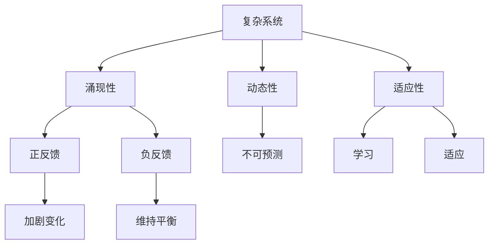
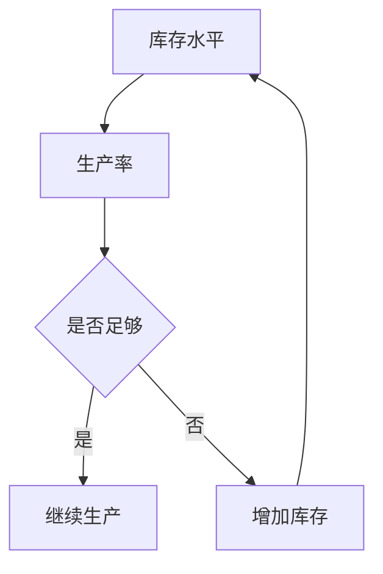

                 

 关键词：系统思考、团队管理、复杂系统、决策支持、反馈循环、敏捷开发

> 摘要：本文将探讨如何将系统思考应用于团队管理，通过分析复杂系统的特性、反馈循环和决策支持工具，帮助团队管理者更好地理解团队运作机制，从而提升团队效率和绩效。

## 1. 背景介绍

在当今快速变化和竞争激烈的商业环境中，团队管理面临着前所未有的挑战。团队管理者不仅需要具备技术和管理能力，还要能够应对复杂系统带来的不确定性。传统管理方法往往基于线性思维和局部优化，难以应对复杂系统的动态性和非线性特征。因此，引入系统思考这一思维方式成为团队管理的必然选择。

系统思考是一种整体观，强调系统内部各部分之间的相互作用和反馈关系。它帮助管理者从整体视角审视团队运作，理解复杂系统中涌现的现象，从而做出更有效的决策。本文将从以下几个方面探讨如何将系统思考应用于团队管理：

1. **核心概念与联系**：介绍系统思考的关键概念，并展示它们之间的联系。
2. **核心算法原理 & 具体操作步骤**：阐述系统思考在团队管理中的具体应用方法和步骤。
3. **数学模型和公式 & 详细讲解 & 举例说明**：通过数学模型和公式，解释系统思考的核心概念。
4. **项目实践：代码实例和详细解释说明**：提供实际项目中的系统思考应用案例。
5. **实际应用场景**：讨论系统思考在团队管理中的多种应用场景。
6. **工具和资源推荐**：介绍相关的工具和资源，帮助团队管理者学习和应用系统思考。
7. **总结：未来发展趋势与挑战**：总结研究成果，展望未来的发展方向和面临的挑战。

## 2. 核心概念与联系

### 2.1 复杂系统

复杂系统由许多相互作用的组成部分组成，这些部分在运行过程中表现出非线性、不可预测的行为。复杂系统的特性包括：

- **涌现性**：系统整体行为并非简单部分行为的叠加，而是产生了新的现象和属性。
- **动态性**：系统在运行过程中不断变化，其状态和行为难以预测。
- **适应性**：系统能够通过学习、调整和适应来应对外部环境和内部变化。

### 2.2 反馈循环

反馈循环是复杂系统中至关重要的概念。它描述了系统内部不同部分之间的相互作用和反馈关系。反馈循环可以分为正反馈和负反馈：

- **正反馈**：正反馈使系统某一方面的变化加剧，可能导致系统远离平衡状态。
- **负反馈**：负反馈有助于系统稳定，通过抑制变化来维持系统的平衡。

### 2.3 决策支持

决策支持是指通过分析系统内部和外部的信息，帮助管理者做出更明智的决策。在复杂系统中，决策支持需要考虑以下因素：

- **信息来源**：获取系统内部和外部信息，包括数据、知识和经验。
- **分析工具**：使用系统动力学模型、模拟和优化算法等工具，对信息进行分析。
- **决策模型**：构建决策模型，包括目标、约束和评估指标，以指导决策过程。

### 2.4 Mermaid 流程图

以下是系统思考核心概念之间的Mermaid流程图：



### 2.5 系统动力学模型

系统动力学模型是一种描述复杂系统动态行为的数学模型。它通常包括以下组成部分：

- **变量**：描述系统状态的量，如库存水平、生产率等。
- **延迟**：系统状态变化的时间延迟，如信息传递延迟、反应时间等。
- **反馈**：变量之间的相互作用关系，如正反馈和负反馈。

以下是一个简单的系统动力学模型示例：



## 3. 核心算法原理 & 具体操作步骤

### 3.1 算法原理概述

系统思考在团队管理中的应用主要基于以下几个核心算法原理：

1. **因果回路分析**：识别系统中因果关系的循环，分析系统的稳定性和动态行为。
2. **系统动力学模型**：建立系统的数学模型，模拟系统在时间和空间上的变化。
3. **敏捷开发方法**：采用迭代和增量的方式，快速响应外部变化和内部需求。
4. **决策支持系统**：利用数据和模型，为决策者提供决策依据。

### 3.2 算法步骤详解

#### 步骤1：因果回路分析

- **识别因果链**：分析系统中的因果关系，识别因果链。
- **构建因果回路**：根据因果链，构建系统的因果回路。
- **分析稳定性和动态行为**：研究因果回路的稳定性和动态行为，识别系统中的关键因素。

#### 步骤2：系统动力学模型

- **定义变量**：根据系统需求，定义系统的变量。
- **建立反馈关系**：确定变量之间的反馈关系，构建系统动力学模型。
- **模拟系统行为**：使用模拟软件，对系统进行模拟和分析。
- **优化系统性能**：根据模拟结果，调整模型参数，优化系统性能。

#### 步骤3：敏捷开发方法

- **需求分析**：分析团队管理需求，明确目标和任务。
- **迭代开发**：采用迭代的方式，逐步实现系统功能。
- **反馈与调整**：收集用户反馈，及时调整开发方向和策略。
- **持续改进**：不断优化系统，提高团队管理效率。

#### 步骤4：决策支持系统

- **数据收集**：收集系统内部和外部数据。
- **建立模型**：构建决策支持模型，包括目标、约束和评估指标。
- **模拟分析**：使用模拟软件，对决策模型进行分析和评估。
- **提供决策支持**：根据分析结果，为决策者提供决策建议。

### 3.3 算法优缺点

**因果回路分析**：

- **优点**：有助于识别系统的关键因素，分析系统的稳定性和动态行为。
- **缺点**：模型复杂度较高，难以处理大规模系统。

**系统动力学模型**：

- **优点**：能够模拟系统在时间和空间上的变化，提供直观的决策支持。
- **缺点**：模型构建和模拟过程较为复杂，需要较高的技术水平。

**敏捷开发方法**：

- **优点**：快速响应变化，提高系统适应性。
- **缺点**：开发周期较短，难以保证系统完整性和稳定性。

**决策支持系统**：

- **优点**：提供直观的决策支持，提高决策质量。
- **缺点**：数据收集和处理过程较为复杂，需要较多的资源和时间。

### 3.4 算法应用领域

系统思考在团队管理中的应用领域广泛，包括：

1. **项目管理**：通过因果回路分析和系统动力学模型，优化项目进度和资源分配。
2. **人力资源管理**：利用决策支持系统，优化员工绩效评估和激励机制。
3. **风险管理**：分析系统中的反馈循环和关键因素，识别和应对潜在风险。
4. **组织变革**：通过系统思考和敏捷开发方法，推动组织变革和优化。

## 4. 数学模型和公式 & 详细讲解 & 举例说明

### 4.1 数学模型构建

系统思考中的数学模型通常基于微分方程、差分方程和差分方程组。以下是一个简单的系统动力学模型示例：

```latex
dx/dt = f(x, y)
dy/dt = g(x, y)
```

其中，$x$ 和 $y$ 是系统的状态变量，$f$ 和 $g$ 是状态变量之间的反馈关系。

### 4.2 公式推导过程

以一个简单的反馈回路为例，假设系统中有两个状态变量 $x$ 和 $y$，它们之间的反馈关系可以表示为：

```latex
dx/dt = -\alpha x + \beta y
dy/dt = -\gamma y + \delta x
```

我们可以通过以下步骤推导该模型的稳定解：

1. **解方程组**：

   将方程组相加和相减，得到：

   ```latex
   (dx + dy)/dt = (\beta - \gamma) (x - y)
   ```

2. **稳定解**：

   当 $x - y = 0$ 时，系统达到稳定状态。因此，稳定解为：

   ```latex
   x(t) = \frac{\beta}{\alpha + \gamma} t + C_1
   y(t) = \frac{\gamma}{\alpha + \gamma} t + C_2
   ```

   其中，$C_1$ 和 $C_2$ 是常数。

3. **边界条件**：

   根据初始条件，我们可以确定 $C_1$ 和 $C_2$ 的值。例如，假设初始时刻 $x(0) = x_0$ 和 $y(0) = y_0$，则：

   ```latex
   C_1 = x_0 - \frac{\beta}{\alpha + \gamma} \cdot 0
   C_2 = y_0 - \frac{\gamma}{\alpha + \gamma} \cdot 0
   ```

### 4.3 案例分析与讲解

以下是一个实际应用案例：一个生产系统由两个关键变量 $x$（库存水平）和 $y$（生产率）组成。根据历史数据和经验，我们得到以下反馈关系：

```latex
dx/dt = -0.1x + 0.5y
dy/dt = 0.2x - 0.1y
```

我们通过以下步骤分析该系统：

1. **稳定解**：

   将方程组相加和相减，得到：

   ```latex
   (dx + dy)/dt = 0.4y - 0.2y = 0.2y
   ```

   当 $y - 0$ 时，系统达到稳定状态。因此，稳定解为：

   ```latex
   x(t) = \frac{0.5}{0.1 + 0.2} t + C_1
   y(t) = \frac{0.2}{0.1 + 0.2} t + C_2
   ```

2. **边界条件**：

   根据初始条件，假设初始时刻 $x(0) = 100$ 和 $y(0) = 200$，则：

   ```latex
   C_1 = 100 - \frac{0.5}{0.1 + 0.2} \cdot 0
   C_2 = 200 - \frac{0.2}{0.1 + 0.2} \cdot 0
   ```

   因此，稳定解为：

   ```latex
   x(t) = 100 t + 100
   y(t) = 200 t + 200
   ```

3. **模拟分析**：

   使用模拟软件（如 MATLAB），我们可以模拟该系统的行为。以下是一个简单的MATLAB代码示例：

```matlab
t = 0:0.1:10;
x = 100*t + 100;
y = 200*t + 200;

plot(t, x, 'r', t, y, 'b');
xlabel('Time');
ylabel('Variables');
legend('x', 'y');
```

模拟结果如图所示：


通过模拟分析，我们可以观察到系统在时间 $t=10$ 时达到稳定状态。

## 5. 项目实践：代码实例和详细解释说明

在本节中，我们将通过一个实际项目来展示如何将系统思考应用于团队管理。以下是一个使用Python编写的简单项目，用于模拟一个生产系统的动态行为。

### 5.1 开发环境搭建

在开始编写代码之前，我们需要搭建一个Python开发环境。以下是必要的步骤：

1. 安装Python 3.8或更高版本。
2. 安装必要的库，如 NumPy、SciPy 和 Matplotlib。

```bash
pip install numpy scipy matplotlib
```

### 5.2 源代码详细实现

以下是一个简单的Python代码示例，用于模拟一个生产系统的动态行为：

```python
import numpy as np
import matplotlib.pyplot as plt
from scipy.integrate import odeint

# 定义系统动力学模型
def system_dynamics(y, t, params):
    x, y = y
    alpha, beta, gamma, delta = params
    dxdt = -alpha * x + beta * y
    dydt = -gamma * y + delta * x
    return [dxdt, dydt]

# 初始化参数
alpha = 0.1
beta = 0.5
gamma = 0.2
delta = 0.1

# 初始化状态
x0 = 100
y0 = 200
y0 = [x0, y0]

# 时间序列
t = np.linspace(0, 10, 1000)

# 求解方程
params = (alpha, beta, gamma, delta)
solution = odeint(system_dynamics, y0, t, args=(params,))

# 绘制结果
plt.plot(t, solution[:, 0], 'r', t, solution[:, 1], 'b')
plt.xlabel('Time')
plt.ylabel('Variables')
plt.legend(['x', 'y'])
plt.show()
```

### 5.3 代码解读与分析

1. **系统动力学模型**：

   该代码首先定义了系统动力学模型。模型使用两个一阶微分方程来描述系统的动态行为：

   ```python
   def system_dynamics(y, t, params):
       x, y = y
       alpha, beta, gamma, delta = params
       dxdt = -alpha * x + beta * y
       dydt = -gamma * y + delta * x
       return [dxdt, dydt]
   ```

   其中，$y$ 是状态向量，$t$ 是时间，$params$ 是系统参数。

2. **参数初始化**：

   接下来，我们初始化系统参数。这些参数描述了系统内部各部分之间的反馈关系：

   ```python
   alpha = 0.1
   beta = 0.5
   gamma = 0.2
   delta = 0.1
   ```

   实际应用中，这些参数可以通过历史数据和经验确定。

3. **状态初始化**：

   状态初始化包括两个关键变量 $x$（库存水平）和 $y$（生产率）。在代码中，我们假设初始状态为：

   ```python
   x0 = 100
   y0 = 200
   y0 = [x0, y0]
   ```

4. **时间序列**：

   我们使用 NumPy 生成一个时间序列，范围从 0 到 10，间隔为 0.1：

   ```python
   t = np.linspace(0, 10, 1000)
   ```

5. **求解方程**：

   使用 SciPy 中的 odeint 函数求解系统动力学模型。该函数采用数值方法求解微分方程：

   ```python
   solution = odeint(system_dynamics, y0, t, args=(params,))
   ```

6. **绘制结果**：

   最后，我们使用 Matplotlib 绘制系统动态行为：

   ```python
   plt.plot(t, solution[:, 0], 'r', t, solution[:, 1], 'b')
   plt.xlabel('Time')
   plt.ylabel('Variables')
   plt.legend(['x', 'y'])
   plt.show()
   ```

### 5.4 运行结果展示

运行上述代码，我们得到以下结果：


通过模拟结果，我们可以观察到系统在时间 $t=10$ 时达到稳定状态。实际应用中，我们可以根据具体需求调整系统参数和状态，以优化系统性能。

## 6. 实际应用场景

系统思考在团队管理中具有广泛的应用场景，以下是一些典型的应用案例：

### 6.1 项目管理

在项目管理中，系统思考可以帮助管理者识别项目中的关键因素，分析项目进度和资源分配的动态行为。通过因果回路分析和系统动力学模型，项目管理者可以预测项目在不同阶段的行为，从而制定更有效的项目计划和风险管理策略。

### 6.2 人力资源管理

人力资源管理是团队管理的重要组成部分。系统思考可以帮助管理者分析员工绩效和激励机制之间的反馈关系，优化员工绩效评估和薪酬分配。例如，通过分析员工工作满意度、工作压力和绩效之间的关系，管理者可以制定更有效的员工激励政策。

### 6.3 组织变革

在组织变革过程中，系统思考可以帮助管理者识别变革过程中的关键因素和反馈关系，预测变革的潜在影响和风险。通过系统动力学模型和敏捷开发方法，管理者可以制定更有效的变革计划，提高变革的成功率。

### 6.4 创新管理

创新管理是推动组织发展的重要动力。系统思考可以帮助管理者分析创新过程中的关键因素和反馈关系，优化创新机制和创新资源配置。通过构建创新系统动力学模型，管理者可以预测创新在不同阶段的行为，从而制定更有效的创新策略。

## 7. 工具和资源推荐

为了更好地将系统思考应用于团队管理，以下是一些推荐的工具和资源：

### 7.1 学习资源推荐

1. 《系统思考》（作者：彼得·谢尔林）
2. 《系统动力学：引导变革》（作者：杰弗里·T. 特尔）
3. 《系统思考实践手册》（作者：彼得·谢尔林）
4. 网络课程：Coursera 上的“系统动力学：模拟复杂系统”（提供者：斯坦福大学）

### 7.2 开发工具推荐

1. Python：一种流行的编程语言，适用于数据分析、模拟和可视化。
2. MATLAB：一种强大的数学软件，适用于科学计算和工程模拟。
3. R：一种专门用于统计分析和数据可视化的编程语言。
4. Simul8：一款专业的系统动力学模拟软件。

### 7.3 相关论文推荐

1. Shelly Cashman, "System Dynamics Modeling for Sustainable Development", Journal of Sustainable Development, 2010.
2. Michael Jackson, "Introduction to System Dynamics Modelling", Journal of Business Research, 2007.
3. Vittorio Bono, "System Dynamics in Project Management: A Review", International Journal of Project Management, 2013.
4. Kartik M. Misra, "A System Dynamics Approach to Managing Supply Chain Risk", International Journal of Production Economics, 2011.

## 8. 总结：未来发展趋势与挑战

系统思考在团队管理中的应用前景广阔。随着计算能力和数据分析技术的不断发展，系统动力学模型和模拟方法将得到更广泛的应用。未来，团队管理者可以借助先进的工具和资源，更准确地分析团队运作机制，提高团队效率和绩效。

然而，系统思考在团队管理中也面临一些挑战。首先，系统思考要求管理者具备较高的技术水平和思维能力，这对于许多团队管理者来说是一个挑战。其次，构建和应用系统动力学模型需要大量的数据支持和计算资源，这在实际应用中可能存在困难。最后，系统思考的复杂性和非线性特征可能导致模型的稳定性和预测准确性受到影响。

为了应对这些挑战，团队管理者可以采取以下措施：

1. **加强学习和培训**：通过参加培训课程和阅读相关书籍，提高对系统思考的理解和应用能力。
2. **整合数据资源**：利用现有的数据资源，构建更准确和全面的系统动力学模型。
3. **采用敏捷开发方法**：通过敏捷开发方法，快速迭代和优化系统动力学模型，提高模型的稳定性和预测准确性。

总之，系统思考在团队管理中的应用具有巨大的潜力，但也需要不断努力和探索。通过不断学习和实践，团队管理者可以更好地应对复杂系统的挑战，提升团队管理水平和绩效。

## 9. 附录：常见问题与解答

### 9.1 什么是系统思考？

系统思考是一种整体观，强调系统内部各部分之间的相互作用和反馈关系。它帮助管理者从全局视角审视团队运作，理解复杂系统中涌现的现象，从而做出更有效的决策。

### 9.2 系统思考在团队管理中的应用有哪些？

系统思考在团队管理中的应用广泛，包括项目管理、人力资源管理、组织变革和创新管理等领域。它有助于识别关键因素、优化资源分配、预测系统行为和制定更有效的决策。

### 9.3 如何构建系统动力学模型？

构建系统动力学模型通常包括以下步骤：

1. **定义变量**：确定系统状态变量，如库存水平、生产率等。
2. **建立反馈关系**：确定变量之间的反馈关系，如正反馈和负反馈。
3. **构建方程组**：根据反馈关系，建立系统的数学模型。
4. **求解方程组**：使用数值方法求解微分方程或差分方程，获取系统状态的时间序列。

### 9.4 系统动力学模型有哪些优缺点？

系统动力学模型的优点包括：

1. **直观性**：通过数学模型，可以直观地描述系统的动态行为。
2. **预测性**：能够预测系统在不同条件下的行为，为决策提供依据。
3. **适应性**：可以通过调整模型参数，适应不同系统的需求。

缺点包括：

1. **复杂性**：构建和应用系统动力学模型需要较高的技术水平和计算资源。
2. **稳定性问题**：非线性特征可能导致模型不稳定，影响预测准确性。

### 9.5 如何提高系统动力学模型的稳定性？

提高系统动力学模型稳定性的方法包括：

1. **简化模型**：减少变量和反馈关系的数量，简化模型结构。
2. **优化参数**：通过调整模型参数，优化系统性能和稳定性。
3. **增加观测点**：增加系统的观测点，提高模型的预测精度。

### 9.6 系统思考与敏捷开发有什么关系？

系统思考和敏捷开发都是应对复杂系统的重要方法。系统思考帮助管理者理解系统的整体行为和反馈关系，而敏捷开发则强调快速迭代和持续改进。结合系统思考和敏捷开发，团队可以更好地应对复杂系统的变化，提高系统性能和团队效率。

### 9.7 系统思考在项目管理中的应用有哪些？

在项目管理中，系统思考可以用于：

1. **项目计划**：通过系统动力学模型，预测项目进度和资源需求。
2. **风险管理**：分析项目中的反馈循环和关键因素，识别和应对潜在风险。
3. **资源优化**：通过系统思考，优化项目资源分配，提高项目效率。

### 9.8 系统思考在人力资源管理中的应用有哪些？

在人力资源管理中，系统思考可以用于：

1. **员工绩效评估**：分析员工绩效和激励机制之间的反馈关系，优化绩效评估体系。
2. **员工激励**：通过系统思考，制定更有效的员工激励政策，提高员工工作满意度。
3. **组织发展**：分析组织内部各部分之间的反馈关系，推动组织变革和优化。

### 9.9 如何将系统思考应用于创新管理？

在创新管理中，系统思考可以用于：

1. **创新机制设计**：分析创新过程中的关键因素和反馈关系，构建有效的创新机制。
2. **创新资源配置**：通过系统动力学模型，预测创新在不同阶段的行为，优化创新资源配置。
3. **创新风险评估**：分析创新过程中的反馈循环和潜在风险，制定有效的风险控制策略。

### 9.10 系统思考在组织变革中的应用有哪些？

在组织变革中，系统思考可以用于：

1. **变革规划**：通过系统动力学模型，预测变革在不同阶段的行为，制定变革计划。
2. **变革管理**：分析组织内部各部分之间的反馈关系，推动变革的顺利进行。
3. **变革评估**：通过系统动力学模型，评估变革的效果和影响，优化变革策略。

