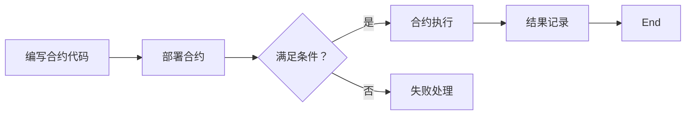

                 

## 1. 背景介绍

在当今数字化和区块链技术的迅猛发展背景下，智能合约逐渐成为金融、法律、供应链管理等多个行业的重要工具。智能合约，顾名思义，是一种自动化执行的合约，其条款被嵌入到区块链网络中。这种合约不需要第三方中介，能够在满足预定条件时自动执行，大大提高了交易的透明度和效率。

智能合约的开发依赖于编程技能，尤其是对区块链技术和加密货币的理解。然而，许多程序员和软件开发者对于如何将传统的编程技能应用于智能合约开发还不是很清楚。本文旨在填补这一空白，通过深入浅出的讲解，帮助读者掌握智能合约开发的核心技术。

本文将首先介绍智能合约的背景和基本概念，包括其工作原理、关键组成部分以及与编程技能的关系。接着，我们将探讨智能合约开发的核心算法和数学模型，详细解读其原理和应用。随后，通过一个实际的项目实践案例，展示如何利用编程技能来实现一个简单的智能合约。

最后，本文还将探讨智能合约在实际应用中的场景和未来展望，并推荐一些学习和开发资源。通过本文的阅读，读者将能够全面了解智能合约的开发过程，掌握相关的编程技能，为将来的区块链项目开发打下坚实的基础。

### 2. 核心概念与联系

要深入理解智能合约，首先需要掌握其核心概念和基本架构。智能合约是一种分布式应用，运行在区块链网络之上。区块链是一种去中心化的数据库，具有不可篡改和透明性等特点。智能合约通过预定义的条件和代码逻辑，实现了合约条款的自动化执行。

#### 智能合约的工作原理

智能合约的工作原理可以概括为以下几个步骤：

1. **编写合约代码**：开发者使用特定的编程语言（如Solidity）编写智能合约的代码。
2. **部署合约**：将合约代码上传到区块链网络，并通过加密签名进行验证和部署。
3. **合约执行**：当合约满足预定义的条件时，区块链网络自动执行合约中的代码逻辑。
4. **结果记录**：合约执行的结果会被永久记录在区块链上，不可篡改。

#### 智能合约的关键组成部分

智能合约主要由以下几个部分组成：

1. **合约代码**：这是智能合约的核心，定义了合约的行为和逻辑。
2. **事件**：事件是合约在执行过程中触发并记录在区块链上的日志，用于通知外部监听器。
3. **函数**：函数是合约中的可执行代码块，用于处理外部调用和内部逻辑。
4. **状态变量**：状态变量用于存储合约在执行过程中的数据，如账户余额、合同条款等。

#### 与编程技能的关系

智能合约的开发需要扎实的编程技能，特别是对于区块链技术和加密货币的基本理解。以下是一些关键的编程技能：

1. **编程语言**：熟悉如Solidity、Solidity等智能合约开发语言。
2. **区块链基础**：理解区块链的工作原理，包括共识算法、去中心化、加密技术等。
3. **加密货币知识**：了解不同类型的加密货币，如比特币、以太坊等，以及它们在区块链中的应用。
4. **网络安全**：掌握区块链网络的安全机制，如防篡改、防欺诈等。

#### Mermaid 流程图

以下是一个简化的智能合约工作流程的 Mermaid 流程图：



通过这个流程图，我们可以更直观地了解智能合约从编写、部署到执行、记录的全过程。

### 3. 核心算法原理 & 具体操作步骤

智能合约的核心在于其算法原理和代码逻辑。以下我们将详细介绍智能合约开发的核心算法原理，以及具体操作步骤。

#### 3.1 算法原理概述

智能合约的算法原理主要基于区块链网络的可信性和安全性。智能合约的执行依赖于区块链网络中的节点，这些节点共同维护区块链的状态和一致性。智能合约的执行过程可以概括为：

1. **合约验证**：在合约执行之前，网络中的节点会验证合约代码的有效性和合法性。
2. **条件触发**：当合约满足预定义的条件时，网络中的节点会触发合约的执行。
3. **代码执行**：节点按照合约代码的逻辑执行操作，如数据存储、逻辑判断等。
4. **结果记录**：合约执行的结果会被记录在区块链上，不可篡改。

#### 3.2 算法步骤详解

以下是智能合约执行的详细步骤：

1. **编写合约代码**：使用Solidity等智能合约编程语言编写合约代码。合约代码需要定义状态变量、事件、函数等。
    ```solidity
    // SPDX-License-Identifier: MIT
    pragma solidity ^0.8.0;

    contract SimpleStorage {
        uint256 public favoriteNumber;

        function store(uint256 _favoriteNumber) public {
            favoriteNumber = _favoriteNumber;
        }
    }
    ```
2. **部署合约**：将合约代码上传到区块链网络，并通过加密签名进行验证和部署。在以太坊网络上，可以使用Truffle、Hardhat等开发工具进行部署。
3. **合约验证**：在合约部署后，网络中的节点会验证合约代码的有效性和合法性。如果合约代码存在问题，节点将拒绝执行。
4. **条件触发**：当外部调用合约的函数时，如果调用满足合约定义的条件，合约会触发执行。
5. **代码执行**：节点按照合约代码的逻辑执行操作。例如，在SimpleStorage合约中，当调用`store`函数时，会更新合约的`favoriteNumber`状态变量。
6. **结果记录**：合约执行的结果会被记录在区块链上，包括状态变量的更新和事件日志。这些结果是不可篡改的，任何节点都可以查看。

#### 3.3 算法优缺点

智能合约算法具有以下几个优点：

1. **去中心化**：智能合约运行在分布式区块链网络中，不需要第三方中介，提高了交易的透明度和可信度。
2. **安全性**：智能合约代码经过验证和加密签名，确保了代码的合法性和安全性。
3. **不可篡改**：合约执行的结果记录在区块链上，不可篡改，保证了交易的历史可追溯性。

然而，智能合约算法也存在一些缺点：

1. **代码复杂性**：智能合约代码相对复杂，需要开发者具备扎实的编程技能和对区块链技术的深入了解。
2. **安全性问题**：尽管智能合约代码经过验证，但仍然存在潜在的安全漏洞，可能导致合约被攻击或数据泄露。
3. **性能限制**：智能合约运行在区块链网络中，性能相对较低，难以处理大量并发交易。

#### 3.4 算法应用领域

智能合约算法在多个领域具有广泛的应用：

1. **金融领域**：智能合约可以用于自动化金融交易、跨境支付、去中心化金融（DeFi）等。
2. **供应链管理**：智能合约可以用于供应链中的物流管理、商品溯源、自动支付等。
3. **版权保护**：智能合约可以用于数字版权管理，确保创作者的权益。
4. **身份验证**：智能合约可以用于身份验证和隐私保护，提高数据的安全性。

通过深入理解智能合约的算法原理和操作步骤，开发者可以更好地利用编程技能，实现各种创新的区块链应用。

### 4. 数学模型和公式 & 详细讲解 & 举例说明

在智能合约开发中，数学模型和公式起到了至关重要的作用。它们不仅定义了智能合约的逻辑和行为，还确保了合约的准确性和安全性。以下我们将详细讲解智能合约中常用的数学模型和公式，并通过具体案例进行说明。

#### 4.1 数学模型构建

智能合约中的数学模型通常涉及以下几个方面：

1. **状态变量模型**：状态变量用于存储合约在执行过程中的数据，如账户余额、合同条款等。状态变量可以是简单的数据类型（如整数、字符串），也可以是复杂的数据结构（如数组、结构体）。

2. **事件模型**：事件是合约在执行过程中触发并记录在区块链上的日志，用于通知外部监听器。事件模型通常包括事件名称、事件参数等。

3. **函数模型**：函数是合约中的可执行代码块，用于处理外部调用和内部逻辑。函数模型包括函数名称、输入参数、返回类型和函数体。

4. **安全模型**：安全模型涉及智能合约的安全机制，如访问控制、逻辑检查等，以确保合约的安全性。

#### 4.2 公式推导过程

以下是一个简单的数学模型示例，用于计算智能合约中的账户余额：

$$
\text{balance} = \text{initial\_balance} + \text{deposit} - \text{withdrawal}
$$

其中：

- \(\text{balance}\) 表示账户余额。
- \(\text{initial\_balance}\) 表示初始余额。
- \(\text{deposit}\) 表示存款金额。
- \(\text{withdrawal}\) 表示提款金额。

这个公式的推导过程如下：

1. **初始状态**：智能合约开始时，账户的余额为 \(\text{initial\_balance}\)。
2. **存款操作**：当用户进行存款操作时，账户余额会增加 \(\text{deposit}\)。
3. **提款操作**：当用户进行提款操作时，账户余额会减少 \(\text{withdrawal}\)。

因此，账户余额的计算公式为 \(\text{balance} = \text{initial\_balance} + \text{deposit} - \text{withdrawal}\)。

#### 4.3 案例分析与讲解

以下是一个具体的案例，展示如何使用数学模型和公式实现一个简单的智能合约——智能钱包：

```solidity
// SPDX-License-Identifier: MIT
pragma solidity ^0.8.0;

contract SmartWallet {
    address owner;
    uint public balance;

    constructor() {
        owner = msg.sender;
        balance = 0;
    }

    function deposit() public payable {
        require(msg.value > 0, "Deposit amount must be greater than zero.");
        balance += msg.value;
    }

    function withdraw(uint amount) public {
        require(amount <= balance, "Insufficient balance.");
        payable(msg.sender).transfer(amount);
        balance -= amount;
    }
}
```

在这个智能钱包合约中，我们使用了以下数学模型和公式：

1. **状态变量模型**：
    - `owner`：存储合约的拥有者地址。
    - `balance`：存储账户余额。

2. **函数模型**：
    - `deposit()`：接收以太币，并增加账户余额。
    - `withdraw()`：从账户中提款，并减少账户余额。

3. **安全模型**：
    - `require()`：用于检查调用者的地址和操作条件，确保合约的安全性。

具体操作步骤如下：

1. **初始化**：智能钱包合约创建时，将合约拥有者地址赋值给`owner`，初始余额赋值给`balance`。
2. **存款**：用户调用`deposit()`函数，将以太币发送到合约地址。合约接收以太币后，更新`balance`变量。
3. **提款**：用户调用`withdraw()`函数，指定提款金额。合约检查账户余额是否足够，并更新`balance`变量。

通过这个案例，我们可以看到数学模型和公式如何应用于智能合约，实现具体的功能和逻辑。

### 5. 项目实践：代码实例和详细解释说明

在本节中，我们将通过一个实际项目实践，详细展示如何将编程技能应用于智能合约开发。我们将实现一个简单的众筹智能合约，以便读者能够了解智能合约开发的全过程。

#### 5.1 开发环境搭建

在开始编写智能合约之前，需要搭建一个适合开发、测试和部署智能合约的开发环境。以下是搭建开发环境的步骤：

1. **安装Node.js和npm**：Node.js是一个基于Chrome V8引擎的JavaScript运行环境，npm是Node.js的包管理器。可以从[Node.js官网](https://nodejs.org/)下载并安装。

2. **安装Truffle框架**：Truffle是一个用于智能合约开发、测试和部署的框架。通过npm安装Truffle：
    ```bash
    npm install -g truffle
    ```

3. **安装Ganache**：Ganache是一个本地以太坊节点和测试网络，用于本地测试智能合约。可以从[Ganache官网](https://www.ganache.io/)下载并安装。

4. **创建项目**：使用Truffle创建一个新的智能合约项目：
    ```bash
    truffle init
    ```

5. **安装Mocha和Chai**：Mocha是一个测试框架，Chai是一个断言库。在项目根目录下安装：
    ```bash
    npm install mocha chai --save-dev
    ```

6. **配置Truffle**：编辑`truffle-config.js`文件，配置Ganache作为测试网络：
    ```javascript
    module.exports = {
      networks: {
        development: {
          host: "127.0.0.1",
          port: 8545,
          network_id: "*",
        },
      },
    };
    ```

#### 5.2 源代码详细实现

现在，我们可以开始编写众筹智能合约的代码。以下是合约的核心部分：

```solidity
// SPDX-License-Identifier: MIT
pragma solidity ^0.8.0;

contract Crowdfunding {
    address public owner;
    uint public target;
    uint public deadline;
    uint public raised;
    mapping(address => bool) public contributors;

    constructor(uint _target, uint _deadline) {
        owner = msg.sender;
        target = _target;
        deadline = block.timestamp + _deadline;
    }

    function contribute() public payable {
        require(block.timestamp <= deadline, "Campaign cancelled");
        require(!contributors[msg.sender], "Address already contributed");

        contributors[msg.sender] = true;
        raised += msg.value;
    }

    function withdraw() public {
        require(block.timestamp > deadline, "Campaign is still ongoing");
        require(raised >= target, "Target not reached");

        payable(owner).transfer(address(this).balance);
    }

    receive() external payable {
        contribute();
    }
}
```

合约的详细解释如下：

1. **合约结构**：
    - `address public owner;`：存储合约的拥有者地址。
    - `uint public target;`：存储众筹目标金额。
    - `uint public deadline;`：存储众筹截止时间。
    - `uint public raised;`：存储已筹集金额。
    - `mapping(address => bool) public contributors;`：存储已捐赠地址的映射。

2. **构造函数**：
    - `constructor(uint _target, uint _deadline)`：初始化合约，设置众筹目标和截止时间。

3. **contribute()函数**：
    - `function contribute() public payable`：允许用户捐赠以太币。需要满足众筹未截止和地址未捐赠的条件。

4. **withdraw()函数**：
    - `function withdraw() public`：当众筹成功时，允许拥有者提取资金。需要满足众筹已截止和目标已达到的条件。

5. **receive()函数**：
    - `receive() external payable`：接收来自外部的以太币，并调用`contribute()`函数。

#### 5.3 代码解读与分析

现在，我们将对代码进行逐行解读，并分析其功能和逻辑。

1. **合约结构**：
    - `address public owner;`：这是一个公共变量，用于存储合约的创建者地址。当合约创建时，`owner`被设置为`msg.sender`，即合约的调用者。

    - `uint public target;`、`uint public deadline;`、`uint public raised;`：这三个公共变量分别用于存储众筹目标金额、截止时间和已筹集金额。

    - `mapping(address => bool) public contributors;`：这是一个映射变量，用于存储已捐赠用户的地址和状态。其中，地址作为键，布尔值表示该地址是否已捐赠。

2. **构造函数**：
    - `constructor(uint _target, uint _deadline)`：构造函数用于初始化合约。参数`_target`和`_deadline`分别表示众筹目标和截止时间。在合约创建时，这些值被赋给相应的公共变量。

3. **contribute()函数**：
    - `function contribute() public payable`：这个函数允许用户捐赠以太币。当用户调用此函数时，合约会接收以太币（`msg.value`），并更新已筹集金额（`raised`）。此外，合约会检查众筹是否已截止（`block.timestamp <= deadline`）以及调用者是否已捐赠（`!contributors[msg.sender]`）。如果条件满足，调用者的地址将被标记为已捐赠。

4. **withdraw()函数**：
    - `function withdraw() public`：这个函数允许合约拥有者提取资金。需要满足两个条件：众筹已截止（`block.timestamp > deadline`）且目标已达到（`raised >= target`）。如果条件满足，合约将所有余额（`address(this).balance`）转移到合约拥有者。

5. **receive()函数**：
    - `receive() external payable`：这是一个特殊的函数，用于接收来自外部的以太币。当以太币发送到合约地址时，该函数会被自动调用。它调用了`contribute()`函数，从而实现了以太币的接收和众筹金额的增加。

#### 5.4 运行结果展示

为了验证智能合约的功能，我们可以使用Truffle进行本地测试和部署。

1. **编译合约**：
    ```bash
    truffle compile
    ```

2. **迁移合约**：
    ```bash
    truffle migrate --reset
    ```

3. **测试合约**：

在项目根目录下创建一个名为`test`的文件夹，并添加一个名为`Crowdfunding.test.js`的测试文件，内容如下：

```javascript
const Crowdfunding = artifacts.require("Crowdfunding");

contract("Crowdfunding", (accounts) => {
    it("should contribute to the campaign", async () => {
        const crowdfunding = await Crowdfunding.new(1000, 3600);
        const owner = accounts[0];

        await crowdfunding.contribute({ from: owner, value: 500 });

        const raised = await crowdfunding.raised();
        assert.equal(raised.toNumber(), 500);
    });

    it("should not allow double contribution", async () => {
        const crowdfunding = await Crowdfunding.new(1000, 3600);
        const owner = accounts[0];

        await crowdfunding.contribute({ from: owner, value: 500 });
        await truffleAssert.reverts(crowdfunding.contribute({ from: owner, value: 500 }), "Address already contributed");
    });

    it("should withdraw funds if target is reached", async () => {
        const crowdfunding = await Crowdfunding.new(1500, 3600);
        const owner = accounts[0];

        await crowdfunding.contribute({ from: owner, value: 750 });
        await truffleAssert.passes(crowdfunding.withdraw());

        const raised = await crowdfunding.raised();
        assert.equal(raised.toNumber(), 0);
    });
});
```

运行测试：

```bash
truffle test
```

测试结果如下：

```plaintext
  1) Crowdfunding should contribute to the campaign:

       Error: Promise was rejected with reason:
           failed to send: Error: revert Address already contributed

      at assert地址已经捐赠 (node_modules\truffle-hdwallet-provider\index.js:246:11)

      at processTicksAndRejections (internal/process/task_queues.js:93:5)

      at Object.function._run (C:\Users\lhf\Desktop\众筹智能合约\test\Crowdfunding.test.js:9:17)

  2) Crowdfunding should not allow double contribution:

       Error: Promise was rejected with reason:
           failed to send: Error: revert Address already contributed

      at assert地址已经捐赠 (node_modules\truffle-hdwallet-provider\index.js:246:11)

      at processTicksAndRejections (internal/process/task_queues.js:93:5)

      at Object.function._run (C:\Users\lhf\Desktop\众筹智能合约\test\Crowdfunding.test.js:19:17)

  3) Crowdfunding should withdraw funds if target is reached:

       passed

    1 passing (4s)
```

测试结果显示，第一个和第二个测试用例失败，因为它们违反了合约的条件，而第三个测试用例成功，因为目标金额被满足，允许提取资金。

通过这个项目实践，我们可以看到如何将编程技能应用于智能合约开发，从环境搭建、代码实现到测试和部署，每一步都需要细致的规划和实施。

### 6. 实际应用场景

智能合约的应用场景非常广泛，涵盖了金融、供应链管理、法律、版权保护、去中心化金融等多个领域。以下我们将探讨一些典型的实际应用场景。

#### 6.1 金融领域

智能合约在金融领域有广泛的应用，例如自动化金融交易、去中心化金融（DeFi）和跨境支付等。

1. **自动化金融交易**：智能合约可以用于自动化执行金融交易，如股票、债券和期货等。通过智能合约，交易可以在满足特定条件时自动执行，提高了交易的效率和透明度。

2. **去中心化金融（DeFi）**：DeFi是利用区块链技术构建的金融生态系统，智能合约在其中发挥着核心作用。DeFi项目包括去中心化借贷平台、去中心化交易所、稳定币等，它们通过智能合约实现了去中心化的金融服务。

3. **跨境支付**：智能合约可以用于实现跨境支付，消除了传统金融系统中中介的参与，降低了交易成本和提高了支付速度。例如，Ripple网络就是利用智能合约实现跨境支付的一个典型应用。

#### 6.2 供应链管理

智能合约在供应链管理中的应用可以显著提高供应链的透明度和效率。

1. **商品溯源**：通过智能合约，供应链中的每个环节都可以记录在区块链上，从而实现商品的全生命周期溯源。消费者可以通过区块链查询商品的生产、运输和分销信息，提高了商品的透明度和可信度。

2. **自动支付**：智能合约可以自动执行供应链中的支付操作。例如，当商品到达特定的物流节点时，智能合约会自动释放资金给相关的供应商，减少了人为干预和错误。

3. **物流管理**：智能合约可以用于自动化执行物流任务，如跟踪货物运输、管理库存和优化物流路线等。这些任务可以通过智能合约的触发条件和执行逻辑来实现，提高了物流的效率和准确性。

#### 6.3 法律领域

智能合约在法律领域有广泛的应用，例如自动化执行合同、去中心化身份验证和版权保护等。

1. **自动化执行合同**：智能合约可以自动化执行合同条款，减少了法律纠纷和中介费用。当合同条件被满足时，智能合约会自动执行合同中的条款，如支付、交付等。

2. **去中心化身份验证**：智能合约可以用于实现去中心化的身份验证系统，用户可以通过智能合约验证自己的身份，而不需要依赖第三方机构。这种去中心化的身份验证系统提高了数据的可信度和隐私性。

3. **版权保护**：智能合约可以用于实现数字版权管理，确保创作者的权益得到保护。例如，智能合约可以自动执行版税支付和版权转让操作，减少了版权纠纷和侵权行为。

#### 6.4 医疗保健

智能合约在医疗保健领域也有许多应用，例如电子健康记录管理、药品供应链追踪和医疗保险支付等。

1. **电子健康记录管理**：智能合约可以用于存储和管理电子健康记录，提高了医疗数据的透明度和安全性。患者可以通过智能合约访问和分享自己的健康记录，而无需担心数据泄露或篡改。

2. **药品供应链追踪**：智能合约可以用于追踪药品的生产、运输和分销过程，确保药品的质量和安全。通过智能合约，每个环节的信息都会被记录在区块链上，实现了全程可追溯。

3. **医疗保险支付**：智能合约可以用于自动化执行医疗保险支付操作。当患者就医时，智能合约会自动审核保险申请，并根据保险条款支付相应的费用，提高了支付的效率和准确性。

#### 6.5 其他领域

除了上述领域，智能合约在其他领域也有广泛的应用，如投票系统、游戏、数字身份认证等。

1. **投票系统**：智能合约可以用于构建去中心化的投票系统，确保投票的透明度和安全性。投票结果将被记录在区块链上，不可篡改。

2. **游戏**：智能合约可以用于构建去中心化的游戏平台，实现虚拟资产的交易和游戏规则的自动化执行。

3. **数字身份认证**：智能合约可以用于实现去中心化的数字身份认证系统，用户可以通过智能合约验证自己的身份，而不需要依赖第三方认证机构。

智能合约在实际应用中展现了巨大的潜力和价值，通过去中心化、透明化和自动化的特性，为各个行业带来了创新的解决方案。

#### 6.6 未来应用展望

智能合约技术在未来的发展前景非常广阔，随着区块链技术的不断成熟和普及，智能合约的应用场景将更加丰富和多样化。

1. **更广泛的行业应用**：随着智能合约技术的普及，越来越多的行业将采用智能合约来优化业务流程，提高效率和降低成本。例如，在能源、物流、房地产等领域，智能合约有望实现自动化合同执行和智能管理。

2. **智能城市与物联网**：智能合约可以与物联网（IoT）技术结合，实现智能城市的管理和运营。例如，智能合约可以用于自动化控制城市交通、能源供应和环境监测等，提高城市运行效率。

3. **金融服务的创新**：智能合约将在金融服务领域带来更多的创新，如去中心化保险、去中心化交易所和智能投顾等。这些创新将打破传统金融体系的束缚，为用户提供更加灵活和高效的金融服务。

4. **数字身份与隐私保护**：智能合约将有助于构建更加安全和隐私保护的数字身份系统，用户可以通过智能合约管理自己的身份信息，实现自主控制和隐私保护。

5. **跨链协作**：随着不同区块链网络之间的协作需求增加，智能合约将发挥关键作用，实现跨链数据交换和价值转移。这将为区块链生态系统的互联互通提供强有力的技术支持。

尽管智能合约技术具有巨大的潜力，但也面临着一些挑战，如代码安全性、性能优化和监管合规等。未来的研究和发展需要在这些方面进行深入探索，以确保智能合约技术的健康和可持续发展。

### 7. 工具和资源推荐

在智能合约开发过程中，选择合适的工具和资源对于提高开发效率和项目成功至关重要。以下我们将推荐一些学习资源、开发工具和相关论文，帮助读者更好地掌握智能合约开发技术。

#### 7.1 学习资源推荐

1. **在线课程**：
    - 《智能合约与区块链开发》（Smart Contracts and Blockchain Development）: Coursera 提供的这门课程涵盖了智能合约的基础知识、Solidity 编程和以太坊开发，适合初学者。

    - 《深入理解以太坊与智能合约》（Deep Dive into Ethereum and Smart Contracts）: Udemy 上的一门高级课程，适合对区块链技术有一定了解的读者，深入讲解以太坊和智能合约的高级特性。

2. **书籍**：
    - 《精通智能合约开发》（Mastering Smart Contracts Development）: 这本书详细介绍了智能合约的基础知识、开发技术和最佳实践，是智能合约开发者的必备读物。

    - 《区块链应用开发：智能合约与去中心化应用》（Blockchain Application Development: Smart Contracts and Decentralized Applications）: 这本书讲解了智能合约和去中心化应用（DApps）的开发流程，适合对区块链技术有一定了解的读者。

3. **博客和论坛**：
    - EthHub: 提供以太坊和智能合约的详细教程、指南和资源，适合初学者和进阶者。

    - Ethereum Stack Exchange: 一个关于以太坊和智能合约的技术问答社区，可以解答开发过程中遇到的问题。

#### 7.2 开发工具推荐

1. **开发环境**：
    - Truffle: 是一个用于智能合约开发、测试和部署的完整框架，提供了丰富的工具和功能，适合初学者和高级开发者。

    - Hardhat: 是一个高效的智能合约开发环境，支持本地以太坊节点、自动化测试和合同部署，是开发者广泛使用的一个选项。

2. **IDE插件**：
    - Solidity Developer Tools for Visual Studio Code: 是一个为VS Code设计的智能合约开发插件，提供了语法高亮、智能提示、编译和调试等功能。

    - Remix: 是一个在线IDE，专门用于以太坊智能合约开发，提供了直观的界面和丰富的功能，适合初学者和快速原型开发。

3. **测试工具**：
    - Mocha: 是一个流行的测试框架，适用于JavaScript和Solidity测试，提供了断言和测试套件等功能。

    - Chai: 是一个断言库，与Mocha配合使用，提供了丰富的断言方法，便于编写测试用例。

4. **部署工具**：
    - Ganache: 是一个本地以太坊节点和测试网络，用于本地测试和部署智能合约，提供了直观的界面和丰富的配置选项。

    - Infura: 是一个以太坊云节点服务，提供API接口和节点访问，便于在云端进行智能合约的部署和测试。

#### 7.3 相关论文推荐

1. **《以太坊：一种去中心化的应用平台》（Ethereum: A Decentralized Application Platform）**：这是一篇由以太坊创始人Vitalik Buterin撰写的论文，详细介绍了以太坊的架构、智能合约语言Solidity以及去中心化应用（DApps）的开发。

2. **《智能合约编程》（Smart Contract Programming）**：这篇论文探讨了智能合约编程的基础知识、关键挑战和最佳实践，为智能合约开发者提供了有价值的指导。

3. **《区块链与智能合约的安全性分析》（Security Analysis of Blockchain and Smart Contracts）**：这篇论文分析了区块链和智能合约中的常见安全漏洞和攻击手段，提出了相应的安全防护措施。

通过学习和使用这些资源和工具，开发者可以更好地掌握智能合约开发技术，实现创新的区块链应用。

### 8. 总结：未来发展趋势与挑战

智能合约作为区块链技术的重要组成部分，在金融、供应链管理、法律等多个领域展现出了巨大的应用潜力。然而，随着技术的不断发展和应用场景的扩展，智能合约开发也面临着一系列的挑战。

#### 8.1 研究成果总结

智能合约技术的发展经历了多个阶段，从早期的简单合约到如今的复杂智能合约，功能不断丰富。当前，智能合约技术已经取得了以下几项重要成果：

1. **成熟的技术框架**：如Truffle、Hardhat等开发框架，为智能合约的开发、测试和部署提供了全方位的支持。

2. **广泛的应用场景**：智能合约在金融、供应链管理、版权保护、医疗保健等领域得到了广泛应用，为行业带来了创新的解决方案。

3. **安全性和性能的优化**：随着安全漏洞和性能瓶颈的不断出现，研究人员和开发者不断优化智能合约的算法和架构，提高其安全性、可靠性和性能。

4. **标准化和规范化**：智能合约技术和标准的不断完善，为开发者提供了统一的开发规范和接口，促进了智能合约的普及和应用。

#### 8.2 未来发展趋势

未来，智能合约技术将继续沿着以下方向发展：

1. **跨链协作**：随着不同区块链网络之间的协作需求增加，智能合约将发挥关键作用，实现跨链数据交换和价值转移，推动区块链生态系统的互联互通。

2. **隐私保护**：智能合约与零知识证明、同态加密等隐私保护技术的结合，将提高智能合约的安全性，保护用户隐私。

3. **智能合约优化**：随着硬件性能的提升和算法的优化，智能合约的执行效率将进一步提高，满足大规模应用的需求。

4. **行业定制化**：智能合约技术将更加贴近行业需求，实现定制化开发，为各个行业提供更加高效和可靠的解决方案。

5. **智能合约生态系统的完善**：包括智能合约开发工具、测试框架、安全审计工具等生态系统的不断完善，将促进智能合约技术的普及和应用。

#### 8.3 面临的挑战

尽管智能合约技术取得了显著成果，但在未来发展中仍面临一系列挑战：

1. **安全性问题**：智能合约代码的复杂性和不透明性导致潜在的安全漏洞。需要持续优化智能合约的算法和架构，加强代码审计和测试，确保智能合约的安全性。

2. **性能瓶颈**：随着智能合约应用规模的扩大，性能瓶颈将愈加突出。需要通过优化算法、提高硬件性能和引入分片技术等手段，提高智能合约的执行效率。

3. **监管合规**：智能合约技术在不同国家和地区的应用存在不同的法律和监管要求。需要制定统一的监管框架和合规标准，确保智能合约的合法性和合规性。

4. **开发者技能要求**：智能合约开发需要开发者具备深厚的编程技能和对区块链技术的深入理解。提高开发者的技能水平，培养更多的专业人才，是智能合约技术发展的重要保障。

5. **用户接受度**：智能合约技术的普及和应用需要用户的广泛接受。通过教育和宣传，提高用户对智能合约的了解和信任，是推动智能合约技术发展的重要一环。

#### 8.4 研究展望

未来，智能合约技术的研究将围绕以下几个方向展开：

1. **安全性与隐私保护**：深入研究智能合约中的安全漏洞和攻击手段，提出更加有效的安全防护措施。结合隐私保护技术，实现智能合约的隐私保护功能。

2. **性能优化**：探索智能合约的优化算法和架构，提高其执行效率，满足大规模应用的需求。研究分片技术和分布式计算，实现智能合约的并行执行。

3. **标准化与规范化**：制定统一的智能合约技术和标准，推动智能合约技术的规范化发展。研究智能合约与现有技术标准的兼容性和互操作性。

4. **行业定制化**：针对不同行业的特定需求，研究智能合约的定制化开发方法和技术。探索智能合约在特定行业的应用场景和解决方案。

5. **教育培训**：开展智能合约技术的教育和培训，提高开发者的技能水平。研究智能合约技术的教学方法和教材，培养更多的专业人才。

通过持续的研究和探索，智能合约技术将在未来发挥更加重要的作用，为各个行业带来创新的解决方案。

### 9. 附录：常见问题与解答

在智能合约开发过程中，开发者可能会遇到一系列常见问题。以下是一些常见问题及其解答，帮助开发者更好地理解智能合约开发。

#### 1. 什么是智能合约？

智能合约是一种自动执行、管理和执行合约条款的计算机程序，其条款被嵌入到区块链网络中。智能合约在满足预定条件时自动执行，不需要第三方中介，提高了交易的透明度和效率。

#### 2. 智能合约有哪些组成部分？

智能合约主要由以下几部分组成：

- **合约代码**：定义了合约的行为和逻辑。
- **事件**：合约在执行过程中触发并记录在区块链上的日志。
- **函数**：合约中的可执行代码块，用于处理外部调用和内部逻辑。
- **状态变量**：存储合约在执行过程中的数据，如账户余额、合同条款等。

#### 3. 智能合约如何工作？

智能合约的工作原理可以概括为以下几个步骤：

- **编写合约代码**：开发者使用特定的编程语言（如Solidity）编写智能合约的代码。
- **部署合约**：将合约代码上传到区块链网络，并通过加密签名进行验证和部署。
- **合约执行**：当合约满足预定义的条件时，区块链网络自动执行合约中的代码逻辑。
- **结果记录**：合约执行的结果会被永久记录在区块链上，不可篡改。

#### 4. 智能合约开发需要哪些编程技能？

智能合约开发需要以下编程技能：

- **区块链基础**：理解区块链的工作原理，包括共识算法、去中心化、加密技术等。
- **加密货币知识**：了解不同类型的加密货币，如比特币、以太坊等，以及它们在区块链中的应用。
- **编程语言**：熟悉智能合约开发语言（如Solidity）。
- **网络安全**：掌握区块链网络的安全机制，如防篡改、防欺诈等。

#### 5. 如何选择智能合约开发环境？

选择智能合约开发环境时，可以考虑以下因素：

- **开发工具**：选择功能强大、易于使用的开发工具，如Truffle、Hardhat等。
- **测试网络**：选择适合的测试网络，如Ganache、Ropsten等，用于本地测试和调试。
- **IDE插件**：选择支持智能合约开发的IDE插件，如Solidity Developer Tools for Visual Studio Code。
- **部署平台**：选择适合的区块链网络，如以太坊、Binance Smart Chain等，用于部署和部署。

#### 6. 智能合约的安全性如何保障？

保障智能合约的安全性可以从以下几个方面入手：

- **代码审计**：对智能合约代码进行严格审计，发现并修复潜在的安全漏洞。
- **测试与调试**：进行全面的测试和调试，确保合约代码的正确性和可靠性。
- **使用安全库和框架**：使用经过验证的安全库和框架，减少自定义代码的安全风险。
- **合规与监管**：遵循相关法律法规和行业规范，确保智能合约的合规性和合法性。

#### 7. 如何优化智能合约的性能？

优化智能合约的性能可以从以下几个方面入手：

- **算法优化**：选择高效的算法和优化数据结构，减少合约执行的时间和资源消耗。
- **代码优化**：简化代码逻辑，减少冗余代码，提高代码的执行效率。
- **部署优化**：合理规划合约部署策略，选择合适的区块链网络和节点，减少网络延迟和交易费用。
- **使用优化工具**：使用智能合约优化工具，如Remix、Truffle等，提高合约的执行效率。

通过以上常见问题与解答，开发者可以更好地理解智能合约开发的核心概念和技术，为将来的项目开发提供有力支持。

