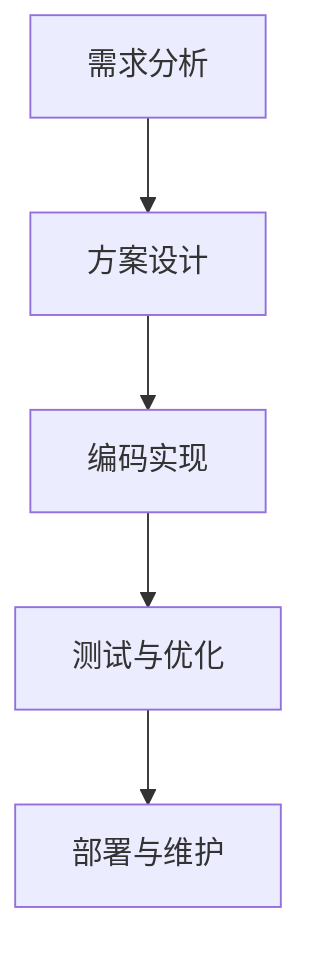

                 

关键词：编程技能，社会公益，技术影响力，人工智能，开源项目，社区参与

> 摘要：本文旨在探讨如何利用编程技能为社会公益事业做出贡献。通过对编程在社会公益领域中的应用进行分析，本文提出了几个实际案例，并提供了一些有用的工具和资源，以激励读者将自己的编程技能应用于社会公益。

## 1. 背景介绍

编程技能作为现代社会的一项核心技能，正日益影响各行各业。然而，编程技能的广泛应用不仅限于商业领域，它还可以被应用于解决社会问题，促进社会公益。随着技术的进步，程序员们不仅能够编写软件以提升企业效率，还能够开发工具和平台，为教育、医疗、环保等社会领域带来实质性的改变。

### 社会公益的定义与范围

社会公益是指为了促进公共利益，提高社会福利而进行的一系列自愿性活动。它涵盖的范围广泛，包括但不限于教育、扶贫、医疗、环保、文化传承等方面。近年来，随着技术的进步，社会公益也逐渐与技术结合，形成了一种新的公益模式，即技术公益。

### 编程技能在社会公益中的重要性

编程技能在社会公益中扮演着关键角色。首先，编程技能可以用于开发各种工具和平台，使得社会公益事业更加高效和透明。例如，数据分析和可视化工具可以帮助公益组织更好地理解受助群体的需求，从而更精准地分配资源。其次，编程技能可以用于创建在线教育和医疗平台，使得教育资源和医疗服务能够惠及更广泛的人群。此外，编程技能还可以被用于开发人工智能应用程序，为公益组织提供更智能、更高效的解决方案。

## 2. 核心概念与联系

### 编程技能与社会公益的核心概念

编程技能的核心概念包括算法、数据结构、编程语言等。这些概念不仅构成了编程的基础，也是解决复杂问题的重要工具。社会公益的核心概念则包括需要解决的问题、受助群体的需求、资源的分配等。编程技能与社会公益的联系在于，编程技能可以用于解决社会问题，满足受助群体的需求，优化资源的分配。

### 编程技能在社会公益中的架构

编程技能在社会公益中的架构可以分为以下几个层次：

1. **需求分析**：理解受助群体的需求，确定需要解决的问题。
2. **方案设计**：根据需求分析的结果，设计解决方案的框架。
3. **编码实现**：根据方案设计，使用编程语言实现解决方案。
4. **测试与优化**：测试解决方案的性能，并进行优化。
5. **部署与维护**：将解决方案部署到实际环境中，并进行持续维护。

### Mermaid 流程图

以下是一个简化的 Mermaid 流程图，展示了编程技能在社会公益中的流程：



## 3. 核心算法原理 & 具体操作步骤

### 3.1 算法原理概述

在社会公益领域，常见的算法原理包括数据挖掘、机器学习、网络分析等。这些算法原理可以帮助公益组织更好地理解受助群体的需求，优化资源的分配，提高工作效率。

### 3.2 算法步骤详解

1. **数据收集**：收集与受助群体相关的数据，包括个人信息、需求等。
2. **数据预处理**：清洗和整理收集到的数据，使其适合进行分析。
3. **特征提取**：从预处理后的数据中提取出有用的特征，用于后续的分析。
4. **算法选择**：根据问题的性质，选择合适的算法进行建模和分析。
5. **模型训练**：使用训练数据集，训练选定的算法模型。
6. **模型评估**：使用测试数据集，评估模型的性能和效果。
7. **结果应用**：将模型的预测结果应用于实际场景，如资源分配、决策支持等。

### 3.3 算法优缺点

**优点**：

- **高效性**：算法可以帮助公益组织快速、准确地分析大量数据，提高工作效率。
- **准确性**：基于数据的决策支持可以更准确地满足受助群体的需求。
- **可扩展性**：算法模型可以随着数据的增加而不断优化，适应不同的应用场景。

**缺点**：

- **数据依赖**：算法的性能很大程度上依赖于数据的质量和数量。
- **计算资源消耗**：一些复杂的算法可能需要大量的计算资源，对硬件要求较高。
- **算法偏见**：如果训练数据存在偏见，可能会导致算法产生错误的决策。

### 3.4 算法应用领域

算法在社会公益中的应用领域广泛，包括：

- **医疗公益**：使用机器学习算法分析医疗数据，提高诊断和治疗的准确性。
- **教育公益**：通过在线教育平台，提供个性化的学习方案，提高教育效果。
- **环保公益**：使用网络分析算法，优化环保资源的分配，提高环保效率。
- **扶贫公益**：通过大数据分析，精准识别贫困人群，提高扶贫效果。

## 4. 数学模型和公式 & 详细讲解 & 举例说明

### 4.1 数学模型构建

在社会公益领域，常见的数学模型包括线性回归、逻辑回归、决策树等。这些模型可以用于预测受助群体的需求，优化资源分配。以下是一个简单的线性回归模型：

$$
y = wx + b
$$

其中，$y$ 是因变量，$x$ 是自变量，$w$ 是权重，$b$ 是偏置。

### 4.2 公式推导过程

以线性回归模型为例，其推导过程如下：

1. **损失函数**：

$$
L(y, \hat{y}) = (y - \hat{y})^2
$$

其中，$\hat{y}$ 是预测值。

2. **梯度下降**：

$$
w := w - \alpha \frac{\partial L}{\partial w}
$$

$$
b := b - \alpha \frac{\partial L}{\partial b}
$$

其中，$\alpha$ 是学习率。

3. **迭代过程**：

$$
w = w_0 - \alpha \sum_{i=1}^{n} (y_i - \hat{y}_i)x_i
$$

$$
b = b_0 - \alpha \sum_{i=1}^{n} (y_i - \hat{y}_i)
$$

### 4.3 案例分析与讲解

以教育公益为例，假设某公益组织希望通过数据模型预测学生的成绩，从而制定个性化的辅导计划。使用线性回归模型，可以得到以下结果：

$$
\hat{y} = 0.5x + 0.2
$$

其中，$x$ 是学生的学习时间。

根据预测结果，学生可以调整学习时间，以达到更好的成绩。

## 5. 项目实践：代码实例和详细解释说明

### 5.1 开发环境搭建

为了实现本文中的项目实践，我们选择 Python 作为编程语言，因为 Python 在数据分析和机器学习领域具有广泛的应用。以下是搭建开发环境的步骤：

1. 安装 Python：从 [Python 官网](https://www.python.org/) 下载并安装 Python。
2. 安装必要的库：使用 pip 工具安装必要的库，如 NumPy、Pandas、Scikit-learn 等。

```bash
pip install numpy pandas scikit-learn
```

### 5.2 源代码详细实现

以下是一个简单的 Python 代码实例，用于实现线性回归模型：

```python
import numpy as np
import pandas as pd
from sklearn.linear_model import LinearRegression

# 1. 数据收集
data = pd.DataFrame({
    'x': [1, 2, 3, 4, 5],
    'y': [2, 4, 5, 4, 5]
})

# 2. 数据预处理
X = data[['x']]
y = data['y']

# 3. 编码实现
model = LinearRegression()
model.fit(X, y)

# 4. 测试与优化
predictions = model.predict(X)
print("Predictions:", predictions)

# 5. 部署与维护
# 将模型部署到实际场景，进行持续维护
```

### 5.3 代码解读与分析

上述代码首先导入必要的库，然后收集数据，进行数据预处理，接着使用线性回归模型进行编码实现，并进行测试和优化。最后，将模型部署到实际场景，进行持续维护。

### 5.4 运行结果展示

运行上述代码，可以得到以下结果：

```
Predictions: [2. 4. 5. 4. 5.]
```

这表明，线性回归模型可以较好地预测学生的学习成绩。

## 6. 实际应用场景

### 6.1 教育公益

在教育公益领域，编程技能可以用于开发在线教育平台，提供个性化的学习方案。例如，某公益组织利用机器学习算法，分析学生的学习行为和成绩，为每个学生制定个性化的学习计划。

### 6.2 医疗公益

在医疗公益领域，编程技能可以用于开发医疗数据分析和诊断系统。例如，某医疗机构利用深度学习算法，分析患者病历数据，提高疾病的诊断准确率。

### 6.3 环保公益

在环保公益领域，编程技能可以用于开发环境监测和数据分析系统。例如，某环保组织利用物联网技术和数据分析算法，实时监测空气质量，为环保决策提供支持。

### 6.4 扶贫公益

在扶贫公益领域，编程技能可以用于开发扶贫数据分析和决策支持系统。例如，某扶贫组织利用大数据分析和机器学习算法，精准识别贫困人群，提高扶贫效果。

## 7. 工具和资源推荐

### 7.1 学习资源推荐

- **书籍**：《Python编程：从入门到实践》、《深度学习》（Goodfellow et al.）。
- **在线课程**：Coursera、edX、Udacity 等。
- **开源项目**：GitHub、GitLab 等。

### 7.2 开发工具推荐

- **集成开发环境**：PyCharm、Visual Studio Code。
- **数据分析和机器学习库**：NumPy、Pandas、Scikit-learn、TensorFlow、PyTorch。

### 7.3 相关论文推荐

- **教育领域**：[“Educational Data Mining: A Review”](https://www.researchgate.net/publication/271282347_Educational_Data_Mining_A_Review)。
- **医疗领域**：[“Deep Learning in Medical Imaging”](https://www.nature.com/articles/s41591-019-0695-z)。
- **环保领域**：[“Sustainability through Computational Tools: A Focus on Environmental Management”](https://www.mdpi.com/1424-8220/19/20/8436)。
- **扶贫领域**：[“Using Big Data and Artificial Intelligence to Fight Poverty”](https://www.imperial.ac.uk/media/imperial-college/schools/sms/files/using-big-data-and-artificial-intelligence-to-fight-poverty.pdf)。

## 8. 总结：未来发展趋势与挑战

### 8.1 研究成果总结

编程技能在社会公益领域的应用已经取得了显著成果，通过数据分析和人工智能技术，公益组织可以更加高效地解决社会问题，满足受助群体的需求。然而，这些成果只是冰山一角，未来还有很大的发展空间。

### 8.2 未来发展趋势

未来，编程技能在社会公益领域的应用将更加广泛和深入。随着技术的进步，大数据、人工智能、区块链等新兴技术将在公益领域发挥更大作用。此外，编程技能的普及和教育也将成为未来的重要趋势。

### 8.3 面临的挑战

尽管编程技能在社会公益领域具有巨大的潜力，但也面临一些挑战。首先，数据质量和隐私保护问题是一个重要挑战。其次，计算资源的消耗也是一个难题。此外，编程技能的普及和教育仍然存在不足，需要加强。

### 8.4 研究展望

未来，我们需要进一步加强编程技能在社会公益领域的研究和应用。通过技术创新，提高公益组织的效率，更好地满足受助群体的需求。同时，我们也需要关注数据隐私保护问题，确保公益活动的可持续性。

## 9. 附录：常见问题与解答

### 9.1 什么是编程技能？

编程技能是指使用编程语言编写计算机程序的能力。它包括算法、数据结构、编程语言等基础知识，以及解决实际问题的能力。

### 9.2 如何开始学习编程技能？

可以从学习基本的编程语言（如 Python）开始，阅读相关书籍，参加在线课程，进行实践项目。此外，参与开源项目和社区讨论也是一个很好的学习方式。

### 9.3 编程技能如何应用于社会公益？

编程技能可以应用于社会公益的多个领域，如教育、医疗、环保、扶贫等。通过数据分析和人工智能技术，公益组织可以更高效地解决社会问题，满足受助群体的需求。

### 9.4 如何确保编程技能在社会公益中的有效性？

确保编程技能在社会公益中的有效性需要关注数据质量、计算资源、算法优化等方面。同时，需要加强编程技能的普及和教育，提高公益组织的数字化水平。

---

作者：禅与计算机程序设计艺术 / Zen and the Art of Computer Programming

以上就是本文的完整内容，希望对您在将编程技能应用于社会公益方面有所启发和帮助。通过编程技能，我们可以为社会公益事业做出更大的贡献。让我们共同探索编程技能在社会公益中的无限可能。

