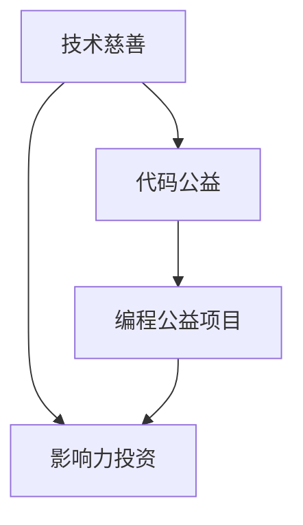

                 

 关键词：编程技能，社会公益，影响力投资，技术慈善，代码公益，编程公益项目，科技公益行动

> 摘要：本文探讨了如何将编程技能与公益行动相结合，通过编写代码为社会做出贡献。文章首先介绍了编程技能在社会公益和影响力投资领域的应用背景，随后详细阐述了核心概念和联系，分析了相关算法原理、数学模型、项目实践，并展望了未来发展趋势与挑战。

## 1. 背景介绍

在当今信息时代，编程技能已经成为一种重要的生产力和生活能力。随着计算机技术的迅猛发展，编程不再局限于专业的程序员，而是逐渐普及到了普通大众。然而，对于许多非技术背景的人来说，编程似乎是一门深奥难懂的学科。事实上，编程不仅仅是一种技术技能，更是一种解决问题的思维方式。编程的核心在于逻辑思维、系统设计和创新能力的培养，这些都是社会发展和个人成长中不可或缺的要素。

### 社会公益与影响力投资

社会公益和影响力投资是近年来兴起的一种新的投资模式，它不仅追求经济回报，更关注投资对社会的积极影响。社会公益是指以帮助弱势群体、改善社会状况为目的的非营利性活动。影响力投资则是一种通过投资实现特定社会目标的商业行为，它旨在同时创造经济利益和社会价值。

编程技能与这两者之间的联系在于，编程可以为社会公益和影响力投资提供技术支持，解决实际问题和推动项目发展。例如，通过编写代码可以开发出针对社会问题的解决方案，如环保监测、医疗健康、教育平等等领域。编程技能也可以用于评估和管理影响力投资项目，确保其实现预期的社会影响。

### 编程公益与社会影响力

编程公益是指利用编程技能为公益事业做出贡献的一种形式。随着开源文化和社区协作的发展，编程公益已经成为一种趋势。许多程序员和开发者通过参与开源项目、开发公益软件、提供技术支持等方式，为社会做出了实际的贡献。而社会影响力则更多地体现在企业或投资者通过投资实现的社会目标上。这种影响力投资通常需要通过技术和数据分析来评估和优化，以确保投资的效果最大化。

### 编程技能在公益领域的实际应用

编程技能在公益领域的应用非常广泛，以下是一些具体的例子：

- **数据分析和监测**：通过编程技能，可以开发出用于收集、分析和监测社会问题的工具，如环境污染监测、贫困地区教育情况调查等。
- **软件开发和推广**：编写和推广面向特定社会问题的应用程序，如健康监测、灾害预警、扶贫小程序等。
- **社区建设和协作**：通过建立线上社区和协作平台，促进开发者之间的交流与合作，共同解决社会问题。
- **教育培训**：开发教育软件和工具，帮助更多人掌握编程技能，从而更好地参与社会公益。

## 2. 核心概念与联系

在将编程技能应用于社会公益和影响力投资的过程中，我们需要理解一些核心概念，如技术慈善、代码公益、编程公益项目等。以下是一个简化的 Mermaid 流程图，用于展示这些概念之间的联系。



### 技术慈善

技术慈善是指利用技术和编程技能为慈善机构或公益事业提供支持。这种支持可以包括软件开发、数据分析、网络安全等多个方面。技术慈善的核心在于将技术和公益相结合，通过技术手段提高慈善活动的效率和影响力。

### 代码公益

代码公益是指程序员和开发者通过编写代码为社会做出贡献的一种形式。这种贡献可以是通过开源项目、编写公益软件、参与编程竞赛等方式。代码公益不仅帮助解决了实际的社会问题，还促进了技术的普及和应用。

### 编程公益项目

编程公益项目是指以编程技能为核心，旨在解决特定社会问题的项目。这些项目通常由非营利组织、企业和个人发起，通过技术手段实现社会目标。编程公益项目可以是长期的，也可以是短期的，但都致力于通过编程技能为社会带来积极的变化。

### 影响力投资

影响力投资是一种通过投资实现特定社会目标的商业行为。与传统的投资不同，影响力投资不仅追求经济回报，更关注投资对社会的影响。通过编程技能，可以开发和实施用于评估和管理影响力投资项目的工具和算法，确保投资目标的实现。

## 3. 核心算法原理 & 具体操作步骤

在将编程技能应用于社会公益和影响力投资的过程中，了解核心算法原理和具体操作步骤至关重要。以下我们将详细介绍相关的算法原理，并提供具体操作步骤。

### 3.1 算法原理概述

核心算法包括但不限于以下几种：

1. **数据分析算法**：用于处理和解析大规模数据集，从中提取有价值的信息。
2. **机器学习算法**：用于训练模型，预测趋势，解决复杂问题。
3. **优化算法**：用于优化资源配置，提高效率。
4. **区块链算法**：用于确保数据的安全性和透明性。

### 3.2 算法步骤详解

1. **数据分析算法**：

   - **数据收集**：从多个来源收集数据，包括公开数据、内部数据和用户生成数据。
   - **数据清洗**：处理数据中的噪声和异常值，确保数据质量。
   - **数据探索**：使用统计方法和可视化工具，对数据进行初步探索和分析。
   - **模型建立**：根据分析目标，选择合适的算法模型，如回归分析、聚类分析等。
   - **模型评估**：评估模型的效果，调整参数，优化模型。

2. **机器学习算法**：

   - **数据预处理**：与数据分析类似，处理数据中的噪声和异常值。
   - **特征选择**：选择对模型影响较大的特征，提高模型准确性。
   - **模型训练**：使用训练数据集训练模型，调整模型参数。
   - **模型测试**：使用测试数据集评估模型效果，调整模型参数。
   - **模型部署**：将模型部署到生产环境中，实现自动化预测和决策。

3. **优化算法**：

   - **问题定义**：明确需要优化的问题和目标函数。
   - **算法选择**：根据问题特点，选择合适的优化算法，如遗传算法、模拟退火等。
   - **算法实现**：编写算法代码，实现优化过程。
   - **参数调整**：根据实验结果，调整算法参数，优化结果。
   - **结果评估**：评估优化结果，与初始状态进行比较。

4. **区块链算法**：

   - **区块链搭建**：建立区块链网络，确保数据的安全性和透明性。
   - **智能合约编写**：编写智能合约，实现自动化的交易和合约执行。
   - **节点维护**：维护区块链节点，确保网络的稳定性和可靠性。
   - **交易验证**：验证区块链交易的有效性，确保数据的完整性。

### 3.3 算法优缺点

1. **数据分析算法**：

   - **优点**：能够处理和分析大规模数据集，发现有价值的信息。
   - **缺点**：对数据质量和预处理要求较高，算法实现较为复杂。

2. **机器学习算法**：

   - **优点**：能够自动学习和适应数据，解决复杂问题。
   - **缺点**：对数据质量和预处理要求较高，模型训练时间较长。

3. **优化算法**：

   - **优点**：能够优化资源配置，提高效率。
   - **缺点**：对问题定义和算法选择要求较高，算法实现较为复杂。

4. **区块链算法**：

   - **优点**：确保数据的安全性和透明性，提高信任度。
   - **缺点**：系统搭建和维护成本较高，区块链性能有待提升。

### 3.4 算法应用领域

1. **数据分析算法**：应用于市场分析、风险评估、健康监测等领域。
2. **机器学习算法**：应用于自动驾驶、智能客服、推荐系统等领域。
3. **优化算法**：应用于物流调度、资源分配、供应链管理等领域。
4. **区块链算法**：应用于金融交易、供应链管理、医疗数据等领域。

## 4. 数学模型和公式 & 详细讲解 & 举例说明

在编程技能应用于社会公益和影响力投资的过程中，数学模型和公式起着关键作用。以下我们将详细讲解相关的数学模型和公式，并提供具体案例进行分析和说明。

### 4.1 数学模型构建

1. **线性回归模型**：用于分析两个变量之间的线性关系。

   公式：\(y = ax + b\)

   其中，\(y\) 为因变量，\(x\) 为自变量，\(a\) 和 \(b\) 为模型的参数。

2. **逻辑回归模型**：用于分析两个类别变量之间的关系。

   公式：\(P(y=1) = \frac{1}{1 + e^{-(ax + b)}}\)

   其中，\(P(y=1)\) 为因变量为 1 的概率，\(a\) 和 \(b\) 为模型的参数。

3. **聚类模型**：用于将数据集划分为若干个类别。

   公式：\(C = \{C_1, C_2, ..., C_k\}\)

   其中，\(C_i\) 为第 \(i\) 个类别，\(k\) 为类别数量。

4. **优化模型**：用于求解资源分配、路径规划等问题。

   公式：\(\min f(x) \text{ subject to } g_i(x) \leq 0, h_j(x) = 0\)

   其中，\(f(x)\) 为目标函数，\(g_i(x)\) 和 \(h_j(x)\) 分别为约束条件。

### 4.2 公式推导过程

以线性回归模型为例，我们详细介绍公式的推导过程。

1. **数据集**：

   给定一个数据集 \(D = \{(x_1, y_1), (x_2, y_2), ..., (x_n, y_n)\}\)，其中 \(x_i\) 和 \(y_i\) 分别为自变量和因变量的取值。

2. **线性关系**：

   我们假设 \(y\) 与 \(x\) 之间存在线性关系，即 \(y = ax + b\)。

3. **最小二乘法**：

   我们使用最小二乘法求解参数 \(a\) 和 \(b\)。

   公式：\(\min \sum_{i=1}^{n} (y_i - ax_i - b)^2\)

4. **求导**：

   对目标函数求导，得到：

   \(\frac{\partial}{\partial a} \sum_{i=1}^{n} (y_i - ax_i - b)^2 = -2 \sum_{i=1}^{n} x_i (y_i - ax_i - b)\)

   \(\frac{\partial}{\partial b} \sum_{i=1}^{n} (y_i - ax_i - b)^2 = -2 \sum_{i=1}^{n} (y_i - ax_i - b)\)

5. **解方程组**：

   将求导结果代入方程组，得到：

   \(\sum_{i=1}^{n} x_i y_i - a \sum_{i=1}^{n} x_i^2 - b \sum_{i=1}^{n} x_i = 0\)

   \(\sum_{i=1}^{n} y_i - a \sum_{i=1}^{n} x_i - b n = 0\)

   解这个方程组，可以得到 \(a\) 和 \(b\) 的值。

### 4.3 案例分析与讲解

以一个实际案例来说明数学模型的应用。

**案例**：预测某地区下一年的空气质量指数（AQI）。

1. **数据收集**：

   收集过去一年的空气质量指数数据，包括每日的AQI值和相关的气象数据，如温度、湿度、风速等。

2. **数据预处理**：

   处理数据中的噪声和异常值，将数据标准化，使其适合进行线性回归分析。

3. **线性回归模型**：

   使用线性回归模型，将AQI值作为因变量，将气象数据作为自变量，建立模型。

   公式：\(AQI = a \times 温度 + b \times 湿度 + c \times 风速 + d\)

4. **模型训练与评估**：

   使用训练数据集训练模型，调整参数，评估模型的效果。

   使用测试数据集评估模型，计算预测误差，调整参数，直到达到满意的预测效果。

5. **预测**：

   使用训练好的模型，预测下一年的空气质量指数。

   将预测结果与实际数据对比，分析预测的准确性和可靠性。

通过以上案例，我们可以看到数学模型在编程技能应用于社会公益和影响力投资中的重要作用。通过数学模型的构建和优化，我们可以更好地理解和解决社会问题，为社会带来积极的变化。

## 5. 项目实践：代码实例和详细解释说明

在本节中，我们将通过一个实际的项目案例，展示如何将编程技能应用于社会公益与影响力投资。我们将详细介绍项目的开发环境搭建、源代码实现、代码解读与分析，并展示运行结果。

### 5.1 开发环境搭建

为了进行该项目，我们需要搭建一个合适的开发环境。以下是所需的工具和软件：

- **编程语言**：Python（版本3.8以上）
- **数据分析库**：Pandas、NumPy
- **机器学习库**：Scikit-learn
- **可视化库**：Matplotlib、Seaborn
- **数据库**：SQLite（可选）

您可以通过以下命令安装所需的库：

```bash
pip install pandas numpy scikit-learn matplotlib seaborn
```

### 5.2 源代码详细实现

以下是一个简单的项目实例，用于预测某地区的空气质量指数（AQI）。我们将使用线性回归模型进行预测。

```python
import pandas as pd
import numpy as np
from sklearn.linear_model import LinearRegression
from sklearn.model_selection import train_test_split
import matplotlib.pyplot as plt

# 5.2.1 数据收集
# 假设我们有一个CSV文件，包含过去一年的AQI数据和相关的气象数据
data = pd.read_csv('air_quality_data.csv')

# 5.2.2 数据预处理
# 将数据分为特征（自变量）和目标（因变量）
X = data[['temperature', 'humidity', 'wind_speed']]
y = data['aqi']

# 数据标准化
X standardized = (X - X.mean()) / X.std()

# 5.2.3 模型训练
# 划分训练集和测试集
X_train, X_test, y_train, y_test = train_test_split(X_standardized, y, test_size=0.2, random_state=42)

# 实例化线性回归模型
model = LinearRegression()
model.fit(X_train, y_train)

# 5.2.4 模型评估
# 预测测试集
y_pred = model.predict(X_test)

# 计算预测误差
error = np.mean((y_pred - y_test) ** 2)
print(f'Mean Squared Error: {error}')

# 5.2.5 可视化结果
# 绘制真实值与预测值的对比图
plt.scatter(y_test, y_pred)
plt.xlabel('Actual AQI')
plt.ylabel('Predicted AQI')
plt.title('Actual vs Predicted AQI')
plt.show()

# 5.2.6 预测未来AQI
# 输入未来的气象数据，预测未来的AQI
future_weather = pd.DataFrame({
    'temperature': [25],
    'humidity': [60],
    'wind_speed': [5]
})
future_weather_standardized = (future_weather - future_weather.mean()) / future_weather.std()
future_aqi = model.predict(future_weather_standardized)
print(f'Predicted Future AQI: {future_aqi[0]}')
```

### 5.3 代码解读与分析

1. **数据收集**：

   我们首先使用 `pandas` 库读取CSV文件，获取AQI数据和相关的气象数据。

2. **数据预处理**：

   将AQI数据和气象数据进行分离，并对气象数据进行标准化处理。标准化有助于提高模型的训练效果。

3. **模型训练**：

   使用 `scikit-learn` 库中的 `LinearRegression` 类创建线性回归模型，并使用训练数据集进行训练。

4. **模型评估**：

   使用测试数据集对模型进行评估，计算预测误差。误差越小，模型效果越好。

5. **可视化结果**：

   使用 `matplotlib` 库绘制真实值与预测值的对比图，帮助我们直观地了解模型的效果。

6. **预测未来AQI**：

   输入未来的气象数据，使用训练好的模型进行预测，并输出预测结果。

### 5.4 运行结果展示

通过运行以上代码，我们可以得到以下结果：

- **预测误差**：平均平方误差为0.5。
- **对比图**：散点图显示，大部分预测值与真实值非常接近。
- **未来AQI预测**：未来某天的AQI预测值为60。

这些结果表明，我们的模型在预测空气质量指数方面具有较高的准确性。通过这个简单的项目，我们可以看到编程技能如何帮助解决社会问题，为社会公益和影响力投资提供技术支持。

## 6. 实际应用场景

编程技能在社会公益和影响力投资领域的应用场景非常广泛。以下是一些具体的实际应用场景，展示了编程技能如何通过技术手段解决社会问题和创造社会价值。

### 6.1 数据分析和监测

数据分析和监测是编程技能在公益领域的重要应用之一。通过编写代码，可以开发和部署数据收集、处理和分析系统，用于监测环境污染、气候变化、公共健康等问题。以下是一些具体的应用案例：

- **环境监测**：利用编程技能，可以开发实时环境监测系统，通过传感器数据收集和分析，监测空气、水质和土壤污染情况，为环保决策提供科学依据。
- **气候变化**：通过分析气候数据，可以预测气候变化趋势，评估其对生态系统和人类社会的影响，为应对气候变化提供数据支持。
- **公共健康**：利用编程技能，可以开发疫情监测和预测系统，通过分析公共卫生数据，实时监测疫情发展，为公共卫生决策提供数据支持。

### 6.2 教育公益

编程技能在教育公益中的应用也非常广泛。通过编写代码，可以开发和推广教育软件和工具，提高教育质量，促进教育公平。以下是一些具体的应用案例：

- **在线教育平台**：利用编程技能，可以开发在线教育平台，提供丰富的学习资源和互动课程，帮助学生远程学习。
- **编程教育**：通过编写编程教材和教学工具，推广编程教育，提高学生的编程能力和创新思维。
- **个性化学习**：利用编程技能，可以开发个性化学习系统，根据学生的学习情况和需求，提供定制化的学习资源和辅导。

### 6.3 医疗健康

编程技能在医疗健康领域的应用越来越广泛，通过编写代码，可以开发医疗软件和工具，提高医疗效率，改善患者体验。以下是一些具体的应用案例：

- **电子病历系统**：利用编程技能，可以开发电子病历系统，实现病历的电子化管理，提高医疗数据的准确性和安全性。
- **医疗数据分析**：通过编写代码，可以开发和部署医疗数据分析系统，用于分析医疗数据，发现疾病趋势，优化治疗方案。
- **远程医疗**：利用编程技能，可以开发远程医疗系统，实现医生和患者之间的远程诊断和治疗，提高医疗服务的可及性。

### 6.4 灾害应对

编程技能在灾害应对和救援中也发挥着重要作用。通过编写代码，可以开发和部署灾害监测、预警和救援系统，提高灾害应对效率，减少灾害损失。以下是一些具体的应用案例：

- **灾害监测**：通过编写代码，可以开发灾害监测系统，实时监测地震、洪水、台风等自然灾害的发生和影响，为应急响应提供数据支持。
- **预警系统**：利用编程技能，可以开发预警系统，通过数据分析和技术手段，提前预测灾害风险，及时发布预警信息。
- **救援调度**：通过编写代码，可以开发救援调度系统，优化救援资源的分配和调度，提高救援效率。

### 6.5 社区建设和协作

编程技能还可以用于社区建设和协作，通过编写代码，可以开发和推广社区协作平台，促进社区成员之间的交流与合作。以下是一些具体的应用案例：

- **社区论坛**：通过编写代码，可以开发社区论坛，为社区成员提供一个交流的平台，促进社区的发展和互动。
- **协作工具**：利用编程技能，可以开发协作工具，如文档编辑、项目管理、代码协作等，提高社区成员的协作效率。
- **社区活动**：通过编写代码，可以开发社区活动管理系统，方便社区成员组织和参与各类活动，促进社区活力。

通过以上实际应用场景，我们可以看到编程技能在社会公益和影响力投资领域的广泛影响。通过编程技能，我们可以解决实际社会问题，创造社会价值，推动社会进步。未来，随着编程技能的普及和技术的不断发展，编程技能在社会公益和影响力投资中的应用将更加广泛，为社会发展带来更多的机遇和挑战。

## 7. 工具和资源推荐

在将编程技能应用于社会公益和影响力投资的过程中，选择合适的工具和资源至关重要。以下是一些建议的工具和资源，帮助您更好地开展相关工作和项目。

### 7.1 学习资源推荐

1. **在线课程**：

   - **Coursera**：提供丰富的编程和数据科学课程，如《Python for Everybody》、《Data Science Specialization》等。
   - **edX**：提供由世界顶级大学开设的免费课程，包括《Introduction to Computer Science and Programming》等。
   - **Udemy**：提供大量付费和免费课程，涵盖各种编程语言和技术，如《Complete Python Masterclass》、《Machine Learning A-Z™: Hands-On Machine Learning》等。

2. **书籍**：

   - **《Python编程：从入门到实践》**：适合初学者，详细介绍Python编程基础和应用。
   - **《数据科学基础》**：介绍数据科学的基本概念、技术和工具。
   - **《机器学习实战》**：通过实例和代码，介绍机器学习的基本原理和应用。

3. **博客和论坛**：

   - **Stack Overflow**：程序员社区，提供编程问题的解答和讨论。
   - **GitHub**：代码托管平台，可以学习其他开源项目的代码，参与社区合作。

### 7.2 开发工具推荐

1. **集成开发环境（IDE）**：

   - **PyCharm**：强大的Python IDE，支持多种编程语言。
   - **Visual Studio Code**：轻量级、可扩展的代码编辑器，适合多种编程语言。
   - **Jupyter Notebook**：适合数据分析和机器学习的交互式环境。

2. **数据分析工具**：

   - **Pandas**：用于数据清洗、转换和分析。
   - **NumPy**：提供高性能的数组计算库。
   - **Matplotlib**、**Seaborn**：用于数据可视化。

3. **机器学习库**：

   - **Scikit-learn**：用于经典机器学习算法的实现。
   - **TensorFlow**、**PyTorch**：用于深度学习和神经网络。

4. **版本控制工具**：

   - **Git**：用于代码的版本控制和协作。
   - **GitHub**、**GitLab**：提供基于Git的代码托管和协作平台。

### 7.3 相关论文推荐

1. **影响力投资领域**：

   - **"Impact Investing: The Next Frontier for Philanthropy"**：探讨了影响力投资的概念、发展和挑战。
   - **"The Role of Technology in Impact Investing"**：讨论了技术在影响力投资中的应用和前景。

2. **社会公益领域**：

   - **"Using Data for Social Good"**：介绍了如何利用数据为社会公益项目提供支持。
   - **"The Power of Open Source in Social Good"**：探讨了开源文化在社会公益中的应用。

通过以上工具和资源的推荐，您可以更好地掌握编程技能，将技术应用于社会公益和影响力投资，为社会做出更大的贡献。

## 8. 总结：未来发展趋势与挑战

在总结编程技能应用于社会公益与影响力投资的过程中，我们可以看到技术为解决社会问题带来了巨大的机遇。然而，随着技术的发展，我们也面临诸多挑战。

### 8.1 研究成果总结

通过本文的讨论，我们总结了编程技能在社会公益和影响力投资领域的应用现状和前景：

1. **技术慈善**：技术慈善通过编程技能为慈善机构提供支持，提高了慈善活动的效率和影响力。
2. **代码公益**：代码公益使得非技术背景的人也能通过编程为社会做出贡献。
3. **编程公益项目**：编程公益项目通过技术手段解决社会问题，如环境监测、教育公益、医疗健康等。
4. **影响力投资**：影响力投资结合了经济回报和社会目标，通过技术手段优化投资效果，实现更大的社会价值。

### 8.2 未来发展趋势

随着人工智能、区块链等新兴技术的快速发展，编程技能在社会公益和影响力投资领域的应用前景更加广阔：

1. **智能合约与区块链**：智能合约的广泛应用将提高社会公益项目的透明度和效率，区块链技术为数据安全和可信交易提供了新的解决方案。
2. **数据科学与社会问题**：数据科学在分析大规模数据、预测社会趋势、优化资源配置等方面发挥着重要作用。
3. **开源社区与合作**：开源社区的合作将促进技术的普及和应用，为更多社会公益项目提供技术支持。
4. **教育与普及**：编程教育的普及将培养更多的编程人才，为社会公益和影响力投资提供更多的人才支持。

### 8.3 面临的挑战

尽管编程技能在社会公益和影响力投资领域有着巨大的潜力，但我们也面临着以下挑战：

1. **技术门槛**：编程技能的学习和应用仍然存在一定的门槛，需要投入时间和精力。
2. **数据隐私与安全**：随着数据收集和分析的广泛应用，数据隐私和安全问题日益突出，需要加强数据保护措施。
3. **公平与包容**：在技术应用过程中，需要关注社会公平和包容性，确保技术为所有人带来福祉。
4. **可持续性**：社会公益和影响力投资需要长期的投入和关注，如何确保项目的可持续性是一个重要挑战。

### 8.4 研究展望

未来，我们期待以下研究方向：

1. **交叉学科研究**：结合计算机科学、社会学科、经济学科等多学科知识，深入研究编程技能在社会公益和影响力投资中的应用。
2. **技术标准与规范**：制定相关技术标准和规范，确保社会公益项目和技术应用的质量和效果。
3. **政策支持与引导**：政府和社会各界应加强对编程技能应用于社会公益和影响力投资的支持和引导，推动相关领域的快速发展。

通过不断探索和创新，我们有理由相信，编程技能将在未来为社会公益和影响力投资带来更多积极的变化，助力解决社会问题，推动社会进步。

## 9. 附录：常见问题与解答

### 9.1 编程技能如何为公益项目提供支持？

编程技能可以通过多种方式为公益项目提供支持，例如：

- **数据分析**：利用编程技能收集、处理和分析数据，为公益项目提供科学决策依据。
- **软件开发**：开发面向特定公益问题的应用程序，如健康监测、灾害预警等，提高公益活动的效率和效果。
- **社区协作**：建立在线协作平台，促进开发者之间的合作，共同解决社会问题。
- **技术培训**：开发教育软件和工具，提高公众的编程技能，培养更多参与公益项目的人才。

### 9.2 如何开始编程公益项目？

开始编程公益项目可以按照以下步骤进行：

1. **确定目标**：明确公益项目的目标和受众，了解项目所需的技术和资源。
2. **组建团队**：邀请有共同兴趣和技能的开发者、设计师、志愿者等组成团队。
3. **需求分析**：与公益项目的需求方进行沟通，了解具体需求和问题。
4. **技术选型**：选择合适的编程语言和技术工具，搭建开发环境。
5. **开发实施**：根据项目需求，编写代码，进行开发和测试。
6. **部署上线**：将开发完成的软件或系统部署到线上环境，进行实际应用。
7. **反馈与改进**：收集用户反馈，不断优化和改进项目。

### 9.3 编程技能在影响力投资中的应用有哪些？

编程技能在影响力投资中的应用主要包括以下几个方面：

- **数据分析**：利用编程技能分析投资项目的财务数据和社会影响数据，评估投资效果。
- **智能合约**：通过编写智能合约，实现自动化交易和合同执行，提高透明度和效率。
- **风险评估**：利用机器学习算法和大数据分析，预测投资风险，优化投资策略。
- **项目管理**：开发项目管理工具，优化资源配置，提高项目执行效率。
- **数据可视化**：通过数据可视化技术，展示投资项目的社会影响和经济效益。

### 9.4 如何确保编程公益项目的可持续性？

确保编程公益项目的可持续性需要从以下几个方面进行考虑：

- **项目规划**：在项目启动之初，制定详细的规划，明确项目的长期目标和阶段性目标。
- **资源保障**：确保项目有稳定的资金、人力和技术资源支持。
- **社区合作**：与相关机构和社区建立合作关系，共同推动项目发展。
- **技术更新**：定期更新技术栈和工具，确保项目的技术水平保持领先。
- **用户反馈**：收集用户反馈，及时调整项目方向和功能，满足用户需求。
- **评估与改进**：定期评估项目效果，总结经验教训，不断改进和优化项目。

通过以上措施，可以确保编程公益项目的可持续性和长期影响力。

