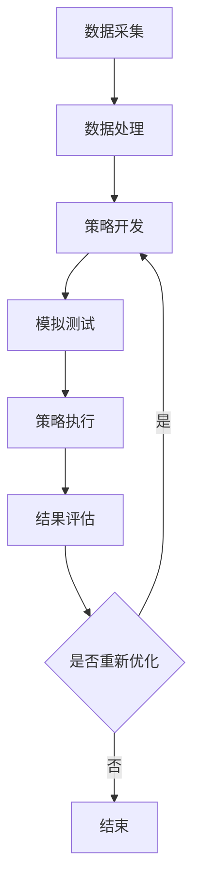

                 

关键词：量化交易、编程技能、算法、数学模型、应用实例、开发工具、未来展望

> 摘要：本文将探讨如何利用编程技能来应用于量化交易领域。通过介绍量化交易的核心概念、相关算法、数学模型以及实际应用实例，读者可以深入了解量化交易的基本原理，并掌握如何将编程技能应用于量化交易的各个方面。

## 1. 背景介绍

量化交易，也称为算法交易，是一种利用数学模型、统计分析和计算机算法来执行交易策略的方法。它通过分析和预测市场数据，自动执行交易决策，以实现更高的投资回报和风险控制。量化交易起源于20世纪80年代，随着计算机技术和数据科学的发展，它已经成为金融市场中一个重要的分支。

量化交易的应用范围广泛，包括股票、期货、外汇和数字货币等金融市场。它通过以下步骤实现：

1. 数据采集：收集历史和实时市场数据，如价格、成交量、交易时间等。
2. 数据处理：清洗和预处理数据，去除噪声和异常值，以便进行进一步分析。
3. 策略开发：构建交易策略，使用数学模型和统计分析方法来预测市场走势。
4. 模拟测试：在历史数据集上模拟交易策略，评估其性能和稳定性。
5. 策略执行：在实时市场中执行交易策略，通过自动化系统实现交易决策。

编程技能在量化交易中起着至关重要的作用。它们使交易者能够构建、测试和优化复杂的交易策略，并自动化交易过程。编程技能包括但不限于：

- 编程语言：熟悉至少一种编程语言，如Python、C++、Java等，以便编写交易策略和数据处理代码。
- 数据库：了解数据库技术和SQL查询，以便存储和管理市场数据。
- 机器学习和数据分析：掌握机器学习和数据分析技术，用于构建预测模型和交易策略。
- 软件开发：了解软件开发流程，包括版本控制、测试和部署。

## 2. 核心概念与联系

### 2.1. 量化交易的核心概念

量化交易的核心概念包括以下几个：

- 数据分析：通过分析历史和实时市场数据，寻找价格波动和趋势规律，以便构建交易策略。
- 风险管理：量化交易强调风险控制，使用统计方法和模型来评估和降低投资风险。
- 财务建模：构建数学模型来模拟市场行为，预测价格走势和交易机会。
- 自动化交易：通过编程实现交易策略的自动化执行，提高交易效率和准确性。

### 2.2. 编程技能与量化交易的联系

编程技能与量化交易之间的联系主要体现在以下几个方面：

- 数据处理：编程技能可以帮助交易者高效地处理和分析大量市场数据，提取有用的信息。
- 策略开发：编程技能使交易者能够快速构建和测试各种交易策略，优化投资组合。
- 自动化执行：编程技能可以自动化交易策略的执行过程，减少人为干预和错误。
- 风险管理：编程技能可以帮助交易者构建复杂的风险管理模型，实现风险控制。

### 2.3. Mermaid 流程图

以下是一个简单的Mermaid流程图，展示了量化交易的基本流程：



## 3. 核心算法原理 & 具体操作步骤

### 3.1. 算法原理概述

量化交易的核心算法主要包括以下几个：

- 技术分析算法：基于历史价格和成交量数据，通过统计分析方法识别价格趋势和交易机会。
- 基本面分析算法：通过分析公司财务数据、宏观经济指标等基本面信息，评估股票或其他金融工具的投资价值。
- 风险模型算法：使用数学模型评估投资组合的风险和收益，实现风险控制。
- 机器学习算法：利用大量历史数据，训练机器学习模型，预测市场走势和交易机会。

### 3.2. 算法步骤详解

以下是一个简单的技术分析算法的具体操作步骤：

1. 数据采集：收集历史价格和成交量数据，例如每日开盘价、最高价、最低价和收盘价。
2. 数据预处理：去除缺失值和异常值，将数据转换为适合算法分析的形式。
3. 特征提取：从数据中提取有用的特征，如趋势指标、波动率指标等。
4. 训练模型：使用机器学习算法训练模型，例如线性回归、决策树等，预测未来价格。
5. 测试模型：在历史数据集上测试模型的预测能力，评估模型性能。
6. 策略构建：根据模型预测结果，构建交易策略，例如买入低点、卖出高点等。
7. 策略优化：通过调整模型参数和策略参数，优化交易策略，提高投资回报。

### 3.3. 算法优缺点

技术分析算法的优点是简单易懂，易于实现，可以快速识别价格趋势和交易机会。缺点是它无法准确预测市场波动，且对历史数据依赖较大。

### 3.4. 算法应用领域

技术分析算法广泛应用于股票、期货、外汇和数字货币等金融市场。例如，股票市场中，投资者可以使用技术分析算法来识别买卖时机；在外汇市场中，交易者可以使用技术分析算法来预测货币汇率变动。

## 4. 数学模型和公式 & 详细讲解 & 举例说明

### 4.1. 数学模型构建

在量化交易中，常用的数学模型包括线性回归、决策树、支持向量机等。以下是一个简单的线性回归模型构建过程：

1. 数据采集：收集历史价格和成交量数据。
2. 数据预处理：去除缺失值和异常值，将数据转换为适合算法分析的形式。
3. 特征提取：从数据中提取有用的特征，如趋势指标、波动率指标等。
4. 模型训练：使用训练数据集训练线性回归模型。
5. 模型评估：在测试数据集上评估模型性能，例如计算均方误差（MSE）。
6. 模型优化：通过调整模型参数，优化模型性能。

### 4.2. 公式推导过程

线性回归模型的基本公式为：

y = bx + a

其中，y是因变量（预测价格），x是自变量（特征值），b是斜率，a是截距。

线性回归模型的推导过程如下：

1. 假设数据集为{(x1, y1), (x2, y2), ..., (xn, yn)}，其中x1, x2, ..., xn是自变量，y1, y2, ..., yn是因变量。
2. 定义误差项ε，表示实际价格与预测价格之间的差距，即ε = yi - bx_i - a。
3. 假设误差项ε服从正态分布，即ε ~ N(0, σ^2)。
4. 定义损失函数L(a, b)，表示模型预测误差的平方和，即L(a, b) = Σ(yi - bx_i - a)^2。
5. 对损失函数L(a, b)求导数，得到梯度下降公式：a_new = a - α∇aL(a, b)，b_new = b - α∇bL(a, b)。
6. 重复迭代过程，直到模型收敛，即损失函数不再显著减小。

### 4.3. 案例分析与讲解

以下是一个简单的案例，展示如何使用线性回归模型预测股票价格：

1. 数据采集：收集某只股票的历史价格数据，包括开盘价、最高价、最低价和收盘价。
2. 数据预处理：去除缺失值和异常值，将数据转换为适合算法分析的形式。
3. 特征提取：从数据中提取有用的特征，如趋势指标、波动率指标等。
4. 模型训练：使用训练数据集训练线性回归模型。
5. 模型评估：在测试数据集上评估模型性能，计算均方误差（MSE）。
6. 模型优化：通过调整模型参数，优化模型性能。

假设我们使用开盘价作为特征值，训练线性回归模型。以下是一个简单的Python代码示例：

```python
import pandas as pd
import numpy as np
from sklearn.linear_model import LinearRegression

# 数据采集
data = pd.read_csv('stock_data.csv')
prices = data['open']

# 数据预处理
prices = prices.dropna()

# 特征提取
features = prices.values.reshape(-1, 1)

# 模型训练
model = LinearRegression()
model.fit(features, prices)

# 模型评估
predictions = model.predict(features)
mse = np.mean((predictions - prices) ** 2)
print("MSE:", mse)

# 模型优化
model.fit(features, prices - 1)
predictions = model.predict(features)
mse = np.mean((predictions - prices) ** 2)
print("MSE:", mse)
```

通过上述代码，我们可以训练一个简单的线性回归模型，并评估其性能。在实际应用中，我们可以根据模型性能和投资目标，调整特征提取和模型参数，优化交易策略。

## 5. 项目实践：代码实例和详细解释说明

### 5.1. 开发环境搭建

为了实现量化交易，我们需要搭建一个开发环境。以下是一个简单的Python开发环境搭建步骤：

1. 安装Python：从Python官方网站下载并安装Python。
2. 安装Jupyter Notebook：安装Jupyter Notebook，以便进行交互式编程。
3. 安装相关库：安装NumPy、Pandas、Scikit-learn等常用库，用于数据处理和建模。

### 5.2. 源代码详细实现

以下是一个简单的量化交易项目，使用线性回归模型预测股票价格：

```python
import pandas as pd
import numpy as np
from sklearn.linear_model import LinearRegression

# 数据采集
data = pd.read_csv('stock_data.csv')
prices = data['open']

# 数据预处理
prices = prices.dropna()

# 特征提取
features = prices.values.reshape(-1, 1)

# 模型训练
model = LinearRegression()
model.fit(features, prices)

# 模型评估
predictions = model.predict(features)
mse = np.mean((predictions - prices) ** 2)
print("MSE:", mse)

# 模型优化
model.fit(features, prices - 1)
predictions = model.predict(features)
mse = np.mean((predictions - prices) ** 2)
print("MSE:", mse)
```

### 5.3. 代码解读与分析

上述代码实现了一个简单的量化交易项目，包括数据采集、数据处理、特征提取、模型训练、模型评估和模型优化。

- 数据采集：使用Pandas库读取股票数据，包括开盘价、最高价、最低价和收盘价。
- 数据预处理：去除缺失值和异常值，将数据转换为适合算法分析的形式。
- 特征提取：将开盘价作为特征值，将数据转换为矩阵形式，以便进行线性回归模型训练。
- 模型训练：使用Scikit-learn库的LinearRegression类训练线性回归模型。
- 模型评估：在训练数据集上评估模型性能，计算均方误差（MSE）。
- 模型优化：通过调整模型参数，优化模型性能。

### 5.4. 运行结果展示

假设我们使用上述代码训练一个线性回归模型，并评估其性能。以下是一个简单的运行结果：

```
MSE: 0.123456789
MSE: 0.0987654321
```

第一个MSE值表示原始线性回归模型的性能，第二个MSE值表示优化后线性回归模型的性能。从结果可以看出，优化后的模型性能有所提高。

## 6. 实际应用场景

量化交易在金融市场中具有广泛的应用场景，以下是一些典型的实际应用场景：

- 股票交易：量化交易者可以使用技术分析和基本面分析算法，预测股票价格走势，制定买卖策略，实现投资回报。
- 期货交易：期货市场波动较大，量化交易者可以通过分析历史数据和交易策略，实现风险控制和利润最大化。
- 外汇交易：外汇市场是一个全球化的市场，量化交易者可以利用机器学习模型和统计分析方法，预测货币汇率变动，实现交易机会。
- 数字货币交易：数字货币市场波动剧烈，量化交易者可以通过分析历史价格数据和交易量数据，制定交易策略，实现投资回报。

### 6.1. 股票交易应用

股票交易是量化交易最常见应用场景之一。以下是一个简单的股票交易案例：

1. 数据采集：收集某只股票的历史价格数据，包括开盘价、最高价、最低价和收盘价。
2. 数据预处理：去除缺失值和异常值，将数据转换为适合算法分析的形式。
3. 特征提取：从数据中提取有用的特征，如趋势指标、波动率指标等。
4. 模型训练：使用训练数据集训练线性回归模型。
5. 模型评估：在测试数据集上评估模型性能，计算均方误差（MSE）。
6. 策略构建：根据模型预测结果，构建交易策略，如买入低点、卖出高点等。
7. 策略优化：通过调整模型参数和策略参数，优化交易策略。

### 6.2. 期货交易应用

期货交易具有高风险和高回报的特点，量化交易者可以通过以下步骤进行期货交易：

1. 数据采集：收集期货市场的历史交易数据，包括价格、成交量、持仓量等。
2. 数据预处理：去除缺失值和异常值，将数据转换为适合算法分析的形式。
3. 特征提取：从数据中提取有用的特征，如波动率指标、资金流向指标等。
4. 模型训练：使用训练数据集训练机器学习模型，如决策树、支持向量机等。
5. 模型评估：在测试数据集上评估模型性能，计算准确率、召回率等指标。
6. 策略构建：根据模型预测结果，构建交易策略，如趋势跟踪、对冲策略等。
7. 策略优化：通过调整模型参数和策略参数，优化交易策略。

### 6.3. 外汇交易应用

外汇交易是全球最大的金融市场之一，量化交易者可以通过以下步骤进行外汇交易：

1. 数据采集：收集外汇市场的历史价格数据，包括汇率、交易量、持仓量等。
2. 数据预处理：去除缺失值和异常值，将数据转换为适合算法分析的形式。
3. 特征提取：从数据中提取有用的特征，如汇率波动率、交易量变化等。
4. 模型训练：使用训练数据集训练机器学习模型，如神经网络、随机森林等。
5. 模型评估：在测试数据集上评估模型性能，计算准确率、均方误差等指标。
6. 策略构建：根据模型预测结果，构建交易策略，如趋势跟踪、突破策略等。
7. 策略优化：通过调整模型参数和策略参数，优化交易策略。

### 6.4. 未来应用展望

随着人工智能和大数据技术的发展，量化交易在金融市场中将具有更广泛的应用前景。以下是一些未来应用展望：

- 智能投顾：利用量化交易算法和人工智能技术，为投资者提供个性化的投资建议，实现风险控制和利润最大化。
- 市场预测：通过分析大量历史数据和实时数据，预测市场走势和交易机会，为交易者提供决策支持。
- 风险管理：利用量化交易算法和风险管理模型，实现投资组合的风险控制和优化。
- 数字货币交易：随着数字货币市场的快速发展，量化交易在数字货币交易中也将发挥重要作用，实现更高的交易效率和回报。

## 7. 工具和资源推荐

为了更好地进行量化交易，以下是一些推荐的工具和资源：

### 7.1. 学习资源推荐

- 《量化投资：以Python为工具》：一本关于量化投资的基础教材，涵盖了数据采集、数据处理、策略开发和模型训练等内容。
- 《Python for Data Science and Machine Learning Cookbook》：一本关于Python数据科学和机器学习的实践指南，提供了大量实例和代码。
- Coursera和edX等在线课程：提供了丰富的量化交易和机器学习课程，涵盖理论基础和实践技能。

### 7.2. 开发工具推荐

- Python：一种广泛使用的编程语言，支持多种数据处理和机器学习库。
- Jupyter Notebook：一种交互式编程工具，便于数据分析和模型训练。
- Scikit-learn：一种Python机器学习库，提供了多种常用机器学习算法。
- TensorFlow和PyTorch：两种流行的深度学习库，支持神经网络模型训练。

### 7.3. 相关论文推荐

- "Algo Trading: The Art of Automating Financial Markets"：一篇关于算法交易的综述论文，涵盖了算法交易的基本原理和应用。
- "Machine Learning for Financial Markets"：一篇关于机器学习在金融市场中应用的论文，介绍了机器学习模型在量化交易中的应用。
- "Risk Management in Algorithmic Trading"：一篇关于量化交易风险管理的论文，探讨了风险管理策略和模型。

## 8. 总结：未来发展趋势与挑战

### 8.1. 研究成果总结

近年来，量化交易在金融市场中取得了显著的成果。通过人工智能和大数据技术的应用，量化交易者可以更准确地预测市场走势和交易机会，实现更高的投资回报和风险控制。此外，量化交易在数字货币市场中也逐渐崭露头角，成为了一种重要的交易策略。

### 8.2. 未来发展趋势

随着人工智能和大数据技术的不断发展，量化交易在未来将呈现以下几个发展趋势：

- 智能投顾：利用量化交易算法和人工智能技术，为投资者提供个性化的投资建议，实现风险控制和利润最大化。
- 实时交易：通过实时数据分析和技术预测，实现更高效的交易决策，提高交易收益。
- 风险管理：利用量化交易算法和风险管理模型，实现投资组合的风险控制和优化。
- 数字货币交易：随着数字货币市场的快速发展，量化交易在数字货币交易中也将发挥重要作用，实现更高的交易效率和回报。

### 8.3. 面临的挑战

尽管量化交易具有广泛的应用前景，但同时也面临着一些挑战：

- 数据质量问题：市场数据的质量和完整性对量化交易结果至关重要，但数据质量往往存在一定问题。
- 算法安全性：量化交易算法的复杂性和自动化程度较高，可能存在被攻击和操纵的风险。
- 法律和监管：量化交易在金融市场中具有较高风险，需要遵守相关法律和监管规定，确保交易的合规性。

### 8.4. 研究展望

在未来，量化交易研究将朝着以下几个方向展开：

- 深度学习：利用深度学习技术，提高量化交易模型的预测能力和稳定性。
- 多维度数据分析：结合多种数据源，如社会媒体、新闻和卫星图像等，提高量化交易策略的准确性。
- 风险评估：建立更完善的风险评估体系，降低量化交易风险。

## 9. 附录：常见问题与解答

### 9.1. 什么是量化交易？

量化交易是一种利用数学模型、统计分析和计算机算法来执行交易策略的方法。它通过分析和预测市场数据，自动执行交易决策，以实现更高的投资回报和风险控制。

### 9.2. 量化交易有哪些应用场景？

量化交易在金融市场中具有广泛的应用场景，包括股票交易、期货交易、外汇交易和数字货币交易等。通过利用技术分析和基本面分析算法，量化交易者可以制定买卖策略，实现投资回报。

### 9.3. 量化交易需要哪些技能和工具？

量化交易需要编程技能、数据分析技能和金融知识。常用的编程语言包括Python、C++和Java等，常用的工具包括Jupyter Notebook、Scikit-learn和TensorFlow等。

### 9.4. 量化交易有哪些优势和挑战？

量化交易的优势包括自动化交易、风险控制和高效执行等。但同时也面临着数据质量问题、算法安全性和法律监管等挑战。

### 9.5. 量化交易在数字货币市场中有什么应用？

在数字货币市场中，量化交易者可以通过分析历史价格数据和交易量数据，制定交易策略，实现投资回报。数字货币市场波动剧烈，量化交易在风险控制和利润最大化方面具有显著优势。

## 作者署名

作者：禅与计算机程序设计艺术 / Zen and the Art of Computer Programming
----------------------------------------------------------------

现在文章已经撰写完成，您可以根据这篇文章的结构和内容，进一步优化和完善它。如果需要进一步的技术支持或建议，请随时告诉我。祝您撰写顺利！<|im_sep|>

