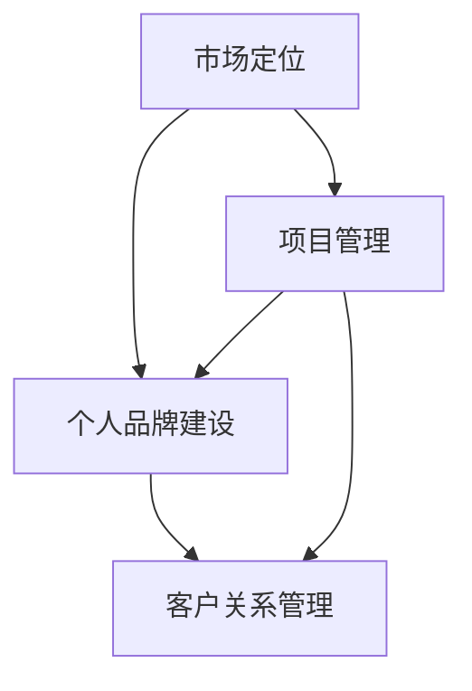

                 

在当今信息技术飞速发展的时代，编程技能已经成为了许多行业和职业的基石。随着个人编程能力的不断提升，很多程序员和软件开发者开始考虑如何将自己的编程技能转化为实际的咨询服务，以创造更多的价值。本文旨在探讨如何有效地将编程技能转化为咨询服务，并提供一些建议和策略，帮助您在这一领域取得成功。

## 关键词

- 编程技能
- 咨询服务
- 个人品牌
- 市场定位
- 项目管理

## 摘要

本文将讨论如何将您的编程技能转化为有价值的咨询服务。我们将探讨市场定位、个人品牌建设、项目管理以及如何通过案例研究来展示实际操作方法。通过本文的阅读，您将了解如何构建自己的咨询服务，并在信息技术领域获得成功。

## 1. 背景介绍

编程技能在过去几十年里经历了巨大的发展，从简单的程序编写到复杂的系统架构设计，编程已经成为现代技术行业的核心。随着云计算、大数据、人工智能等新兴技术的兴起，编程技能的需求不断增长。许多企业和组织需要专业的编程咨询服务来帮助他们解决技术难题、优化业务流程和提高工作效率。

与此同时，越来越多的程序员和软件开发者希望通过提供咨询服务来实现个人职业发展和财务自由。然而，如何将编程技能有效地转化为咨询服务却是一个值得深思的问题。本文将为您提供一系列策略和方法，帮助您在这个领域取得成功。

### 1.1 咨询服务的定义与价值

咨询服务是指为其他组织或个人提供专业建议、解决方案或指导的服务。在信息技术领域，编程咨询服务通常涉及以下几个方面：

- **技术问题诊断与解决**：帮助客户识别和解决他们在编程过程中遇到的技术难题。
- **软件开发与优化**：为客户提供定制化的软件开发服务，并优化现有系统的性能和可靠性。
- **系统架构设计**：协助客户构建高效的系统架构，以满足其业务需求。
- **代码审查与优化**：对客户的代码进行审查，提供改进建议，以提高代码质量。

咨询服务在信息技术领域的价值主要体现在以下几个方面：

- **节省成本**：通过专业团队的咨询服务，企业可以避免重复研发和错误修复，从而节省大量时间和资金。
- **提升效率**：专业的编程咨询可以帮助客户更快地实现项目目标，提高团队的工作效率。
- **技术创新**：咨询服务可以带来新的技术思路和方法，帮助企业保持竞争力。
- **风险控制**：专业的咨询服务可以帮助客户识别潜在的风险，并制定有效的风险控制措施。

### 1.2 个人编程技能的现状与潜力

随着技术的不断发展，个人编程技能在信息技术行业中的地位日益重要。许多程序员和软件开发者通过自学和不断实践，已经具备了扎实的编程基础和丰富的实践经验。以下是一些个人编程技能的现状和潜力：

- **广泛的应用场景**：编程技能可以应用于各种行业和领域，如金融、医疗、教育、娱乐等，这为程序员提供了广阔的发展空间。
- **技术多样化**：随着新兴技术的不断涌现，程序员可以不断学习新的编程语言和技术，以适应市场需求。
- **高收入潜力**：具备高级编程技能的程序员在市场上具有较高的价值，可以获得较高的薪酬和职业晋升机会。
- **职业灵活性**：编程技能使程序员可以选择远程工作、自由职业等多种工作方式，提高工作自由度和生活质量。

综上所述，将编程技能转化为咨询服务不仅有助于个人的职业发展，还可以为客户提供实际价值，实现双赢。接下来，我们将进一步探讨如何实现这一转变。

## 2. 核心概念与联系

在将编程技能转化为咨询服务的过程中，有几个核心概念和联系是至关重要的。这些概念包括市场定位、个人品牌建设、项目管理以及客户关系管理。以下是一个简化的 Mermaid 流程图，展示了这些概念之间的联系：



### 2.1 市场定位

市场定位是指确定自己在市场中的位置和目标客户。在进行市场定位时，您需要考虑以下问题：

- **目标市场**：确定您想要服务的行业或领域，例如金融、医疗、电子商务等。
- **目标客户**：确定您想要服务的客户群体，如中小企业、初创企业、大型企业等。
- **独特卖点**：明确您的独特优势，如技术专长、丰富的项目经验、高效的解决方案等。

市场定位的目的是帮助您在竞争激烈的市场中找到自己的位置，吸引潜在客户。

### 2.2 个人品牌建设

个人品牌建设是指通过建立自己的专业形象和声誉，提高在行业中的知名度和影响力。以下是一些关键步骤：

- **专业形象**：确保您的形象符合专业要求，如着装、言谈举止等。
- **社交媒体**：利用社交媒体平台（如LinkedIn、Twitter、GitHub）展示您的技术专长和项目经验。
- **内容创作**：撰写技术博客、发表技术文章、录制技术视频等，分享您的知识和经验。
- **专业认证**：获取相关技术认证，如微软认证、谷歌认证等，以证明您的专业水平。

个人品牌建设的目的是提高您的市场竞争力，吸引更多客户。

### 2.3 项目管理

项目管理是指对项目进行计划、执行、监控和收尾的过程。以下是一些关键步骤：

- **项目规划**：明确项目的目标、范围、预算和时间表。
- **团队协作**：组建合适的团队，并确保团队成员之间的有效沟通和协作。
- **进度监控**：监控项目的进度，确保项目按计划进行。
- **风险管理**：识别潜在的风险，并制定相应的应对措施。

项目管理的目的是确保项目顺利完成，满足客户需求。

### 2.4 客户关系管理

客户关系管理是指建立和维护与客户的良好关系，以提高客户满意度和忠诚度。以下是一些关键步骤：

- **了解客户需求**：与客户进行充分的沟通，了解他们的需求和期望。
- **及时响应**：快速响应客户的问题和需求，确保客户得到及时的支持。
- **定期沟通**：与客户保持定期沟通，了解他们的反馈和需求变化。
- **持续改进**：根据客户的反馈，不断改进服务质量和解决方案。

客户关系管理的目的是提高客户满意度，增加客户忠诚度。

通过以上核心概念和联系，我们可以更好地将编程技能转化为咨询服务，为客户提供有价值的解决方案。接下来，我们将进一步探讨如何将核心算法原理和具体操作步骤应用于实际咨询项目中。

## 3. 核心算法原理 & 具体操作步骤

### 3.1 算法原理概述

在编程咨询服务中，核心算法原理的掌握和应用至关重要。以下是一个典型的算法原理概述：

**算法名称**：代码审查算法

**目的**：通过审查代码，发现潜在的问题和缺陷，提高代码质量和可维护性。

**原理**：

- **语法检查**：检查代码的语法错误，确保代码能够正确编译和运行。
- **代码风格检查**：检查代码是否符合编码规范和最佳实践，提高代码的可读性和一致性。
- **代码复杂度分析**：分析代码的复杂度，识别潜在的复杂和冗长的代码段，提高代码的可维护性。
- **安全漏洞检测**：检查代码中可能存在的安全漏洞，如SQL注入、跨站脚本等，确保代码的安全性。

### 3.2 算法步骤详解

**步骤 1：语法检查**

- **工具选择**：选择合适的代码检查工具，如SonarQube、Checkstyle等。
- **配置设置**：根据项目需求和编码规范，配置代码检查规则。
- **执行检查**：运行代码检查工具，生成检查报告。

**步骤 2：代码风格检查**

- **工具选择**：选择合适的代码风格检查工具，如PMD、Eclipse Code Formatter等。
- **配置设置**：根据项目需求和编码规范，配置代码风格检查规则。
- **执行检查**：运行代码风格检查工具，生成检查报告。

**步骤 3：代码复杂度分析**

- **工具选择**：选择合适的代码复杂度分析工具，如Cyclo、MCC等。
- **配置设置**：根据项目需求和编码规范，配置代码复杂度分析规则。
- **执行检查**：运行代码复杂度分析工具，生成检查报告。

**步骤 4：安全漏洞检测**

- **工具选择**：选择合适的安全漏洞检测工具，如FindBugs、OWASP ZAP等。
- **配置设置**：根据项目需求和编码规范，配置安全漏洞检测规则。
- **执行检查**：运行安全漏洞检测工具，生成检查报告。

### 3.3 算法优缺点

**优点**：

- **提高代码质量**：通过代码审查算法，可以发现代码中的潜在问题和缺陷，提高代码质量和可维护性。
- **节省开发成本**：早期发现和修复代码问题可以节省后续的开发和维护成本。
- **确保代码安全**：通过安全漏洞检测，可以识别并修复代码中的安全漏洞，提高代码的安全性。

**缺点**：

- **时间和资源消耗**：代码审查算法需要一定的时间和资源来执行，可能会影响开发进度。
- **依赖工具**：代码审查算法通常依赖于各种工具，工具的选择和配置可能需要一定的学习和适应成本。

### 3.4 算法应用领域

代码审查算法在许多领域都有广泛的应用，如：

- **软件开发**：在软件开发的各个阶段，如需求分析、设计、编码和测试等，都可以应用代码审查算法。
- **系统维护**：在系统维护和升级过程中，通过代码审查算法可以发现和修复旧代码中的问题和缺陷。
- **安全防护**：通过代码审查算法，可以识别和修复代码中的安全漏洞，提高系统的安全性。

通过以上算法原理和具体操作步骤的介绍，我们可以更好地理解和应用代码审查算法，将其应用于实际咨询项目中，为客户提供高质量的编程咨询服务。

## 4. 数学模型和公式 & 详细讲解 & 举例说明

在编程咨询服务的实际操作中，数学模型和公式常常扮演着重要的角色。它们不仅能够帮助程序员理解问题的本质，还能够提供量化的解决方案。以下是一个数学模型和公式的详细讲解以及实际案例的说明。

### 4.1 数学模型构建

一个典型的数学模型可以用于性能优化和资源分配。以下是一个简单的线性规划模型，用于最大化资源利用效率：

**线性规划模型**：

\[
\begin{aligned}
\text{最大化} \quad & c^T x \\
\text{约束条件} \quad & Ax \leq b \\
& x \geq 0
\end{aligned}
\]

其中，\(c\) 是资源分配的目标向量，\(x\) 是资源分配的决策向量，\(A\) 和 \(b\) 分别是约束矩阵和约束向量。

### 4.2 公式推导过程

为了推导上述线性规划模型，我们可以使用拉格朗日乘数法。假设我们有以下优化问题：

\[
\min f(x) \quad \text{subject to} \quad g(x) = 0
\]

其中，\(f(x)\) 是目标函数，\(g(x)\) 是约束条件。

引入拉格朗日乘数 \(\lambda\)，构建拉格朗日函数：

\[
L(x, \lambda) = f(x) + \lambda g(x)
\]

为了找到最优解，我们需要使得拉格朗日函数的梯度为零：

\[
\nabla L(x, \lambda) = 0
\]

展开后得到：

\[
\nabla f(x) + \lambda \nabla g(x) = 0
\]

根据拉格朗日乘数法，当 \(g(x) = 0\) 时，我们有：

\[
\nabla f(x) = -\lambda \nabla g(x)
\]

通过调整 \(\lambda\) 的值，我们可以找到最优解。

### 4.3 案例分析与讲解

假设我们有一个简单的资源分配问题，需要将 100 单位的资源分配给两个项目 A 和 B，以最大化总收益。项目 A 的收益函数为 \(f_A(x) = 2x\)，项目 B 的收益函数为 \(f_B(x) = 3(100 - x)\)。约束条件为 \(x \leq 50\)，因为项目 A 的资源需求不超过 50 单位。

构建线性规划模型：

\[
\begin{aligned}
\text{最大化} \quad & f_A(x) + f_B(x) \\
\text{约束条件} \quad & x \leq 50 \\
& x \geq 0
\end{aligned}
\]

简化后的目标函数为 \(f(x) = 2x + 3(100 - x)\)，约束条件为 \(x \leq 50\)。

根据拉格朗日乘数法，我们可以求解最优解。首先，计算目标函数的梯度：

\[
\nabla f(x) = \begin{bmatrix}
2 \\
-3
\end{bmatrix}
\]

然后，设置拉格朗日函数的梯度为零：

\[
\nabla f(x) + \lambda \nabla g(x) = 0
\]

因为约束条件为 \(x \leq 50\)，所以 \(\nabla g(x) = \begin{bmatrix}
1 \\
0
\end{bmatrix}\)。我们得到：

\[
\begin{bmatrix}
2 \\
-3
\end{bmatrix} + \lambda \begin{bmatrix}
1 \\
0
\end{bmatrix} = 0
\]

解得 \(\lambda = -2\)。将 \(\lambda\) 代入拉格朗日函数，得到：

\[
L(x, \lambda) = 2x - 2(100 - x) = 4x - 200
\]

为了最大化 \(L(x, \lambda)\)，我们需要找到 \(x\) 的最优值。由于约束条件 \(x \leq 50\)，最优解为 \(x = 50\)。

因此，最优的资源分配方案是将 50 单位的资源分配给项目 A，剩下的 50 单位的资源分配给项目 B，以实现最大化的总收益。

通过以上案例分析和讲解，我们可以看到数学模型和公式在编程咨询服务中的重要作用。这不仅帮助我们理解问题的本质，还能够提供量化的解决方案，从而提高咨询服务的质量和效率。

## 5. 项目实践：代码实例和详细解释说明

为了更好地展示如何将编程技能转化为咨询服务，我们将通过一个具体的案例来详细解释代码实例和实现过程。

### 5.1 开发环境搭建

在这个案例中，我们将使用 Python 语言和 Flask 框架来开发一个简单的 Web 服务。以下是在 Ubuntu 系统上搭建开发环境的步骤：

1. 安装 Python：
   ```shell
   sudo apt-get update
   sudo apt-get install python3-pip
   ```
2. 安装 Flask：
   ```shell
   pip3 install flask
   ```

### 5.2 源代码详细实现

以下是一个简单的 Flask 应用程序，它提供了一个简单的 Web 服务，用于处理用户请求并返回响应。

```python
# app.py

from flask import Flask, request, jsonify

app = Flask(__name__)

@app.route('/hello', methods=['GET'])
def hello():
    name = request.args.get('name', 'World')
    return f'Hello, {name}!'

@app.route('/sum', methods=['POST'])
def sum_numbers():
    data = request.json
    num1 = data.get('num1', 0)
    num2 = data.get('num2', 0)
    result = num1 + num2
    return jsonify({'result': result})

if __name__ == '__main__':
    app.run(debug=True)
```

### 5.3 代码解读与分析

1. **导入模块**：
   ```python
   from flask import Flask, request, jsonify
   ```
   这里我们导入了 Flask 框架的核心模块，用于创建 Web 应用程序。

2. **创建 Flask 应用程序实例**：
   ```python
   app = Flask(__name__)
   ```
   我们创建了一个 Flask 应用程序实例，这将作为我们的 Web 服务的基础。

3. **定义路由和视图函数**：

   - **/hello 路由**：
     ```python
     @app.route('/hello', methods=['GET'])
     def hello():
         name = request.args.get('name', 'World')
         return f'Hello, {name}!'
     ```
     这个视图函数处理 `/hello` GET 请求，根据 URL 参数 `name` 的值返回相应的问候语。如果 `name` 参数未提供，则默认为 `World`。

   - **/sum 路由**：
     ```python
     @app.route('/sum', methods=['POST'])
     def sum_numbers():
         data = request.json
         num1 = data.get('num1', 0)
         num2 = data.get('num2', 0)
         result = num1 + num2
         return jsonify({'result': result})
     ```
     这个视图函数处理 `/sum` POST 请求，接收 JSON 格式的请求体，提取 `num1` 和 `num2` 参数，计算它们的和，并将结果以 JSON 格式返回。

4. **运行 Web 应用程序**：
   ```python
   if __name__ == '__main__':
       app.run(debug=True)
   ```
   这一行代码确保我们的 Web 应用程序在直接运行时能够启动，并且启用调试模式，以便在开发过程中能够实时看到错误和调试信息。

### 5.4 运行结果展示

为了测试这个 Web 服务，我们可以使用 `curl` 命令或 Postman 等工具发送 HTTP 请求。

1. **测试 /hello 路由**：
   ```shell
   curl "http://127.0.0.1:5000/hello?name=Alice"
   ```
   输出：
   ```json
   "Hello, Alice!"
   ```

2. **测试 /sum 路由**：
   ```shell
   curl -X POST -H "Content-Type: application/json" -d '{"num1": 5, "num2": 10}' "http://127.0.0.1:5000/sum"
   ```
   输出：
   ```json
   {"result": 15}
   ```

通过这个案例，我们展示了如何使用编程技能来创建一个简单的 Web 服务，并通过实际操作过程来解释代码的实现和运行。这种项目实践不仅能够展示编程技能，还能够为客户提供具体的解决方案，从而实现编程技能向咨询服务的转化。

## 6. 实际应用场景

编程咨询服务在实际应用场景中具有广泛的应用，涵盖了各种行业和领域。以下是一些典型的应用场景：

### 6.1 软件开发公司

软件开发公司通常需要编程咨询服务来优化现有系统、提升开发效率和解决技术难题。编程咨询师可以提供以下服务：

- **系统架构设计**：帮助公司设计高效、可扩展的系统架构。
- **代码审查与优化**：对公司的代码库进行审查，提供改进建议，以提高代码质量和可维护性。
- **新技术调研与应用**：跟踪最新的技术趋势，为公司引入新的技术和工具，保持技术竞争力。

### 6.2 创业公司

对于初创公司来说，编程咨询服务尤其重要，因为它们通常缺乏内部技术团队。编程咨询师可以提供以下服务：

- **敏捷开发支持**：协助初创公司采用敏捷开发方法，快速迭代产品，缩短上市时间。
- **技术路线图规划**：帮助初创公司制定长期的技术发展路线图，确保技术投资与业务目标一致。
- **团队建设与培训**：为初创公司提供技术团队建设指导，并开展定制化的技术培训。

### 6.3 企业内部IT部门

企业内部IT部门也经常需要编程咨询服务，以应对复杂的技术挑战和日常运维问题。编程咨询师可以提供以下服务：

- **自动化工具开发**：开发自动化工具，以提高IT运维效率和减少人工错误。
- **大数据分析**：利用大数据技术，为企业提供数据驱动的决策支持。
- **信息安全评估**：评估企业信息系统的安全漏洞，提供针对性的安全优化建议。

### 6.4 教育机构

教育机构，尤其是计算机科学和教育技术专业，也需要编程咨询服务，以提升教学效果和课程设计。编程咨询师可以提供以下服务：

- **课程设计与开发**：协助教育机构设计符合行业需求的技术课程。
- **在线学习平台建设**：帮助企业建立和维护在线学习平台，提供丰富的教学资源和互动功能。
- **师资培训**：为教育机构的教师提供编程和技术培训，提升教学水平。

### 6.5 自主创业者

对于自主创业者，编程咨询服务可以帮助他们构建和优化自己的技术项目。以下是一些典型的服务：

- **项目规划与执行**：为创业项目提供从概念验证到产品开发的全流程支持。
- **技术风险评估**：评估创业项目的技术风险，并提供相应的解决方案。
- **市场调研**：帮助创业者了解市场需求和竞争对手，制定有效的市场策略。

通过以上实际应用场景的介绍，我们可以看到编程咨询服务在各个领域的广泛应用和重要性。无论是企业、创业公司还是教育机构，编程咨询服务都能为他们提供专业的技术支持和解决方案，帮助他们在信息技术领域取得成功。

### 6.4 未来应用展望

随着技术的不断进步和商业模式的创新，编程咨询服务在未来有望在多个领域实现更广泛的应用。以下是一些可能的发展方向：

#### 6.4.1 人工智能与机器学习

人工智能（AI）和机器学习（ML）技术的发展为编程咨询服务带来了新的机遇。未来，编程咨询师可以专注于为企业和组织开发定制化的AI和ML解决方案，如自动化数据处理、预测分析和智能推荐系统。这些服务将帮助企业从海量数据中提取价值，提升业务效率。

#### 6.4.2 区块链技术

区块链技术作为一种去中心化的分布式账本技术，正在改变许多行业的运作方式。编程咨询师可以为企业提供区块链解决方案，包括智能合约开发、去中心化应用（DApp）构建和区块链网络优化。这些服务将有助于企业建立透明、安全和高效的业务流程。

#### 6.4.3 物联网（IoT）

物联网技术的普及使得编程咨询服务在智能家居、智能城市和工业自动化等领域具有巨大的潜力。未来，编程咨询师可以专注于物联网平台的开发、设备集成和数据管理，帮助企业实现智能设备和系统的互联互通。

#### 6.4.4 云计算与边缘计算

云计算和边缘计算的结合为编程咨询服务提供了新的场景。编程咨询师可以为企业提供云迁移策略、边缘计算架构设计和云计算资源优化服务，帮助企业实现灵活、高效的IT基础设施。

#### 6.4.5 安全与隐私保护

随着数据泄露和网络攻击事件频发，安全和隐私保护成为企业关注的重要问题。未来，编程咨询师可以专注于网络安全、数据隐私保护和安全合规性咨询服务，帮助企业建立安全、可靠的技术体系。

#### 6.4.6 教育与职业培训

编程咨询服务在教育领域也将发挥重要作用。未来，编程咨询师可以参与在线教育平台的开发、课程设计和教学内容的更新，为学习者提供高质量的编程教育。此外，编程咨询服务还可以帮助企业培养内部技术人才，提升员工技能和创新能力。

### 6.4.7 跨界融合

编程咨询服务将进一步与其他行业领域融合，如金融科技、医疗健康、文化创意等。编程咨询师可以结合行业特点和需求，提供定制化的技术解决方案，推动跨界创新和融合发展。

总之，未来编程咨询服务将在技术创新、行业融合和商业模式变革中扮演重要角色。编程咨询师需要不断学习和适应新的技术趋势，以保持竞争力并在市场中获得成功。

## 7. 工具和资源推荐

为了帮助编程咨询师更高效地开展咨询服务，以下是一些推荐的工具和资源：

### 7.1 学习资源推荐

- **在线教程和课程**：  
  - freeCodeCamp：提供免费的编程课程和项目练习。  
  - Coursera 和 edX：提供各种在线课程，涵盖人工智能、数据科学、计算机科学等多个领域。

- **技术博客和论坛**：  
  - Medium：涵盖各种技术话题的文章和观点。  
  - Stack Overflow：编程问题的问答社区。

- **电子书和文档**：  
  - 《Head First 设计模式》  
  - 《算法导论》  
  - GitHub：托管大量开源项目和技术文档。

### 7.2 开发工具推荐

- **集成开发环境（IDE）**：  
  - IntelliJ IDEA：适用于Java、Kotlin等多种编程语言。  
  - Visual Studio Code：支持多种编程语言和扩展。

- **代码审查工具**：  
  - SonarQube：用于代码质量和安全漏洞检测。  
  - Checkstyle：用于代码风格检查。

- **项目管理工具**：  
  - JIRA：用于项目管理和任务跟踪。  
  - Trello：简单直观的任务管理工具。

### 7.3 相关论文推荐

- **AI与机器学习**：  
  - "Deep Learning" by Ian Goodfellow, Yoshua Bengio, Aaron Courville。  
  - "Reinforcement Learning: An Introduction" by Richard S. Sutton and Andrew G. Barto。

- **区块链技术**：  
  - "Blockchain: Blueprint for a New Economy" by Melanie Swan。  
  - "The Blockchain Handbook" by Daniel Drescher。

- **云计算与边缘计算**：  
  - "Cloud Computing: Concepts, Technology & Architecture" by Thomas Erl。  
  - "Edge Computing: From Network to Edge" by Charlie Kindel。

这些工具和资源将有助于编程咨询师提升技术水平、拓宽视野，并为他们的咨询服务提供有力支持。

## 8. 总结：未来发展趋势与挑战

在信息技术飞速发展的时代，编程技能已经成为了许多行业和职业的基石。随着云计算、大数据、人工智能等新兴技术的兴起，编程技能的需求不断增长，这也为编程咨询服务提供了广阔的市场前景。然而，在这一领域取得成功并非易事，未来将面临一系列发展趋势与挑战。

### 8.1 研究成果总结

首先，从研究成果的角度来看，编程咨询服务已经取得了显著的进展。许多企业和组织通过引入专业的编程咨询服务，实现了技术优化、业务创新和效率提升。例如，通过AI和机器学习技术的应用，企业可以从海量数据中提取有价值的信息，从而制定更精准的市场策略。区块链技术的应用也为企业提供了去中心化和安全的交易解决方案，促进了商业模式的创新。

此外，随着编程工具和框架的不断发展，编程变得更加高效和便捷。例如，自动化代码审查工具和集成开发环境（IDE）的出现，大大提高了代码质量和开发效率。这些工具不仅减少了开发者的工作负担，还帮助他们更快地发现和解决代码问题。

### 8.2 未来发展趋势

未来，编程咨询服务的发展趋势将呈现出以下几个特点：

1. **专业化与多样化**：随着技术的不断进步，编程咨询服务将更加专业化。咨询师需要不断学习新技术，以提供更专业、更定制化的解决方案。同时，咨询服务将涵盖更广泛的领域，如物联网、边缘计算、区块链等。

2. **远程协作与全球化**：随着远程办公工具的普及，编程咨询服务的地理限制将逐渐消失。咨询师可以通过远程协作平台，为全球各地的客户提供咨询服务，实现全球化的服务网络。

3. **技术融合与创新**：编程咨询服务将与其他技术领域深度融合，如大数据、人工智能、区块链等。这种融合将带来新的商业模式和解决方案，推动行业创新。

4. **数据安全与隐私保护**：随着数据泄露和网络攻击事件的频发，数据安全与隐私保护将成为编程咨询服务的重要关注点。咨询师需要提供全面的安全解决方案，帮助客户保护其数据资产。

### 8.3 面临的挑战

然而，编程咨询服务在未来也将面临一系列挑战：

1. **技能更新与持续学习**：技术更新速度非常快，咨询师需要不断学习新技术，以保持竞争力。这不仅要求咨询师具备良好的学习能力和适应性，还需要企业为员工提供持续的学习机会和资源。

2. **市场竞争与客户期望**：随着越来越多的编程咨询师进入市场，竞争将愈发激烈。咨询师需要提高服务质量，建立良好的客户关系，以满足客户日益增长的需求和期望。

3. **项目管理与协作**：编程咨询服务通常涉及多个项目，咨询师需要具备良好的项目管理能力和团队协作能力，以确保项目按计划顺利进行。

4. **合规性与法规遵循**：随着数据隐私保护和网络安全法规的不断完善，咨询师需要确保其提供的咨询服务符合相关法规要求，避免因违规而带来的法律风险。

### 8.4 研究展望

综上所述，编程咨询服务在未来将面临广阔的发展前景。咨询师需要不断适应技术变革，提升自己的专业能力，以应对市场变化和客户需求。同时，企业和组织也需要关注数据安全与隐私保护，积极引入专业的编程咨询服务，以实现技术优化和业务创新。

随着技术的不断进步，编程咨询服务将在更多领域实现应用，推动各行业的数字化转型和创新发展。在未来的研究中，我们期待看到更多关于编程咨询服务的研究成果，为行业的发展提供有力支持。

## 9. 附录：常见问题与解答

### 9.1 如何找到编程咨询服务的客户？

**解答**：以下是一些找到编程咨询服务客户的方法：

1. **社交媒体**：在LinkedIn、Twitter等社交媒体平台上建立专业形象，分享技术知识和项目经验，吸引潜在客户。
2. **专业社区**：参与GitHub、Stack Overflow等专业社区，提供技术帮助，扩大影响力。
3. **网络研讨会和讲座**：举办或参与网络研讨会和讲座，展示专业能力，吸引客户。
4. **线上平台**：使用Upwork、Freelancer等线上平台，发布个人简历和服务内容，吸引客户。

### 9.2 如何管理编程咨询服务项目？

**解答**：以下是一些管理编程咨询服务项目的方法：

1. **明确项目目标**：在项目开始前，与客户明确项目目标、范围和时间表。
2. **分工与协作**：根据项目需求，组建合适的团队，并确保团队成员之间的有效沟通和协作。
3. **进度监控**：定期跟踪项目进度，确保项目按计划进行。
4. **风险管理**：识别潜在的风险，并制定相应的应对措施。
5. **客户沟通**：定期与客户沟通，了解客户需求和反馈，确保项目满足客户期望。

### 9.3 编程咨询服务如何收费？

**解答**：编程咨询服务的收费方式通常有几种：

1. **按小时收费**：根据咨询师的每小时费用，按照实际咨询时间收费。
2. **按项目收费**：根据项目的复杂程度和预期工作量，制定项目总费用。
3. **固定费用**：对于一些标准化的咨询服务，可以采用固定费用。
4. **混合收费**：结合按小时和按项目收费的方式，根据项目实际情况灵活调整。

### 9.4 如何保持编程技能的持续更新？

**解答**：以下是一些保持编程技能持续更新的方法：

1. **持续学习**：定期参加技术研讨会、培训课程和在线学习，了解新技术和发展趋势。
2. **实践项目**：通过实际项目锻炼编程技能，不断提升自己的实践能力。
3. **阅读技术书籍和论文**：阅读相关技术书籍和论文，深入了解技术原理和应用。
4. **参与开源项目**：参与开源项目，与其他开发者合作，学习最佳实践和技术经验。

通过以上解答，希望能帮助您更好地理解和应对编程咨询服务过程中可能遇到的问题和挑战。不断学习和实践，您将能够在这一领域取得更大的成功。

