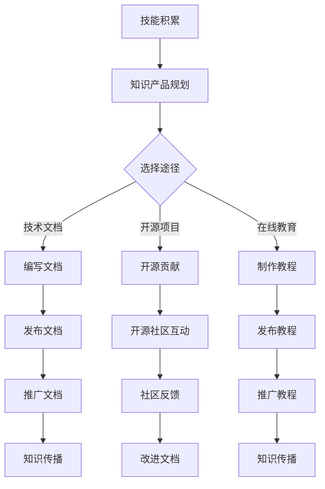

                 

 关键词：编程技能，知识产品，知识转化，知识产权，技术文档，开源项目，在线教育

> 摘要：本文旨在探讨如何将个人编程技能转化为有价值的知识产品。通过对技术文档、开源项目、在线教育等途径的深入分析，本文提出了构建和推广知识产品的方法，以实现个人技能的增值和传播。

## 1. 背景介绍

在信息技术迅猛发展的今天，编程技能已成为现代社会不可或缺的素养。无论是软件开发、数据分析，还是人工智能、区块链，编程技能的应用领域日益广泛。然而，许多拥有强大编程能力的人并没有意识到，他们的技能不仅能够帮助他们获得高薪工作，还可以通过转化为知识产品，实现更广泛的传播和经济效益。

知识产品，通常指的是能够带来经济价值或者社会效益的智力成果，如技术文档、教程、开源软件、专利等。通过知识产品的形式，编程技能不仅可以被更广泛地传播，还可以成为个人品牌的一部分，进而提升个人在行业中的影响力和话语权。

本文将深入探讨如何利用编程技能创建知识产品，分析其中的关键步骤、方法和策略，为程序员提供一条从技能到价值的转化之路。

## 2. 核心概念与联系

在探讨如何将编程技能转化为知识产品之前，我们需要了解几个核心概念，包括知识产品、知识产权、技术文档和开源项目。这些概念相互关联，共同构成了编程技能转化为知识产品的框架。

### 2.1 知识产品的定义与分类

知识产品是指那些以知识产权为保护对象，通过人类智力活动产生的创造性劳动成果。根据表现形式，知识产品可以分为以下几类：

- **技术文档**：详细描述技术方案、算法实现、系统架构等内容，如API文档、开发手册、用户指南等。
- **开源软件**：遵循开源协议，允许用户自由使用、修改和分发软件的代码库。
- **教程和培训资料**：包括在线课程、电子书、视频教程等形式，用于传授知识或技能。
- **专利和版权**：通过专利申请或版权登记，保护原创的技术方案或作品。

### 2.2 知识产权的基本概念

知识产权是指法律上赋予创造者对其创造性成果所享有的一种专有权利。常见的知识产权包括：

- **版权**：保护文学、艺术和科学作品，如书籍、音乐、电影等。
- **专利权**：保护发明、实用新型和外观设计等技术创新。
- **商标权**：保护标识、标志等商业标识的独占使用权。
- **商业秘密**：保护不为公众所知悉、具有商业价值的信息。

### 2.3 技术文档的重要性

技术文档是知识产品中非常重要的一环。它不仅帮助开发者理解和维护代码，也是向外部用户传递技术价值的重要途径。高质量的技术文档能够提高软件的可用性和可维护性，减少学习成本，增强用户满意度。

### 2.4 开源项目与知识传播

开源项目是编程技能转化为知识产品的有效途径之一。通过开源，开发者可以：

- **共享知识**：将自己的代码、经验、解决方案分享给全球开发者，促进技术交流。
- **获取反馈**：通过社区反馈，改进和完善代码，提高项目的质量。
- **构建影响力**：积极参与开源项目，可以提升个人在技术社区中的知名度，积累人脉资源。

### 2.5 Mermaid 流程图

下面是一个用 Mermaid 编写的流程图，展示了编程技能转化为知识产品的基本流程：



### 3. 核心算法原理 & 具体操作步骤

#### 3.1 算法原理概述

编程技能转化为知识产品的过程可以看作是一个算法，其核心原理如下：

1. **技能积累**：通过实践和项目经验，不断积累编程技能。
2. **知识产品规划**：根据技能特点和市场需求，选择合适的知识产品形式。
3. **内容创作**：编写技术文档、开发开源项目或制作教程。
4. **发布与推广**：通过合适的渠道发布知识产品，并进行推广。

#### 3.2 算法步骤详解

1. **技能积累**：
   - **实践**：通过实际项目积累经验，提高编程技能。
   - **学习**：持续学习新的编程语言、框架和工具。

2. **知识产品规划**：
   - **市场调研**：了解市场需求，确定知识产品的类型。
   - **技能分析**：评估自己的技能，选择最适合的知识产品形式。

3. **内容创作**：
   - **技术文档**：编写清晰、详细的文档，涵盖技术细节和使用方法。
   - **开源项目**：创建开源项目，贡献代码和文档。
   - **教程**：制作易于理解的教程，帮助他人学习。

4. **发布与推广**：
   - **选择平台**：选择合适的平台发布知识产品，如GitHub、简书、知乎等。
   - **营销推广**：通过社交媒体、邮件列表等方式推广知识产品。

#### 3.3 算法优缺点

**优点**：

- **知识传播**：通过知识产品，可以将个人技能和经验广泛传播。
- **品牌建设**：优质的知识产品有助于个人品牌的建立和提升。
- **经济效益**：知识产品可以转化为经济收益，如通过订阅、广告或销售。

**缺点**：

- **时间成本**：内容创作需要大量时间和精力。
- **市场竞争**：知识产品市场竞争激烈，需要不断提升质量和影响力。

#### 3.4 算法应用领域

编程技能转化为知识产品的算法可以广泛应用于以下领域：

- **软件开发**：编写技术文档、开发开源项目。
- **在线教育**：制作教程、课程，进行在线教学。
- **技术咨询**：提供技术咨询和解决方案文档。

### 4. 数学模型和公式 & 详细讲解 & 举例说明

#### 4.1 数学模型构建

在编程技能转化为知识产品的过程中，可以使用以下数学模型来评估知识产品的价值：

- **成本 - 收益模型**：计算知识产品的成本（包括时间、人力、物力等）和收益（包括销售收入、广告收入等），评估知识产品的经济效益。

#### 4.2 公式推导过程

设C为知识产品总成本，R为总收益，P为单个知识产品的售价，Q为销售量，则知识产品的价值V可以通过以下公式计算：

$$V = R - C = P \times Q - C$$

其中，P和Q可以通过市场调研和销售策略确定，C可以通过详细的时间和工作量估算得到。

#### 4.3 案例分析与讲解

假设一个程序员决定编写一本关于Python数据科学的电子书，售价为人民币200元。通过市场调研，他估计这本书能够销售1000册。同时，编写这本书需要花费他200小时，每小时工资为1000元。

根据上述公式，可以计算出这本书的价值：

$$C = 200 \times 1000 = 20万$$

$$R = 200 \times 1000 = 20万$$

$$V = R - C = 0$$

在这个案例中，知识产品的价值为0，这意味着仅靠这本书的销售无法覆盖成本。然而，如果这本书能够通过广告、赞助或版权销售等方式获得额外收益，其价值将增加。

### 5. 项目实践：代码实例和详细解释说明

#### 5.1 开发环境搭建

为了将编程技能转化为知识产品，我们首先需要搭建一个适合开发和发布的开发环境。以下是搭建环境的步骤：

1. **安装编程工具**：安装Python、Visual Studio Code、Git等开发工具。
2. **配置代码库**：在GitHub或其他代码托管平台上创建一个新的代码库。
3. **安装依赖**：在项目中安装必要的库和依赖。

#### 5.2 源代码详细实现

以下是编写一个简单的Python脚本，用于生成技术文档的示例代码：

```python
# tech_doc_generator.py
def generate_document(title, content):
    """
    生成技术文档。

    :param title: 文档标题
    :param content: 文档内容
    :return: 生成的文档字符串
    """
    doc = f"""
### {title}

{content}
"""
    return doc

# 使用示例
doc = generate_document("Python 数据科学入门", "本文将介绍Python在数据科学领域的应用...")
print(doc)
```

#### 5.3 代码解读与分析

上述代码定义了一个名为`generate_document`的函数，用于生成技术文档。该函数接受两个参数：`title`（文档标题）和`content`（文档内容）。函数返回一个包含HTML格式的文档字符串。

在示例中，我们调用`generate_document`函数生成了一个关于“Python 数据科学入门”的文档，并将其打印出来。

#### 5.4 运行结果展示

运行上述代码后，将生成以下HTML格式的文档：

```html
### Python 数据科学入门

本文将介绍Python在数据科学领域的应用...
```

这个文档可以作为基础框架，进一步扩展和修改，以满足不同的技术文档需求。

### 6. 实际应用场景

编程技能转化为知识产品在实际应用场景中具有广泛的应用。以下是一些常见的应用场景：

- **软件开发**：编写高质量的技术文档和开发手册，提高软件的可维护性和用户体验。
- **在线教育**：制作教程和课程，通过在线平台进行教学，实现知识的传播和变现。
- **技术咨询**：提供专业的技术解决方案和报告，为企业提供技术支持和指导。

#### 6.1 软件开发

在软件开发领域，技术文档是不可或缺的一部分。通过编写详细的技术文档，开发者可以：

- **降低学习成本**：为新手或新成员提供清晰的技术指南。
- **提高可维护性**：为后期的维护和更新提供参考。
- **提升用户体验**：为用户使用软件提供详尽的操作说明。

#### 6.2 在线教育

在线教育是知识产品转化的重要渠道之一。通过制作高质量的教程和课程，开发者可以实现以下目标：

- **知识传播**：将个人技能和经验通过互联网传播给更多人。
- **品牌建设**：通过专业的课程提升个人或机构的知名度。
- **经济效益**：通过课程销售、赞助或广告等方式获得经济收益。

#### 6.3 技术咨询

在技术咨询领域，知识产品可以表现为技术解决方案、报告和培训资料。通过这些产品，企业可以获得以下好处：

- **技术支持**：为企业提供专业的技术指导和服务。
- **风险降低**：帮助企业避免技术风险，提高项目成功率。
- **成本节约**：通过知识产品降低咨询成本，提高项目效益。

### 7. 未来应用展望

随着技术的不断进步，编程技能转化为知识产品的应用场景将越来越广泛。以下是未来应用的一些展望：

- **人工智能与大数据**：利用人工智能和大数据技术，可以更精准地分析市场需求，提高知识产品的价值和影响力。
- **虚拟现实与增强现实**：通过虚拟现实和增强现实技术，可以创造出更加生动和互动的知识产品，提升用户体验。
- **区块链**：利用区块链技术，可以实现知识产品的版权保护和管理，提高知识产权的安全性。

### 8. 工具和资源推荐

为了高效地将编程技能转化为知识产品，以下是一些推荐的工具和资源：

- **开发工具**：Visual Studio Code、PyCharm、Git等。
- **文档生成工具**：Sphinx、Doxygen、Markdown等。
- **在线教育平台**：Coursera、Udemy、知乎Live等。
- **开源社区**：GitHub、GitLab、Stack Overflow等。
- **学习资源**：《算法导论》、《深度学习》、《Python编程：从入门到实践》等书籍。

### 9. 总结：未来发展趋势与挑战

随着技术的不断进步，编程技能转化为知识产品的趋势将愈加明显。然而，这一过程也面临诸多挑战，如市场竞争、知识产权保护、内容创作成本等。未来的发展趋势包括：

- **个性化与定制化**：知识产品将更加注重个性化与定制化，满足不同用户的需求。
- **智能化与自动化**：利用人工智能和大数据技术，实现知识产品的智能化生成和推广。
- **多平台融合**：知识产品将在多个平台上进行推广，实现多渠道传播。

### 10. 附录：常见问题与解答

**Q：如何选择合适的知识产品形式？**

A：根据个人技能和市场需求，选择最适合的知识产品形式。例如，如果擅长软件开发，可以选择编写技术文档或开发开源项目；如果擅长教学，可以选择制作教程或在线课程。

**Q：如何提高知识产品的质量？**

A：提高知识产品的质量需要从多个方面入手，包括内容准确性、语言表达、结构布局等。可以通过不断学习和实践，积累经验，并借鉴优秀知识产品的特点进行改进。

**Q：如何推广知识产品？**

A：可以通过社交媒体、博客、在线教育平台、邮件列表等多种渠道进行推广。同时，可以参加技术会议、讲座等活动，提升个人和知识产品的知名度。

---

作者：禅与计算机程序设计艺术 / Zen and the Art of Computer Programming
----------------------------------------------------------------

**总结**：本文详细探讨了如何将编程技能转化为知识产品的过程，从核心概念、算法原理、数学模型、项目实践到实际应用场景和未来展望，全面阐述了编程技能转化为知识产品的路径和策略。通过本文的介绍，读者可以了解到如何通过技术文档、开源项目、在线教育等途径，将自己的编程技能转化为有价值的知识产品，实现个人技能的增值和传播。同时，本文也提出了一些挑战和未来发展趋势，为读者提供了进一步思考和探索的方向。希望本文能够对编程爱好者和技术从业者有所启发和帮助。

