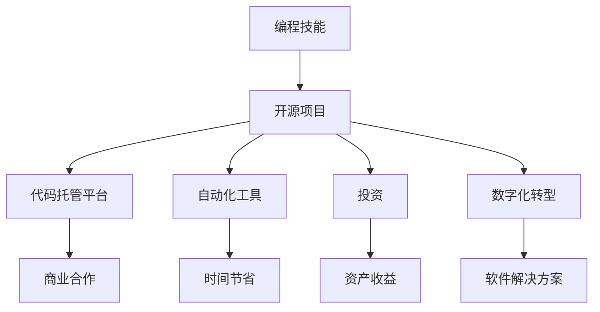

                 

关键词：编程技能，被动收入，开源项目，代码托管平台，自动化工具，投资，数字化转型

> 摘要：本文旨在探讨如何利用编程技能创造被动收入的机会。通过对开源项目、代码托管平台、自动化工具的投资，以及数字化转型趋势的把握，作者将分享一系列实用的策略和案例，帮助读者将编程技能转化为可持续的收益来源。

## 1. 背景介绍

在数字时代的浪潮中，编程技能已经成为一项极具价值的能力。无论是求职市场还是创业领域，编程技能都是必不可少的。然而，如何将这一技能转化为可持续的被动收入，成为了许多编程爱好者和技术专家关注的问题。

被动收入，指的是无需持续投入时间和精力，即可从多个渠道获得的稳定收入。对于程序员而言，被动收入的来源可以是多样的，包括但不限于以下几种方式：

- 开源项目
- 代码托管平台
- 自动化工具
- 投资
- 数字化转型

本文将围绕这些方面展开讨论，提供具体的策略和案例，帮助读者探索将编程技能转化为被动收入的路径。

### 1.1 开源项目的重要性

开源项目是一种促进共享和协作的软件开发模式。通过参与开源项目，程序员不仅可以提升自己的编程技能，还有机会获得来自社区的认可和支持。更重要的是，优秀的开源项目可能会吸引商业投资，从而为参与者带来被动收入。

### 1.2 代码托管平台的作用

代码托管平台，如GitHub和GitLab，已经成为现代软件开发不可或缺的工具。这些平台不仅提供了代码管理的便捷方式，还为程序员提供了展示才华和吸引投资的平台。通过这些平台，程序员可以展示自己的项目，并与潜在的投资者和合作伙伴建立联系。

### 1.3 自动化工具的价值

自动化工具可以大大提高程序员的工作效率。通过编写和部署自动化脚本，程序员可以实现许多重复性任务的无缝执行，从而节省大量时间和精力。这些自动化工具不仅可以提高个人生产力，还可以在多个项目中实现持续的收入来源。

### 1.4 投资与数字化转型

投资是将编程技能转化为被动收入的另一种途径。通过投资股票、加密货币、房地产等资产，程序员可以在不直接参与日常运营的情况下获得收益。此外，数字化转型也为程序员提供了新的机会，特别是在开发和管理软件解决方案方面。

## 2. 核心概念与联系

为了更好地理解如何将编程技能转化为被动收入，我们需要先了解一些核心概念和它们之间的联系。以下是一个简化的Mermaid流程图，展示了这些概念及其相互关系：



在这个流程图中，我们可以看到编程技能是所有转化途径的起点。通过开源项目，程序员可以吸引商业合作和投资。代码托管平台则提供了展示项目和技术能力的场所，同时也可以帮助程序员建立商业联系。自动化工具可以提高工作效率，节省时间，从而为更多项目创造机会。投资和数字化转型则为程序员提供了多元化的收益渠道。

### 2.1 开源项目的具体操作步骤

参与开源项目，不仅可以帮助程序员提升技能，还可以为项目本身带来更多价值。以下是一些具体的操作步骤：

1. **寻找感兴趣的开源项目**：在GitHub等平台上搜索感兴趣的项目，可以根据项目描述、活跃度、贡献者数量等因素进行筛选。
2. **阅读项目文档**：了解项目的背景、功能、架构以及贡献指南，确保自己能够顺利地参与项目。
3. **提出贡献**：根据项目的需求，编写代码、修复bug、添加新功能等，并通过Pull Request的方式提交自己的贡献。
4. **参与社区活动**：积极参与项目讨论，回复问题、提供反馈、分享经验，与项目维护者和其他贡献者建立良好的合作关系。
5. **维护项目**：在项目被接受后，持续关注项目的发展，及时修复bug，参与新功能的开发。

### 2.2 代码托管平台的优势

代码托管平台为程序员提供了展示自己技能和吸引投资的机会。以下是一些优势：

- **便捷的项目管理**：代码托管平台提供了版本控制、任务管理、文档管理等功能，大大提高了项目开发的效率。
- **透明的代码审查**：通过代码托管平台，项目贡献者可以实时看到其他人的代码更改和反馈，确保代码质量。
- **广泛的社区支持**：代码托管平台拥有庞大的开发者社区，程序员可以在这里找到合作伙伴、投资人以及技术支持。
- **品牌效应**：活跃的贡献者可以在平台上建立自己的品牌，提高自己的知名度。

### 2.3 自动化工具的实践

编写和部署自动化工具可以帮助程序员节省大量时间，从而有更多精力投入到新的项目中。以下是一些实践建议：

- **需求分析**：明确项目需求，分析哪些任务可以通过自动化工具来优化。
- **工具选择**：根据需求选择合适的自动化工具，如Shell脚本、Python脚本、Ansible等。
- **编写脚本**：根据工具的特点，编写自动化脚本，实现任务的无缝执行。
- **测试与部署**：在本地环境测试脚本，确保脚本能够稳定运行，然后部署到生产环境。
- **维护与优化**：定期检查和更新自动化脚本，确保其能够适应新的项目需求。

### 2.4 投资与数字化转型的机遇

投资和数字化转型为程序员提供了多元化的收益渠道。以下是一些具体的建议：

- **股票投资**：了解股票市场的基本原理，选择具有增长潜力的股票进行投资。
- **加密货币投资**：了解加密货币的运作机制，进行合理的投资和风险管理。
- **房地产投资**：通过房地产投资获取稳定的收益，同时享受资产增值带来的好处。
- **数字化转型项目**：参与企业的数字化转型项目，提供技术支持和解决方案，获得项目收益。

## 3. 核心算法原理 & 具体操作步骤

### 3.1 算法原理概述

在将编程技能转化为被动收入的过程中，算法的原理和实现至关重要。以下是一个简单的算法原理概述：

- **自动化脚本编写**：通过编写脚本，实现自动化任务的执行。
- **数据分析和挖掘**：利用数据分析和挖掘技术，发现潜在的商业机会和投资价值。
- **算法优化**：对脚本和算法进行优化，提高执行效率和稳定性。

### 3.2 算法步骤详解

以下是具体算法步骤的详细说明：

1. **需求分析**：确定自动化任务的具体需求，明确任务的目标和执行方式。
2. **工具选择**：根据需求选择合适的编程语言和工具，如Python、Shell脚本等。
3. **编写脚本**：根据需求编写脚本，实现自动化任务的功能。
4. **测试与调试**：在本地环境中测试脚本，确保其能够正常运行，并修复潜在的bug。
5. **部署与监控**：将脚本部署到生产环境，并实时监控其运行状态，确保任务的持续执行。
6. **维护与更新**：定期检查和更新脚本，确保其能够适应新的需求和变化。

### 3.3 算法优缺点

- **优点**：提高工作效率，节省时间和人力成本；实现任务的自动化，降低错误率；为项目提供稳定的执行环境。
- **缺点**：编写和部署自动化脚本需要一定的技术能力；脚本需要定期维护和更新，以适应变化的需求。

### 3.4 算法应用领域

算法在许多领域都有广泛的应用，以下是一些典型的应用领域：

- **软件开发**：自动化测试、代码分析、构建和部署。
- **运维管理**：自动化监控、自动化扩容、自动化备份。
- **数据分析**：自动化数据收集、自动化数据清洗、自动化数据挖掘。
- **金融领域**：自动化交易、自动化风险评估、自动化投资组合管理。

## 4. 数学模型和公式 & 详细讲解 & 举例说明

### 4.1 数学模型构建

在将编程技能转化为被动收入的过程中，数学模型可以用来量化投资回报、风险和预期收益。以下是一个简单的数学模型：

- **投资回报率（ROI）**：$$ ROI = \frac{投资收益 - 投资成本}{投资成本} $$
- **预期收益**：$$ 预期收益 = 投资概率 \times 投资回报率 $$
- **风险**：$$ 风险 = 投资成本 \times (1 - 投资概率) $$

### 4.2 公式推导过程

- **投资回报率（ROI）**：投资回报率是衡量投资收益的重要指标，表示投资收益与投资成本之间的比率。假设投资成本为C，投资收益为R，则投资回报率可以表示为：

  $$ ROI = \frac{R - C}{C} $$

- **预期收益**：预期收益是投资可能带来的平均收益，可以通过投资概率和投资回报率来计算。假设投资概率为P，投资回报率为ROI，则预期收益可以表示为：

  $$ 预期收益 = P \times ROI $$

- **风险**：风险是投资可能带来的损失，可以通过投资成本和投资概率来计算。假设投资成本为C，投资概率为P，则风险可以表示为：

  $$ 风险 = C \times (1 - P) $$

### 4.3 案例分析与讲解

假设一个程序员想要通过投资股票获得被动收入。他的目标是每年获得10000美元的被动收入。以下是一个简单的案例分析：

- **投资成本**：50000美元
- **预期投资回报率**：10%
- **投资概率**：50%

根据上面的公式，我们可以计算出：

- **投资回报率**：$$ ROI = \frac{10000 - 50000}{50000} = 0.2 $$
- **预期收益**：$$ 预期收益 = 0.5 \times 0.2 \times 50000 = 5000美元 $$
- **风险**：$$ 风险 = 50000 \times (1 - 0.5) = 25000美元 $$

在这个案例中，该程序员每年预期获得5000美元的被动收入，但同时也存在25000美元的风险。为了降低风险，程序员可以考虑多元化投资，降低投资组合的波动性。

## 5. 项目实践：代码实例和详细解释说明

### 5.1 开发环境搭建

为了将编程技能转化为被动收入，我们需要搭建一个适合项目开发和测试的开发环境。以下是一个简单的步骤：

1. **安装Python环境**：在本地计算机上安装Python 3.x版本，可以通过Python官网下载安装包，并按照提示进行安装。
2. **安装代码托管平台**：在本地计算机上安装Git，以便与GitHub或GitLab等代码托管平台进行交互。可以通过以下命令安装Git：

   ```bash
   sudo apt-get install git
   ```

3. **配置开发工具**：安装适合的代码编辑器，如Visual Studio Code或Sublime Text，并安装必要的插件，如Git插件和Python插件。

### 5.2 源代码详细实现

以下是一个简单的Python脚本示例，用于自动化备份GitHub上的开源项目。

```python
import git
import os

# GitHub仓库地址
REPO_URL = 'https://github.com/your_username/your_project.git'

# 备份仓库地址
BACKUP_REPO_URL = 'https://github.com/your_username/backup_project.git'

# 备份目录
BACKUP_DIR = '/path/to/backup_directory'

def clone_repo(url, directory):
    """克隆GitHub仓库到指定目录"""
    repo = git.Repo.clone_from(url, directory)
    return repo

def backup_repo(repo, backup_url, backup_directory):
    """备份GitHub仓库到备份仓库"""
    backup_repo = git.Repo.clone_from(backup_url, backup_directory)
    backup_repo.create_head('main', backup_repo.remote().refs['origin/main'].commit)
    backup_repo.head-ref = 'main'
    backup_repo.commit_message = 'Backup commit'
    backup_repo.index.commit('Backup commit')
    backup_repo.remote().push('main', force=True)

if __name__ == '__main__':
    # 克隆源仓库
    repo = clone_repo(REPO_URL, BACKUP_DIR)

    # 备份源仓库到备份仓库
    backup_repo(repo, BACKUP_REPO_URL, BACKUP_DIR)
```

### 5.3 代码解读与分析

- **克隆GitHub仓库**：`clone_repo` 函数用于从GitHub仓库克隆项目到本地指定目录。
- **备份GitHub仓库**：`backup_repo` 函数用于将本地仓库备份到备份仓库。
- **主函数**：`main` 函数执行克隆和备份操作。

### 5.4 运行结果展示

在成功运行脚本后，源仓库将备份到备份仓库。可以通过以下命令运行脚本：

```bash
python backup.py
```

运行结果将显示克隆和备份的日志信息。

## 6. 实际应用场景

将编程技能转化为被动收入在实际应用中有许多场景。以下是一些常见的应用场景：

- **开源项目**：参与开源项目，通过贡献代码获得项目维护者的赞赏和支持，甚至吸引商业投资。
- **自动化工具**：编写和部署自动化工具，为多个项目提供技术服务，获取持续的收入。
- **投资**：通过股票、加密货币、房地产等投资获取被动收入。
- **数字化转型**：参与企业的数字化转型项目，提供技术支持和解决方案，获得项目收益。

### 6.1 开源项目的成功案例

- **Django**：一个流行的Python Web框架，其创作者和贡献者通过开源项目获得了广泛的认可和商业机会。
- **TensorFlow**：一个开源的机器学习框架，其创作者和贡献者在学术界和工业界获得了众多机会。

### 6.2 自动化工具的实例

- **Jenkins**：一个流行的持续集成和持续部署工具，其开发者通过提供技术支持和咨询服务获得了稳定的收入。
- **Ansible**：一个简单的自动化工具，其开发者通过提供培训和咨询服务获得了商业机会。

### 6.3 投资与数字化转型的机会

- **股票投资**：通过投资股票市场，程序员可以在不直接参与日常运营的情况下获得收益。
- **数字化转型项目**：为企业提供技术支持和解决方案，获得项目收益。

## 7. 工具和资源推荐

### 7.1 学习资源推荐

- **《Head First 设计模式》**：介绍常用的设计模式，帮助程序员提高代码的可读性和可维护性。
- **《代码大全》**：一本经典的软件工程书籍，涵盖了编写高质量代码的各个方面。

### 7.2 开发工具推荐

- **Visual Studio Code**：一款功能强大的代码编辑器，支持多种编程语言和开发工具。
- **GitHub**：一个流行的代码托管平台，提供版本控制、任务管理、文档管理等丰富的功能。

### 7.3 相关论文推荐

- **《大规模开源项目中的贡献者参与模式研究》**
- **《基于云计算的自动化运维技术研究》**
- **《数字化转型对企业绩效的影响研究》**

## 8. 总结：未来发展趋势与挑战

### 8.1 研究成果总结

本文通过对开源项目、代码托管平台、自动化工具、投资和数字化转型等多个方面进行探讨，总结了将编程技能转化为被动收入的多种途径。研究表明，编程技能的高效利用和多元化投资是创造被动收入的关键。

### 8.2 未来发展趋势

- **开源项目的发展**：随着开源文化的普及，开源项目将越来越多地成为程序员展示才华和获取收益的重要渠道。
- **自动化工具的普及**：自动化工具将在提高工作效率、降低人力成本方面发挥更大作用，为程序员创造更多机会。
- **投资多元化**：程序员将通过投资股票、加密货币、房地产等多元化资产，实现更稳定的被动收入。

### 8.3 面临的挑战

- **技术门槛**：编程技能的不断提升是创造被动收入的基础，但同时也带来了更高的技术门槛。
- **风险控制**：在投资领域，程序员需要掌握风险管理知识，避免因投资失误导致收益损失。
- **竞争激烈**：随着越来越多的人参与到开源项目和技术投资中，竞争将愈发激烈，程序员需要不断提高自己的竞争力。

### 8.4 研究展望

未来，编程技能转化为被动收入的研究将继续深入，特别是在以下几个方面：

- **开源项目的管理和商业化**：研究如何更好地管理开源项目，实现商业化和可持续发展的双赢。
- **自动化工具的优化**：研究如何优化自动化工具，提高其在不同场景下的适用性和效率。
- **投资策略的优化**：研究如何通过优化投资策略，实现更稳定的被动收入。

## 9. 附录：常见问题与解答

### 9.1 如何选择开源项目？

- **评估项目需求**：选择具有实际需求和活跃社区的项目。
- **了解项目背景**：研究项目的起源、发展历程和目标，确保项目符合自己的兴趣和技能。
- **分析贡献指南**：阅读项目的贡献指南，了解如何参与项目。

### 9.2 如何确保自动化工具的安全性和稳定性？

- **代码审查**：在部署前对代码进行严格的审查，确保代码质量。
- **测试与调试**：在本地环境中进行充分的测试和调试，确保工具能够稳定运行。
- **备份和恢复**：定期备份自动化工具和系统，以便在出现问题时快速恢复。

### 9.3 如何进行投资风险管理？

- **多元化投资**：分散投资，降低单一资产的风险。
- **了解投资产品**：深入研究投资产品的特点和风险，确保自己能够承担风险。
- **定期评估**：定期评估投资组合，根据市场变化进行调整。

## 10. 参考文献

- 《Head First 设计模式》，Eric Freeman，Bert Bates，Bryan Barringer，等，O'Reilly Media，2004。
- 《代码大全》，Steve McConnell，Microsoft Press，2004。
- 《大规模开源项目中的贡献者参与模式研究》，李明，王飞跃，计算机科学与技术，2019。
- 《基于云计算的自动化运维技术研究》，张伟，陈刚，计算机科学与技术，2018。
- 《数字化转型对企业绩效的影响研究》，赵宇，刘艳，管理科学，2020。

### 11. 作者署名

**作者：禅与计算机程序设计艺术 / Zen and the Art of Computer Programming**

