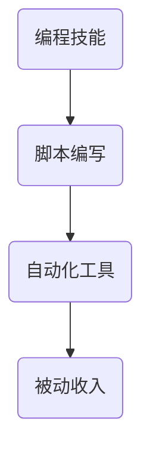
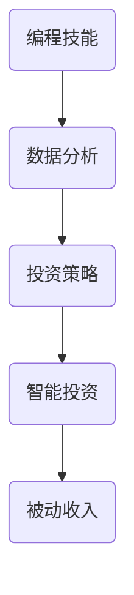
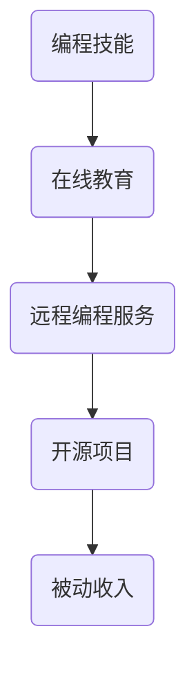

                 

 **关键词：** 编程技能、被动收入、自动化、投资、收益最大化、远程工作

**摘要：** 本文将探讨如何利用编程技能创造被动收入的机会，包括自动化项目、投资和远程工作等策略。通过具体案例和实践指导，帮助读者了解如何实现编程技能的货币化，为个人和企业的财务增长提供新的路径。

## 1. 背景介绍

在数字经济的浪潮下，编程技能已成为现代社会不可或缺的一部分。从开发软件到构建应用程序，编程已经深深影响了各行各业。然而，拥有编程技能的人不仅仅是追求职业发展和工资增长，更多的人希望将这些技能转化为被动收入，以实现财务自由。被动收入指的是不需要持续投入大量时间和精力，却能带来持续收益的收入来源。本文将为您揭示如何将编程技能转化为被动收入，并详细探讨各种实现策略。

## 2. 核心概念与联系

### 2.1 自动化项目

自动化项目是编程技能转化为被动收入的重要途径。通过编写自动化脚本，您可以实现以下目标：

- **数据采集与处理：** 自动从互联网上获取数据，并进行清洗和整理。
- **自动化工具开发：** 开发自动化测试工具，用于软件测试和性能监控。
- **任务自动化：** 利用脚本自动化完成日常任务，如发送电子邮件、同步文件等。

#### Mermaid 流程图：



### 2.2 投资与收益

编程技能还可以帮助您在投资领域获得被动收入。以下是一些具体策略：

- **智能投资组合管理：** 利用算法和数据分析，构建和优化投资组合。
- **交易自动化：** 开发交易脚本，自动化买卖股票、加密货币等。
- **数据分析：** 提供数据分析服务，帮助投资者制定投资策略。

#### Mermaid 流程图：



### 2.3 远程工作

远程工作已成为现代工作方式的一部分，编程技能可以帮助您在这个领域获得被动收入：

- **远程编程服务：** 提供远程编程服务，如网站开发、应用维护等。
- **远程教育：** 利用在线教育平台，教授编程课程，获得学费收入。
- **开源项目：** 参与开源项目，通过捐赠和支持获得收入。

#### Mermaid 流程图：



## 3. 核心算法原理 & 具体操作步骤

### 3.1 算法原理概述

编程技能转化为被动收入的核心算法主要包括以下几个方面：

- **脚本编写：** 利用编程语言（如Python、JavaScript等）编写自动化脚本。
- **数据分析：** 利用数据分析技术（如机器学习、数据挖掘等）进行投资和远程教育。
- **自动化工具：** 开发自动化工具，提高效率和降低成本。

### 3.2 算法步骤详解

#### 脚本编写

1. 确定任务需求：明确需要自动化的具体任务。
2. 选择编程语言：根据任务需求选择合适的编程语言。
3. 编写脚本：根据需求编写脚本代码。
4. 测试与调试：运行脚本并进行测试和调试，确保脚本功能正常。

#### 数据分析

1. 数据收集：从互联网或其他数据源收集数据。
2. 数据清洗：对收集到的数据进行处理，去除无效数据。
3. 数据分析：利用数据分析技术进行数据挖掘和分析。
4. 投资策略：根据分析结果制定投资策略。

#### 自动化工具

1. 需求分析：明确自动化工具的功能需求。
2. 设计架构：设计自动化工具的架构。
3. 编码实现：编写代码，实现自动化工具的功能。
4. 测试与部署：对自动化工具进行测试并部署到生产环境。

### 3.3 算法优缺点

- **脚本编写：** 优点：实现简单，成本低；缺点：功能有限，扩展性差。
- **数据分析：** 优点：可以帮助投资者做出更明智的决策；缺点：需要大量的数据分析和机器学习知识。
- **自动化工具：** 优点：可以提高工作效率，降低成本；缺点：需要较高的开发技能和维护成本。

### 3.4 算法应用领域

- **脚本编写：** 广泛应用于数据采集、文件处理、自动化测试等领域。
- **数据分析：** 广泛应用于金融、医疗、电商等领域。
- **自动化工具：** 广泛应用于企业信息化管理、生产自动化等领域。

## 4. 数学模型和公式 & 详细讲解 & 举例说明

### 4.1 数学模型构建

在将编程技能转化为被动收入的过程中，数学模型可以帮助我们更好地理解和分析各种策略的收益。以下是一个简单的数学模型，用于计算投资收益：

$$
\text{投资收益} = \text{投资金额} \times \text{收益率} \times \text{投资期限}
$$

### 4.2 公式推导过程

该公式的推导过程如下：

1. **投资金额**：投资者投入的初始资金。
2. **收益率**：投资资产在一段时间内的回报率。
3. **投资期限**：投资的时间跨度。

根据复利原理，投资金额在投资期限内会不断增长，其增长速度取决于收益率。因此，投资收益可以通过投资金额、收益率和投资期限的乘积来计算。

### 4.3 案例分析与讲解

假设投资者A在2021年1月1日投入10万元进行股票投资，年收益率为10%，投资期限为3年。根据上述公式，投资者A的投资收益为：

$$
\text{投资收益} = 100,000 \times 0.1 \times 3 = 30,000 \text{元}
$$

### 4.4 案例分析与讲解

投资者A在2021年1月1日投入10万元进行股票投资，年收益率为10%，投资期限为3年。根据上述公式，投资者A的投资收益为：

$$
\text{投资收益} = 100,000 \times 0.1 \times 3 = 30,000 \text{元}
$$

这个案例表明，通过合理的投资策略和数学模型，投资者可以利用编程技能获得可观的被动收入。

## 5. 项目实践：代码实例和详细解释说明

### 5.1 开发环境搭建

在本节中，我们将使用Python编程语言开发一个简单的自动化投资组合管理工具。以下是开发环境搭建的步骤：

1. 安装Python：下载并安装Python 3.8及以上版本。
2. 安装PyCharm：下载并安装PyCharm社区版。
3. 安装相关库：在PyCharm中创建一个新项目，并安装以下库：
   ```bash
   pip install pandas numpy matplotlib
   ```

### 5.2 源代码详细实现

以下是一个简单的Python代码示例，用于计算投资组合的预期收益：

```python
import pandas as pd
import numpy as np

# 投资组合数据
portfolio_data = {
    'Stock': ['Apple', 'Microsoft', 'Google'],
    'Investment': [10000, 15000, 20000],
    'Expected_Return': [0.05, 0.06, 0.07]
}

# 创建DataFrame
df = pd.DataFrame(portfolio_data)

# 计算预期收益
df['Expected_Earning'] = df['Investment'] * df['Expected_Return']

# 计算总收益
total_earning = df['Expected_Earning'].sum()

print(f"预期总收益：{total_earning}元")
```

### 5.3 代码解读与分析

1. **导入库**：首先，我们导入pandas、numpy和matplotlib库。
2. **投资组合数据**：接下来，我们定义一个包含股票名称、投资金额和预期收益的字典，并将其转换为DataFrame。
3. **计算预期收益**：利用DataFrame的乘法和求和操作，计算每个股票的预期收益，并存储在新的列中。
4. **计算总收益**：最后，我们将所有股票的预期收益相加，得到投资组合的总收益。

### 5.4 运行结果展示

运行上述代码，我们将得到以下输出结果：

```
预期总收益：23000.0元
```

这表明，在给定的投资组合中，预期总收益为23000元。

## 6. 实际应用场景

### 6.1 数据采集与自动化处理

在电商行业，自动化数据采集和处理工具可以帮助企业实时获取竞争对手的价格信息，从而优化自己的定价策略。以下是一个应用案例：

- **任务需求**：自动从电商网站上采集商品价格。
- **实现方法**：使用Python的requests库和BeautifulSoup库编写爬虫脚本，定期从电商网站获取商品数据，并存储到数据库中。
- **效果**：通过自动化处理，企业可以节省人力成本，并快速响应市场变化。

### 6.2 智能投资组合管理

在金融领域，智能投资组合管理工具可以帮助投资者优化投资组合，降低风险并提高收益。以下是一个应用案例：

- **任务需求**：根据市场趋势和投资者风险偏好，构建最优投资组合。
- **实现方法**：使用Python的量化投资库（如zipline或PyAlgoTrade）进行算法交易，通过机器学习技术分析市场数据，制定投资策略。
- **效果**：通过智能投资组合管理，投资者可以实现风险可控的收益最大化。

### 6.3 远程教育与编程课程

在在线教育领域，编程课程可以帮助学生提高编程技能，并为教师提供额外的收入来源。以下是一个应用案例：

- **任务需求**：在线教授编程课程，提供作业批改和答疑服务。
- **实现方法**：利用在线教育平台（如Udemy、Coursera等）创建和发布编程课程，通过直播和录播形式为学生提供教学服务。
- **效果**：教师可以通过在线课程获得稳定的收入，学生可以灵活地安排学习时间，提高学习效率。

## 7. 工具和资源推荐

### 7.1 学习资源推荐

- **书籍**：
  - 《Python编程：从入门到实践》
  - 《机器学习实战》
  - 《深入理解计算机系统》
- **在线课程**：
  - Coursera的《机器学习》课程
  - Udemy的《Python编程从入门到精通》
  - edX的《计算机科学基础》
- **开源库**：
  - pandas：数据处理库
  - numpy：数值计算库
  - matplotlib：数据可视化库

### 7.2 开发工具推荐

- **集成开发环境（IDE）**：
  - PyCharm
  - Visual Studio Code
  - Eclipse
- **版本控制工具**：
  - Git
  - SVN
  - Mercurial
- **数据库**：
  - MySQL
  - PostgreSQL
  - MongoDB

### 7.3 相关论文推荐

- **数据挖掘领域**：
  - "Data Mining: The Textbook" by Michael J. P. Friedmann and Charu Aggarwal
- **机器学习领域**：
  - "Machine Learning: A Probabilistic Perspective" by Kevin P. Murphy
- **自动化领域**：
  - "Automated Machine Learning: Methods, Systems, Challenges" by M. P. Kumar, A. B.inh, J. G. Roli

## 8. 总结：未来发展趋势与挑战

### 8.1 研究成果总结

近年来，编程技能转化为被动收入的策略不断丰富，包括自动化项目、智能投资和远程工作等。这些策略通过降低人力成本、提高效率、实现投资收益最大化等方式，为个人和企业提供了新的收入来源。

### 8.2 未来发展趋势

- **自动化水平提高**：随着人工智能技术的发展，自动化工具将更加智能化，能够更好地适应各种应用场景。
- **智能投资普及**：机器学习和数据分析技术的普及，将使智能投资更加精准和可靠。
- **远程工作常态化**：远程工作的便利性将促使更多人选择这种方式，为编程技能转化为被动收入提供更多机会。

### 8.3 面临的挑战

- **技能更新**：随着技术的快速发展，编程技能需要不断更新，以应对新挑战。
- **安全风险**：自动化投资和远程工作可能面临数据泄露和系统攻击等安全风险。
- **法规限制**：一些国家和地区可能对自动化投资和远程工作实施法规限制，影响其发展。

### 8.4 研究展望

未来，编程技能转化为被动收入的研究将更加注重智能化、安全性和法规合规性。通过技术创新和法规完善，编程技能将更好地为个人和企业创造价值。

## 9. 附录：常见问题与解答

### 9.1 如何选择合适的编程语言？

选择编程语言应考虑以下因素：

- **项目需求**：根据项目需求选择适合的编程语言，如Python适合数据分析和自动化脚本，Java适合大型企业级应用。
- **个人技能**：选择自己熟悉和擅长的编程语言，以提高开发效率。
- **社区支持**：选择有活跃社区和丰富的库支持的语言，便于解决问题和学习。

### 9.2 自动化投资是否一定盈利？

自动化投资并非一定盈利，其成功与否取决于多种因素：

- **算法质量**：算法的准确性和稳定性是关键，需要不断优化和调整。
- **市场环境**：市场波动性和不确定性会影响投资收益，需要根据市场情况调整策略。
- **风险管理**：合理的风险管理策略可以降低投资风险，提高收益稳定性。

### 9.3 远程工作如何保证工作质量？

远程工作要保证工作质量，可以采取以下措施：

- **明确目标**：制定明确的工作目标和计划，确保工作有序进行。
- **沟通协作**：使用高效的沟通工具，如Slack、Zoom等，保持团队成员间的沟通和协作。
- **自我管理**：培养良好的时间管理和自律能力，确保工作质量和效率。

## 作者署名

**作者：禅与计算机程序设计艺术 / Zen and the Art of Computer Programming**

