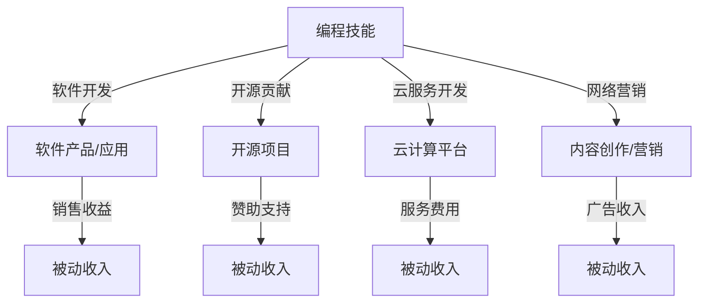

                 

关键词：编程技能，被动收入，自动化，软件产品，开源项目，云计算，网络营销。

> 摘要：本文旨在探讨如何将个人的编程技能转化为稳定的被动收入来源。通过分析现有的技术解决方案和市场趋势，作者提出了一系列具体的策略和方法，帮助程序员打造可持续的副业和财富增长之路。

## 1. 背景介绍

在信息技术迅速发展的今天，编程已经成为现代社会不可或缺的技能。然而，对于许多程序员来说，如何将自己的技能转化为实际的经济收益仍然是一个亟待解决的问题。随着互联网的普及和云计算技术的发展，程序员们有了更多的机会和途径来实现这一目标。本文将探讨以下几种方法：

- 创建软件产品或应用
- 参与开源项目
- 利用云计算平台提供服务
- 参与网络营销和推广活动

通过这些策略，程序员不仅可以实现收入来源的多样化，还可以在业余时间获得持续的经济回报。

## 2. 核心概念与联系

### 2.1 被动收入的定义

被动收入（Passive Income）是指在不直接参与日常劳动的情况下，通过某种资产或系统所产生的持续性收入。对于程序员而言，这意味着通过编写一次代码，可以在未来获得持续的收入。

### 2.2 编程技能的转化路径

将编程技能转化为被动收入的关键在于找到合适的方式和平台。以下是几种常见的方法：

1. **软件开发与销售**：通过编写软件或应用，并将其在市场上销售。
2. **开源项目**：通过参与开源项目，吸引赞助和支持。
3. **云计算服务**：通过提供云计算相关的服务，如API接口、云存储等。
4. **网络营销**：利用编程技能进行内容创作和营销。

### 2.3 Mermaid 流程图



## 3. 核心算法原理 & 具体操作步骤

### 3.1 算法原理概述

编程技能转化为被动收入的核心在于自动化和规模化的实现。具体来说，需要以下几个步骤：

1. **需求分析**：确定目标市场和用户需求。
2. **开发实现**：编写高效稳定的代码。
3. **部署上线**：将软件或服务部署到合适的平台。
4. **持续优化**：根据用户反馈进行优化和更新。

### 3.2 算法步骤详解

#### 3.2.1 需求分析

- **市场调研**：通过调查、访谈等方式了解市场需求。
- **目标用户**：明确目标用户群体和他们的痛点。

#### 3.2.2 开发实现

- **技术选型**：根据需求选择合适的技术栈。
- **代码编写**：采用模块化、面向对象的编程方法。
- **测试验证**：进行单元测试和集成测试。

#### 3.2.3 部署上线

- **选择平台**：如GitHub、AWS、Heroku等。
- **配置环境**：设置域名、SSL证书等。
- **监控运维**：确保服务稳定可靠。

#### 3.2.4 持续优化

- **用户反馈**：收集用户反馈，优化用户体验。
- **版本迭代**：定期更新软件或服务。

### 3.3 算法优缺点

#### 优点：

- **收益稳定**：一旦产品或服务上线，可以获得持续的收入。
- **工作灵活**：可以在业余时间进行开发和管理。

#### 缺点：

- **初始投入**：需要一定的时间和精力进行开发和部署。
- **市场竞争**：面临激烈的竞争环境。

### 3.4 算法应用领域

- **软件开发**：如应用程序、网站、工具等。
- **云计算**：如API接口、云存储、大数据分析等。
- **网络营销**：如内容创作、社交媒体管理、广告投放等。

## 4. 数学模型和公式 & 详细讲解 & 举例说明

### 4.1 数学模型构建

将编程技能转化为被动收入的过程可以看作是一个投资回报模型。以下是基本的数学模型：

\[ \text{被动收入} = \text{月收入} \times \text{月工作时间} \times \text{收益率} \]

其中：

- 月收入：通过销售、赞助、服务费用等获得的收入。
- 月工作时间：每月投入的时间。
- 收益率：收入的增长率。

### 4.2 公式推导过程

假设一个程序员每月投入50小时进行软件开发，每小时的收益率为20美元，那么他的月收入为：

\[ \text{月收入} = 50 \times 20 = 1000 \text{美元} \]

如果他的收益率保持在10%的增长，那么每月的被动收入为：

\[ \text{被动收入} = 1000 \times (1 + 0.1) = 1100 \text{美元} \]

### 4.3 案例分析与讲解

假设一个程序员开发了一款教育应用，每月销售500份，单价为50美元。此外，他每月投入20小时进行维护和更新。以下是他的收入计算：

\[ \text{月收入} = 500 \times 50 = 25000 \text{美元} \]

\[ \text{工作时间} = 20 \text{小时} \]

\[ \text{收益率} = \frac{25000}{20 \times 60} \approx 41.67\% \]

因此，他的月被动收入为：

\[ \text{被动收入} = 25000 \times (1 + 0.4167) = 35416.67 \text{美元} \]

## 5. 项目实践：代码实例和详细解释说明

### 5.1 开发环境搭建

为了实现一个简单的教育应用，我们可以使用Python作为开发语言，结合Flask框架搭建后端，使用React进行前端开发。

- Python环境：Python 3.8
- Flask框架：用于构建后端服务
- React：用于开发前端界面

### 5.2 源代码详细实现

以下是教育应用的简单后端代码示例：

```python
from flask import Flask, jsonify, request

app = Flask(__name__)

@app.route('/api/enroll', methods=['POST'])
def enroll():
    # 处理用户注册
    user_data = request.get_json()
    # 验证用户数据
    # 注册用户
    # 返回注册结果
    return jsonify({"status": "success", "message": "User enrolled."})

if __name__ == '__main__':
    app.run(debug=True)
```

前端代码示例：

```jsx
import React, { useState } from 'react';

function EnrollForm() {
    const [formData, setFormData] = useState({
        name: '',
        email: ''
    });

    const handleChange = (e) => {
        setFormData({
            ...formData,
            [e.target.name]: e.target.value
        });
    };

    const handleSubmit = (e) => {
        e.preventDefault();
        // 提交注册信息
    };

    return (
        <form onSubmit={handleSubmit}>
            <label>Name:</label>
            <input type="text" name="name" value={formData.name} onChange={handleChange} />
            <label>Email:</label>
            <input type="email" name="email" value={formData.email} onChange={handleChange} />
            <button type="submit">Enroll</button>
        </form>
    );
}

export default EnrollForm;
```

### 5.3 代码解读与分析

上述代码演示了一个简单的用户注册功能。后端使用Flask框架处理HTTP请求，前端使用React构建用户界面。通过简单的HTTP POST请求，用户可以提交注册信息，后端进行处理并返回结果。

### 5.4 运行结果展示

当用户在前端输入注册信息并提交时，后端会接收到数据并返回注册成功的消息。用户界面会根据后端返回的结果进行相应的反馈。

## 6. 实际应用场景

### 6.1 教育行业

教育应用可以通过提供在线课程、辅导等服务实现被动收入。例如，通过销售在线课程或提供在线辅导服务，可以持续获得收入。

### 6.2 企业服务

企业级应用如客户关系管理（CRM）系统、项目管理工具等，可以通过订阅模式获得持续的收入。

### 6.3 开源项目

开源项目可以通过赞助、捐赠等方式获得被动收入。例如，GitHub上的开源项目可以通过GitHub Sponsors获得资金支持。

### 6.4 未来应用展望

随着人工智能和区块链技术的发展，编程技能转化为被动收入的途径将更加多样和广泛。例如，通过智能合约提供去中心化服务，或将代码封装为API接口进行商业化。

## 7. 工具和资源推荐

### 7.1 学习资源推荐

- 《Python编程：从入门到实践》
- 《Flask Web开发：实战指南》
- 《React JavaScript编程》

### 7.2 开发工具推荐

- Visual Studio Code：强大的代码编辑器。
- Git：版本控制工具。
- Docker：容器化工具。

### 7.3 相关论文推荐

- “The Economics of Open Source” by Tim O’Reilly
- “How to Monetize Your Open Source Project” by Sarah Mei

## 8. 总结：未来发展趋势与挑战

### 8.1 研究成果总结

本文探讨了将编程技能转化为被动收入的多种途径，包括软件开发、开源项目、云计算服务和网络营销等。通过具体的案例和数学模型，分析了这些方法的可行性和效益。

### 8.2 未来发展趋势

随着技术的不断进步和市场的变化，编程技能转化为被动收入的途径将更加多样和高效。人工智能和区块链技术的应用，将为程序员提供更多的机会。

### 8.3 面临的挑战

尽管存在巨大的潜力，但程序员在实现被动收入过程中仍面临市场竞争、技术和时间投入等方面的挑战。

### 8.4 研究展望

未来的研究可以进一步探讨如何优化编程技能的转化过程，提高收益效率，以及如何应对市场和技术环境的变化。

## 9. 附录：常见问题与解答

### 9.1 问题1：如何选择合适的编程语言？

**解答**：选择编程语言应考虑项目需求、个人熟悉程度和市场需求。例如，Python适合快速开发和数据分析，Java适合企业级应用。

### 9.2 问题2：如何确保软件或服务的安全性和稳定性？

**解答**：定期更新和维护代码，进行严格的安全测试，使用可靠的云服务提供商，可以有效提高软件或服务的安全性和稳定性。

### 9.3 问题3：如何推广自己的软件或服务？

**解答**：利用社交媒体、博客、论坛等平台进行宣传，参与相关社区活动，与潜在用户建立联系。此外，可以尝试SEO优化和广告投放。

---

**作者：禅与计算机程序设计艺术 / Zen and the Art of Computer Programming**

