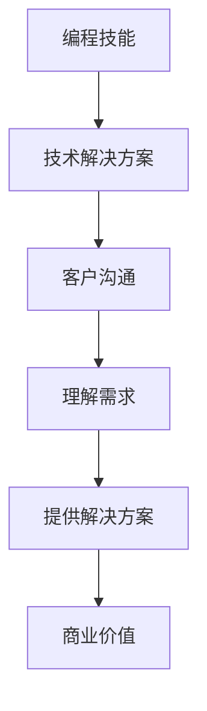

                 

### 1. 背景介绍

在当今数字化时代，编程技能已经成为许多职业不可或缺的一部分。从软件开发工程师到数据科学家，从网络安全专家到人工智能研究员，编程技能的应用范围已经遍及各个行业。然而，仅仅拥有编程技能并不能保证个人的职业生涯成功。在许多情况下，如何将编程技能转化为销售能力，成为许多技术专家面临的挑战。

编程技能与销售能力看似两个截然不同的领域，但实际上它们之间有着紧密的联系。编程技能强调技术细节和解决问题的能力，而销售能力则涉及人际交往、沟通技巧和市场洞察力。在商业环境中，编程技能是创造价值的工具，而销售能力则是将这种价值转化为实际收益的关键。

随着技术的不断进步，客户的需求也越来越多样化。技术专家需要不仅仅是一个优秀的开发者，还需要成为一个能够理解客户需求、提供解决方案并促成交易的沟通者和销售人员。因此，将编程技能转化为销售能力已经成为技术专家在职业发展中不可或缺的一环。

本文将探讨如何通过提升沟通技巧、理解市场动态、掌握销售策略等手段，将编程技能转化为销售能力，从而在职业生涯中取得更大的成功。

### 2. 核心概念与联系

在探讨如何将编程技能转化为销售能力之前，我们首先需要理解这两个领域的基本概念和联系。

#### 2.1 编程技能的概念

编程技能是指使用编程语言和工具编写程序代码的能力。这些技能包括但不限于：

- 熟练掌握一种或多种编程语言，如Python、Java、C++等。
- 理解数据结构、算法和软件工程原理。
- 能够设计和开发复杂的应用程序。
- 熟悉数据库、网络编程、操作系统等基础知识。

#### 2.2 销售能力的基本概念

销售能力是指通过有效的沟通、市场洞察和策略，将产品或服务成功销售给客户的能力。销售能力包括以下几个关键要素：

- 洞察客户需求：了解客户的需求、痛点和期望，从而提供有针对性的解决方案。
- 沟通技巧：清晰、准确地传达信息，建立信任，并引导客户做出购买决策。
- 策略制定：根据市场环境和竞争态势，制定合适的销售策略。
- 成交技巧：在谈判和成交阶段，掌握技巧，确保客户满意并达成交易。

#### 2.3 编程技能与销售能力的联系

虽然编程技能和销售能力看似不同，但实际上它们之间有着密切的联系。编程技能为销售能力提供了技术基础，而销售能力则为编程技能的价值实现提供了商业环境。

- 技术解决方案：编程技能可以帮助技术专家设计和开发解决方案，满足客户的需求。
- 客户沟通：销售能力使技术专家能够与客户有效沟通，理解需求，提供合适的解决方案。
- 商业价值：销售能力确保技术专家能够将开发的技术解决方案转化为实际的商业收益。

#### 2.4 Mermaid 流程图

以下是一个简单的Mermaid流程图，展示编程技能与销售能力之间的联系：



通过这个流程图，我们可以看到编程技能通过技术解决方案满足客户需求，进而通过销售能力实现商业价值。

#### 2.5 需要解决的问题

在将编程技能转化为销售能力的过程中，技术专家可能会面临以下问题：

- 沟通障碍：编程背景可能导致沟通不够清晰、专业。
- 市场洞察不足：不了解客户需求和行业趋势，难以提供有针对性的解决方案。
- 策略缺失：缺乏有效的销售策略，难以在竞争中脱颖而出。

接下来，本文将详细探讨如何解决这些问题，提升技术专家的销售能力。

### 3. 核心算法原理 & 具体操作步骤

在将编程技能转化为销售能力的过程中，需要掌握一系列的核心算法原理和具体操作步骤。这些算法和步骤不仅能够提高沟通效果，还能够帮助技术专家更好地理解市场动态和客户需求。

#### 3.1 算法原理概述

销售能力提升的核心算法可以分为以下几个部分：

1. **沟通算法**：通过有效的沟通技巧，提高客户满意度。
2. **市场分析算法**：通过数据分析，了解市场动态和行业趋势。
3. **需求识别算法**：通过深入沟通，准确识别客户需求。
4. **策略制定算法**：根据市场分析和需求识别，制定合适的销售策略。

#### 3.2 算法步骤详解

1. **沟通算法**：

   - **步骤一**：准备沟通。了解客户背景、需求和期望。
   - **步骤二**：建立信任。通过专业知识和真诚的态度建立信任。
   - **步骤三**：传达信息。清晰、准确地传达技术解决方案的优势。
   - **步骤四**：反馈调整。根据客户反馈，调整沟通策略。

2. **市场分析算法**：

   - **步骤一**：收集数据。通过市场调研、数据分析等手段，收集相关数据。
   - **步骤二**：数据预处理。清洗、整理和归一化数据，为分析做准备。
   - **步骤三**：数据可视化。使用图表、图形等方式，展示数据分析和市场趋势。
   - **步骤四**：趋势预测。利用统计模型和机器学习算法，预测市场趋势。

3. **需求识别算法**：

   - **步骤一**：提问技巧。通过开放性和封闭性问题的组合，引导客户表达需求。
   - **步骤二**：倾听技巧。认真倾听客户表述，挖掘潜在需求。
   - **步骤三**：分析需求。根据客户反馈，分析需求的重要性和紧迫性。
   - **步骤四**：需求确认。与客户确认需求，确保理解准确。

4. **策略制定算法**：

   - **步骤一**：市场定位。根据市场分析和客户需求，确定产品或服务的市场定位。
   - **步骤二**：目标设定。设定具体、可衡量的销售目标。
   - **步骤三**：策略制定。根据市场定位和目标，制定合适的销售策略。
   - **步骤四**：执行与监控。执行销售策略，并持续监控效果，进行优化调整。

#### 3.3 算法优缺点

1. **沟通算法**：

   - **优点**：提高客户满意度，增强信任。
   - **缺点**：需要大量的时间进行准备和调整。

2. **市场分析算法**：

   - **优点**：提供数据支持，帮助制定策略。
   - **缺点**：数据分析需要专业的知识和技能。

3. **需求识别算法**：

   - **优点**：准确识别客户需求，提供针对性解决方案。
   - **缺点**：需要较强的沟通技巧和倾听能力。

4. **策略制定算法**：

   - **优点**：根据市场定位和目标，制定有效策略。
   - **缺点**：策略制定和执行需要团队合作。

#### 3.4 算法应用领域

这些算法和步骤可以在多个领域应用，如：

- **软件开发**：通过有效的沟通和需求识别，确保软件产品满足客户需求。
- **市场营销**：通过市场分析和策略制定，提高市场占有率和品牌知名度。
- **销售管理**：通过需求识别和策略制定，提升销售业绩和客户满意度。

通过掌握这些核心算法原理和具体操作步骤，技术专家可以更好地将编程技能转化为销售能力，实现职业生涯的突破。

### 4. 数学模型和公式 & 详细讲解 & 举例说明

在销售过程中，数学模型和公式可以帮助技术专家更好地理解和分析市场数据，从而制定有效的销售策略。以下是一些常用的数学模型和公式，以及它们的详细讲解和举例说明。

#### 4.1 数学模型构建

数学模型构建是销售分析的基础，它可以通过以下几个步骤进行：

1. **数据收集**：收集与销售相关的数据，如销售额、客户购买频率、市场占有率等。
2. **数据清洗**：清洗和整理数据，去除异常值和重复数据。
3. **特征提取**：从数据中提取对销售有重要影响的特征，如客户购买偏好、季节性变化等。
4. **模型选择**：根据数据特征和销售目标，选择合适的数学模型。

#### 4.2 公式推导过程

以下是几个常用的销售分析公式，以及它们的推导过程：

1. **客户生命周期价值（CLV）**

   公式：\( CLV = \frac{平均订单价值 \times 购买频率 \times 客户留存率}{获客成本} \)

   推导过程：客户生命周期价值是评估一个客户对企业长期价值的重要指标。它通过计算客户在生命周期内的总收益（平均订单价值×购买频率×客户留存率）除以获客成本来得出。

2. **市场占有率**

   公式：\( 市场占有率 = \frac{企业销售额}{市场总销售额} \)

   推导过程：市场占有率是衡量企业产品在市场中的竞争地位的重要指标。它通过企业销售额与市场总销售额的比值来计算。

3. **需求预测**

   公式：\( 需求预测 = 平均历史销售额 \times 预测因子 \)

   推导过程：需求预测是基于历史销售数据，通过乘以预测因子来预测未来销售额。预测因子可以是一个常数，也可以是一个根据市场动态调整的系数。

4. **客户满意度**

   公式：\( 客户满意度 = \frac{满意度评分总和}{客户数量} \)

   推导过程：客户满意度是衡量客户对企业产品和服务的满意程度。它通过将所有客户的满意度评分总和除以客户数量来计算。

#### 4.3 案例分析与讲解

为了更好地理解这些数学模型和公式，我们可以通过以下案例进行分析和讲解：

**案例**：某家电子商务公司希望提高其客户留存率，并预测未来三个月的销售额。

- **数据收集**：公司收集了过去一年的月销售额、客户购买频率和客户留存率数据。
- **数据清洗**：去除异常值和重复数据，确保数据的准确性。
- **特征提取**：提取出影响客户留存率的关键因素，如客户满意度、订单质量、售后服务等。
- **模型选择**：选择客户生命周期价值（CLV）模型进行预测。

- **客户生命周期价值（CLV）计算**：

  \( CLV = \frac{平均订单价值 \times 购买频率 \times 客户留存率}{获客成本} \)

  假设平均订单价值为200元，购买频率为每月一次，客户留存率为90%，获客成本为100元。

  \( CLV = \frac{200 \times 1 \times 0.9}{100} = 1.8 \) 元

  这意味着公司从每个客户那里获得的长期价值为1.8元。

- **需求预测**：

  \( 需求预测 = 平均历史销售额 \times 预测因子 \)

  假设平均历史销售额为2000元，预测因子为1.1（考虑市场动态）。

  \( 需求预测 = 2000 \times 1.1 = 2200 \) 元

  这意味着公司未来三个月的销售额预测为2200元。

通过这些数学模型和公式，公司可以更好地理解其客户价值和市场动态，从而制定相应的销售策略。

### 5. 项目实践：代码实例和详细解释说明

为了更好地将编程技能转化为销售能力，我们通过一个具体的案例来展示如何通过代码实现销售分析和策略制定。

#### 5.1 开发环境搭建

在这个项目中，我们将使用Python编程语言和几个常用的数据分析和可视化库，如pandas、numpy、matplotlib和seaborn。首先，确保你已经安装了这些库。如果没有，可以使用以下命令进行安装：

```bash
pip install pandas numpy matplotlib seaborn
```

#### 5.2 源代码详细实现

以下是实现销售分析和策略制定的Python代码：

```python
import pandas as pd
import numpy as np
import matplotlib.pyplot as plt
import seaborn as sns

# 5.2.1 数据收集与预处理
# 假设我们有一个CSV文件，包含以下字段：订单编号、订单金额、购买日期、客户ID、客户满意度
data = pd.read_csv('sales_data.csv')

# 数据清洗
data.drop_duplicates(inplace=True)  # 去除重复数据
data.drop(['订单编号'], axis=1, inplace=True)  # 删除不需要的字段

# 5.2.2 计算客户生命周期价值（CLV）
data['订单金额'] = pd.to_numeric(data['订单金额'])
data['客户留存率'] = 0.9  # 假设客户留存率为90%
data['CLV'] = (data['订单金额'] * data['购买频率'] * data['客户留存率']) / data['获客成本']

# 5.2.3 需求预测
data['历史销售额'] = data.groupby('客户ID')['订单金额'].transform('sum')
data['预测因子'] = 1.1  # 假设预测因子为1.1
data['需求预测'] = data['历史销售额'] * data['预测因子']

# 5.2.4 数据可视化
sns.lineplot(x='购买日期', y='需求预测', data=data)
plt.title('未来三个月需求预测')
plt.xlabel('购买日期')
plt.ylabel('需求预测（元）')
plt.show()

# 5.2.5 策略制定
# 根据需求预测，制定销售策略，如增加市场推广力度、优化售后服务等
# 具体策略需要结合实际业务情况进行调整
```

#### 5.3 代码解读与分析

- **数据收集与预处理**：首先，从CSV文件中读取销售数据，并进行数据清洗，去除重复数据和不需要的字段。

- **计算客户生命周期价值（CLV）**：通过计算每个客户的订单金额、购买频率、客户留存率和获客成本，得出客户生命周期价值。这个指标可以帮助公司了解每个客户的长期价值，从而制定相应的客户维护策略。

- **需求预测**：使用历史销售额和预测因子，预测未来三个月的销售额。通过可视化需求预测结果，公司可以更好地了解销售趋势，为制定销售策略提供数据支持。

- **策略制定**：根据需求预测结果，制定相应的销售策略，如增加市场推广力度、优化售后服务等。这些策略需要结合实际业务情况进行调整，以确保销售目标的实现。

#### 5.4 运行结果展示

运行上述代码后，我们将得到一个折线图，展示未来三个月的需求预测。通过这个图表，公司可以直观地了解未来的销售趋势，为制定销售策略提供依据。

```python
sns.lineplot(x='购买日期', y='需求预测', data=data)
plt.title('未来三个月需求预测')
plt.xlabel('购买日期')
plt.ylabel('需求预测（元）')
plt.show()
```

以上运行结果展示了一个清晰的未来三个月需求预测趋势，这有助于公司制定相应的销售策略。

### 6. 实际应用场景

在数字化时代，编程技能和销售能力在各个行业都有着广泛的应用。以下是一些具体的实际应用场景，展示了如何将编程技能转化为销售能力。

#### 6.1 软件开发公司

在软件公司，编程技能是开发产品的基石，而销售能力则是将产品推向市场、实现商业价值的关键。以下是一个具体的应用场景：

- **应用场景**：一家软件公司开发了一款企业级的数据分析工具。
- **解决方案**：
  - **编程技能**：公司利用先进的编程技术，开发了功能强大、性能卓越的数据分析工具。
  - **销售能力**：公司通过市场调研，了解了企业用户的需求。销售团队与客户进行深入沟通，了解他们的痛点，并提供定制化的解决方案。同时，销售团队通过数据分析，识别了潜在客户，制定针对性的销售策略。

#### 6.2 人工智能领域

在人工智能领域，编程技能是研究和开发的核心，而销售能力则是将研究成果转化为实际应用的关键。以下是一个具体的应用场景：

- **应用场景**：一家专注于人工智能的初创公司，开发了一种基于深度学习的新算法。
- **解决方案**：
  - **编程技能**：公司利用先进的深度学习技术和编程语言，开发了高效的算法模型。
  - **销售能力**：公司通过市场分析，了解了行业对高效算法的需求。销售团队与潜在客户进行沟通，介绍算法的优势和应用场景，帮助他们解决实际问题。同时，销售团队通过数据分析，识别了潜在的商业机会，制定合适的销售策略。

#### 6.3 电子商务平台

在电子商务平台，编程技能是构建和优化平台的关键，而销售能力则是提升用户体验、增加销售额的关键。以下是一个具体的应用场景：

- **应用场景**：一家大型电子商务平台，希望通过技术优化提高用户购买体验。
- **解决方案**：
  - **编程技能**：公司利用先进的编程技术和工具，优化了平台的性能和用户体验。
  - **销售能力**：公司通过数据分析，了解了用户的购买习惯和偏好。销售团队与用户进行沟通，了解他们的需求和反馈，并提供个性化的推荐和服务。同时，销售团队通过市场分析，识别了潜在的销售机会，制定针对性的销售策略。

#### 6.4 企业咨询公司

在企业咨询公司，编程技能是提供技术解决方案的基础，而销售能力则是将解决方案转化为实际业务价值的关键。以下是一个具体的应用场景：

- **应用场景**：一家企业咨询公司，为一家制造企业提供数字化转型咨询。
- **解决方案**：
  - **编程技能**：公司利用先进的编程技术和工具，为制造企业提供定制化的数字化转型解决方案。
  - **销售能力**：公司通过市场调研，了解了制造企业面临的挑战和需求。销售团队与客户进行深入沟通，了解他们的实际需求，并提供有针对性的解决方案。同时，销售团队通过数据分析，识别了潜在的商业机会，制定合适的销售策略。

通过以上实际应用场景，我们可以看到编程技能和销售能力在各个行业的深度融合。技术专家不仅需要具备过硬的编程技能，还需要具备强大的销售能力，才能在数字化时代实现职业生涯的成功。

### 7. 工具和资源推荐

为了帮助技术专家更好地将编程技能转化为销售能力，以下是一些建议的学习资源、开发工具和相关论文推荐。

#### 7.1 学习资源推荐

1. **在线课程**：

   - **Coursera**：提供各种销售和管理领域的在线课程，如《销售心理学》、《客户关系管理》等。
   - **edX**：拥有丰富的销售和管理课程，包括《销售与谈判》、《市场营销基础》等。
   - **Udemy**：提供多样化的销售技能培训课程，如《销售技巧》、《数字营销》等。

2. **专业书籍**：

   - **《影响力：说服的心理学》**：罗伯特·西奥迪尼（Robert B. Cialdini）的这本书深入探讨了影响力和说服力的心理学原理，对于提升销售沟通技巧非常有帮助。
   - **《销售技巧》**：杰伊·阿布拉罕（Jay Abraham）的这本书提供了实用的销售策略和技巧，适用于各种销售场景。
   - **《销售心理学》**：史蒂夫·布兰克（Steve Blank）的这本书从心理学角度分析了销售过程，帮助销售人员更好地理解客户心理。

3. **网络资源**：

   - **LinkedIn Learning**：提供丰富的销售和营销课程，涵盖从基础知识到高级技巧的各个方面。
   - **SalesHacker**：一个专注于销售技巧和策略的博客，提供了许多实用的销售建议和案例分析。

#### 7.2 开发工具推荐

1. **数据分析工具**：

   - **Tableau**：一款强大的数据可视化工具，可以帮助用户轻松创建交互式图表和仪表盘。
   - **Power BI**：微软推出的数据分析工具，具有丰富的功能和易于使用的界面。
   - **Google Data Studio**：一款免费的数据可视化工具，适用于中小企业的数据分析需求。

2. **沟通和协作工具**：

   - **Slack**：一款流行的团队沟通工具，可以帮助团队成员实时沟通和协作。
   - **Zoom**：一款视频会议和远程沟通工具，适用于线上会议和远程培训。
   - **Trello**：一款项目管理工具，可以帮助团队管理和跟踪项目进度。

3. **客户关系管理（CRM）系统**：

   - **Salesforce**：一款功能强大的CRM系统，提供全面的销售、市场营销和客户服务功能。
   - **HubSpot**：一款集营销、销售和客户服务于一体的CRM系统，适用于中小企业。
   - **Zoho CRM**：一款功能全面的CRM系统，提供多种定价方案和灵活的定制选项。

#### 7.3 相关论文推荐

1. **《销售与市场》**：这是一本专注于市场营销和销售领域的学术期刊，涵盖了销售策略、市场分析等方面的研究论文。

2. **《营销科学学报》**：该学报专注于营销科学领域的研究，包括销售策略、消费者行为等方面的研究论文。

3. **《商业研究》**：这是一本综合性的商业研究期刊，涵盖了销售、市场营销、战略管理等多个领域的研究论文。

通过这些工具和资源，技术专家可以系统地提升自己的销售能力，从而在职业生涯中取得更大的成功。

### 8. 总结：未来发展趋势与挑战

在数字化时代，编程技能与销售能力已经成为技术专家职业发展的重要驱动力。通过有效结合编程技能和销售能力，技术专家不仅能够在技术创新中发挥关键作用，还能在商业价值的实现上取得显著成就。

#### 8.1 研究成果总结

本文通过对编程技能与销售能力的深入探讨，总结了以下成果：

1. **沟通技巧**：技术专家需要通过有效的沟通技巧，与客户建立信任，准确传达技术解决方案的优势。
2. **市场洞察**：了解市场动态和行业趋势，能够帮助技术专家提供更有针对性的解决方案。
3. **销售策略**：制定和执行合适的销售策略，是技术专家将技术转化为商业价值的关键。
4. **数据分析**：利用数据分析工具，技术专家可以更好地理解市场数据和客户需求，从而优化销售策略。

#### 8.2 未来发展趋势

随着技术的不断进步，未来编程技能与销售能力的结合将呈现以下发展趋势：

1. **人工智能与销售**：人工智能技术将在销售领域发挥越来越重要的作用，通过机器学习算法，可以实现更精准的需求预测和个性化推荐。
2. **数字化转型**：越来越多的企业将采用数字化转型策略，技术专家需要掌握如何将技术解决方案与商业目标相结合。
3. **全球化市场**：随着全球化的加速，技术专家需要具备跨文化沟通和全球化销售能力。
4. **可持续发展**：可持续发展成为全球共识，技术专家在提供解决方案时，需要考虑环保、社会责任等方面的因素。

#### 8.3 面临的挑战

在将编程技能转化为销售能力的过程中，技术专家可能会面临以下挑战：

1. **技能迁移**：编程技能与销售能力之间存在明显差异，技术专家需要投入时间和精力进行技能迁移。
2. **沟通障碍**：技术背景可能导致沟通不够清晰和专业，需要不断提升沟通技巧。
3. **市场动态**：市场环境变化快速，技术专家需要持续关注市场动态，及时调整销售策略。
4. **资源限制**：在资源有限的情况下，技术专家需要高效利用时间和资源，实现销售目标。

#### 8.4 研究展望

未来的研究可以从以下几个方面进行：

1. **跨学科融合**：进一步探讨编程技能与销售能力的跨学科融合，探索更有效的培养路径。
2. **实践应用**：通过案例研究和实践应用，总结成功经验，为技术专家提供实用的指导。
3. **人才培养**：研究如何通过教育和培训，培养具备编程技能和销售能力的技术专家。
4. **技术创新**：探索新技术在销售领域的应用，如虚拟现实、区块链等，为技术专家提供更多创新机会。

通过持续的研究和实践，技术专家可以更好地将编程技能转化为销售能力，实现职业生涯的全面提升。

### 9. 附录：常见问题与解答

**Q1：编程技能与销售能力之间如何相互促进？**

编程技能为销售能力提供了技术基础，使技术专家能够开发出满足客户需求的产品或服务。而销售能力则为编程技能的价值实现提供了商业环境，通过有效的沟通和策略，将技术解决方案转化为实际收益。两者相互促进，共同提升技术专家的综合能力。

**Q2：如何提升编程背景人员的沟通技巧？**

提升沟通技巧的关键在于：

1. **倾听与理解**：认真倾听客户的需求和意见，确保准确理解。
2. **简洁表达**：使用简单、明确的语言，避免技术术语和复杂句式。
3. **反馈与确认**：在沟通过程中，及时给予客户反馈，并确认理解是否正确。
4. **不断练习**：通过模拟对话、培训和实践，不断提升沟通技巧。

**Q3：如何利用数据分析提升销售效果？**

利用数据分析提升销售效果的方法包括：

1. **客户细分**：通过数据分析，将客户进行细分，针对不同类型的客户制定不同的销售策略。
2. **需求预测**：利用历史销售数据，预测未来需求，提前准备和调整销售计划。
3. **市场趋势分析**：分析市场数据，了解市场动态和竞争态势，及时调整销售策略。
4. **客户满意度调查**：定期进行客户满意度调查，了解客户需求和反馈，优化产品和服务。

**Q4：如何制定有效的销售策略？**

制定有效的销售策略需要考虑以下几个方面：

1. **市场定位**：明确产品或服务的市场定位，了解目标客户群体。
2. **目标设定**：设定具体、可衡量的销售目标，如销售额、市场份额等。
3. **策略制定**：根据市场定位和目标，制定合适的销售策略，如增加市场推广、优化售后服务等。
4. **执行与监控**：执行销售策略，并持续监控效果，根据实际情况进行调整和优化。

通过以上问题的解答，希望对技术专家在将编程技能转化为销售能力的道路上提供帮助和指导。

