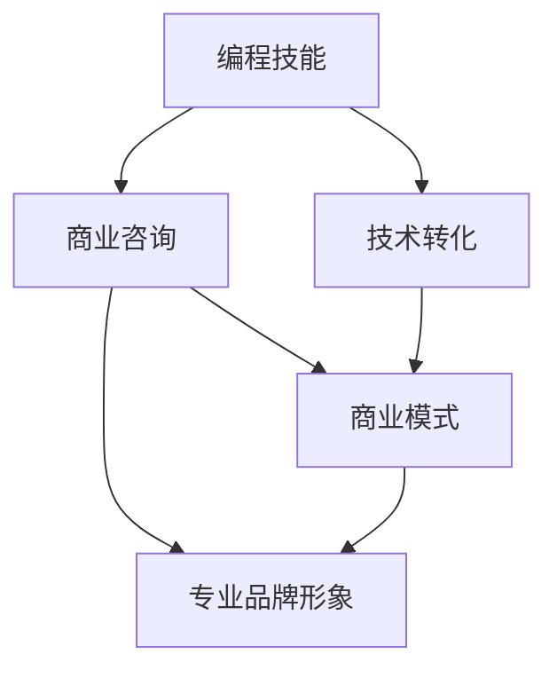

                 

关键词：编程技能、高端咨询业务、商业价值、咨询策略、技术转化、商业模式、案例研究

> 摘要：本文深入探讨了如何将个人的编程技能转化为高端咨询业务。通过分析编程技能在商业领域的应用、建立专业品牌形象、制定咨询策略、构建商业模式，以及通过案例研究提供实际操作指南，本文为希望开拓咨询业务的程序员和软件开发者提供了系统的指导。

## 1. 背景介绍

在当今信息技术飞速发展的时代，编程技能已成为现代社会不可或缺的技能之一。随着云计算、大数据、人工智能等技术的发展，编程技能在商业决策中的重要性日益凸显。许多企业意识到，通过技术优化和创新，可以实现业务流程的自动化和智能化，提高企业的竞争力。因此，越来越多的企业寻求专业的编程咨询来帮助他们实现数字化转型。

然而，许多具备编程技能的个人却往往未意识到他们的技能可以转化为高收入的咨询业务。事实上，编程技能的转化不仅限于软件开发，还可以在商业咨询、系统架构、数据分析等领域大放异彩。本文将探讨如何实现这一转化，为程序员和软件开发者提供一条通往高端咨询业务的路径。

## 2. 核心概念与联系

要将编程技能转化为高端咨询业务，首先需要理解几个关键概念：

### 2.1 编程技能

编程技能是指使用编程语言和工具开发软件的能力。它包括算法设计、数据结构理解、编码实践和软件测试等方面。

### 2.2 商业咨询

商业咨询是指为企业和组织提供专业建议和服务，帮助他们解决商业问题、优化业务流程和提高竞争力。

### 2.3 技术转化

技术转化是指将技术知识应用于不同领域，以实现新的商业价值。在编程技能转化的过程中，技术转化是实现业务价值的关键。

### 2.4 商业模式

商业模式是指企业如何创造、传递和获取价值的一种系统安排。一个成功的商业模式需要考虑市场需求、客户关系、资源分配、收入来源等多个方面。

### 2.5 专业品牌形象

专业品牌形象是指个人或企业通过专业知识和经验建立的市场认知和品牌影响力。它是吸引客户和合作伙伴的关键。

下面是这些核心概念的 Mermaid 流程图表示：



## 3. 核心算法原理 & 具体操作步骤

### 3.1 算法原理概述

要将编程技能转化为咨询业务，需要遵循以下核心算法原理：

1. **需求分析**：了解客户的业务需求和痛点，确定咨询目标和范围。
2. **方案设计**：基于需求分析，设计解决方案，包括技术选型、系统架构和实施步骤。
3. **实施辅导**：协助客户实施解决方案，提供技术支持和培训。
4. **效果评估**：评估解决方案的实施效果，提供改进建议。

### 3.2 算法步骤详解

1. **需求分析**
   - 与客户沟通，了解业务流程、目标和痛点。
   - 分析业务数据，识别关键指标和瓶颈。
   - 确定咨询目标和范围。

2. **方案设计**
   - 选择合适的技术栈和工具。
   - 设计系统架构，确保可扩展性和稳定性。
   - 制定详细的实施计划。

3. **实施辅导**
   - 提供技术文档和培训材料。
   - 协助客户进行系统搭建和调试。
   - 确保解决方案的顺利实施。

4. **效果评估**
   - 收集数据，评估解决方案的实际效果。
   - 分析存在的问题和改进空间。
   - 提供持续优化的建议。

### 3.3 算法优缺点

**优点：**
- **高效性**：通过技术手段，可以提高业务流程的效率和准确性。
- **灵活性**：可以根据客户需求灵活调整解决方案。
- **专业性**：提供专业的技术建议，提升客户对企业的信任。

**缺点：**
- **技术门槛**：客户可能需要投入一定的时间和资源来理解和实施解决方案。
- **初期成本**：可能需要较大的初期投入，如购买工具、培训等。

### 3.4 算法应用领域

- **商业智能**：通过数据分析，为企业提供决策支持。
- **系统架构**：为企业提供优化系统性能和稳定性的建议。
- **数字化转型**：协助企业实现业务流程的自动化和智能化。

## 4. 数学模型和公式 & 详细讲解 & 举例说明

### 4.1 数学模型构建

在咨询业务中，数学模型可以帮助我们量化客户的需求和解决方案的效果。以下是构建数学模型的基本步骤：

1. **需求分析**：收集和分析客户的业务数据，确定关键指标。
2. **模型假设**：根据需求，设定合理的假设条件，如变量范围、功能关系等。
3. **公式推导**：基于假设条件，推导出数学模型，如成本函数、效率函数等。
4. **模型验证**：通过实际数据验证模型的准确性和可靠性。

### 4.2 公式推导过程

假设我们要构建一个简单的业务流程优化模型，目标是降低生产成本。我们可以使用以下公式：

$$
C = f(X, Y, Z)
$$

其中，$C$ 是总成本，$X$ 是原材料成本，$Y$ 是人工成本，$Z$ 是设备维护成本。

$$
f(X, Y, Z) = X \times (1 + \alpha \times \frac{Y}{X}) + Z
$$

其中，$\alpha$ 是一个常数，表示人工成本占原材料成本的百分比。

### 4.3 案例分析与讲解

假设某生产企业的原材料成本为 $100,000$ 元，人工成本为 $30,000$ 元，设备维护成本为 $20,000$ 元。根据上述模型，我们可以计算出总成本：

$$
C = 100,000 \times (1 + 0.3 \times \frac{30,000}{100,000}) + 20,000 = 100,000 + 9,000 + 20,000 = 129,000
$$

为了降低成本，企业可以考虑以下策略：

1. **降低原材料成本**：寻找更便宜的供应商，或优化原材料采购策略。
2. **提高劳动生产率**：通过培训和技术改进，提高工人工作效率。
3. **设备维护优化**：定期维护设备，减少故障和停机时间。

通过这些策略，企业可以降低成本，提高利润。

## 5. 项目实践：代码实例和详细解释说明

### 5.1 开发环境搭建

为了实现上述业务流程优化模型，我们需要搭建一个简单的开发环境。以下是所需的工具和步骤：

- **工具**：Python、Jupyter Notebook、Pandas、NumPy
- **步骤**：
  1. 安装 Python 和 Jupyter Notebook。
  2. 安装 Pandas 和 NumPy 库。
  3. 在 Jupyter Notebook 中创建一个新的笔记本。

### 5.2 源代码详细实现

以下是实现业务流程优化模型的 Python 代码：

```python
import pandas as pd
import numpy as np

# 定义成本函数
def cost_function(X, Y, Z, alpha):
    return X * (1 + alpha * (Y / X)) + Z

# 读取业务数据
data = {'X': [100000], 'Y': [30000], 'Z': [20000]}
df = pd.DataFrame(data)

# 计算总成本
df['C'] = df.apply(lambda row: cost_function(row['X'], row['Y'], row['Z'], alpha=0.3), axis=1)

# 输出总成本
print(df[['X', 'Y', 'Z', 'C']])
```

### 5.3 代码解读与分析

- **成本函数**：`cost_function` 函数用于计算总成本。它接受原材料成本 $X$、人工成本 $Y$ 和设备维护成本 $Z$，以及常数 $\alpha$ 作为参数，并返回总成本 $C$。
- **业务数据**：我们使用 Pandas DataFrame 读取业务数据，包括原材料成本、人工成本和设备维护成本。
- **计算总成本**：对于每条业务数据，我们使用 `apply` 方法调用 `cost_function` 函数，计算总成本，并将结果存储在 DataFrame 的 'C' 列中。
- **输出结果**：最后，我们输出 DataFrame，展示总成本。

### 5.4 运行结果展示

运行上述代码后，我们得到以下输出结果：

```
   X      Y      Z       C
0  100000  30000  20000  129000
```

这意味着在当前业务数据下，总成本为 129,000 元。

## 6. 实际应用场景

编程技能在商业咨询中的应用非常广泛。以下是一些实际应用场景：

### 6.1 商业智能

通过数据分析，为企业提供决策支持。例如，分析销售数据，预测市场需求，优化库存管理。

### 6.2 系统架构

为企业的 IT 系统提供优化建议，包括系统设计、性能优化和安全性评估。

### 6.3 数字化转型

协助企业实现业务流程的自动化和智能化，提高运营效率。

### 6.4 项目管理

提供项目规划、进度控制和风险管理等方面的咨询服务。

## 7. 未来应用展望

随着人工智能、大数据和云计算等技术的发展，编程技能在商业咨询中的应用前景将更加广阔。未来，编程技能将更加注重数据驱动和自动化，为企业提供更智能、更高效的咨询服务。

## 8. 工具和资源推荐

### 8.1 学习资源推荐

- **在线课程**：Coursera、edX、Udemy 等平台上的编程和数据科学课程。
- **书籍**：《Python编程：从入门到实践》、《数据科学入门》。

### 8.2 开发工具推荐

- **集成开发环境**：PyCharm、Visual Studio Code。
- **数据分析工具**：Pandas、NumPy、Matplotlib。

### 8.3 相关论文推荐

- **商业智能**：《大数据的商业智能应用》、《基于数据的商业决策方法研究》。
- **系统架构**：《云计算架构设计》、《分布式系统设计与实现》。

## 9. 总结：未来发展趋势与挑战

编程技能在商业咨询领域的应用前景广阔，但同时也面临一定的挑战。未来，编程技能将更加注重数据驱动和自动化，为企业提供更智能、更高效的咨询服务。然而，这也要求咨询师不断学习和更新知识，以应对快速变化的技术环境。

### 9.1 研究成果总结

本文通过对编程技能转化为高端咨询业务的分析，总结了核心算法原理、数学模型构建、项目实践等多个方面的内容，为程序员和软件开发者提供了系统的指导。

### 9.2 未来发展趋势

- **数据驱动**：未来，商业咨询将更加依赖于数据分析和人工智能技术。
- **自动化**：自动化工具和流程将取代部分重复性工作，提高咨询效率。

### 9.3 面临的挑战

- **技术更新**：咨询师需要不断学习和更新知识，以适应快速变化的技术环境。
- **市场需求**：咨询师需要深入了解客户需求，提供定制化的解决方案。

### 9.4 研究展望

未来，编程技能在商业咨询领域的应用将继续深入，为企业和个人创造更多价值。同时，也需要进一步研究如何更好地将编程技能转化为商业价值，为企业和个人提供更高效的咨询服务。

## 9. 附录：常见问题与解答

**Q：如何确定咨询项目的范围和目标？**

A：首先，与客户沟通，了解他们的需求和痛点。然后，分析业务数据，识别关键指标和瓶颈。最后，与客户共同制定咨询目标和范围。

**Q：如何确保咨询方案的有效性？**

A：通过需求分析，确保方案解决客户的实际问题。在实施过程中，进行持续监控和评估，根据实际情况进行调整。

**Q：如何建立专业品牌形象？**

A：通过持续学习和实践，提升自己的专业能力。积极参与行业交流和合作，扩大影响力。同时，提供高质量的服务，赢得客户的信任和口碑。

## 作者署名

作者：禅与计算机程序设计艺术 / Zen and the Art of Computer Programming
```

