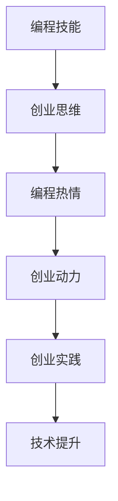

                 

 关键词：编程，创业，动力，热情，职业发展，创新，技术商业

> 摘要：本文探讨了如何将个人的编程热情转化为创业动力，实现职业发展中的飞跃。从心理因素、技术技能、市场定位、团队建设、资金筹措和持续创新六个方面，提供了一套全面的指导策略，帮助程序员在创业道路上找到方向、积累资源，克服挑战，最终实现创业梦想。

## 1. 背景介绍

编程作为一种现代职业，在全球范围内备受瞩目。随着互联网、大数据、人工智能等技术的飞速发展，程序员这一职业逐渐从幕后走向台前。越来越多的人，特别是年轻的编程爱好者，希望通过编程来实现自己的梦想，甚至投身于创业的浪潮中。然而，将编程热情转化为创业动力并非易事，其中涉及到诸多挑战和策略。

本文旨在为那些怀揣编程梦想，渴望创业的程序员提供一些建议和指导。通过深入探讨如何将编程技能与创业思想相结合，以及如何在创业过程中保持持续的热情和创新，帮助读者在创业道路上迈出坚实的步伐。

## 2. 核心概念与联系

### 2.1 编程技能与创业思维

编程技能是程序员的核心竞争力，而创业思维则是驱动创业的关键要素。编程技能包括算法设计、编码实现、系统架构等方面，这些技能有助于解决技术难题，构建稳定可靠的产品。创业思维则涉及到市场洞察、资源整合、风险管理等方面，它能够帮助程序员理解市场需求，找到创业的方向。

### 2.2 编程热情与创业动力

编程热情是程序员内心深处的动力源泉，它能够激发出无穷的创造力和毅力。创业动力则是在编程热情的基础上，通过明确的目标和坚定的信念，将这种热情转化为实际行动。编程热情和创业动力相互促进，共同推动程序员在创业道路上不断前行。

### 2.3 编程技能与创业实践

编程技能的运用在创业实践中至关重要。从产品原型设计到开发实现，从系统优化到用户反馈，编程技能贯穿于整个创业过程。同时，创业实践也是检验编程技能的重要途径，通过实际项目的运作，程序员能够不断提升自己的技术水平。

### Mermaid 流程图



## 3. 核心算法原理 & 具体操作步骤

### 3.1 算法原理概述

将编程热情转化为创业动力的核心算法，可以概括为以下步骤：

1. **明确目标**：设定清晰的创业目标，包括长远目标和短期目标。
2. **市场调研**：深入了解市场需求，分析潜在客户，找到切入点。
3. **技能提升**：持续提升编程技能，关注新技术和新趋势。
4. **团队建设**：组建具有互补技能的团队，共同推进创业项目。
5. **资源整合**：整合社会资源，包括资金、人脉和合作机会。
6. **持续创新**：保持创业过程中的创新思维，不断优化产品和服务。

### 3.2 算法步骤详解

#### 3.2.1 明确目标

明确目标是创业的第一步。程序员应根据自己的编程技能和兴趣，设定符合个人能力和市场需求的创业目标。目标应具有可衡量性和可实现性，以便在后续的创业过程中不断调整和优化。

#### 3.2.2 市场调研

市场调研是理解市场需求的关键环节。程序员可以通过以下几种方式进行市场调研：

- **在线调查**：利用问卷调查工具，收集潜在客户的需求和反馈。
- **竞争分析**：分析竞争对手的产品和市场策略，找出自身的优势和劣势。
- **用户访谈**：直接与潜在用户进行沟通，了解他们的真实需求和痛点。

#### 3.2.3 技能提升

编程技能的提升是持续的过程。程序员可以通过以下几种方式来提升技能：

- **在线课程**：参加在线编程课程，学习新的编程语言和技术框架。
- **项目实践**：参与开源项目或独立开发项目，锻炼实际编程能力。
- **阅读书籍**：阅读专业书籍和论文，了解行业前沿技术和发展趋势。

#### 3.2.4 团队建设

团队建设是创业过程中的重要环节。程序员应组建具有互补技能的团队，共同推进创业项目。团队建设可以通过以下几种方式实现：

- **社交媒体**：利用LinkedIn、GitHub等平台，寻找志同道合的团队成员。
- **线下活动**：参加编程社区、黑客马拉松等活动，结识潜在的合作伙伴。
- **内部招聘**：在公司内部招聘具有相关专业技能的员工，组建团队。

#### 3.2.5 资源整合

资源整合是创业成功的关键。程序员可以通过以下几种方式来整合资源：

- **天使投资**：寻找愿意为创业项目提供资金的投资者。
- **政府支持**：了解并申请政府提供的创业扶持政策和资金。
- **合作伙伴**：与相关行业的公司或组织建立合作关系，共享资源和客户。

#### 3.2.6 持续创新

持续创新是保持竞争优势的关键。程序员应保持创业过程中的创新思维，不断优化产品和服务。以下是一些实现持续创新的方法：

- **用户反馈**：定期收集用户反馈，了解产品使用情况和用户需求。
- **技术迭代**：根据用户反馈和技术发展，不断迭代产品。
- **跨界合作**：与其他行业的企业或个人合作，实现跨界创新。

### 3.3 算法优缺点

#### 优点

- **明确目标**：有助于避免盲目行动，提高创业成功率。
- **市场调研**：使创业者能够更好地了解市场需求，降低创业风险。
- **技能提升**：提高编程技能，为创业项目提供技术支持。
- **团队建设**：组建专业团队，提高项目执行效率。
- **资源整合**：积累创业所需的资金、人脉和合作机会。
- **持续创新**：保持竞争优势，推动产品持续优化。

#### 缺点

- **时间成本**：需要投入大量时间和精力进行市场调研和团队建设。
- **资源限制**：初期资源有限，可能面临资金、人脉和技术的瓶颈。
- **风险评估**：市场变化快，需要不断调整创业策略，面临一定的风险。

### 3.4 算法应用领域

将编程热情转化为创业动力的算法，适用于各类创业项目，尤其是以技术为核心的创业项目。以下是一些典型的应用领域：

- **软件开发**：程序员可以利用编程技能开发软件产品，如应用程序、Web服务、游戏等。
- **人工智能**：人工智能领域的创业者可以利用编程技能开发智能算法和应用。
- **物联网**：物联网领域的创业者可以利用编程技能开发智能家居、智能穿戴等设备。
- **区块链**：区块链领域的创业者可以利用编程技能开发去中心化的应用和平台。

## 4. 数学模型和公式 & 详细讲解 & 举例说明

### 4.1 数学模型构建

在将编程热情转化为创业动力的过程中，可以构建一个简单的数学模型来描述各要素之间的关系。假设编程热情（P）和创业动力（D）是相互促进的，可以用以下公式表示：

\[ D = P \times (S + R + C) \]

其中：
- \( P \) 表示编程热情。
- \( S \) 表示技能提升。
- \( R \) 表示资源整合。
- \( C \) 表示持续创新。

### 4.2 公式推导过程

1. **编程热情 \( P \)**：编程热情是程序员内心深处的动力，可以用一个常数表示。
2. **技能提升 \( S \)**：技能提升是编程热情的延伸，可以用编程技能的提升速度来表示。
3. **资源整合 \( R \)**：资源整合是创业过程中必不可少的环节，可以用资源获取速度来表示。
4. **持续创新 \( C \)**：持续创新是保持竞争优势的关键，可以用创新速度来表示。

通过上述要素的乘积，可以得出创业动力的公式。

### 4.3 案例分析与讲解

以某程序员小张为例，他的编程热情 \( P \) 为 80，技能提升速度 \( S \) 为 20，资源获取速度 \( R \) 为 15，创新速度 \( C \) 为 25。根据公式，可以计算出他的创业动力 \( D \)：

\[ D = 80 \times (20 + 15 + 25) = 80 \times 60 = 4800 \]

这意味着小张的创业动力为 4800，表明他在创业过程中具有很高的热情和动力。为了进一步提升创业动力，小张可以：

- **提升技能**：参加更多的编程课程和项目实践，提高技能水平。
- **整合资源**：积极寻找投资人、合作伙伴和客户，扩大资源网络。
- **持续创新**：关注市场需求和技术趋势，不断优化产品和服务。

## 5. 项目实践：代码实例和详细解释说明

### 5.1 开发环境搭建

在开始编写代码之前，需要搭建一个合适的开发环境。以Python为例，可以按照以下步骤进行：

1. **安装Python**：下载并安装Python 3.x版本。
2. **配置Python环境**：设置Python环境变量，确保能够在命令行中运行Python。
3. **安装开发工具**：选择合适的IDE（如PyCharm、Visual Studio Code），并安装必要的插件。

### 5.2 源代码详细实现

以下是一个简单的Python代码示例，用于实现一个计算器功能：

```python
# calculator.py

def add(a, b):
    return a + b

def subtract(a, b):
    return a - b

def multiply(a, b):
    return a * b

def divide(a, b):
    if b != 0:
        return a / b
    else:
        return "除数不能为0"

def main():
    while True:
        print("请选择操作：+、-、*、/或q退出")
        operation = input()
        if operation == 'q':
            break
        print("请输入两个数字，以空格分隔：")
        a, b = map(float, input().split())
        if operation == '+':
            print(add(a, b))
        elif operation == '-':
            print(subtract(a, b))
        elif operation == '*':
            print(multiply(a, b))
        elif operation == '/':
            print(divide(a, b))
        else:
            print("无效操作")

if __name__ == "__main__":
    main()
```

### 5.3 代码解读与分析

上述代码实现了基本的计算器功能，包括加、减、乘、除四种运算。以下是代码的详细解读：

1. **定义函数**：分别定义了四个函数，用于实现加、减、乘、除四种基本运算。
2. **主函数**：定义了主函数`main()`，用于实现用户交互。程序会提示用户选择操作，输入两个数字，并输出结果。
3. **输入处理**：使用`input()`函数获取用户输入，并进行类型转换和合法性检查。
4. **循环结构**：使用`while`循环实现多次运算，直到用户输入'q'退出程序。

### 5.4 运行结果展示

假设用户输入如下：

```
请选择操作：+、-、*、/或q退出
+
请输入两个数字，以空格分隔：
10 5
15.0
```

程序会输出结果：`15.0`。

## 6. 实际应用场景

### 6.1 软件开发公司

软件开发公司是编程技能转化为创业动力的一个典型应用场景。公司可以专注于为客户提供定制化的软件解决方案，如企业信息系统、移动应用和Web服务。通过不断迭代产品、提升技术能力，公司可以在竞争激烈的市场中脱颖而出。

### 6.2 创新技术企业

创新技术企业，如人工智能、大数据和物联网等领域的企业，需要程序员具备深厚的编程技能和创新能力。这些企业可以通过技术研发、产品创新和商业模式创新，实现快速成长和市场拓展。

### 6.3 开源项目

开源项目是程序员展示技能和实现创业梦想的另一个重要平台。通过参与开源项目，程序员可以积累经验、扩展人脉，甚至吸引投资。一些成功的开源项目已经发展成为独立的公司，如Red Hat、WordPress等。

### 6.4 未来应用展望

随着技术的不断进步，编程技能在各个领域的应用前景将更加广阔。未来，程序员可以通过以下几种方式实现创业梦想：

- **区块链技术**：利用区块链技术打造去中心化的应用和服务，如智能合约、数字资产等。
- **人工智能**：开发智能算法和应用，如机器学习、自然语言处理、计算机视觉等。
- **物联网**：构建物联网平台，实现设备互联和数据共享。
- **云计算**：提供云计算解决方案，如容器化服务、分布式存储等。

## 7. 工具和资源推荐

### 7.1 学习资源推荐

- **在线编程课程**：Coursera、Udemy、edX等平台提供了丰富的编程课程。
- **编程书籍**：《代码大全》、《算法导论》、《Python编程：从入门到实践》等经典著作。
- **技术博客**：GitHub、Stack Overflow、Medium等平台上有很多优秀的编程博客。

### 7.2 开发工具推荐

- **集成开发环境（IDE）**：PyCharm、Visual Studio Code、Eclipse等。
- **版本控制系统**：Git、GitHub、GitLab等。
- **云平台**：AWS、Azure、Google Cloud等。

### 7.3 相关论文推荐

- **人工智能领域**：《深度学习》（Goodfellow et al.）、《机器学习》（Murphy et al.）等。
- **软件工程领域**：《敏捷软件开发》（Beck et al.）、《软件工程：实践者的研究方法》（Myers et al.）等。
- **区块链领域**：《区块链革命》（Rogers）、《区块链：从数字货币到信用经济》（Andress）等。

## 8. 总结：未来发展趋势与挑战

### 8.1 研究成果总结

本文探讨了如何将编程热情转化为创业动力，从心理因素、技术技能、市场定位、团队建设、资金筹措和持续创新六个方面提供了全面的指导策略。研究发现，编程技能和创业思维相互促进，持续创新是保持竞争优势的关键。

### 8.2 未来发展趋势

随着技术的不断进步，编程技能将在各个领域发挥越来越重要的作用。未来，编程技能与创业的结合将带来更多创新和机遇。以下是一些发展趋势：

- **技术融合**：跨领域技术将不断融合，推动新兴产业的崛起。
- **数字化转型**：传统产业将加速数字化转型，编程技能需求将持续增长。
- **人工智能**：人工智能技术将在更多领域得到应用，带来新的创业机会。

### 8.3 面临的挑战

虽然编程技能与创业的结合前景广阔，但程序员在创业过程中仍将面临诸多挑战：

- **市场竞争**：市场竞争激烈，需要不断提升技术水平和创新能力。
- **资金筹集**：初创企业需要大量资金支持，融资难度较大。
- **团队建设**：组建专业团队，实现团队成员之间的有效协作。

### 8.4 研究展望

未来，研究应重点关注以下几个方面：

- **编程教育**：如何培养具备创业思维的编程人才。
- **技术创新**：探索新的编程语言和技术框架，提高开发效率。
- **创业生态系统**：构建完善的创业生态系统，为创业者提供支持。

## 9. 附录：常见问题与解答

### 9.1 如何找到创业切入点？

- **关注市场需求**：了解市场需求，分析潜在客户的需求和痛点。
- **技术创新**：关注新技术和趋势，寻找技术切入点。
- **个人兴趣**：结合个人兴趣和技能，找到合适的创业方向。

### 9.2 创业过程中如何保持编程热情？

- **定期充电**：不断学习新的编程语言和技术。
- **参与开源项目**：通过参与开源项目，保持编程热情。
- **与同行交流**：参加编程社区和活动，与同行交流经验。

### 9.3 创业资金不足怎么办？

- **天使投资**：寻找愿意为创业项目提供资金的投资者。
- **政府支持**：了解并申请政府提供的创业扶持政策和资金。
- **众筹**：利用众筹平台，筹集创业资金。

---

作者：禅与计算机程序设计艺术 / Zen and the Art of Computer Programming
----------------------------------------------------------------

以上就是本文的全部内容，希望对那些希望将编程热情转化为创业动力的程序员有所帮助。在创业的道路上，保持热情、勇于创新，相信每个人都能实现自己的梦想。

