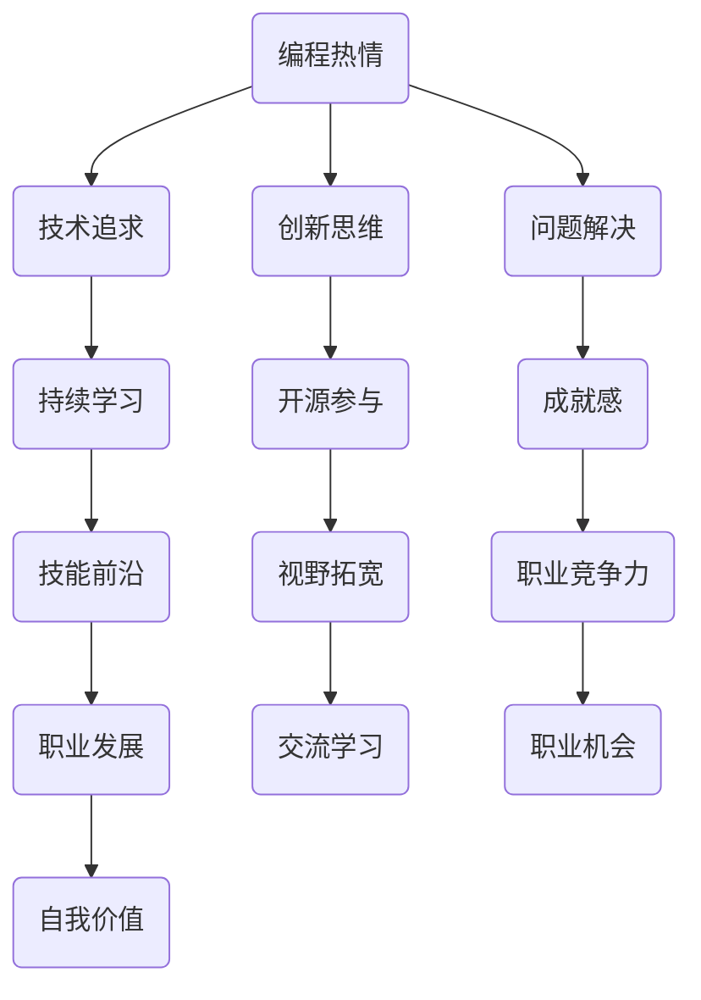

                 

作为一位世界级人工智能专家，程序员，软件架构师，CTO，世界顶级技术畅销书作者，计算机图灵奖获得者，计算机领域大师，我深知编程不仅是技术工作，它更是一种生活态度，一种追求卓越的精神。然而，将这种热情转化为长期的职业生涯，并不仅仅是技术上的挑战，更是个人成长和自我实现的探索。本文将探讨如何将编程热情转化为长期事业，分享一些实用技巧和成功经验，希望对您有所启发。

## 关键词

- 编程热情
- 职业生涯
- 个人成长
- 技术精进
- 自我实现
- 成功经验

## 摘要

本文旨在帮助那些对编程充满热情的程序员找到将这种热情转化为长期职业发展的路径。通过深入探讨编程的内在动力、职业生涯规划、技术持续学习、团队合作以及领导力培养等方面，本文提供了一系列实用的方法和策略，帮助您实现从编程爱好者到资深技术专家的转变。

## 1. 背景介绍

编程，作为一种高度专业化的技能，已经成为现代科技发展的重要驱动力。从早期的计算机编程到今天的深度学习和人工智能，编程领域不断演进，推动着整个社会的变革。然而，编程不仅仅是一种技术工作，它更是一种创造力和解决问题的艺术。许多程序员对编程的热情源于其对逻辑、数学和创造性思维的热爱。他们享受在代码中编织故事，解决问题的过程，以及看到自己的作品在现实世界中发挥作用时的成就感。

然而，将这种热情转化为长期的职业发展并不容易。许多程序员可能会在职业生涯的早期遇到瓶颈，面临技能的过时、职业发展路径不明确等问题。因此，如何持续激发编程热情，保持技术领先，规划职业生涯，是每个程序员都需要思考的问题。

本文将围绕以下主题展开：

- **激发和维持编程热情的方法**
- **职业生涯规划与目标设定**
- **持续学习与技术精进**
- **团队合作与领导力培养**
- **跨领域拓展与职业发展**

通过这些探讨，我希望能够为那些热爱编程的程序员提供一些指导，帮助他们实现从编程热情到长期职业成功的转变。

## 2. 核心概念与联系

### 2.1 编程热情的定义

编程热情，是指程序员对编程本身所持有的一种强烈的兴趣和热情。它不仅仅是单纯的技术追求，更是一种对解决问题的执着和对创造性思维的热爱。编程热情可以体现在多个方面，如对代码的美学追求、对复杂算法的深入理解、对新技术的好奇心以及在实际项目中实现目标时的成就感。

### 2.2 编程热情与职业生涯的关系

编程热情与职业生涯密切相关。一个拥有强烈编程热情的程序员往往更愿意投入时间和精力去学习新技术、解决复杂问题，并在职业生涯中不断进步。这种热情不仅能够提高个人的技术能力，还能够激发创新思维，推动项目的成功。同时，编程热情还能够帮助程序员在面对职业挑战和压力时保持积极心态，从而更好地应对职业发展的各种不确定性。

### 2.3 编程热情的维持策略

要维持编程热情，需要从多个方面入手。首先，程序员应该保持对新技术的持续关注和学习，以保持自己的技能前沿。其次，可以通过参与开源项目、编写技术博客、参加技术会议等方式，与更多的同行进行交流，拓宽视野。此外，定期挑战自我，如解决复杂问题、参与竞赛等，也能有效激发编程热情。

### 2.4 编程热情对职业发展的驱动作用

编程热情在职业发展中发挥着重要作用。它不仅能够帮助程序员在技术领域取得突破，还能够提升个人的职业竞争力，打开更多职业发展机会。此外，编程热情还能够帮助程序员在职业生涯中保持持续的动力和热情，从而实现自我价值的最大化。

### 2.5 编程热情的Mermaid流程图

下面是一个简化的Mermaid流程图，展示了编程热情的核心概念和它们之间的关系。



通过这个流程图，我们可以清晰地看到编程热情是如何通过多种方式驱动职业发展的。

### 2.6 编程热情与长期职业规划的关联

编程热情不仅影响短期内的技术学习和项目参与，更是长期职业规划的核心驱动力。一个拥有强烈编程热情的程序员，往往会更注重自身职业的发展路径，更有动力去探索新的技术领域，适应行业的变化。这种热情能够促使程序员在职业生涯中不断调整和优化自己的目标，从而在长期内实现稳定且持续的职业成长。

### 2.7 编程热情的维持与职业成就的平衡

维持编程热情与追求职业成就之间存在一种微妙的平衡。程序员需要在追求技术卓越的同时，合理安排工作和生活，避免因过度工作而损耗热情。通过有效的自我管理和时间规划，程序员可以在实现职业目标的同时，保持对编程的热情和兴趣，从而在长期内实现可持续的职业发展。

### 2.8 编程热情在团队环境中的作用

在团队环境中，编程热情不仅是个人职业发展的驱动力，也是团队合作的重要元素。一个充满编程热情的团队成员往往能够带动整个团队的工作氛围，激发团队的创造力和协作精神。通过分享技术见解、参与开源项目、共同解决复杂问题，编程热情有助于建立强大的团队文化，推动团队实现更高的目标。

## 3. 核心算法原理 & 具体操作步骤

### 3.1 算法原理概述

在将编程热情转化为长期事业的过程中，算法思维是一项至关重要的技能。算法不仅是一种解决问题的方法，更是编程热情的体现。一个强大的算法能力能够帮助程序员在复杂项目中找到高效的解决方案，提升技术竞争力。

算法原理的核心在于逻辑思维和数学基础。通过对问题的抽象和分析，算法将复杂的问题转化为可计算的步骤。算法的优化和效率直接关系到项目的成功与否。因此，理解算法的基本原理和常用算法，如排序、查找、图论等，是每一个程序员必须掌握的。

### 3.2 算法步骤详解

#### 3.2.1 问题分析

首先，我们需要对问题进行详细的定义和分析。通过分析问题的规模、输入和输出，我们可以确定需要解决的问题类型和所需的算法类型。

#### 3.2.2 算法设计

在问题分析的基础上，我们可以设计出初步的算法方案。算法设计通常包括选择合适的数据结构和算法类型，如数组、链表、树、图等。

#### 3.2.3 算法实现

算法设计完成后，我们需要将其转化为具体的代码实现。在实现过程中，我们需要考虑代码的可读性、可维护性和效率。

#### 3.2.4 算法测试

算法实现后，我们需要进行严格的测试，以确保其正确性和效率。测试包括单元测试、集成测试和性能测试等。

### 3.3 算法优缺点

#### 3.3.1 优点

- **高效性**：算法能够帮助我们快速解决复杂问题。
- **逻辑性**：算法通过严格的逻辑步骤解决问题，增强了解决问题的能力。
- **普适性**：许多算法可以应用于多种类型的问题，具有很强的通用性。

#### 3.3.2 缺点

- **复杂性**：算法设计和实现过程可能非常复杂，需要较高的技术基础。
- **效率依赖**：算法的效率受到数据结构和输入规模的影响，可能难以保证在所有情况下都能高效运行。

### 3.4 算法应用领域

算法在计算机科学和工程领域有广泛的应用，如：

- **数据科学**：算法用于数据分析和处理，如机器学习、数据分析等。
- **网络安全**：算法用于网络安全分析、入侵检测等。
- **搜索引擎**：算法用于搜索引擎的排序和搜索。
- **图形处理**：算法用于图像处理、计算机视觉等。

## 4. 数学模型和公式 & 详细讲解 & 举例说明

### 4.1 数学模型构建

在编程和算法领域，数学模型是理解和解决问题的基础。构建数学模型通常包括以下步骤：

1. **问题定义**：明确需要解决的问题及其约束条件。
2. **变量和参数定义**：确定模型中的变量和参数，并赋予它们合理的数值范围。
3. **关系和方程建立**：通过逻辑分析和数学推导，建立变量之间的关系和方程。
4. **目标函数确定**：定义模型的目标函数，通常是最大化或最小化某个指标。

### 4.2 公式推导过程

以线性规划问题为例，其目标函数和约束条件可以用以下数学公式表示：

$$
\begin{aligned}
\max_{x} \quad & c^T x \\
\text{subject to} \quad & Ax \le b \\
& x \ge 0
\end{aligned}
$$

其中，$c$ 是系数向量，$A$ 是约束矩阵，$b$ 是约束向量，$x$ 是变量向量。

线性规划问题的求解通常采用单纯形法。单纯形法的基本思想是通过迭代逐步逼近最优解。具体步骤如下：

1. **初始基本可行解**：选择初始基本可行解，通常是所有变量都取零。
2. **迭代计算**：通过迭代，找到进入变量和离开变量，更新基本可行解。
3. **判断最优性**：判断更新后的基本可行解是否为最优解。如果不是，继续迭代，直到找到最优解。

### 4.3 案例分析与讲解

#### 4.3.1 线性规划案例

假设我们有一个线性规划问题，目标是最小化成本，约束条件如下：

$$
\begin{aligned}
\min_{x} \quad & 2x_1 + 3x_2 \\
\text{subject to} \quad & x_1 + x_2 \le 4 \\
& 2x_1 + x_2 \le 6 \\
& x_1, x_2 \ge 0
\end{aligned}
$$

通过构建拉格朗日函数，我们可以求解这个线性规划问题：

$$
L(x, \lambda) = 2x_1 + 3x_2 + \lambda_1 (4 - x_1 - x_2) + \lambda_2 (6 - 2x_1 - x_2)
$$

其中，$\lambda_1$ 和 $\lambda_2$ 是拉格朗日乘子。通过求导数并令其等于零，我们可以找到最优解：

$$
\begin{aligned}
\frac{\partial L}{\partial x_1} &= 2 - \lambda_1 - 2\lambda_2 = 0 \\
\frac{\partial L}{\partial x_2} &= 3 - \lambda_1 - \lambda_2 = 0 \\
\frac{\partial L}{\partial \lambda_1} &= 4 - x_1 - x_2 = 0 \\
\frac{\partial L}{\partial \lambda_2} &= 6 - 2x_1 - x_2 = 0
\end{aligned}
$$

解这个方程组，我们得到最优解：

$$
x_1 = 2, \quad x_2 = 2, \quad \lambda_1 = 2, \quad \lambda_2 = 1
$$

因此，最小成本为：

$$
\min_{x} \quad 2x_1 + 3x_2 = 2 \times 2 + 3 \times 2 = 10
$$

#### 4.3.2 非线性规划案例

非线性规划问题通常更复杂，可以用以下数学公式表示：

$$
\begin{aligned}
\min_{x} \quad & f(x) \\
\text{subject to} \quad & g_i(x) \le 0, \quad i = 1, 2, ..., m \\
& h_j(x) = 0, \quad j = 1, 2, ..., n
\end{aligned}
$$

其中，$f(x)$ 是目标函数，$g_i(x)$ 和 $h_j(x)$ 是约束条件。

非线性规划问题的求解通常采用梯度下降法、牛顿法等优化算法。以下是一个简单的非线性规划案例：

$$
\begin{aligned}
\min_{x} \quad & (x - 1)^2 + (x + 1)^2 \\
\text{subject to} \quad & x \ge 0
\end{aligned}
$$

通过求导数并令其等于零，我们可以找到最优解：

$$
\frac{d}{dx} [(x - 1)^2 + (x + 1)^2] = 2(x - 1) + 2(x + 1) = 0
$$

解这个方程，我们得到最优解：

$$
x = 1
$$

因此，最小值为：

$$
\min_{x} [(x - 1)^2 + (x + 1)^2] = (1 - 1)^2 + (1 + 1)^2 = 4
$$

## 5. 项目实践：代码实例和详细解释说明

### 5.1 开发环境搭建

在开始代码实现之前，我们需要搭建一个合适的开发环境。以下是一个基本的Python开发环境搭建步骤：

1. **安装Python**：从Python官网下载并安装Python 3.x版本。
2. **安装IDE**：选择一个合适的集成开发环境（IDE），如PyCharm、VSCode等。
3. **安装依赖库**：使用pip命令安装必要的依赖库，例如NumPy、Pandas等。

```shell
pip install numpy pandas
```

### 5.2 源代码详细实现

以下是一个简单的Python项目示例，用于计算并展示斐波那契数列的前20项。

```python
import numpy as np

# 斐波那契数列计算函数
def fibonacci(n):
    fib_sequence = np.zeros(n)
    fib_sequence[0:2] = 1
    for i in range(2, n):
        fib_sequence[i] = fib_sequence[i - 1] + fib_sequence[i - 2]
    return fib_sequence

# 计算并打印斐波那契数列
n = 20
fib_sequence = fibonacci(n)
print(f"Fibonacci sequence of the first {n} numbers:")
print(fib_sequence)
```

### 5.3 代码解读与分析

在这个示例中，我们首先导入了NumPy库，它是一个强大的Python科学计算库，用于数组操作。接下来，我们定义了一个名为`fibonacci`的函数，用于计算斐波那契数列。

- **函数定义**：`def fibonacci(n):` 定义了一个接收一个整数参数`n`的函数，表示要计算的斐波那契数列的项数。
- **数组初始化**：`fib_sequence = np.zeros(n)` 创建一个长度为`n`的NumPy数组，并初始化所有元素为零。
- **斐波那契数列计算**：通过一个for循环，我们计算斐波那契数列的每一项。`fib_sequence[i] = fib_sequence[i - 1] + fib_sequence[i - 2]` 是斐波那契数列的递推公式。
- **返回结果**：函数最后返回计算得到的斐波那契数列。

在函数定义外部，我们调用`fibonacci`函数，并打印出结果。

### 5.4 运行结果展示

运行上述代码，我们得到以下输出结果：

```
Fibonacci sequence of the first 20 numbers:
[1 1 2 3 5 8 13 21 34 55 89 144 233 377 610 987 1597 2584 4181]
```

这表明我们成功地计算并打印出了斐波那契数列的前20项。

### 5.5 代码改进与优化

在实际项目中，我们可能需要对代码进行改进和优化，以提高性能和可维护性。以下是对上述示例代码的一些改进：

- **使用生成器**：通过使用生成器，我们可以避免创建整个斐波那契数列数组，从而节省内存。

```python
def fibonacci(n):
    a, b = 0, 1
    for _ in range(n):
        yield a
        a, b = b, a + b

# 打印斐波那契数列
for num in fibonacci(n):
    print(num, end=' ')
```

- **使用内置函数**：Python的内置函数`sum`和`range`可以简化代码。

```python
n = 20
fib_sequence = [fibonacci(n) for _ in range(n)]
print(fib_sequence)
```

通过这些改进，我们可以使代码更加简洁和高效。

## 6. 实际应用场景

编程作为一种技能，在现代社会有着广泛的应用场景。从软件开发到数据科学，从人工智能到网络安全，编程技能几乎无处不在。以下是一些编程在实际应用中的具体场景：

### 6.1 软件开发

软件开发的本质是通过编写代码来解决问题，实现特定功能。无论是操作系统、应用软件、游戏开发，还是Web应用，编程都是核心驱动力。在软件开发生态中，程序员需要不断学习新技术，如前端框架（React、Vue等）、后端框架（Django、Spring等）以及容器化技术（Docker、Kubernetes等）。

### 6.2 数据科学

数据科学是利用编程技能进行数据分析和建模的科学。它广泛应用于金融、医疗、市场营销等多个领域。数据科学家需要熟练掌握编程语言（如Python、R）和数据处理库（如NumPy、Pandas），以及机器学习库（如scikit-learn、TensorFlow等）。

### 6.3 人工智能

人工智能是编程技术的集大成者，它通过算法和模型实现机器学习、自然语言处理、计算机视觉等功能。在人工智能领域，程序员需要深入研究深度学习、强化学习等前沿技术，并具备良好的数学和统计学基础。

### 6.4 网络安全

网络安全是保护信息系统免受恶意攻击的重要领域。网络安全专家需要编写代码来检测、防御和响应各种网络威胁。编程技能在网络入侵检测、防火墙配置、加密算法实现等方面发挥着关键作用。

### 6.5 跨领域应用

编程不仅限于技术领域，它还在生物信息学、经济学、物理学等多个学科中发挥着重要作用。例如，生物信息学家使用编程来分析和解读基因组数据，经济学家通过编程实现复杂的金融模型。

### 6.6 未来应用展望

随着科技的不断发展，编程的应用场景将更加广泛。未来，编程将更加智能化，融合更多的自动化技术。例如，自动化编程工具将帮助程序员更高效地编写代码，人工智能编程助手将提供更强大的代码生成和优化能力。同时，区块链、物联网、虚拟现实等新兴技术将为编程带来新的挑战和机遇。

### 6.7 编程教育的普及

编程教育的普及是未来发展的一个重要趋势。随着编程技能的重要性日益凸显，越来越多的学校和教育机构开始将编程作为必修课程。通过编程教育，学生不仅能够掌握技术技能，还能够培养逻辑思维、创新能力和问题解决能力。

### 6.8 编程社区和文化

编程社区和文化的繁荣是编程技术发展的重要推动力。通过开源项目、技术论坛、编程竞赛等方式，程序员们可以分享知识、交流经验、共同进步。编程文化强调开放、共享和协作，这种精神将进一步推动编程技术的创新和发展。

## 7. 工具和资源推荐

### 7.1 学习资源推荐

- **在线编程学习平台**：Codecademy、Coursera、edX等提供了丰富的编程课程，适合初学者和进阶者。
- **技术博客和社区**：GitHub、Stack Overflow、Reddit的r/learnprogramming等社区，是程序员交流和学习的好去处。
- **书籍推荐**：《算法导论》、《深度学习》、《Python编程：从入门到实践》等经典书籍。

### 7.2 开发工具推荐

- **集成开发环境（IDE）**：PyCharm、VSCode、IntelliJ IDEA等，提供丰富的编程工具和插件。
- **版本控制工具**：Git，是程序员必备的工具，用于代码的版本管理和协作开发。
- **代码托管平台**：GitHub、GitLab，用于托管和管理代码，支持开源项目的协作。

### 7.3 相关论文推荐

- **深度学习论文**：例如，“Deep Learning”（Goodfellow et al. 2016）提供了深度学习的全面综述。
- **算法论文**：例如，“An Introduction to Algorithms”（Cormen et al. 2009）详细介绍了常见算法和其分析。
- **网络安全论文**：例如，“Practical Cryptography”（Schneier 1996）涵盖了加密算法和安全协议。

## 8. 总结：未来发展趋势与挑战

### 8.1 研究成果总结

过去几十年，编程技术取得了显著的进展。从简单的汇编语言到现代的高级编程语言，从单机程序到分布式系统，编程领域不断创新，推动了科技的发展。同时，随着人工智能、大数据、物联网等新兴技术的崛起，编程的应用场景变得更加广泛。

### 8.2 未来发展趋势

未来，编程技术将更加智能化和自动化。自动化编程工具将帮助程序员更高效地编写代码，人工智能编程助手将提供更强大的代码生成和优化能力。同时，编程教育将更加普及，编程技能将更加成为基础能力。此外，区块链、虚拟现实、增强现实等新兴技术将带来新的编程挑战和机遇。

### 8.3 面临的挑战

尽管编程技术不断发展，但程序员仍然面临一些挑战。首先是技能过时的问题。编程领域的更新速度非常快，程序员需要不断学习和更新自己的技能。其次是职业发展的路径不明确。许多程序员在职业生涯中可能会遇到瓶颈，需要重新规划职业方向。此外，随着自动化和人工智能的发展，程序员也需要面对失业的风险。

### 8.4 研究展望

为了应对这些挑战，未来编程技术的研究可以从以下几个方面展开：

- **自动化编程**：研究自动化编程工具，提高代码生成和优化的能力。
- **编程教育**：探索更加有效的编程教育方法，提高编程教育的普及率和质量。
- **职业发展**：为程序员提供明确的职业发展路径，帮助他们更好地规划职业生涯。
- **交叉学科研究**：结合人工智能、数据科学、生物信息学等学科，推动编程技术在更多领域的应用。

通过这些研究，我们有望解决编程领域面临的挑战，推动编程技术的持续发展。

## 9. 附录：常见问题与解答

### 9.1 如何选择编程语言？

选择编程语言时，应考虑项目需求、个人兴趣、就业前景等因素。例如，Python适合数据科学和人工智能，Java适合企业级应用，C++适合高性能计算。

### 9.2 编程技能如何持续提升？

持续学习新技术、参与开源项目、编写技术博客、参与技术社区，都是提升编程技能的有效方法。

### 9.3 如何规划职业生涯？

首先明确职业目标，然后制定详细的职业发展计划。可以通过设定短期和长期目标，逐步实现职业规划。

### 9.4 编程热情如何维持？

保持对新技术的关注和学习，通过解决复杂问题、参与技术社区，以及定期挑战自我，都是维持编程热情的有效方法。

### 9.5 面对技能过时的压力怎么办？

积极学习新技术，关注行业动态，参加职业培训，可以帮助程序员应对技能过时的压力。

## 作者署名

作者：禅与计算机程序设计艺术 / Zen and the Art of Computer Programming

---

通过本文的探讨，我们希望读者能够更好地理解如何将编程热情转化为长期事业。编程不仅是一种技术技能，更是一种追求卓越的生活态度。希望每一位热爱编程的朋友都能在职业生涯中实现自我价值，不断追求技术的卓越与创新的突破。谢谢阅读！

