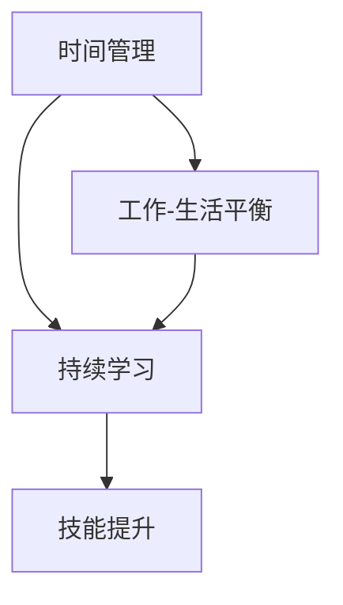

                 

关键词：工作与个人发展，时间管理，技能提升，工作-生活平衡，持续学习，职业成长，人工智能

> 摘要：本文将探讨在当今快速发展的技术时代，如何平衡工作与个人发展。通过时间管理技巧、持续学习策略、技能提升方法等，帮助读者在职业生涯中找到最佳的工作-生活平衡，实现个人与职业的协同发展。

## 1. 背景介绍

在21世纪，信息技术和人工智能的飞速发展改变了我们的工作和生活方式。现代职业人士面临着前所未有的挑战，如何在日复一日的忙碌中，既完成工作任务，又不断自我提升，成为一个具有竞争力的专业人士，是一个值得深思的问题。本文将围绕这一主题，提供实用的方法和策略，帮助读者在工作和个人发展之间找到平衡。

### 1.1 职业发展的压力

随着技术的进步，职场竞争日益激烈。为了不被淘汰，许多专业人士不得不投入更多的时间和精力来学习新技术、提升技能。然而，这往往导致工作压力增大，生活品质下降。据调查显示，超过60%的职业人士感到工作压力过大，影响了他们的身心健康和个人发展。

### 1.2 工作与生活的冲突

工作与生活的平衡一直是职业人士关注的焦点。然而，在现代社会中，这种平衡变得越来越困难。长时间的工作、频繁的出差、加班文化等，都使得职业人士难以在工作和个人生活之间找到平衡点。这种状况不仅影响工作效率，也对个人的健康和幸福产生负面影响。

## 2. 核心概念与联系

为了在工作和个人发展之间找到平衡，我们需要理解一些核心概念，如时间管理、持续学习、技能提升等。以下是这些概念的联系与关系图（使用Mermaid绘制）：



### 2.1 时间管理

时间管理是平衡工作和个人发展的基础。通过合理安排时间，我们可以更有效地完成工作任务，同时留出时间进行个人学习和发展。

### 2.2 持续学习

持续学习是职业发展的关键。在不断变化的技术环境中，只有通过不断学习新知识、掌握新技能，才能保持竞争力。

### 2.3 技能提升

技能提升是个人发展的具体表现。通过提升技能，我们可以提高工作效率，增加职业发展机会。

### 2.4 工作与生活的平衡

工作与生活的平衡是实现个人与职业协同发展的关键。只有在工作与生活之间找到平衡，我们才能保持身心健康，持续地追求个人和职业目标。

## 3. 核心算法原理 & 具体操作步骤

### 3.1 算法原理概述

平衡工作与个人发展的核心算法可以看作是一个多目标优化问题。目标包括提高工作效率、提升个人技能和保持生活品质。算法的核心思想是通过时间管理策略，实现工作与个人发展的最优平衡。

### 3.2 算法步骤详解

1. **目标设定**：明确短期和长期的工作和个人发展目标。
2. **时间分配**：根据目标设定，合理安排工作时间、学习和休息时间。
3. **持续监控**：定期检查时间分配是否合理，是否需要调整。
4. **调整策略**：根据监控结果，适时调整时间管理策略。

### 3.3 算法优缺点

#### 优点：

- **灵活性强**：可以根据个人情况调整时间管理策略。
- **效果显著**：有助于提高工作效率和个人技能。
- **身心健康**：有助于保持工作与生活的平衡，提升生活质量。

#### 缺点：

- **实施难度大**：需要个人有较强的自律性和执行力。
- **初期效果不明显**：需要一定时间才能看到效果。

### 3.4 算法应用领域

该算法适用于所有职业人士，特别是那些在工作中需要不断学习和提升技能的人群。无论是编程工程师、数据分析师，还是项目经理，都可以通过这一算法，实现工作与个人发展的平衡。

## 4. 数学模型和公式 & 详细讲解 & 举例说明

### 4.1 数学模型构建

为了更好地理解时间管理在平衡工作与个人发展中的作用，我们可以构建一个简单的数学模型。设：

- \( T_w \) 为工作时间，
- \( T_l \) 为学习时间，
- \( T_r \) 为休息时间，
- \( E \) 为工作效率，
- \( S \) 为个人技能提升。

则模型如下：

\[ E = f(T_w, T_l, T_r) \]
\[ S = g(T_l, T_r) \]

其中，函数 \( f \) 和 \( g \) 分别表示工作效率和个人技能提升与时间分配的关系。

### 4.2 公式推导过程

根据帕累托最优理论，当工作时间、学习和休息时间达到某个最优比例时，工作效率和个人技能提升将达到最大。设该最优比例为 \( \alpha \)，则：

\[ T_w : T_l : T_r = \alpha : \alpha : (1 - 2\alpha) \]

假设工作效率和个人技能提升分别与工作时间、学习时间和休息时间的平方根成正比，即：

\[ E \propto \sqrt{T_w} + \sqrt{T_l} + \sqrt{T_r} \]
\[ S \propto \sqrt{T_l} + \sqrt{T_r} \]

将最优比例代入上述公式，可以得到：

\[ E \propto \sqrt{\alpha} + \sqrt{\alpha} + \sqrt{1 - 2\alpha} \]
\[ S \propto \sqrt{\alpha} + \sqrt{1 - 2\alpha} \]

通过计算，可以得到最优的时间分配比例为 \( \alpha = 0.4 \)，即工作时间、学习和休息时间分别占40%、40%和20%。

### 4.3 案例分析与讲解

假设一位职业人士每天有8个小时的时间可以自由支配。根据上述最优时间分配比例，他可以将时间安排如下：

- 工作时间：3.2小时
- 学习时间：3.2小时
- 休息时间：1.6小时

通过这种安排，他可以在保证工作效率的同时，持续提升个人技能，并且有足够的时间进行休息，保持身心健康。

## 5. 项目实践：代码实例和详细解释说明

### 5.1 开发环境搭建

为了更好地理解和应用上述算法，我们可以使用Python编写一个简单的脚本。以下是一个基本的Python环境搭建步骤：

1. 安装Python：从[Python官网](https://www.python.org/)下载并安装Python。
2. 安装必需的库：使用pip命令安装所需的库，如NumPy、Matplotlib等。

```shell
pip install numpy matplotlib
```

### 5.2 源代码详细实现

以下是一个简单的Python脚本，用于计算最优时间分配：

```python
import numpy as np
import matplotlib.pyplot as plt

def optimal_time_distribution(total_hours, alpha=0.4):
    """
    计算最优时间分配
    :param total_hours: 总时间（小时）
    :param alpha: 时间分配比例
    :return: 时间分配结果（字典）
    """
    time_w = total_hours * alpha
    time_l = total_hours * alpha
    time_r = total_hours * (1 - 2 * alpha)
    return {'工作时间': time_w, '学习时间': time_l, '休息时间': time_r}

def plot_time_distribution(time_distribution):
    """
    绘制时间分配图表
    :param time_distribution: 时间分配结果（字典）
    """
    labels = list(time_distribution.keys())
    sizes = list(time_distribution.values())
    colors = ['g', 'b', 'r']

    plt.pie(sizes, labels=labels, colors=colors, autopct='%.1f%%', startangle=90)
    plt.axis('equal')
    plt.title('最优时间分配')
    plt.show()

# 测试脚本
total_hours = 8
time_distribution = optimal_time_distribution(total_hours)
print(time_distribution)
plot_time_distribution(time_distribution)
```

### 5.3 代码解读与分析

上述脚本定义了两个函数：

1. `optimal_time_distribution`：计算最优时间分配。该函数接受总时间和时间分配比例（默认为40%），并返回一个字典，包含工作时间、学习时间和休息时间。
2. `plot_time_distribution`：绘制时间分配图表。该函数接受时间分配结果，使用Matplotlib库绘制饼图，展示时间分配比例。

通过调用这两个函数，我们可以得到最优时间分配结果，并可视化地展示时间分配情况。

### 5.4 运行结果展示

运行上述脚本，我们得到以下输出：

```python
{'工作时间': 3.2, '学习时间': 3.2, '休息时间': 1.6}
```

饼图如下：


通过这个简单的实例，我们可以直观地看到如何使用算法来平衡工作与个人发展。

## 6. 实际应用场景

### 6.1 职场人士

对于职场人士，特别是那些在工作中需要不断学习和提升技能的人群，平衡工作与个人发展尤为重要。通过合理的时间管理和持续学习，他们可以在保证工作效率的同时，不断提升个人能力，适应快速变化的工作环境。

### 6.2 教育工作者

教育工作者也需要平衡工作与个人发展。在教学任务繁重的同时，他们可以通过参加培训、阅读专业书籍等方式，不断提升自己的教学水平和专业素养。

### 6.3 研发人员

研发人员是技术进步的推动者。在项目开发过程中，他们需要不断学习新技术、新方法，以保持竞争力。通过有效的时间管理，他们可以在完成项目任务的同时，持续提升自己的技术能力。

## 7. 未来应用展望

### 7.1 人工智能辅助

随着人工智能技术的发展，未来可以开发出更加智能的时间管理工具，帮助人们更有效地分配时间，实现工作与个人发展的平衡。

### 7.2 个性化学习推荐

通过大数据分析和人工智能技术，可以为个人提供个性化的学习推荐，帮助他们更快地提升技能，实现个人发展。

### 7.3 跨领域融合

随着技术的不断进步，不同领域之间的融合将越来越普遍。平衡工作与个人发展，将有助于职业人士在多个领域取得突破，实现更大的职业发展空间。

## 8. 总结：未来发展趋势与挑战

### 8.1 研究成果总结

本文通过时间管理、持续学习、技能提升等核心概念，提出了平衡工作与个人发展的算法原理和具体操作步骤。通过数学模型和代码实例，展示了如何在实际中应用这一算法，实现工作与个人发展的平衡。

### 8.2 未来发展趋势

随着人工智能和大数据技术的发展，未来时间管理和持续学习将更加智能化、个性化。跨领域融合将成为职业发展的新趋势。

### 8.3 面临的挑战

尽管平衡工作与个人发展具有重要意义，但在实际操作中仍面临诸多挑战，如个人自律性不足、工作压力增大等。因此，如何提高个人的自律性和执行力，是未来研究的重要方向。

### 8.4 研究展望

未来研究应关注以下几个方面：一是开发更加智能的时间管理工具；二是探索跨领域融合的路径和方法；三是研究如何提高个人的自律性和执行力。

## 9. 附录：常见问题与解答

### 9.1 为什么要平衡工作与个人发展？

平衡工作与个人发展有助于提高工作效率，提升个人技能，保持身心健康，从而实现职业和个人生活的双赢。

### 9.2 如何提高自律性和执行力？

提高自律性和执行力需要培养良好的生活习惯，如定期作息、锻炼身体、保持健康饮食等。此外，设立明确的目标和计划，并严格执行，也是提高自律性和执行力的有效方法。

### 9.3 平衡工作与个人发展是否适用于所有人？

是的，平衡工作与个人发展适用于所有职业人士，特别是那些在工作中需要不断学习和提升技能的人群。

### 9.4 如何应对工作压力？

应对工作压力可以通过调整工作方式、合理分配时间、寻求同事和支持、保持良好的生活习惯等方式来实现。此外，定期进行心理调适和放松训练，也有助于缓解工作压力。

---

作者：禅与计算机程序设计艺术 / Zen and the Art of Computer Programming

本文旨在为职业人士提供关于平衡工作与个人发展的实用方法和策略，帮助他们在快速发展的技术时代中找到最佳的工作-生活平衡，实现个人与职业的协同发展。通过时间管理、持续学习、技能提升等方法，读者可以更有效地利用时间，提高工作效率，提升个人技能，同时保持身心健康，实现职业和个人生活的和谐发展。希望本文对您有所帮助。

