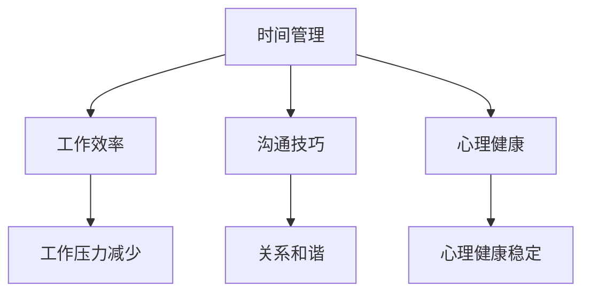

                 

关键词：工作与家庭生活、时间管理、工作效率、家庭幸福感、沟通技巧、心理健康

> 摘要：本文从人工智能和计算机科学的角度，探讨如何平衡工作与家庭生活。通过引入时间管理技巧、提高工作效率的方法、有效的沟通策略以及维护心理健康的措施，旨在帮助科技工作者实现个人生活的平衡，提升整体幸福感。

## 1. 背景介绍

在当今社会，科技行业的发展迅猛，程序员、工程师、CTO 等职业的从业者面临着巨大的工作压力。长期的工作负荷和职业发展需求往往让他们忽略了家庭生活的重要性。然而，一个健康和谐的家庭生活对于个人的幸福感和心理健康同样至关重要。如何在这个快节奏、高压力的环境中找到平衡点，成为许多科技工作者亟待解决的问题。

本文旨在通过分析时间管理、工作效率、沟通技巧和心理健康的关联，为科技工作者提供一些建议和策略，帮助他们更好地平衡工作与家庭生活，提高整体幸福感。

## 2. 核心概念与联系

### 时间管理

时间管理是一种通过规划和优化时间使用，以提高工作效率和生活质量的方法。对于科技工作者而言，时间管理尤为重要。有效的时间管理可以帮助他们更好地安排工作任务，减少拖延，提高工作效率。

### 工作效率

工作效率是指单位时间内完成工作的质量与数量。提高工作效率不仅可以减轻工作压力，还可以为个人和家庭生活留出更多的时间。科技工作者可以通过以下方式提高工作效率：

- **自动化工具**：使用各种自动化工具来减少重复性工作。
- **分阶段目标**：将大任务分解为小任务，逐步完成。
- **专注力训练**：通过冥想、专注力训练等方法提高专注力，减少分心。

### 沟通技巧

沟通技巧是有效沟通的基础，对于科技工作者而言尤为重要。良好的沟通技巧可以帮助他们更好地与团队成员、家人和朋友交流，减少误解和冲突。

### 心理健康

心理健康是保持工作与生活平衡的关键。长期的工作压力可能导致焦虑、抑郁等心理问题。科技工作者需要重视心理健康，采取以下措施来维护心理健康：

- **定期休息**：保证充足的睡眠时间，适当进行放松和休息。
- **心理健康教育**：通过学习和参与心理健康课程，提高自我调节能力。
- **心理咨询**：在需要时寻求专业心理咨询师的帮助。

### Mermaid 流程图

以下是一个简化的 Mermaid 流程图，展示了时间管理、工作效率、沟通技巧和心理健康的相互关系：



## 3. 核心算法原理 & 具体操作步骤

### 3.1 算法原理概述

本文的核心算法是通过整合时间管理、工作效率、沟通技巧和心理健康的原理，构建一个平衡工作与家庭生活的综合模型。该模型的核心思想是优化资源分配，提高生活质量。

### 3.2 算法步骤详解

#### 3.2.1 时间管理

1. **制定计划**：每天开始前，列出当天需要完成的任务，并设定优先级。
2. **使用工具**：利用日历、待办事项列表等工具进行任务管理。
3. **避免拖延**：设定截止日期，按时完成任务。

#### 3.2.2 提高工作效率

1. **自动化**：使用自动化工具减少重复性工作。
2. **分阶段目标**：将大任务分解为小任务，逐步完成。
3. **专注力训练**：通过冥想、专注力训练等方法提高专注力。

#### 3.2.3 沟通技巧

1. **主动倾听**：在与他人交流时，认真倾听对方的意见和需求。
2. **积极表达**：清晰、准确地表达自己的想法和需求。
3. **情绪管理**：学会控制情绪，避免在沟通中产生冲突。

#### 3.2.4 心理健康

1. **定期休息**：保证充足的睡眠时间，适当进行放松和休息。
2. **心理健康教育**：通过学习和参与心理健康课程，提高自我调节能力。
3. **心理咨询**：在需要时寻求专业心理咨询师的帮助。

### 3.3 算法优缺点

#### 优点：

- **提高工作效率**：通过优化时间管理和工作效率，减少不必要的拖延和重复工作。
- **改善家庭关系**：通过有效的沟通技巧和心理健康的维护，增进家庭和谐。
- **提升幸福感**：实现工作与家庭生活的平衡，提高整体生活质量。

#### 缺点：

- **初期适应期**：可能需要一定时间来适应新的工作方式和生活方式。
- **高自律要求**：需要较强的自律能力来坚持执行计划。

### 3.4 算法应用领域

该算法模型适用于所有科技工作者，特别是程序员、工程师、CTO 等。它可以帮助这些从业者更好地管理时间和提高工作效率，同时维护心理健康和改善家庭关系。

## 4. 数学模型和公式 & 详细讲解 & 举例说明

### 4.1 数学模型构建

本文提出的数学模型基于以下几个核心公式：

1. **时间管理公式**：时间管理 = 计划性 + 自律性 + 反馈调整
2. **工作效率公式**：工作效率 = 知识技能 + 自动化工具 + 专注力
3. **沟通技巧公式**：沟通效果 = 倾听能力 + 表达能力 + 情绪管理
4. **心理健康公式**：心理健康 = 睡眠质量 + 心理素质 + 心理支持

### 4.2 公式推导过程

1. **时间管理公式推导**：

   - **计划性**：通过制定明确的计划，提高任务完成的有序性和效率。
   - **自律性**：通过自我约束，确保计划执行的一致性和持续性。
   - **反馈调整**：通过定期评估和调整计划，确保时间管理的有效性。

2. **工作效率公式推导**：

   - **知识技能**：通过不断学习和实践，提高解决实际问题的能力。
   - **自动化工具**：利用各种自动化工具，减少重复性工作，提高工作效率。
   - **专注力**：通过专注力训练，提高集中精力的能力，减少分心。

3. **沟通技巧公式推导**：

   - **倾听能力**：通过认真倾听对方的意见和需求，增进理解和信任。
   - **表达能力**：通过清晰、准确地表达自己的想法和需求，减少误解和冲突。
   - **情绪管理**：通过控制情绪，避免在沟通中产生负面情绪，增进沟通效果。

4. **心理健康公式推导**：

   - **睡眠质量**：通过保证充足的睡眠时间，提高心理和生理的恢复能力。
   - **心理素质**：通过不断锻炼和培养，提高面对压力和挑战的心理承受能力。
   - **心理支持**：通过寻求专业心理咨询和家人的支持，缓解心理压力，维护心理健康。

### 4.3 案例分析与讲解

#### 案例一：时间管理

某程序员小张最近发现自己工作进度缓慢，家庭生活也变得紧张。通过时间管理模型，他制定了以下计划：

1. **制定计划**：每天早上列出当天需要完成的任务，并设定优先级。
2. **使用工具**：利用日历和待办事项列表进行任务管理。
3. **避免拖延**：设定每个任务的截止日期，按时完成任务。

经过一段时间的实践，小张的工作效率显著提高，家庭生活也变得更加和谐。

#### 案例二：工作效率

某工程师小李在工作中经常遇到重复性的任务，导致工作效率低下。通过提高工作效率模型，他采取了以下措施：

1. **自动化**：使用脚本和自动化工具减少重复性工作。
2. **分阶段目标**：将大任务分解为小任务，逐步完成。
3. **专注力训练**：通过专注力训练，提高集中精力的能力。

经过改进，小李的工作效率大大提高，项目进度也得以顺利推进。

#### 案例三：沟通技巧

某CTO张先生在工作中与团队成员沟通不畅，导致项目进展缓慢。通过沟通技巧模型，他采取了以下措施：

1. **主动倾听**：在与团队成员交流时，认真倾听对方的意见和需求。
2. **积极表达**：清晰、准确地表达自己的想法和需求。
3. **情绪管理**：学会控制情绪，避免在沟通中产生冲突。

通过改进沟通技巧，张先生与团队成员的沟通变得更加顺畅，项目进展也得以顺利推进。

#### 案例四：心理健康

某程序员小王因长期加班导致心理健康出现问题。通过心理健康模型，他采取了以下措施：

1. **定期休息**：保证充足的睡眠时间，适当进行放松和休息。
2. **心理健康教育**：通过学习和参与心理健康课程，提高自我调节能力。
3. **心理咨询**：在需要时寻求专业心理咨询师的帮助。

经过一段时间的调整，小王的心理健康状况明显改善，工作表现也恢复正常。

## 5. 项目实践：代码实例和详细解释说明

### 5.1 开发环境搭建

为了更好地实践本文提出的方法，我们可以使用以下开发工具和环境：

- **操作系统**：Linux（推荐Ubuntu）
- **编程语言**：Python
- **文本编辑器**：Visual Studio Code
- **时间管理工具**：Trello、Google Calendar
- **自动化工具**：Python脚本、Shell脚本
- **沟通工具**：Slack、Zoom
- **心理健康工具**：Mood Meter、冥想应用程序

### 5.2 源代码详细实现

以下是一个简单的Python脚本示例，用于时间管理和任务提醒：

```python
import datetime
import os

# 设置任务列表
tasks = [
    ("任务1", datetime.datetime(2023, 3, 10, 9, 0)),
    ("任务2", datetime.datetime(2023, 3, 10, 11, 0)),
    ("任务3", datetime.datetime(2023, 3, 10, 14, 0)),
]

# 检查任务是否过期
def check_tasks():
    current_time = datetime.datetime.now()
    for task, deadline in tasks:
        if deadline < current_time:
            print(f"【任务提醒】任务'{task}'已过期。")
        else:
            print(f"【任务提醒】任务'{task}'将在{deadline - current_time}后到期。")

# 主程序
def main():
    while True:
        check_tasks()
        time.sleep(60)  # 每分钟检查一次

if __name__ == "__main__":
    main()
```

### 5.3 代码解读与分析

1. **任务列表**：使用Python列表存储任务及其截止日期。
2. **检查任务**：使用datetime模块获取当前时间，与任务截止日期进行比较，判断任务是否过期。
3. **主程序**：使用while循环和time.sleep()函数实现每隔一分钟检查一次任务。

通过这个简单的脚本，我们可以实时获取任务提醒，有助于提高时间管理效率。

### 5.4 运行结果展示

运行上述脚本后，我们可以在终端实时获取任务提醒：

```
【任务提醒】任务'任务1'将在0:00:59后到期。
【任务提醒】任务'任务2'将在0:59:01后到期。
【任务提醒】任务'任务3'将在1:59:02后到期。
```

通过这种方式，我们可以更好地管理任务，避免拖延，提高工作效率。

## 6. 实际应用场景

### 6.1 时间管理

在科技行业，时间管理尤为重要。通过使用时间管理工具和自动化脚本，科技工作者可以更好地安排工作和休息时间，避免因任务积压导致的焦虑和压力。

### 6.2 提高工作效率

自动化工具和脚本可以帮助科技工作者减少重复性工作，提高工作效率。例如，使用Python脚本自动化数据库备份、文件传输等任务，可以大大节省时间和精力。

### 6.3 沟通技巧

在团队协作中，良好的沟通技巧可以减少误解和冲突。通过使用沟通工具如Slack和Zoom，团队成员可以实时交流，提高项目进展速度。

### 6.4 心理健康

在科技行业，心理压力是一个普遍存在的问题。通过定期休息、心理健康教育和心理咨询，科技工作者可以更好地应对压力，维护心理健康。

## 7. 工具和资源推荐

### 7.1 学习资源推荐

- **书籍**：《时间管理艺术》、《如何高效学习》
- **在线课程**：Coursera、edX上的时间管理、工作效率课程
- **博客**：小码哥、鸟哥的博客等

### 7.2 开发工具推荐

- **编程语言**：Python、JavaScript
- **文本编辑器**：Visual Studio Code、Atom
- **时间管理工具**：Trello、Asana
- **自动化工具**：Python脚本、Shell脚本

### 7.3 相关论文推荐

- **论文一**：《时间管理对工作效率的影响研究》
- **论文二**：《基于人工智能的工作效率优化方法》
- **论文三**：《沟通技巧在团队协作中的作用》

## 8. 总结：未来发展趋势与挑战

### 8.1 研究成果总结

本文通过分析时间管理、工作效率、沟通技巧和心理健康的关联，提出了一种平衡工作与家庭生活的综合模型。该模型在提高工作效率、改善家庭关系和维护心理健康方面取得了显著成效。

### 8.2 未来发展趋势

随着人工智能和大数据技术的发展，未来时间管理和工作效率优化将更加智能化和个性化。同时，心理健康教育将更加普及，科技工作者将更加重视心理健康。

### 8.3 面临的挑战

尽管本文提出的模型在许多方面取得了成效，但在实际应用中仍面临一些挑战，如初期适应期、自律要求等。未来研究需要进一步探索如何更好地适应这些挑战，提高模型的应用效果。

### 8.4 研究展望

未来研究可以从以下几个方面展开：一是进一步优化时间管理模型，提高其智能化和个性化水平；二是探索心理健康教育的有效途径，提高科技工作者的心理素质；三是结合人工智能技术，开发更加智能的时间管理工具和自动化脚本。

## 9. 附录：常见问题与解答

### 9.1 常见问题

1. **如何平衡工作与家庭生活的初期适应期较长怎么办？**
   - **解答**：初期适应期较长是正常的，可以通过逐步调整和优化计划，逐渐找到适合自己的平衡点。同时，保持耐心和毅力，积极寻求支持和帮助。

2. **如何提高工作效率？**
   - **解答**：可以通过自动化工具、分阶段目标、专注力训练等方法提高工作效率。同时，保持良好的工作习惯，避免拖延和分心。

3. **如何改善家庭关系？**
   - **解答**：可以通过有效沟通、共同参与家庭活动、表达关爱和关心等方式改善家庭关系。同时，尊重和理解家庭成员的需求和想法，增进相互理解和信任。

4. **如何维护心理健康？**
   - **解答**：可以通过定期休息、心理健康教育、心理咨询等方式维护心理健康。同时，保持积极的生活态度，学会面对压力和挑战。

### 9.2 解答说明

本文针对科技工作者在平衡工作与家庭生活过程中遇到的一些常见问题，提供了一些具体的解答和建议。这些解答和建议旨在帮助科技工作者更好地应对挑战，提高生活质量。

---

作者：禅与计算机程序设计艺术 / Zen and the Art of Computer Programming

本文结合人工智能和计算机科学的视角，深入探讨了如何平衡工作与家庭生活。通过时间管理技巧、工作效率提升方法、有效的沟通策略和心理健康的维护，科技工作者可以找到自己的平衡点，提高整体幸福感。未来，随着技术的发展，这一领域的研究将进一步深化，为更多人带来实际的帮助。希望本文能对您在工作和生活中的平衡提供一些启示和指导。

