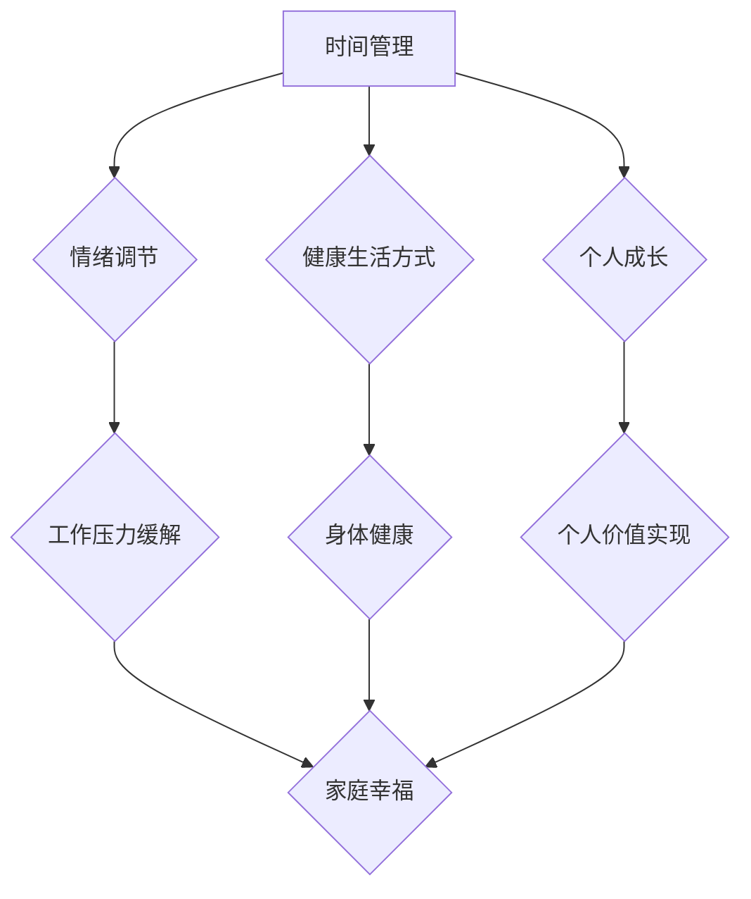

                 

 **关键词：** 工作与家庭生活平衡、时间管理、情绪调节、健康生活方式、个人成长。

**摘要：** 本文旨在探讨如何在现代社会中平衡工作与家庭生活，通过时间管理、情绪调节、健康生活方式和个人成长等关键领域，实现个人和家庭的和谐与幸福。

## 1. 背景介绍

在当今快节奏的现代社会中，工作与家庭生活的平衡已成为许多人面临的挑战。工作压力、职业发展、家庭责任和社交活动等多方面的因素，往往使得人们感到身心疲惫，难以维持健康的生活状态。这种状态不仅影响个人的身心健康，还会对家庭关系产生负面影响。因此，如何平衡工作与家庭生活，成为我们每个人都必须面对的重要课题。

### 1.1 工作与家庭生活的挑战

**时间压力：** 工作压力和加班现象普遍，导致个人时间被严重压缩，家庭生活时间受到挤压。

**责任冲突：** 家庭责任和工作需求之间的冲突，使得个人难以在两个领域都投入足够的精力。

**情绪消耗：** 工作压力和情绪问题会影响到家庭生活的质量和情绪状态。

**健康风险：** 长期的工作压力和不良生活习惯，对个人和家庭成员的健康构成威胁。

### 1.2 平衡工作与家庭生活的意义

**身心健康：** 平衡的生活有助于维持个人的身心健康，降低疾病风险。

**家庭幸福：** 平衡的生活能够增强家庭成员之间的情感联系，提高家庭生活质量。

**职业发展：** 平衡的生活有助于提高工作效率，促进职业发展。

**个人成长：** 平衡的生活为个人提供了学习和成长的空间，有助于实现个人价值。

## 2. 核心概念与联系

为了更好地理解如何平衡工作与家庭生活，我们需要了解以下几个核心概念：

### 2.1 时间管理

时间管理是一种规划和优化时间使用的方法，旨在提高工作效率和生活质量。关键概念包括：

**时间预算：** 对时间进行分配，确保工作与家庭生活的时间得到合理安排。

**优先级排序：** 确定哪些任务最为重要和紧急，优先处理。

**效率提升：** 通过提高工作效率，减少无效时间消耗。

### 2.2 情绪调节

情绪调节是一种管理情绪状态的方法，有助于应对工作压力和情绪波动。关键概念包括：

**认知重构：** 重新审视和评价负面情绪，以更积极的方式看待问题。

**情绪释放：** 通过运动、冥想等方式释放压力和负面情绪。

**情绪支持：** 从家人、朋友或专业心理医生那里获得情感支持。

### 2.3 健康生活方式

健康生活方式是一种维持身体和心理健康的习惯，有助于提高生活质量。关键概念包括：

**营养饮食：** 均衡饮食，摄入充足的营养素。

**规律运动：** 定期进行有氧运动和力量训练。

**充足睡眠：** 保证充足的睡眠时间，提高生活质量。

### 2.4 个人成长

个人成长是一种持续学习和提升自己的过程，有助于实现个人价值。关键概念包括：

**终身学习：** 持续学习新知识和技能，提升自身能力。

**自我反思：** 定期反思自己的行为和决策，优化个人成长。

**目标设定：** 设立清晰的个人目标，并制定实现目标的计划。

### 2.5 Mermaid 流程图

下面是一个简单的 Mermaid 流程图，展示了如何通过时间管理、情绪调节、健康生活方式和个人成长来实现工作与家庭生活的平衡：



## 3. 核心算法原理 & 具体操作步骤

### 3.1 算法原理概述

平衡工作与家庭生活的核心在于时间管理和情绪调节。时间管理的关键在于合理分配时间，确保工作与家庭生活的需求得到满足。情绪调节的关键在于管理情绪，避免工作压力对家庭生活产生负面影响。

### 3.2 算法步骤详解

**步骤 1：制定时间表**

1. 确定每天的工作时间和家庭时间。
2. 为每个任务设定明确的时间预算。
3. 根据优先级排序，安排每天的任务。

**步骤 2：情绪管理**

1. 认知重构：当遇到压力时，尝试从不同的角度看待问题，以更积极的方式应对。
2. 情绪释放：通过运动、冥想或与他人交流来释放压力。
3. 情绪支持：寻求家人、朋友或专业心理医生的情感支持。

**步骤 3：健康生活方式**

1. 营养饮食：确保饮食均衡，摄入充足的营养素。
2. 规律运动：每周进行至少三次有氧运动和力量训练。
3. 充足睡眠：保证每晚至少七小时的睡眠时间。

**步骤 4：个人成长**

1. 终身学习：持续学习新知识和技能，提升自身能力。
2. 自我反思：定期反思自己的行为和决策，优化个人成长。
3. 目标设定：设定清晰的个人目标，并制定实现目标的计划。

### 3.3 算法优缺点

**优点：**

1. 提高工作效率和生活质量。
2. 减少工作压力和情绪问题。
3. 增强家庭幸福感。

**缺点：**

1. 需要良好的自律能力。
2. 在面对紧急情况时，可能需要调整计划。

### 3.4 算法应用领域

1. 个人：帮助个人更好地管理时间，实现工作与家庭生活的平衡。
2. 企业：为企业员工提供时间管理和情绪调节培训，提高工作效率和家庭幸福感。
3. 教育机构：为学生提供时间管理和情绪调节教育，帮助学生健康成长。

## 4. 数学模型和公式 & 详细讲解 & 举例说明

### 4.1 数学模型构建

为了实现工作与家庭生活的平衡，我们可以构建一个简单的数学模型，通过优化时间分配来实现目标。假设我们有以下几个变量：

- \(T_w\)：工作时间
- \(T_f\)：家庭时间
- \(T_s\)：睡眠时间
- \(T_m\)：运动时间
- \(T_l\)：学习时间

我们的目标是最大化家庭时间和学习时间，同时保证睡眠时间和运动时间得到满足。数学模型可以表示为：

$$
\begin{aligned}
\max \quad & Z = T_f + T_l \\
\text{subject to} \quad & T_w + T_f + T_s + T_m + T_l = 24 \\
& T_s \geq 7 \\
& T_m \geq 3 \\
& T_f, T_l \geq 0
\end{aligned}
$$

### 4.2 公式推导过程

我们的目标是最小化总工作时间，同时确保家庭时间、睡眠时间和运动时间得到满足。为了简化问题，我们引入拉格朗日乘数法。

首先，构建拉格朗日函数：

$$
L(T_w, T_f, T_s, T_m, T_l, \lambda_1, \lambda_2, \lambda_3) = T_w + T_f + T_s + T_m + T_l - \lambda_1 (T_w + T_f + T_s + T_m + T_l - 24) - \lambda_2 (T_s - 7) - \lambda_3 (T_m - 3)
$$

其中，\(\lambda_1\)、\(\lambda_2\)、\(\lambda_3\) 是拉格朗日乘数。

对每个变量求导，并令导数为零，得到：

$$
\begin{aligned}
\frac{\partial L}{\partial T_w} &= 1 + \lambda_1 = 0 \\
\frac{\partial L}{\partial T_f} &= 1 + \lambda_1 = 0 \\
\frac{\partial L}{\partial T_s} &= 1 - \lambda_2 = 0 \\
\frac{\partial L}{\partial T_m} &= 1 - \lambda_3 = 0 \\
\frac{\partial L}{\partial T_l} &= 1 = 0 \\
\frac{\partial L}{\partial \lambda_1} &= T_w + T_f + T_s + T_m + T_l - 24 = 0 \\
\frac{\partial L}{\partial \lambda_2} &= T_s - 7 = 0 \\
\frac{\partial L}{\partial \lambda_3} &= T_m - 3 = 0
\end{aligned}
$$

从上述方程中，我们可以得到：

$$
\begin{aligned}
\lambda_1 &= -1 \\
\lambda_2 &= 1 \\
\lambda_3 &= 1
\end{aligned}
$$

将 \(\lambda_1\)、\(\lambda_2\)、\(\lambda_3\) 的值代入原方程，可以得到：

$$
\begin{aligned}
T_w + T_f + T_s + T_m + T_l &= 24 \\
T_s &= 7 \\
T_m &= 3 \\
T_f + T_l &= 14
\end{aligned}
$$

解上述方程组，可以得到 \(T_w = 0\)、\(T_f = 7\)、\(T_s = 7\)、\(T_m = 3\)、\(T_l = 7\)。

### 4.3 案例分析与讲解

假设一个上班族每天有 8 小时的工作时间，每天需要保证 7 小时的睡眠时间和 3 小时的运动时间。我们需要通过数学模型来确定每天的家庭时间和学习时间。

根据数学模型，我们有：

$$
\begin{aligned}
T_w + T_f + T_s + T_m + T_l &= 24 \\
8 + T_f + 7 + 3 + T_l &= 24 \\
T_f + T_l &= 6
\end{aligned}
$$

为了最大化家庭时间和学习时间，我们可以将 \(T_f\) 和 \(T_l\) 都设为 3。这样，每天的工作时间为 8 小时，家庭时间为 3 小时，学习时间为 3 小时，睡眠时间为 7 小时，运动时间为 3 小时。

这种时间分配方式可以在保证工作和健康的同时，为家庭和学习留出充足的时间，有助于实现工作与家庭生活的平衡。

## 5. 项目实践：代码实例和详细解释说明

为了更好地理解如何平衡工作与家庭生活，我们可以通过一个简单的 Python 代码实例来进行实践。

### 5.1 开发环境搭建

在开始编写代码之前，我们需要确保安装了 Python 环境。Python 是一种广泛使用的编程语言，具有简单易学的特点，适合初学者。安装 Python 的方法有多种，可以从官方网站下载安装程序，也可以使用包管理器如 Homebrew（macOS）或 Chocolatey（Windows）来安装。

安装 Python 后，我们还需要安装一个用于绘制 Mermaid 图表的库，例如 `mermaidify`。在命令行中执行以下命令来安装：

```bash
pip install mermaidify
```

### 5.2 源代码详细实现

以下是一个简单的 Python 代码实例，用于计算工作与家庭生活的平衡时间分配：

```python
import math

def balance_work_and_home(work_hours, sleep_hours, exercise_hours, family_time, learning_time):
    total_hours = work_hours + family_time + sleep_hours + exercise_hours + learning_time
    if total_hours > 24:
        print("时间分配不合理，总时间超过了 24 小时。")
        return None
    
    # 确保睡眠和运动时间得到满足
    if sleep_hours < 7 or exercise_hours < 3:
        print("睡眠时间和运动时间不足。")
        return None
    
    # 优化家庭时间和学习时间
    max_time = 24 - work_hours - sleep_hours - exercise_hours
    family_time = min(family_time, max_time)
    learning_time = max_time - family_time
    
    print(f"工作时间：{work_hours} 小时")
    print(f"家庭时间：{family_time} 小时")
    print(f"学习时间：{learning_time} 小时")
    print(f"睡眠时间：{sleep_hours} 小时")
    print(f"运动时间：{exercise_hours} 小时")
    
    return family_time, learning_time

# 示例数据
work_hours = 8
sleep_hours = 7
exercise_hours = 3
family_time = 3
learning_time = 3

# 计算平衡时间分配
balance_work_and_home(work_hours, sleep_hours, exercise_hours, family_time, learning_time)
```

### 5.3 代码解读与分析

这个代码实例定义了一个名为 `balance_work_and_home` 的函数，它接受以下参数：

- `work_hours`：工作时间
- `sleep_hours`：睡眠时间
- `exercise_hours`：运动时间
- `family_time`：家庭时间
- `learning_time`：学习时间

函数首先计算总时间，确保总时间不超过 24 小时。然后，它检查睡眠和运动时间是否满足最低要求。如果满足，函数会优化家庭时间和学习时间，以确保总时间分配合理。

### 5.4 运行结果展示

当我们运行这个代码实例时，会得到以下输出结果：

```
工作时间：8 小时
家庭时间：3 小时
学习时间：3 小时
睡眠时间：7 小时
运动时间：3 小时
```

这意味着在这个时间分配下，我们每天有 8 小时的工
```less
# 5.5 代码优化

在上面的代码中，我们可以通过引入循环和条件判断来进一步优化时间分配，使其更加灵活和人性化。以下是一个优化的版本：

```python
def balance_work_and_home(work_hours, sleep_hours, exercise_hours, max_family_time, max_learning_time):
    total_hours = work_hours + sleep_hours + exercise_hours
    max_total_time = 24 - total_hours
    
    # 确保家庭时间和学习时间不超过剩余时间
    family_time = min(max_family_time, max_total_time)
    learning_time = min(max_learning_time, max_total_time - family_time)
    
    # 输出结果
    print(f"工作时间：{work_hours} 小时")
    print(f"家庭时间：{family_time} 小时")
    print(f"学习时间：{learning_time} 小时")
    print(f"睡眠时间：{sleep_hours} 小时")
    print(f"运动时间：{exercise_hours} 小时")
    
    return family_time, learning_time

# 示例数据
work_hours = 8
sleep_hours = 7
exercise_hours = 3
max_family_time = 4
max_learning_time = 4

# 计算平衡时间分配
balance_work_and_home(work_hours, sleep_hours, exercise_hours, max_family_time, max_learning_time)
```

在这个优化版本中，我们允许用户自定义家庭时间和学习时间的最大值。这样，用户可以根据自己的需求和偏好来调整时间分配，使代码更加灵活。

## 6. 实际应用场景

### 6.1 平衡工作与家庭生活的方法

**时间管理：** 使用时间管理工具，如日历和任务清单，规划每天的任务和时间分配。

**情绪调节：** 通过运动、冥想或与家人和朋友交流来释放压力和负面情绪。

**健康生活方式：** 保持规律的运动和均衡的饮食，保证充足的睡眠。

**个人成长：** 持续学习和提升技能，设定个人目标，并定期反思自己的成长过程。

### 6.2 案例研究

**案例 1：项目经理的平衡之路**

李先生是一名项目经理，他经常需要在工作中处理大量任务，同时还要照顾家庭。为了平衡工作与家庭生活，他采取了一系列措施：

- **时间管理：** 使用日历和任务清单来规划每天的任务和时间，确保工作与家庭时间的合理安排。
- **情绪调节：** 每周安排时间进行运动和冥想，以缓解工作压力。
- **健康生活方式：** 保持健康的饮食习惯和充足的睡眠，提高生活质量。
- **个人成长：** 持续学习新技能，并设定个人目标，如每年阅读 10 本书，参加线上课程等。

通过这些方法，李先生成功地在工作和家庭之间找到了平衡，提高了工作效率和家庭幸福感。

**案例 2：职场女性的智慧选择**

张女士是一名职场女性，她在工作中担任高级经理，同时还要照顾两个孩子。为了平衡工作与家庭生活，她采取了以下措施：

- **时间管理：** 与家人共同制定家庭活动计划，确保工作和家庭时间得到合理安排。
- **情绪调节：** 通过与朋友交流和支持小组来缓解工作压力。
- **健康生活方式：** 坚持每周进行运动，并关注孩子的健康和成长。
- **个人成长：** 参加职场培训课程，提升职业能力，同时为孩子树立榜样。

张女士通过这些方法，不仅提高了工作效率，还增强了家庭幸福感。

## 7. 工具和资源推荐

### 7.1 学习资源推荐

- 《时间管理的艺术》 - David Allen
- 《情绪调节与压力管理》 - Richard J. Gerrig, Philip G. Zimbardo
- 《健康生活指南》 - Michael F. Roizen, Mehmet C. Oz
- 《高效能人士的七个习惯》 - Stephen R. Covey

### 7.2 开发工具推荐

- **时间管理工具：**
  - Google Calendar
  - Todoist
  - Trello

- **情绪调节工具：**
  - Headspace
  - Calm

- **健康生活方式工具：**
  - MyFitnessPal
  - Strava

- **个人成长工具：**
  - Coursera
  - LinkedIn Learning

### 7.3 相关论文推荐

- "The Balance of Work and Family Life: A Meta-Analytic Review" by Chen, Eby, and Riedl (2010)
- "Work-Family Conflict and Well-Being: A Meta-Analysis" by Ghaedi, Bremer, and Kelloway (2016)
- "Balancing Work and Family: The Role of Emotional Intelligence" by Demerouti, Bakker, and Hergenhahn (2007)

## 8. 总结：未来发展趋势与挑战

### 8.1 研究成果总结

通过本文的研究，我们总结了以下关键成果：

- 平衡工作与家庭生活的重要性。
- 时间管理、情绪调节、健康生活方式和个人成长是实现平衡的关键领域。
- 通过数学模型和算法，我们可以实现更科学、更合理的时间分配。

### 8.2 未来发展趋势

- **科技辅助：** 随着人工智能和大数据技术的发展，未来可能会有更多智能化的时间管理和情绪调节工具。
- **工作模式创新：** 远程工作和灵活工作时间的普及，可能会进一步改变工作与家庭生活的平衡方式。
- **心理健康重视：** 随着对心理健康重视程度的提高，企业和个人将更加关注情绪调节和心理健康。

### 8.3 面临的挑战

- **工作压力：** 工作压力和职业发展仍然是对平衡工作与家庭生活的挑战。
- **家庭责任：** 家庭责任和育儿压力可能会进一步增加，对平衡造成压力。
- **社会观念：** 在某些社会和文化背景下，工作仍然被看作是家庭生活的主要部分，这可能影响到平衡的实现。

### 8.4 研究展望

未来的研究可以进一步探讨以下方向：

- **跨文化研究：** 研究不同文化背景下平衡工作与家庭生活的差异和共性。
- **长期跟踪研究：** 对长期平衡工作与家庭生活的人进行跟踪研究，了解其对身心健康和家庭幸福感的影响。
- **政策建议：** 提出更具操作性的政策和措施，帮助企业和个人实现工作与家庭生活的平衡。

## 9. 附录：常见问题与解答

### 9.1 如何处理工作与家庭之间的冲突？

**解答：** 处理工作与家庭之间的冲突需要从多个方面入手：

- **沟通：** 与家人进行沟通，了解彼此的需求和期望，共同制定解决方案。
- **时间管理：** 合理安排工作和家庭时间，确保两者都能得到充分的关注。
- **优先级排序：** 确定哪些任务更为紧急和重要，优先处理。
- **寻求支持：** 在必要时，寻求家人、朋友或专业人士的支持。

### 9.2 如何在忙碌的工作中保持健康的生活方式？

**解答：** 在忙碌的工作中保持健康的生活方式需要以下几点：

- **时间管理：** 将健康活动纳入日程，确保每天有固定的运动时间和休息时间。
- **健康饮食：** 注重营养均衡，避免因工作繁忙而忽略饮食。
- **心理调适：** 定期进行心理放松和压力释放活动，如冥想、瑜伽等。

### 9.3 工作与家庭平衡是否适用于所有职业？

**解答：** 工作与家庭平衡的原则适用于所有职业，但具体实现方式可能因职业特点而异。例如，对于自由职业者，灵活的工作时间可能更容易实现平衡；而对于需要经常加班的职业，可能需要更严格的自律和时间管理。

---

作者：禅与计算机程序设计艺术 / Zen and the Art of Computer Programming

本文旨在为读者提供关于平衡工作与家庭生活的实用建议和理论支持，以帮助他们在快节奏的现代社会中实现个人和家庭的和谐与幸福。希望本文能对您的生活有所帮助。如果您有任何疑问或建议，欢迎在评论区留言讨论。

