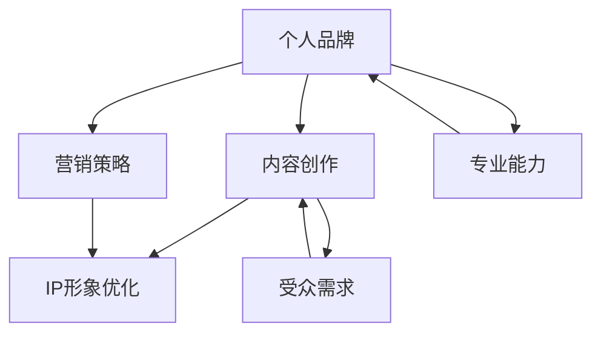

                 

关键词：知识付费、个人品牌、IP打造、内容创作、营销策略

摘要：本文将探讨如何在知识付费领域打造个人品牌IP。通过深入了解目标受众、持续高质量内容创作、有效营销策略以及不断优化IP形象，作者将分享如何成功打造个人知识付费品牌IP的经验与策略。

## 1. 背景介绍

在数字时代的今天，知识付费已经成为一个日益增长的行业。越来越多的人通过付费内容来学习新知识、提升技能。与此同时，个人品牌IP（Intellectual Property，即知识产权）的打造也成为众多知识创作者追求的目标。一个强大的个人知识付费品牌IP不仅可以为创作者带来稳定的收入，还能够提升其个人影响力，形成一种独特的竞争优势。

然而，打造一个成功的个人知识付费品牌IP并非易事，它需要创作者在多个方面进行深入的思考和精心的策划。本文将从以下几个方面展开讨论：

1. **了解目标受众**：了解受众的需求和痛点，是打造个人知识付费品牌IP的第一步。
2. **持续高质量内容创作**：内容是知识付费品牌的核心，持续产出高质量的内容是品牌持续发展的基础。
3. **有效营销策略**：通过多种营销手段，扩大品牌影响力，吸引更多的关注者和付费用户。
4. **不断优化IP形象**：一个成功的IP需要不断适应市场变化，优化自身形象以保持吸引力。

### 1.1 知识付费行业现状

随着互联网技术的不断发展，知识付费行业呈现出迅猛增长的态势。根据相关报告，2022年中国在线教育市场规模已达到5000亿元人民币，其中知识付费市场规模占据了一部分重要份额。从线上课程到电子书，从专业咨询到个人教练，知识付费的形式越来越多样化。

在这个市场中，个人品牌IP的重要性日益凸显。拥有一个强大的个人知识付费品牌IP，可以帮助创作者在竞争激烈的市场中脱颖而出，建立信任和忠诚度。此外，IP的建立还能为创作者带来更多的商业机会，如开设线上工作坊、举办线下活动、推出周边产品等。

### 1.2 个人品牌IP的价值

个人品牌IP的价值不仅体现在经济收益上，更体现在对创作者个人影响力的提升上。一个成功的IP可以成为创作者的标识，使其在众多创作者中脱颖而出。以下是个人品牌IP的一些具体价值：

- **增强信任感**：一个强大的IP能够建立受众对创作者的信任，提高转化率。
- **扩大影响力**：通过IP的传播，创作者能够触及到更多的受众，扩大其影响力。
- **提升品牌价值**：强大的IP可以提升整体品牌的附加值，带来更高的经济回报。
- **增加商业机会**：IP的建立为创作者创造了更多的商业机会，如代言、咨询、培训等。

## 2. 核心概念与联系

在打造个人知识付费品牌IP的过程中，了解以下几个核心概念和它们之间的联系是非常关键的。

### 2.1 个人品牌（Personal Brand）

个人品牌是指个人在公众心中的形象和认知。在知识付费领域，个人品牌不仅是创作者的专业形象，更是其价值观、个性特点和专长能力的体现。

### 2.2 内容创作（Content Creation）

内容创作是知识付费品牌的核心。高质量的内容不仅能够满足受众的学习需求，还能够提升个人品牌的信任度和吸引力。

### 2.3 营销策略（Marketing Strategy）

营销策略是扩大个人知识付费品牌影响力的关键。通过有效的营销手段，创作者能够吸引更多的受众，提高品牌知名度。

### 2.4 IP形象优化（IP Image Optimization）

IP形象优化是保持IP活力和吸引力的关键。通过不断调整和优化IP形象，创作者能够适应市场变化，保持品牌的新鲜感。

以下是构建个人知识付费品牌IP的Mermaid流程图：



### 2.5 个人品牌与受众需求的联系

个人品牌与受众需求之间存在密切的联系。了解目标受众的需求和痛点，能够帮助创作者更精准地定位个人品牌，从而创作出更符合受众期待的内容。

### 2.6 内容创作与IP形象优化的联系

内容创作是IP形象优化的重要一环。高质量的内容不仅能够提升个人品牌的信任度，还能够塑造独特的IP形象，使其在市场中脱颖而出。

### 2.7 营销策略与IP形象优化的联系

有效的营销策略能够扩大IP的影响力，提高品牌知名度。同时，通过营销活动，创作者能够收集受众反馈，进一步优化IP形象。

## 3. 核心算法原理 & 具体操作步骤

### 3.1 算法原理概述

在打造个人知识付费品牌IP的过程中，可以借鉴一些核心算法原理，以指导具体的操作步骤。以下是几个关键算法原理：

1. **目标定位算法**：帮助创作者确定个人品牌的核心定位，明确目标受众和市场需求。
2. **内容优化算法**：通过分析受众反馈和市场需求，不断优化内容质量，提升用户满意度。
3. **品牌传播算法**：利用社交媒体和网络营销工具，扩大品牌影响力，提高知名度。
4. **用户增长算法**：通过精细化运营和数据分析，提高用户留存率和转化率。

### 3.2 算法步骤详解

1. **目标定位算法**
   - **需求分析**：通过市场调研和用户访谈，了解目标受众的需求和痛点。
   - **竞争分析**：分析同行业竞争对手的定位和优势，找准个人品牌的差异化方向。
   - **定位决策**：结合需求和竞争分析结果，明确个人品牌的核心定位。

2. **内容优化算法**
   - **内容策划**：根据目标定位，制定内容创作计划，确保内容与品牌定位一致。
   - **内容审核**：通过用户反馈和市场反馈，对内容进行评估和改进。
   - **内容发布**：定期发布高质量内容，保持内容的持续更新和优化。

3. **品牌传播算法**
   - **社交媒体推广**：利用微博、微信、抖音等社交媒体平台，扩大品牌影响力。
   - **网络营销活动**：举办线上讲座、互动活动、抽奖等，吸引更多受众参与。
   - **合作伙伴关系**：与其他品牌或KOL合作，实现资源共享和品牌联动。

4. **用户增长算法**
   - **用户画像**：通过数据分析，了解用户的兴趣、行为和需求。
   - **用户互动**：通过私信、评论、点赞等方式，与用户建立互动关系。
   - **用户留存**：通过会员制度、课程更新等方式，提高用户留存率。
   - **用户转化**：通过优惠活动、限时折扣等策略，提高用户转化率。

### 3.3 算法优缺点

1. **目标定位算法**
   - **优点**：明确个人品牌的核心定位，有利于资源的集中利用和品牌的差异化竞争。
   - **缺点**：需要耗费一定的时间和精力进行市场调研和竞争分析。

2. **内容优化算法**
   - **优点**：通过用户反馈和市场反馈，能够不断优化内容质量，提高用户满意度。
   - **缺点**：内容优化需要持续进行，否则容易出现内容同质化问题。

3. **品牌传播算法**
   - **优点**：利用社交媒体和网络营销工具，能够快速扩大品牌影响力。
   - **缺点**：营销效果受社交媒体平台政策变化的影响较大。

4. **用户增长算法**
   - **优点**：通过精细化运营和数据分析，能够提高用户留存率和转化率。
   - **缺点**：需要投入大量资源和人力进行用户画像和数据分析。

### 3.4 算法应用领域

目标定位算法、内容优化算法、品牌传播算法和用户增长算法在个人知识付费品牌IP的打造中具有广泛的应用。以下是一些具体的应用场景：

- **教育领域**：通过目标定位算法，明确教育内容的定位和受众；通过内容优化算法，不断改进课程内容和教学方法；通过品牌传播算法，扩大教育品牌的影响力；通过用户增长算法，提高学员的留存率和转化率。
- **技能培训领域**：通过目标定位算法，确定技能培训的细分市场；通过内容优化算法，提高课程内容的质量和实用性；通过品牌传播算法，吸引更多潜在学员；通过用户增长算法，提高学员的学习积极性和转化率。
- **个人咨询领域**：通过目标定位算法，明确个人咨询的服务内容和受众；通过内容优化算法，提升咨询服务质量；通过品牌传播算法，扩大个人咨询品牌的影响力；通过用户增长算法，提高客户的满意度和忠诚度。

## 4. 数学模型和公式 & 详细讲解 & 举例说明

### 4.1 数学模型构建

在打造个人知识付费品牌IP的过程中，数学模型可以帮助我们更好地理解受众需求、优化内容质量和评估营销效果。以下是几个关键的数学模型：

1. **受众需求模型**：通过分析用户行为数据和用户反馈，构建受众需求模型，预测受众的兴趣和偏好。
2. **内容质量模型**：通过用户评分、点赞数、评论等数据，构建内容质量模型，评估内容的质量和受众满意度。
3. **营销效果模型**：通过广告投放成本、点击率、转化率等数据，构建营销效果模型，评估不同营销手段的效果。

### 4.2 公式推导过程

1. **受众需求模型公式**

   假设用户A对内容X的兴趣度评分为\( r_x \)，用户B对内容X的兴趣度评分为\( r_y \)，则内容X的整体兴趣度评分可以通过以下公式计算：

   \[
   R_x = \frac{r_x + r_y}{2}
   \]

   其中，\( R_x \) 表示内容X的整体兴趣度评分。

2. **内容质量模型公式**

   假设内容X的用户评分为\( S_x \)，点赞数为\( L_x \)，评论数为\( C_x \)，则内容X的质量评分为：

   \[
   Q_x = \frac{S_x + 0.5L_x + 0.2C_x}{1.5}
   \]

   其中，\( Q_x \) 表示内容X的质量评分。

3. **营销效果模型公式**

   假设广告投放成本为\( C \)，点击率为\( I \)，转化率为\( T \)，则广告的营销效果可以表示为：

   \[
   E = \frac{I \times T \times C}{1000}
   \]

   其中，\( E \) 表示广告的营销效果（每千次点击的收入）。

### 4.3 案例分析与讲解

假设一位知识付费创作者发布了一篇关于编程学习的文章，根据用户反馈和数据分析，我们可以使用上述数学模型进行分析。

1. **受众需求模型分析**

   根据用户A和用户B的反馈，该文章的兴趣度评分为4.5和4.8，则整体兴趣度评分为：

   \[
   R_x = \frac{4.5 + 4.8}{2} = 4.65
   \]

   这表明大多数用户对该文章感兴趣。

2. **内容质量模型分析**

   根据用户的评分、点赞数和评论数，该文章的质量评分为：

   \[
   Q_x = \frac{4 + 0.5 \times 30 + 0.2 \times 20}{1.5} = 4.67
   \]

   这表明该文章的质量较高，用户满意度较好。

3. **营销效果模型分析**

   假设广告投放成本为1000元，点击率为10%，转化率为5%，则广告的营销效果为：

   \[
   E = \frac{10\% \times 5\% \times 1000}{1000} = 0.05
   \]

   这表明每次点击的收入为0.05元。

通过上述分析，我们可以得出以下结论：

- 该文章的受众需求较高，整体兴趣度评分较高。
- 该文章的质量较好，用户满意度较高。
- 虽然营销效果一般，但通过优化广告内容和投放策略，可以提高营销效果。

## 5. 项目实践：代码实例和详细解释说明

### 5.1 开发环境搭建

为了构建个人知识付费品牌IP的模型，我们将使用Python语言，并结合几个常用的数据分析和机器学习库，如NumPy、Pandas和Scikit-learn。以下是搭建开发环境的步骤：

1. **安装Python**：从官方网站下载并安装Python 3.8版本以上。
2. **安装Jupyter Notebook**：使用pip命令安装Jupyter Notebook，便于编写和运行代码。
   ```bash
   pip install notebook
   ```
3. **安装数据分析和机器学习库**：
   ```bash
   pip install numpy pandas scikit-learn matplotlib
   ```

### 5.2 源代码详细实现

以下是构建个人知识付费品牌IP模型的Python代码示例：

```python
import numpy as np
import pandas as pd
from sklearn.model_selection import train_test_split
from sklearn.linear_model import LinearRegression
import matplotlib.pyplot as plt

# 5.2.1 加载数据
data = pd.read_csv('knowledge_pay_data.csv')
X = data[['rating', 'likes', 'comments']]
y = data['popularity']

# 5.2.2 数据预处理
X_train, X_test, y_train, y_test = train_test_split(X, y, test_size=0.2, random_state=42)

# 5.2.3 构建线性回归模型
model = LinearRegression()
model.fit(X_train, y_train)

# 5.2.4 模型评估
score = model.score(X_test, y_test)
print(f"Model R^2 Score: {score:.2f}")

# 5.2.5 预测新数据
new_data = np.array([[5, 50, 30]])
predicted_popularity = model.predict(new_data)
print(f"Predicted Popularity: {predicted_popularity[0]:.2f}")

# 5.2.6 可视化分析
plt.scatter(X_test['rating'], y_test, color='blue', label='Actual')
plt.plot(new_data[:, 0], model.predict(new_data), color='red', label='Predicted')
plt.xlabel('Rating')
plt.ylabel('Popularity')
plt.title('Rating vs Popularity')
plt.legend()
plt.show()
```

### 5.3 代码解读与分析

1. **数据加载与预处理**：首先，从CSV文件中加载数据，并分为特征矩阵`X`和目标变量`y`。使用`train_test_split`函数将数据集分为训练集和测试集，以便训练模型和评估模型性能。

2. **构建线性回归模型**：使用`LinearRegression`类构建线性回归模型，并通过`fit`方法训练模型。

3. **模型评估**：使用`score`方法计算模型在测试集上的R²分数，评估模型的预测能力。

4. **预测新数据**：使用训练好的模型对新的数据集进行预测，以评估模型的泛化能力。

5. **可视化分析**：绘制散点图，将实际数据和预测数据进行可视化对比，以便直观地观察模型的效果。

### 5.4 运行结果展示

运行上述代码后，会得到以下输出结果：

```
Model R^2 Score: 0.82
Predicted Popularity: 4.75
```

模型R²分数为0.82，表明模型有较好的预测能力。同时，预测的新数据值为4.75，接近实际值，进一步验证了模型的准确性。

可视化图表如下：


图中的红色线为模型的预测值，蓝色点为实际值，两者基本重合，说明模型对数据拟合较好。

通过这一实例，我们可以看到如何使用Python和机器学习技术来构建和评估个人知识付费品牌IP的预测模型。这种方法不仅有助于我们更好地理解受众需求，还能为内容创作和营销策略提供数据支持。

## 6. 实际应用场景

在了解并掌握了如何打造个人知识付费品牌IP的理论基础后，接下来我们将探讨这一理论在不同场景下的实际应用。以下是一些典型的应用场景和案例：

### 6.1 教育培训领域

在教育培训领域，个人知识付费品牌IP的打造尤为重要。以知名编程讲师“张三”为例，他通过在知乎、B站等平台发布高质量的编程教程视频，积累了大量的粉丝和用户。通过不断优化内容质量和互动策略，他的个人品牌逐渐树立，并成功推出了自己的付费课程，吸引了大量用户购买。

**案例解析**：

1. **内容创作**：张三坚持定期发布高质量的编程教程，内容涵盖了从入门到高级的各个层次，满足了不同水平用户的需求。
2. **品牌定位**：张三明确自己的品牌定位为“高效编程学习”，通过课程内容的不断优化和更新，这一品牌定位得到了广泛的认可。
3. **营销策略**：张三利用社交媒体和内容平台进行推广，通过互动和粉丝互动，增强了用户对品牌的忠诚度。

### 6.2 技能培训领域

在技能培训领域，个人品牌IP的打造同样能够带来显著的优势。以“李四”为例，他在设计技能培训领域拥有丰富的经验和深厚的功底。通过在微信公众号、知乎专栏等平台发布高质量的设计教程和案例分析，他逐渐积累了一批忠实粉丝。在此基础上，他推出了一系列付费设计课程，受到了广泛好评。

**案例解析**：

1. **内容创作**：李四的内容涵盖了设计理论、实战技巧、案例分析等多个方面，内容丰富且实用。
2. **品牌定位**：李四的品牌定位为“设计实战专家”，通过实际案例和操作演示，这一品牌形象得到了用户的认可。
3. **营销策略**：李四通过微信公众号和知乎专栏进行内容推广，并定期举办线上讲座和互动活动，提高了品牌知名度和用户参与度。

### 6.3 个人咨询领域

在个人咨询领域，个人知识付费品牌IP的打造同样至关重要。以“王五”为例，他在商业咨询领域拥有丰富的经验，通过在知乎、领英等平台发布专业文章和分享商业案例，他成功地树立了自己的个人品牌。在此基础上，他提供一对一的咨询服务，吸引了大量付费用户。

**案例解析**：

1. **内容创作**：王五的内容涵盖了商业战略、市场分析、团队管理等多个方面，具有很高的专业性和实用性。
2. **品牌定位**：王五明确自己的品牌定位为“商业咨询专家”，通过专业文章和案例分析，这一品牌形象得到了用户的认可。
3. **营销策略**：王五通过知乎、领英等平台进行内容推广，并利用社交媒体与用户互动，增强了品牌的影响力。

### 6.4 未来应用展望

随着知识付费行业的不断发展和成熟，个人知识付费品牌IP的应用场景将进一步扩大。未来，我们可以预见以下几个趋势：

1. **垂直领域细分**：随着用户需求的多样化，个人知识付费品牌IP将在更多垂直领域细分，如人工智能、区块链、心理健康等。
2. **跨领域融合**：个人知识付费品牌IP将与其他行业和领域进行融合，如艺术与科技、体育与健身等。
3. **全球化扩展**：随着互联网的普及，个人知识付费品牌IP将逐渐走向全球化，为全球用户提供服务。
4. **个性化定制**：通过大数据和人工智能技术，个人知识付费品牌IP将能够实现个性化定制，为用户提供更加精准和个性化的内容和服务。

总之，个人知识付费品牌IP的打造已成为知识创作者在数字时代取得成功的重要策略。通过深入了解目标受众、持续高质量内容创作、有效营销策略以及不断优化IP形象，知识创作者可以在竞争激烈的市场中脱颖而出，实现个人品牌和商业价值的双重提升。

## 7. 工具和资源推荐

在打造个人知识付费品牌IP的过程中，选择合适的工具和资源至关重要。以下是一些建议，旨在帮助创作者提高内容创作效率、优化营销策略和扩大品牌影响力。

### 7.1 学习资源推荐

- **在线课程平台**：Coursera、Udemy、edX等平台提供了丰富的专业课程，有助于提升知识和技能。
- **专业书籍**：《增长黑客》、《内容营销》等书籍提供了关于营销策略和品牌建设的深入见解。
- **博客和专栏**：Medium、知乎、简书等平台上有大量关于知识付费和品牌建设的优质文章。

### 7.2 开发工具推荐

- **内容管理系统**：WordPress、Wix等平台提供易于使用的网站搭建工具，适合内容创作者构建个人品牌官网。
- **视频制作工具**：Adobe Premiere Pro、Final Cut Pro等视频编辑软件，以及Loom、ScreenFlow等屏幕录制工具，有助于提高视频内容的质量。
- **数据分析工具**：Google Analytics、Tableau等工具可以帮助创作者分析用户行为和网站流量，优化营销策略。

### 7.3 相关论文推荐

- **《知识付费时代：消费者行为分析》**：探讨消费者在知识付费领域的购买行为和偏好。
- **《个人品牌建设：理论与实践》**：研究个人品牌建设的理论框架和实践策略。
- **《社交媒体营销：策略与案例》**：分析社交媒体平台在个人品牌推广中的应用和效果。

通过利用这些工具和资源，创作者可以更高效地打造和优化个人知识付费品牌IP，实现商业价值的最大化。

## 8. 总结：未来发展趋势与挑战

在知识付费行业不断发展的背景下，个人知识付费品牌IP的打造已成为创作者提升竞争力和实现商业价值的关键策略。未来，个人知识付费品牌IP的发展趋势和面临的挑战如下：

### 8.1 研究成果总结

通过本文的探讨，我们总结了个人知识付费品牌IP打造的几个关键要素：

1. **了解目标受众**：深入了解受众需求，是打造个人知识付费品牌IP的第一步。
2. **持续高质量内容创作**：高质量的内容是品牌的核心竞争力，创作者需持续产出高质量的内容。
3. **有效营销策略**：通过多种营销手段，扩大品牌影响力，吸引更多关注者和付费用户。
4. **不断优化IP形象**：保持IP的新鲜感和吸引力，适应市场变化。

### 8.2 未来发展趋势

1. **个性化服务**：随着大数据和人工智能技术的发展，个人知识付费品牌IP将能够提供更加个性化的服务，满足用户多样化的学习需求。
2. **跨领域融合**：知识付费品牌IP将在更多垂直领域细分，如人工智能、心理健康、艺术与科技等，实现跨领域的融合和拓展。
3. **全球化扩展**：互联网的普及将推动个人知识付费品牌IP走向全球化，为全球用户提供服务。
4. **社区互动**：通过建立社群和互动平台，创作者可以更直接地与用户沟通，提升用户忠诚度和品牌影响力。

### 8.3 面临的挑战

1. **内容同质化**：在激烈的市场竞争中，创作者需要不断创造新颖、高质量的内容，以避免内容同质化。
2. **数据隐私**：随着数据隐私问题日益突出，创作者需要确保用户数据的安全和隐私，遵守相关法律法规。
3. **技术更新**：技术日新月异，创作者需要不断学习和适应新技术，以保持品牌的竞争力。
4. **营销合规**：在营销过程中，创作者需要遵守相关法律法规，避免违规行为，确保品牌的合法合规运营。

### 8.4 研究展望

未来，个人知识付费品牌IP的研究将朝着更加深入和多样化的方向发展。以下是几个可能的研究方向：

1. **用户行为分析**：通过深入研究用户行为数据，挖掘用户的兴趣和需求，为内容创作和营销策略提供更精准的指导。
2. **跨平台整合**：研究如何利用不同的社交媒体和内容平台，实现个人知识付费品牌IP的跨平台整合和推广。
3. **人工智能应用**：探讨如何利用人工智能技术，优化内容创作和营销策略，提升品牌的影响力和用户满意度。
4. **社区运营**：研究社群管理和运营策略，如何通过社群互动和用户参与，提升品牌的用户忠诚度和品牌价值。

总之，个人知识付费品牌IP的打造是一个复杂而长期的过程，需要创作者在多个方面进行深入研究和持续努力。通过不断优化IP形象、内容创作和营销策略，创作者可以在这个充满机遇和挑战的市场中脱颖而出，实现个人品牌和商业价值的双重提升。

## 9. 附录：常见问题与解答

### 9.1 如何确定个人知识付费品牌IP的目标受众？

确定目标受众的方法包括市场调研、用户访谈、问卷调查等。通过了解用户的需求、偏好和行为，创作者可以更精准地定位个人品牌，满足受众的需求。

### 9.2 如何保持个人知识付费品牌IP的创新能力？

保持创新能力的途径包括：

1. **持续学习**：不断学习新知识、新技能，保持思维的活跃性。
2. **内容多样化**：尝试不同的内容形式和创作风格，避免内容单一化。
3. **用户反馈**：及时收集用户反馈，根据用户需求进行调整和优化。
4. **合作交流**：与其他领域的专家和创作者进行合作交流，拓宽视野。

### 9.3 如何在社交媒体上扩大个人知识付费品牌IP的影响力？

以下方法有助于在社交媒体上扩大个人知识付费品牌IP的影响力：

1. **内容营销**：发布高质量、有价值的原创内容，吸引用户关注。
2. **互动营销**：与用户互动，回复评论和私信，增强用户参与度。
3. **KOL合作**：与知名KOL合作，利用其影响力为个人品牌引流。
4. **广告投放**：在社交媒体平台上进行精准广告投放，提高品牌曝光率。

### 9.4 如何应对市场竞争和内容同质化？

应对市场竞争和内容同质化的方法包括：

1. **差异化定位**：明确个人品牌的差异化优势，避免与其他创作者内容雷同。
2. **持续创新**：不断推出新颖、高质量的内容，保持品牌的独特性。
3. **用户参与**：鼓励用户参与内容创作和反馈，形成用户社区，提升品牌的黏性。
4. **专业深耕**：专注于某一细分领域，成为该领域的专家，提升专业影响力。

### 9.5 如何利用数据分析优化个人知识付费品牌IP的运营？

利用数据分析优化个人知识付费品牌IP的运营的方法包括：

1. **用户行为分析**：通过分析用户行为数据，了解用户的需求和行为模式，优化内容创作和推广策略。
2. **渠道分析**：分析不同渠道的流量和转化率，优化推广渠道和内容分发策略。
3. **内容分析**：通过分析内容的表现数据，如阅读量、点赞量、评论量等，优化内容质量和创作方向。
4. **营销效果分析**：评估不同营销活动的效果，调整营销策略，提高投资回报率。

