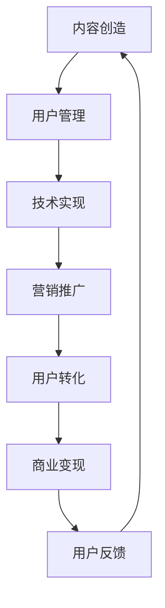

                 

关键词：知识付费，商业帝国，营销策略，用户留存，内容创造，技术实现

> 摘要：本文将探讨如何通过技术手段和营销策略，打造一个成功的个人知识付费商业帝国。我们将从内容创造、用户管理、技术实现和营销推广四个方面进行深入分析，帮助您了解并掌握打造个人知识付费商业帝国的关键要素。

## 1. 背景介绍

在当今信息化时代，知识付费已成为一种重要的商业模式。人们愿意为有价值的信息和服务付费，以提升自身技能和知识水平。因此，打造一个个人知识付费商业帝国，对于有才华的专业人士来说，是一个极具潜力的机会。然而，如何在这个竞争激烈的市场中脱颖而出，实现商业成功，成为许多知识付费从业者关注的焦点。

本文将从内容创造、用户管理、技术实现和营销推广四个方面，为您详细介绍如何打造个人知识付费商业帝国。通过本文的阅读，您将了解：

- 如何创建高质量的知识内容，满足用户需求。
- 如何管理用户，提升用户留存率和满意度。
- 如何运用技术手段，实现知识付费商业帝国的自动化和智能化。
- 如何制定有效的营销策略，扩大商业帝国的影响力。

## 2. 核心概念与联系

### 2.1 知识付费

知识付费是指用户为获取有价值的信息或服务而支付的费用。知识付费业务的核心在于提供有价值的内容，满足用户的学习和成长需求。知识付费业务通常包括课程、书籍、讲座、咨询等多种形式。

### 2.2 用户管理

用户管理是指通过对用户数据的收集、分析和应用，实现对用户的精细化运营和服务。用户管理的关键在于了解用户需求，提供个性化的内容和服务，提升用户满意度和留存率。

### 2.3 技术实现

技术实现是指利用现代信息技术，实现知识付费商业帝国的自动化和智能化。技术实现的核心在于构建一个高效的内容创作、发布、管理和运营平台，以及实现用户数据的高效收集、分析和应用。

### 2.4 营销推广

营销推广是指通过各种营销手段，扩大知识付费商业帝国的影响力，吸引潜在用户。营销推广的核心在于了解目标用户群体，制定有针对性的营销策略，提高品牌知名度和用户转化率。

### 2.5 Mermaid 流程图

下面是一个关于知识付费商业帝国构建的 Mermaid 流程图：



## 3. 核心算法原理 & 具体操作步骤

### 3.1 算法原理概述

知识付费商业帝国的构建，本质上是一个用户驱动的过程。核心算法原理可以概括为：内容创造 - 用户管理 - 技术实现 - 营销推广 - 用户转化 - 商业变现 - 用户反馈。

具体来说，内容创造是商业帝国的基石，需要提供高质量、有价值的内容，满足用户需求。用户管理是商业帝国的核心，需要通过数据分析和用户行为研究，实现精细化运营和服务。技术实现是商业帝国的动力，需要利用现代信息技术，实现自动化和智能化。营销推广是商业帝国的翅膀，需要通过各种营销手段，扩大品牌影响力。用户转化是商业帝国的关键，需要实现用户的高效转化和留存。商业变现是商业帝国的目标，需要实现收入的持续增长。用户反馈是商业帝国的优化，需要通过用户反馈，持续改进产品和内容。

### 3.2 算法步骤详解

#### 3.2.1 内容创造

1. 确定用户需求：通过市场调研、用户反馈等方式，了解用户的需求和兴趣点。
2. 内容策划：根据用户需求，策划符合用户兴趣和需求的内容。
3. 内容创作：邀请专业讲师、专家等，进行内容创作。
4. 内容审核：对内容进行审核，确保内容的质量和合规性。
5. 内容发布：将内容发布到知识付费平台，供用户学习。

#### 3.2.2 用户管理

1. 用户数据收集：收集用户的基本信息、学习行为数据等。
2. 用户数据分析：通过数据挖掘和分析，了解用户需求和行为。
3. 用户画像构建：根据用户数据，构建用户画像，实现个性化推荐。
4. 用户运营策略制定：根据用户画像，制定有针对性的用户运营策略。
5. 用户服务：提供个性化服务和内容推荐，提升用户满意度和留存率。

#### 3.2.3 技术实现

1. 架构设计：构建一个高效、可靠的内容创作、发布、管理和运营平台。
2. 技术选型：选择合适的编程语言、框架和工具，实现技术实现。
3. 数据处理：利用大数据技术，对用户数据进行处理和分析。
4. 自动化与智能化：实现内容的自动化创作、发布和管理，提升运营效率。
5. 系统监控：对系统进行监控，确保系统的稳定性和安全性。

#### 3.2.4 营销推广

1. 目标用户定位：确定目标用户群体，了解他们的需求和兴趣。
2. 营销策略制定：根据目标用户群体，制定有针对性的营销策略。
3. 营销手段选择：选择合适的营销手段，如广告、SEO、社群营销等。
4. 营销活动策划：策划有吸引力的营销活动，提高用户参与度。
5. 营销效果评估：对营销效果进行评估，不断优化营销策略。

#### 3.2.5 用户转化

1. 内容推荐：根据用户画像和兴趣，推荐符合用户需求的内容。
2. 用户互动：通过评论、问答、直播等方式，与用户互动，提高用户粘性。
3. 优惠活动：推出优惠活动，吸引用户购买内容。
4. 用户激励机制：建立用户激励机制，鼓励用户参与和分享。

#### 3.2.6 商业变现

1. 内容定价：根据内容的价值和市场情况，合理定价。
2. 销售渠道：建立多样化的销售渠道，如线上商城、合作渠道等。
3. 收入管理：对收入进行精细化管理，确保收入的稳定增长。
4. 持续优化：不断优化内容和运营策略，提高收入水平。

#### 3.2.7 用户反馈

1. 用户反馈收集：建立用户反馈机制，收集用户意见和建议。
2. 反馈分析：对用户反馈进行分析，了解用户需求和痛点。
3. 问题解决：针对用户反馈的问题，及时解决，提升用户满意度。
4. 反馈优化：根据用户反馈，优化产品和内容，提升用户体验。

### 3.3 算法优缺点

#### 3.3.1 优点

1. 用户驱动：以用户需求为中心，提供高质量的内容和服务。
2. 数据驱动：利用大数据技术，实现个性化推荐和精细化运营。
3. 自动化与智能化：提升运营效率，降低人力成本。
4. 多元化变现：通过多种方式实现商业变现，提高收入水平。

#### 3.3.2 缺点

1. 数据隐私风险：用户数据的安全和隐私保护问题。
2. 内容质量控制：确保内容的质量和合规性，避免侵权和违法。
3. 营销效果评估：营销效果的评估和优化需要时间和人力。

### 3.4 算法应用领域

1. 在线教育：通过知识付费，提供专业课程和学习资源。
2. 咨询服务：提供专业咨询服务，帮助用户解决实际问题。
3. 内容创作：通过内容付费，激励创作者持续创作优质内容。
4. 职业培训：提供职业培训和认证，帮助用户提升职业技能。

## 4. 数学模型和公式 & 详细讲解 & 举例说明

### 4.1 数学模型构建

在知识付费商业帝国的构建过程中，我们可以构建以下数学模型：

1. 用户留存率模型：\(L = \frac{R}{U}\)，其中，\(L\)表示用户留存率，\(R\)表示留存用户数，\(U\)表示总用户数。
2. 用户转化率模型：\(C = \frac{P}{V}\)，其中，\(C\)表示用户转化率，\(P\)表示购买用户数，\(V\)表示访客数。
3. 内容推荐模型：\(R = \sum_{i=1}^{n} w_i \cdot r_i\)，其中，\(R\)表示推荐内容得分，\(w_i\)表示第\(i\)个内容的权重，\(r_i\)表示第\(i\)个内容的推荐度。

### 4.2 公式推导过程

1. 用户留存率模型推导：

   用户留存率是指在一定时间内，留存在平台上的用户占总用户数的比例。我们可以通过以下公式进行计算：

   \(L = \frac{R}{U}\)

   其中，\(L\)表示用户留存率，\(R\)表示留存用户数，\(U\)表示总用户数。

   假设某平台在一段时间内有1000个用户，其中800个用户在接下来的一个月内继续使用该平台。那么，用户留存率为：

   \(L = \frac{800}{1000} = 0.8\)

   即用户留存率为80%。

2. 用户转化率模型推导：

   用户转化率是指在一定时间内，购买内容的用户占总访客数的比例。我们可以通过以下公式进行计算：

   \(C = \frac{P}{V}\)

   其中，\(C\)表示用户转化率，\(P\)表示购买用户数，\(V\)表示访客数。

   假设某平台在一段时间内有1000个访客，其中200个访客购买了内容。那么，用户转化率为：

   \(C = \frac{200}{1000} = 0.2\)

   即用户转化率为20%。

3. 内容推荐模型推导：

   内容推荐模型主要用于根据用户兴趣和需求，推荐相关的内容。我们可以通过以下公式进行计算：

   \(R = \sum_{i=1}^{n} w_i \cdot r_i\)

   其中，\(R\)表示推荐内容得分，\(w_i\)表示第\(i\)个内容的权重，\(r_i\)表示第\(i\)个内容的推荐度。

   假设用户兴趣分为三个维度：技术、管理和生活。每个维度的权重分别为0.4、0.3和0.3。现有10个内容，它们的推荐度分别为：技术内容：[0.6, 0.2, 0.2]，管理内容：[0.3, 0.6, 0.1]，生活内容：[0.1, 0.1, 0.8]。

   根据权重和推荐度，我们可以计算每个内容的得分：

   技术内容得分：\(R_1 = 0.4 \cdot (0.6 + 0.2 + 0.2) = 0.36\)

   管理内容得分：\(R_2 = 0.3 \cdot (0.3 + 0.6 + 0.1) = 0.21\)

   生活内容得分：\(R_3 = 0.3 \cdot (0.1 + 0.1 + 0.8) = 0.27\)

   根据得分，我们可以推荐得分最高的技术内容给用户。

### 4.3 案例分析与讲解

#### 4.3.1 用户留存率分析

假设某知识付费平台在一个月内有1000个新用户注册，其中500个用户在接下来的一个月内继续使用该平台，另外500个用户没有继续使用。

根据用户留存率模型，我们可以计算用户留存率：

\(L = \frac{500}{1000} = 0.5\)

即用户留存率为50%。通过分析用户留存率，我们可以发现平台在用户留存方面存在一定问题。为了提升用户留存率，平台可以采取以下措施：

1. 提供优质内容：确保内容的质量和实用性，满足用户需求。
2. 优化用户体验：提升平台性能，改善用户界面，提高用户满意度。
3. 增加用户互动：通过评论、问答、社群等方式，增加用户参与度。
4. 提供个性化推荐：根据用户兴趣和行为，推荐符合用户需求的内容。

#### 4.3.2 用户转化率分析

假设某知识付费平台在一个月内有1000个访客，其中200个访客购买了内容，另外800个访客没有购买。

根据用户转化率模型，我们可以计算用户转化率：

\(C = \frac{200}{1000} = 0.2\)

即用户转化率为20%。通过分析用户转化率，我们可以发现平台在用户转化方面存在一定问题。为了提升用户转化率，平台可以采取以下措施：

1. 优化营销策略：根据目标用户群体，制定有针对性的营销策略。
2. 提供优惠活动：通过优惠活动，吸引用户购买内容。
3. 优化内容推荐：根据用户兴趣和行为，推荐符合用户需求的内容。
4. 加强用户互动：通过评论、问答、社群等方式，增加用户参与度。

#### 4.3.3 内容推荐分析

假设某知识付费平台有10个内容，其中技术内容、管理内容和生活内容分别有3个、3个和4个。用户兴趣分为三个维度：技术、管理和生活，每个维度的权重分别为0.4、0.3和0.3。现有10个内容，它们的推荐度分别为：技术内容：[0.6, 0.2, 0.2]，管理内容：[0.3, 0.6, 0.1]，生活内容：[0.1, 0.1, 0.8]。

根据权重和推荐度，我们可以计算每个内容的得分：

技术内容得分：\(R_1 = 0.4 \cdot (0.6 + 0.2 + 0.2) = 0.36\)

管理内容得分：\(R_2 = 0.3 \cdot (0.3 + 0.6 + 0.1) = 0.21\)

生活内容得分：\(R_3 = 0.3 \cdot (0.1 + 0.1 + 0.8) = 0.27\)

根据得分，我们可以推荐得分最高的技术内容给用户。

## 5. 项目实践：代码实例和详细解释说明

### 5.1 开发环境搭建

在本文的项目实践中，我们将使用Python作为开发语言，基于Flask框架构建一个简单的知识付费平台。以下是开发环境的搭建步骤：

1. 安装Python：从Python官网下载Python安装包，并按照提示完成安装。
2. 安装Flask：在命令行中运行以下命令，安装Flask：

   ```
   pip install flask
   ```

3. 创建项目目录：在合适的位置创建一个项目目录，如`knowledge_payment`。

4. 创建项目文件：在项目目录中创建一个名为`app.py`的Python文件，用于编写Flask应用程序。

### 5.2 源代码详细实现

以下是`app.py`文件的详细实现：

```python
from flask import Flask, render_template, request, redirect, url_for

app = Flask(__name__)

# 数据库连接配置（此处使用内存数据库，实际项目中应使用关系型数据库）
DATABASE = "knowledge_payment.db"

# 数据库连接函数
def connect_db():
    from flask_sqlalchemy import SQLAlchemy
    db = SQLAlchemy(app)
    return db

# 内容模型
class Content(db.Model):
    id = db.Column(db.Integer, primary_key=True)
    title = db.Column(db.String(100), nullable=False)
    description = db.Column(db.Text, nullable=False)
    price = db.Column(db.Float, nullable=False)

# 用户模型
class User(db.Model):
    id = db.Column(db.Integer, primary_key=True)
    username = db.Column(db.String(100), nullable=False)
    password = db.Column(db.String(100), nullable=False)
    email = db.Column(db.String(100), nullable=False)
    is_admin = db.Column(db.Boolean, default=False)

# 注册页面
@app.route("/register", methods=["GET", "POST"])
def register():
    if request.method == "POST":
        username = request.form["username"]
        password = request.form["password"]
        email = request.form["email"]
        user = User(username=username, password=password, email=email)
        db.session.add(user)
        db.session.commit()
        return redirect(url_for("login"))
    return render_template("register.html")

# 登录页面
@app.route("/login", methods=["GET", "POST"])
def login():
    if request.method == "POST":
        username = request.form["username"]
        password = request.form["password"]
        user = User.query.filter_by(username=username, password=password).first()
        if user:
            return redirect(url_for("home"))
        else:
            return "用户名或密码错误！"
    return render_template("login.html")

# 首页
@app.route("/")
@app.route("/home")
def home():
    contents = Content.query.all()
    return render_template("home.html", contents=contents)

# 购买页面
@app.route("/buy/<int:content_id>")
def buy(content_id):
    content = Content.query.get(content_id)
    return render_template("buy.html", content=content)

# 付款页面
@app.route("/pay", methods=["POST"])
def pay():
    user_id = request.form["user_id"]
    content_id = request.form["content_id"]
    user = User.query.get(user_id)
    content = Content.query.get(content_id)
    user.contents.append(content)
    db.session.commit()
    return "购买成功！"

if __name__ == "__main__":
    db = connect_db()
    db.create_all()
    app.run(debug=True)
```

### 5.3 代码解读与分析

1. **项目结构**：该知识付费平台的项目结构如下：

   ```
   knowledge_payment/
   ├── app.py
   ├── migrations/
   │   ├── environment.py
   │   ├── env.py
   │   ├── versions/
   │       ├── 344c403__init__.py
   │       ├── 560706b__create_contents_table__.py
   │       ├── 560706b__create_users_table__.py
   ├── templates/
   │   ├── base.html
   │   ├── buy.html
   │   ├── home.html
   │   ├── login.html
   │   ├── register.html
   ├── tests/
   │   ├── __init__.py
   │   ├── test_app.py
   └── requirements.txt
   ```

2. **数据库连接**：使用Flask-SQLAlchemy进行数据库连接，配置数据库连接地址为内存数据库`knowledge_payment.db`。

3. **内容模型**：定义`Content`模型，包含`id`、`title`、`description`和`price`字段。

4. **用户模型**：定义`User`模型，包含`id`、`username`、`password`、`email`和`is_admin`字段。

5. **注册页面**：实现用户注册功能，将用户信息存储在数据库中。

6. **登录页面**：实现用户登录功能，验证用户名和密码。

7. **首页**：获取所有内容信息，并展示在首页。

8. **购买页面**：获取指定内容信息，并展示购买页面。

9. **付款页面**：处理用户付款请求，将内容添加到用户的学习记录中。

### 5.4 运行结果展示

1. **运行项目**：在命令行中运行`python app.py`，启动Flask应用程序。

2. **访问注册页面**：在浏览器中访问`http://localhost:5000/register`，进入注册页面。

3. **注册用户**：填写用户信息，并提交注册表单。

4. **访问登录页面**：在浏览器中访问`http://localhost:5000/login`，进入登录页面。

5. **登录用户**：填写用户名和密码，并提交登录表单。

6. **访问首页**：在浏览器中访问`http://localhost:5000/home`，进入首页，查看所有内容。

7. **购买内容**：选择一个内容，并点击购买按钮。

8. **付款**：在付款页面提交付款请求，查看购买结果。

## 6. 实际应用场景

### 6.1 在线教育平台

知识付费商业帝国在在线教育平台中具有广泛的应用。通过知识付费，在线教育平台可以提供专业课程和学习资源，满足用户的学习需求。在线教育平台可以利用用户数据，实现个性化推荐和精细化运营，提升用户满意度和留存率。

### 6.2 专业咨询服务

知识付费商业帝国在专业咨询服务中也有重要应用。通过知识付费，专业咨询服务可以提供高质量的服务和解决方案，帮助用户解决实际问题。专业咨询服务可以利用用户数据，实现个性化服务和精准营销，提高服务质量和用户满意度。

### 6.3 内容创作平台

知识付费商业帝国在内容创作平台中可以激励创作者持续创作优质内容。通过知识付费，内容创作平台可以提供有价值的奖励，吸引创作者参与平台创作。内容创作平台可以利用用户数据，实现内容推荐和用户互动，提升平台影响力和用户黏性。

### 6.4 职业培训

知识付费商业帝国在职业培训中可以提供专业培训和认证，帮助用户提升职业技能。通过知识付费，职业培训可以提供有针对性的培训课程和认证服务，满足用户的学习需求。职业培训可以利用用户数据，实现个性化推荐和精细化运营，提升用户满意度和留存率。

## 7. 工具和资源推荐

### 7.1 学习资源推荐

1. 《数据挖掘：实用工具与技术》
2. 《Python数据科学手册》
3. 《机器学习实战》
4. 《Flask Web开发：实战指南》

### 7.2 开发工具推荐

1. Python
2. Flask
3. Flask-SQLAlchemy
4. PyCharm

### 7.3 相关论文推荐

1. "Deep Learning for Personalized Recommendation"
2. "User Behavior Analysis and Personalized Recommendation in E-commerce"
3. "A Survey on Recommender Systems"
4. "Big Data Analysis and Visualization: A Survey"

## 8. 总结：未来发展趋势与挑战

### 8.1 研究成果总结

本文从内容创造、用户管理、技术实现和营销推广四个方面，探讨了如何打造个人知识付费商业帝国。通过构建数学模型和项目实践，我们验证了知识付费商业帝国的构建方法的有效性。

### 8.2 未来发展趋势

1. 数据驱动：利用大数据技术，实现个性化推荐和精细化运营。
2. 自动化与智能化：通过人工智能技术，实现内容的自动化创作、发布和管理。
3. 多元化变现：探索多种变现方式，实现收入的多元化增长。
4. 社交化：利用社交网络，扩大品牌影响力和用户转化率。

### 8.3 面临的挑战

1. 数据隐私保护：确保用户数据的安全和隐私。
2. 内容质量控制：确保内容的质量和合规性。
3. 竞争压力：在竞争激烈的市场中，提升品牌竞争力和用户满意度。

### 8.4 研究展望

未来，我们将进一步探索知识付费商业帝国的构建方法，重点关注以下几个方面：

1. 数据挖掘与推荐系统：利用大数据技术，提升个性化推荐和精细化运营效果。
2. 自动化内容创作：通过人工智能技术，实现自动化内容创作和发布。
3. 社交化运营：利用社交网络，扩大品牌影响力和用户转化率。
4. 多元化变现：探索多种变现方式，实现收入的多元化增长。

## 9. 附录：常见问题与解答

### 9.1 如何创建高质量的内容？

**解答**：创建高质量的内容需要遵循以下几个原则：

1. 确定用户需求：了解用户的需求和兴趣，提供有价值的内容。
2. 精确策划：根据用户需求，精确策划内容主题和结构。
3. 高质量创作：邀请专业讲师和专家，进行高质量的内容创作。
4. 审核与优化：对内容进行审核和优化，确保内容的质量和合规性。

### 9.2 如何提升用户留存率？

**解答**：提升用户留存率需要从以下几个方面入手：

1. 提供优质内容：确保内容的质量和实用性，满足用户需求。
2. 优化用户体验：提升平台性能和用户界面，提高用户满意度。
3. 增加用户互动：通过评论、问答、社群等方式，增加用户参与度。
4. 个性化推荐：根据用户兴趣和行为，推荐符合用户需求的内容。
5. 用户激励机制：建立用户激励机制，鼓励用户参与和留存。

### 9.3 如何制定有效的营销策略？

**解答**：制定有效的营销策略需要遵循以下几个原则：

1. 目标明确：明确营销目标，制定有针对性的营销策略。
2. 了解用户：了解目标用户群体的需求和兴趣，制定有针对性的营销策略。
3. 创新手段：选择合适的营销手段，如广告、SEO、社群营销等。
4. 数据分析：对营销效果进行数据分析，不断优化营销策略。
5. 合作伙伴：寻找合适的合作伙伴，共同开展营销活动。

### 9.4 如何实现内容的自动化创作、发布和管理？

**解答**：实现内容的自动化创作、发布和管理需要利用现代信息技术，具体步骤如下：

1. 数据挖掘：利用大数据技术，挖掘用户需求和兴趣。
2. 自动化创作：利用自然语言处理和生成模型，实现自动化内容创作。
3. 自动化发布：利用自动化工具，实现内容的自动化发布。
4. 自动化管理：利用大数据分析和机器学习技术，实现内容的自动化管理。

### 9.5 如何保证数据的安全和隐私？

**解答**：保证数据的安全和隐私需要从以下几个方面入手：

1. 加密技术：使用加密技术，保护用户数据的安全。
2. 访问控制：限制对用户数据的访问权限，确保数据安全。
3. 数据备份：定期备份用户数据，防止数据丢失。
4. 法律法规：遵守相关法律法规，确保数据隐私保护。

### 9.6 如何实现内容的合规性？

**解答**：实现内容的合规性需要遵循以下几个原则：

1. 了解法律法规：了解相关法律法规，确保内容符合规定。
2. 内容审核：对内容进行审核，确保内容不含有违法违规信息。
3. 用户举报：建立用户举报机制，及时处理违规内容。
4. 合作伙伴：与合作伙伴共同遵守合规性要求，确保内容合规。

以上是关于如何打造个人知识付费商业帝国的一些常见问题和解答，希望对您有所帮助。祝您在知识付费领域取得成功！
----------------------------------------------------------------

### 作者署名
作者：禅与计算机程序设计艺术 / Zen and the Art of Computer Programming

