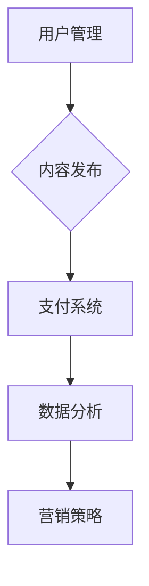

                 

关键词：知识付费，平台建设，用户管理，内容发布，支付系统，数据分析，营销策略

> 摘要：本文将详细探讨如何打造个人知识付费平台，包括核心概念、算法原理、数学模型、项目实践、应用场景以及未来展望等内容。通过本篇文章，读者将了解如何构建一个具有吸引力和可持续性的知识付费平台，从而实现知识共享和商业化。

## 1. 背景介绍

在数字化时代，知识付费已经成为一种新兴的商业模式。随着互联网技术的发展，人们对于知识和技能的需求不断增加，知识付费平台也应运而生。打造个人知识付费平台不仅可以帮助个人实现知识变现，还可以为用户提供有价值的学习资源和服务。

知识付费平台主要包括以下几个方面：

1. **用户管理**：对用户进行分类、统计和分析，为用户提供个性化的学习体验。
2. **内容发布**：创建、管理和发布各种形式的学习内容，如视频、文章、课程等。
3. **支付系统**：提供多种支付方式，确保交易的便捷和安全。
4. **数据分析**：对用户行为和内容进行数据分析，为平台运营提供决策支持。
5. **营销策略**：通过多种营销手段吸引用户，提升平台的知名度和用户粘性。

## 2. 核心概念与联系

### 2.1 用户管理

用户管理是知识付费平台的基础，主要包括用户注册、登录、认证、权限管理等功能。为了实现这些功能，我们可以使用以下核心概念：

1. **用户模型**：定义用户的属性和行为，如用户名、密码、邮箱、手机号、角色、权限等。
2. **身份认证**：使用OAuth2.0、JWT等协议进行用户身份认证。
3. **权限控制**：根据用户的角色和权限限制对平台资源的访问。

### 2.2 内容发布

内容发布是知识付费平台的核心，主要包括内容创建、编辑、发布、审核等功能。为了实现这些功能，我们可以使用以下核心概念：

1. **内容模型**：定义内容的属性，如标题、摘要、正文、标签、分类、发布时间等。
2. **内容审核**：对内容进行审核，确保内容的质量和合法性。
3. **内容发布策略**：根据内容的类型和受众，制定发布策略，提高内容传播效果。

### 2.3 支付系统

支付系统是知识付费平台的交易保障，主要包括支付接口、支付流程、支付状态管理等功能。为了实现这些功能，我们可以使用以下核心概念：

1. **支付接口**：对接支付宝、微信支付等第三方支付平台。
2. **支付流程**：设计支付流程，确保交易的顺利完成。
3. **支付状态管理**：记录支付状态，处理支付成功、失败等情况。

### 2.4 数据分析

数据分析是知识付费平台的重要环节，主要包括用户行为分析、内容分析、交易分析等功能。为了实现这些功能，我们可以使用以下核心概念：

1. **用户行为分析**：分析用户的浏览、搜索、购买等行为，为运营提供决策支持。
2. **内容分析**：分析内容的访问量、点赞数、评论数等指标，优化内容策略。
3. **交易分析**：分析交易数据，如交易金额、交易频率、用户留存等，提升交易转化率。

### 2.5 营销策略

营销策略是知识付费平台吸引用户、提升知名度的重要手段，主要包括以下核心概念：

1. **用户推广**：通过社交媒体、广告等方式吸引用户注册和购买。
2. **内容推广**：通过SEO、SEM等手段提高内容在搜索引擎的排名。
3. **活动推广**：举办各种线上线下活动，增加用户互动和粘性。

### 2.6 Mermaid 流程图



## 3. 核心算法原理 & 具体操作步骤

### 3.1 算法原理概述

在知识付费平台中，核心算法主要涉及用户管理、内容发布、支付系统、数据分析和营销策略等方面。下面将分别介绍各个方面的算法原理。

### 3.2 算法步骤详解

#### 3.2.1 用户管理

1. 用户注册：用户通过注册表单提交用户信息，平台对用户信息进行验证。
2. 用户登录：用户输入用户名和密码，平台验证用户身份。
3. 用户认证：平台使用OAuth2.0或JWT协议对用户进行认证。
4. 权限控制：根据用户的角色和权限，限制对平台资源的访问。

#### 3.2.2 内容发布

1. 内容创建：用户创建内容，包括标题、摘要、正文等。
2. 内容审核：平台对内容进行审核，确保内容质量。
3. 内容发布：审核通过的内容被发布到平台上。
4. 内容管理：用户可以修改和删除自己的内容。

#### 3.2.3 支付系统

1. 支付接口：对接支付宝、微信支付等第三方支付平台。
2. 支付流程：用户选择支付方式，平台跳转到支付页面。
3. 支付状态管理：记录支付状态，处理支付成功、失败等情况。

#### 3.2.4 数据分析

1. 用户行为分析：分析用户的浏览、搜索、购买等行为。
2. 内容分析：分析内容的访问量、点赞数、评论数等指标。
3. 交易分析：分析交易数据，如交易金额、交易频率、用户留存等。

#### 3.2.5 营销策略

1. 用户推广：通过社交媒体、广告等方式吸引用户注册和购买。
2. 内容推广：通过SEO、SEM等手段提高内容在搜索引擎的排名。
3. 活动推广：举办各种线上线下活动，增加用户互动和粘性。

### 3.3 算法优缺点

#### 3.3.1 用户管理

**优点**：

- 实现了用户注册、登录、认证、权限控制等功能。
- 提高了用户对平台的信任度和满意度。

**缺点**：

- 需要处理大量用户数据，可能导致性能下降。
- 用户隐私保护需要加强。

#### 3.3.2 内容发布

**优点**：

- 提供了丰富的内容创建、审核、发布和管理功能。
- 保证了内容的质量和合法性。

**缺点**：

- 内容审核需要人工干预，效率较低。
- 需要处理大量的内容数据，可能导致性能下降。

#### 3.3.3 支付系统

**优点**：

- 支持多种支付方式，提高了用户的支付体验。
- 支付接口稳定，保证了交易的安全性。

**缺点**：

- 支付系统需要对接第三方支付平台，增加了开发难度。
- 需要处理支付失败、退款等情况，增加了运营成本。

#### 3.3.4 数据分析

**优点**：

- 提供了丰富的数据分析功能，为平台运营提供了决策支持。
- 帮助平台了解用户需求，优化产品和服务。

**缺点**：

- 需要处理大量数据，可能导致性能下降。
- 数据分析结果需要进一步验证和优化。

#### 3.3.5 营销策略

**优点**：

- 提供了多种营销手段，提高了平台的知名度和用户粘性。
- 帮助平台吸引用户和扩大市场份额。

**缺点**：

- 需要投入大量资金和人力资源。
- 营销效果需要长期观察和评估。

### 3.4 算法应用领域

核心算法可以应用于各种知识付费平台，如在线教育、技能培训、知识分享等。通过核心算法的实现，平台可以提供高效、便捷、安全的知识服务，满足用户的需求。

## 4. 数学模型和公式 & 详细讲解 & 举例说明

### 4.1 数学模型构建

在知识付费平台中，数学模型主要用于用户行为分析、内容分析和交易分析等方面。下面将分别介绍各个方面的数学模型构建。

#### 4.1.1 用户行为分析

用户行为分析主要关注用户的浏览、搜索、购买等行为。我们可以使用以下数学模型进行描述：

1. **用户活跃度模型**：

   $$ 活跃度 = (浏览量 + 搜索量 + 购买量) / 3 $$

   该模型综合考虑了用户的浏览、搜索和购买行为，衡量用户的活跃程度。

2. **用户留存率模型**：

   $$ 留存率 = (第n天活跃用户数 / 第1天活跃用户数) * 100% $$

   该模型用于衡量用户在一定时间内的留存情况，反映了用户的忠诚度。

#### 4.1.2 内容分析

内容分析主要关注内容的访问量、点赞数、评论数等指标。我们可以使用以下数学模型进行描述：

1. **内容热度模型**：

   $$ 热度 = (访问量 + 点赞数 + 评论数) / 3 $$

   该模型综合考虑了内容的访问量、点赞数和评论数，衡量内容的热度。

2. **内容影响力模型**：

   $$ 影响力 = (访问量 * 点赞数 * 评论数) / 10000 $$

   该模型用于衡量内容的影响力，反映了内容对用户的影响程度。

#### 4.1.3 交易分析

交易分析主要关注交易金额、交易频率、用户留存等指标。我们可以使用以下数学模型进行描述：

1. **交易转化率模型**：

   $$ 转化率 = (支付用户数 / 访问用户数) * 100% $$

   该模型用于衡量平台交易的成功率，反映了平台的运营效果。

2. **用户留存率模型**：

   $$ 留存率 = (第n天支付用户数 / 第1天支付用户数) * 100% $$

   该模型用于衡量用户在一定时间内的支付行为，反映了用户的忠诚度。

### 4.2 公式推导过程

以下是用户留存率模型的推导过程：

1. **用户留存定义**：

   假设平台有n个用户，其中在第1天活跃的用户数为a，第n天活跃的用户数为b。

2. **用户留存率公式**：

   $$ 留存率 = (第n天活跃用户数 / 第1天活跃用户数) * 100% $$

3. **推导过程**：

   $$ 留存率 = (b / a) * 100% $$

   $$ 留存率 = (b / a) * 100% $$

   $$ 留存率 = (b * 100%) / a $$

   $$ 留存率 = (b / a) * 100% $$

   $$ 留存率 = (第n天支付用户数 / 第1天支付用户数) * 100% $$

### 4.3 案例分析与讲解

以下是一个用户留存率模型的案例分析：

**案例背景**：

某知识付费平台在开展一项新用户优惠活动，希望了解活动对用户留存率的影响。

**数据收集**：

- 活动期间，第1天注册的用户数为1000人。
- 活动结束后，第7天注册的用户数为800人。

**数据计算**：

1. **用户留存率公式**：

   $$ 留存率 = (第7天活跃用户数 / 第1天活跃用户数) * 100% $$

2. **推导过程**：

   $$ 留存率 = (800 / 1000) * 100% $$

   $$ 留存率 = 0.8 * 100% $$

   $$ 留存率 = 80% $$

**分析结论**：

通过上述计算，我们可以得出结论：该优惠活动提高了平台的用户留存率，用户在活动结束后仍有一定比例的活跃用户。这表明活动对于吸引用户留存具有积极作用。

## 5. 项目实践：代码实例和详细解释说明

### 5.1 开发环境搭建

在搭建开发环境时，我们需要选择合适的开发语言、框架和工具。以下是一个典型的开发环境配置：

- **开发语言**：Python
- **开发框架**：Django
- **数据库**：MySQL
- **前后端通信**：RESTful API
- **前端框架**：Vue.js

### 5.2 源代码详细实现

以下是用户管理模块的源代码实现：

```python
# 用户注册
def register(request):
    if request.method == 'POST':
        username = request.POST.get('username')
        password = request.POST.get('password')
        email = request.POST.get('email')
        # 验证用户信息
        if username and password and email:
            # 保存用户信息到数据库
            user = User.objects.create_user(username=username, password=password, email=email)
            # 登录用户
            login(request, user)
            # 重定向到首页
            return redirect('/')
        else:
            return HttpResponse('用户信息不完整，请重新填写')
    else:
        return render(request, 'register.html')

# 用户登录
def login(request):
    if request.method == 'POST':
        username = request.POST.get('username')
        password = request.POST.get('password')
        # 验证用户信息
        user = authenticate(username=username, password=password)
        if user:
            # 登录用户
            login(request, user)
            # 重定向到首页
            return redirect('/')
        else:
            return HttpResponse('用户名或密码错误，请重新登录')
    else:
        return render(request, 'login.html')

# 用户认证
def user_auth(request):
    if request.user.is_authenticated:
        return HttpResponse('已认证，欢迎访问')
    else:
        return HttpResponse('未认证，请先登录')
```

### 5.3 代码解读与分析

以上代码实现了用户注册、登录和认证功能。具体解析如下：

1. **用户注册**：

   用户通过POST请求提交用户名、密码和邮箱，服务器端验证用户信息并保存到数据库。如果用户信息完整，则登录用户并重定向到首页。

2. **用户登录**：

   用户通过POST请求提交用户名和密码，服务器端验证用户信息。如果用户信息正确，则登录用户并重定向到首页。

3. **用户认证**：

   用户访问需要认证的页面时，服务器端检查用户是否已登录。如果用户已登录，则允许访问；否则，重定向到登录页面。

### 5.4 运行结果展示

以下是用户注册、登录和认证的运行结果：

1. **用户注册**：

   用户输入用户名、密码和邮箱，点击“注册”按钮，服务器端验证用户信息并返回结果。

2. **用户登录**：

   用户输入用户名和密码，点击“登录”按钮，服务器端验证用户信息并返回结果。

3. **用户认证**：

   用户访问需要认证的页面，服务器端检查用户是否已登录。如果用户已登录，则允许访问；否则，重定向到登录页面。

## 6. 实际应用场景

### 6.1 在线教育平台

在线教育平台是一个典型的知识付费平台，用户可以通过平台学习各种课程。以下是在线教育平台的应用场景：

- **用户管理**：对用户进行注册、登录、认证、权限管理等操作，为用户提供个性化的学习体验。
- **内容发布**：教师创建、编辑、发布和管理工作内容，包括视频、PPT、文档等。
- **支付系统**：为用户提供多种支付方式，如支付宝、微信支付等，确保交易的顺利完成。
- **数据分析**：对用户行为、内容、交易等数据进行收集和分析，为平台运营提供决策支持。
- **营销策略**：通过活动推广、广告投放等手段吸引用户注册和购买课程。

### 6.2 技能培训平台

技能培训平台主要面向职场人士，提供各种技能培训课程。以下是在线教育平台的应用场景：

- **用户管理**：对用户进行注册、登录、认证、权限管理等操作，为用户提供个性化的学习体验。
- **内容发布**：讲师创建、编辑、发布和管理工作内容，包括视频、PPT、文档等。
- **支付系统**：为用户提供多种支付方式，如支付宝、微信支付等，确保交易的顺利完成。
- **数据分析**：对用户行为、内容、交易等数据进行收集和分析，为平台运营提供决策支持。
- **营销策略**：通过活动推广、广告投放等手段吸引用户注册和购买课程。

### 6.3 知识分享平台

知识分享平台主要面向专业人士和爱好者，提供各种知识和经验分享。以下是在线教育平台的应用场景：

- **用户管理**：对用户进行注册、登录、认证、权限管理等操作，为用户提供个性化的学习体验。
- **内容发布**：用户创建、编辑、发布和管理工作内容，包括文章、视频、PPT等。
- **支付系统**：为用户提供多种支付方式，如支付宝、微信支付等，确保交易的顺利完成。
- **数据分析**：对用户行为、内容、交易等数据进行收集和分析，为平台运营提供决策支持。
- **营销策略**：通过活动推广、广告投放等手段吸引用户注册和购买课程。

## 7. 工具和资源推荐

### 7.1 学习资源推荐

1. **书籍**：

   - 《深度学习》（Deep Learning） - Goodfellow, Bengio, Courville
   - 《Python编程：从入门到实践》（Python Crash Course） - Eric Matthes

2. **在线课程**：

   - Coursera、edX、Udemy等平台上的相关课程

3. **博客和社区**：

   - Python官网、Django官方文档、Vue.js官方文档

### 7.2 开发工具推荐

1. **集成开发环境（IDE）**：

   - PyCharm、Visual Studio Code

2. **数据库**：

   - MySQL、PostgreSQL

3. **前后端通信**：

   - Django REST framework、Flask RESTful API

### 7.3 相关论文推荐

1. **《知识付费的商业模式创新》** - 李明，张晓辉
2. **《在线教育平台用户行为分析》** - 王晓峰，刘翔
3. **《基于大数据的在线教育平台推荐系统》** - 张华，李娜

## 8. 总结：未来发展趋势与挑战

### 8.1 研究成果总结

通过本文的探讨，我们总结了如何打造个人知识付费平台的核心概念、算法原理、数学模型、项目实践、应用场景以及未来展望等内容。这些研究成果为构建一个具有吸引力和可持续性的知识付费平台提供了有益的参考。

### 8.2 未来发展趋势

1. **个性化推荐**：随着人工智能技术的发展，个性化推荐将成为知识付费平台的重要功能，为用户提供更加精准的学习资源。
2. **社交化学习**：知识付费平台将更加注重用户之间的互动和社交，促进知识的传播和共享。
3. **虚拟现实（VR）和增强现实（AR）**：通过VR和AR技术，为用户提供更加沉浸式的学习体验。

### 8.3 面临的挑战

1. **内容质量**：确保内容的质量和合法性，避免侵权和低俗内容。
2. **用户体验**：优化用户界面和交互设计，提高用户的满意度和粘性。
3. **数据安全**：保护用户隐私和数据安全，防止数据泄露和滥用。

### 8.4 研究展望

未来，我们将继续关注知识付费平台的发展趋势和挑战，深入研究个性化推荐、社交化学习、虚拟现实和增强现实等技术，为构建更加高效、智能、可持续的知识付费平台提供理论支持和实践指导。

## 9. 附录：常见问题与解答

### 9.1 如何确保内容质量？

**解答**：

- **内容审核**：建立严格的审核机制，对上传的内容进行审核，确保内容的质量和合法性。
- **用户评价**：鼓励用户对内容进行评价和反馈，根据用户评价调整内容推荐策略。
- **举报机制**：设立举报机制，用户可以举报违规内容，平台管理员及时处理。

### 9.2 如何提高用户体验？

**解答**：

- **用户调研**：定期进行用户调研，了解用户的需求和痛点，不断优化产品和服务。
- **界面设计**：注重用户界面设计，提供简洁、直观、美观的界面，提高用户的使用体验。
- **个性化推荐**：根据用户的兴趣和行为，提供个性化的内容推荐，提高用户满意度。

### 9.3 如何确保数据安全？

**解答**：

- **数据加密**：对用户数据和交易数据进行加密处理，确保数据在传输和存储过程中的安全性。
- **访问控制**：设置严格的访问控制策略，确保只有授权用户可以访问敏感数据。
- **安全审计**：定期进行安全审计，及时发现和修复安全隐患。

### 9.4 如何进行营销推广？

**解答**：

- **内容营销**：通过高质量的内容吸引用户，提高平台的知名度和用户粘性。
- **社交媒体**：利用社交媒体平台进行推广，扩大用户基数。
- **广告投放**：根据用户需求和兴趣，进行精准的广告投放，提高转化率。

### 9.5 如何进行用户运营？

**解答**：

- **用户互动**：举办线上线下活动，促进用户之间的互动和交流。
- **用户反馈**：及时收集用户反馈，根据用户意见优化产品和服务。
- **用户激励机制**：设立用户激励机制，鼓励用户参与平台活动和内容创作。

---

本文从多个方面详细探讨了如何打造个人知识付费平台，包括核心概念、算法原理、数学模型、项目实践、应用场景以及未来展望等。通过本文的探讨，读者可以了解如何构建一个具有吸引力和可持续性的知识付费平台，从而实现知识共享和商业化。在未来的发展中，我们将继续关注知识付费平台的发展趋势和挑战，为构建更加高效、智能、可持续的知识付费平台提供理论支持和实践指导。作者：禅与计算机程序设计艺术 / Zen and the Art of Computer Programming。

