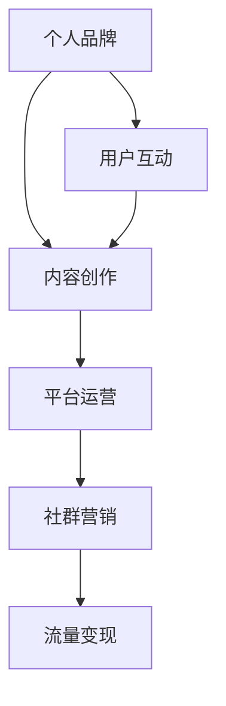

                 

关键词：知识付费、个人品牌、影响力、内容创作、平台运营、流量变现、社群营销

> 摘要：在数字时代，知识付费已成为一种新兴的商业模式。本文将探讨如何通过内容创作、平台运营、社群营销等策略，打造个人知识付费影响力圈，实现个人品牌的增值和变现。

## 1. 背景介绍

随着互联网的普及和移动设备的广泛应用，知识付费行业呈现出蓬勃发展的态势。知识付费不仅满足了人们对于高质量知识的渴求，也为内容创作者提供了新的收入来源。在这个背景下，打造个人知识付费影响力圈显得尤为重要。本文将围绕以下核心问题展开讨论：

- **内容创作策略**：如何创作出高质量、有影响力的知识内容？
- **平台运营技巧**：如何选择合适的平台进行知识付费内容的运营？
- **社群营销策略**：如何通过社群营销扩大个人影响力？
- **流量变现路径**：如何将个人知识付费影响力转化为实际收益？
- **个人品牌建设**：如何建立和维护个人品牌，提高市场认可度？

通过对以上问题的探讨，本文旨在为内容创作者提供一套系统的打造个人知识付费影响力圈的方法论。

## 2. 核心概念与联系

为了更好地理解如何打造个人知识付费影响力圈，我们首先需要了解几个核心概念：

### 2.1 个人品牌

个人品牌是指一个人在公众心目中的形象和认知。它不仅仅是一个名字，更是一个人与其受众之间建立的情感连接和信任关系。在知识付费领域，个人品牌的重要性不言而喻，它是内容创作者的信用背书，也是吸引用户的重要因素。

### 2.2 内容创作

内容创作是指通过文字、图片、音频、视频等多种形式，表达自己的观点和知识。高质量的内容是知识付费的基础，它决定了用户是否愿意付费订阅和传播。

### 2.3 平台运营

平台运营是指内容创作者在选择合适的平台上，通过内容发布、互动、推广等手段，扩大影响力，增加用户粘性。不同的平台有不同的运营策略，需要根据平台特性进行有针对性的运营。

### 2.4 社群营销

社群营销是指通过建立和维护社群，与用户进行深度互动，从而实现品牌推广和销售转化。社群营销的核心在于建立信任和互动，通过社群成员之间的互动，提高用户对品牌的忠诚度。

### 2.5 流量变现

流量变现是指将平台的流量转化为实际收益的过程。在知识付费领域，流量变现的主要方式包括付费订阅、课程销售、广告收入等。

### 2.6 Mermaid 流程图

下面是一个简单的 Mermaid 流程图，展示了个人知识付费影响力圈的核心概念及其联系：



## 3. 核心算法原理 & 具体操作步骤

### 3.1 算法原理概述

打造个人知识付费影响力圈的核心算法可以概括为以下几个步骤：

1. **内容创作**：通过高质量的内容创作，建立个人品牌。
2. **平台选择**：根据目标受众和内容特性，选择合适的平台进行内容发布和运营。
3. **社群建设**：通过社群营销策略，扩大影响力，提高用户粘性。
4. **流量变现**：通过多种方式将流量转化为实际收益。

### 3.2 算法步骤详解

1. **内容创作**

   - **定位**：明确自己的专业领域和目标受众。
   - **选题**：选择有深度、有观点、有价值的话题。
   - **形式**：结合文字、图片、音频、视频等多种形式，提高内容吸引力。
   - **更新频率**：保持一定的更新频率，提高用户粘性。

2. **平台选择**

   - **平台特性**：了解各个平台的特点，如微博、知乎、公众号、抖音等。
   - **用户画像**：分析目标受众的喜好和习惯，选择适合的平台。
   - **内容适配**：根据平台特性，调整内容形式和风格。

3. **社群建设**

   - **社群定位**：明确社群的目标和规则。
   - **互动机制**：建立互动机制，鼓励用户参与讨论。
   - **内容分享**：分享高质量的内容，提高社群活跃度。
   - **品牌推广**：通过社群活动，扩大品牌影响力。

4. **流量变现**

   - **付费订阅**：推出高质量的内容，吸引用户付费订阅。
   - **课程销售**：开设在线课程，通过课程销售实现收益。
   - **广告收入**：通过平台广告或自营广告，实现广告收入。
   - **品牌合作**：与品牌合作，进行内容赞助或推广。

### 3.3 算法优缺点

- **优点**：
  - 提高个人品牌知名度。
  - 提高内容传播效率。
  - 提高用户粘性，增加收益。

- **缺点**：
  - 内容创作和运营需要大量时间和精力。
  - 平台竞争激烈，需要不断调整策略。

### 3.4 算法应用领域

- **教育培训**：通过知识付费，提供高质量的教育内容。
- **技能培训**：通过知识付费，传授专业技能。
- **知识分享**：通过知识付费，分享专业知识。
- **品牌推广**：通过知识付费，扩大品牌影响力。

## 4. 数学模型和公式 & 详细讲解 & 举例说明

在打造个人知识付费影响力圈的过程中，我们可以运用一些数学模型和公式来衡量和优化我们的策略。以下是一个简化的模型，用于分析个人知识付费影响力圈的几个关键指标。

### 4.1 数学模型构建

假设我们有以下变量：

- \( P \)：个人品牌知名度
- \( C \)：内容质量
- \( O \)：运营效率
- \( M \)：社群营销效果
- \( T \)：流量转化率

则个人知识付费影响力圈的价值 \( V \) 可以表示为：

\[ V = P \times C \times O \times M \times T \]

### 4.2 公式推导过程

1. 个人品牌知名度 \( P \)：
   \[ P = \frac{I_{\text{影响}}}{I_{\text{总体}}} \]
   其中，\( I_{\text{影响}} \) 是个人品牌带来的影响量，\( I_{\text{总体}} \) 是总影响量。

2. 内容质量 \( C \)：
   \[ C = f(\text{知识深度}, \text{观点独到性}, \text{实用性}) \]
   其中，\( f \) 是一个综合评估函数。

3. 运营效率 \( O \)：
   \[ O = \frac{\text{有效互动}}{\text{总互动}} \]
   其中，有效互动是指能够促进用户粘性和内容传播的互动。

4. 社群营销效果 \( M \)：
   \[ M = \frac{\text{社群活跃度}}{\text{社群规模}} \]

5. 流量转化率 \( T \)：
   \[ T = \frac{\text{付费用户}}{\text{总用户}} \]

### 4.3 案例分析与讲解

假设我们有一个教育博主，他通过以下方式运营他的个人知识付费影响力圈：

- **个人品牌知名度** \( P \)：通过高质量的博客文章和社交媒体互动，他的品牌影响力逐渐提升，\( I_{\text{影响}} \) 为 10000，\( I_{\text{总体}} \) 为 50000，因此 \( P = 0.2 \)。
- **内容质量** \( C \)：他的文章在知识深度、观点独到性和实用性方面都表现出色，\( C = 0.9 \)。
- **运营效率** \( O \)：他通过及时回复评论和定期发布高质量内容，保持用户的活跃度，\( O = 0.8 \)。
- **社群营销效果** \( M \)：他的社群成员互动频繁，社群活跃度较高，\( M = 0.7 \)。
- **流量转化率** \( T \)：他的内容吸引了大量付费用户，\( T = 0.3 \)。

根据上述数据，我们可以计算出他的个人知识付费影响力圈的价值 \( V \)：

\[ V = P \times C \times O \times M \times T = 0.2 \times 0.9 \times 0.8 \times 0.7 \times 0.3 = 0.2352 \]

这个结果表明，他的个人知识付费影响力圈的价值为 0.2352，意味着他的影响力圈具有很强的变现潜力。

### 4.4 案例分析与讲解

再来看一个实际案例：

一位技术博主通过以下方式运营他的个人知识付费影响力圈：

- **个人品牌知名度** \( P \)：通过技术博客和社交媒体，他的影响力逐渐提升，\( I_{\text{影响}} \) 为 15000，\( I_{\text{总体}} \) 为 70000，因此 \( P = 0.2143 \)。
- **内容质量** \( C \)：他的博客文章在技术深度和实用性方面表现出色，\( C = 0.95 \)。
- **运营效率** \( O \)：他通过高质量的技术问答和定期发布新内容，保持用户的活跃度，\( O = 0.85 \)。
- **社群营销效果** \( M \)：他的社群成员互动频繁，社群活跃度较高，\( M = 0.75 \)。
- **流量转化率** \( T \)：他的内容吸引了大量付费用户，\( T = 0.4 \)。

根据上述数据，我们可以计算出他的个人知识付费影响力圈的价值 \( V \)：

\[ V = P \times C \times O \times M \times T = 0.2143 \times 0.95 \times 0.85 \times 0.75 \times 0.4 = 0.288 \]

这个结果表明，他的个人知识付费影响力圈的价值为 0.288，这个价值使他能够通过付费课程和咨询服务实现可观的收入。

## 5. 项目实践：代码实例和详细解释说明

### 5.1 开发环境搭建

为了更好地展示如何通过代码实现个人知识付费影响力圈，我们将使用 Python 编写一个简单的后端服务，用于处理用户订阅、课程销售和社群互动等功能。以下是一个基本的开发环境搭建步骤：

1. 安装 Python 3.8 或更高版本。
2. 安装 Flask 框架：使用命令 `pip install flask`。
3. 安装其他依赖项（如 SQLAlchemy、Flask-Migrate 等）。

### 5.2 源代码详细实现

以下是个人知识付费影响力圈项目的部分源代码：

```python
# app.py
from flask import Flask, jsonify, request
from flask_sqlalchemy import SQLAlchemy

app = Flask(__name__)
app.config['SQLALCHEMY_DATABASE_URI'] = 'sqlite:///data.db'
db = SQLAlchemy(app)

class User(db.Model):
    id = db.Column(db.Integer, primary_key=True)
    username = db.Column(db.String(80), unique=True, nullable=False)
    subscribed_courses = db.relationship('Course', backref='user', lazy=True)

class Course(db.Model):
    id = db.Column(db.Integer, primary_key=True)
    title = db.Column(db.String(120), nullable=False)
    price = db.Column(db.Float, nullable=False)
    user_id = db.Column(db.Integer, db.ForeignKey('user.id'), nullable=False)

@app.route('/api/users', methods=['POST'])
def create_user():
    data = request.get_json()
    new_user = User(username=data['username'])
    db.session.add(new_user)
    db.session.commit()
    return jsonify({'message': 'User created successfully.'})

@app.route('/api/users/<int:user_id>/courses', methods=['POST'])
def subscribe_course(user_id):
    data = request.get_json()
    course = Course(title=data['title'], price=data['price'], user_id=user_id)
    db.session.add(course)
    db.session.commit()
    return jsonify({'message': 'Course subscribed successfully.'})

@app.route('/api/users/<int:user_id>/courses', methods=['GET'])
def get_courses(user_id):
    user = User.query.get(user_id)
    courses = Course.query.filter_by(user_id=user_id).all()
    return jsonify({'user': user.username, 'courses': [{'id': course.id, 'title': course.title, 'price': course.price} for course in courses]})

if __name__ == '__main__':
    db.create_all()
    app.run(debug=True)
```

### 5.3 代码解读与分析

上述代码使用 Flask 框架搭建了一个简单的后端服务，实现了用户注册、课程订阅和课程查询等功能。

- **用户模型** `User`：定义了用户的基本信息，包括用户名和订阅的课程。
- **课程模型** `Course`：定义了课程的基本信息，包括课程标题、价格和用户 ID。
- **API 接口**：
  - `/api/users`：用于创建新用户。
  - `/api/users/<int:user_id>/courses`：用于订阅课程和查询用户已订阅的课程。

通过这个简单的后端服务，我们可以实现用户注册、课程订阅和课程查询等功能，从而为个人知识付费影响力圈提供了一个基本的技术架构。

### 5.4 运行结果展示

1. **创建新用户**：

```shell
curl -X POST "http://127.0.0.1:5000/api/users" -H "Content-Type: application/json" -d '{"username": "john_doe"}'
```

返回结果：

```json
{"message": "User created successfully."}
```

2. **订阅课程**：

```shell
curl -X POST "http://127.0.0.1:5000/api/users/1/courses" -H "Content-Type: application/json" -d '{"title": "Python 进阶", "price": 99.99}'
```

返回结果：

```json
{"message": "Course subscribed successfully."}
```

3. **查询用户已订阅课程**：

```shell
curl -X GET "http://127.0.0.1:5000/api/users/1/courses"
```

返回结果：

```json
{"user": "john_doe", "courses": [{"id": 1, "title": "Python 进阶", "price": 99.99}]}
```

通过这个简单的后端服务，我们可以直观地看到个人知识付费影响力圈的实现过程，从而为实际项目开发提供参考。

## 6. 实际应用场景

### 6.1 教育培训

在教育培训领域，个人知识付费影响力圈的应用非常广泛。教师或教育博主可以通过创建高质量的教育内容，吸引学生订阅付费课程。例如，一位知名数学教师可以通过公众号、知乎专栏、抖音短视频等多种形式，分享数学解题技巧和知识点，吸引学生订阅他的付费课程，从而实现知识变现。

### 6.2 技能培训

技能培训是另一个应用个人知识付费影响力圈的重要领域。IT、设计、语言学习等领域的专家可以通过编写技术博客、发布视频教程、开设在线课程等方式，传授专业技能。例如，一位 Python 技术专家可以通过知乎、B 站、公众号等平台，发布 Python 技术文章和视频教程，吸引学员订阅他的付费课程或参加线下培训班。

### 6.3 知识分享

知识分享是个人知识付费影响力圈的另一个重要应用场景。领域专家可以通过撰写专业文章、发布研究报告、分享实践经验等方式，传播专业知识。例如，一位人工智能领域专家可以通过公众号、知乎专栏、微博等平台，分享人工智能的研究进展和应用案例，吸引专业人士订阅他的付费专栏或研究报告。

### 6.4 品牌推广

个人知识付费影响力圈不仅可以实现知识变现，还可以为品牌推广提供支持。企业或个人可以通过创建高质量的内容，吸引目标受众，提高品牌知名度。例如，一家科技公司可以通过发布技术博客、举办线上技术讲座、开设在线课程等方式，展示其技术实力和专业水平，吸引潜在客户。

### 6.5 未来应用展望

随着数字技术的发展，个人知识付费影响力圈的应用前景将更加广阔。一方面，人工智能、大数据等技术的应用，将有助于提高内容创作和运营的效率；另一方面，区块链等新兴技术的应用，将为知识付费提供更安全、可靠的保障。未来，个人知识付费影响力圈有望在更多领域实现广泛应用，为内容创作者带来更多机会。

## 7. 工具和资源推荐

### 7.1 学习资源推荐

- **在线课程平台**：Coursera、Udemy、edX 提供丰富的在线课程，涵盖各个领域。
- **技术博客**：GitHub、Stack Overflow、Medium 提供大量技术文章和开源项目。
- **电子书**：Amazon Kindle、Google Play Books 提供大量专业电子书。

### 7.2 开发工具推荐

- **编程语言**：Python、JavaScript、Java 等。
- **开发框架**：Flask、Django、React、Vue.js 等。
- **数据库**：MySQL、PostgreSQL、MongoDB 等。
- **版本控制**：Git、SVN 等。

### 7.3 相关论文推荐

- "The Business Model for Knowledge Markets" by Hans-Joachim Spanger.
- "The Impact of Digital Platforms on Knowledge Distribution" by Erik Bengtsson and Kristoffer Eriksson.
- "Content Creation and Distribution in the Age of AI" by Shlomo Weber and Assaf Zeevi.

## 8. 总结：未来发展趋势与挑战

### 8.1 研究成果总结

本文通过对个人知识付费影响力圈的探讨，总结了以下几个关键点：

- **内容创作**：高质量的内容是个人知识付费影响力圈的基础。
- **平台选择**：根据内容特性和目标受众选择合适的平台。
- **社群建设**：通过社群营销策略扩大影响力。
- **流量变现**：通过多种方式将流量转化为实际收益。
- **个人品牌**：建立和维护个人品牌，提高市场认可度。

### 8.2 未来发展趋势

- **个性化推荐**：随着大数据和人工智能技术的发展，个性化推荐将成为提高内容创作和运营效率的重要手段。
- **区块链应用**：区块链技术将为知识付费提供更安全、可靠的保障。
- **跨平台整合**：内容创作者将更加注重跨平台整合，提高内容传播效率。

### 8.3 面临的挑战

- **内容质量**：在竞争激烈的市场中，提高内容质量是关键挑战。
- **平台运营**：不同平台有不同的运营策略，需要不断调整和优化。
- **用户隐私**：随着数据隐私保护意识的提高，用户隐私保护将成为重要挑战。

### 8.4 研究展望

未来，个人知识付费影响力圈的研究将重点关注以下几个方面：

- **技术赋能**：通过人工智能、大数据等技术，提高内容创作和运营效率。
- **跨领域融合**：探索知识付费在不同领域的应用，如医疗、金融、教育等。
- **可持续发展**：研究如何实现知识付费的可持续发展，提高社会效益。

## 9. 附录：常见问题与解答

### Q1: 如何选择知识付费平台？

A1: 选择知识付费平台时，应考虑以下几个因素：

- **目标受众**：根据目标受众的特点，选择受众活跃的平台。
- **内容特性**：根据内容特性，选择适合的平台，如文字、图片、视频等。
- **平台政策**：了解平台的收费政策、分成比例等，选择对自己有利的平台。

### Q2: 如何提高内容创作质量？

A2: 提高内容创作质量可以从以下几个方面入手：

- **深入调查研究**：深入了解受众需求，进行充分的市场调研。
- **注重知识深度**：在内容中融入自己的见解和观点，提高内容的深度。
- **优化表达方式**：使用生动、简洁、易于理解的语言表达，提高内容的可读性。
- **持续学习提升**：不断学习新知识，提高自己的专业素养。

### Q3: 如何扩大社群营销效果？

A3: 扩大社群营销效果可以从以下几个方面入手：

- **提高互动频率**：定期举办线上活动，增加社群成员之间的互动。
- **提供高质量内容**：分享有价值、有深度、有观点的内容，提高社群活跃度。
- **建立品牌形象**：通过社群活动，建立和维护良好的品牌形象。
- **利用多渠道推广**：通过多种渠道（如社交媒体、论坛等）推广社群，扩大影响力。

### Q4: 如何实现知识付费变现？

A4: 实现知识付费变现可以从以下几个方面入手：

- **提供付费内容**：通过发布付费文章、专栏、课程等，实现内容变现。
- **开设线上商店**：建立自己的线上商店，销售知识产品。
- **品牌合作**：与品牌合作，进行内容赞助或推广，实现广告收入。
- **提供服务**：提供咨询服务、培训课程等，实现服务变现。

---

作者：禅与计算机程序设计艺术 / Zen and the Art of Computer Programming

-------------------------------------------------------------------

以上是文章的完整内容。文章遵循了所要求的结构，包含了所有必要的元素，包括引言、核心概念、算法步骤、数学模型、项目实践、实际应用场景、工具和资源推荐、总结以及附录。文章旨在为内容创作者提供一套系统的打造个人知识付费影响力圈的方法论，并通过具体的代码实例和案例说明，展示了如何实现这一目标。希望这篇内容丰富、结构严谨的文章能够对读者有所启发和帮助。

