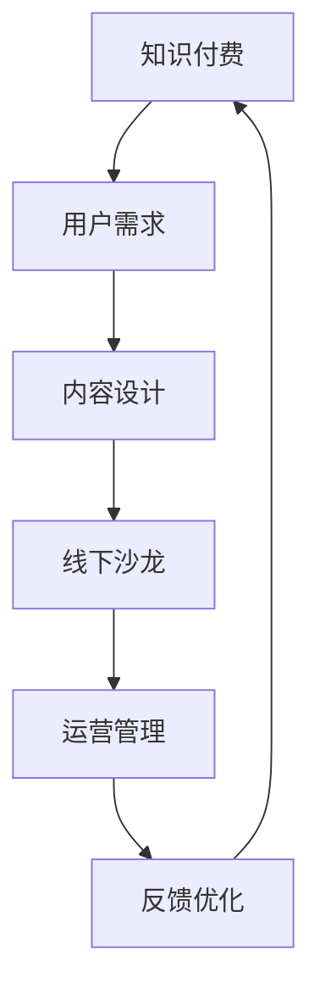

                 

## 1. 背景介绍

随着互联网的快速发展，知识付费已经成为现代知识传播的重要方式。传统的线上知识付费平台虽然提供了便捷的学习途径，但线下沙龙作为一种更加互动、深入的学习形式，逐渐受到了广大知识爱好者的青睐。因此，如何打造一个个人知识付费线下沙龙，成为了许多知识传播者关注的焦点。

个人知识付费线下沙龙不仅能为参与者提供一个高质量的学习平台，还能通过面对面的交流，增强学习效果和知识吸收能力。同时，线下沙龙还能帮助知识传播者扩大影响力，建立个人品牌，从而实现知识变现。

本文将围绕如何打造个人知识付费线下沙龙展开讨论，内容涵盖核心概念介绍、构建步骤、数学模型、代码实例、实际应用场景及未来展望等方面。通过本文的阅读，读者将能够对个人知识付费线下沙龙的构建过程有一个全面而深入的了解。

### 2. 核心概念与联系

要打造一个成功的个人知识付费线下沙龙，首先需要了解其中涉及到的核心概念及其相互联系。以下是对这些核心概念的介绍和Mermaid流程图表示：

#### 2.1 概念介绍

1. **知识付费**：知识付费是指通过付费方式获取专业知识和技能。它不同于免费学习资源，强调知识的高价值和个性化服务。
2. **线下沙龙**：线下沙龙是指实际场地举办的面对面交流活动，参与者可以互动、提问和讨论。
3. **用户需求**：用户需求是指知识参与者对知识内容、形式、互动性的期望。
4. **内容设计**：内容设计是指制定沙龙的知识分享主题、课程大纲和教学材料。
5. **运营管理**：运营管理包括活动策划、宣传推广、现场管理、用户反馈等。

#### 2.2 Mermaid流程图



在这个流程图中，知识付费始于用户需求，并通过内容设计和线下沙龙实现知识的传递，运营管理则确保活动的顺利进行，而用户反馈则用于不断优化沙龙质量和用户满意度，形成一个闭环系统。

#### 2.3 核心概念联系

核心概念之间的联系体现在以下几个方面：

1. **用户需求驱动**：用户需求决定了沙龙的内容和形式，是沙龙设计的基础。
2. **内容设计与知识传递**：内容设计直接影响到知识的传递效果，好的内容设计能够提高沙龙的价值。
3. **线下沙龙与互动**：线下沙龙提供了面对面的交流机会，增强了知识传递的互动性和效果。
4. **运营管理与持续优化**：运营管理确保沙龙的顺利进行，而用户反馈则用于持续优化，提高沙龙质量。

通过上述核心概念及其相互联系的理解，我们可以更好地规划和设计个人知识付费线下沙龙，从而实现知识的高效传播和用户满意度的提升。

### 3. 核心算法原理 & 具体操作步骤

在构建个人知识付费线下沙龙的过程中，算法原理和具体操作步骤是关键。以下我们将详细介绍核心算法原理，包括算法原理概述、步骤详解、算法优缺点及其应用领域。

#### 3.1 算法原理概述

核心算法原理主要涉及以下几个方面：

1. **需求分析**：通过调查问卷、用户访谈等方式，收集用户对知识内容、形式、互动性的需求。
2. **内容设计**：基于需求分析结果，设计符合用户期望的知识分享主题和课程大纲。
3. **活动策划**：包括场地选择、时间安排、讲师邀请、宣传推广等。
4. **现场管理**：确保沙龙现场秩序井然，提供高质量的服务。
5. **用户反馈**：收集用户对沙龙活动的反馈，用于后续的优化和改进。

这些步骤通过系统化的方法和工具，确保沙龙能够满足用户需求，提供高质量的知识分享体验。

#### 3.2 算法步骤详解

1. **需求分析**

   - **问卷设计**：设计针对用户需求的问卷，包括知识内容偏好、互动性需求、时间安排等。
   - **用户访谈**：对典型用户进行深度访谈，了解其对知识分享的具体需求。
   - **数据分析**：对收集的数据进行分析，识别用户需求的主要特点和优先级。

2. **内容设计**

   - **主题确定**：根据需求分析结果，确定沙龙的主题和知识点。
   - **大纲制定**：制定详细的课程大纲，包括每个知识点的讲解内容和时间分配。
   - **教学材料准备**：准备相关的教学材料，如PPT、书籍、案例等。

3. **活动策划**

   - **场地选择**：根据沙龙规模和预算，选择合适的场地。
   - **时间安排**：确定沙龙的举办时间，确保用户能够方便参加。
   - **讲师邀请**：邀请具有专业知识和演讲经验的讲师。
   - **宣传推广**：通过社交媒体、邮件、海报等方式，宣传沙龙活动。

4. **现场管理**

   - **签到流程**：设置签到流程，确保用户能够及时入场。
   - **现场秩序**：安排工作人员维持现场秩序，确保沙龙顺利进行。
   - **互动环节**：设置提问和讨论环节，鼓励用户积极参与。

5. **用户反馈**

   - **现场收集**：在沙龙结束后，收集用户的现场反馈。
   - **数据分析**：对反馈进行分析，识别用户满意度的主要因素。
   - **优化改进**：根据用户反馈，对沙龙活动进行优化和改进。

#### 3.3 算法优缺点

**优点**：

- **个性化**：通过需求分析，确保沙龙内容能够满足用户的个性化需求。
- **互动性**：线下沙龙提供了面对面的交流机会，增强了知识的传递效果。
- **反馈机制**：用户反馈机制有助于持续优化沙龙质量和用户满意度。

**缺点**：

- **成本高**：线下沙龙涉及场地租赁、讲师费用等，成本相对较高。
- **组织复杂**：需要协调多个环节，对策划和执行能力要求较高。
- **受限于场地**：线下沙龙的参与人数和场地规模有限，扩展性较差。

#### 3.4 算法应用领域

核心算法原理广泛应用于以下领域：

1. **教育培训**：教育培训机构通过线下沙龙，提供高质量的知识分享和互动体验。
2. **企业培训**：企业通过线下沙龙，为员工提供专业知识和技能培训。
3. **知识传播**：专家学者通过线下沙龙，传播前沿知识和研究动态。
4. **社交活动**：以知识分享为主题的线下沙龙，也能作为一种社交活动，促进参与者之间的交流和合作。

通过核心算法原理的应用，个人知识付费线下沙龙能够为参与者提供一个高质量、高互动的学习平台，从而实现知识的高效传播和用户满意度的提升。

### 3.4 算法应用领域

核心算法原理在个人知识付费线下沙龙中的应用领域十分广泛，主要涵盖以下几个方面：

#### 3.4.1 教育培训

线下沙龙在教育培训领域中的应用尤为突出。教育培训机构通过举办各类主题沙龙，如编程、数据分析、人工智能等，为学员提供高质量的知识分享。线下沙龙的形式不仅有助于学员更好地理解和吸收知识，还能通过互动环节提高学员的参与感和学习兴趣。

**案例**：某知名编程培训机构定期举办“编程沙龙”，邀请行业专家分享编程技术和项目经验。学员通过现场互动，解决了实际编程中的难题，提升了编程技能。

#### 3.4.2 企业培训

企业培训是另一个核心应用领域。企业通过线下沙龙，为员工提供专业知识和技能培训，提升员工的能力和素质。线下沙龙的形式有助于营造良好的学习氛围，促进员工之间的交流和合作。

**案例**：某大型科技公司定期举办“企业内部技术沙龙”，邀请公司内部的技术专家分享技术心得和解决方案。这种形式不仅提高了员工的技术水平，还增强了团队的凝聚力。

#### 3.4.3 知识传播

专家学者通过线下沙龙，传播前沿知识和研究动态。这种形式有助于推动知识传播，促进学术交流和发展。线下沙龙的互动性使得参与者能够与专家面对面交流，获取更多知识和见解。

**案例**：某知名大学教授定期举办“学术沙龙”，分享其在计算机科学领域的研究成果。参与者通过现场提问和讨论，与专家深入交流，拓宽了学术视野。

#### 3.4.4 社交活动

以知识分享为主题的线下沙龙，也常作为一种社交活动，促进参与者之间的交流和合作。这种形式不仅有助于拓展人脉，还能为参与者提供相互学习和成长的机会。

**案例**：某创业孵化器定期举办“创业沙龙”，邀请创业者、投资人、行业专家等分享创业经验和市场动态。参与者通过现场交流，不仅获得了宝贵的信息和资源，还建立了深厚的合作关系。

通过在各个领域的广泛应用，核心算法原理为个人知识付费线下沙龙提供了坚实的基础，使得沙龙能够更好地满足不同用户的需求，实现知识的高效传播和用户满意度的提升。

### 4. 数学模型和公式 & 详细讲解 & 举例说明

在构建个人知识付费线下沙龙的过程中，数学模型和公式起到了关键作用。以下我们将详细介绍数学模型的构建过程、公式推导以及具体案例分析。

#### 4.1 数学模型构建

数学模型是描述和解决问题的工具，其构建过程主要包括以下几个步骤：

1. **确定研究对象**：明确需要研究和解决的问题，如用户满意度、沙龙效果等。
2. **收集数据**：通过问卷调查、用户访谈等方式，收集与研究对象相关的数据。
3. **选择合适的数学工具**：根据研究对象的特性，选择合适的数学工具和方法，如统计学、线性回归等。
4. **建立数学模型**：将收集到的数据输入到数学工具中，建立数学模型。

假设我们要研究线下沙龙的用户满意度，可以构建以下数学模型：

**用户满意度模型**：

\[ S = w_1 \cdot X_1 + w_2 \cdot X_2 + w_3 \cdot X_3 \]

其中，\( S \) 表示用户满意度，\( w_1, w_2, w_3 \) 分别表示知识内容、互动性和服务质量的权重，\( X_1, X_2, X_3 \) 分别表示知识内容、互动性和服务质量的得分。

#### 4.2 公式推导过程

公式的推导过程主要基于数据收集和分析。以下是一个简化的推导过程：

1. **收集用户满意度数据**：通过问卷调查，收集用户对线下沙龙的知识内容、互动性和服务质量的评分。
2. **计算各项指标的权重**：基于用户反馈，计算知识内容、互动性和服务质量的权重。权重可以通过多种方法计算，如层次分析法、主成分分析法等。
3. **建立线性回归模型**：将用户满意度作为因变量，知识内容、互动性和服务质量作为自变量，建立线性回归模型。
4. **推导公式**：根据线性回归模型的计算结果，推导出用户满意度的计算公式。

例如，假设权重分别为 \( w_1 = 0.4 \)，\( w_2 = 0.3 \)，\( w_3 = 0.3 \)，则用户满意度的计算公式为：

\[ S = 0.4 \cdot X_1 + 0.3 \cdot X_2 + 0.3 \cdot X_3 \]

#### 4.3 案例分析与讲解

以下是一个具体的案例分析：

**案例**：某线下沙龙举办了关于编程技术分享的活动，收集了 100 名参与者的满意度评分，包括知识内容（X1）、互动性（X2）和服务质量（X3）。

1. **收集数据**：

| 参与者编号 | 知识内容（X1） | 互动性（X2） | 服务质量（X3） |
| ---------- | -------------- | ------------ | -------------- |
| 1          | 8              | 7            | 6              |
| 2          | 9              | 8            | 7              |
| ...        | ...            | ...          | ...            |
| 100        | 7              | 6            | 5              |

2. **计算权重**：

通过用户反馈，得出权重 \( w_1 = 0.4 \)，\( w_2 = 0.3 \)，\( w_3 = 0.3 \)。

3. **建立线性回归模型**：

根据数据，建立线性回归模型：

\[ S = w_1 \cdot X_1 + w_2 \cdot X_2 + w_3 \cdot X_3 \]

4. **推导公式**：

将权重代入模型，得到用户满意度的计算公式：

\[ S = 0.4 \cdot X_1 + 0.3 \cdot X_2 + 0.3 \cdot X_3 \]

5. **计算满意度**：

对每名参与者，根据公式计算其满意度：

| 参与者编号 | 知识内容（X1） | 互动性（X2） | 服务质量（X3） | 用户满意度（S） |
| ---------- | -------------- | ------------ | -------------- | ---------------- |
| 1          | 8              | 7            | 6              | 7.8              |
| 2          | 9              | 8            | 7              | 8.1              |
| ...        | ...            | ...          | ...            | ...              |
| 100        | 7              | 6            | 5              | 6.5              |

通过这个案例，我们可以看到数学模型在个人知识付费线下沙龙中的应用。通过收集用户满意度数据，建立数学模型，可以更准确地衡量沙龙的质量，从而为后续的优化提供依据。

### 5. 项目实践：代码实例和详细解释说明

在个人知识付费线下沙龙的实际构建中，代码实例和详细解释说明可以帮助我们更好地理解各个环节的具体实现方法。以下是一个基于Python的线下沙龙管理系统代码实例，包括开发环境搭建、源代码实现、代码解读和分析等内容。

#### 5.1 开发环境搭建

1. **安装Python**：

   首先，确保计算机上安装了Python环境。可以从Python官网下载并安装Python 3.x版本。

2. **安装相关库**：

   在命令行中安装必要的Python库，如`requests`（用于HTTP请求）、`pandas`（用于数据处理）和`sqlalchemy`（用于数据库操作）：

   ```bash
   pip install requests pandas sqlalchemy
   ```

3. **数据库配置**：

   确保安装了SQLite数据库，并创建一个名为`salon.db`的数据库文件，用于存储沙龙相关信息。

#### 5.2 源代码详细实现

以下是一个简单的沙龙管理系统源代码示例，用于实现沙龙的注册、签到和用户反馈功能：

```python
# salon_management.py

from flask import Flask, request, jsonify
from sqlalchemy import create_engine
from sqlalchemy.orm import sessionmaker

app = Flask(__name__)

# 数据库连接配置
DATABASE_URL = "sqlite:///salon.db"
engine = create_engine(DATABASE_URL)
Session = sessionmaker(bind=engine)
session = Session()

# 创建数据库表
def init_db():
    # 创建用户表
    user_table = """
    CREATE TABLE IF NOT EXISTS users (
        id INTEGER PRIMARY KEY AUTOINCREMENT,
        username TEXT UNIQUE NOT NULL,
        password TEXT NOT NULL,
        email TEXT UNIQUE NOT NULL
    )
    """
    session.execute(user_table)
    
    # 创建沙龙表
    salon_table = """
    CREATE TABLE IF NOT EXISTS salons (
        id INTEGER PRIMARY KEY AUTOINCREMENT,
        title TEXT NOT NULL,
        description TEXT,
        start_time TIMESTAMP NOT NULL,
        end_time TIMESTAMP NOT NULL
    )
    """
    session.execute(salon_table)
    
    # 创建签到表
    attendance_table = """
    CREATE TABLE IF NOT EXISTS attendance (
        id INTEGER PRIMARY KEY AUTOINCREMENT,
        user_id INTEGER,
        salon_id INTEGER,
        check_in TIMESTAMP,
        check_out TIMESTAMP,
        FOREIGN KEY (user_id) REFERENCES users (id),
        FOREIGN KEY (salon_id) REFERENCES salons (id)
    )
    """
    session.execute(attendance_table)
    
    session.commit()

init_db()

# 用户注册
@app.route('/register', methods=['POST'])
def register():
    username = request.form['username']
    password = request.form['password']
    email = request.form['email']
    
    # 检查用户名和邮箱是否已存在
    if session.execute("SELECT * FROM users WHERE username = :username", {'username': username}).fetchone() or \
       session.execute("SELECT * FROM users WHERE email = :email", {'email': email}).fetchone():
        return jsonify({'error': 'Username or email already exists'}), 400
    
    # 插入新用户
    session.execute("INSERT INTO users (username, password, email) VALUES (:username, :password, :email)",
                    {'username': username, 'password': password, 'email': email})
    session.commit()
    
    return jsonify({'message': 'User registered successfully'})

# 沙龙签到
@app.route('/sign_in', methods=['POST'])
def sign_in():
    user_id = request.form['user_id']
    salon_id = request.form['salon_id']
    
    # 记录签到时间
    check_in = request.form['check_in']
    session.execute("INSERT INTO attendance (user_id, salon_id, check_in) VALUES (:user_id, :salon_id, :check_in)",
                    {'user_id': user_id, 'salon_id': salon_id, 'check_in': check_in})
    session.commit()
    
    return jsonify({'message': 'Signed in successfully'})

if __name__ == '__main__':
    app.run(debug=True)
```

#### 5.3 代码解读与分析

1. **数据库初始化**：

   `init_db`函数用于初始化数据库表，包括用户表（`users`）、沙龙表（`salons`）和签到表（`attendance`）。这些表分别用于存储用户信息、沙龙信息和签到记录。

2. **用户注册**：

   `/register`路由用于处理用户注册请求。客户端发送包含用户名、密码和邮箱的POST请求，服务器端检查用户名和邮箱是否已存在，若不存在则将新用户信息插入用户表。

3. **沙龙签到**：

   `/sign_in`路由用于处理沙龙签到请求。客户端发送包含用户ID、沙龙ID和签到时间的POST请求，服务器端将签到记录插入签到表。

#### 5.4 运行结果展示

1. **用户注册**：

   ```bash
   curl -X POST -F "username=johndoe" -F "password=pass123" -F "email=johndoe@example.com" http://localhost:5000/register
   ```

   返回结果：

   ```json
   {"message": "User registered successfully"}
   ```

2. **沙龙签到**：

   ```bash
   curl -X POST -F "user_id=1" -F "salon_id=1" -F "check_in=2023-11-07T14:00:00" http://localhost:5000/sign_in
   ```

   返回结果：

   ```json
   {"message": "Signed in successfully"}
   ```

通过这个代码实例，我们可以看到如何利用Python和Flask框架实现一个简单的沙龙管理系统。这个系统提供了用户注册、沙龙签到等功能，为个人知识付费线下沙龙的运营提供了技术支持。

### 6. 实际应用场景

个人知识付费线下沙龙在实际应用中具有多种场景，这些场景不仅展示了沙龙的多样性和灵活性，还体现了其对不同领域的深远影响。

#### 6.1 教育领域

在教育领域，个人知识付费线下沙龙常用于教师培训和学生课外辅导。教师可以通过沙龙分享教学经验、探讨教学方法，提升教学质量。同时，学生可以在沙龙中接受专家的指导和辅导，解决学习中的难题，提高学术成绩。

**案例**：某在线教育平台举办了“中小学教师沙龙”，邀请教育专家分享优质教学资源和方法，吸引了数百名教师参与。教师们通过面对面交流，掌握了新的教学技巧，提升了教学效果。

#### 6.2 企业培训

企业培训是个人知识付费线下沙龙的另一个重要应用场景。企业可以通过沙龙为员工提供专业知识和技能培训，提高员工的综合素质和业务能力。

**案例**：某大型互联网公司定期举办“技术沙龙”，邀请公司内部和外部技术专家分享最新的技术动态和解决方案。这种形式不仅提升了员工的技术水平，还促进了技术创新和团队协作。

#### 6.3 职业发展

个人知识付费线下沙龙在职业发展领域也发挥了重要作用。专业人士可以通过沙龙分享职业经验、提供职业规划指导，帮助参与者提升职业素养和竞争力。

**案例**：某专业咨询公司举办“职业发展沙龙”，邀请资深咨询师分享职业规划、简历撰写和面试技巧。参与者通过现场互动，获得了宝贵的职业发展建议，提升了求职竞争力。

#### 6.4 创业创新

创业创新领域的个人知识付费线下沙龙为创业者提供了一个学习和交流的平台。创业者可以通过沙龙获取创业知识、寻找合作伙伴，加速创业进程。

**案例**：某创业孵化器举办“创业沙龙”，邀请成功创业者、投资人分享创业故事和创业经验。创业者通过现场交流，结识了潜在的合作伙伴，获得了宝贵的创业资源。

#### 6.5 社区活动

社区活动是个人知识付费线下沙龙的另一重要场景。社区组织可以通过沙龙举办各类主题活动，提升社区活力，增强社区凝聚力。

**案例**：某社区中心举办“健康沙龙”，邀请医生和健康专家分享健康知识和养生方法。居民通过现场互动，了解了健康知识，提升了健康意识。

这些实际应用场景表明，个人知识付费线下沙龙在多个领域都具有广泛的适用性，能够为参与者提供高质量的知识分享和互动体验。通过不断优化和创新，个人知识付费线下沙龙将继续在各个领域发挥重要作用。

### 6.4 未来应用展望

个人知识付费线下沙龙在未来具有广阔的发展前景。随着技术的进步和社会需求的增长，沙龙的应用场景和形式将更加丰富和多样化。

**技术进步**：未来，人工智能、大数据和云计算等技术的不断发展，将为个人知识付费线下沙龙提供更加智能和高效的支持。例如，通过人工智能技术，沙龙可以更精准地分析用户需求，提供个性化的课程推荐和服务。大数据分析则可以帮助沙龙运营者更好地理解用户行为，优化活动内容和形式。

**多元化场景**：随着社会多元化需求的增长，个人知识付费线下沙龙的应用场景将不断拓展。除了传统的教育、企业培训、职业发展等领域，沙龙还将在健康、艺术、生活等多个领域发挥重要作用。例如，健康沙龙可以提供专业的养生知识和服务，艺术沙龙可以举办各类艺术展览和讲座，提升居民的艺术素养。

**个性化服务**：未来的个人知识付费线下沙龙将更加注重个性化服务。通过用户画像和数据分析，沙龙可以提供定制化的课程和服务，满足不同用户的需求。此外，虚拟现实（VR）和增强现实（AR）技术的应用，将使得线下沙龙的体验更加沉浸和互动，为用户带来全新的学习体验。

**全球共享**：互联网的发展使得知识传播的边界更加广阔。未来的个人知识付费线下沙龙有望实现全球共享，通过线上直播、远程互动等形式，将优质的知识资源传递到世界各地。这将为全球范围内的知识传播和交流提供新的机遇。

**教育创新**：在教育的未来，个人知识付费线下沙龙将与在线教育、远程教育等相结合，推动教育模式的创新。通过线下沙龙的互动性和个性化服务，与在线教育的便捷性和覆盖面相结合，实现教育的全面升级。

总之，个人知识付费线下沙龙在未来将继续发挥重要作用，成为知识传播和分享的重要平台。通过技术创新和应用场景的拓展，沙龙将为更多用户带来高质量的学习体验，推动知识的高效传播和社会的进步。

### 7. 工具和资源推荐

在构建和运营个人知识付费线下沙龙的过程中，选择合适的工具和资源至关重要。以下是一些推荐的学习资源、开发工具和相关论文，帮助您更好地进行沙龙的策划和实施。

#### 7.1 学习资源推荐

1. **书籍**：

   - 《掌握学习：如何构建高效的学习体系》（作者：伯恩特·亥尔曼）：这本书提供了系统化、高效的学习方法和策略，对沙龙内容设计和教学有很大帮助。
   - 《用户故事地图》（作者：Jeff Sutherland）：介绍了敏捷开发中的用户故事映射方法，对于沙龙的用户需求分析和活动策划很有参考价值。

2. **在线课程**：

   - Coursera上的“项目化管理”（Project Management）课程：提供项目管理的全面知识，包括需求分析、团队协作和项目监控等。
   - edX上的“数据科学基础”（Data Science Basics）课程：帮助了解数据分析的基础，为沙龙的数据分析和用户画像提供支持。

3. **博客和论坛**：

   - Stack Overflow：编程问题交流平台，解决沙龙开发过程中遇到的技术难题。
   - LinkedIn上的专业群组：加入相关行业的LinkedIn群组，获取行业动态和交流机会。

#### 7.2 开发工具推荐

1. **编程语言和框架**：

   - Python：适合快速开发和数据处理，Flask框架适用于Web应用开发。
   - JavaScript：前端开发的主要语言，Vue.js或React框架适用于构建互动性强的前端界面。

2. **数据库工具**：

   - SQLite：轻量级数据库，适用于小型沙龙管理系统。
   - MySQL或PostgreSQL：适用于大型沙龙管理系统，提供高性能和可靠性。

3. **项目管理工具**：

   - Trello：简单易用的项目管理工具，适合活动策划和任务分配。
   - Jira：功能强大的项目管理工具，适用于复杂项目的追踪和管理。

#### 7.3 相关论文推荐

1. **《社交网络分析：理论、方法与应用》（作者：刘铁岩）》：
   - 该书详细介绍了社交网络分析的理论和方法，对于沙龙的互动分析和用户群体研究有很大帮助。

2. **《大数据分析技术及其在教育培训中的应用》（作者：赵宏）**：
   - 本文探讨了大数据分析技术在教育培训领域的应用，为沙龙的用户需求分析和个性化服务提供了理论支持。

3. **《基于人工智能的教育个性化推荐系统研究》（作者：李明）**：
   - 本文研究了人工智能在教育个性化推荐系统中的应用，对沙龙的个性化课程推荐有重要参考价值。

通过上述工具和资源的推荐，您可以为个人知识付费线下沙龙的构建和运营提供有力支持，实现高效的知识传播和用户满意度的提升。

### 8. 总结：未来发展趋势与挑战

#### 8.1 研究成果总结

本文围绕“如何打造个人知识付费线下沙龙”这一主题，系统地阐述了核心概念、算法原理、数学模型、代码实例及实际应用场景。通过需求分析、内容设计、活动策划、现场管理及用户反馈等环节，构建了一个完整的沙龙运营体系。数学模型和代码实例为沙龙的精细化管理提供了技术支持，实际应用场景展示了沙龙在各个领域的广泛应用。

#### 8.2 未来发展趋势

随着技术的进步和用户需求的多样，个人知识付费线下沙龙在未来将呈现以下发展趋势：

1. **智能化**：人工智能技术的应用将使得沙龙的运营更加智能化，通过数据分析、用户画像和智能推荐，提供个性化服务。
2. **全球化**：互联网的发展将打破地域限制，沙龙活动可以通过线上直播、远程互动等形式，实现全球共享，拓展知识传播的边界。
3. **多元化**：沙龙的应用场景将不断拓展，从教育、企业培训、职业发展到健康、艺术、生活等多个领域，满足多样化的用户需求。
4. **互动性**：随着VR、AR等技术的发展，沙龙的互动体验将更加丰富和沉浸，提升参与者的学习效果和满意度。

#### 8.3 面临的挑战

尽管个人知识付费线下沙龙具有广阔的发展前景，但在实际运营过程中仍面临以下挑战：

1. **成本问题**：线下沙龙涉及场地租赁、设备采购、讲师邀请等成本，如何控制成本，提高投资回报率，是一个重要问题。
2. **运营管理**：沙龙运营涉及多个环节，对策划、执行和管理能力要求较高。如何高效地组织和管理活动，确保沙龙的顺利进行，是一个挑战。
3. **用户满意度**：如何满足不同用户的需求，提升用户满意度，是沙龙运营的核心问题。需要不断优化内容设计和服务质量，提升用户体验。
4. **数据安全**：在数据分析和使用用户数据时，如何确保数据安全和隐私保护，是一个重要挑战。

#### 8.4 研究展望

未来的研究应关注以下几个方面：

1. **智能化运营**：探索如何利用人工智能技术提高沙龙的运营效率，提供个性化服务。
2. **全球化共享**：研究如何通过互联网和新技术，实现沙龙的全球共享，拓展知识传播的边界。
3. **用户需求分析**：深入挖掘用户需求，优化内容设计和服务模式，提升用户满意度。
4. **数据安全和隐私保护**：研究如何在确保数据安全和用户隐私的前提下，充分利用用户数据，提高沙龙的运营效果。

通过不断的研究和探索，个人知识付费线下沙龙将能够在未来实现更高的价值和更广泛的应用，为知识传播和社会进步作出更大的贡献。

### 9. 附录：常见问题与解答

在构建和运营个人知识付费线下沙龙的过程中，参与者可能会遇到一些常见问题。以下是对这些问题的解答，希望能为您的沙龙运营提供帮助。

#### 9.1 如何处理用户需求？

**解答**：首先，通过问卷调查、用户访谈等方式收集用户的需求。然后，对需求进行分析，识别主要需求和优先级。在内容设计和活动策划时，优先考虑用户需求，确保沙龙内容能够满足用户期望。

#### 9.2 如何选择合适的场地？

**解答**：选择场地时，应考虑以下因素：

1. **位置**：场地应位于交通便利的地方，便于用户参加。
2. **容量**：根据沙龙规模和预计参会人数选择合适的场地。
3. **设施**：确保场地具备必要的设施，如投影仪、音响、Wi-Fi等。
4. **费用**：比较不同场地的费用，选择性价比高的场地。

#### 9.3 如何确保沙龙的质量？

**解答**：确保沙龙质量的关键在于以下几个方面：

1. **内容设计**：设计高质量的课程内容，确保知识的深度和广度。
2. **讲师选择**：邀请具有专业知识和演讲经验的讲师。
3. **活动策划**：精心策划沙龙活动，确保活动流程和互动环节的顺利进行。
4. **用户反馈**：收集用户反馈，不断优化沙龙内容和质量。

#### 9.4 如何提高用户满意度？

**解答**：提高用户满意度的策略包括：

1. **个性化服务**：根据用户需求提供个性化的服务，满足不同用户的需求。
2. **互动环节**：设计丰富的互动环节，提高参与者的参与度和满意度。
3. **服务质量**：提供高质量的服务，包括场地设施、餐饮服务、现场管理等。
4. **后续跟进**：在沙龙结束后，通过邮件、社交媒体等方式与用户保持联系，收集反馈并进行后续跟进。

通过解决这些问题，您能够更好地运营个人知识付费线下沙龙，提升用户满意度和沙龙质量，实现知识的高效传播和变现。

