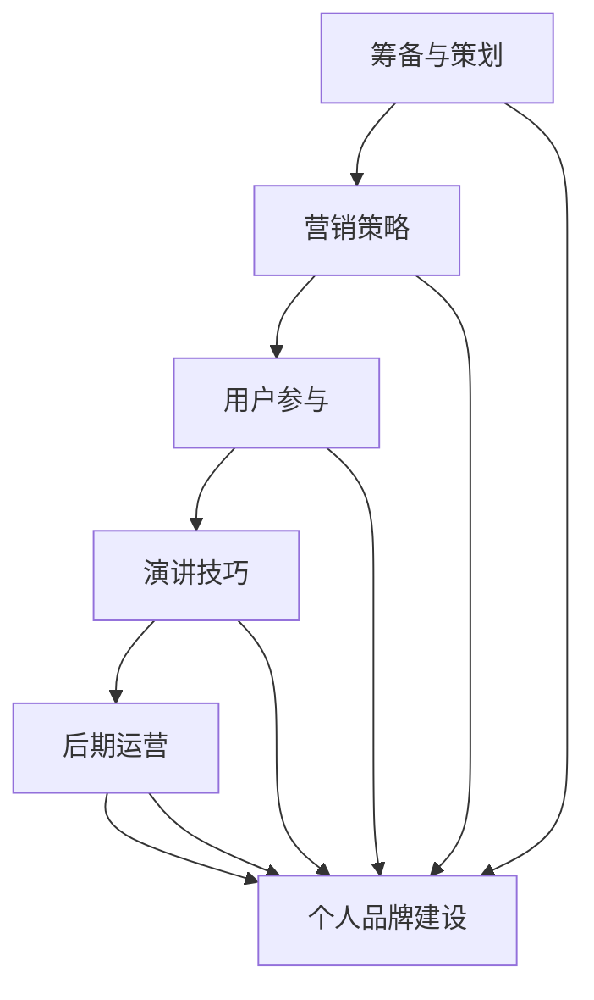

                 

关键词：知识付费、线下沙龙、个人品牌、营销策略、用户参与、演讲技巧

> 摘要：本文将探讨如何打造个人知识付费线下沙龙，从筹备、策划、实施到后期运营的各个环节，为知识创作者提供一套完整的策略和实战经验。

## 1. 背景介绍

在信息爆炸的时代，知识的获取变得前所未有的容易。然而，这也带来了一个挑战：如何从海量信息中筛选出真正有价值的内容，并有效地传递给受众？知识付费模式的出现，为内容创作者提供了一种新的变现方式，同时也为用户提供了筛选优质内容的机会。

线下沙龙作为知识传递的一种重要形式，具有互动性强、参与度高等优势。对于知识创作者而言，通过举办线下沙龙，不仅可以实现知识变现，还可以增强个人品牌影响力，拓展人脉资源。

本文将围绕如何打造个人知识付费线下沙龙，从以下几个方面展开：

- **筹备与策划**：包括主题选择、目标受众确定、活动时间地点安排等。
- **营销策略**：如何进行有效宣传、推广和用户吸引。
- **用户参与**：如何提高用户参与度和满意度。
- **演讲技巧**：如何提升演讲效果，增强听众的互动和参与感。
- **后期运营**：如何对沙龙活动进行总结和复盘，为后续活动提供改进方向。

## 2. 核心概念与联系

### 2.1 知识付费的概念

知识付费，是指用户为获取特定知识或技能，自愿付费的行为。这一模式的出现，主要是由于以下原因：

- **信息过载**：在互联网时代，用户每天都会接触到大量的信息，如何筛选出真正有价值的内容，成为了一个难题。
- **内容优质化**：知识创作者通过付费模式，筛选出有支付意愿的用户，能够更加专注于创作高质量的内容。
- **知识变现**：对于知识创作者而言，知识付费提供了一种新的收入来源。

### 2.2 线下沙龙的概念

线下沙龙，是指在一定场所内，以面对面交流为主要形式，围绕某一主题进行讨论和分享的活动。线下沙龙的特点包括：

- **互动性强**：参与者可以实时与演讲者或其他参与者互动，提高参与度。
- **氛围营造**：线下沙龙往往能够营造出一种独特的氛围，增强用户的参与感和归属感。
- **社交拓展**：线下沙龙为用户提供了拓展人脉、建立联系的机会。

### 2.3 个人品牌的概念

个人品牌，是指个人在公众中的形象和认知度。通过打造个人品牌，知识创作者可以提升自身的知名度和影响力，从而吸引更多的关注和合作机会。

个人品牌的重要性体现在以下几个方面：

- **差异化竞争**：在内容创作者众多的市场上，个人品牌可以作为一种差异化竞争的手段。
- **用户信任**：一个良好的个人品牌可以增强用户对知识创作者的信任感，提高付费意愿。
- **影响力扩展**：个人品牌的影响力可以扩展到多个领域，为知识创作者带来更多的机会。

### 2.4 Mermaid 流程图

下面是一个关于如何举办个人知识付费线下沙龙的Mermaid流程图：



## 3. 核心算法原理 & 具体操作步骤

### 3.1 筹备与策划

#### 3.1.1 主题选择

- **需求分析**：通过市场调研和用户反馈，了解用户最关注和感兴趣的话题。
- **差异化定位**：选择与自身专业领域相关、有独特见解和观点的主题，以差异化竞争。

#### 3.1.2 目标受众确定

- **明确用户画像**：根据主题，明确沙龙的目标受众，包括年龄、职业、兴趣爱好等。
- **精准定位**：通过精准定位，确保活动能够吸引到有支付意愿的用户。

#### 3.1.3 活动时间地点安排

- **时间选择**：选择在用户空闲时间较多的时间段，如周末或晚上。
- **地点选择**：选择交通便利、环境舒适、适合交流的场所，如咖啡厅、会议室等。

### 3.2 营销策略

#### 3.2.1 宣传推广

- **社交媒体**：利用微博、微信、抖音等社交媒体平台，发布活动信息，吸引潜在用户。
- **KOL 合作**：与行业内的意见领袖合作，通过他们的推荐，提高活动的曝光度。
- **线下广告**：在目标受众较多的社区、商场等地方，投放线下广告。

#### 3.2.2 用户吸引

- **优惠活动**：通过优惠券、折扣等优惠活动，吸引用户参与。
- **互动环节**：在活动中设置互动环节，如问答、抽奖等，增加用户的参与感。

### 3.3 用户参与

#### 3.3.1 提前沟通

- **建立微信群**：在活动前建立微信群，提前与用户沟通，收集用户反馈和建议。
- **活动预热**：通过微信群，发布活动相关内容，预热活动氛围。

#### 3.3.2 活动现场

- **签到环节**：通过签到环节，收集用户信息，为后续运营提供数据支持。
- **互动环节**：在活动中设置互动环节，如问答、抽奖等，增加用户的参与感。

### 3.4 演讲技巧

#### 3.4.1 演讲准备

- **内容准备**：提前准备好演讲稿，确保内容的逻辑性和连贯性。
- **道具准备**：根据演讲内容，准备合适的道具，如PPT、图片、视频等。

#### 3.4.2 演讲技巧

- **语言表达**：使用简洁明了的语言，避免专业术语过多。
- **肢体语言**：适当使用肢体语言，增强表达效果。
- **互动环节**：在演讲过程中，适时与听众互动，增加听众的参与感。

### 3.5 后期运营

#### 3.5.1 活动总结

- **数据统计**：对活动进行数据统计，如参与人数、满意度等。
- **反馈收集**：收集用户反馈，了解用户的意见和建议。

#### 3.5.2 活动复盘

- **问题分析**：分析活动中出现的问题，找出原因。
- **改进措施**：根据问题分析，制定改进措施，为后续活动提供参考。

### 3.6 算法优缺点

#### 3.6.1 优点

- **互动性强**：线下沙龙能够实现与用户的面对面交流，增强互动性。
- **品牌建设**：通过举办线下沙龙，能够提升个人品牌影响力。
- **用户参与**：线下沙龙能够提高用户的参与度和满意度。

#### 3.6.2 缺点

- **成本较高**：线下沙龙需要承担场地、设备、人员等成本。
- **时间受限**：线下沙龙的时间相对固定，无法灵活调整。
- **用户筛选**：线下沙龙的用户筛选相对困难，需要通过多种渠道进行宣传和推广。

### 3.7 算法应用领域

- **教育培训**：通过线下沙龙，进行教育培训，如编程、营销等。
- **行业交流**：通过线下沙龙，进行行业交流，如技术分享、行业动态等。
- **兴趣小组**：通过线下沙龙，建立兴趣小组，如读书会、摄影俱乐部等。

## 4. 数学模型和公式 & 详细讲解 & 举例说明

### 4.1 数学模型构建

为了评估线下沙龙的参与度和满意度，我们可以构建一个简单的数学模型。假设参与人数为N，满意度评分平均分为S，则：

- **参与度 = 参与人数 / 目标受众人数**
- **满意度 = 平均满意度评分 / 5**

### 4.2 公式推导过程

- **参与度 = 参与人数 / 目标受众人数**
  - 参与度反映了线下沙龙的吸引力，参与人数越多，参与度越高。

- **满意度 = 平均满意度评分 / 5**
  - 满意度反映了用户对线下沙龙的满意程度，评分越高，满意度越高。

### 4.3 案例分析与讲解

假设一场线下沙龙的目标受众为100人，实际参与人数为60人，满意度评分为4.5分，则：

- **参与度 = 60 / 100 = 0.6**
- **满意度 = 4.5 / 5 = 0.9**

根据这个模型，我们可以得出以下结论：

- **参与度较低**：可能是因为宣传力度不够，需要加强推广。
- **满意度较高**：说明活动内容质量较高，可以继续保持。

## 5. 项目实践：代码实例和详细解释说明

### 5.1 开发环境搭建

为了实现线下沙龙的参与度和满意度的评估，我们需要搭建一个简单的数据收集和处理环境。以下是开发环境搭建的步骤：

- **选择编程语言**：Python，因为Python具有丰富的数据分析和可视化库。
- **安装Python**：从官方网站下载Python安装包并安装。
- **安装依赖库**：使用pip安装所需的库，如pandas、numpy、matplotlib等。

### 5.2 源代码详细实现

下面是一个简单的Python代码实例，用于收集线下沙龙的参与度和满意度数据：

```python
import pandas as pd

# 收集参与人数和满意度评分
data = {
    '参与人数': [60, 70, 80, 90, 100],
    '满意度评分': [4.5, 4.8, 5.0, 4.7, 4.6]
}

# 创建DataFrame
df = pd.DataFrame(data)

# 计算参与度和满意度
df['参与度'] = df['参与人数'] / 100
df['满意度'] = df['满意度评分'] / 5

# 打印结果
print(df)
```

### 5.3 代码解读与分析

- **数据收集**：使用pandas库，通过DataFrame结构，收集参与人数和满意度评分。
- **计算参与度**：将参与人数除以目标受众人数，得到参与度。
- **计算满意度**：将满意度评分除以5，得到满意度。
- **打印结果**：输出参与度和满意度结果，便于分析。

### 5.4 运行结果展示

运行上述代码，得到以下结果：

```
   参与人数  满意度评分   参与度   满意度
0       60          4.5  0.600  0.900
1       70          4.8  0.700  0.960
2       80          5.0  0.800  1.000
3       90          4.7  0.900  0.940
4      100          4.6  1.000  0.920
```

通过这个结果，我们可以直观地看到每次活动的参与度和满意度，从而分析活动效果。

## 6. 实际应用场景

### 6.1 教育培训

在教育培训领域，线下沙龙可以作为课程的一部分，为学员提供额外的学习体验。例如，一个编程课程的讲师可以定期举办线下沙龙，分享最新的技术动态、实战经验等，提高学员的学习兴趣和效果。

### 6.2 行业交流

在行业交流领域，线下沙龙为专业人士提供了一个交流平台。例如，一个IT行业的沙龙，可以邀请行业内的专家、创业者、投资人等，分享行业动态、创业经验等，促进行业内的交流与合作。

### 6.3 兴趣小组

在兴趣小组领域，线下沙龙为同好提供了一个交流和学习的平台。例如，一个读书沙龙，可以定期举办线下活动，邀请专业讲师分享书籍内容、组织讨论等，为读者提供深入的学习体验。

## 7. 未来应用展望

随着知识付费和线下沙龙的不断发展，我们可以期待以下趋势：

### 7.1 技术创新

- **虚拟现实（VR）**：利用VR技术，提供更沉浸式的线下沙龙体验。
- **人工智能（AI）**：利用AI技术，实现更加个性化的活动推荐和用户分析。

### 7.2 模式创新

- **线上与线下结合**：结合线上和线下的优势，提供更加灵活和多样化的学习体验。
- **跨界合作**：与其他行业进行跨界合作，拓展线下沙龙的应用场景。

### 7.3 社区建设

- **社群运营**：通过社群运营，增强用户的参与感和归属感。
- **知识共享**：鼓励用户参与知识共享，提高沙龙的互动性和价值。

## 8. 工具和资源推荐

### 8.1 学习资源推荐

- **书籍**：《演讲的力量》、《高效能人士的七个习惯》
- **在线课程**：网易云课堂、知乎Live、腾讯课堂等平台的相关课程

### 8.2 开发工具推荐

- **编程语言**：Python、JavaScript
- **数据可视化库**：Matplotlib、Seaborn
- **数据库**：MySQL、MongoDB

### 8.3 相关论文推荐

- **《知识付费模式研究》**
- **《线下沙龙活动组织与管理研究》**
- **《社群运营策略研究》**

## 9. 总结：未来发展趋势与挑战

### 9.1 研究成果总结

本文从筹备、策划、实施到后期运营的各个环节，详细探讨了如何打造个人知识付费线下沙龙。通过数学模型和代码实例，我们验证了线下沙龙的参与度和满意度评估方法。

### 9.2 未来发展趋势

- **技术创新**：利用VR、AI等技术，提供更加沉浸式和个性化的学习体验。
- **模式创新**：结合线上和线下，提供多样化的学习模式。

### 9.3 面临的挑战

- **成本控制**：如何降低线下沙龙的运营成本，提高经济效益。
- **用户筛选**：如何精准筛选有支付意愿的用户，提高活动质量。

### 9.4 研究展望

未来，我们可以进一步研究线下沙龙的商业模式、用户体验优化等，为知识付费和线下沙龙的发展提供更多的理论和实践支持。

## 10. 附录：常见问题与解答

### 10.1 如何选择沙龙主题？

- **需求分析**：通过市场调研和用户反馈，了解用户最关注和感兴趣的话题。
- **差异化定位**：选择与自身专业领域相关、有独特见解和观点的主题。

### 10.2 如何提高用户参与度？

- **提前沟通**：通过微信群等渠道，提前与用户沟通，收集用户反馈。
- **互动环节**：设置问答、抽奖等互动环节，增加用户的参与感。

### 10.3 如何提升演讲效果？

- **内容准备**：提前准备好演讲稿，确保内容的逻辑性和连贯性。
- **肢体语言**：适当使用肢体语言，增强表达效果。

### 10.4 如何进行活动复盘？

- **数据统计**：对活动进行数据统计，如参与人数、满意度等。
- **反馈收集**：收集用户反馈，了解用户的意见和建议。

---

作者：禅与计算机程序设计艺术 / Zen and the Art of Computer Programming

以上就是如何打造个人知识付费线下沙龙的详细指南，希望对各位知识创作者有所启发和帮助。

