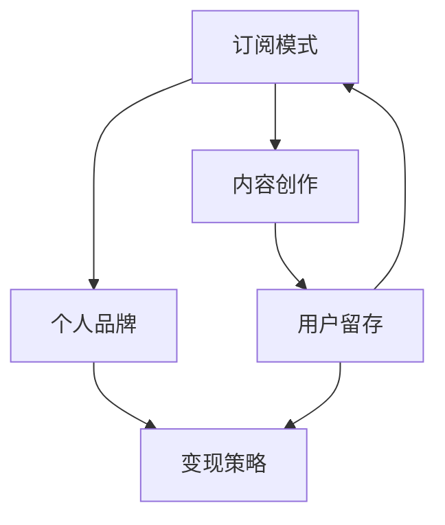

                 

关键词：知识付费、订阅模式、个人品牌、内容创作、用户留存、变现策略

> 摘要：本文将深入探讨个人知识付费订阅模式的构建策略，从核心概念、算法原理、数学模型到实际应用，全面解析如何打造一个具有吸引力的知识付费平台，实现个人品牌的商业化发展。

## 1. 背景介绍

随着互联网技术的迅猛发展，知识付费行业逐渐崛起。用户对于优质内容的需求不断增长，而内容创作者也找到了一个新的变现途径。个人知识付费订阅模式应运而生，它允许创作者通过定期发布高质量内容，吸引订阅用户，实现持续收入。本文将探讨如何构建这样一个模式，并分析其成功的关键因素。

### 1.1 知识付费的发展现状

近年来，知识付费已经成为一个庞大的市场。从线上课程、电子书籍到音频、视频讲座，各种形式的知识产品层出不穷。根据统计数据，全球知识付费市场规模逐年增长，预计到2025年将达到数万亿美元。

### 1.2 个人品牌的重要性

在知识付费领域，个人品牌的重要性不言而喻。一个强大的个人品牌能够吸引更多的关注和信任，进而转化为订阅用户。因此，创作者需要在内容创作、品牌形象、用户互动等多个方面下功夫。

## 2. 核心概念与联系

构建个人知识付费订阅模式，需要理解以下几个核心概念：

### 2.1 订阅模式

订阅模式是一种商业模式，用户为获取持续的服务或内容，定期支付费用。它不同于一次性购买，具有周期性和持续性的特点。

### 2.2 个人品牌

个人品牌是指个人在特定领域内的声誉和影响力。它包含个人形象、专业知识、社交网络等多个方面。

### 2.3 内容创作

内容创作是知识付费的核心。高质量、有深度、有价值的知识内容是吸引订阅用户的关键。

### 2.4 用户留存

用户留存是指用户在订阅后持续使用平台服务的时间。高留存率是订阅模式成功的重要指标。

### 2.5 变现策略

变现策略是指将个人品牌和内容转化为实际收入的方法。有效的变现策略能够确保持续盈利。

下面是一个Mermaid流程图，展示这些核心概念之间的关系：



## 3. 核心算法原理 & 具体操作步骤

### 3.1 算法原理概述

构建个人知识付费订阅模式的算法原理主要包括以下几个方面：

1. 内容筛选与发布策略
2. 用户画像与个性化推荐
3. 用户互动与留存策略
4. 收益分配与变现策略

### 3.2 算法步骤详解

#### 3.2.1 内容筛选与发布策略

1. 初始内容策划：根据个人品牌定位，确定核心知识领域和目标受众。
2. 内容创作与审核：创作者需持续产出高质量内容，并经过审核团队筛选。
3. 定期发布计划：制定内容发布计划，确保内容的连续性和一致性。

#### 3.2.2 用户画像与个性化推荐

1. 用户数据收集：通过用户注册、浏览、购买等行为数据，构建用户画像。
2. 个性化推荐算法：利用用户画像，推荐符合用户兴趣的内容。
3. 用户反馈收集与优化：根据用户反馈调整推荐策略，提高用户满意度。

#### 3.2.3 用户互动与留存策略

1. 用户互动平台搭建：建立社区、论坛或直播平台，促进用户互动。
2. 用户参与激励：通过积分、奖励等方式，激励用户积极参与平台活动。
3. 用户留存分析：监控用户活跃度、留存率等指标，持续优化用户体验。

#### 3.2.4 收益分配与变现策略

1. 订阅费用设置：根据内容价值和市场定位，设定合理的订阅费用。
2. 收益分配机制：明确创作者、平台和合作伙伴之间的收益分配比例。
3. 多渠道变现：除了订阅费用外，还可以通过广告、赞助、课程销售等渠道实现变现。

### 3.3 算法优缺点

#### 优点

1. 持续收入：订阅模式能够为创作者带来稳定的收入。
2. 用户粘性：定期更新的内容能够提高用户粘性，增加留存率。
3. 个性化推荐：个性化推荐能够提高用户满意度，促进订阅转化。

#### 缺点

1. 成本高：构建和维护订阅模式需要大量的人力、物力和财力投入。
2. 竞争激烈：知识付费领域竞争激烈，需要不断创新和提升内容质量。
3. 用户流失：订阅用户可能会因内容不满足需求或费用过高而流失。

### 3.4 算法应用领域

个人知识付费订阅模式广泛应用于教育、职场技能、健康养生等多个领域。例如，一个专业程序员可以通过订阅模式分享编程知识，一个健身教练可以通过订阅模式提供健康指导。

## 4. 数学模型和公式 & 详细讲解 & 举例说明

### 4.1 数学模型构建

构建个人知识付费订阅模式的数学模型主要包括以下方面：

1. 用户增长模型：描述用户订阅数量随时间变化的规律。
2. 用户留存模型：描述用户持续订阅的概率。
3. 收益模型：计算订阅收入、广告收入和其他收入。

### 4.2 公式推导过程

#### 用户增长模型

设\( P(t) \)为时间\( t \)的用户订阅数量，\( r \)为订阅转化率，\( t_0 \)为初始时间。用户增长模型可以表示为：

\[ P(t) = P(t_0) \times (1 + r)^{t - t_0} \]

其中，\( P(t_0) \)为初始订阅数量，\( r \)为订阅转化率，表示每个潜在用户转化为订阅用户的概率。

#### 用户留存模型

设\( L(t) \)为时间\( t \)的用户留存数量，\( s \)为用户留存率。用户留存模型可以表示为：

\[ L(t) = P(t) \times (1 - s)^{t - t_0} \]

其中，\( L(t_0) \)为初始留存数量，\( s \)为用户留存率，表示每个订阅用户在时间\( t \)内留存的概率。

#### 收益模型

设\( R(t) \)为时间\( t \)的总收入，\( C \)为订阅费用，\( A \)为广告收入，\( S \)为其他收入。收益模型可以表示为：

\[ R(t) = C \times P(t) + A + S \]

其中，\( C \)为订阅费用，\( A \)为广告收入，\( S \)为其他收入。

### 4.3 案例分析与讲解

#### 案例一：用户增长模型

假设某知识付费平台初始订阅数量为1000人，订阅转化率为10%，求一年后的用户订阅数量。

根据用户增长模型：

\[ P(1) = 1000 \times (1 + 0.1)^{1 - 0} = 1100 \]

一年后，用户订阅数量为1100人。

#### 案例二：用户留存模型

假设某知识付费平台订阅转化率为10%，用户留存率为90%，求一年后的用户留存数量。

根据用户留存模型：

\[ L(1) = 1000 \times (1 - 0.1)^{1 - 0} = 900 \]

一年后，用户留存数量为900人。

#### 案例三：收益模型

假设某知识付费平台订阅费用为每月100元，广告收入为每月1000元，其他收入为每月500元，求一年后的总收入。

根据收益模型：

\[ R(1) = 100 \times 1100 + 1000 + 500 = 21000 \]

一年后，总收入为21000元。

## 5. 项目实践：代码实例和详细解释说明

### 5.1 开发环境搭建

在本节中，我们将使用Python语言和Flask框架搭建一个简单的知识付费订阅平台。首先，确保您的计算机上已经安装了Python环境和Flask框架。

```bash
pip install flask
```

### 5.2 源代码详细实现

下面是一个简单的示例代码，实现了用户注册、登录和订阅功能。

```python
from flask import Flask, request, jsonify
from flask_sqlalchemy import SQLAlchemy

app = Flask(__name__)
app.config['SQLALCHEMY_DATABASE_URI'] = 'sqlite:///subscription.db'
db = SQLAlchemy(app)

class User(db.Model):
    id = db.Column(db.Integer, primary_key=True)
    username = db.Column(db.String(80), unique=True, nullable=False)
    password = db.Column(db.String(120), nullable=False)
    is_subscribed = db.Column(db.Boolean, default=False)

@app.route('/register', methods=['POST'])
def register():
    username = request.form['username']
    password = request.form['password']
    user = User(username=username, password=password)
    db.session.add(user)
    db.session.commit()
    return jsonify({'message': 'User registered successfully.'})

@app.route('/login', methods=['POST'])
def login():
    username = request.form['username']
    password = request.form['password']
    user = User.query.filter_by(username=username, password=password).first()
    if user:
        return jsonify({'message': 'Login successful.'})
    else:
        return jsonify({'message': 'Invalid credentials.'})

@app.route('/subscribe', methods=['POST'])
def subscribe():
    username = request.form['username']
    user = User.query.filter_by(username=username).first()
    if user:
        user.is_subscribed = True
        db.session.commit()
        return jsonify({'message': 'Subscription successful.'})
    else:
        return jsonify({'message': 'User not found.'})

if __name__ == '__main__':
    db.create_all()
    app.run(debug=True)
```

### 5.3 代码解读与分析

在上面的代码中，我们首先导入了必要的模块，包括Flask和Flask-SQLAlchemy。接着，我们定义了用户模型`User`，包括用户ID、用户名、密码和订阅状态。

#### 用户注册

`/register`接口用于用户注册。用户需要提交用户名和密码，后台会创建一个用户记录并存储在数据库中。

#### 用户登录

`/login`接口用于用户登录。用户需要提交用户名和密码，后台会查询数据库验证用户身份。

#### 订阅

`/subscribe`接口用于用户订阅。用户需要提交用户名，后台会更新用户的订阅状态。

### 5.4 运行结果展示

运行代码后，您可以使用浏览器或Postman等工具进行接口测试。

- 注册：POST /register?username=<用户名>&password=<密码>
- 登录：POST /login?username=<用户名>&password=<密码>
- 订阅：POST /subscribe?username=<用户名>

## 6. 实际应用场景

个人知识付费订阅模式在实际应用中具有广泛的应用场景，以下是一些典型例子：

### 6.1 在线教育平台

在线教育平台通常采用订阅模式，提供课程视频、直播课程、教学文档等。例如，知名在线教育平台“知乎Live”就采用了订阅模式，用户可以订阅特定领域的专家课程，获取专业知识。

### 6.2 专业咨询与顾问服务

专业咨询与顾问服务也适合采用订阅模式。例如，企业主可以订阅专业的管理咨询顾问服务，获取定期的管理建议和策略指导。

### 6.3 健康养生与生活方式指导

健康养生与生活方式指导领域也适合订阅模式。用户可以订阅专业营养师、健身教练或心理医生的服务，获取个性化的健康指导和生活方式建议。

### 6.4 创意内容制作与传播

创意内容制作与传播领域，如动画制作、音乐创作、艺术设计等，也可以采用订阅模式。创作者可以定期发布原创作品，吸引用户订阅，实现内容变现。

## 7. 工具和资源推荐

### 7.1 学习资源推荐

1. **《精益创业》**：了解如何构建和优化业务模型。
2. **《用户故事映射》**：学习如何与用户互动，构建用户故事。
3. **《Python编程：从入门到实践》**：学习Python编程基础。

### 7.2 开发工具推荐

1. **GitHub**：用于代码托管和项目管理。
2. **Visual Studio Code**：一款强大的代码编辑器，支持多种编程语言。
3. **Jupyter Notebook**：用于数据分析和可视化。

### 7.3 相关论文推荐

1. **“订阅商业模式：理论与实践”**：探讨订阅商业模式的理论基础和实践应用。
2. **“知识付费：现状、挑战与机遇”**：分析知识付费行业的现状和未来趋势。
3. **“基于用户行为的个性化推荐算法研究”**：介绍个性化推荐算法的设计和应用。

## 8. 总结：未来发展趋势与挑战

### 8.1 研究成果总结

本文从多个角度探讨了个人知识付费订阅模式的构建策略，包括核心概念、算法原理、数学模型和实际应用。研究表明，订阅模式在知识付费领域具有巨大的潜力，能够为创作者和用户提供双赢的解决方案。

### 8.2 未来发展趋势

随着互联网技术的不断进步，知识付费订阅模式将继续发展，并呈现出以下趋势：

1. **内容多样化**：知识付费平台将提供更多样化的内容形式，如虚拟现实、增强现实等。
2. **个性化推荐**：基于用户行为的个性化推荐将成为主流，提高用户体验。
3. **社交互动**：社交互动将促进用户参与和留存，成为知识付费平台的重要组成部分。

### 8.3 面临的挑战

尽管订阅模式具有巨大潜力，但创作者和平台在实施过程中仍将面临以下挑战：

1. **内容质量**：高质量、有价值的知识内容是吸引用户的关键，但创作高质量内容需要时间和精力。
2. **用户留存**：如何提高用户留存率，避免用户流失，是知识付费平台需要持续关注的问题。
3. **市场竞争**：知识付费领域竞争激烈，平台需要不断创新和提升内容质量，以保持竞争力。

### 8.4 研究展望

未来，个人知识付费订阅模式的研究将集中在以下几个方面：

1. **算法优化**：通过改进推荐算法和用户留存策略，提高用户满意度和留存率。
2. **商业模式创新**：探索新的商业模式，如内容共享、联合订阅等，提高平台的盈利能力。
3. **技术应用**：利用人工智能、大数据等新技术，提高内容创作和用户服务的效率。

## 9. 附录：常见问题与解答

### 9.1 如何确定订阅费用？

订阅费用应根据内容价值、市场定位和目标受众来确定。一般来说，高质量的、有专业背景的内容可以设定较高的费用，而初学者或入门级内容可以设定较低的收费。

### 9.2 如何提高用户留存率？

提高用户留存率可以从以下几个方面入手：

1. **内容质量**：确保内容有深度、有价值，满足用户需求。
2. **用户互动**：建立社区或论坛，鼓励用户互动和参与。
3. **个性化推荐**：基于用户行为数据，提供个性化推荐，提高用户满意度。
4. **用户激励**：通过积分、奖励等方式，激励用户积极参与平台活动。

### 9.3 如何避免用户流失？

避免用户流失可以从以下几个方面入手：

1. **内容更新**：定期发布高质量的新内容，保持用户的持续关注。
2. **用户反馈**：积极收集用户反馈，及时解决问题，提高用户体验。
3. **优惠活动**：通过限时优惠、套餐优惠等方式，吸引用户续订。
4. **用户关怀**：定期向用户发送问候和关怀邮件，增加用户黏性。

## 作者署名

作者：禅与计算机程序设计艺术 / Zen and the Art of Computer Programming

