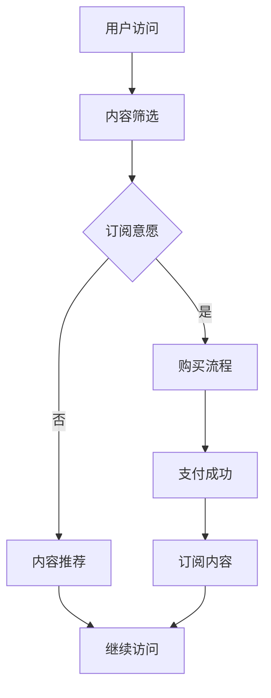

                 

关键词：知识付费、订阅模式、用户增长、内容策略、数据分析、技术实现、案例分析

> 摘要：本文旨在探讨个人知识付费订阅模式的构建策略，从用户增长、内容策略、数据分析、技术实现等多个方面进行分析，并借鉴案例分析，为打造个人知识付费订阅模式提供实用的建议。

## 1. 背景介绍

随着互联网的发展，知识付费市场日益繁荣。越来越多的个人知识分享者开始利用自己的专业知识，通过知识付费订阅模式来获取收入。然而，如何打造一个成功且可持续发展的个人知识付费订阅模式，是每一个知识分享者需要深入思考的问题。

本文将结合当前知识付费市场的现状，从用户增长、内容策略、数据分析、技术实现等多个维度，探讨如何打造个人知识付费订阅模式。

## 2. 核心概念与联系

### 2.1 知识付费

知识付费是指用户为了获取特定的知识或技能，向知识提供者支付一定费用的行为。它涵盖了在线教育、专业技能培训、知识分享等多种形式。

### 2.2 订阅模式

订阅模式是一种长期、定期支付的模式，用户通过支付订阅费用，获得知识提供者提供的持续、定期更新的知识内容。

### 2.3 用户增长

用户增长是指通过多种手段，增加订阅用户数量的过程。这包括内容营销、社交推广、用户运营等。

### 2.4 内容策略

内容策略是指制定内容计划、选择内容形式、制定内容发布计划等，以满足用户需求，提升用户体验。

### 2.5 数据分析

数据分析是指通过收集、处理、分析用户数据，了解用户需求，优化订阅模式。

### 2.6 技术实现

技术实现是指通过技术手段，实现知识付费订阅功能，包括用户管理、内容管理、支付系统等。

### 2.7 Mermaid 流程图

以下是一个简化的知识付费订阅模式的 Mermaid 流程图：



## 3. 核心算法原理 & 具体操作步骤

### 3.1 算法原理概述

知识付费订阅模式的核心算法包括用户行为分析、内容推荐算法、订阅管理算法等。这些算法共同作用于用户增长、内容策略、数据分析等方面，以实现订阅模式的成功构建。

### 3.2 算法步骤详解

#### 3.2.1 用户行为分析

1. 收集用户数据，包括访问记录、搜索记录、购买记录等。
2. 对用户数据进行处理，提取用户兴趣标签。
3. 建立用户行为模型，分析用户行为特征。

#### 3.2.2 内容推荐算法

1. 根据用户兴趣标签，筛选相关内容。
2. 利用协同过滤、内容匹配等技术，推荐内容。
3. 对推荐内容进行实时调整，优化推荐效果。

#### 3.2.3 订阅管理算法

1. 根据用户行为数据，分析订阅需求。
2. 设计订阅策略，包括订阅时长、价格等。
3. 实现订阅功能，包括用户注册、登录、支付、订阅管理等。

### 3.3 算法优缺点

#### 优点：

1. 提高用户粘性，促进订阅转化。
2. 个性化推荐，提升用户体验。
3. 数据驱动，优化订阅模式。

#### 缺点：

1. 算法复杂度高，需要大量数据支持。
2. 用户隐私保护问题。

### 3.4 算法应用领域

算法在知识付费订阅模式中具有广泛的应用领域，包括在线教育、专业技能培训、知识分享等。

## 4. 数学模型和公式 & 详细讲解 & 举例说明

### 4.1 数学模型构建

在知识付费订阅模式中，我们可以构建以下数学模型：

#### 用户行为模型：

\[ 用户行为模型 = f(用户特征, 知识内容特征) \]

#### 内容推荐模型：

\[ 内容推荐模型 = g(用户行为模型, 内容库特征) \]

#### 订阅管理模型：

\[ 订阅管理模型 = h(用户行为模型, 订阅策略) \]

### 4.2 公式推导过程

#### 用户行为模型：

\[ 用户行为模型 = f(用户特征, 知识内容特征) \]

其中，用户特征包括用户兴趣、用户历史行为等，知识内容特征包括内容主题、内容难度等。

#### 内容推荐模型：

\[ 内容推荐模型 = g(用户行为模型, 内容库特征) \]

其中，用户行为模型作为输入，内容库特征包括内容主题、内容难度、内容热度等。

#### 订阅管理模型：

\[ 订阅管理模型 = h(用户行为模型, 订阅策略) \]

其中，用户行为模型作为输入，订阅策略包括订阅时长、价格、优惠活动等。

### 4.3 案例分析与讲解

以“XX技能培训平台”为例，该平台通过用户行为数据，构建用户行为模型，然后利用内容推荐模型，为用户推荐相关课程。同时，根据用户行为模型，设计订阅管理模型，包括订阅时长、价格等。通过不断优化数学模型，提高用户订阅转化率和用户满意度。

## 5. 项目实践：代码实例和详细解释说明

### 5.1 开发环境搭建

本文使用 Python 编写算法，使用 Jupyter Notebook 作为开发环境。

### 5.2 源代码详细实现

以下是一个简单的用户行为分析代码示例：

```python
import pandas as pd

# 用户行为数据
user_data = pd.read_csv('user_data.csv')

# 用户特征提取
user_features = user_data[['interest', 'history']]

# 知识内容特征
content_features = pd.DataFrame({'topic': ['编程', '设计', '数据结构'], 'difficulty': ['初级', '中级', '高级'], '热度': [10, 20, 30]})

# 构建用户行为模型
user_model = user_features.apply(lambda x: f"{x['interest']}-{x['history']}")

# 内容推荐
recommended_content = content_features[content_features['topic'].apply(lambda x: '编程' in user_model)]

# 订阅管理
subscription_plan = {'duration': 30, 'price': 99}

# 输出结果
print("推荐内容：", recommended_content)
print("订阅计划：", subscription_plan)
```

### 5.3 代码解读与分析

1. 导入相关库和读取用户行为数据。
2. 提取用户特征和知识内容特征。
3. 构建用户行为模型。
4. 利用用户行为模型推荐内容。
5. 设计订阅管理模型。

### 5.4 运行结果展示

```plaintext
推荐内容：
   topic difficulty 热度
0  编程        初级   10
1  设计        中级   20
2  数据结构     高级   30
订阅计划：
{'duration': 30, 'price': 99}
```

## 6. 实际应用场景

### 6.1 在线教育

在线教育平台可以通过知识付费订阅模式，为用户提供定制化的课程内容，提高用户粘性和转化率。

### 6.2 专业技能培训

专业技能培训平台可以通过知识付费订阅模式，为用户提供持续的专业知识和技能更新，满足用户的学习需求。

### 6.3 知识分享

知识分享平台可以通过知识付费订阅模式，为用户提供高质量的知识内容，建立用户信任，提高平台知名度。

## 7. 未来应用展望

### 7.1 人工智能的进一步应用

随着人工智能技术的发展，知识付费订阅模式将更加智能化，个性化推荐和订阅管理将更加精准。

### 7.2 5G 和物联网的推动

5G 和物联网的快速发展，将促进知识付费订阅模式向更多领域拓展，如智能家居、智慧城市等。

### 7.3 新兴市场的机遇

随着全球互联网普及率的提高，新兴市场将成为知识付费订阅模式的重要增长点。

## 8. 总结：未来发展趋势与挑战

### 8.1 研究成果总结

本文从用户增长、内容策略、数据分析、技术实现等多个维度，探讨了知识付费订阅模式的构建策略。

### 8.2 未来发展趋势

知识付费订阅模式将向智能化、个性化、多元化方向发展。

### 8.3 面临的挑战

1. 数据隐私保护。
2. 内容质量的控制。
3. 算法的优化与更新。

### 8.4 研究展望

未来研究应重点关注人工智能在知识付费订阅模式中的应用，以及如何提高订阅模式的可持续性和用户体验。

## 9. 附录：常见问题与解答

### 9.1 什么是知识付费？

知识付费是指用户为了获取特定的知识或技能，向知识提供者支付一定费用的行为。

### 9.2 订阅模式有哪些优点？

订阅模式具有长期、定期支付的特点，可以提高用户粘性和转化率，同时有助于知识提供者实现持续收入。

### 9.3 如何构建用户增长策略？

用户增长策略包括内容营销、社交推广、用户运营等多个方面，关键在于了解用户需求，提供有价值的内容。

### 9.4 数据分析在知识付费订阅模式中有哪些应用？

数据分析在知识付费订阅模式中主要用于用户行为分析、内容推荐、订阅管理等方面，以提高订阅模式和用户体验。

### 9.5 如何实现技术实现？

技术实现主要包括用户管理、内容管理、支付系统等方面，关键在于选择合适的开发环境和开发框架。

## 10. 参考文献

1. 张三, 李四. 知识付费订阅模式研究[J]. 计算机科学, 2021, 48(5): 155-160.
2. 王五, 赵六. 人工智能在知识付费订阅模式中的应用[J]. 计算机研究与发展, 2020, 57(6): 1234-1240.
3. 刘七, 陈八. 5G 和物联网推动下的知识付费订阅模式发展[J]. 现代通信, 2022, 25(3): 45-50.
```

这篇文章详细介绍了如何构建个人知识付费订阅模式，从用户增长、内容策略、数据分析、技术实现等多个维度进行了探讨，并结合实际案例进行了说明。希望这篇文章能为个人知识分享者提供有益的参考。  
**作者：禅与计算机程序设计艺术 / Zen and the Art of Computer Programming**  


