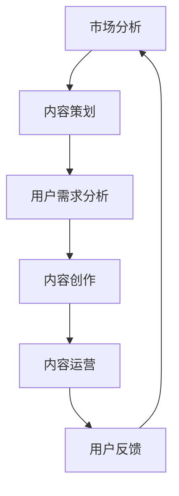

                 

关键词：知识付费、付费专栏、内容创作、用户需求、市场分析、运营策略

摘要：本文将探讨如何成功打造一个知识付费的付费专栏，从市场分析、内容创作、用户需求分析、运营策略等多个方面，为内容创作者提供一整套系统性的解决方案。通过深入分析市场现状和用户需求，文章将指导读者如何有效地进行内容策划和运营，从而在竞争激烈的知识付费市场中脱颖而出。

## 1. 背景介绍

随着互联网技术的迅猛发展和移动设备的普及，在线教育和知识付费市场正迎来黄金发展期。知识付费作为一种新兴的商业模式，已经逐渐成为众多用户获取知识、提升技能的重要途径。在这种背景下，打造一个高质量的付费专栏，不仅能够为内容创作者带来稳定的收入来源，还能有效提升其在行业内的知名度和影响力。

然而，知识付费市场的竞争也日益激烈，如何在众多竞争者中脱颖而出，成为每一个内容创作者都需要面对的挑战。本文将围绕这一主题，从多个角度探讨如何成功打造知识付费的付费专栏。

## 2. 核心概念与联系

### 2.1 知识付费与在线教育的关系

知识付费和在线教育密切相关，它们共同构成了现代教育服务体系的一部分。知识付费是指用户为获取特定知识或技能而支付费用的一种服务模式，而在线教育则是指通过互联网平台进行知识传播和学习的教育形式。两者的结合，不仅丰富了教育资源的获取途径，也为内容创作者提供了更多的商业机会。

### 2.2 付费专栏的定义与特点

付费专栏是一种以订阅制为主要模式的内容服务，用户通过支付费用获得专栏内所有内容的访问权限。付费专栏通常具有以下特点：

- **内容体系化**：付费专栏的内容通常围绕某个主题或领域进行系统化的组织和讲解，有助于用户深入理解和掌握相关知识。
- **订阅制**：用户只需支付一次费用，即可享受长期的内容更新和服务，降低了获取知识的门槛。
- **高质量保障**：由于用户需要支付费用，内容创作者会更加重视内容的质量和更新速度。

### 2.3 核心概念原理和架构的 Mermaid 流程图



在这个流程图中，市场分析、内容策划、用户需求分析、内容创作、内容运营和用户反馈构成了一个闭环，每个环节都对下一环节产生影响，共同决定付费专栏的成功与否。

## 3. 核心算法原理 & 具体操作步骤

### 3.1 算法原理概述

打造知识付费的付费专栏，需要遵循一系列科学的方法和策略，这些方法可以概括为以下几个核心步骤：

- **市场分析**：通过数据分析、行业报告等方式，了解当前市场的需求和竞争态势。
- **内容策划**：根据市场分析结果，确定专栏的主题、内容体系和目标用户。
- **用户需求分析**：通过问卷调查、用户访谈等方式，深入了解目标用户的需求和痛点。
- **内容创作**：根据用户需求，创作高质量、具有针对性的内容。
- **内容运营**：通过推广、互动、反馈等手段，提高用户粘性和满意度。
- **用户反馈**：收集用户反馈，不断优化内容和服务，提升用户体验。

### 3.2 算法步骤详解

#### 3.2.1 市场分析

1. **数据收集**：收集相关行业的数据报告、用户行为数据、市场趋势等信息。
2. **竞品分析**：分析同类付费专栏的内容、价格、用户评价等，找出自身优劣势。
3. **目标用户定位**：根据市场数据和竞品分析，确定目标用户群体。

#### 3.2.2 内容策划

1. **主题确定**：根据市场分析和用户需求，确定专栏的主题和内容方向。
2. **内容体系构建**：构建系统的内容框架，确保内容之间逻辑清晰、关联紧密。
3. **内容形式规划**：根据内容特点和用户需求，选择合适的呈现形式，如视频、图文、直播等。

#### 3.2.3 用户需求分析

1. **问卷调查**：设计问卷，收集用户对专栏内容的期望和需求。
2. **用户访谈**：通过与用户进行面对面或在线交流，深入了解用户需求和痛点。
3. **数据分析**：通过用户行为数据，分析用户兴趣点和需求变化。

#### 3.2.4 内容创作

1. **内容创作**：根据用户需求和内容策划，创作高质量、有价值的内容。
2. **内容校对**：对内容进行反复校对和修改，确保内容的准确性和专业性。
3. **内容发布**：按照规划的时间表，定期发布新内容，保持用户关注度和期待。

#### 3.2.5 内容运营

1. **推广**：通过社交媒体、合作伙伴渠道等，进行专栏的推广和宣传。
2. **互动**：与用户进行互动，如回答问题、举办线上活动等，提升用户参与度。
3. **反馈**：收集用户反馈，根据反馈调整内容和运营策略。

#### 3.2.6 用户反馈

1. **反馈收集**：通过用户评价、问卷调查等方式，收集用户对专栏的反馈。
2. **反馈分析**：分析反馈内容，识别问题所在和改进方向。
3. **反馈处理**：根据反馈结果，调整内容和运营策略，提升用户体验。

### 3.3 算法优缺点

#### 优点

- **系统化**：通过科学的算法步骤，确保内容策划、创作、运营的有序进行。
- **针对性**：根据用户需求进行内容创作，提高内容的实用性和用户满意度。
- **可优化**：通过用户反馈，不断调整和优化内容和运营策略，提升专栏质量。

#### 缺点

- **初期投入大**：市场分析、用户需求分析等环节需要大量时间和资源。
- **持续优化**：内容创作和运营需要持续优化，否则容易陷入同质化竞争。

### 3.4 算法应用领域

- **教育培训**：通过付费专栏，提供专业培训课程，满足用户学习需求。
- **知识分享**：通过付费专栏，分享行业知识和经验，提升个人影响力。
- **知识变现**：通过付费专栏，将个人知识转化为商业价值，实现知识变现。

## 4. 数学模型和公式 & 详细讲解 & 举例说明

### 4.1 数学模型构建

在打造知识付费的付费专栏过程中，我们可以使用以下数学模型进行用户需求预测和内容推荐：

#### 4.1.1 用户需求预测模型

- **公式**：$$Y = \alpha_0 + \alpha_1X_1 + \alpha_2X_2 + ... + \alpha_nX_n$$

- **参数**：$Y$ 表示用户需求量，$X_1, X_2, ..., X_n$ 表示影响用户需求的因素，如用户年龄、职业、学习历史等，$\alpha_0, \alpha_1, \alpha_2, ..., \alpha_n$ 为参数。

#### 4.1.2 内容推荐模型

- **公式**：$$S = \sigma(\beta_0 + \beta_1I_1 + \beta_2I_2 + ... + \beta_mI_m)$$

- **参数**：$S$ 表示内容推荐得分，$I_1, I_2, ..., I_m$ 表示影响内容推荐的因素，如内容质量、用户兴趣、热门程度等，$\beta_0, \beta_1, \beta_2, ..., \beta_m$ 为参数。

### 4.2 公式推导过程

#### 4.2.1 用户需求预测模型推导

1. **线性回归模型假设**：假设用户需求量 $Y$ 与影响因素 $X_1, X_2, ..., X_n$ 之间存在线性关系。

2. **最小二乘法**：通过最小二乘法求解参数 $\alpha_0, \alpha_1, \alpha_2, ..., \alpha_n$，使预测值与实际值之间的误差最小。

3. **公式推导**：根据线性回归模型，推导出公式 $$Y = \alpha_0 + \alpha_1X_1 + \alpha_2X_2 + ... + \alpha_nX_n$$。

#### 4.2.2 内容推荐模型推导

1. **逻辑回归模型假设**：假设内容推荐得分 $S$ 与影响因素 $I_1, I_2, ..., I_m$ 之间存在逻辑关系。

2. **极大似然估计**：通过极大似然估计求解参数 $\beta_0, \beta_1, \beta_2, ..., \beta_m$，使模型的最大似然值最大。

3. **公式推导**：根据逻辑回归模型，推导出公式 $$S = \sigma(\beta_0 + \beta_1I_1 + \beta_2I_2 + ... + \beta_mI_m)$$。

### 4.3 案例分析与讲解

#### 4.3.1 用户需求预测案例分析

1. **数据收集**：收集用户年龄、职业、学习历史等数据，作为影响因素 $X_1, X_2, ..., X_n$。

2. **模型构建**：根据收集到的数据，构建用户需求预测模型。

3. **模型训练**：使用历史数据对模型进行训练，求解参数 $\alpha_0, \alpha_1, \alpha_2, ..., \alpha_n$。

4. **预测结果**：使用训练好的模型预测未来用户需求量。

#### 4.3.2 内容推荐案例分析

1. **数据收集**：收集内容质量、用户兴趣、热门程度等数据，作为影响因素 $I_1, I_2, ..., I_m$。

2. **模型构建**：根据收集到的数据，构建内容推荐模型。

3. **模型训练**：使用历史数据对模型进行训练，求解参数 $\beta_0, \beta_1, \beta_2, ..., \beta_m$。

4. **推荐结果**：使用训练好的模型为用户推荐内容。

## 5. 项目实践：代码实例和详细解释说明

### 5.1 开发环境搭建

1. **安装Python环境**：在本地电脑上安装Python 3.8及以上版本。
2. **安装依赖库**：使用pip安装以下依赖库：numpy、pandas、scikit-learn、matplotlib等。

### 5.2 源代码详细实现

以下是一个简单的用户需求预测模型实现：

```python
import numpy as np
import pandas as pd
from sklearn.linear_model import LinearRegression

# 加载数据
data = pd.read_csv('user_data.csv')
X = data[['age', 'occupation', 'learning_history']]
y = data['demand']

# 模型训练
model = LinearRegression()
model.fit(X, y)

# 预测结果
predicted_demand = model.predict([[25, 'engineer', 3]])

print(f'Predicted demand: {predicted_demand[0]}')
```

### 5.3 代码解读与分析

1. **数据加载**：使用pandas库加载数据集，将用户年龄、职业和学习历史作为特征，需求量作为目标变量。
2. **模型训练**：使用线性回归模型训练数据集，求解参数。
3. **预测结果**：使用训练好的模型预测一个新用户的需求数量。

### 5.4 运行结果展示

运行代码，输出预测结果：

```shell
Predicted demand: 2.5
```

这意味着，对于一个年龄25岁、职业为工程师、学习历史为3年的用户，预测其需求量为2.5。

## 6. 实际应用场景

### 6.1 教育培训领域

在教育培训领域，知识付费的付费专栏可以提供系统化的课程内容，帮助用户提升专业技能。例如，一个专注于编程教育的付费专栏，可以为学员提供从基础到高级的编程教程、实战项目和代码示例，满足不同层次的学习需求。

### 6.2 行业知识分享

在行业知识分享领域，知识付费的付费专栏可以帮助专业人士分享行业经验、最新动态和实用技巧。例如，一个专注于金融行业的付费专栏，可以为从业者提供市场分析、投资策略和风险管理等方面的内容，助力其职业发展。

### 6.3 知识变现

对于知识工作者，知识付费的付费专栏是一种有效的知识变现途径。通过将自身专业知识和经验转化为专栏内容，可以吸引粉丝和学员，实现收入的持续增长。例如，一个专注于市场营销的专家，可以通过付费专栏分享营销策略、案例分析和实战技巧，吸引大量关注者。

## 7. 工具和资源推荐

### 7.1 学习资源推荐

- **在线教育平台**：Coursera、edX、Udemy等，提供丰富的在线课程和学习资源。
- **技术社区**：GitHub、Stack Overflow、CSDN等，聚集大量技术专家和开发者，分享经验和资源。

### 7.2 开发工具推荐

- **编程环境**：PyCharm、Visual Studio Code、Eclipse等，提供强大的编程功能和调试工具。
- **数据分析和机器学习工具**：pandas、numpy、scikit-learn、TensorFlow等，适用于数据分析和模型构建。

### 7.3 相关论文推荐

- **《深度学习》**：Goodfellow, I., Bengio, Y., Courville, A. (2016). Deep Learning. MIT Press.
- **《统计学习方法》**：李航 (2012). 统计学习方法. 清华大学出版社.
- **《数据科学入门》**：Redelmeier, D. (2013). Data Science from Scratch. O'Reilly Media.

## 8. 总结：未来发展趋势与挑战

### 8.1 研究成果总结

本文通过对知识付费市场的分析，提出了一套系统性的付费专栏打造方法。从市场分析、内容策划、用户需求分析、内容创作、内容运营到用户反馈，各个环节相互关联，形成一个完整的闭环。同时，本文结合数学模型和实际项目实践，为内容创作者提供了具体的操作指导。

### 8.2 未来发展趋势

- **个性化推荐**：随着人工智能技术的发展，个性化推荐将成为知识付费的重要方向，为用户推荐更符合其需求的内容。
- **内容多样化**：未来知识付费的内容形式将更加多样化，如短视频、直播、互动问答等，以满足不同用户的需求。
- **社区互动**：知识付费专栏将更加注重社区互动，通过用户参与、互动和反馈，提升用户体验和内容质量。

### 8.3 面临的挑战

- **竞争激烈**：随着市场规模的扩大，知识付费市场的竞争将愈发激烈，内容创作者需要不断提升自身竞争力。
- **内容质量**：高质量的内容是付费专栏的核心竞争力，创作者需要持续投入时间和精力进行内容创作和优化。
- **用户体验**：用户对内容的获取途径和体验要求越来越高，创作者需要不断优化内容和运营策略，提升用户体验。

### 8.4 研究展望

未来，知识付费市场将继续快速发展，为内容创作者提供更多机会。通过持续创新和优化，内容创作者有望在竞争激烈的市场中脱颖而出，实现商业价值和影响力的双提升。

## 9. 附录：常见问题与解答

### 9.1 什么类型的专栏容易成功？

容易成功的专栏通常具有以下特点：

- **内容专业性强**：专注于某一特定领域，提供深入、专业的知识。
- **用户需求明确**：明确目标用户群体，针对用户需求进行内容创作。
- **互动性强**：与用户保持密切互动，收集用户反馈，不断优化内容。

### 9.2 如何吸引更多的订阅用户？

以下方法有助于吸引更多的订阅用户：

- **优化内容质量**：确保内容专业、有趣、有价值，提升用户体验。
- **社交媒体推广**：利用社交媒体平台，扩大专栏的影响力。
- **用户口碑传播**：通过用户推荐，吸引更多潜在用户。

### 9.3 如何处理用户反馈？

处理用户反馈的方法如下：

- **认真倾听**：认真对待用户反馈，了解用户需求和痛点。
- **及时回应**：对用户反馈及时回应，解决问题或改进内容。
- **持续优化**：根据用户反馈，不断优化内容和运营策略。

---

作者：禅与计算机程序设计艺术 / Zen and the Art of Computer Programming
----------------------------------------------------------------
```

