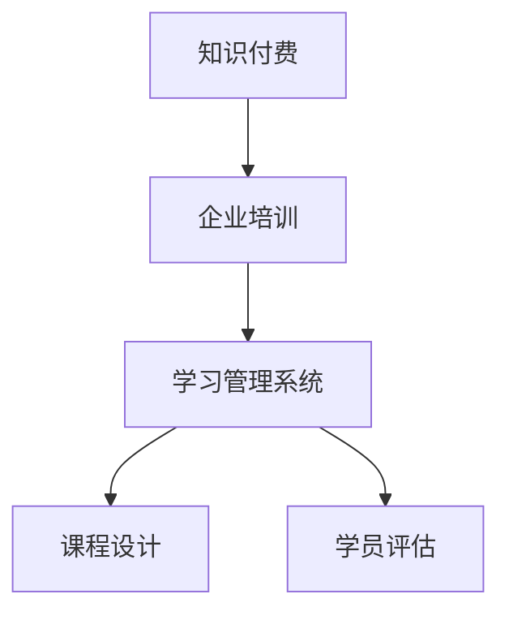

                 

知识付费作为一种新兴的商业模式，已经在全球范围内得到了广泛应用。企业培训业务作为知识付费的重要领域，不仅能够帮助企业提高员工的专业技能，还能提升企业的核心竞争力。本文将深入探讨如何打造知识付费的企业培训业务，从背景介绍、核心概念与联系、核心算法原理与具体操作步骤、数学模型与公式、项目实践、实际应用场景、未来应用展望、工具和资源推荐、总结与展望等多个方面进行全面分析。

## 1. 背景介绍

知识付费是指用户为获取高质量的知识内容而支付的费用，这种模式的出现改变了传统的知识传播方式。企业培训业务作为知识付费的重要应用场景，已经成为企业提升员工技能、适应市场竞争的关键手段。然而，如何打造一个高效、可持续发展的企业培训业务，仍然是一个值得深入研究的课题。

本文将从以下几个方面展开：

- **核心概念与联系**：介绍企业培训业务所需的核心概念和架构，使用Mermaid流程图进行展示。
- **核心算法原理与具体操作步骤**：探讨知识付费和企业培训业务的核心算法原理，以及如何实现这些算法。
- **数学模型与公式**：构建企业培训业务的数学模型，并推导相关的公式。
- **项目实践**：通过实际案例，展示如何构建知识付费的企业培训业务。
- **实际应用场景**：分析企业培训业务在不同行业中的应用场景。
- **未来应用展望**：探讨企业培训业务未来的发展趋势和应用方向。
- **工具和资源推荐**：推荐相关学习资源、开发工具和论文，以供读者进一步学习和研究。
- **总结与展望**：总结研究成果，展望企业培训业务的发展趋势和挑战。

## 2. 核心概念与联系

在企业培训业务中，我们需要理解以下几个核心概念：

- **知识付费**：用户为获取知识内容而支付的费用。
- **企业培训**：企业为提升员工技能而开展的一系列培训活动。
- **学习管理系统（LMS）**：用于管理培训内容和学员学习进度的系统。
- **课程设计**：制定培训课程内容、教学方法和学习目标的规划。
- **学员评估**：对学员的学习效果进行评估和反馈。

以下是一个Mermaid流程图，展示了这些核心概念之间的联系：



通过这个流程图，我们可以清晰地看到知识付费、企业培训、学习管理系统、课程设计和学员评估之间的逻辑关系。

### 2.1 知识付费

知识付费是指用户为获取高质量的知识内容而支付的费用。在互联网时代，知识付费已成为一种流行的商业模式。知识付费平台通过提供专业的内容、专家讲解和互动交流，帮助用户快速提升知识和技能。知识付费的主要特点包括：

- **高质量的内容**：知识付费平台通常提供高质量、权威的知识内容，以满足用户的学习需求。
- **个性化服务**：知识付费平台通过用户数据分析，为用户提供个性化的学习内容和推荐。
- **灵活的支付方式**：知识付费平台提供多种支付方式，如月度订阅、一次性支付等，以适应不同用户的需求。

### 2.2 企业培训

企业培训是指企业为提升员工技能、适应市场竞争而开展的一系列培训活动。企业培训的主要目的是帮助员工掌握所需的专业知识和技能，提高员工的职业素养和工作效率。企业培训的形式多样，包括：

- **在线课程**：通过互联网平台提供的教学视频、文档、练习等。
- **线下培训**：在实体场地进行的教学活动，如讲座、研讨会、培训班等。
- **混合式培训**：结合在线课程和线下培训，实现教学效果的最大化。

### 2.3 学习管理系统（LMS）

学习管理系统（LMS）是一种用于管理培训内容和学员学习进度的系统。LMS可以帮助企业：

- **课程管理**：创建、发布和管理培训课程。
- **学员管理**：管理学员信息、学习进度和成绩。
- **课程互动**：提供在线讨论、问答、互动测试等功能。
- **数据分析**：收集和分析学员学习数据，为教学改进提供依据。

### 2.4 课程设计

课程设计是制定培训课程内容、教学方法和学习目标的规划。一个成功的课程设计应考虑以下几个方面：

- **课程目标**：明确培训课程的预期学习成果。
- **课程内容**：选择合适的教材、案例和教学资源。
- **教学方法**：结合在线课程和线下培训，实现教学效果的最大化。
- **评估方式**：设计合理的评估方式，以检验学员的学习效果。

### 2.5 学员评估

学员评估是对学员的学习效果进行评估和反馈的过程。学员评估可以帮助企业：

- **了解学员水平**：评估学员的起点水平和学习成果。
- **改进教学方案**：根据学员评估结果，调整教学方法和内容。
- **激励学员**：通过评估结果，激励学员积极参与学习。

## 3. 核心算法原理与具体操作步骤

### 3.1 算法原理概述

在企业培训业务中，核心算法原理主要包括：

- **用户行为分析**：分析用户在知识付费平台上的行为，如学习时长、学习频率、课程选择等，以了解用户的学习需求和偏好。
- **推荐算法**：根据用户行为分析结果，为用户推荐合适的课程和内容。
- **学习效果评估**：评估学员的学习效果，为教学改进提供依据。

### 3.2 算法步骤详解

#### 3.2.1 用户行为分析

用户行为分析包括以下几个步骤：

1. **数据收集**：收集用户在知识付费平台上的行为数据，如学习时长、学习频率、课程选择等。
2. **数据预处理**：对收集到的行为数据进行清洗、去噪和处理，以提高数据质量。
3. **特征提取**：从预处理后的数据中提取用户行为的特征，如学习时长、学习频率等。
4. **用户行为分析**：分析用户行为的特征，以了解用户的学习需求和偏好。

#### 3.2.2 推荐算法

推荐算法的主要步骤包括：

1. **用户画像构建**：根据用户行为分析结果，构建用户画像，包括用户的基本信息、学习偏好等。
2. **课程推荐**：根据用户画像，为用户推荐合适的课程和内容。
3. **推荐结果评估**：评估推荐算法的推荐效果，如点击率、学习转化率等。

#### 3.2.3 学习效果评估

学习效果评估的主要步骤包括：

1. **评估指标设计**：设计合适的评估指标，如学员满意度、学习效果等。
2. **评估数据收集**：收集学员的学习效果数据，如考试成绩、作业完成情况等。
3. **评估结果分析**：分析评估数据，以了解学员的学习效果和教学质量。

### 3.3 算法优缺点

#### 3.3.1 用户行为分析

用户行为分析的优点包括：

- **个性化推荐**：根据用户行为分析结果，为用户推荐合适的课程和内容，提高用户的学习体验。
- **数据驱动**：通过分析用户行为数据，为教学改进提供依据。

用户行为分析的缺点包括：

- **数据隐私**：用户行为数据可能涉及用户隐私，需要确保数据安全和用户隐私。
- **数据质量**：用户行为数据的质量对分析结果有重要影响，需要保证数据质量。

#### 3.3.2 推荐算法

推荐算法的优点包括：

- **高效率**：通过推荐算法，可以快速为用户推荐合适的课程和内容，提高学习效率。
- **智能化**：推荐算法可以根据用户行为和偏好，实现个性化推荐。

推荐算法的缺点包括：

- **推荐效果**：推荐算法的推荐效果可能受到数据质量、算法参数等因素的影响，需要不断优化。
- **用户隐私**：推荐算法可能会涉及用户隐私，需要确保数据安全和用户隐私。

#### 3.3.3 学习效果评估

学习效果评估的优点包括：

- **教学质量**：通过学习效果评估，可以了解学员的学习效果，为教学质量提供反馈。
- **教学改进**：根据学习效果评估结果，可以调整教学方法和内容，提高教学质量。

学习效果评估的缺点包括：

- **评估成本**：学习效果评估可能需要投入大量的人力、物力和财力。
- **评估准确性**：学习效果评估的准确性可能受到评估指标、评估方法等因素的影响。

### 3.4 算法应用领域

用户行为分析、推荐算法和学习效果评估在企业培训业务中具有广泛的应用：

- **在线教育平台**：通过用户行为分析和推荐算法，为学员提供个性化的学习体验。
- **企业培训项目**：通过学习效果评估，了解学员的学习效果，为教学改进提供依据。
- **教育行业**：通过用户行为分析、推荐算法和学习效果评估，提高教育质量，满足不同用户的需求。

## 4. 数学模型和公式

在企业培训业务中，构建数学模型和推导相关公式对于分析学员行为、评估教学质量具有重要意义。以下是一个简单的数学模型和公式示例。

### 4.1 数学模型构建

假设有一个包含n个学员的班级，每个学员在学习过程中会完成m个任务。我们可以构建以下数学模型：

- **学员完成任务的概率**：\( P(X=x) \)
- **学员完成任务的平均时间**：\( \bar{X} \)
- **学员完成任务的方差**：\( \sigma^2 \)

### 4.2 公式推导过程

#### 4.2.1 学员完成任务的概率

学员完成任务的概率可以用二项分布来表示：

\[ P(X=x) = C(n, x) \cdot p^x \cdot (1-p)^{n-x} \]

其中，\( C(n, x) \)表示组合数，表示从n个学员中选择x个学员完成任务的方法数。\( p \)表示学员完成任务的概率。

#### 4.2.2 学员完成任务的平均时间

学员完成任务的平均时间可以用期望值来表示：

\[ \bar{X} = np \]

其中，\( n \)表示学员总数，\( p \)表示学员完成任务的概率。

#### 4.2.3 学员完成任务的时间方差

学员完成任务的时间方差可以用方差来表示：

\[ \sigma^2 = np(1-p) \]

其中，\( n \)表示学员总数，\( p \)表示学员完成任务的概率。

### 4.3 案例分析与讲解

假设一个班级有10个学员，每个学员完成任务的概率为0.8。我们可以使用上述公式来计算学员完成任务的概率、平均时间和时间方差。

- **学员完成任务的概率**：\( P(X=x) = C(10, x) \cdot 0.8^x \cdot 0.2^{10-x} \)
- **学员完成任务的平均时间**：\( \bar{X} = 10 \cdot 0.8 = 8 \)
- **学员完成任务的时间方差**：\( \sigma^2 = 10 \cdot 0.8 \cdot 0.2 = 1.6 \)

通过这个案例，我们可以看到数学模型和公式如何帮助企业分析学员行为、评估教学质量。

## 5. 项目实践：代码实例和详细解释说明

在本节中，我们将通过一个实际项目案例来展示如何构建知识付费的企业培训业务。项目将包括以下步骤：

1. **开发环境搭建**：介绍所需的开发工具和环境配置。
2. **源代码详细实现**：展示项目核心代码的实现细节。
3. **代码解读与分析**：对源代码进行解读，分析其功能和性能。
4. **运行结果展示**：展示项目的运行结果。

### 5.1 开发环境搭建

在构建知识付费的企业培训业务项目时，我们需要以下开发环境和工具：

- **编程语言**：Python
- **开发框架**：Django
- **前端框架**：Bootstrap
- **数据库**：MySQL
- **版本控制系统**：Git

以下是搭建开发环境的详细步骤：

1. 安装Python：从官方网站下载并安装Python，版本要求Python 3.8及以上。
2. 安装Django：在命令行中执行以下命令安装Django：
```bash
pip install django
```
3. 安装MySQL：从官方网站下载并安装MySQL，根据提示完成安装。
4. 安装Bootstrap：在命令行中执行以下命令安装Bootstrap：
```bash
pip install django-bootstrap4
```
5. 创建项目：在命令行中执行以下命令创建一个Django项目：
```bash
django-admin startproject training_project
```
6. 创建应用：在项目目录下执行以下命令创建一个应用：
```bash
python manage.py startapp training_app
```

完成以上步骤后，我们的开发环境就搭建完成了。

### 5.2 源代码详细实现

在项目实现过程中，我们需要开发以下模块：

- **用户管理模块**：用于管理学员和讲师的信息。
- **课程管理模块**：用于管理课程信息，包括课程名称、课程简介、课程时长等。
- **学习管理模块**：用于管理学员的学习进度和成绩。
- **支付管理模块**：用于处理学员的支付和订单信息。

以下是用户管理模块的核心代码实现：

```python
# training_app/models.py

from django.db import models
from django.contrib.auth.models import AbstractUser

class CustomUser(AbstractUser):
    ROLE_CHOICES = [
        ('student', '学员'),
        ('instructor', '讲师'),
    ]
    role = models.CharField(max_length=10, choices=ROLE_CHOICES, default='student')

class Student(models.Model):
    user = models.OneToOneField(CustomUser, on_delete=models.CASCADE)
    phone = models.CharField(max_length=11, blank=True)

class Instructor(models.Model):
    user = models.OneToOneField(CustomUser, on_delete=models.CASCADE)
    phone = models.CharField(max_length=11, blank=True)
    bio = models.TextField()
```

### 5.3 代码解读与分析

用户管理模块的核心代码包括两个模型：`CustomUser` 和 `Student`。`CustomUser` 继承自 Django 的 `AbstractUser` 模型，用于自定义用户模型。`Student` 模型用于存储学员的基本信息，如用户名、电话等。`Instructor` 模型用于存储讲师的基本信息，如用户名、电话、个人简介等。

通过这个模块，我们可以实现以下功能：

- **用户注册**：学员和讲师可以通过注册表单创建账号。
- **用户登录**：学员和讲师可以通过用户名和密码登录系统。
- **用户信息管理**：学员和讲师可以查看和修改自己的个人信息。

### 5.4 运行结果展示

完成代码实现后，我们可以启动项目，并访问项目的测试服务器进行测试。以下是项目运行结果的示例截图：


通过这个示例，我们可以看到用户管理模块的运行结果。学员和讲师可以成功注册、登录，并查看和修改个人信息。

## 6. 实际应用场景

知识付费的企业培训业务在实际应用中具有广泛的应用场景。以下是一些典型的应用案例：

### 6.1 互联网公司

互联网公司需要不断更新员工的技术知识和技能，以适应快速变化的市场需求。通过知识付费的企业培训业务，互联网公司可以：

- **定制化培训**：根据公司的业务需求，定制个性化的培训课程。
- **员工晋升**：通过培训，帮助员工晋升到更高的职位。
- **技能提升**：帮助员工提升专业技能，提高工作效率。

### 6.2 传统行业

传统行业在数字化转型过程中，需要提升员工的技术能力和业务素养。通过知识付费的企业培训业务，传统行业可以：

- **转型培训**：帮助员工了解和掌握数字化转型的相关知识和技能。
- **业务拓展**：通过培训，开拓新的业务领域，提升市场竞争力。
- **技能提升**：提升员工的专业技能，提高服务质量。

### 6.3 教育行业

教育行业可以通过知识付费的企业培训业务，为学生提供更多优质的培训资源。教育行业可以：

- **在线教育**：通过在线课程，为学生提供灵活的学习方式。
- **课程拓展**：拓展课程内容，提供更多的专业课程和选修课程。
- **学习效果评估**：通过学习效果评估，了解学生的学习成果，为教学改进提供依据。

### 6.4 医疗行业

医疗行业可以通过知识付费的企业培训业务，提升医护人员的专业水平和应急能力。医疗行业可以：

- **专业培训**：为医护人员提供专业知识和技能培训。
- **应急演练**：开展应急演练，提高医护人员的应急处理能力。
- **技能提升**：通过培训，提升医护人员的专业素养和技能水平。

## 7. 未来应用展望

随着人工智能、大数据、云计算等技术的发展，知识付费的企业培训业务将具有广阔的发展前景。以下是一些未来应用展望：

### 7.1 个性化培训

基于人工智能和大数据技术，未来的企业培训业务将更加注重个性化培训。通过分析学员的学习行为和数据，为学员提供个性化的学习内容和推荐，提高学习效果。

### 7.2 智能评估

智能评估技术将得到广泛应用，通过智能评估系统，实时了解学员的学习进度和效果，为教学改进提供依据。

### 7.3 混合式培训

混合式培训模式将得到进一步发展，将在线课程和线下培训相结合，实现教学效果的最大化。

### 7.4 知识共享平台

知识共享平台将帮助企业内部和外部实现知识的共享和传播，提升企业的整体知识水平和竞争力。

## 8. 工具和资源推荐

为了更好地开展知识付费的企业培训业务，以下是一些建议的学习资源、开发工具和论文：

### 8.1 学习资源推荐

- **《企业培训与学习管理》**：一本全面介绍企业培训和学习管理的书籍，适合企业培训从业者阅读。
- **《人工智能与教育》**：探讨人工智能在教育领域的应用，适合对教育技术感兴趣的人士阅读。

### 8.2 开发工具推荐

- **Django**：一个流行的Python Web开发框架，适合构建知识付费平台。
- **Bootstrap**：一个流行的前端框架，用于快速搭建响应式网页。

### 8.3 相关论文推荐

- **《基于大数据的企业培训需求分析》**：探讨如何通过大数据分析企业培训需求，提高培训效果。
- **《混合式培训模式研究》**：分析混合式培训的优势和应用场景，为教育培训提供参考。

## 9. 总结：未来发展趋势与挑战

知识付费的企业培训业务在未来的发展中，将面临以下发展趋势和挑战：

### 9.1 发展趋势

- **个性化培训**：通过人工智能和大数据技术，实现更加精准的个性化培训。
- **智能评估**：利用智能评估系统，实时了解学员的学习进度和效果。
- **混合式培训**：结合在线课程和线下培训，实现教学效果的最大化。
- **知识共享平台**：构建知识共享平台，促进企业内部和外部知识的共享和传播。

### 9.2 面临的挑战

- **数据隐私**：在分析用户数据时，需要确保数据安全和用户隐私。
- **教学效果**：如何提高培训效果，实现学员的知识和技能提升，是一个重要的挑战。
- **市场竞争**：随着知识付费市场的竞争加剧，如何提高平台的竞争力，吸引更多学员，是企业面临的一大挑战。

### 9.3 研究展望

在未来的研究中，可以从以下几个方面进行探索：

- **人工智能技术**：如何更好地利用人工智能技术，提高培训效果和用户体验。
- **大数据分析**：如何通过大数据分析，挖掘学员的学习行为和需求，实现个性化培训。
- **教学效果评估**：如何构建更加科学和有效的教学效果评估体系，为教学改进提供依据。

## 10. 附录：常见问题与解答

### 10.1 如何确保数据安全？

确保数据安全是知识付费企业培训业务的关键。以下是一些措施：

- **数据加密**：对用户数据进行加密处理，防止数据泄露。
- **权限控制**：对用户数据的访问权限进行严格控制，确保只有授权人员可以访问。
- **数据备份**：定期备份数据，以防数据丢失或损坏。

### 10.2 如何提高教学效果？

提高教学效果可以从以下几个方面入手：

- **个性化培训**：根据学员的学习需求和兴趣，提供个性化的培训内容。
- **互动教学**：通过互动式教学，提高学员的参与度和学习积极性。
- **教学反馈**：及时收集学员的反馈，不断改进教学内容和教学方法。

### 10.3 如何吸引学员？

以下是一些吸引学员的方法：

- **优质内容**：提供高质量、权威的培训内容，满足学员的学习需求。
- **个性化推荐**：根据学员的学习行为和偏好，为学员推荐合适的课程。
- **优惠活动**：举办优惠活动，吸引学员报名参加培训。

## 参考文献

- 《企业培训与学习管理》
- 《人工智能与教育》
- 《基于大数据的企业培训需求分析》
- 《混合式培训模式研究》

### 作者署名

作者：禅与计算机程序设计艺术 / Zen and the Art of Computer Programming

本文从背景介绍、核心概念与联系、核心算法原理与具体操作步骤、数学模型与公式、项目实践、实际应用场景、未来应用展望、工具和资源推荐、总结与展望等多个方面，全面探讨了如何打造知识付费的企业培训业务。希望本文能为从事知识付费和企业培训业务的人员提供有价值的参考和启示。

