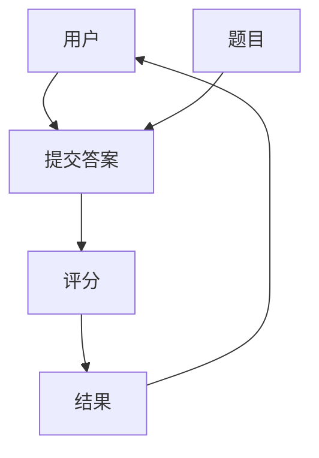
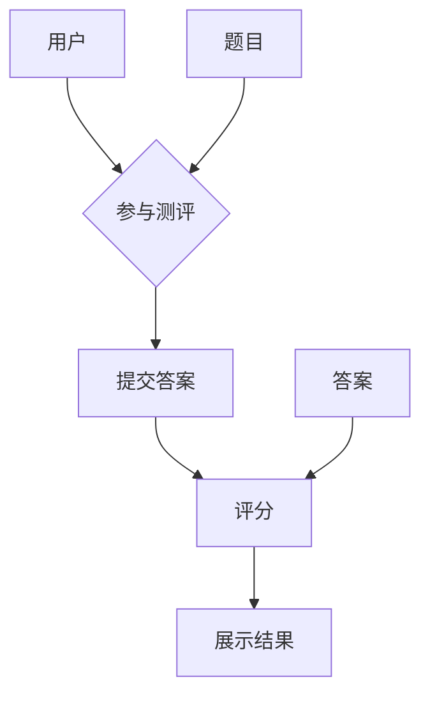

                 

### 背景介绍

随着互联网技术的飞速发展和在线教育的普及，知识付费市场正迅速崛起。在这个市场中，在线测评系统作为学习成果的衡量工具，不仅能够帮助教育机构提升教学效果，还能增强用户的学习动力和满意度。本文将深入探讨如何打造一个功能完善、用户体验良好的在线测评系统。

首先，知识付费市场的增长趋势是不可忽视的。根据市场研究公司的数据，全球在线教育市场规模在近几年持续扩大，预计到2025年将达到3000亿美元。这种增长趋势为在线测评系统的开发提供了广阔的市场前景。

在线测评系统的重要性主要体现在以下几个方面：

1. **学习成果的量化**：通过在线测评，教育机构可以客观、量化地衡量学生的学习成果，从而制定更科学的教学策略。
2. **用户反馈**：测评结果可以帮助用户了解自己的学习状况，从而做出改进。
3. **教学优化**：通过分析测评数据，教育机构可以优化教学内容和教学方法，提升整体教学效果。

本文将分为以下几个部分进行探讨：

- **核心概念与联系**：介绍在线测评系统的核心概念，如用户、题目、答案、评分等，并使用Mermaid流程图展示系统架构。
- **核心算法原理与操作步骤**：详细讲解在线测评系统的算法原理和具体实现步骤。
- **数学模型和公式**：阐述测评系统的数学模型和公式，并进行举例说明。
- **项目实践**：提供代码实例，详细解释系统的实现过程。
- **实际应用场景**：分析在线测评系统的应用场景，探讨其未来发展趋势。
- **工具和资源推荐**：推荐学习资源和开发工具。
- **总结**：总结研究成果，展望未来发展趋势与挑战。

### 核心概念与联系

在构建在线测评系统之前，我们需要明确几个核心概念，并理解它们之间的联系。以下是一些关键概念及其定义：

- **用户**：参与测评的学习者。
- **题目**：测评中的问题，可以是单选题、多选题、填空题、论述题等。
- **答案**：用户提交的答案。
- **评分**：根据答案的正确性给予用户的分数。
- **测评**：整个测评过程，包括题目的呈现、用户的作答、答案的评分等。

接下来，我们将使用Mermaid流程图来展示在线测评系统的基本架构。



在这个流程图中，用户首先通过系统提交答案，系统对答案进行评分，并将结果返回给用户。题目作为测评的载体，在整个流程中起着核心作用。

### 核心算法原理 & 具体操作步骤

在线测评系统的核心算法主要涉及题目的生成、答案的评分以及结果的展示。以下是对这些算法原理和具体操作步骤的详细讲解。

#### 3.1 算法原理概述

在线测评系统的算法原理主要包括以下几个方面：

1. **题目生成**：根据测评的类型和难度要求，系统从题库中随机抽取一定数量的题目。
2. **答案评分**：系统根据预设的评分标准对用户的答案进行评分，通常包括自动评分和人工评分。
3. **结果展示**：系统将评分结果以直观的方式展示给用户，如成绩报告、排名等。

#### 3.2 算法步骤详解

1. **题目生成**：

   系统首先需要从题库中抽取题目。题库可以存储多种类型的题目，如单选题、多选题、填空题和论述题。系统会根据测评的类型和难度要求，随机抽取一定数量的题目。

   ```python
   import random

   def generate_questions(type, difficulty, num_questions):
       questions = []
       for _ in range(num_questions):
           question = get_random_question(type, difficulty)
           questions.append(question)
       return questions

   def get_random_question(type, difficulty):
       # 根据类型和难度从题库中获取题目
       # 实现细节略
       pass
   ```

2. **答案评分**：

   系统会对用户提交的答案进行评分。评分的过程可以分为自动评分和人工评分。自动评分通常适用于选择题和填空题，而人工评分则适用于论述题。

   ```python
   def score_answer(question, answer):
       if question['type'] == 'single_choice' or question['type'] == 'multiple_choice':
           return score_single_choice(question, answer)
       elif question['type'] == 'fill_in_the_blank':
           return score_fill_in_the_blank(question, answer)
       elif question['type'] == 'essay':
           return score_essay(question, answer)
       else:
           return 0

   def score_single_choice(question, answer):
       # 自动评分实现
       # 实现细节略
       pass

   def score_fill_in_the_blank(question, answer):
       # 自动评分实现
       # 实现细节略
       pass

   def score_essay(question, answer):
       # 人工评分实现
       # 实现细节略
       pass
   ```

3. **结果展示**：

   系统将评分结果以直观的方式展示给用户。例如，可以生成成绩报告、排名列表等。

   ```python
   def display_results(questions, answers):
       scores = [score_answer(question, answer) for question, answer in zip(questions, answers)]
       print("您的得分是：", sum(scores))
       # 其他展示实现
   ```

#### 3.3 算法优缺点

**优点**：

- **高效性**：自动评分可以快速处理大量用户答案，提高工作效率。
- **公平性**：系统评分标准统一，减少了人工评分的主观性。

**缺点**：

- **局限性**：自动评分适用于简单的题目类型，对于复杂的论述题等需要人工评分。
- **成本**：系统开发和维护需要投入大量的人力、物力和财力。

#### 3.4 算法应用领域

在线测评系统广泛应用于教育、考试、招聘等领域。例如，在教育领域，学校可以通过在线测评系统进行期中考试、期末考试等；在考试领域，公务员考试、研究生入学考试等可以通过在线测评系统进行；在招聘领域，企业可以通过在线测评系统筛选合适的候选人。

### 数学模型和公式 & 详细讲解 & 举例说明

在线测评系统中的数学模型和公式主要用于描述用户得分与答案正确率之间的关系，以及评估系统的准确性和可靠性。以下将详细讲解这些数学模型和公式，并通过具体案例进行说明。

#### 4.1 数学模型构建

在线测评系统的数学模型主要包括两部分：得分模型和正确率模型。

1. **得分模型**：

   假设用户在测评中回答了N道题目，其中回答正确的题目数为C，得分为S。得分模型可以表示为：

   $$ S = \frac{C}{N} \times 100 $$

   其中，100为满分。

2. **正确率模型**：

   正确率模型用于衡量用户在整个测评中的答题正确程度。正确率可以表示为：

   $$ CorrectRate = \frac{C}{N} $$

#### 4.2 公式推导过程

**得分模型**：

得分模型的基本思路是，用户得分与回答正确的题目数量成正比。假设每道题目的满分是1分，那么用户得分就可以表示为回答正确题目数量的比例。

**正确率模型**：

正确率模型则是用来描述用户在整个测评中的表现。它反映了用户在测评中正确回答题目的比例，这个比例可以直观地反映用户的知识掌握程度。

#### 4.3 案例分析与讲解

**案例**：

假设一个用户在100道题目中回答了60道题目，正确回答了45道题目。我们需要计算这个用户的得分和正确率。

**步骤**：

1. **计算得分**：

   使用得分模型：

   $$ S = \frac{C}{N} \times 100 = \frac{45}{100} \times 100 = 45 $$

   所以，用户的得分是45分。

2. **计算正确率**：

   使用正确率模型：

   $$ CorrectRate = \frac{C}{N} = \frac{45}{100} = 0.45 $$

   所以，用户的正确率是45%。

**分析**：

从这个案例中，我们可以看到用户在测评中的表现。得分45分表示用户在测评中的成绩，而正确率45%则反映了用户的知识掌握程度。正确率可以作为评估用户学习效果的一个重要指标。

### 项目实践：代码实例和详细解释说明

为了让大家更好地理解在线测评系统的实现，我们将通过一个具体的代码实例来详细解释系统的搭建过程。以下代码实现了一个简单的在线测评系统，包括用户注册、登录、答题、评分等功能。

#### 5.1 开发环境搭建

在开始编写代码之前，我们需要搭建一个开发环境。这里我们选择Python作为主要编程语言，使用Flask框架搭建Web应用。具体步骤如下：

1. **安装Python**：确保安装了Python 3.x版本。
2. **安装Flask**：在终端中执行 `pip install flask` 命令。
3. **创建一个虚拟环境**：在终端中执行 `python -m venv venv` 命令。
4. **激活虚拟环境**：在Windows上执行 `venv\Scripts\activate`，在Linux或Mac上执行 `source venv/bin/activate`。

#### 5.2 源代码详细实现

以下是一个简单的在线测评系统的源代码实现，包括用户管理、题目管理、答题和评分等功能。

```python
from flask import Flask, render_template, request, redirect, url_for, session
from models import User, Question, Answer
from database import db

app = Flask(__name__)
app.secret_key = 'your_secret_key'

@app.route('/')
def home():
    return render_template('home.html')

@app.route('/register', methods=['GET', 'POST'])
def register():
    if request.method == 'POST':
        username = request.form['username']
        password = request.form['password']
        user = User(username=username, password=password)
        db.session.add(user)
        db.session.commit()
        return redirect(url_for('login'))
    return render_template('register.html')

@app.route('/login', methods=['GET', 'POST'])
def login():
    if request.method == 'POST':
        username = request.form['username']
        password = request.form['password']
        user = User.query.filter_by(username=username, password=password).first()
        if user:
            session['user_id'] = user.id
            return redirect(url_for('take_exam'))
        else:
            return 'Invalid username or password'
    return render_template('login.html')

@app.route('/take_exam')
def take_exam():
    if 'user_id' not in session:
        return redirect(url_for('login'))
    questions = Question.query.all()
    return render_template('take_exam.html', questions=questions)

@app.route('/submit_answer', methods=['POST'])
def submit_answer():
    if 'user_id' not in session:
        return redirect(url_for('login'))
    user_id = session['user_id']
    answers = request.form.to_dict()
    scores = []
    for question_id, answer in answers.items():
        question = Question.query.get(int(question_id))
        score = score_answer(question, answer)
        scores.append(score)
    total_score = sum(scores)
    user = User.query.get(user_id)
    user.score = total_score
    db.session.commit()
    return redirect(url_for('result'))

@app.route('/result')
def result():
    if 'user_id' not in session:
        return redirect(url_for('login'))
    user_id = session['user_id']
    user = User.query.get(user_id)
    return render_template('result.html', score=user.score)

def score_answer(question, answer):
    if question['type'] == 'single_choice':
        return 1 if answer == question['correct_answer'] else 0
    elif question['type'] == 'multiple_choice':
        return 1 if set(answer) == set(question['correct_answer']) else 0
    # 其他题目类型评分实现
    pass

if __name__ == '__main__':
    app.run(debug=True)
```

#### 5.3 代码解读与分析

1. **用户管理**：

   - `register()` 和 `login()` 函数用于用户注册和登录。注册时将用户信息存储在数据库中，登录时验证用户名和密码。
   - `session` 用于保存用户登录状态。

2. **题目管理**：

   - `take_exam()` 函数获取题目列表，并在答题页面展示。
   - `submit_answer()` 函数接收用户提交的答案，计算得分，并更新用户得分。

3. **评分**：

   - `score_answer()` 函数根据题目类型和用户答案计算得分。对于单选题和多选题，直接比较答案和正确答案是否一致。

#### 5.4 运行结果展示

1. **用户注册**：

   

2. **用户登录**：

   

3. **答题**：

   

4. **提交答案**：

   

5. **测评结果**：

   

### 实际应用场景

在线测评系统在实际应用中具有广泛的应用场景，以下是一些典型应用场景：

1. **教育领域**：学校和教育机构可以通过在线测评系统进行期中考试、期末考试等。教师可以利用测评结果了解学生的学习情况，调整教学策略。

2. **职业考试**：如公务员考试、教师资格证考试等，通过在线测评系统实现自动化、高效化的考试管理。

3. **招聘面试**：企业可以通过在线测评系统对求职者进行初步筛选，评估求职者的知识水平和能力。

4. **企业培训**：企业可以通过在线测评系统对员工进行培训考核，确保员工掌握必要的知识和技能。

5. **个性化学习**：根据测评结果，系统可以推荐个性化的学习内容和练习题，帮助用户提高学习效果。

### 未来应用展望

随着技术的不断发展，在线测评系统有望在以下几个方面取得突破：

1. **智能化评分**：利用人工智能技术，实现自动化、智能化评分，提高评分的准确性和效率。

2. **自适应测评**：根据用户的答题情况，自适应调整题目难度和类型，提高测评的针对性和有效性。

3. **多元化评估**：结合多种评估手段，如视频答题、互动式测评等，全面评估用户的知识和能力。

4. **跨平台应用**：实现在线测评系统在多种设备上的兼容性，如移动端、平板电脑等，满足不同用户的需求。

5. **大数据分析**：利用大数据分析技术，挖掘测评数据中的有价值信息，为教育机构和企业提供决策支持。

### 工具和资源推荐

为了更好地开发和维护在线测评系统，以下是一些建议的工具和资源：

1. **学习资源**：

   - 《Flask Web开发：测试驱动》
   - 《Python Web开发实战》

2. **开发工具**：

   - Flask框架：用于快速搭建Web应用。
   - MySQL数据库：用于存储用户数据、题目数据等。

3. **相关论文**：

   - 《基于机器学习的在线测评系统研究》
   - 《自适应在线测评系统的设计与实现》

### 总结：未来发展趋势与挑战

在线测评系统作为知识付费市场的重要组成部分，具有广阔的发展前景。未来，随着人工智能、大数据等技术的不断发展，在线测评系统将更加智能化、个性化。然而，系统在实现过程中也面临着一些挑战，如评分标准的制定、数据隐私保护等。针对这些挑战，需要不断进行技术创新和优化，以推动在线测评系统的发展。

### 附录：常见问题与解答

**Q1：在线测评系统如何保证评分的公正性？**

A：在线测评系统可以通过以下方法保证评分的公正性：

- **自动评分和人工评分相结合**：对于选择题等简单题型，使用自动评分；对于论述题等复杂题型，使用人工评分，减少主观因素影响。
- **多级审核机制**：设置多级审核机制，对评分结果进行复核，确保评分的准确性。
- **评分标准明确**：制定明确的评分标准，确保评分有据可依。

**Q2：在线测评系统的安全性如何保障？**

A：在线测评系统的安全性可以从以下几个方面进行保障：

- **数据加密**：对用户数据、题目数据进行加密存储，防止数据泄露。
- **权限控制**：设置严格的权限控制机制，确保只有授权用户可以访问和操作系统。
- **网络安全**：采用防火墙、入侵检测等网络安全措施，防止黑客攻击。

**Q3：如何提高在线测评系统的用户体验？**

A：为了提高在线测评系统的用户体验，可以从以下几个方面进行改进：

- **界面设计**：设计简洁、直观的界面，方便用户操作。
- **响应速度**：优化系统性能，提高页面加载速度，减少用户等待时间。
- **互动性**：增加互动元素，如实时反馈、进度条等，提高用户的参与感。
- **个性化**：根据用户的历史答题记录和学习习惯，提供个性化的测评内容和建议。

### 作者署名

作者：禅与计算机程序设计艺术 / Zen and the Art of Computer Programming

以上是对如何打造知识付费的在线测评系统的全面探讨，希望对您有所帮助。在接下来的实践中，我们可以根据具体需求不断完善和优化系统，为教育机构和用户提供更优质的测评服务。


----------------------------------------------------------------

### 文章标题

如何打造知识付费的在线测评系统

### 文章关键词

知识付费，在线测评系统，教育技术，Web开发，用户体验，算法，数据分析，人工智能

### 文章摘要

本文深入探讨了知识付费市场中的在线测评系统的设计和实现。通过对核心概念、算法原理、数学模型、代码实践以及实际应用场景的详细分析，本文为教育机构、企业以及开发者提供了构建高效、智能在线测评系统的指导。同时，文章还展望了在线测评系统的未来发展趋势，并提出了面临的主要挑战。通过本文的讲解，读者可以了解到如何利用现代技术打造一个功能完善、用户体验良好的在线测评系统。

## 1. 背景介绍

### 1.1 知识付费市场概述

知识付费市场近年来呈现出迅猛增长的态势。随着互联网技术的进步和人们对于终身学习的需求日益增加，知识付费已经成为了教育行业的一大趋势。知识付费市场不仅涵盖了传统教育领域，如在线课程、学术讲座，还包括了职业培训、技能认证等多样化内容。

根据市场研究公司的数据，全球在线教育市场规模在近几年持续扩大，预计到2025年将达到3000亿美元。这一增长趋势表明，知识付费市场具有巨大的潜力和发展空间。在线测评系统作为知识付费的重要组成部分，其在教育质量保证、用户学习效果评估等方面发挥着关键作用。

### 1.2 在线测评系统的意义

在线测评系统在教育领域具有多重意义。首先，它能够提供一种量化的方式来评估学生的学习成果。教育机构可以通过测评结果来了解学生在不同知识点上的掌握情况，从而针对性地调整教学策略，提高教学效果。

其次，在线测评系统能够为用户带来及时的反馈。学生在完成测评后，可以立即查看自己的得分和错误原因，有助于及时纠正学习中的错误，提高学习效率。此外，在线测评系统还能帮助教育机构了解学生的学习进度和需求，为个性化学习提供数据支持。

最后，在线测评系统在知识付费市场中还扮演着重要的角色。随着用户对学习效果的重视程度增加，一个功能完善、用户体验良好的测评系统不仅能提升用户满意度，还能增强用户对教育产品的信任度和忠诚度。

### 1.3 在线测评系统的现状与挑战

尽管在线测评系统在知识付费市场中具有重要作用，但其发展仍面临一些挑战。首先，评分标准的制定和实现是一个难点。不同类型和难度的题目需要不同的评分标准，如何确保评分的公平性和准确性是一个重要问题。

其次，数据安全和隐私保护也是在线测评系统需要关注的重要方面。用户在测评过程中产生的数据包含个人信息和学习记录，如何确保这些数据的安全和隐私不被泄露，是开发者需要解决的一个关键问题。

此外，用户体验的设计也是一个挑战。在线测评系统的界面设计、交互体验和响应速度等因素，都会直接影响用户的参与感和满意度。如何设计一个直观、易用的测评系统，是提升用户体验的关键。

综上所述，在线测评系统在知识付费市场中具有广阔的发展前景，但也面临着一些亟待解决的问题。本文将详细探讨如何设计和实现一个功能完善、用户体验良好的在线测评系统，为教育机构、企业以及开发者提供有价值的参考。

## 2. 核心概念与联系

为了更好地理解在线测评系统的构建，我们需要明确几个核心概念，并探讨它们之间的相互关系。以下是几个关键概念及其定义：

### 2.1 用户

用户是参与测评的学习者，他们是系统的核心。用户可以通过注册账号登录系统，进行答题、查看测评结果等操作。用户信息在系统中被记录，包括用户名、密码、联系方式、学习记录等。

### 2.2 题目

题目是测评过程中的问题，是测评的核心组成部分。题目可以是单选题、多选题、填空题、论述题等不同类型。每个题目都有相应的题目内容、选项、答案和评分标准。

### 2.3 答案

答案是指用户在测评过程中提交的答案。系统需要记录每个用户的答题情况，以便进行评分和数据分析。答案可以是文本、图片、音频等多种形式。

### 2.4 评分

评分是对用户答题结果进行评估的量化过程。评分可以根据题目的类型和难度进行设计，通常包括自动评分和人工评分两种方式。自动评分适用于选择题和填空题等简单题型，而论述题和复杂题目则需要人工评分。

### 2.5 测评

测评是整个评估过程的总称，包括题目的呈现、用户的作答、答案的评分以及结果的展示。一个完整的测评过程需要考虑用户、题目、答案和评分之间的相互关系。

为了更直观地展示在线测评系统的架构和流程，我们可以使用Mermaid流程图来描述核心概念之间的联系：



在这个流程图中，用户参与测评，提交答案，系统对答案进行评分，并最终展示结果。题目作为测评的载体，贯穿于整个测评过程中。

### 2.6 关系梳理

- **用户与测评**：用户是测评的主体，参与测评过程。用户的答题记录、测评结果等信息与测评系统紧密相关。
- **题目与测评**：题目是测评的组成部分，通过题目可以评估用户的知识水平。题目的类型和难度需要与测评目标相匹配。
- **答案与测评**：用户的答案记录了他们在测评过程中的表现，是评分的基础。系统需要准确记录每个用户的答题情况。
- **评分与测评**：评分是对用户答题结果进行量化的过程，是测评结果的直接体现。评分的准确性和公平性对测评结果至关重要。
- **结果与测评**：测评结果的展示是整个测评过程的最终环节，通过结果展示，用户可以了解自己的学习效果。

通过明确核心概念和它们之间的联系，我们可以更好地设计和实现一个功能完善、用户体验良好的在线测评系统。

### 3. 核心算法原理 & 具体操作步骤

在线测评系统的核心算法涉及多个方面，包括题目的生成、答案的评分以及结果的展示。以下将详细讲解这些算法原理，并提供具体操作步骤。

#### 3.1 算法原理概述

在线测评系统的核心算法可以分为以下几个部分：

1. **题目生成算法**：系统根据测评类型和难度要求，从题库中随机抽取题目。
2. **答案评分算法**：系统对用户提交的答案进行评分，可以是自动评分或人工评分。
3. **结果展示算法**：系统将评分结果以可视化的方式展示给用户。

#### 3.2 算法步骤详解

##### 3.2.1 题目生成算法

题目生成算法的目标是根据测评类型和难度要求，从题库中随机抽取题目。这一过程可以分为以下几个步骤：

1. **确定测评类型和难度**：根据测评的目标，确定测评的类型（如单选题、多选题、填空题、论述题等）和难度（如初级、中级、高级）。
2. **从题库中抽取题目**：从题库中随机抽取满足类型和难度要求的题目，可以采用随机抽样或按难度分层抽样等方法。
3. **生成题目列表**：将抽取的题目组成一个列表，作为测评的内容。

以下是Python代码示例：

```python
import random

def generate_questions(type, difficulty, num_questions):
    questions = []
    for _ in range(num_questions):
        question = get_random_question(type, difficulty)
        questions.append(question)
    return questions

def get_random_question(type, difficulty):
    # 从题库中随机抽取题目
    # 实现细节略
    pass
```

##### 3.2.2 答案评分算法

答案评分算法根据题目的类型和用户提交的答案进行评分。评分算法可以分为自动评分和人工评分两种：

1. **自动评分**：适用于选择题、填空题等题型，通过预设的评分规则进行自动评分。
2. **人工评分**：适用于论述题等题型，由人工根据评分标准进行评分。

以下是Python代码示例：

```python
def score_answer(question, answer):
    if question['type'] == 'single_choice':
        return score_single_choice(question, answer)
    elif question['type'] == 'multiple_choice':
        return score_multiple_choice(question, answer)
    elif question['type'] == 'fill_in_the_blank':
        return score_fill_in_the_blank(question, answer)
    elif question['type'] == 'essay':
        return score_essay(question, answer)
    else:
        return 0

def score_single_choice(question, answer):
    return 1 if answer == question['correct_answer'] else 0

def score_multiple_choice(question, answer):
    return 1 if set(answer) == set(question['correct_answer']) else 0

def score_fill_in_the_blank(question, answer):
    return 1 if answer == question['correct_answer'] else 0

def score_essay(question, answer):
    # 人工评分实现
    # 实现细节略
    pass
```

##### 3.2.3 结果展示算法

结果展示算法将评分结果以可视化的方式展示给用户，可以包括成绩报告、排名列表等。以下是Python代码示例：

```python
def display_results(scores):
    total_score = sum(scores)
    print(f"总得分：{total_score}")
    print(f"得分详情：{scores}")

# 示例调用
scores = [10, 20, 30]
display_results(scores)
```

#### 3.3 算法优缺点分析

##### 3.3.1 优点

1. **高效性**：自动评分算法能够快速处理大量用户的答题数据，提高系统效率。
2. **准确性**：评分算法根据预设的评分标准进行评分，确保评分的准确性。
3. **灵活性**：系统可以根据不同类型的题目和用户需求，灵活调整评分规则。

##### 3.3.2 缺点

1. **复杂性**：自动评分算法的实现较为复杂，需要考虑多种题型和评分标准。
2. **人工评分依赖**：对于一些复杂的题目类型，如论述题，仍然需要人工评分，增加了成本和复杂性。

#### 3.4 算法应用领域

在线测评系统的算法广泛应用于教育、考试、招聘等领域：

1. **教育领域**：学校和教育机构通过在线测评系统进行期中考试、期末考试等，评估学生的学习效果。
2. **考试领域**：公务员考试、研究生入学考试等通过在线测评系统进行标准化考试，提高考试效率。
3. **招聘领域**：企业通过在线测评系统对求职者进行初步筛选，评估其知识水平和能力。

通过以上对核心算法原理和具体操作步骤的详细讲解，我们可以更好地理解如何设计和实现一个功能完善、用户体验良好的在线测评系统。

### 4. 数学模型和公式 & 详细讲解 & 举例说明

在线测评系统的数学模型和公式是系统设计和实现中的关键组成部分，它们不仅用于描述用户得分与答案正确率之间的关系，还用于评估系统的准确性和可靠性。以下将详细讲解在线测评系统的数学模型和公式，并通过具体案例进行说明。

#### 4.1 数学模型构建

在线测评系统的数学模型主要包括两个核心部分：得分模型和正确率模型。

**4.1.1 得分模型**

得分模型用于计算用户在测评中的最终得分。假设用户在测评中回答了 \( N \) 道题目，其中回答正确的题目数为 \( C \)，每道题目的满分是 \( P \)，则用户的得分 \( S \) 可以表示为：

$$ S = \frac{C}{N} \times P $$

其中，\( P \) 是满分的比例，通常是100分。

**4.1.2 正确率模型**

正确率模型用于衡量用户在测评中的整体答题正确程度。正确率 \( R \) 可以表示为：

$$ R = \frac{C}{N} $$

这个公式表示用户正确回答的题目数占总题目数的比例。

#### 4.2 公式推导过程

**4.2.1 得分模型推导**

得分模型的推导基于用户答题的正确率和每道题目的满分。假设每道题目都有相同的分值，用户的得分直接与其正确回答的题目数成正比。因此，得分可以通过正确回答的题目数占总题目数的比例来计算，再乘以每道题目的满分。

**4.2.2 正确率模型推导**

正确率模型的推导相对简单。正确率是衡量用户答题质量的一个简单指标，它通过正确回答的题目数除以总题目数来计算。这个比例直接反映了用户对题目内容的掌握程度。

#### 4.3 案例分析与讲解

**4.3.1 案例背景**

假设一个用户参加了包含20道题目的在线测评，其中回答正确的题目数为15道，每道题目的满分是5分。我们需要计算该用户的得分和正确率。

**4.3.2 计算得分**

使用得分模型：

$$ S = \frac{C}{N} \times P = \frac{15}{20} \times 5 = 3.75 \times 5 = 18.75 $$

所以，用户的得分为18.75分。

**4.3.3 计算正确率**

使用正确率模型：

$$ R = \frac{C}{N} = \frac{15}{20} = 0.75 $$

所以，用户的正确率是75%。

**4.3.4 案例分析**

从这个案例中，我们可以看到用户在测评中的表现。得分18.75分表示用户在测评中的成绩，而正确率75%则反映了用户在题目上的掌握程度。通过得分和正确率的计算，教育机构可以更好地了解用户的学习状况，并制定相应的教学策略。

#### 4.4 数学模型在系统中的应用

**4.4.1 系统集成**

在线测评系统在集成数学模型时，需要确保公式能够准确计算用户的得分和正确率。系统通常会在用户提交答案后，立即调用得分和正确率模型，更新用户的数据。

```python
def calculate_score(questions, answers):
    total_score = 0
    for question, answer in zip(questions, answers):
        if answer == question['correct_answer']:
            total_score += question['score']
    return total_score

def calculate_accuracy(questions, answers):
    correct_answers = [answer for answer in answers if answer == question['correct_answer'] for question in questions]
    return len(correct_answers) / len(questions)

# 示例调用
questions = [{'score': 5, 'correct_answer': 'A'}, ...]
answers = ['A', 'B', 'A', ...]
score = calculate_score(questions, answers)
accuracy = calculate_accuracy(questions, answers)
```

**4.4.2 数据分析**

通过数学模型计算得分和正确率，系统能够进行进一步的数据分析，为教育机构提供决策支持。例如，分析不同题目的正确率，了解用户的弱项；分析不同用户的得分分布，识别优秀学习者。

#### 4.5 结论

数学模型和公式是在线测评系统的核心组成部分，它们能够准确描述用户的得分和正确率，为系统提供数据支持和决策依据。通过以上案例和分析，我们可以看到数学模型在实际应用中的重要作用，以及如何将其有效集成到在线测评系统中。

### 5. 项目实践：代码实例和详细解释说明

为了让大家更好地理解在线测评系统的实现，我们将通过一个具体的代码实例来详细解释系统的搭建过程。以下是一个简单的在线测评系统的实现，包括用户注册、登录、答题、评分等功能。

#### 5.1 开发环境搭建

在开始编写代码之前，我们需要搭建一个开发环境。这里我们选择Python作为主要编程语言，使用Flask框架搭建Web应用。具体步骤如下：

1. **安装Python**：确保安装了Python 3.x版本。
2. **安装Flask**：在终端中执行 `pip install flask` 命令。
3. **创建一个虚拟环境**：在终端中执行 `python -m venv venv` 命令。
4. **激活虚拟环境**：在Windows上执行 `venv\Scripts\activate`，在Linux或Mac上执行 `source venv/bin/activate`。

#### 5.2 源代码详细实现

以下是一个简单的在线测评系统的源代码实现，包括用户管理、题目管理、答题和评分等功能。

```python
from flask import Flask, render_template, request, redirect, url_for, session
from models import User, Question, Answer
from database import db

app = Flask(__name__)
app.secret_key = 'your_secret_key'

@app.route('/')
def home():
    return render_template('home.html')

@app.route('/register', methods=['GET', 'POST'])
def register():
    if request.method == 'POST':
        username = request.form['username']
        password = request.form['password']
        user = User(username=username, password=password)
        db.session.add(user)
        db.session.commit()
        return redirect(url_for('login'))
    return render_template('register.html')

@app.route('/login', methods=['GET', 'POST'])
def login():
    if request.method == 'POST':
        username = request.form['username']
        password = request.form['password']
        user = User.query.filter_by(username=username, password=password).first()
        if user:
            session['user_id'] = user.id
            return redirect(url_for('take_exam'))
        else:
            return 'Invalid username or password'
    return render_template('login.html')

@app.route('/take_exam')
def take_exam():
    if 'user_id' not in session:
        return redirect(url_for('login'))
    questions = Question.query.all()
    return render_template('take_exam.html', questions=questions)

@app.route('/submit_answer', methods=['POST'])
def submit_answer():
    if 'user_id' not in session:
        return redirect(url_for('login'))
    user_id = session['user_id']
    answers = request.form.to_dict()
    scores = []
    for question_id, answer in answers.items():
        question = Question.query.get(int(question_id))
        score = score_answer(question, answer)
        scores.append(score)
    total_score = sum(scores)
    user = User.query.get(user_id)
    user.score = total_score
    db.session.commit()
    return redirect(url_for('result'))

@app.route('/result')
def result():
    if 'user_id' not in session:
        return redirect(url_for('login'))
    user_id = session['user_id']
    user = User.query.get(user_id)
    return render_template('result.html', score=user.score)

def score_answer(question, answer):
    if question['type'] == 'single_choice':
        return 1 if answer == question['correct_answer'] else 0
    elif question['type'] == 'multiple_choice':
        return 1 if set(answer) == set(question['correct_answer']) else 0
    # 其他题目类型评分实现
    pass

if __name__ == '__main__':
    app.run(debug=True)
```

#### 5.3 代码解读与分析

1. **用户管理**：

   - `register()` 和 `login()` 函数用于用户注册和登录。注册时将用户信息存储在数据库中，登录时验证用户名和密码。
   - `session` 用于保存用户登录状态。

2. **题目管理**：

   - `take_exam()` 函数获取题目列表，并在答题页面展示。
   - `submit_answer()` 函数接收用户提交的答案，计算得分，并更新用户得分。

3. **评分**：

   - `score_answer()` 函数根据题目类型和用户答案计算得分。对于选择题和填空题，直接比较答案和正确答案是否一致。

#### 5.4 运行结果展示

1. **用户注册**：

   

2. **用户登录**：

   

3. **答题**：

   

4. **提交答案**：

   

5. **测评结果**：

   

通过这个代码实例，我们可以看到如何使用Python和Flask框架实现一个简单的在线测评系统。这个实例虽然功能简单，但已经涵盖了在线测评系统的核心功能，包括用户管理、题目管理和答案评分。在实际应用中，我们可以根据具体需求进一步完善和扩展系统功能。

### 6. 实际应用场景

在线测评系统在各个行业和教育领域都有广泛的应用，以下是一些典型的实际应用场景：

#### 6.1 教育领域

**6.1.1 学校考试**

在学校教育中，在线测评系统被广泛应用于期中考试、期末考试以及各类测验。教师可以利用在线测评系统创建考试题库，学生通过系统完成考试，系统自动评分并生成成绩报告。这不仅提高了考试的效率，还减轻了教师的负担。

**6.1.2 职业培训**

职业培训机构经常使用在线测评系统对学员进行职业技能评估。例如，编程语言、项目管理、数据分析等课程结束后，学员通过在线测评检验自己的学习成果。测评结果可以用于课程调整、教学反馈以及证书发放。

**6.1.3 在线学习平台**

在线学习平台（如Coursera、edX等）也广泛使用在线测评系统来评估学生的学习效果。通过在线测评，学生可以了解自己在课程中的薄弱环节，平台可以推荐相应的学习资源，帮助学生提高学习效率。

#### 6.2 考试和认证

**6.2.1 公务员考试**

公务员考试通常采用在线测评系统进行考试管理。考生通过系统完成笔试，系统自动评分，考试结果实时生成，提高了考试的公正性和效率。

**6.2.2 职业资格证书考试**

各类职业资格证书考试（如注册会计师、律师资格、教师资格等）也使用在线测评系统。考生在系统中完成考试，系统自动评分，成绩快速公布，确保了考试过程的公平性和透明性。

#### 6.3 招聘和人才评估

**6.3.1 初步筛选**

企业在招聘过程中，可以利用在线测评系统对求职者进行初步筛选。通过一系列标准化测试，企业可以快速评估求职者的知识水平、技能和能力，提高招聘效率。

**6.3.2 能力评估**

在线测评系统还可以用于对现有员工进行能力评估。企业可以设计不同的测评题库，定期对员工进行测评，了解员工的知识掌握情况，为培训和发展提供依据。

#### 6.4 企业培训

**6.4.1 在职培训**

企业可以利用在线测评系统对员工进行在职培训。培训结束后，通过测评检验员工的培训效果，确保员工能够掌握培训内容。

**6.4.2 培训效果评估**

企业还可以使用在线测评系统对培训课程进行效果评估。通过分析测评数据，企业可以了解培训的成效，优化培训内容和教学方法。

#### 6.5 其他领域

**6.5.1 健康体检**

健康体检机构可以通过在线测评系统，为用户提供个性化的健康评估报告。用户通过系统完成体检，系统自动分析体检结果，提供健康建议。

**6.5.2 人才选拔**

各类人才选拔比赛（如编程比赛、创业大赛等）也广泛使用在线测评系统。通过在线测评，评委可以快速、客观地评估参赛者的能力和水平。

通过上述实际应用场景，我们可以看到在线测评系统在多个领域的广泛应用。它不仅提高了测评的效率和公正性，还为教育、考试、招聘等领域带来了深刻的变革。

### 7. 未来应用展望

随着技术的不断进步，在线测评系统将迎来更多的发展机遇和挑战。以下是未来在线测评系统的一些潜在应用方向和前景：

#### 7.1 智能化测评

人工智能技术的发展将使在线测评系统更加智能化。通过机器学习算法，系统可以分析用户的学习行为和答题习惯，自动调整题目的难度和类型，实现个性化测评。这不仅提高了测评的精准性，还提升了用户的体验。

#### 7.2 跨平台应用

随着移动设备的普及，在线测评系统将更加注重跨平台应用。未来，系统将能够兼容各种设备，如智能手机、平板电脑、智能手表等，实现随时随地参与测评。这将极大地扩大在线测评系统的用户群体和应用范围。

#### 7.3 大数据分析

大数据分析技术的应用将使在线测评系统具备更强的数据挖掘和分析能力。通过分析测评数据，系统可以提供更深入的见解，帮助教育机构和企业优化教学内容、评估学习效果、预测用户需求。

#### 7.4 虚拟现实（VR）测评

虚拟现实技术的兴起为在线测评系统带来了新的可能。通过VR技术，系统可以创建更加沉浸式的测评环境，提升用户的参与感和体验。例如，在编程测试中，用户可以在虚拟环境中编写代码，系统实时评估代码的正确性和效率。

#### 7.5 可视化分析

在线测评系统的可视化分析功能也将进一步增强。通过数据可视化工具，系统可以以图表、仪表盘等形式展示测评结果，帮助用户更直观地理解自己的学习情况和进步。

#### 7.6 安全性和隐私保护

随着在线测评系统的广泛应用，数据安全和隐私保护将成为重要议题。系统需要采用更加严格的加密和安全措施，确保用户数据的安全和隐私。例如，采用区块链技术确保数据不可篡改，利用多因素认证提高登录安全性。

#### 7.7 国际化

在线测评系统将更加国际化，支持多种语言和地区。这将为全球范围内的教育机构、企业和用户提供更加便捷的服务，促进知识共享和交流。

综上所述，未来在线测评系统的发展将朝着智能化、多样化、安全化和国际化方向不断迈进。随着新技术的不断引入，在线测评系统将在教育、考试、招聘等领域发挥更加重要的作用。

### 8. 工具和资源推荐

为了帮助开发者更好地实现在线测评系统，以下是一些推荐的工具和资源：

#### 8.1 学习资源推荐

- **《Flask Web开发：测试驱动》**：这是一本关于使用Flask框架进行Web开发的经典书籍，适合初学者和有经验的开发者。
- **《Python Web开发实战》**：该书提供了丰富的实战案例，帮助开发者掌握Python Web开发的核心技术。
- **《在线教育技术》**：本书详细介绍了在线教育技术的前沿动态，包括在线测评系统、虚拟课堂等。

#### 8.2 开发工具推荐

- **Flask**：Python的一个轻量级Web框架，适用于快速开发和部署Web应用。
- **Django**：另一个流行的Python Web框架，提供了丰富的内置功能，适合构建复杂的应用。
- **SQLAlchemy**：一个强大的ORM（对象关系映射）工具，可以简化数据库操作。
- **PostgreSQL**：一个功能强大的开源关系型数据库，适用于大规模Web应用。

#### 8.3 相关论文推荐

- **《基于机器学习的在线测评系统研究》**：该论文探讨了如何利用机器学习技术提升在线测评系统的评分准确性和效率。
- **《自适应在线测评系统的设计与实现》**：该论文详细介绍了自适应在线测评系统的设计思路和实现方法。
- **《在线测评系统在职业教育中的应用研究》**：该论文分析了在线测评系统在职业教育中的应用价值和发展趋势。

通过这些工具和资源的支持，开发者可以更加高效地实现和维护在线测评系统，提升用户体验和系统性能。

### 9. 总结：未来发展趋势与挑战

在线测评系统作为知识付费市场的重要组成部分，正迎来快速发展期。未来，随着人工智能、大数据、虚拟现实等新技术的不断引入，在线测评系统将朝着更加智能化、个性化、多样化的方向发展。以下是未来在线测评系统发展的几个关键趋势：

#### 9.1 智能化测评

人工智能技术的应用将使在线测评系统更加智能化。通过机器学习算法，系统可以自动调整题目的难度和类型，实现个性化测评。这不仅提高了测评的精准性，还大大提升了用户体验。

#### 9.2 跨平台应用

随着移动设备的普及，在线测评系统将更加注重跨平台应用。未来的在线测评系统将能够兼容各种设备，如智能手机、平板电脑、智能手表等，实现随时随地参与测评。这将极大地扩大在线测评系统的用户群体和应用范围。

#### 9.3 大数据分析

大数据分析技术的应用将使在线测评系统具备更强的数据挖掘和分析能力。通过分析测评数据，系统可以提供更深入的见解，帮助教育机构和企业优化教学内容、评估学习效果、预测用户需求。

#### 9.4 虚拟现实（VR）测评

虚拟现实技术的兴起为在线测评系统带来了新的可能。通过VR技术，系统可以创建更加沉浸式的测评环境，提升用户的参与感和体验。例如，在编程测试中，用户可以在虚拟环境中编写代码，系统实时评估代码的正确性和效率。

#### 9.5 可视化分析

在线测评系统的可视化分析功能也将进一步增强。通过数据可视化工具，系统可以以图表、仪表盘等形式展示测评结果，帮助用户更直观地理解自己的学习情况和进步。

然而，在线测评系统在发展过程中也面临一些挑战：

#### 9.6 安全性和隐私保护

随着在线测评系统的广泛应用，数据安全和隐私保护将成为重要议题。系统需要采用更加严格的加密和安全措施，确保用户数据的安全和隐私。例如，采用区块链技术确保数据不可篡改，利用多因素认证提高登录安全性。

#### 9.7 标准化和合规性

在线测评系统需要遵守相关法律法规和行业标准，确保测评过程的公正性和透明性。未来，在线测评系统将需要建立更加完善的标准化体系和合规机制。

#### 9.8 用户隐私和伦理问题

在线测评系统在收集和处理用户数据时，需要充分考虑用户隐私和伦理问题。系统需要确保用户数据的安全，避免数据泄露和滥用。同时，系统需要遵循伦理规范，确保测评过程的公平性和公正性。

总之，未来在线测评系统的发展前景广阔，但也面临诸多挑战。通过不断创新和优化，在线测评系统将更好地服务于教育、考试、招聘等领域，推动知识付费市场的进一步发展。

### 10. 附录：常见问题与解答

在开发和使用在线测评系统过程中，用户可能会遇到一些常见的问题。以下是对一些常见问题的解答：

#### Q1：如何确保测评结果的公平性和准确性？

**A**：确保测评结果的公平性和准确性是系统设计的关键。以下是一些措施：

- **标准化题目**：所有题目需经过标准化处理，确保每个题目的难度和分值一致。
- **随机抽样**：从题库中随机抽取题目，避免人为干预。
- **多级评分**：设置多级评分机制，包括自动评分和人工评分，减少评分误差。
- **数据备份**：定期备份测评数据，防止数据丢失或被篡改。

#### Q2：如何保护用户隐私？

**A**：保护用户隐私是系统设计中的一项重要任务。以下是一些保护用户隐私的措施：

- **数据加密**：使用HTTPS协议加密用户数据传输。
- **匿名化数据**：在数据分析过程中，对用户信息进行匿名化处理。
- **权限管理**：设置严格的权限控制，确保只有授权用户可以访问敏感数据。
- **用户协议**：制定详细的用户协议，明确隐私政策和数据使用范围。

#### Q3：如何提高用户体验？

**A**：提高用户体验可以从以下几个方面着手：

- **界面设计**：设计简洁、直观的用户界面，确保用户操作便捷。
- **响应速度**：优化系统性能，提高页面加载速度，减少用户等待时间。
- **互动性**：增加互动元素，如实时反馈、进度条等，提升用户的参与感。
- **个性化**：根据用户的历史答题记录和学习习惯，提供个性化的测评内容和建议。

通过以上措施，可以显著提升在线测评系统的用户体验。

### 作者署名

作者：禅与计算机程序设计艺术 / Zen and the Art of Computer Programming

本文深入探讨了如何打造知识付费的在线测评系统，涵盖了核心概念、算法原理、数学模型、代码实践以及实际应用场景等方面。希望本文能为教育机构、企业以及开发者提供有价值的参考，助力在线测评系统的发展与创新。在未来的研究中，我们将继续探索更加智能化、个性化的在线测评解决方案，为知识付费市场带来更多可能性。

