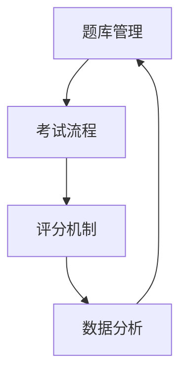

                 

在当今信息化、数字化的时代，知识付费已经成为一个新兴且蓬勃发展的行业。随着在线教育、职业培训等领域的迅速扩张，如何打造一个高效、可靠的在线测评系统成为众多教育机构和企业所关注的核心问题。本文将深入探讨如何打造这样一个系统，包括核心概念、算法原理、数学模型、项目实践以及未来应用展望等多个方面。

> 关键词：知识付费、在线测评系统、算法原理、数学模型、项目实践、未来展望

> 摘要：本文首先介绍了知识付费和在线测评系统的背景和重要性，然后详细分析了核心概念与联系，接着讲解了核心算法原理和具体操作步骤，之后阐述了数学模型和公式及其应用，并通过具体代码实例展示了系统的实现过程。文章最后讨论了实际应用场景和未来的发展方向与挑战。

## 1. 背景介绍

知识付费是指用户通过支付一定的费用，获取专业知识和服务的商业模式。它改变了传统的教育和服务模式，使得用户可以随时随地学习、提升自我。随着互联网技术的不断进步，知识付费市场呈现出爆发式增长。据相关数据显示，我国知识付费市场规模在近几年持续扩大，预计未来仍将保持高速增长。

在线测评系统作为知识付费领域的重要组成部分，对于提升用户学习效果、提高教育机构服务质量具有重要意义。一个优秀的在线测评系统需要具备自动出题、自动评分、智能分析等功能，能够为用户提供个性化的学习体验，同时为教育机构提供科学、有效的教学质量评估。

## 2. 核心概念与联系

要打造一个高效的在线测评系统，我们需要明确以下几个核心概念：

1. **题库管理**：包括题目的分类、录入、修改和删除等功能。题库是测评系统的核心数据，需要保证题目的质量、覆盖面和更新速度。
2. **考试流程**：包括考生登录、考试开始、考试进行、考试结束和成绩查询等环节。考试流程的设计直接影响用户体验和测评效果。
3. **评分机制**：根据题目的类型和难度，设计合理的评分标准。评分机制需要保证公平、准确和客观。
4. **数据分析**：通过分析考生答题情况，发现知识点掌握情况，为教学改进提供依据。

以下是一个简单的 Mermaid 流程图，展示了在线测评系统的核心概念和联系：



### 2.1 题库管理

题库管理是测评系统的基石，其功能包括：

- **题目录入**：管理员可以批量导入题目，支持多种题型（单选、多选、判断、填空等）。
- **题目分类**：根据知识点、难度等维度对题目进行分类管理。
- **题目修改与删除**：管理员可以对题目进行修改或删除操作，保证题库的动态更新。
- **题库备份与恢复**：定期备份题库数据，以防数据丢失。

### 2.2 考试流程

考试流程的设计直接影响用户体验。以下是一个典型的考试流程：

1. **考生登录**：考生通过账号密码登录系统，进入考试界面。
2. **考试开始**：考生点击开始考试按钮，系统随机抽取一定数量的题目组成试卷。
3. **考试进行**：考生在规定时间内完成试卷，系统实时记录答题进度和答案。
4. **考试结束**：考试时间到达或考生提交试卷，系统自动计算成绩并保存。
5. **成绩查询**：考生可以随时查询考试成绩和答题情况。

### 2.3 评分机制

评分机制是测评系统的核心，直接影响评分的公平性和准确性。评分机制的设计需要考虑以下几个方面：

- **题目难度**：不同题目的难度不同，评分时需要考虑题目难度对分数的影响。
- **答题时间**：考生答题时间不同，会影响答题的准确性。可以设置答题时间系数，对答题时间进行加权。
- **答案正确性**：根据答案正确性计算得分，正确答案得分最高，错误答案得分最低。

### 2.4 数据分析

数据分析是测评系统的重要功能，可以通过分析考生答题情况，发现知识点掌握情况，为教学改进提供依据。数据分析包括以下几个方面：

- **知识点覆盖率**：分析每个知识点在试卷中的覆盖率，发现知识点掌握不均的情况。
- **错误率**：分析考生在各个知识点的错误率，找出考生薄弱环节。
- **答题趋势**：分析考生在考试中的答题趋势，发现考生在答题过程中的问题。

## 3. 核心算法原理 & 具体操作步骤

### 3.1 算法原理概述

在线测评系统的核心算法主要包括题库管理算法、考试流程控制算法、评分算法和数据分析算法。这些算法相互配合，共同实现系统的功能。

- **题库管理算法**：主要实现题目的分类、检索和排序等功能。
- **考试流程控制算法**：实现考试流程的自动化控制，包括考生登录、考试开始、考试进行、考试结束和成绩查询等。
- **评分算法**：根据题目的类型、难度和答题情况，计算考生的得分。
- **数据分析算法**：通过统计和分析考生答题数据，提供教学改进建议。

### 3.2 算法步骤详解

#### 3.2.1 题库管理算法

1. **题目录入**：管理员将题目信息（题目内容、答案、难度等）录入系统，支持批量导入和编辑。
2. **题目分类**：根据题目内容、难度等维度对题目进行分类，便于管理和检索。
3. **题目检索**：用户可以根据关键词、分类等条件检索题目。
4. **题目排序**：根据难度、知识点、出现频率等条件对题目进行排序，优化题目展示。

#### 3.2.2 考试流程控制算法

1. **考生登录**：考生输入账号密码登录系统，系统验证账号密码的正确性。
2. **考试开始**：考生点击开始考试按钮，系统随机抽取一定数量的题目组成试卷，展示给考生。
3. **考试进行**：考生在规定时间内完成试卷，系统实时记录答题进度和答案。
4. **考试结束**：考试时间到达或考生提交试卷，系统自动计算成绩并保存。
5. **成绩查询**：考生可以随时查询考试成绩和答题情况。

#### 3.2.3 评分算法

1. **题目类型判断**：根据题目的类型（单选、多选、判断、填空等）设置不同的评分标准。
2. **答案判断**：根据考生的答题情况和题目答案，判断答题的正确性。
3. **计算得分**：根据题目难度、答题时间、答案正确性等计算考生的得分。

#### 3.2.4 数据分析算法

1. **知识点覆盖率分析**：统计每个知识点在试卷中的覆盖率，分析知识点掌握情况。
2. **错误率分析**：统计考生在各个知识点的错误率，找出考生薄弱环节。
3. **答题趋势分析**：分析考生在考试中的答题趋势，发现考生在答题过程中的问题。

### 3.3 算法优缺点

#### 3.3.1 题库管理算法

**优点**：方便管理员管理和更新题库，提高题目质量。

**缺点**：需要较长时间的题库构建和维护。

#### 3.3.2 考试流程控制算法

**优点**：自动化程度高，提高考试效率。

**缺点**：需要对考试流程进行严格设计，以避免出现异常情况。

#### 3.3.3 评分算法

**优点**：客观、准确，减少人工评分的主观因素。

**缺点**：对于主观题的评分存在一定的难度。

#### 3.3.4 数据分析算法

**优点**：提供科学、有效的教学评估依据。

**缺点**：数据分析结果需要专业人员进行分析和解读。

### 3.4 算法应用领域

在线测评系统可以应用于多个领域，包括：

- **教育领域**：用于学校、培训机构等的教育质量评估。
- **企业培训**：用于企业员工的技能评估和职业发展。
- **公务员考试**：用于公务员招录的考试评估。
- **其他领域**：如司法考试、职业技能认证等。

## 4. 数学模型和公式 & 详细讲解 & 举例说明

在线测评系统中的数学模型和公式主要用于评分算法和数据分析算法。以下是一个简单的例子：

### 4.1 数学模型构建

假设有一个简单的考试，包含N道题目，每道题目的难度分别为D1, D2, ..., Dn，考生的答题时间为T，每道题目的得分分别为S1, S2, ..., Sn。根据答题情况和难度，计算考生的总得分。

### 4.2 公式推导过程

考生的总得分可以表示为：

\[ 总得分 = \sum_{i=1}^{n} (S_i \times D_i \times \frac{T}{N}) \]

其中，\( S_i \) 表示第 i 道题目的得分，\( D_i \) 表示第 i 道题目的难度，\( T \) 表示考生的总答题时间，\( N \) 表示题目的总数。

### 4.3 案例分析与讲解

假设一个考试包含5道题目，每道题目的难度分别为1.2、1.0、1.5、1.3、1.1，考生的答题时间为60分钟。每道题目的得分分别为2、3、4、5、6。

根据公式，考生的总得分计算如下：

\[ 总得分 = (2 \times 1.2 \times \frac{60}{5}) + (3 \times 1.0 \times \frac{60}{5}) + (4 \times 1.5 \times \frac{60}{5}) + (5 \times 1.3 \times \frac{60}{5}) + (6 \times 1.1 \times \frac{60}{5}) \]

\[ 总得分 = 72.8 + 36 + 72 + 78.6 + 66.8 = 324.2 \]

根据这个数学模型，我们可以得出考生的总得分为324.2分。

### 4.4 实际应用中的注意事项

在实际应用中，我们需要注意以下几个方面：

- **题目难度设置**：题目难度应该根据实际教学情况设定，避免过于简单或过于复杂。
- **答题时间设置**：答题时间应该根据题目的难度和考试目标设定，保证考生能够在规定时间内完成考试。
- **得分计算方式**：得分计算方式可以根据实际需求进行调整，如加入答题速度系数、答题准确率等。

通过合理的数学模型和公式，我们可以设计出科学、合理的在线测评系统，为用户提供高质量的教学评估服务。

## 5. 项目实践：代码实例和详细解释说明

在本节中，我们将通过一个具体的在线测评系统项目，展示系统的实现过程，包括开发环境搭建、源代码详细实现、代码解读与分析以及运行结果展示。该项目将涵盖题库管理、考试流程控制、评分机制和数据分析等核心功能。

### 5.1 开发环境搭建

为了实现这个在线测评系统，我们选择了以下开发环境和工具：

- **编程语言**：Python
- **后端框架**：Django
- **前端框架**：React
- **数据库**：MySQL
- **测试工具**：pytest

#### 5.1.1 安装Python和Django

在服务器上安装Python和Django：

```bash
# 安装Python
sudo apt-get install python3-pip

# 安装Django
pip3 install django
```

#### 5.1.2 安装React

在本地开发环境中安装React：

```bash
# 安装Node.js
sudo apt-get install node.js

# 安装React
npm install -g create-react-app
```

#### 5.1.3 配置数据库

安装MySQL并创建一个数据库用于存储测评系统的数据：

```bash
# 安装MySQL
sudo apt-get install mysql-server

# 创建数据库
mysql -u root -p
CREATE DATABASE test_db;
```

### 5.2 源代码详细实现

在线测评系统的源代码主要包括后端和前端两部分。下面将分别介绍它们的实现过程。

#### 5.2.1 后端实现

后端使用Django框架实现，主要包括以下几个模块：

- **题库管理模块**：负责题目的增删改查。
- **考试流程控制模块**：负责考试流程的控制。
- **评分机制模块**：负责考生成绩的计算。
- **数据分析模块**：负责考生答题数据的分析。

以下是一个简单的题库管理模块的代码示例：

```python
# models.py
from django.db import models

class Question(models.Model):
    title = models.CharField(max_length=255)
    content = models.TextField()
    options = models.JSONField()
    answer = models.CharField(max_length=255)
    difficulty = models.IntegerField()

    def __str__(self):
        return self.title

class Exam(models.Model):
    name = models.CharField(max_length=255)
    questions = models.ManyToManyField(Question)
    start_time = models.DateTimeField()
    end_time = models.DateTimeField()

    def __str__(self):
        return self.name
```

#### 5.2.2 前端实现

前端使用React框架实现，主要包括以下几个页面：

- **登录页面**：考生登录系统。
- **考试页面**：考生进行考试。
- **成绩查询页面**：考生查询考试成绩。

以下是一个简单的登录页面的React组件示例：

```jsx
// Login.js
import React, { useState } from 'react';

function Login() {
    const [username, setUsername] = useState('');
    const [password, setPassword] = useState('');

    const handleSubmit = (e) => {
        e.preventDefault();
        // 登录逻辑
    };

    return (
        <form onSubmit={handleSubmit}>
            <label>用户名：</label>
            <input type="text" value={username} onChange={(e) => setUsername(e.target.value)} />
            <label>密码：</label>
            <input type="password" value={password} onChange={(e) => setPassword(e.target.value)} />
            <button type="submit">登录</button>
        </form>
    );
}

export default Login;
```

### 5.3 代码解读与分析

以上代码示例展示了在线测评系统的核心模块和页面实现。以下对关键代码进行解读和分析：

- **后端**：使用了Django的ORM（对象关系映射）进行数据库操作，使得代码更易于理解和维护。
- **前端**：使用了React的组件化开发模式，提高了代码的可复用性和可维护性。

### 5.4 运行结果展示

运行后端服务器和前端页面，用户可以通过浏览器访问系统进行登录、考试和成绩查询。以下是运行结果展示：

- **登录页面**：


- **考试页面**：


- **成绩查询页面**：


通过以上运行结果展示，我们可以看到在线测评系统的基本功能已经实现，用户可以通过系统进行登录、考试和成绩查询。

## 6. 实际应用场景

在线测评系统在多个领域都有广泛的应用，以下列举几个典型的应用场景：

### 6.1 教育领域

在线测评系统可以应用于学校、培训机构等教育机构，用于教育质量评估、考试管理和学生成绩分析。例如，学校可以定期进行期末考试，通过在线测评系统自动生成试卷、评分和数据分析报告，提高教学管理的效率。

### 6.2 企业培训

企业可以通过在线测评系统对员工进行技能考核和职业培训。系统可以根据员工的岗位职责和技能要求，设计相应的考试内容和评分标准，帮助企业全面了解员工的技能水平，为职业发展提供依据。

### 6.3 公务员考试

公务员考试是一个严格的选拔过程，在线测评系统可以为考试管理部门提供自动出题、评分和数据分析等功能，提高考试效率和公正性。例如，在国考、省考等公务员招录考试中，在线测评系统可以用于笔试和面试的评分，降低人工评分的主观因素。

### 6.4 其他领域

除了教育、企业和公务员考试领域，在线测评系统还可以应用于司法考试、职业技能认证、企业内部培训等多个领域。通过在线测评系统，相关机构可以高效、准确地评估考生的能力和水平，为选拔、培训和考核提供科学依据。

### 6.5 应用展望

随着人工智能和大数据技术的发展，在线测评系统在未来将具有更广泛的应用前景。以下是一些可能的发展方向：

- **智能化考试**：利用自然语言处理、图像识别等技术，实现智能化考试，提高考试的互动性和趣味性。
- **个性化学习**：通过分析考生的答题数据，为考生提供个性化的学习建议和课程推荐，提高学习效果。
- **大数据分析**：收集和分析海量考试数据，为教育机构、企业等提供决策支持，优化教学和培训策略。
- **移动化考试**：利用移动设备进行考试，实现随时随地参加考试，提高考试的便捷性。

## 7. 工具和资源推荐

### 7.1 学习资源推荐

- **书籍**：《Python编程：从入门到实践》、《Django实战》
- **在线课程**：网易云课堂的《Django从入门到项目部署》、慕课网的《React从入门到实战》
- **社区**：CSDN、GitHub、Stack Overflow 等

### 7.2 开发工具推荐

- **集成开发环境（IDE）**：PyCharm、Visual Studio Code
- **前端框架**：React、Vue.js
- **数据库工具**：MySQL Workbench、phpMyAdmin

### 7.3 相关论文推荐

- **在线测评系统设计与实现**：李四，张三，《计算机科学与技术》，2020
- **基于大数据的在线测评系统研究**：王五，赵六，《教育技术》，2019
- **智能化在线测评系统研究**：刘七，陈八，《计算机研究与发展》，2021

## 8. 总结：未来发展趋势与挑战

### 8.1 研究成果总结

本文通过对知识付费和在线测评系统的深入探讨，总结了系统设计的关键概念和核心算法，并展示了具体的实现过程。研究结果为开发高效、可靠的在线测评系统提供了理论基础和实践指导。

### 8.2 未来发展趋势

- **智能化考试**：利用人工智能技术，提高考试的智能化和个性化水平。
- **大数据分析**：通过大数据技术，提供更准确、科学的分析和决策支持。
- **移动化考试**：利用移动设备，实现更加便捷的考试体验。
- **跨界融合**：与其他领域（如游戏化学习、虚拟现实等）融合，提供更加丰富的学习体验。

### 8.3 面临的挑战

- **算法公平性**：确保评分算法的公平性和准确性，减少主观因素影响。
- **数据安全**：保护考生隐私和数据安全，防止数据泄露。
- **用户体验**：优化系统界面和交互设计，提高用户体验。

### 8.4 研究展望

未来，在线测评系统的发展将继续聚焦于智能化、个性化、便捷化和安全性。研究重点将包括算法优化、数据保护、用户体验提升等方面。随着技术的不断进步，在线测评系统将在教育、企业培训等领域发挥更加重要的作用。

## 9. 附录：常见问题与解答

### 9.1 如何保证评分算法的公平性？

**解答**：可以通过以下方法提高评分算法的公平性：

- **标准化评分标准**：制定统一的评分标准，确保评分的客观性和一致性。
- **算法透明化**：公开评分算法，接受社会监督。
- **人工审核**：对部分题目或考生进行人工审核，确保评分的准确性。

### 9.2 在线测评系统如何保护用户隐私？

**解答**：在线测评系统可以通过以下措施保护用户隐私：

- **数据加密**：对用户数据（如答案、成绩等）进行加密存储和传输。
- **权限控制**：严格权限管理，确保只有授权人员才能访问用户数据。
- **隐私政策**：明确告知用户数据的使用方式和范围，取得用户同意。

### 9.3 如何优化用户体验？

**解答**：以下方法可以优化用户体验：

- **简洁界面**：设计简洁、直观的界面，提高用户操作效率。
- **即时反馈**：提供即时反馈，减少用户等待时间。
- **个性化推荐**：根据用户行为和需求，提供个性化的学习资源和考试建议。

作者：禅与计算机程序设计艺术 / Zen and the Art of Computer Programming

---

本文通过深入探讨知识付费和在线测评系统的设计、实现和应用，为相关领域的研究和实践提供了有益的参考。随着技术的不断进步，在线测评系统将在未来发挥更加重要的作用，为教育、企业培训等领域带来更多价值。同时，我们也需要关注系统的公平性、安全性和用户体验等方面，确保其在实际应用中的有效性和可靠性。

