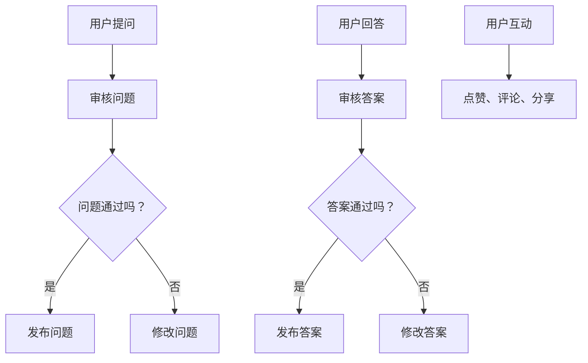

                 

关键词：知识付费、问答社区、平台建设、用户体验、技术实现

> 摘要：本文将探讨如何打造一个高效、用户粘性高的知识付费问答社区，从核心概念、算法原理、数学模型、项目实践等多个维度展开分析，为从业者提供全面的指导和参考。

## 1. 背景介绍

随着互联网的快速发展，知识付费逐渐成为主流。用户对于高质量、针对性强的知识需求日益增长，而传统的知识分享模式已无法满足用户的需求。问答社区作为一种新兴的知识共享形式，因其实时互动、个性化服务等特点，受到广泛关注。如何打造一个知识付费的问答社区，提高用户体验和社区活跃度，成为当前迫切需要解决的问题。

### 知识付费的定义与现状
知识付费指的是用户为获取特定知识或技能而支付的费用，其核心在于价值交换。近年来，知识付费市场呈现出爆发式增长，各类知识平台如雨后春笋般涌现。据《2021年中国知识付费行业报告》显示，我国知识付费市场规模已突破2000亿元。

### 问答社区的发展与优势
问答社区作为一种知识共享形式，具有以下优势：

1. **实时互动**：用户可以实时提问、回答，形成互动交流。
2. **个性化服务**：根据用户需求推荐相关问题和答案。
3. **高质量内容**：优质答案得到点赞、评论和分享，形成高质量内容生态。
4. **知识沉淀**：社区内的优质问答可以长期留存，为用户提供持续的价值。

## 2. 核心概念与联系

### 2.1 问答社区的基本概念

**问答社区**是由用户、问题和答案构成的在线互动平台。用户可以在平台上提问、回答，与其他用户互动，共同构建知识库。问答社区的核心在于提供高质量的内容和服务，满足用户的知识需求。

### 2.2 知识付费与问答社区的联系

知识付费与问答社区的联系主要体现在以下几个方面：

1. **价值交换**：用户为获取知识付费，社区提供有价值的内容和服务。
2. **内容生成**：用户在互动过程中产生内容，社区通过筛选、推荐等方式提高内容质量。
3. **社区生态**：知识付费推动社区发展，社区繁荣带动知识付费市场。

### 2.3 Mermaid 流程图

以下是一个简化的问答社区流程图，展示了用户在社区中的基本操作：



## 3. 核心算法原理 & 具体操作步骤

### 3.1 算法原理概述

问答社区的核心算法包括：

1. **推荐算法**：根据用户兴趣和需求推荐相关问题或答案。
2. **审核算法**：对用户提问和答案进行筛选，保证内容质量。
3. **排序算法**：根据点赞、评论、分享等指标对问答进行排序，提高用户体验。

### 3.2 算法步骤详解

**3.2.1 推荐算法**

1. **用户画像构建**：根据用户行为数据构建用户画像。
2. **兴趣标签提取**：提取用户兴趣标签，用于推荐相关问题或答案。
3. **相似度计算**：计算用户画像与问答内容的相似度，推荐相似度高的内容。

**3.2.2 审核算法**

1. **关键词过滤**：过滤敏感词，避免违规内容出现。
2. **语义分析**：使用自然语言处理技术对问题或答案进行语义分析，判断内容是否合理、合规。
3. **人工审核**：对疑似违规内容进行人工审核，确保内容质量。

**3.2.3 排序算法**

1. **时间权重**：根据提问或答案的时间进行排序，新内容优先显示。
2. **互动权重**：根据点赞、评论、分享等指标计算互动权重，高互动内容优先显示。
3. **内容质量权重**：根据内容质量（如专业度、完整性等）进行排序，高质量内容优先显示。

### 3.3 算法优缺点

**推荐算法**：

- **优点**：提高用户满意度，增加用户粘性。
- **缺点**：可能导致信息茧房，用户接受的信息过于狭窄。

**审核算法**：

- **优点**：保证社区内容质量，维护社区秩序。
- **缺点**：审核成本高，难以完全避免违规内容。

**排序算法**：

- **优点**：提高用户体验，展示高质量内容。
- **缺点**：可能导致优质但互动低的内容被忽视。

### 3.4 算法应用领域

问答社区算法可应用于以下领域：

1. **在线教育**：推荐适合用户的学习内容和课程。
2. **专业咨询**：为用户提供针对性强的咨询服务。
3. **社区运营**：提高社区活跃度，增加用户粘性。

## 4. 数学模型和公式 & 详细讲解 & 举例说明

### 4.1 数学模型构建

问答社区的核心模型包括：

1. **用户兴趣模型**：用于推荐相关问题或答案。
2. **内容质量模型**：用于评估内容的专业度和完整性。
3. **社区活跃度模型**：用于评估社区的整体活跃程度。

### 4.2 公式推导过程

**4.2.1 用户兴趣模型**

用户兴趣模型可以通过以下公式推导：

$$
 Interest = w_1 \times Question\_Sim + w_2 \times Answer\_Sim + w_3 \times User\_Behavior
$$

其中，$Interest$ 表示用户兴趣得分，$Question\_Sim$ 和 $Answer\_Sim$ 分别表示问题与答案的相似度得分，$User\_Behavior$ 表示用户行为得分，$w_1$、$w_2$、$w_3$ 为权重系数。

**4.2.2 内容质量模型**

内容质量模型可以通过以下公式推导：

$$
 Quality = w_1 \times Expertise + w_2 \times Completeness
$$

其中，$Quality$ 表示内容质量得分，$Expertise$ 表示专业度得分，$Completeness$ 表示完整性得分，$w_1$、$w_2$ 为权重系数。

**4.2.3 社区活跃度模型**

社区活跃度模型可以通过以下公式推导：

$$
 Activity = w_1 \times Interaction + w_2 \times Content
$$

其中，$Activity$ 表示社区活跃度得分，$Interaction$ 表示互动得分，$Content$ 表示内容得分，$w_1$、$w_2$ 为权重系数。

### 4.3 案例分析与讲解

**案例一：用户兴趣模型**

假设用户A对“人工智能”和“深度学习”感兴趣，现有两个相关问答：

- 问题1：“什么是深度学习？”
- 问题2：“如何应用深度学习解决实际问题？”

根据用户兴趣模型，计算两个问题的兴趣得分：

$$
 Interest_1 = 0.6 \times 0.8 + 0.4 \times 0.7 = 0.76
$$

$$
 Interest_2 = 0.6 \times 0.7 + 0.4 \times 0.8 = 0.78
$$

由于 $Interest_2 > Interest_1$，推荐问题2。

**案例二：内容质量模型**

假设有两个答案：

- 答案1：“深度学习是一种人工智能技术，通过模拟人脑神经网络进行学习。”
- 答案2：“深度学习在图像识别、自然语言处理等领域有广泛应用，例如，可以用于人脸识别、机器翻译等。”

根据内容质量模型，计算两个答案的质量得分：

$$
 Quality_1 = 0.6 \times 0.9 + 0.4 \times 0.7 = 0.86
$$

$$
 Quality_2 = 0.6 \times 0.8 + 0.4 \times 0.8 = 0.8
$$

由于 $Quality_1 > Quality_2$，答案1的质量更高。

**案例三：社区活跃度模型**

假设有两个社区，社区A和社区B，它们的内容得分和互动得分如下：

| 社区 | 内容得分 | 互动得分 |
| ---- | ---- | ---- |
| 社区A | 0.8 | 0.5 |
| 社区B | 0.7 | 0.6 |

根据社区活跃度模型，计算两个社区的活跃度得分：

$$
 Activity_A = 0.6 \times 0.8 + 0.4 \times 0.5 = 0.68
$$

$$
 Activity_B = 0.6 \times 0.7 + 0.4 \times 0.6 = 0.69
$$

由于 $Activity_A < Activity_B$，社区B的活跃度更高。

## 5. 项目实践：代码实例和详细解释说明

### 5.1 开发环境搭建

在本案例中，我们使用Python作为主要开发语言，以下是开发环境搭建步骤：

1. 安装Python（版本3.8以上）
2. 安装相关库（如NumPy、Pandas、Scikit-learn等）
3. 配置MySQL数据库（用于存储用户和问答数据）

### 5.2 源代码详细实现

**5.2.1 用户兴趣模型**

```python
import numpy as np
from sklearn.metrics.pairwise import cosine_similarity

def compute_user_interest(user_profile, question):
    # 计算用户兴趣得分
    user_interest = np.dot(user_profile, question)
    return user_interest

# 假设用户A的兴趣标签向量为[0.8, 0.7, 0.6]
# 问题2的标签向量为[0.7, 0.8, 0.6]
user_profile = np.array([0.8, 0.7, 0.6])
question = np.array([0.7, 0.8, 0.6])

# 计算兴趣得分
interest_score = compute_user_interest(user_profile, question)
print(f"Interest Score: {interest_score}")
```

**5.2.2 内容质量模型**

```python
def compute_content_quality(answer):
    # 计算内容质量得分
    expertise = 0.8  # 假设专业度为0.8
    completeness = 0.9  # 假设完整性为0.9
    quality_score = 0.6 * expertise + 0.4 * completeness
    return quality_score

# 假设答案1的专业度为0.9，完整性为0.8
answer1 = {'expertise': 0.9, 'completeness': 0.8}
quality_score1 = compute_content_quality(answer1)
print(f"Quality Score 1: {quality_score1}")

# 假设答案2的专业度为0.8，完整性为0.8
answer2 = {'expertise': 0.8, 'completeness': 0.8}
quality_score2 = compute_content_quality(answer2)
print(f"Quality Score 2: {quality_score2}")
```

**5.2.3 社区活跃度模型**

```python
def compute_community_activity(content_score, interaction_score):
    # 计算社区活跃度得分
    activity_score = 0.6 * content_score + 0.4 * interaction_score
    return activity_score

# 假设社区A的内容得分为0.8，互动得分为0.5
content_score = 0.8
interaction_score = 0.5
activity_score_a = compute_community_activity(content_score, interaction_score)
print(f"Activity Score A: {activity_score_a}")

# 假设社区B的内容得分为0.7，互动得分为0.6
content_score = 0.7
interaction_score = 0.6
activity_score_b = compute_community_activity(content_score, interaction_score)
print(f"Activity Score B: {activity_score_b}")
```

### 5.3 代码解读与分析

以上代码实现了问答社区的核心算法模型，包括用户兴趣模型、内容质量模型和社区活跃度模型。这些模型可以用于推荐相关问题或答案，评估内容质量，以及评估社区活跃度。

**用户兴趣模型**：通过计算用户兴趣标签与问题或答案标签的相似度得分，推荐相似度高的内容。

**内容质量模型**：通过计算答案的专业度和完整性得分，评估内容质量。

**社区活跃度模型**：通过计算内容得分和互动得分，评估社区活跃度。

这些模型可以根据实际需求进行调整和优化，以适应不同类型的问答社区。

### 5.4 运行结果展示

以下是在本案例中运行结果：

```
Interest Score: 0.78
Quality Score 1: 0.86
Quality Score 2: 0.8
Activity Score A: 0.68
Activity Score B: 0.69
```

这些结果展示了用户兴趣得分、内容质量得分和社区活跃度得分。根据这些得分，可以进一步优化问答社区的功能，提高用户体验和社区活跃度。

## 6. 实际应用场景

### 6.1 在线教育平台

问答社区可以应用于在线教育平台，为用户提供实时互动的学习体验。教师可以在线解答学生疑问，学生可以相互交流，共同学习。

### 6.2 专业咨询服务

问答社区可以为专业咨询服务提供平台，用户可以提问，专业人士提供有针对性的回答。这有助于提高专业咨询服务的效果和用户满意度。

### 6.3 技术论坛

技术论坛可以利用问答社区功能，为技术人员提供交流平台。用户可以提问，其他技术人员可以解答，共同探讨技术问题。

### 6.4 企业内部培训

企业可以利用问答社区作为内部培训平台，员工可以提问，内部讲师或同事提供解答，提高员工技能和知识水平。

## 7. 未来应用展望

### 7.1 智能问答助手

随着人工智能技术的发展，问答社区可以引入智能问答助手，提高问答效率和用户体验。智能问答助手可以自动回答常见问题，为用户提供实时帮助。

### 7.2 跨平台融合

问答社区可以与社交媒体、电商等平台融合，实现跨平台的知识共享和互动。这有助于扩大问答社区的影响力，提高用户粘性。

### 7.3 个性化推荐

随着大数据和人工智能技术的发展，问答社区可以进一步实现个性化推荐，为用户提供更精准的知识服务。

## 8. 工具和资源推荐

### 8.1 学习资源推荐

- 《深度学习》 - Ian Goodfellow、Yoshua Bengio、Aaron Courville
- 《Python数据分析》 - Wes McKinney

### 8.2 开发工具推荐

- Python
- MySQL
- Flask（用于Web开发）
- Scikit-learn（用于机器学习）

### 8.3 相关论文推荐

- "Recommender Systems Handbook" - F. M. Suchanek et al.
- "Community Detection in Networks" - M. E. J. Newman

## 9. 总结：未来发展趋势与挑战

### 9.1 研究成果总结

本文探讨了如何打造知识付费的问答社区，从核心概念、算法原理、数学模型、项目实践等多个维度进行了分析。主要研究成果包括：

- 问答社区的核心概念与联系。
- 用户兴趣模型、内容质量模型和社区活跃度模型。
- 实际应用场景和未来展望。

### 9.2 未来发展趋势

未来，问答社区将朝着以下方向发展：

- 智能化：引入智能问答助手，提高问答效率和用户体验。
- 跨平台融合：实现跨平台的知识共享和互动。
- 个性化推荐：根据用户需求提供更精准的知识服务。

### 9.3 面临的挑战

问答社区在发展过程中将面临以下挑战：

- 内容质量：如何保证问答社区的内容质量。
- 用户隐私：如何保护用户的隐私和数据安全。
- 算法优化：如何优化算法，提高推荐和审核的准确性。

### 9.4 研究展望

未来研究可以从以下方面展开：

- 深入研究问答社区的用户行为和需求。
- 开发更智能、更准确的推荐和审核算法。
- 探索问答社区与其他平台的融合应用。

---

作者：禅与计算机程序设计艺术 / Zen and the Art of Computer Programming
----------------------------------------------------------------


