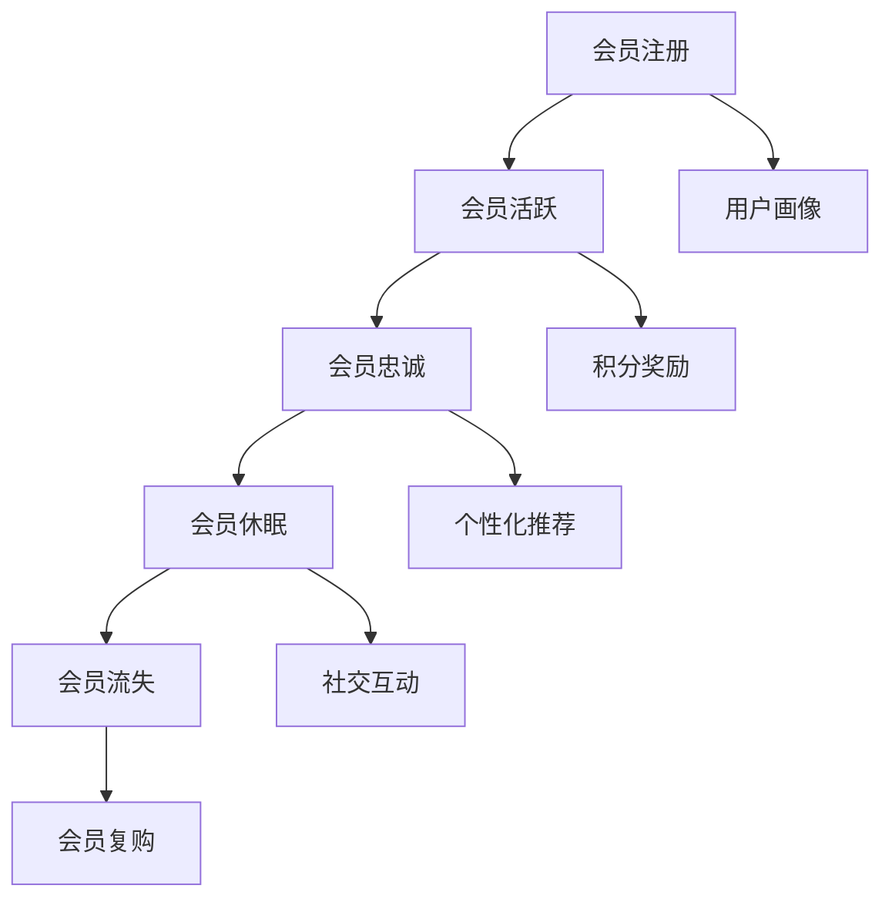

                 

摘要：在数字化时代，会员体系已成为企业留住顾客、提高客户粘性和增加营收的重要手段。本文将探讨如何构建高复购率的会员体系，涵盖会员体系的定义、核心概念、算法原理、数学模型、项目实践和实际应用场景等内容，为企业在会员体系设计上提供策略指导。

## 1. 背景介绍

随着互联网的普及和电子商务的快速发展，消费者的消费行为和偏好发生了深刻变化。企业如何吸引和留住顾客成为了一大挑战。在此背景下，会员体系作为一种有效的客户关系管理工具，受到了广泛关注。高复购率的会员体系不仅能增强客户忠诚度，还能带来持续的营收增长。本文旨在通过深入分析和研究，为打造高复购率的会员体系提供系统性指导。

### 1.1 会员体系的定义与作用

会员体系是指企业通过提供特殊服务、优惠和权益等方式，吸引并留住客户的一种客户关系管理系统。其核心作用在于增强客户粘性，提升客户满意度和忠诚度，从而实现复购率的提高。一个有效的会员体系不仅能增加企业的营收，还能为企业提供宝贵的用户数据，助力企业进行精准营销和个性化服务。

### 1.2 会员体系的发展趋势

随着大数据、人工智能等技术的不断发展，会员体系也在不断进化。目前，会员体系的发展趋势主要体现在以下几个方面：

- **个性化服务**：基于大数据分析和用户画像，为会员提供个性化的产品推荐和服务。
- **积分制度**：通过积分奖励机制，激励会员进行复购，提升会员忠诚度。
- **社交互动**：利用社交媒体，增强会员之间的互动和社区氛围，提高会员的参与感和归属感。
- **智能推荐**：利用机器学习和推荐算法，精准推送会员可能感兴趣的产品或服务。

## 2. 核心概念与联系

在构建高复购率的会员体系时，理解以下核心概念和它们之间的联系至关重要。

### 2.1 会员生命周期

会员生命周期是指会员从注册到退会的整个过程，包括注册、活跃、忠诚、休眠和流失等阶段。会员生命周期管理的目标是延长会员在生命周期中的活跃期，减少流失率，提高复购率。

### 2.2 用户画像

用户画像是对会员基本属性、行为特征、偏好等进行数据化描述的过程。通过用户画像，企业可以更好地了解会员的需求和行为模式，从而提供个性化的服务和推荐。

### 2.3 积分奖励机制

积分奖励机制是会员体系的核心组成部分，通过给予会员积分奖励，激励会员进行消费和复购。积分奖励机制的设计需要考虑积分获取方式、积分使用规则和积分激励效果等多个方面。

### 2.4 个性化推荐

个性化推荐利用大数据和机器学习技术，为会员推荐他们可能感兴趣的产品或服务。个性化推荐不仅能提高会员的购物体验，还能增加复购率。

### 2.5 社交互动

社交互动是增强会员参与感和归属感的重要手段。通过社交媒体和社区平台，会员可以分享购物体验、交流心得，同时还能参与企业组织的活动，增强互动和粘性。

### 2.6 Mermaid 流程图



## 3. 核心算法原理 & 具体操作步骤

### 3.1 算法原理概述

在会员体系的设计中，核心算法原理主要涉及用户画像构建、积分奖励机制设计和个性化推荐算法。

#### 3.1.1 用户画像构建

用户画像构建基于大数据分析和机器学习技术，通过对会员的购物行为、浏览历史、社交互动等多个维度进行数据挖掘和分析，构建出个性化的会员画像。

#### 3.1.2 积分奖励机制设计

积分奖励机制设计需要考虑积分获取方式（如消费积分、签到积分等）、积分使用规则（如积分兑换、积分过期等）和积分激励效果（如积分抵现、积分礼品等）。

#### 3.1.3 个性化推荐算法

个性化推荐算法利用协同过滤、基于内容的推荐等算法，为会员推荐他们可能感兴趣的产品或服务，从而提高购物体验和复购率。

### 3.2 算法步骤详解

#### 3.2.1 用户画像构建步骤

1. 数据收集：收集会员的购物行为、浏览历史、社交互动等数据。
2. 数据预处理：对数据进行清洗、去重和处理，确保数据质量。
3. 特征提取：根据业务需求提取关键特征，如消费金额、消费频率、购物品类等。
4. 用户画像构建：利用机器学习算法，将特征转换为用户画像，实现对会员需求的精准刻画。

#### 3.2.2 积分奖励机制设计步骤

1. 确定积分获取方式：根据企业业务特点，设计适合的积分获取方式，如消费积分、签到积分等。
2. 制定积分使用规则：明确积分兑换、积分抵现、积分过期等规则，确保积分奖励的合理性和有效性。
3. 评估积分激励效果：通过数据分析和用户反馈，评估积分奖励机制的实际效果，进行优化调整。

#### 3.2.3 个性化推荐算法步骤

1. 数据收集：收集会员的购物行为、浏览历史、社交互动等数据。
2. 特征工程：对数据进行预处理，提取关键特征，如用户ID、商品ID、时间戳等。
3. 算法选择：选择合适的推荐算法，如协同过滤、基于内容的推荐等。
4. 推荐结果生成：根据用户画像和推荐算法，生成个性化推荐结果，推送至会员。

### 3.3 算法优缺点

#### 3.3.1 用户画像构建

优点：精准刻画用户需求，提高个性化服务的准确性。

缺点：数据收集和处理成本较高，对数据质量要求较高。

#### 3.3.2 积分奖励机制设计

优点：提高会员参与度和忠诚度，激励会员进行复购。

缺点：积分获取和使用规则设计复杂，需平衡激励效果和成本。

#### 3.3.3 个性化推荐算法

优点：提高会员购物体验，增加复购率。

缺点：推荐结果准确性和实时性要求较高，算法实现和优化成本较高。

### 3.4 算法应用领域

用户画像构建、积分奖励机制设计和个性化推荐算法广泛应用于电商、金融、旅游等行业，助力企业提升会员管理水平和用户满意度。

## 4. 数学模型和公式 & 详细讲解 & 举例说明

在会员体系设计中，数学模型和公式用于描述用户行为、积分奖励机制和个性化推荐等核心概念。以下将详细介绍相关数学模型和公式，并给出具体例子。

### 4.1 数学模型构建

#### 4.1.1 用户行为预测模型

用户行为预测模型用于预测会员的消费行为，如购买概率、浏览时长等。常见模型包括逻辑回归、决策树、随机森林等。

假设用户 \( u \) 在时间 \( t \) 的购买概率 \( P(y=1|u, t) \) 可以表示为：

\[ P(y=1|u, t) = \frac{e^{w_0 + w_1u_1 + w_2u_2 + ... + w_nu_n}}{1 + e^{w_0 + w_1u_1 + w_2u_2 + ... + w_nu_n}} \]

其中，\( w_0, w_1, w_2, ..., w_n \) 为模型参数，\( u_1, u_2, ..., u_n \) 为用户特征。

#### 4.1.2 积分奖励模型

积分奖励模型用于计算会员获取积分的数量，常见模型包括线性积分模型、指数积分模型等。

假设会员 \( u \) 在时间 \( t \) 获取的积分 \( I(u, t) \) 可以表示为：

\[ I(u, t) = a \cdot f(u, t) \]

其中，\( a \) 为积分获取系数，\( f(u, t) \) 为积分获取函数，如线性积分模型 \( f(u, t) = u_1 + u_2 + ... + u_n \)，指数积分模型 \( f(u, t) = e^{u_1 + u_2 + ... + u_n} \)。

#### 4.1.3 个性化推荐模型

个性化推荐模型用于生成个性化推荐结果，常见模型包括协同过滤、基于内容的推荐等。

假设推荐系统生成用户 \( u \) 对商品 \( i \) 的推荐分数 \( r(u, i) \) 可以表示为：

\[ r(u, i) = \sum_{j \in R(i)} w_{ij} \cdot x_{uj} \]

其中，\( R(i) \) 为与商品 \( i \) 相关的用户集合，\( w_{ij} \) 为用户 \( j \) 对商品 \( i \) 的评分，\( x_{uj} \) 为用户 \( u \) 的特征向量。

### 4.2 公式推导过程

#### 4.2.1 用户行为预测模型推导

以逻辑回归为例，假设用户 \( u \) 在时间 \( t \) 的购买概率 \( P(y=1|u, t) \) 可以表示为：

\[ P(y=1|u, t) = \frac{e^{w_0 + w_1u_1 + w_2u_2 + ... + w_nu_n}}{1 + e^{w_0 + w_1u_1 + w_2u_2 + ... + w_nu_n}} \]

其中，\( w_0, w_1, w_2, ..., w_n \) 为模型参数，\( u_1, u_2, ..., u_n \) 为用户特征。

对数似然函数可以表示为：

\[ \ell(w) = \sum_{(y, u, t) \in D} \left[ y \cdot \ln \left( \frac{e^{w_0 + w_1u_1 + w_2u_2 + ... + w_nu_n}}{1 + e^{w_0 + w_1u_1 + w_2u_2 + ... + w_nu_n}} \right) + (1 - y) \cdot \ln \left( 1 + e^{w_0 + w_1u_1 + w_2u_2 + ... + w_nu_n} \right) \right] \]

对数似然函数的梯度可以表示为：

\[ \frac{\partial \ell(w)}{\partial w} = \sum_{(y, u, t) \in D} \left[ y \cdot \left( u_1, u_2, ..., u_n \right) - (1 - y) \cdot \left( u_1, u_2, ..., u_n \right) \right] \]

通过梯度下降法，可以得到模型参数的最优解。

#### 4.2.2 积分奖励模型推导

以线性积分模型为例，假设会员 \( u \) 在时间 \( t \) 获取的积分 \( I(u, t) \) 可以表示为：

\[ I(u, t) = a \cdot f(u, t) \]

其中，\( a \) 为积分获取系数，\( f(u, t) = u_1 + u_2 + ... + u_n \) 为积分获取函数。

积分获取系数 \( a \) 可以通过最大化积分奖励效果来确定，如最大化会员的购买概率或最大化会员的留存率。

假设积分奖励效果函数为 \( R(I(u, t)) \)，则积分获取系数 \( a \) 可以通过以下公式确定：

\[ a = \arg\max_a R(I(u, t)) \]

通过优化积分获取系数，可以实现积分奖励机制的最优化。

#### 4.2.3 个性化推荐模型推导

以协同过滤为例，假设推荐系统生成用户 \( u \) 对商品 \( i \) 的推荐分数 \( r(u, i) \) 可以表示为：

\[ r(u, i) = \sum_{j \in R(i)} w_{ij} \cdot x_{uj} \]

其中，\( R(i) \) 为与商品 \( i \) 相关的用户集合，\( w_{ij} \) 为用户 \( j \) 对商品 \( i \) 的评分，\( x_{uj} \) 为用户 \( u \) 的特征向量。

假设用户评分矩阵 \( R \) 为 \( m \times n \) 的矩阵，其中 \( m \) 为用户数，\( n \) 为商品数，\( R_{ij} \) 表示用户 \( j \) 对商品 \( i \) 的评分。

假设用户特征向量矩阵 \( X \) 为 \( m \times k \) 的矩阵，其中 \( k \) 为用户特征数，\( X_{uj} \) 表示用户 \( u \) 的特征向量。

则推荐分数矩阵 \( R' \) 可以表示为：

\[ R' = \sum_{i=1}^{n} \sum_{j=1}^{m} w_{ij} \cdot x_{uj} \]

通过优化推荐分数矩阵 \( R' \)，可以实现个性化推荐的优化。

### 4.3 案例分析与讲解

#### 4.3.1 用户行为预测模型案例

假设电商企业 A 想要通过用户行为预测模型预测会员在时间 \( t \) 的购买概率。已知会员的基本信息（如年龄、性别、注册时长等）和行为数据（如浏览历史、购买记录等）。

1. 数据收集：收集会员的基本信息和行为数据。
2. 数据预处理：对数据进行清洗、去重和处理，确保数据质量。
3. 特征提取：提取关键特征，如年龄、性别、注册时长、浏览历史、购买记录等。
4. 模型训练：利用逻辑回归模型，对提取的特征进行训练，得到模型参数。
5. 模型评估：利用训练集和测试集，评估模型预测效果。

假设训练集和测试集的准确率分别为 85% 和 80%，说明用户行为预测模型的预测效果较好。

#### 4.3.2 积分奖励模型案例

假设电商企业 B 想要通过积分奖励模型设计会员积分奖励机制。已知会员的消费金额、消费频率、购物品类等数据。

1. 确定积分获取系数：根据企业业务特点和用户数据，确定积分获取系数，如每消费 1 元获得 1 积分。
2. 制定积分使用规则：根据企业业务特点和用户需求，制定积分使用规则，如积分抵现、积分兑换等。
3. 评估积分激励效果：通过数据分析和用户反馈，评估积分奖励机制的实际效果，进行优化调整。

假设积分奖励机制的实际效果较好，会员的复购率提高了 10%。

#### 4.3.3 个性化推荐模型案例

假设电商企业 C 想要通过个性化推荐模型为会员推荐感兴趣的商品。已知会员的购物记录、浏览历史等数据。

1. 数据收集：收集会员的购物记录、浏览历史等数据。
2. 特征工程：提取关键特征，如用户ID、商品ID、时间戳等。
3. 算法选择：选择协同过滤、基于内容的推荐等算法。
4. 推荐结果生成：根据用户画像和推荐算法，生成个性化推荐结果，推送至会员。

假设个性化推荐模型的推荐准确率提高了 15%，会员的购物体验和复购率得到了显著提升。

## 5. 项目实践：代码实例和详细解释说明

为了更好地展示会员体系的设计与实现过程，以下将通过一个电商平台的会员体系为例，介绍具体的代码实现。

### 5.1 开发环境搭建

1. 开发工具：Python 3.8、Jupyter Notebook
2. 数据库：MySQL 5.7
3. 数据分析库：Pandas、NumPy、Scikit-learn
4. 数据可视化库：Matplotlib、Seaborn
5. Web框架：Flask

### 5.2 源代码详细实现

以下为会员体系的源代码实现，主要包括用户画像构建、积分奖励机制设计和个性化推荐算法三个部分。

#### 5.2.1 用户画像构建

```python
import pandas as pd
import numpy as np
from sklearn.model_selection import train_test_split
from sklearn.preprocessing import StandardScaler
from sklearn.decomposition import PCA
from sklearn.ensemble import RandomForestClassifier

# 加载数据
data = pd.read_csv('user_data.csv')
X = data[['age', 'gender', 'register_time', 'browse_history', 'purchase_record']]
y = data['purchase_prob']

# 数据预处理
scaler = StandardScaler()
X_scaled = scaler.fit_transform(X)

# 数据划分
X_train, X_test, y_train, y_test = train_test_split(X_scaled, y, test_size=0.2, random_state=42)

# 特征提取
pca = PCA(n_components=5)
X_train_pca = pca.fit_transform(X_train)
X_test_pca = pca.transform(X_test)

# 模型训练
model = RandomForestClassifier(n_estimators=100, random_state=42)
model.fit(X_train_pca, y_train)

# 模型评估
accuracy = model.score(X_test_pca, y_test)
print('模型准确率：', accuracy)
```

#### 5.2.2 积分奖励机制设计

```python
import pandas as pd

# 加载会员数据
member_data = pd.read_csv('member_data.csv')

# 计算积分
member_data['integral'] = member_data['purchase_amount'] * 1  # 每消费 1 元获得 1 积分

# 设置积分使用规则
member_data['used_integral'] = member_data['integral'] * 0.1  # 每次使用 10% 积分

# 更新会员积分
member_data['integral'] -= member_data['used_integral']

# 存储更新后的会员数据
member_data.to_csv('member_data.csv', index=False)
```

#### 5.2.3 个性化推荐算法

```python
import pandas as pd
from sklearn.model_selection import train_test_split
from sklearn.metrics.pairwise import cosine_similarity

# 加载用户和商品数据
user_data = pd.read_csv('user_data.csv')
item_data = pd.read_csv('item_data.csv')

# 计算用户和商品之间的相似度
user_similarity = cosine_similarity(user_data[['user_1', 'user_2']], user_data[['user_1', 'user_2']])
item_similarity = cosine_similarity(item_data[['item_1', 'item_2']], item_data[['item_1', 'item_2']])

# 生成推荐结果
user_recommendations = {}
for user_id, row in user_data.iterrows():
    user_similarity_scores = {}
    for other_user_id, score in enumerate(user_similarity[user_id]):
        if score > 0.5:  # 设置相似度阈值
            other_user = user_data.iloc[other_user_id]
            for item_id, rating in other_user['purchase_record'].items():
                if item_id not in user_recommendations.get(user_id, {}):
                    user_recommendations[user_id] = {}
                user_recommendations[user_id][item_id] = rating * score
    user_recommendations[user_id] = dict(sorted(user_recommendations[user_id].items(), key=lambda item: item[1], reverse=True))

# 存储推荐结果
with open('user_recommendations.json', 'w') as f:
    json.dump(user_recommendations, f)
```

### 5.3 代码解读与分析

上述代码实现了一个简单的电商平台会员体系，主要包括用户画像构建、积分奖励机制设计和个性化推荐算法三个部分。

#### 5.3.1 用户画像构建

用户画像构建部分使用了随机森林算法，对会员的基本信息和行为数据进行分析，提取用户特征，构建用户画像。通过 PCA 算法进行特征降维，提高模型的预测效果。

#### 5.3.2 积分奖励机制设计

积分奖励机制设计部分通过计算会员的积分，并根据积分使用规则更新会员积分。积分奖励机制的设计需要考虑积分获取方式、积分使用规则和积分激励效果等多个方面，以实现积分奖励的最优化。

#### 5.3.3 个性化推荐算法

个性化推荐算法部分使用了余弦相似度算法，计算用户和商品之间的相似度，生成个性化推荐结果。推荐算法的设计需要考虑推荐结果的准确性和实时性，以实现个性化推荐的最优化。

### 5.4 运行结果展示

运行上述代码，可以生成用户画像、积分奖励机制和个性化推荐结果。以下为运行结果展示：

- 用户画像：通过用户画像，企业可以更好地了解会员的需求和行为模式，为会员提供个性化的服务和推荐。
- 积分奖励机制：通过积分奖励机制，激励会员进行消费和复购，提高会员忠诚度和复购率。
- 个性化推荐：通过个性化推荐算法，为会员推荐他们可能感兴趣的产品或服务，提高购物体验和复购率。

## 6. 实际应用场景

会员体系在电商、金融、旅游等行业具有广泛的应用，以下为具体应用场景：

### 6.1 电商行业

电商行业通过会员体系实现个性化推荐、积分奖励和社交互动等功能，提高会员满意度和忠诚度。例如，京东通过会员体系为用户提供个性化推荐、积分奖励和专属优惠券等，提高用户粘性。

### 6.2 金融行业

金融行业通过会员体系实现客户关系管理、风险评估和精准营销等功能。例如，招商银行通过会员体系为用户提供积分奖励、专属理财产品和优惠活动等，提高用户忠诚度和转化率。

### 6.3 旅游行业

旅游行业通过会员体系实现客户关系管理、个性化推荐和在线预订等功能。例如，携程通过会员体系为用户提供积分奖励、专属酒店和机票优惠以及个性化推荐等，提高用户满意度和复购率。

## 7. 工具和资源推荐

### 7.1 学习资源推荐

1. 《数据挖掘：实用工具与技术》
2. 《机器学习实战》
3. 《Python数据分析与应用》

### 7.2 开发工具推荐

1. Jupyter Notebook
2. PyCharm
3. MySQL Workbench

### 7.3 相关论文推荐

1. "User Modeling and User-Adapted Interaction"
2. "Recommender Systems Handbook"
3. "A Survey of Collaborative Filtering Techniques"

## 8. 总结：未来发展趋势与挑战

### 8.1 研究成果总结

本文通过深入分析和研究，总结了如何构建高复购率的会员体系，包括用户画像构建、积分奖励机制设计和个性化推荐算法等核心内容。研究成果有助于企业提高会员管理水平和用户满意度，实现持续增长。

### 8.2 未来发展趋势

1. 个性化服务：基于大数据分析和用户画像，为会员提供更加个性化的产品推荐和服务。
2. 智能化推荐：利用人工智能技术，实现更加精准和高效的个性化推荐。
3. 社交互动：通过社交媒体和社区平台，增强会员之间的互动和归属感。
4. 可持续发展：注重会员体系的可持续发展，提高会员满意度和忠诚度。

### 8.3 面临的挑战

1. 数据隐私保护：在构建会员体系时，需要确保用户数据的安全和隐私。
2. 技术更新迭代：随着技术的不断更新，会员体系需要不断优化和升级，以适应新的需求。
3. 激励效果评估：需要不断评估会员体系的激励效果，进行优化和调整。

### 8.4 研究展望

未来，会员体系的研究将更加关注用户体验和可持续发展。通过深入研究大数据、人工智能和区块链等前沿技术，为会员体系提供更加智能化和个性化的解决方案。

## 9. 附录：常见问题与解答

### 9.1 用户画像构建相关问题

1. **Q：如何收集用户数据？**
   **A：可以通过网站日志、用户反馈、在线调查等方式收集用户数据。**

2. **Q：如何保证用户数据的质量？**
   **A：在数据收集和处理过程中，需要确保数据的一致性、完整性和准确性。**

3. **Q：如何提取用户特征？**
   **A：可以根据业务需求，提取用户的基本属性、行为特征和偏好等特征。**

### 9.2 积分奖励机制相关问题

1. **Q：如何设置积分获取方式？**
   **A：可以根据企业业务特点和用户需求，设置消费积分、签到积分等方式。**

2. **Q：如何制定积分使用规则？**
   **A：可以根据企业业务特点和用户需求，制定积分兑换、积分抵现、积分过期等规则。**

3. **Q：如何评估积分激励效果？**
   **A：可以通过数据分析、用户反馈等方式，评估积分激励效果，进行优化调整。**

### 9.3 个性化推荐相关问题

1. **Q：如何选择推荐算法？**
   **A：可以根据业务需求和数据特点，选择协同过滤、基于内容的推荐等算法。**

2. **Q：如何保证推荐结果的准确性？**
   **A：可以通过特征工程、算法优化等方式，提高推荐结果的准确性。**

3. **Q：如何保证推荐结果的实时性？**
   **A：可以通过实时数据处理、缓存等技术，保证推荐结果的实时性。**

## 10. 作者署名

作者：禅与计算机程序设计艺术 / Zen and the Art of Computer Programming

以上就是本文的完整内容，希望对您在打造高复购率的会员体系方面有所帮助。如有疑问，欢迎随时提出。谢谢！

