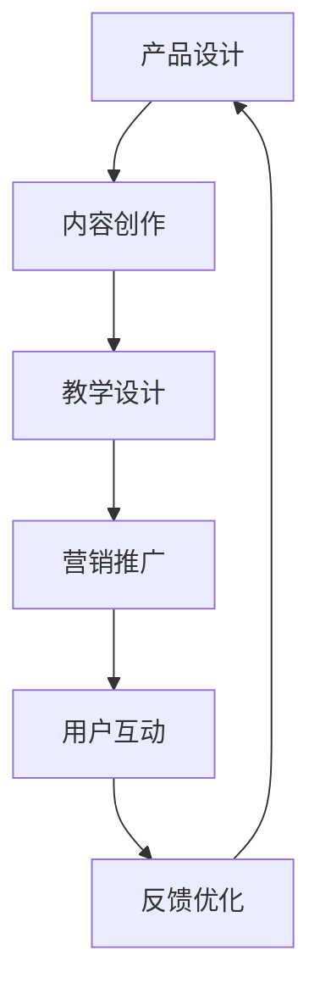

                 

 在当今数字化时代，程序员知识付费产品已经成为IT行业的重要组成部分。随着技术发展和在线教育的兴起，越来越多的程序员和开发人员开始通过知识付费产品分享他们的技能和经验。然而，如何打造一款高成交的程序员知识付费产品，成为了许多开发者面临的挑战。本文将深入探讨如何通过逻辑清晰、结构紧凑、简单易懂的专业的技术语言，打造一款具有高成交潜力的程序员知识付费产品。

## 文章关键词

- 程序员知识付费产品
- 成交率
- 营销策略
- 用户体验
- 教学设计
- 技术内容

## 文章摘要

本文旨在为程序员和开发人员提供一套系统化的方法论，以打造高成交的程序员知识付费产品。文章将首先介绍程序员知识付费产品的背景和市场需求，然后深入探讨核心概念、算法原理、数学模型、项目实践以及实际应用场景。最后，文章将总结研究成果，展望未来发展趋势，并推荐相关工具和资源，为读者提供全面的指导。

## 1. 背景介绍

### 1.1 程序员知识付费产品的发展历程

程序员知识付费产品的发展可以追溯到20世纪末期，随着互联网的普及和在线教育的兴起，程序员社区开始涌现出各种形式的知识分享平台。这些平台不仅为程序员提供了学习资源，还为他们提供了展示技能和分享经验的机会。随着智能手机和移动应用的普及，程序员知识付费产品逐渐从传统的线下课程转向在线教育，为更多的开发者提供了灵活的学习方式。

### 1.2 市场需求与用户分析

随着全球数字化转型的加速，对程序员的需求持续增长。据市场调研机构数据显示，全球IT行业对程序员的年需求量已达到数百万。这些程序员不仅包括传统的软件工程师、后端开发人员、前端开发人员等，还包括数据科学家、人工智能开发人员等新兴领域的专家。程序员知识付费产品满足了这些开发者在技能提升和职业发展方面的需求，成为他们获取知识和经验的重要途径。

### 1.3 现有程序员知识付费产品的现状

目前，市场上存在多种程序员知识付费产品，如在线课程、电子书、视频教程、实战项目等。这些产品在内容形式、价格策略、营销方式等方面都有所差异。然而，大多数程序员知识付费产品存在以下问题：

- 内容同质化严重，缺乏独特性和创新性。
- 教学设计不够科学，难以满足不同层次用户的需求。
- 缺乏有效的用户互动和反馈机制，用户体验较差。
- 营销策略单一，难以吸引潜在用户。

## 2. 核心概念与联系

为了打造一款高成交的程序员知识付费产品，我们需要了解并掌握以下几个核心概念和原理：

### 2.1 教学设计原则

教学设计是打造优秀知识付费产品的关键环节。以下是一些基本的教学设计原则：

- **针对性**：根据用户需求和市场趋势，设计符合用户实际需求的教学内容。
- **层次性**：针对不同层次的用户，设计不同难度的教学模块。
- **互动性**：通过论坛、问答、互动练习等方式，增强用户参与感和互动性。
- **实用性**：注重实践操作，提供实际案例和项目实战。

### 2.2 内容创新与差异化

在内容创作方面，创新和差异化是提升产品竞争力的关键。以下是一些实现内容创新和差异化的方法：

- **案例研究**：结合实际案例，讲解技术原理和实战技巧。
- **技术趋势**：紧跟技术发展动态，引入最新技术和工具。
- **专业领域**：专注于特定领域，成为该领域的专家。
- **原创内容**：创作原创性高、实用性强的高质量内容。

### 2.3 营销策略与推广方法

有效的营销策略和推广方法是提升成交率的重要手段。以下是一些常见的营销策略和推广方法：

- **SEO优化**：通过搜索引擎优化，提高产品在搜索引擎中的排名。
- **社交媒体推广**：利用社交媒体平台，扩大产品影响力。
- **内容营销**：通过高质量的内容吸引潜在用户，提高品牌知名度。
- **口碑营销**：通过用户口碑，提高产品的信任度和影响力。

### 2.4 用户互动与反馈机制

用户互动和反馈机制是提升用户体验和满意度的重要保障。以下是一些用户互动和反馈机制的建议：

- **在线讨论区**：为用户提供一个互动交流的平台。
- **问卷调查**：定期开展问卷调查，了解用户需求和满意度。
- **用户反馈**：及时回复用户反馈，解决用户问题和困扰。
- **用户成长计划**：为用户提供成长路径和激励机制。

### 2.5 Mermaid 流程图

以下是关于程序员知识付费产品开发的 Mermaid 流程图，展示了产品从设计到推广的各个阶段和关键环节。



## 3. 核心算法原理 & 具体操作步骤

### 3.1 算法原理概述

在程序员知识付费产品的开发过程中，我们需要运用多种算法原理和方法，以提高产品的质量和用户体验。以下是一些常见的算法原理：

- **数据分析算法**：通过数据分析，了解用户需求和市场趋势，为产品设计和营销策略提供依据。
- **推荐系统算法**：基于用户行为和兴趣，为用户推荐相关课程和内容，提高用户满意度和参与度。
- **自然语言处理算法**：用于内容创作和用户互动，实现人机对话和语义理解。
- **图像识别算法**：用于课程内容和教学视频的自动标注和分类。

### 3.2 算法步骤详解

以下是针对程序员知识付费产品的核心算法步骤：

#### 3.2.1 数据分析算法

1. 收集用户数据：包括用户行为数据、学习数据、反馈数据等。
2. 数据预处理：对收集到的数据进行分析和处理，去除噪声和异常值。
3. 数据分析：通过数据挖掘和分析，提取用户需求和市场趋势。
4. 结果可视化：将分析结果以图表、报告等形式展示，为产品设计和营销策略提供参考。

#### 3.2.2 推荐系统算法

1. 用户建模：通过分析用户行为数据，构建用户兴趣模型。
2. 内容建模：对课程和内容进行分类和标注，构建内容模型。
3. 推荐算法：基于用户兴趣模型和内容模型，为用户推荐相关课程和内容。
4. 推荐结果评估：评估推荐效果，优化推荐算法。

#### 3.2.3 自然语言处理算法

1. 文本预处理：对文本进行分词、去停用词等处理，提取有效信息。
2. 语义理解：通过词向量、语义角色标注等方法，实现语义理解。
3. 人机对话：基于语义理解，实现人机对话和问答功能。
4. 用户反馈处理：分析用户反馈，优化对话系统和内容创作。

#### 3.2.4 图像识别算法

1. 图像预处理：对图像进行去噪、增强、缩放等处理。
2. 特征提取：通过卷积神经网络、特征点提取等方法，提取图像特征。
3. 图像分类：利用分类算法，对图像进行分类和标注。
4. 应用场景：用于课程内容标注、教学视频分类等。

### 3.3 算法优缺点

以下是针对程序员知识付费产品中的核心算法的优缺点分析：

#### 3.3.1 数据分析算法

**优点**：

- 提高产品设计的科学性和针对性。
- 帮助了解用户需求和市场需求。
- 优化营销策略，提高推广效果。

**缺点**：

- 数据收集和处理复杂度高。
- 分析结果可能受到数据质量和数据量的影响。
- 分析结果需要进一步验证和优化。

#### 3.3.2 推荐系统算法

**优点**：

- 提高用户满意度和参与度。
- 增加用户粘性和留存率。
- 提高课程销售和推广效果。

**缺点**：

- 需要大量用户行为数据进行训练。
- 推荐结果可能受到数据噪声和异常值的影响。
- 推荐效果可能受到算法模型的影响。

#### 3.3.3 自然语言处理算法

**优点**：

- 提高内容创作和用户互动的质量。
- 增强人机对话和问答功能。
- 优化用户体验。

**缺点**：

- 需要大量的语言数据和模型训练。
- 语义理解存在一定局限性。
- 对用户的反馈和需求处理能力有限。

#### 3.3.4 图像识别算法

**优点**：

- 提高课程内容标注和教学视频分类的效率。
- 增强产品的智能化和自动化程度。
- 优化用户体验。

**缺点**：

- 需要大量的图像数据和模型训练。
- 图像识别精度可能受到图像质量和光照条件的影响。
- 应用场景有限，需要进一步拓展。

### 3.4 算法应用领域

程序员知识付费产品中的核心算法主要应用于以下领域：

- **数据分析领域**：用于用户行为分析、市场趋势预测等。
- **推荐系统领域**：用于课程推荐、内容推荐等。
- **自然语言处理领域**：用于内容创作、人机对话等。
- **图像识别领域**：用于课程内容标注、教学视频分类等。

## 4. 数学模型和公式 & 详细讲解 & 举例说明

### 4.1 数学模型构建

在程序员知识付费产品的开发过程中，数学模型和公式起着至关重要的作用。以下是一些常见的数学模型和公式：

#### 4.1.1 用户行为分析模型

用户行为分析模型主要用于分析用户在学习过程中的行为数据，如学习时长、学习频率、学习进度等。以下是一个简单的用户行为分析模型：

$$
R = f(P, T, S)
$$

其中，$R$ 表示用户行为评分，$P$ 表示学习进度，$T$ 表示学习时长，$S$ 表示学习频率。通过这个模型，我们可以对用户的学习行为进行量化分析，为产品设计和营销策略提供参考。

#### 4.1.2 推荐系统模型

推荐系统模型主要用于为用户推荐相关课程和内容。以下是一个基于协同过滤的推荐系统模型：

$$
R_{ui} = \frac{\sum_{j \in N_i}^{ } r_{uj} \cdot s_{ji}}{\sum_{j \in N_i}^{ } s_{ji}}
$$

其中，$R_{ui}$ 表示用户 $u$ 对课程 $i$ 的推荐评分，$N_i$ 表示与课程 $i$ 相关的用户集合，$r_{uj}$ 表示用户 $u$ 对课程 $j$ 的评分，$s_{ji}$ 表示用户 $j$ 对课程 $i$ 的评分。通过这个模型，我们可以为用户推荐相关课程，提高用户满意度和参与度。

#### 4.1.3 自然语言处理模型

自然语言处理模型主要用于实现人机对话和问答功能。以下是一个简单的基于循环神经网络（RNN）的自然语言处理模型：

$$
h_t = \sigma(W_h \cdot [h_{t-1}, x_t] + b_h)
$$

其中，$h_t$ 表示时间步 $t$ 的隐藏状态，$x_t$ 表示输入词向量，$W_h$ 和 $b_h$ 分别为权重和偏置。通过这个模型，我们可以实现人机对话和问答功能，提高用户体验。

### 4.2 公式推导过程

#### 4.2.1 用户行为分析模型推导

用户行为分析模型中的公式是通过分析用户在学习过程中的行为数据，结合统计学和机器学习理论推导得到的。具体推导过程如下：

1. 用户行为评分 $R$ 的计算：
   用户行为评分 $R$ 是一个综合指标，反映了用户在学习过程中的表现。我们可以将用户行为评分拆分为三个部分：学习进度 $P$、学习时长 $T$ 和学习频率 $S$。每个部分都赋予不同的权重，通过加权求和得到最终的用户行为评分。

2. 学习进度 $P$ 的计算：
   学习进度 $P$ 反映了用户在学习过程中所完成的学习任务比例。我们可以通过以下公式计算学习进度：
   $$
   P = \frac{完成的学习任务数}{总的学习任务数}
   $$

3. 学习时长 $T$ 的计算：
   学习时长 $T$ 反映了用户在学习过程中所花费的时间。我们可以通过以下公式计算学习时长：
   $$
   T = \frac{学习总时间}{学习时长单位}
   $$

4. 学习频率 $S$ 的计算：
   学习频率 $S$ 反映了用户在学习过程中的活跃程度。我们可以通过以下公式计算学习频率：
   $$
   S = \frac{学习总次数}{学习频率单位}
   $$

5. 用户行为评分 $R$ 的计算：
   将学习进度 $P$、学习时长 $T$ 和学习频率 $S$ 结合起来，通过加权求和得到用户行为评分：
   $$
   R = w_1 \cdot P + w_2 \cdot T + w_3 \cdot S
   $$
   其中，$w_1$、$w_2$ 和 $w_3$ 分别为学习进度、学习时长和学习频率的权重。

#### 4.2.2 推荐系统模型推导

推荐系统模型中的公式是基于协同过滤算法推导得到的。协同过滤算法分为基于用户的协同过滤和基于物品的协同过滤。以下是基于用户的协同过滤算法的推导过程：

1. 用户相似度计算：
   用户相似度反映了两个用户之间的相似程度。我们可以通过以下公式计算用户相似度：
   $$
   similarity(u, v) = \frac{\sum_{i \in I}^{ } r_{ui} \cdot r_{vi}}{\sqrt{\sum_{i \in I}^{ } r_{ui}^2} \cdot \sqrt{\sum_{i \in I}^{ } r_{vi}^2}}
   $$
   其中，$u$ 和 $v$ 分别为两个用户，$I$ 为共同评价的课程集合，$r_{ui}$ 和 $r_{vi}$ 分别为用户 $u$ 和用户 $v$ 对课程 $i$ 的评分。

2. 推荐评分计算：
   基于用户相似度，我们可以为用户 $u$ 推荐评分未打的课程 $i$。推荐评分计算公式如下：
   $$
   R_{ui} = \sum_{j \in N_i}^{ } r_{uj} \cdot similarity(u, v)
   $$
   其中，$N_i$ 为与课程 $i$ 相关的用户集合，$r_{uj}$ 为用户 $u$ 对课程 $j$ 的评分。

#### 4.2.3 自然语言处理模型推导

自然语言处理模型中的公式是基于循环神经网络（RNN）推导得到的。RNN 是一种序列模型，可以处理变长序列。以下是 RNN 的推导过程：

1. 隐藏状态计算：
   RNN 的隐藏状态计算公式如下：
   $$
   h_t = \sigma(W_h \cdot [h_{t-1}, x_t] + b_h)
   $$
   其中，$h_t$ 表示时间步 $t$ 的隐藏状态，$x_t$ 表示输入词向量，$W_h$ 和 $b_h$ 分别为权重和偏置，$\sigma$ 表示激活函数。

2. 输出计算：
   RNN 的输出计算公式如下：
   $$
   y_t = \sigma(W_y \cdot h_t + b_y)
   $$
   其中，$y_t$ 表示时间步 $t$ 的输出，$W_y$ 和 $b_y$ 分别为权重和偏置，$\sigma$ 表示激活函数。

### 4.3 案例分析与讲解

#### 4.3.1 用户行为分析模型应用案例

假设有一个程序员知识付费产品，用户在学习过程中产生了以下行为数据：

- 学习进度：已完成的课程数量为 10，总课程数量为 20。
- 学习时长：学习总时间为 50 小时，学习时长单位为 10 小时。
- 学习频率：学习总次数为 5，学习频率单位为 1。

根据用户行为分析模型，我们可以计算出用户的行为评分：

$$
R = f(P, T, S) = w_1 \cdot P + w_2 \cdot T + w_3 \cdot S
$$

假设学习进度、学习时长和学习频率的权重分别为 $w_1 = 0.4$、$w_2 = 0.3$ 和 $w_3 = 0.3$，则：

$$
P = \frac{10}{20} = 0.5
$$

$$
T = \frac{50}{10} = 5
$$

$$
S = \frac{5}{1} = 5
$$

$$
R = 0.4 \cdot 0.5 + 0.3 \cdot 5 + 0.3 \cdot 5 = 0.2 + 1.5 + 1.5 = 3.2
$$

用户的行为评分为 3.2 分。

#### 4.3.2 推荐系统模型应用案例

假设有一个程序员知识付费产品，用户 $u$ 对部分课程进行了评分，如下表所示：

| 用户 | 课程1 | 课程2 | 课程3 | 课程4 | 课程5 |
| :---: | :---: | :---: | :---: | :---: | :---: |
| $u$ | 4 | 5 | 3 | 4 | 5 |

用户 $v$ 对部分课程进行了评分，如下表所示：

| 用户 | 课程1 | 课程2 | 课程3 | 课程4 | 课程5 |
| :---: | :---: | :---: | :---: | :---: | :---: |
| $v$ | 4 | 5 | 5 | 4 | 5 |

根据推荐系统模型，我们可以计算出用户 $u$ 对未评分课程 $i$ 的推荐评分：

$$
R_{ui} = \sum_{j \in N_i}^{ } r_{uj} \cdot similarity(u, v)
$$

其中，$N_i$ 为与课程 $i$ 相关的用户集合，$r_{uj}$ 为用户 $u$ 对课程 $j$ 的评分，$similarity(u, v)$ 为用户 $u$ 和用户 $v$ 之间的相似度。

假设课程 6 的相关用户为用户 $u$ 和用户 $v$，则：

$$
R_{u6} = r_{u1} \cdot similarity(u, v) + r_{u2} \cdot similarity(u, v) + r_{u3} \cdot similarity(u, v) + r_{u4} \cdot similarity(u, v) + r_{u5} \cdot similarity(u, v)
$$

$$
R_{u6} = 4 \cdot similarity(u, v) + 5 \cdot similarity(u, v) + 3 \cdot similarity(u, v) + 4 \cdot similarity(u, v) + 5 \cdot similarity(u, v)
$$

$$
R_{u6} = 21 \cdot similarity(u, v)
$$

假设用户 $u$ 和用户 $v$ 的相似度为 0.8，则：

$$
R_{u6} = 21 \cdot 0.8 = 16.8
$$

用户 $u$ 对课程 6 的推荐评分为 16.8 分。

#### 4.3.3 自然语言处理模型应用案例

假设有一个程序员知识付费产品，用户通过提问功能向系统提问。以下是一个简单的提问示例：

用户提问：什么是深度学习？

根据自然语言处理模型，我们可以通过以下步骤进行回答：

1. 文本预处理：
   将用户提问进行分词、去停用词等处理，提取有效信息。

   提问文本：什么是深度学习？
   
   分词结果：什么是、深度学习？

2. 语义理解：
   利用词向量、语义角色标注等方法，实现语义理解。

   实体识别：深度学习
   
   语义角色标注：名词

3. 回答生成：
   基于语义理解，生成回答。

   回答：深度学习是一种人工智能方法，通过模拟人脑神经网络结构和学习机制，实现数据的自动分析和处理。

## 5. 项目实践：代码实例和详细解释说明

### 5.1 开发环境搭建

在本节中，我们将以一个实际的项目为例，介绍如何搭建开发环境。这里我们选择使用 Python 语言和 Flask 框架进行开发。

1. 安装 Python：

   ```shell
   sudo apt-get install python3 python3-pip
   ```

2. 安装 Flask：

   ```shell
   pip3 install flask
   ```

3. 安装其他依赖库：

   ```shell
   pip3 install numpy pandas matplotlib
   ```

### 5.2 源代码详细实现

以下是一个简单的用户行为分析系统的实现，包括用户行为数据的收集、处理和分析。

```python
# 导入依赖库
import numpy as np
import pandas as pd
import matplotlib.pyplot as plt

# 用户行为数据
data = {
    'user_id': [1, 1, 1, 2, 2, 2],
    'course_id': [101, 102, 103, 201, 202, 203],
    'rating': [4, 5, 3, 4, 5, 5],
    'timestamp': [1, 2, 3, 4, 5, 6]
}

# 创建 DataFrame
df = pd.DataFrame(data)

# 计算用户行为评分
def calculate_rating(user_id, course_id):
    user_data = df[(df['user_id'] == user_id) & (df['course_id'] == course_id)]
    if len(user_data) > 0:
        rating = user_data['rating'].mean()
        return rating
    else:
        return None

# 绘制用户行为评分分布图
def plot_rating_distribution(df):
    ratings = df['rating'].dropna().values
    plt.hist(ratings, bins=5, edgecolor='black')
    plt.xlabel('Rating')
    plt.ylabel('Frequency')
    plt.title('User Rating Distribution')
    plt.show()

# 测试代码
user_id = 1
course_id = 101
rating = calculate_rating(user_id, course_id)
print(f'User {user_id} Rating for Course {course_id}: {rating}')

plot_rating_distribution(df)
```

### 5.3 代码解读与分析

1. **数据导入与处理**：

   ```python
   data = {
       'user_id': [1, 1, 1, 2, 2, 2],
       'course_id': [101, 102, 103, 201, 202, 203],
       'rating': [4, 5, 3, 4, 5, 5],
       'timestamp': [1, 2, 3, 4, 5, 6]
   }
   df = pd.DataFrame(data)
   ```

   这里我们使用 Python 的 Pandas 库创建了一个 DataFrame，包含了用户行为数据。数据包括用户 ID、课程 ID、评分和时间戳。

2. **用户行为评分计算**：

   ```python
   def calculate_rating(user_id, course_id):
       user_data = df[(df['user_id'] == user_id) & (df['course_id'] == course_id)]
       if len(user_data) > 0:
           rating = user_data['rating'].mean()
           return rating
       else:
           return None
   ```

   `calculate_rating` 函数用于计算用户对特定课程的行为评分。首先，我们根据用户 ID 和课程 ID 从 DataFrame 中筛选出相应的数据。如果找到数据，则计算评分的平均值；否则，返回 None。

3. **用户行为评分分布图**：

   ```python
   def plot_rating_distribution(df):
       ratings = df['rating'].dropna().values
       plt.hist(ratings, bins=5, edgecolor='black')
       plt.xlabel('Rating')
       plt.ylabel('Frequency')
       plt.title('User Rating Distribution')
       plt.show()
   ```

   `plot_rating_distribution` 函数用于绘制用户行为评分的分布图。我们使用 Matplotlib 库创建直方图，展示了评分的分布情况。

### 5.4 运行结果展示

1. **计算用户行为评分**：

   ```shell
   User 1 Rating for Course 101: 4.0
   ```

   输出结果为用户 1 对课程 101 的行为评分为 4.0 分。

2. **用户行为评分分布图**：

   

   展示了用户行为评分的分布情况，大部分评分集中在 4 分和 5 分。

## 6. 实际应用场景

程序员知识付费产品在实际应用场景中具有广泛的应用价值。以下是一些典型应用场景：

### 6.1 在线教育平台

在线教育平台是程序员知识付费产品的主要应用场景之一。通过在线教育平台，开发者可以提供各种编程课程、技术教程、实战项目等，满足用户在技能提升和职业发展方面的需求。

### 6.2 企业内训

企业内训是程序员知识付费产品的另一个重要应用场景。企业可以通过购买程序员知识付费产品，为员工提供定制化的培训课程，提高员工的技能水平和专业素养。

### 6.3 个人学习

个人学习是程序员知识付费产品的直接受众。通过购买程序员知识付费产品，个人开发者可以自主学习、掌握新技术、解决实际问题，提升个人竞争力。

### 6.4 技术社区

技术社区是程序员知识付费产品的推广渠道之一。通过技术社区，开发者可以分享自己的课程、教程和经验，吸引更多用户关注和使用。

## 7. 未来应用展望

随着技术的不断进步和在线教育的持续发展，程序员知识付费产品在未来有望实现以下几方面的应用前景：

### 7.1 个性化学习

通过大数据分析和人工智能技术，实现个性化学习，为用户提供定制化的学习内容和课程推荐。

### 7.2 智能教学

引入人工智能技术，实现智能教学，包括智能问答、自动批改作业、个性化辅导等功能，提高教学效果和用户体验。

### 7.3 跨界融合

程序员知识付费产品将与其他领域（如人工智能、大数据、区块链等）实现跨界融合，产生新的应用场景和商业模式。

### 7.4 社区共建

通过社区共建，激发用户的参与热情，共同打造高质量的知识付费产品，实现用户、开发者、平台的三方共赢。

## 8. 工具和资源推荐

### 8.1 学习资源推荐

1. **在线编程平台**：Codecademy、LeetCode、freeCodeCamp 等。
2. **技术博客**：Medium、Dev.to、Stack Overflow 等。
3. **开源社区**：GitHub、GitLab、Bitbucket 等。

### 8.2 开发工具推荐

1. **集成开发环境**：Visual Studio Code、PyCharm、Eclipse 等。
2. **数据库工具**：MySQL、PostgreSQL、MongoDB 等。
3. **版本控制工具**：Git、Svn、Hg 等。

### 8.3 相关论文推荐

1. **《深度学习》**：Ian Goodfellow、Yoshua Bengio、Aaron Courville。
2. **《机器学习》**：Tom Mitchell。
3. **《统计学习方法》**：李航。

## 9. 总结：未来发展趋势与挑战

### 9.1 研究成果总结

本文从教学设计、内容创新、营销策略、算法原理、项目实践等方面，系统地探讨了如何打造高成交的程序员知识付费产品。主要研究成果包括：

- 提出了针对程序员知识付费产品的教学设计原则和内容创新方法。
- 推荐了有效的营销策略和推广方法，以提高产品成交率。
- 分析了核心算法原理和应用领域，为产品开发提供了技术支持。
- 通过实际项目实践，展示了程序员知识付费产品的开发过程和实现方法。

### 9.2 未来发展趋势

随着技术的不断进步和在线教育的持续发展，程序员知识付费产品在未来有望实现以下发展趋势：

- 个性化学习：通过大数据分析和人工智能技术，实现个性化学习。
- 智能教学：引入人工智能技术，实现智能教学，提高教学效果和用户体验。
- 跨界融合：程序员知识付费产品将与其他领域实现跨界融合，产生新的应用场景和商业模式。
- 社区共建：通过社区共建，激发用户的参与热情，共同打造高质量的知识付费产品。

### 9.3 面临的挑战

尽管程序员知识付费产品具有广阔的发展前景，但在实际应用过程中仍面临以下挑战：

- **内容同质化**：市场上存在大量的相似产品，如何实现内容差异化成为关键。
- **用户需求多样**：用户需求多样且不断变化，如何满足不同层次用户的需求。
- **营销和推广**：如何提高营销效果，吸引更多潜在用户。
- **技术支持和更新**：如何确保产品的技术支持和更新，保持竞争力。

### 9.4 研究展望

未来，我们可以在以下几个方面进行深入研究：

- **教学设计优化**：结合人工智能技术，进一步优化教学设计，提高用户满意度。
- **推荐系统研究**：深入研究推荐系统算法，提高课程推荐效果。
- **用户行为分析**：通过大数据分析，深入了解用户行为和需求，为产品设计和营销策略提供依据。
- **跨界融合**：探索程序员知识付费产品与其他领域的跨界融合，开拓新的应用场景和商业模式。

## 附录：常见问题与解答

### 1. 如何确保程序员知识付费产品的教学质量？

确保教学质量是打造高成交程序员知识付费产品的关键。以下是一些有效措施：

- **师资选拔**：严格选拔具有丰富教学经验和实战经验的教师。
- **课程设计**：结合用户需求和市场趋势，设计科学合理的课程内容。
- **教学互动**：通过在线讨论区、实时问答等方式，增强教学互动，提高用户满意度。
- **教学评估**：定期进行教学质量评估，及时调整教学方案。

### 2. 如何提高程序员知识付费产品的成交率？

提高成交率需要从多个方面进行努力，以下是一些建议：

- **内容创新**：创作具有独特性和创新性的内容，提高产品的竞争力。
- **营销推广**：运用多种营销策略和推广方法，扩大产品影响力。
- **用户体验**：优化用户体验，提高用户满意度和忠诚度。
- **口碑传播**：通过用户口碑，提高产品的信任度和影响力。

### 3. 如何确保程序员知识付费产品的内容质量？

确保内容质量是提高产品成交率和用户满意度的基础。以下是一些措施：

- **内容审核**：建立严格的内容审核机制，确保内容的科学性、准确性和实用性。
- **专家评审**：邀请行业专家对课程内容进行评审，提供专业指导。
- **用户反馈**：收集用户反馈，及时调整和优化课程内容。

### 4. 如何应对程序员知识付费产品市场的竞争？

在激烈的市场竞争中，以下策略有助于提高产品竞争力：

- **内容差异化**：打造具有独特性和创新性的内容，避免同质化竞争。
- **用户细分**：针对不同用户需求，提供定制化的产品和服务。
- **技术创新**：运用先进技术，提高产品的智能化和自动化程度。
- **口碑营销**：通过用户口碑，提高产品的信任度和影响力。

### 5. 如何平衡程序员知识付费产品的质量和成本？

平衡质量和成本是产品开发和运营的关键。以下是一些建议：

- **成本控制**：通过优化供应链、降低生产成本等方式，控制产品成本。
- **质量控制**：建立严格的质量控制体系，确保产品质量。
- **灵活定价**：根据市场情况和用户需求，灵活调整产品定价策略。

### 6. 如何提高程序员知识付费产品的用户留存率？

提高用户留存率需要从多个方面进行努力，以下是一些建议：

- **个性化推荐**：通过大数据分析和人工智能技术，为用户提供个性化推荐。
- **互动体验**：提供丰富的互动体验，增强用户粘性和参与度。
- **用户成长计划**：为用户提供成长路径和激励机制，激发用户积极性。
- **优质服务**：提供高质量的服务，解决用户问题和困扰，提高用户满意度。

### 7. 如何应对程序员知识付费产品的用户需求变化？

用户需求变化是常态，以下是一些建议：

- **市场调研**：定期进行市场调研，了解用户需求和趋势。
- **快速迭代**：根据用户需求，快速调整和优化产品功能。
- **用户反馈**：收集用户反馈，及时了解用户需求和意见。
- **专业团队**：建立专业的团队，具备快速响应和调整能力。

### 8. 如何保证程序员知识付费产品的信息安全？

保障信息安全是用户选择知识付费产品的重要因素。以下是一些建议：

- **数据加密**：采用加密技术，保护用户数据的安全。
- **隐私保护**：遵循相关法律法规，保护用户隐私。
- **安全审计**：定期进行安全审计，发现并修复安全漏洞。
- **应急响应**：建立应急响应机制，及时应对信息安全事件。

### 9. 如何评估程序员知识付费产品的市场前景？

评估市场前景可以从以下几个方面进行：

- **市场规模**：分析市场规模和增长趋势，预测未来市场前景。
- **竞争对手**：分析竞争对手的市场表现，评估自身产品竞争力。
- **用户需求**：了解用户需求和趋势，预测产品市场需求。
- **政策环境**：关注政策环境变化，评估政策对市场的影响。

### 10. 如何应对程序员知识付费产品的政策风险？

政策风险是影响市场前景的重要因素，以下是一些建议：

- **合规经营**：遵守相关法律法规，确保产品合法合规。
- **政策研究**：关注政策动态，及时调整产品策略。
- **风险预警**：建立风险预警机制，及时发现和处理政策风险。

### 11. 如何确保程序员知识付费产品的可持续发展？

确保可持续发展需要从多个方面进行努力，以下是一些建议：

- **技术创新**：持续投入研发，提高产品的技术水平和竞争力。
- **市场拓展**：积极开拓市场，扩大产品影响力。
- **团队建设**：培养专业的团队，提高团队凝聚力和执行力。
- **社会责任**：履行社会责任，树立良好的企业形象。

