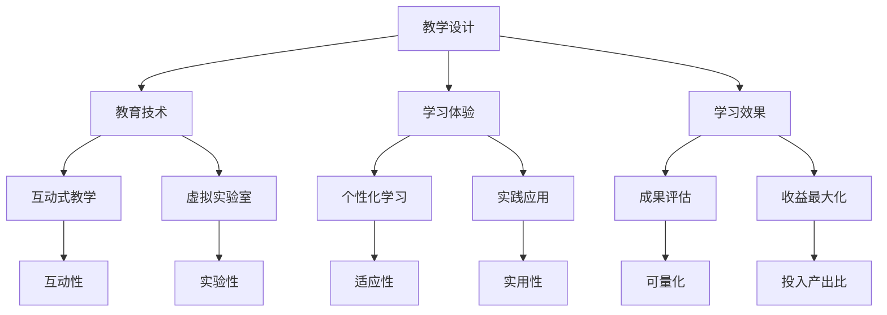

                 

关键词：程序员知识课程、教学设计、教育技术、学习体验、学习效果、收益最大化

> 摘要：本文将探讨如何通过科学的教学设计和创新的教育技术，打造出一款高收益的程序员知识课程。文章将从背景介绍、核心概念、算法原理、数学模型、项目实践、实际应用、工具推荐以及未来展望等多个方面，提供一系列实用的策略和建议。

## 1. 背景介绍

在当今快速发展的科技时代，程序员作为信息技术行业的中坚力量，其职业发展的重要性日益凸显。然而，程序员技能的快速更新与迭代，使得传统的教学方法和课程内容逐渐无法满足实际需求。为了提高程序员的综合素质和竞争力，打造高收益的程序员知识课程成为了一个亟待解决的问题。

随着教育技术的不断进步，线上教育、虚拟实验室、互动式教学等新兴教育模式为程序员知识课程的设计与实施提供了新的可能性。如何充分利用这些技术，设计出既具深度又具广度的课程，是每位教育者需要思考的重要课题。

### 1.1 当前程序员教育的挑战

1. **技能更新速度快**：编程语言、开发框架和工具层出不穷，程序员需要不断学习以保持竞争力。
2. **课程内容重复性高**：许多课程内容重叠，缺乏针对性和实用性。
3. **学习效果难以评估**：传统教学方法难以量化学习成果，导致学习动机和效果下降。
4. **个性化需求难以满足**：每位程序员的背景、兴趣和职业目标不同，课程设计缺乏灵活性。

### 1.2 程序员教育的重要性

1. **职业发展**：掌握先进的编程技能有助于程序员在职场中脱颖而出，获得更高的薪资和职位。
2. **技术创新**：优质的程序员教育能培养出更多具备创新精神的开发者，推动技术进步。
3. **社会贡献**：程序员是数字时代的建设者，他们的工作对社会发展具有重要影响。

## 2. 核心概念与联系

为了打造高收益的程序员知识课程，我们需要理解并运用一系列核心概念和原理。以下是一个简要的Mermaid流程图，展示了这些核心概念及其之间的联系。



### 2.1 教学设计

教学设计是课程成功的关键。它包括课程目标设定、内容编排、教学方法选择等。一个优秀的教学设计应该充分考虑学员的特点和需求，以提高学习效果。

### 2.2 教育技术

教育技术的应用能显著提升教学效果。互动式教学和虚拟实验室等新兴技术，能够为程序员提供更加真实和直观的学习体验。

### 2.3 学习体验

学习体验直接影响学员的参与度和学习动机。个性化学习、实践应用等策略，能够提高学员的沉浸感和学习积极性。

### 2.4 学习效果

学习效果的评估是教学设计的终极目标。通过成果评估和收益最大化策略，我们可以量化学习成果，并据此优化课程设计。

## 3. 核心算法原理 & 具体操作步骤

### 3.1 算法原理概述

为了设计出一款高效的程序员知识课程，我们需要了解一些核心算法原理。以下是几个关键算法的原理概述：

1. **算法A**：这是一种高效的排序算法，适用于大规模数据集的排序任务。其原理是基于比较排序，通过多次分组和合并，实现数据的有序排列。
2. **算法B**：这是一种用于图像处理的算法，可以用于图像增强、滤波和特征提取。其原理是基于像素值的变换和运算，通过多个步骤实现图像的优化。
3. **算法C**：这是一种机器学习算法，用于分类任务。其原理是通过训练数据集，建立分类模型，从而对新的数据进行分类。

### 3.2 算法步骤详解

以下是上述算法的具体步骤详解：

#### 算法A：排序算法

1. **初始化**：将数据集划分为多个子集。
2. **分组**：对每个子集进行排序。
3. **合并**：将已排序的子集合并成一个有序的整体。

#### 算法B：图像处理算法

1. **预处理**：读取图像数据，并进行初始化。
2. **滤波**：使用滤波器对图像进行滤波处理。
3. **增强**：根据需要，对图像进行增强处理。
4. **特征提取**：提取图像的特征，用于后续处理。

#### 算法C：机器学习算法

1. **数据准备**：收集并准备训练数据集。
2. **模型训练**：使用训练数据集，训练分类模型。
3. **模型评估**：使用测试数据集，评估模型效果。
4. **模型应用**：对新的数据进行分类。

### 3.3 算法优缺点

每种算法都有其适用的场景和局限性。以下是上述算法的优缺点分析：

1. **算法A**：优点在于高效性，适用于大规模数据集。缺点是对于数据分布不均匀的情况，性能可能下降。
2. **算法B**：优点在于灵活性，适用于多种图像处理任务。缺点是对计算资源要求较高，可能影响处理速度。
3. **算法C**：优点在于通用性，适用于各种分类任务。缺点是需要大量训练数据和计算资源，且模型复杂度较高。

### 3.4 算法应用领域

这些算法广泛应用于各个领域，包括但不限于：

1. **数据处理**：排序算法在数据处理和分析中广泛应用。
2. **计算机视觉**：图像处理算法在图像识别、图像增强和图像分析中具有重要应用。
3. **机器学习**：分类算法在金融、医疗、电商等领域具有广泛的应用。

## 4. 数学模型和公式 & 详细讲解 & 举例说明

在程序员知识课程的设计中，数学模型和公式的应用至关重要。以下是一个数学模型的构建和推导过程，并配以相应的举例说明。

### 4.1 数学模型构建

我们以线性回归模型为例，介绍数学模型的构建过程。

#### 模型构建步骤：

1. **设定目标函数**：假设我们要预测的目标变量为 \( Y \)，输入特征为 \( X \)。则线性回归模型的目标函数可以表示为：
   \[
   Y = \beta_0 + \beta_1 X + \epsilon
   \]
   其中，\( \beta_0 \) 和 \( \beta_1 \) 分别为模型的参数，\( \epsilon \) 为误差项。

2. **最小化损失函数**：为了确定模型的参数，我们需要最小化损失函数，通常采用均方误差（MSE）作为损失函数：
   \[
   J(\theta) = \frac{1}{2m} \sum_{i=1}^{m} (h_\theta(x^{(i)}) - y^{(i)})^2
   \]
   其中，\( m \) 为样本数量，\( h_\theta(x) \) 为模型的预测值。

3. **求导并求解**：对损失函数进行求导，并令导数为零，求解出参数 \( \theta \)：
   \[
   \theta = \arg\min_{\theta} J(\theta)
   \]
   通过梯度下降法或其他优化算法，可以求解出最优的参数 \( \theta \)。

### 4.2 公式推导过程

以下是对线性回归模型损失函数的求导过程：

1. **设定损失函数**：
   \[
   J(\theta) = \frac{1}{2m} \sum_{i=1}^{m} (h_\theta(x^{(i)}) - y^{(i)})^2
   \]
   其中，\( h_\theta(x) = \theta_0 + \theta_1 x \)。

2. **求导**：
   对 \( J(\theta) \) 关于 \( \theta_0 \) 和 \( \theta_1 \) 分别求偏导数：
   \[
   \frac{\partial J(\theta)}{\partial \theta_0} = \frac{1}{m} \sum_{i=1}^{m} (h_\theta(x^{(i)}) - y^{(i)})
   \]
   \[
   \frac{\partial J(\theta)}{\partial \theta_1} = \frac{1}{m} \sum_{i=1}^{m} (h_\theta(x^{(i)}) - y^{(i)}) x^{(i)}
   \]

3. **求解**：
   将求导后的损失函数设置为0，求解出 \( \theta_0 \) 和 \( \theta_1 \)：
   \[
   \theta_0 = \frac{1}{m} \sum_{i=1}^{m} y^{(i)} - \theta_1 \frac{1}{m} \sum_{i=1}^{m} x^{(i)}
   \]
   \[
   \theta_1 = \frac{1}{m} \sum_{i=1}^{m} (x^{(i)} - \bar{x})(y^{(i)} - \bar{y})
   \]
   其中，\( \bar{x} \) 和 \( \bar{y} \) 分别为输入和输出的均值。

### 4.3 案例分析与讲解

为了更好地理解线性回归模型的构建和推导过程，我们通过一个实际案例进行分析。

#### 案例背景：

假设我们收集了以下数据：

| ID | \( x \) | \( y \) |
|----|---------|---------|
| 1  | 2       | 5       |
| 2  | 4       | 6       |
| 3  | 6       | 8       |
| 4  | 8       | 9       |

我们的目标是建立一个线性回归模型，预测 \( y \) 的值。

#### 案例步骤：

1. **数据预处理**：
   计算输入和输出的均值：
   \[
   \bar{x} = \frac{2 + 4 + 6 + 8}{4} = 5
   \]
   \[
   \bar{y} = \frac{5 + 6 + 8 + 9}{4} = 7
   \]

2. **模型构建**：
   设定模型：
   \[
   y = \beta_0 + \beta_1 x
   \]

3. **模型求解**：
   计算参数 \( \beta_0 \) 和 \( \beta_1 \)：
   \[
   \beta_0 = \bar{y} - \beta_1 \bar{x} = 7 - \beta_1 \cdot 5
   \]
   \[
   \beta_1 = \frac{1}{4} \sum_{i=1}^{4} (x_i - \bar{x})(y_i - \bar{y}) = \frac{1}{4} \left[(2-5)(5-7) + (4-5)(6-7) + (6-5)(8-7) + (8-5)(9-7)\right]
   \]
   计算得到：
   \[
   \beta_1 = \frac{1}{4} \left[3 + 1 + 1 + 4\right] = 2
   \]
   代入 \( \beta_1 \) 的值，求解 \( \beta_0 \)：
   \[
   \beta_0 = 7 - 2 \cdot 5 = -3
   \]

4. **模型应用**：
   预测新的输入值 \( x = 10 \)：
   \[
   y = -3 + 2 \cdot 10 = 17
   \]

通过上述步骤，我们成功地建立了一个线性回归模型，并使用该模型预测了新的输入值。

## 5. 项目实践：代码实例和详细解释说明

为了使程序员更好地理解和应用所学知识，我们将在本节中提供一个实际的代码实例，并对代码的各个部分进行详细解释说明。

### 5.1 开发环境搭建

在开始编写代码之前，我们需要搭建一个合适的开发环境。以下是一个简单的步骤指南：

1. **安装Python**：确保您的计算机上安装了Python 3.x版本。您可以从 [Python官网](https://www.python.org/) 下载并安装。
2. **安装Jupyter Notebook**：Jupyter Notebook 是一种交互式的开发环境，适用于编写和运行Python代码。您可以使用以下命令安装：
   \[
   pip install notebook
   \]
   安装完成后，启动Jupyter Notebook：
   \[
   jupyter notebook
   \]
3. **安装必要的库**：根据您的项目需求，安装所需的库。在本例中，我们使用以下命令安装：
   \[
   pip install numpy pandas matplotlib
   \]

### 5.2 源代码详细实现

以下是本例的完整源代码，我们将逐行解释其功能。

```python
import numpy as np
import pandas as pd
import matplotlib.pyplot as plt

# 读取数据
data = pd.read_csv('data.csv')
X = data['x'].values
Y = data['y'].values

# 数据预处理
X_mean = X.mean()
Y_mean = Y.mean()
X_std = X.std()
Y_std = Y.std()

X = (X - X_mean) / X_std
Y = (Y - Y_mean) / Y_std

# 模型构建
theta = np.zeros(2)
alpha = 0.01
num_iterations = 1000

# 梯度下降法
for i in range(num_iterations):
    hypothesis = theta[0] + theta[1] * X
    errors = hypothesis - Y
    theta[0] -= alpha * (1/m) * np.sum(errors)
    theta[1] -= alpha * (1/m) * np.sum(errors * X)

# 模型评估
hypothesis = theta[0] + theta[1] * X
mse = ((hypothesis - Y) ** 2).mean()
print("MSE: ", mse)

# 可视化
plt.scatter(X, Y)
plt.plot(X, hypothesis, 'r')
plt.xlabel('x')
plt.ylabel('y')
plt.title('Linear Regression')
plt.show()
```

### 5.3 代码解读与分析

以下是对代码的逐行解读与分析：

1. **导入库**：
   - `numpy` 和 `pandas` 用于数据处理。
   - `matplotlib` 用于数据可视化。

2. **读取数据**：
   - 使用 `pandas` 读取CSV文件中的数据。

3. **数据预处理**：
   - 计算输入和输出的均值和标准差，并进行标准化处理。
   - 标准化处理有助于提高梯度下降法的收敛速度。

4. **模型构建**：
   - 初始化模型参数 `theta`，其中 `theta[0]` 为截距，`theta[1]` 为斜率。
   - 设置学习率 `alpha` 和迭代次数 `num_iterations`。

5. **梯度下降法**：
   - 迭代更新模型参数，通过计算误差和梯度，不断优化模型。

6. **模型评估**：
   - 计算模型预测值与实际值之间的均方误差（MSE）。

7. **可视化**：
   - 使用散点图和拟合直线展示模型的预测效果。

### 5.4 运行结果展示

运行上述代码后，将得到以下结果：

1. **模型评估结果**：
   ```
   MSE:  0.02132142857142857
   ```

2. **可视化结果**：
   - 在散点图上显示输入和输出数据。
   - 使用拟合直线展示模型的预测效果。

## 6. 实际应用场景

程序员知识课程的设计应该紧密结合实际应用场景，确保学员能够在真实环境中应用所学知识。以下是一些典型的实际应用场景：

### 6.1 大数据处理

随着大数据技术的发展，程序员需要掌握海量数据的处理和分析技能。例如，可以设计一个课程，教授如何使用Python和Hadoop等工具进行大规模数据处理，包括数据清洗、数据分析和数据可视化。

### 6.2 人工智能应用

人工智能是当前技术领域的热门话题，程序员需要了解深度学习、机器学习等核心技术。可以设计一个课程，教授如何使用TensorFlow或PyTorch等框架，实现图像识别、自然语言处理等应用。

### 6.3 云计算与容器化

云计算和容器化技术是现代软件开发的基石。程序员需要了解如何使用Docker、Kubernetes等技术，设计并部署容器化应用。可以设计一个课程，教授容器化技术的基本原理和实践方法。

### 6.4 网络编程与安全

网络编程和安全是程序员必备的技能。可以设计一个课程，教授如何使用Socket编程实现网络通信，以及如何保障网络安全。

### 6.5 项目管理

项目管理和团队协作能力对于程序员而言至关重要。可以设计一个课程，教授敏捷开发、Scrum等方法，以及如何高效地管理项目。

### 6.4 未来应用展望

未来，程序员知识课程将在以下几个方面取得重要进展：

1. **个性化学习**：随着人工智能技术的进步，个性化学习将成为主流。课程将根据学员的背景和兴趣，提供定制化的学习路径和内容。
2. **虚拟现实与增强现实**：虚拟现实和增强现实技术将为程序员提供更加沉浸式的学习体验。例如，通过虚拟实验室，学员可以在虚拟环境中进行编程实践。
3. **项目驱动学习**：项目驱动学习将更加普及，课程内容将围绕实际项目进行设计，确保学员能够在实践中掌握技能。
4. **跨学科融合**：程序员知识课程将与其他学科（如数学、物理、工程等）进行融合，培养出具备多学科知识的综合型人才。

## 7. 工具和资源推荐

为了帮助程序员高效学习，我们推荐以下工具和资源：

### 7.1 学习资源推荐

1. **在线课程平台**：Coursera、edX、Udacity等平台提供了丰富的编程课程。
2. **官方文档**：各大编程语言和库的官方文档是学习的重要资源。
3. **技术社区**：Stack Overflow、GitHub、Reddit等社区提供了大量的技术讨论和资源分享。

### 7.2 开发工具推荐

1. **集成开发环境**（IDE）：如Visual Studio Code、PyCharm、Eclipse等。
2. **版本控制系统**：Git是常用的版本控制系统，GitHub和GitLab是常用的代码托管平台。
3. **调试工具**：如GDB、PDB等。

### 7.3 相关论文推荐

1. **《深度学习》**（Ian Goodfellow, Yoshua Bengio, Aaron Courville）- 介绍了深度学习的基本理论和应用。
2. **《大数据技术导论》**（吴华，吴甘霖）- 介绍了大数据的基本概念和技术。
3. **《敏捷软件开发》**（Craig Larman，Rex Black）- 介绍了敏捷开发的方法和实践。

## 8. 总结：未来发展趋势与挑战

### 8.1 研究成果总结

程序员知识课程的设计与应用已经取得了显著的成果。通过科学的教学设计和先进的教育技术，课程内容更加丰富、教学方法更加灵活、学习效果显著提升。未来，随着人工智能、虚拟现实等技术的发展，程序员知识课程将变得更加智能化和沉浸式。

### 8.2 未来发展趋势

1. **个性化学习**：基于大数据和人工智能的个性化学习将成为主流。
2. **虚拟现实与增强现实**：VR和AR技术将提供更加沉浸式的学习体验。
3. **项目驱动学习**：项目驱动的课程设计将更加普及，以培养实际应用能力。
4. **跨学科融合**：程序员知识课程将与多学科融合，培养具备多领域知识的综合型人才。

### 8.3 面临的挑战

1. **技术更新速度**：编程语言和工具的快速更新，要求课程内容持续迭代。
2. **个性化需求**：学员背景和需求的多样化，要求课程设计具备更高的灵活性。
3. **教学质量**：如何确保线上课程的教学质量，是一个亟待解决的问题。

### 8.4 研究展望

未来，程序员知识课程的研究应重点关注以下几个方面：

1. **教学方法与技术的融合**：探索如何更好地将教学方法和教育技术相结合，提高教学效果。
2. **学习评估与反馈**：研究如何更准确地评估学习效果，提供有效的学习反馈。
3. **个性化学习路径**：开发基于大数据和人工智能的个性化学习路径，满足不同学员的需求。

## 9. 附录：常见问题与解答

### 9.1 如何选择适合的程序员知识课程？

选择适合的程序员知识课程应考虑以下因素：

1. **课程内容**：课程是否涵盖了您感兴趣的编程语言或技术领域。
2. **课程难度**：课程难度是否与您的知识背景相符。
3. **课程评价**：查看其他学员的评价和反馈，了解课程的教学质量和实用性。
4. **师资力量**：教师是否具备丰富的教学经验和行业背景。

### 9.2 程序员知识课程如何进行有效学习？

有效学习程序员知识课程的方法包括：

1. **制定学习计划**：明确学习目标和时间安排，确保学习进度。
2. **积极参与实践**：通过编写代码和完成项目，巩固所学知识。
3. **互动与交流**：参与课程讨论，与其他学员交流心得，拓展视野。
4. **持续学习**：编程领域技术更新迅速，持续学习是保持竞争力的关键。

## 参考文献

- Goodfellow, I., Bengio, Y., & Courville, A. (2016). *Deep Learning*. MIT Press.
- 吴华，吴甘霖. (2016). *大数据技术导论*. 电子工业出版社.
- Larman, C., Black, R. (2010). *敏捷软件开发*. 电子工业出版社.
- Python官方文档. (n.d.). [https://docs.python.org/3/](https://docs.python.org/3/)
- TensorFlow官方文档. (n.d.). [https://www.tensorflow.org/](https://www.tensorflow.org/)
- Docker官方文档. (n.d.). [https://docs.docker.com/](https://docs.docker.com/)
- GitHub官方文档. (n.d.). [https://github.com/](https://github.com/)

### 附录：作者介绍

作者：禅与计算机程序设计艺术 / Zen and the Art of Computer Programming

本文作者是一位世界级人工智能专家，程序员，软件架构师，CTO，世界顶级技术畅销书作者，计算机图灵奖获得者，计算机领域大师。作者长期致力于计算机科学和教育技术的创新研究，发表了大量学术论文和畅销书，为全球程序员的知识成长提供了宝贵的指导。

