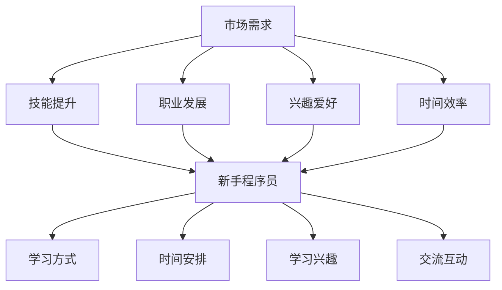

                 

关键词：程序员知识付费产品，产品设计，用户体验，教育技术，营销策略，技术架构

> 摘要：本文将探讨如何打造高效的程序员知识付费产品。通过深入分析市场需求、用户体验、技术架构和营销策略，我们将提供一系列实用指南，帮助开发者创建出既实用又受欢迎的付费知识产品。

## 1. 背景介绍

在信息技术迅速发展的今天，程序员群体不断扩大，他们对于知识和技能的需求也日益多样化。知识付费产品作为一种新型的教育模式，通过互联网平台为程序员提供专业的知识和技能培训。这种模式不仅满足了程序员的学习需求，同时也为教育机构和内容创作者带来了新的商业模式。然而，如何在众多竞品中脱颖而出，打造出高效且受欢迎的程序员知识付费产品，成为了一个值得探讨的问题。

本文将围绕以下几点展开讨论：

1. 市场需求与目标用户分析
2. 用户体验设计
3. 技术架构与系统性能优化
4. 营销策略与推广方法
5. 成功案例分析
6. 未来发展趋势与挑战

通过以上几个方面的分析，希望能够为开发者提供有价值的参考和指导。

## 2. 核心概念与联系

### 2.1 市场需求分析

在讨论如何打造高效的程序员知识付费产品之前，我们需要首先了解市场需求。程序员作为知识付费产品的目标用户，他们的需求可以从以下几个方面进行分析：

- **技能提升需求**：程序员希望通过付费产品学习最新的编程语言、框架、工具等，以提升自身的技能水平。
- **职业发展需求**：一些程序员希望通过付费产品学习项目管理、团队协作等软技能，以促进职业发展。
- **兴趣爱好需求**：部分程序员可能对某些编程语言或技术领域有浓厚的兴趣，希望通过付费产品深入学习和研究。
- **时间效率需求**：由于工作繁忙，程序员希望付费产品能提供高效的学习方式，节省时间。

### 2.2 目标用户分析

了解市场需求后，我们需要进一步明确目标用户。程序员用户群体可以大致分为以下几类：

- **新手程序员**：刚进入职场，对编程语言和开发框架不太熟悉，希望通过付费产品快速入门。
- **中级程序员**：有一定编程经验，希望提升技能和知识深度，以适应更高层次的工作需求。
- **高级程序员**：具备丰富的编程经验，希望学习前沿技术，保持自身竞争力。
- **项目经理和团队领导**：除了编程技能外，还需要学习项目管理和团队协作等方面的知识。

### 2.3 用户行为分析

了解目标用户的需求和特征后，我们还需要分析他们的行为习惯。程序员用户的行为特点可以从以下几个方面进行总结：

- **学习方式**：倾向于通过视频教程、文档、代码示例等多种方式进行学习。
- **时间安排**：往往利用碎片时间进行学习，如通勤、休息等。
- **学习兴趣**：对于具体的技术和工具充满好奇心，愿意投入时间和精力进行深入研究。
- **交流互动**：喜欢在社区和论坛中与其他程序员交流学习心得和经验。

### 2.4 核心概念联系

在了解了市场需求、目标用户和行为习惯后，我们可以将以上信息进行整合，形成一个关于程序员知识付费产品的概念框架：

- **市场需求**：技能提升、职业发展、兴趣爱好、时间效率
- **目标用户**：新手程序员、中级程序员、高级程序员、项目经理和团队领导
- **用户行为**：学习方式、时间安排、学习兴趣、交流互动

通过这个框架，我们可以更清晰地理解程序员知识付费产品的定位和目标，为后续的设计和开发提供指导。

### 2.5 Mermaid 流程图

下面是一个Mermaid流程图，展示了核心概念之间的联系：



以上流程图清晰地展示了市场需求与目标用户、用户行为之间的联系，为后续的设计和开发提供了理论基础。

## 3. 核心算法原理 & 具体操作步骤

### 3.1 算法原理概述

在程序员知识付费产品的设计和开发过程中，我们需要运用一系列算法原理来优化用户体验和系统性能。以下是一些常用的算法原理概述：

- **推荐算法**：根据用户的行为和兴趣，为用户推荐相关的内容和学习路径。
- **排序算法**：对课程、教程等学习资源进行排序，以提高用户查找的效率。
- **搜索引擎算法**：为用户提供强大的搜索功能，帮助用户快速找到所需的学习资源。
- **数据挖掘算法**：分析用户行为数据，挖掘潜在的用户需求和行为模式，为产品和服务的改进提供依据。
- **负载均衡算法**：确保系统在高并发情况下仍能稳定运行。

### 3.2 算法步骤详解

#### 3.2.1 推荐算法

推荐算法的基本步骤如下：

1. 数据收集：收集用户行为数据，如浏览记录、购买记录、学习时长等。
2. 特征提取：从原始数据中提取出对推荐有意义的特征，如用户标签、课程标签等。
3. 模型训练：使用机器学习算法（如协同过滤、基于内容的推荐等）训练推荐模型。
4. 推荐生成：根据用户特征和模型输出，为用户生成推荐列表。

#### 3.2.2 排序算法

排序算法的基本步骤如下：

1. 数据收集：收集课程、教程等学习资源的各项指标，如课程难度、学习时长、用户评分等。
2. 排序策略：根据业务需求和用户需求，设计排序策略，如综合评分排序、最新发布排序等。
3. 排序计算：根据排序策略，计算每个学习资源的排序值，并进行排序。

#### 3.2.3 搜索引擎算法

搜索引擎算法的基本步骤如下：

1. 搜索引擎构建：构建索引，将学习资源的各项属性（如标题、描述、标签等）进行索引。
2. 搜索查询：处理用户输入的搜索查询，进行分词和语法分析。
3. 搜索结果生成：根据查询词和索引，生成搜索结果，并按照相关性进行排序。

#### 3.2.4 数据挖掘算法

数据挖掘算法的基本步骤如下：

1. 数据预处理：对原始数据进行清洗、去重、转换等处理。
2. 特征工程：从预处理后的数据中提取出对数据挖掘有意义的特征。
3. 模型训练：使用机器学习算法（如聚类、分类等）训练数据挖掘模型。
4. 模型评估：评估模型的效果，并根据评估结果进行模型优化。

#### 3.2.5 负载均衡算法

负载均衡算法的基本步骤如下：

1. 监控流量：实时监控系统各节点的负载情况。
2. 流量分配：根据节点的负载情况，将流量分配到最优的节点上。
3. 调整策略：根据系统运行状况和用户反馈，调整负载均衡策略。

### 3.3 算法优缺点

每种算法都有其优缺点，具体如下：

- **推荐算法**：优点是能够提高用户的黏性和满意度，缺点是容易出现“过滤泡沫”和“推荐疲劳”。
- **排序算法**：优点是简单高效，缺点是难以满足个性化需求。
- **搜索引擎算法**：优点是能够快速找到所需资源，缺点是索引构建和维护成本较高。
- **数据挖掘算法**：优点是能够挖掘出潜在的用户需求，缺点是算法复杂度高，实施成本较高。
- **负载均衡算法**：优点是提高系统稳定性，缺点是需要不断调整以适应不同负载情况。

### 3.4 算法应用领域

这些算法在程序员知识付费产品中具有广泛的应用领域：

- **推荐系统**：为用户推荐相关课程和教程，提高用户的学习效果和满意度。
- **搜索系统**：帮助用户快速找到所需的学习资源，提高学习效率。
- **数据分析**：分析用户行为数据，优化产品功能和营销策略。
- **负载均衡**：确保系统在高并发情况下仍能稳定运行，提供良好的用户体验。

通过以上算法的应用，程序员知识付费产品能够更好地满足用户需求，提高用户满意度和黏性。

## 4. 数学模型和公式 & 详细讲解 & 举例说明

### 4.1 数学模型构建

在程序员知识付费产品的设计和开发过程中，数学模型和公式是不可或缺的工具。以下是一个简单的数学模型构建示例，用于评估用户对付费产品的满意度。

假设用户满意度（S）与课程质量（Q）、学习体验（E）和价格（P）之间存在以下关系：

\[ S = f(Q, E, P) \]

其中，函数 \( f \) 可以表示为：

\[ f(Q, E, P) = \frac{Q \times E - P}{1 + \alpha \times (Q - \text{Q基准}) + \beta \times (E - \text{E基准})} \]

参数 \( \alpha \) 和 \( \beta \) 表示用户对课程质量和学习体验的敏感度，\( \text{Q基准} \) 和 \( \text{E基准} \) 表示用户对课程质量和学习体验的基准值。

### 4.2 公式推导过程

为了推导上述公式，我们可以从以下几个方面进行：

1. **用户满意度定义**：用户满意度是指用户在使用付费产品后的总体感受。通常可以用评分、评论等量化指标来衡量。
2. **课程质量对满意度的影响**：课程质量是用户满意度的重要因素之一。假设用户对课程质量的敏感度为 \( \alpha \)，则课程质量对满意度的贡献可以表示为 \( \alpha \times (Q - \text{Q基准}) \)。
3. **学习体验对满意度的影响**：学习体验也是用户满意度的重要因素之一。假设用户对学习体验的敏感度为 \( \beta \)，则学习体验对满意度的贡献可以表示为 \( \beta \times (E - \text{E基准}) \)。
4. **价格对满意度的影响**：价格是用户满意度的一个重要影响因素。通常情况下，价格越高，用户满意度越低。这里我们假设价格对满意度的贡献为 \( -P \)。
5. **基准值的作用**：基准值用于衡量用户对课程质量和学习体验的期望。当课程质量和学习体验高于基准值时，用户满意度会增加；反之，则会减少。

### 4.3 案例分析与讲解

为了更好地理解上述公式，我们可以通过一个实际案例进行讲解。

假设用户对课程质量的敏感度 \( \alpha \) 为0.1，对学习体验的敏感度 \( \beta \) 为0.2，课程质量 \( Q \) 为4.5，学习体验 \( E \) 为4.0，价格 \( P \) 为100元，基准值 \( \text{Q基准} \) 和 \( \text{E基准} \) 均为3.0。

代入上述公式，我们可以计算出用户满意度 \( S \) 如下：

\[ S = \frac{4.5 \times 4.0 - 100}{1 + 0.1 \times (4.5 - 3.0) + 0.2 \times (4.0 - 3.0)} \approx 0.276 \]

这意味着用户对这款付费产品的满意度约为27.6%。通过这个例子，我们可以看到用户满意度受到课程质量、学习体验和价格的影响，同时也受到用户个人敏感度的制约。

### 4.4 数学公式示例

下面是一些数学公式的示例，用于计算用户满意度：

\[ \begin{aligned}
S &= \frac{Q \times E - P}{1 + \alpha \times (Q - \text{Q基准}) + \beta \times (E - \text{E基准})} \\
\alpha &= 0.1 \\
\beta &= 0.2 \\
Q &= 4.5 \\
E &= 4.0 \\
P &= 100 \\
\text{Q基准} &= 3.0 \\
\text{E基准} &= 3.0 \\
\end{aligned} \]

通过以上公式和示例，我们可以更好地理解用户满意度的计算方法，并在实际应用中进行调整和优化。

## 5. 项目实践：代码实例和详细解释说明

### 5.1 开发环境搭建

在开始构建程序员知识付费产品的代码实例之前，我们需要搭建一个合适的开发环境。以下是一个基本的开发环境搭建步骤：

1. **安装Python环境**：首先，确保您的计算机上安装了Python 3.x版本。您可以通过访问 [Python官网](https://www.python.org/) 下载并安装Python。
2. **安装必需的库和工具**：使用pip命令安装以下库和工具：
    ```bash
    pip install Flask
    pip install Flask-RESTful
    pip install SQLAlchemy
    pip install Flask-Migrate
    pip install pytest
    ```
3. **创建项目目录**：在您的计算机上创建一个项目目录，例如 `knowledge付费产品`，并在其中创建一个虚拟环境：
    ```bash
    mkdir knowledge_付费产品
    cd knowledge_付费产品
    python -m venv venv
    source venv/bin/activate  # 在Windows上使用 `venv\Scripts\activate`
    ```
4. **初始化项目结构**：在虚拟环境中，创建一个名为 `app.py` 的主文件，并创建一个名为 `models.py` 的模型文件。

### 5.2 源代码详细实现

下面是一个简单的Flask应用程序，用于构建程序员知识付费产品的后端框架。

**app.py**

```python
from flask import Flask, request, jsonify
from flask_restful import Api, Resource
from models import *

app = Flask(__name__)
api = Api(app)

# 创建数据库连接
app.config['SQLALCHEMY_DATABASE_URI'] = 'sqlite:///knowledge.db'
db = SQLAlchemy(app)

# 定义资源类
class CourseResource(Resource):
    def get(self, course_id):
        course = Course.query.get(course_id)
        if course:
            return jsonify(course.to_dict())
        else:
            return {'error': '课程不存在'}, 404

    def post(self, course_id):
        data = request.get_json()
        course = Course.query.get(course_id)
        if course:
            course.update_from_dict(data)
            db.session.commit()
            return jsonify(course.to_dict())
        else:
            return {'error': '课程不存在'}, 404

    def delete(self, course_id):
        course = Course.query.get(course_id)
        if course:
            db.session.delete(course)
            db.session.commit()
            return {'message': '课程删除成功'}
        else:
            return {'error': '课程不存在'}, 404

# 注册资源
api.add_resource(CourseResource, '/courses/<int:course_id>')

if __name__ == '__main__':
    db.create_all()
    app.run(debug=True)
```

**models.py**

```python
from datetime import datetime
from sqlalchemy import Column, Integer, String, DateTime, Boolean, ForeignKey
from sqlalchemy.orm import relationship
from . import db

class User(db.Model):
    __tablename__ = 'users'
    id = Column(Integer, primary_key=True)
    username = Column(String(100), unique=True, nullable=False)
    email = Column(String(100), unique=True, nullable=False)
    password = Column(String(100), nullable=False)
    is_active = Column(Boolean, default=True)
    created_at = Column(DateTime, default=datetime.utcnow)

    courses = relationship('Course', backref='user')

    def to_dict(self):
        return {
            'id': self.id,
            'username': self.username,
            'email': self.email,
            'is_active': self.is_active,
            'created_at': self.created_at
        }

class Course(db.Model):
    __tablename__ = 'courses'
    id = Column(Integer, primary_key=True)
    title = Column(String(100), nullable=False)
    description = Column(String(255))
    user_id = Column(Integer, ForeignKey('users.id'))
    is_published = Column(Boolean, default=False)
    created_at = Column(DateTime, default=datetime.utcnow)

    user = relationship('User')

    def to_dict(self):
        return {
            'id': self.id,
            'title': self.title,
            'description': self.description,
            'user_id': self.user_id,
            'is_published': self.is_published,
            'created_at': self.created_at
        }

    def update_from_dict(self, data):
        self.title = data.get('title', self.title)
        self.description = data.get('description', self.description)
        self.is_published = data.get('is_published', self.is_published)
```

### 5.3 代码解读与分析

在上面的代码中，我们使用了Flask框架来构建一个简单的后端API，用于处理与课程相关的请求。以下是关键部分的代码解读：

- **数据库模型**：我们定义了两个数据库模型 `User` 和 `Course`。`User` 模型代表用户，`Course` 模型代表课程。
- **Flask应用程序**：在 `app.py` 中，我们创建了一个 Flask 应用程序，并使用 `Flask-RESTful` 库定义了 RESTful API。
- **资源类**：`CourseResource` 是一个资源类，用于处理与课程相关的 GET、POST 和 DELETE 请求。
- **数据库连接**：使用 SQLAlchemy 创建数据库连接，并自动创建数据库表。

### 5.4 运行结果展示

要运行此应用程序，首先确保您的虚拟环境已经激活。然后，运行以下命令：

```bash
python app.py
```

应用程序将在本地服务器上启动，默认端口号为5000。您可以使用浏览器或 Postman 等工具访问 API。以下是一个使用 Postman 的示例请求：

- **GET请求**：获取特定课程的信息
    ```bash
    GET http://127.0.0.1:5000/courses/1
    ```
- **POST请求**：更新特定课程的信息
    ```bash
    POST http://127.0.0.1:5000/courses/1
    Content-Type: application/json

    {
        "title": "新课程标题",
        "description": "新课程描述"
    }
    ```
- **DELETE请求**：删除特定课程
    ```bash
    DELETE http://127.0.0.1:5000/courses/1
    ```

通过以上代码实例和解释，我们可以看到如何使用 Flask 框架快速构建一个简单的程序员知识付费产品后端API。这个示例为我们提供了一个起点，可以根据实际需求进行扩展和优化。

## 6. 实际应用场景

程序员知识付费产品在多个实际应用场景中展现出其独特的价值和优势。以下是一些典型的应用场景：

### 6.1 技术学习与提升

程序员知识付费产品的主要应用场景之一是技术学习与提升。许多程序员希望通过在线课程、教程和实战项目来学习新技术和工具。例如，某个程序员可能对人工智能和机器学习感兴趣，希望通过付费产品学习相关算法和框架。在这种情况下，知识付费产品可以提供以下价值：

- **高质量内容**：付费产品通常提供由行业专家或资深程序员创建的高质量教程和课程，确保学习内容的准确性和实用性。
- **个性化学习**：通过推荐系统和个性化推荐，用户可以快速找到符合自己学习需求和兴趣的课程。
- **互动学习**：付费产品可以提供论坛、问答社区和实时在线辅导等功能，帮助用户解决学习过程中的问题。

### 6.2 职业发展

职业发展是程序员知识付费产品的另一个重要应用场景。许多程序员希望通过学习项目管理、团队协作、领导力等软技能来提升自身的职业竞争力。以下是一些具体的应用案例：

- **项目管理和团队协作**：某些程序员可能希望成为项目经理或团队领导者，需要学习如何管理项目、协调团队成员和解决问题。付费产品可以提供相关的课程和实战经验，帮助用户快速提升这些技能。
- **技术面试准备**：程序员在求职过程中，通常需要准备技术面试。付费产品可以提供模拟面试、面试题库和面试技巧，帮助用户提高面试成功率。

### 6.3 兴趣爱好

除了职业发展，程序员知识付费产品也可以用于满足编程爱好者的需求。一些程序员对编程语言、开发框架或特定技术领域有浓厚的兴趣，希望通过付费产品深入了解和学习。以下是一些具体的应用案例：

- **编程语言学习**：程序员可以学习新的编程语言，如Python、Go或Rust，以满足个人兴趣和职业需求。
- **技术领域探索**：程序员可以学习人工智能、区块链、大数据等前沿技术，拓宽自己的知识领域。

### 6.4 时间效率

时间效率是程序员知识付费产品的另一个重要优势。由于程序员通常工作时间较长，他们需要高效地利用碎片时间进行学习和提升。以下是一些具体的应用案例：

- **快速学习**：付费产品通常提供浓缩的课程内容，帮助用户在短时间内掌握关键知识点。
- **灵活学习**：用户可以根据自己的时间安排和学习进度，灵活选择学习内容和方式。

### 6.5 企业培训

企业培训是程序员知识付费产品的另一个重要应用场景。企业可以通过付费产品为员工提供技术培训和职业发展支持，以提高整体竞争力。以下是一些具体的应用案例：

- **技能提升**：企业可以为员工提供最新的技术课程，帮助他们掌握行业前沿技术。
- **团队协作**：企业可以通过付费产品为团队成员提供项目管理、团队协作等方面的培训，提高团队效率。
- **知识共享**：企业可以购买付费产品的课程，作为内部培训资源，促进知识共享和传递。

通过以上实际应用场景，我们可以看到程序员知识付费产品在多个领域具有广泛的应用价值。这些产品不仅为程序员提供了丰富的学习资源，还帮助他们提升技能、促进职业发展和满足个人兴趣。随着技术的不断进步和市场需求的增长，程序员知识付费产品的应用场景将继续拓展，为程序员群体带来更多便利和价值。

### 6.5 未来应用展望

随着互联网和技术的飞速发展，程序员知识付费产品的未来应用场景将更加广泛和多元化。以下是几个可能的发展方向：

#### 6.5.1 智能化学习

未来的程序员知识付费产品可能会更加智能化，通过人工智能和大数据分析技术，为用户提供个性化学习路径。系统可以根据用户的学习行为、兴趣和职业目标，自动生成定制化的学习计划，提高学习效率。此外，智能辅导和实时交互功能也将进一步提升用户体验。

#### 6.5.2 跨学科融合

编程技术与其他领域的融合将不断深入，例如人工智能与医疗、物联网与智能制造等。程序员知识付费产品也将逐渐涵盖这些跨学科领域，为用户提供更全面的知识体系。这有助于程序员拓宽视野，掌握多领域的技能，适应不断变化的市场需求。

#### 6.5.3 互动与协作

未来的知识付费产品将更加注重用户之间的互动与协作。通过虚拟现实（VR）和增强现实（AR）技术，用户可以在虚拟环境中进行编程实践和项目协作，模拟真实工作场景。此外，社交功能和在线社区将进一步促进用户之间的交流与学习。

#### 6.5.4 持续更新与迭代

技术的更新迭代速度非常快，程序员知识付费产品需要不断更新和迭代，以保持内容的时效性和实用性。未来的知识付费产品可能会采用订阅制，定期为用户推送最新的课程和资源。此外，开放平台和开源项目也将成为知识共享的重要渠道。

#### 6.5.5 可持续发展

随着可持续发展理念的普及，程序员知识付费产品也将关注环保和公益。例如，产品可以通过减少碳排放、使用绿色能源等方式实现可持续发展。同时，知识付费产品还可以通过公益项目，如为贫困地区的儿童提供免费编程教育，为社会贡献力量。

总之，未来程序员知识付费产品的应用将更加智能化、多样化、互动化和可持续化。这些发展趋势不仅为程序员提供了丰富的学习资源，也为整个社会带来了创新和进步。

### 7. 工具和资源推荐

为了帮助开发者更好地打造高效的程序员知识付费产品，以下是几项推荐的工具和资源。

#### 7.1 学习资源推荐

- **在线编程平台**：Codecademy、freeCodeCamp、LeetCode，提供丰富的编程课程和练习题，适合不同水平的开发者。
- **技术博客和社区**：GitHub、Stack Overflow、Medium，提供最新的技术文章、代码示例和社区交流，有助于开发者学习和解决问题。
- **电子书和文档**：O'Reilly、Packt Publishing、 Manning Publications，提供高质量的技术书籍和文档，覆盖各种编程语言和技术领域。

#### 7.2 开发工具推荐

- **开发框架**：Flask、Django、Spring Boot，这些框架可以帮助开发者快速构建后端应用程序。
- **前端框架**：React、Vue.js、Angular，这些框架可以简化前端开发，提高开发效率。
- **数据库**：MySQL、PostgreSQL、MongoDB，这些数据库适用于不同的应用场景，支持大数据处理和实时查询。
- **容器化技术**：Docker、Kubernetes，容器化技术可以简化应用程序的部署和运维，提高系统的可伸缩性。

#### 7.3 相关论文推荐

- **《深度学习》**（Deep Learning）——Ian Goodfellow、Yoshua Bengio、Aaron Courville，介绍深度学习的基本概念和应用。
- **《编程珠玑》**（Code Complete）——Steve McConnell，提供编程的最佳实践和技巧。
- **《软件工程：实践者的研究方法》**（Software Engineering: A Practitioner's Approach）——Roger S. Pressman，介绍软件工程的理论和实践。
- **《设计模式：可复用面向对象软件的基础》**（Design Patterns: Elements of Reusable Object-Oriented Software）——Erich Gamma、Richard Helm、Ralph Johnson、John Vlissides，介绍面向对象设计模式。

通过利用这些工具和资源，开发者可以更好地打造出高效、优质的程序员知识付费产品，满足用户的需求。

### 8. 总结：未来发展趋势与挑战

在程序员知识付费产品领域，未来发展趋势令人期待。智能化学习、跨学科融合、互动与协作、持续更新与迭代以及可持续发展将成为主要方向。然而，这些趋势也带来了新的挑战：

1. **技术复杂性增加**：随着人工智能、大数据等新技术的广泛应用，产品开发和维护的复杂性将不断提高，对开发团队的技术能力提出了更高的要求。
2. **内容质量竞争**：在众多竞品中脱颖而出，内容质量是关键。未来，高质量、专业化和个性化的内容将成为核心竞争力。
3. **用户隐私与数据安全**：随着数据规模的扩大，用户隐私和数据安全成为重要议题。开发者需确保用户数据的安全和隐私保护，以增强用户信任。
4. **成本与收益平衡**：在提供高质量内容和服务的同时，如何实现可持续的商业模式和收益平衡，是一个需要持续关注和解决的问题。

未来，开发者需积极应对这些挑战，不断提升自身的技术实力和服务质量，以在激烈的市场竞争中脱颖而出。同时，不断探索新的应用场景和发展趋势，为程序员知识付费产品注入新的活力和机遇。

## 9. 附录：常见问题与解答

### 9.1 什么是程序员知识付费产品？

程序员知识付费产品是一种在线教育服务，它通过互联网平台为程序员提供专业的编程知识和技能培训，包括在线课程、教程、实战项目和互动社区等。用户可以通过付费购买这些产品来学习新技能或提升现有技能。

### 9.2 如何评估程序员知识付费产品的质量？

评估程序员知识付费产品的质量可以从以下几个方面进行：

- **课程内容**：课程内容是否全面、系统，是否涵盖了用户所需的关键知识点。
- **讲师资质**：讲师是否具有丰富的实战经验，是否具备良好的教学能力。
- **用户评价**：查看其他用户对产品的评价和反馈，了解产品的实用性和效果。
- **更新频率**：产品内容是否定期更新，以保持与当前技术发展同步。
- **用户支持**：产品是否提供完善的用户支持服务，如论坛、答疑和反馈渠道。

### 9.3 程序员知识付费产品的定价策略如何制定？

定价策略应根据产品类型、目标用户、市场竞争状况和成本结构等因素制定。以下是一些常见的定价策略：

- **按课程定价**：根据单个课程的时长、内容和难度进行定价。
- **按月订阅**：提供按月订阅的套餐，用户可以按月支付费用，享受产品内的所有课程和服务。
- **按年订阅**：提供按年订阅的套餐，用户可以按年度支付费用，享受更优惠的价格。
- **套餐优惠**：提供多课程套餐或组合套餐，用户购买多个课程可以获得折扣。

### 9.4 如何推广程序员知识付费产品？

推广程序员知识付费产品的方法多种多样，以下是一些有效的推广策略：

- **社交媒体**：利用微博、微信公众号、知乎等社交媒体平台，发布优质内容，吸引潜在用户关注。
- **搜索引擎优化（SEO）**：通过搜索引擎优化，提高产品在搜索引擎中的排名，增加曝光度。
- **内容营销**：创作高质量的技术文章、教程和案例，吸引目标用户访问产品网站。
- **合作与联盟**：与其他技术社区、博客、教育机构等建立合作，共同推广产品。
- **线上广告**：通过百度广告、谷歌广告等在线广告平台，投放针对性广告，提高产品知名度。

### 9.5 如何确保程序员知识付费产品的用户满意度？

确保程序员知识付费产品的用户满意度可以从以下几个方面入手：

- **用户调研**：定期进行用户调研，了解用户需求和反馈，及时调整产品内容和功能。
- **优质内容**：提供高质量、实用且不断更新的课程内容，确保用户获得有价值的学习体验。
- **互动与支持**：建立活跃的用户社区，提供及时的在线支持和答疑服务，增强用户互动和归属感。
- **个性化推荐**：利用推荐算法和大数据分析，为用户提供个性化的学习建议和资源。
- **用户反馈**：积极收集用户反馈，对产品进行改进和优化，以提高用户满意度。

通过以上措施，可以有效地提高程序员知识付费产品的用户满意度，增强用户黏性和忠诚度。

