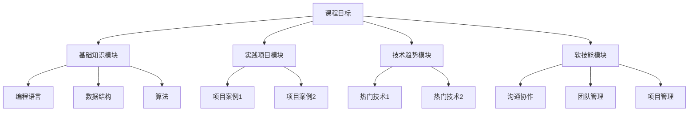

                 

在当今快速发展的技术时代，程序员的知识课程设计显得尤为重要。有效的课程设计不仅能够提升程序员的专业技能，还能够培养他们的解决问题的能力和创新思维。本文将深入探讨如何打造高效的程序员知识课程，包括课程目标、核心内容、教学方法以及评估方式等多个方面。

## 文章关键词

- 程序员知识课程
- 教学方法
- 课程设计
- 学习效果
- 技术创新

## 文章摘要

本文将介绍如何设计并实施一个高效的程序员知识课程。文章首先探讨了课程设计的目标和原则，然后分析了课程的核心内容，接着讨论了教学方法和评估方式，并最后提出了未来课程发展的一些展望。通过本文的探讨，希望能为程序员教育的实践者提供一些有益的参考。

## 1. 背景介绍

程序员是现代社会不可或缺的职业，他们不仅需要掌握丰富的编程语言和工具，还需要具备解决复杂问题的能力。然而，现实中很多程序员在职业生涯中常常感到知识匮乏或技能不足。这促使我们思考如何通过有效的知识课程来提升程序员的专业技能。

当前，程序员教育面临着一些挑战。首先，技术的更新速度非常快，课程内容需要不断更新以跟上最新的技术趋势。其次，程序员的学习方式趋向多样化，除了传统的课堂学习，在线学习、实践项目等也越来越受欢迎。此外，不同背景和学习习惯的程序员对课程的需求也不尽相同。因此，如何设计一个既能满足不同学习需求，又能适应快速变化的技术环境的知识课程，成为了一个亟待解决的问题。

## 2. 核心概念与联系

为了打造高效的程序员知识课程，我们首先需要明确一些核心概念和它们之间的联系。

### 2.1 教学目标

教学目标是指课程希望达到的具体结果。对于程序员知识课程，教学目标可以包括以下几个方面：

- **基础知识掌握**：确保程序员掌握编程语言的基本语法和概念，如数据结构、算法等。
- **实践能力培养**：通过实际项目或案例，提升程序员的编码和调试能力。
- **问题解决能力**：培养程序员在面对复杂问题时，能够运用所学知识进行分析和解决。
- **创新能力**：激发程序员的创新思维，鼓励他们尝试新的解决方案。

### 2.2 课程架构

课程架构是指课程的总体设计和结构。一个高效的程序员知识课程通常包括以下几个模块：

- **基础知识模块**：包括编程语言、数据结构、算法等基本概念和技能。
- **实践项目模块**：通过实际项目，将理论知识应用于实践，提高编程能力。
- **技术趋势模块**：介绍当前热门技术和未来发展趋势，帮助程序员保持技术前沿。
- **软技能模块**：如沟通协作、团队管理、项目管理等，提升程序员的综合素质。

### 2.3 教学方法

教学方法是指教师在教学过程中采用的方法和策略。对于程序员知识课程，以下几种教学方法是值得推荐的：

- **案例教学法**：通过真实的案例，让学员在实践中学习，加深对知识的理解。
- **项目驱动教学法**：通过实际项目，培养学员的编程能力和问题解决能力。
- **在线学习法**：利用在线平台，提供灵活的学习时间和内容，满足不同学员的需求。
- **互动讨论法**：通过小组讨论、问答等互动形式，促进学员之间的交流和思想碰撞。

### 2.4 评估方式

评估方式是指对学员学习效果的评估方法。对于程序员知识课程，以下几种评估方式是常用的：

- **平时成绩**：通过课堂参与、作业完成情况等评估学员的学习态度和基础知识的掌握程度。
- **项目报告**：通过项目报告或演示，评估学员的编程能力和问题解决能力。
- **考试**：通过期末考试或阶段性考试，全面评估学员的学习效果。
- **反馈调查**：通过学员反馈，了解课程的设计和教学效果，为后续改进提供依据。

### 2.5 Mermaid 流程图

下面是一个简化的程序员知识课程架构的Mermaid流程图：



## 3. 核心算法原理 & 具体操作步骤

### 3.1 算法原理概述

在程序员知识课程中，核心算法的教学是一个重要的组成部分。算法原理的掌握不仅有助于学员理解编程基础，还能提升他们在实际开发中的问题解决能力。以下是几个常见核心算法的原理概述：

- **排序算法**：包括冒泡排序、选择排序、插入排序、快速排序等，用于对数据进行排序。
- **查找算法**：包括线性查找、二分查找等，用于在数据集合中查找特定元素。
- **图算法**：如深度优先搜索（DFS）和广度优先搜索（BFS），用于解决图相关的路径问题。

### 3.2 算法步骤详解

下面以冒泡排序为例，详细讲解其操作步骤：

#### 冒泡排序

冒泡排序是一种简单的排序算法，它重复地遍历要排序的数列，一次比较两个元素，如果他们的顺序错误就把他们交换过来。遍历数列的工作是重复地进行直到没有再需要交换，也就是说该数列已经排序完成。

#### 操作步骤：

1. **初始状态**：假设有一个包含n个元素的数组`arr`。
2. **第一次遍历**：比较相邻的元素。如果第一个比第二个大（对于升序排序），就交换它们。遍历结束后，最大的元素会被“冒泡”到数组的最后。
3. **第二次遍历**：重复上述过程，但遍历范围缩小到前n-1个元素。再次遍历结束后，次大的元素被“冒泡”到倒数第二的位置。
4. **重复操作**：继续上述过程，每次遍历的范围递减一个元素，直到所有元素都被正确排序。

#### 伪代码实现：

```pseudocode
procedure bubbleSort( A : list of sortable items )
    n = length(A)
    repeat 
        swapped = false
        for i = 1 to n-1 inclusive do
            if A[i-1] > A[i] then
                swap(A[i-1], A[i])
                swapped = true
            end if
        end for
        n = n - 1
    until not swapped
end procedure
```

### 3.3 算法优缺点

**优点**：

- 简单易懂，易于实现。
- 对于小规模数据或几乎已经排序的数据，性能较好。

**缺点**：

- 时间复杂度为O(n²)，对于大数据集性能较差。
- 不适合实时性要求高的应用场景。

### 3.4 算法应用领域

冒泡排序算法广泛应用于各种场景，包括：

- 初学者学习算法的基础。
- 小规模数据的排序。
- 作为更复杂排序算法的基础。

## 4. 数学模型和公式 & 详细讲解 & 举例说明

### 4.1 数学模型构建

在程序员知识课程中，数学模型和公式是理解和解决问题的重要工具。以下是一个简单的数学模型构建示例。

#### 示例：线性回归模型

线性回归模型是一种用于预测连续值的统计方法。其基本公式为：

\[ y = wx + b \]

其中：

- \( y \) 是目标变量。
- \( w \) 是权重（斜率）。
- \( x \) 是自变量。
- \( b \) 是偏置（截距）。

### 4.2 公式推导过程

为了更好地理解线性回归模型的构建过程，我们需要推导其公式。

#### 步骤 1：数据准备

假设我们有一组数据点 \((x_i, y_i)\)，其中 \( i = 1, 2, ..., n \)。

#### 步骤 2：最小二乘法

我们使用最小二乘法来找到最佳的 \( w \) 和 \( b \)，使得预测值 \( y' \) 与实际值 \( y \) 的误差平方和最小。

\[ \min_{w,b} \sum_{i=1}^{n} (y_i - y_i')^2 \]

#### 步骤 3：求导并求解

对上式关于 \( w \) 和 \( b \) 求导，并令导数为零，可以得到：

\[ \frac{\partial}{\partial w} \sum_{i=1}^{n} (y_i - y_i')^2 = 0 \]
\[ \frac{\partial}{\partial b} \sum_{i=1}^{n} (y_i - y_i')^2 = 0 \]

通过求解上述方程组，我们可以得到 \( w \) 和 \( b \) 的最优值。

### 4.3 案例分析与讲解

假设我们有一组数据点：

\[ (1, 2), (2, 4), (3, 6), (4, 8), (5, 10) \]

我们可以通过线性回归模型来预测一个新的数据点 \( x = 6 \) 的 \( y \) 值。

#### 步骤 1：计算平均值

\[ \bar{x} = \frac{1 + 2 + 3 + 4 + 5}{5} = 3 \]
\[ \bar{y} = \frac{2 + 4 + 6 + 8 + 10}{5} = 6 \]

#### 步骤 2：计算斜率 \( w \)

\[ w = \frac{\sum_{i=1}^{n} (x_i - \bar{x})(y_i - \bar{y})}{\sum_{i=1}^{n} (x_i - \bar{x})^2} \]

代入数据计算：

\[ w = \frac{(1-3)(2-6) + (2-3)(4-6) + (3-3)(6-6) + (4-3)(8-6) + (5-3)(10-6)}{(1-3)^2 + (2-3)^2 + (3-3)^2 + (4-3)^2 + (5-3)^2} \]
\[ w = \frac{(-2)(-4) + (-1)(-2) + (0)(0) + (1)(2) + (2)(4)}{4 + 1 + 0 + 1 + 4} \]
\[ w = \frac{8 + 2 + 0 + 2 + 8}{10} \]
\[ w = \frac{20}{10} \]
\[ w = 2 \]

#### 步骤 3：计算截距 \( b \)

\[ b = \bar{y} - w\bar{x} \]

代入数据计算：

\[ b = 6 - 2 \times 3 \]
\[ b = 6 - 6 \]
\[ b = 0 \]

#### 步骤 4：构建线性回归模型

\[ y = 2x + 0 \]
\[ y = 2x \]

#### 步骤 5：预测新数据点

代入 \( x = 6 \)：

\[ y = 2 \times 6 \]
\[ y = 12 \]

因此，当 \( x = 6 \) 时，预测的 \( y \) 值为 12。

## 5. 项目实践：代码实例和详细解释说明

### 5.1 开发环境搭建

为了实践上述线性回归模型，我们选择Python作为编程语言，并使用其内置的库进行计算。以下是开发环境的搭建步骤：

1. **安装Python**：下载并安装Python 3.x版本。
2. **安装Jupyter Notebook**：在命令行中执行以下命令安装Jupyter Notebook：

\[ pip install notebook \]

3. **创建虚拟环境**：为了避免不同项目之间的依赖冲突，我们创建一个虚拟环境：

\[ python -m venv env \]

4. **激活虚拟环境**：

\[ source env/bin/activate \]

5. **安装必要的库**：在虚拟环境中安装NumPy和Matplotlib库：

\[ pip install numpy matplotlib \]

### 5.2 源代码详细实现

以下是一个简单的线性回归模型的Python实现：

```python
import numpy as np
import matplotlib.pyplot as plt

# 数据点
x = np.array([1, 2, 3, 4, 5])
y = np.array([2, 4, 6, 8, 10])

# 计算平均值
mean_x = np.mean(x)
mean_y = np.mean(y)

# 计算斜率 w
numerator = np.sum((x - mean_x) * (y - mean_y))
denominator = np.sum((x - mean_x)**2)
w = numerator / denominator

# 计算截距 b
b = mean_y - w * mean_x

# 线性回归模型
y_pred = w * x + b

# 绘图
plt.scatter(x, y, label='实际数据')
plt.plot(x, y_pred, color='red', label='预测线')
plt.xlabel('x')
plt.ylabel('y')
plt.title('线性回归模型')
plt.legend()
plt.show()
```

### 5.3 代码解读与分析

上述代码首先导入了NumPy和Matplotlib库，用于数据处理和绘图。然后定义了一组数据点 \( x \) 和 \( y \)，接着计算了这些数据的平均值。通过计算斜率 \( w \) 和截距 \( b \)，我们构建了线性回归模型。最后，使用Matplotlib库绘制了实际数据和预测线的散点图。

### 5.4 运行结果展示

运行上述代码后，会弹出一个图形窗口，展示出实际数据点和预测线。预测线通过最小二乘法拟合数据点，展示了线性回归模型对数据点的拟合效果。


## 6. 实际应用场景

线性回归模型在实际应用中非常广泛，以下是一些常见的应用场景：

- **金融分析**：用于预测股票价格、汇率等。
- **市场营销**：用于分析广告投放效果、客户行为等。
- **生物信息学**：用于基因数据分析、蛋白质结构预测等。

### 6.4 未来应用展望

随着人工智能和机器学习技术的发展，线性回归模型的应用领域将进一步拓展。例如：

- **智能医疗**：用于疾病预测、病情分析等。
- **智能制造**：用于设备故障预测、生产优化等。

## 7. 工具和资源推荐

### 7.1 学习资源推荐

- **在线课程**：Coursera、edX、Udacity等平台提供了丰富的编程课程。
- **书籍**：《Python编程：从入门到实践》、《算法导论》等。

### 7.2 开发工具推荐

- **集成开发环境（IDE）**：PyCharm、Visual Studio Code等。
- **版本控制工具**：Git、GitHub等。

### 7.3 相关论文推荐

- **《线性回归模型的优化算法研究》**：深入探讨了线性回归模型的优化算法。
- **《基于线性回归的股票预测研究》**：分析了线性回归模型在股票预测中的应用。

## 8. 总结：未来发展趋势与挑战

### 8.1 研究成果总结

本文探讨了如何打造高效的程序员知识课程，分析了课程设计的目标、核心内容、教学方法以及评估方式。同时，通过具体的案例和实践，展示了如何应用数学模型和算法。

### 8.2 未来发展趋势

- **个性化学习**：随着人工智能技术的发展，课程将更加个性化，满足不同学员的学习需求。
- **混合教学模式**：线上线下结合的混合教学模式将成为主流，提供更灵活的学习方式。

### 8.3 面临的挑战

- **技术更新速度**：课程内容需要不断更新以适应技术发展的需求。
- **教学质量评估**：如何有效评估教学质量，确保学员真正掌握知识。

### 8.4 研究展望

未来研究可以关注以下方向：

- **课程个性化推荐系统**：通过数据挖掘和机器学习技术，为学员推荐合适的课程和学习路径。
- **混合教学模式的优化**：研究如何有效结合线上和线下教学，提高教学效果。

## 9. 附录：常见问题与解答

### 9.1 什么是最小二乘法？

**答**：最小二乘法是一种用于求解线性回归模型参数（斜率 \( w \) 和截距 \( b \)）的数学方法，它通过最小化预测值与实际值之间的误差平方和来确定最佳的参数值。

### 9.2 如何评估一个课程的有效性？

**答**：评估一个课程的有效性可以从多个方面进行：

- **学员反馈**：通过学员的反馈了解课程的内容和质量。
- **学习成果**：通过考核成绩、项目报告等评估学员的学习成果。
- **就业情况**：通过学员的就业情况和薪资水平评估课程对职业发展的帮助。

以上是关于如何打造高效的程序员知识课程的全篇内容。希望本文能为您提供一些有益的参考和启示。作者：禅与计算机程序设计艺术 / Zen and the Art of Computer Programming。

