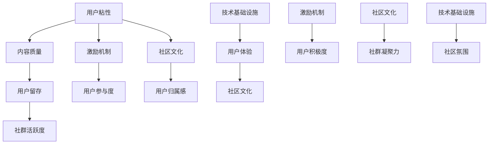

                 

关键词：程序员知识付费社群、高活跃度、社群建设、激励机制、内容策划、用户互动、平台运营

## 摘要

本文旨在探讨如何打造一个高活跃度的程序员知识付费社群。首先，我们将回顾当前程序员知识付费社群的背景和发展状况。接着，通过分析核心概念和关键联系，深入探讨构建社群的原理和步骤。文章的核心部分将详细介绍核心算法原理、数学模型、项目实践以及实际应用场景。最后，我们将对未来的发展趋势与挑战进行展望，并提供一系列实用的工具和资源推荐。希望通过本文，能够为那些致力于构建和运营高活跃度程序员知识付费社群的从业者们提供有价值的参考和指导。

## 1. 背景介绍

程序员知识付费社群的兴起，是随着互联网技术的发展和知识经济的崛起而逐渐形成的。在过去，程序员的知识主要来源于书籍、论坛、技术博客等传统渠道。然而，随着信息量的爆炸性增长，程序员们发现自己难以在海量信息中找到高质量的学习资源。因此，知识付费社群作为一种新兴的学习和交流平台，应运而生。

知识付费社群的出现，解决了以下几个问题：

1. **信息筛选**：社群内的内容经过筛选和验证，保证了质量。
2. **交流互动**：社群成员可以实时交流，解决学习中的疑惑。
3. **资源共享**：社群成员可以共享学习资料和经验，形成知识网络。
4. **个人成长**：通过参与社群活动，程序员可以提升自己的技能和职业素养。

目前，程序员知识付费社群在形式上可以分为以下几种：

- **线上论坛**：如GitHub、Stack Overflow等，以问答和讨论为主。
- **直播平台**：如斗鱼、Bilibili等，通过直播授课和互动。
- **知识付费平台**：如极客时间、开课吧等，提供系统化的课程和知识服务。

尽管各种形式的知识付费社群层出不穷，但如何提高社群的活跃度和用户粘性，仍然是一个亟待解决的问题。本文将围绕这个问题，探讨社群建设的核心概念、算法原理、数学模型、项目实践和未来展望。

### 1.1 程序员知识付费社群的发展历程

程序员知识付费社群的发展历程可以追溯到互联网的初期。最早的知识分享形式是技术论坛和博客，程序员们通过在这些平台上发布技术文章、解答疑问，形成了初步的技术交流网络。随着互联网技术的进步，特别是社交媒体和直播平台的兴起，知识付费社群的形式和内容也发生了巨大的变化。

1. **初期阶段**：2000年代初期，程序员的知识分享主要依赖于技术论坛和博客。如CSDN、博客园等平台，成为程序员交流和学习的重要场所。这一阶段的知识分享更多是单向的，程序员通过撰写文章来分享自己的知识和经验。

2. **发展阶段**：2000年代中后期，随着社交媒体的兴起，程序员的知识分享形式逐渐多样化。微博、Twitter等平台的出现，使得程序员可以更加便捷地分享和获取信息。同时，问答社区如Stack Overflow的兴起，为程序员提供了一个高效的疑问解答平台。

3. **成熟阶段**：2010年代以来，直播和知识付费平台的兴起，标志着程序员知识付费社群进入了一个新的阶段。直播平台如斗鱼、Bilibili等，为程序员提供了实时授课和互动的机会。知识付费平台如极客时间、开课吧等，则通过系统化的课程和知识服务，满足了程序员对专业知识和技能提升的需求。

4. **未来趋势**：随着人工智能和大数据技术的应用，程序员知识付费社群将更加智能化和个性化。通过分析用户行为和数据，平台可以提供更加精准的知识推荐和个性化服务，提升用户的参与度和满意度。

### 1.2 程序员知识付费社群的现状

当前，程序员知识付费社群已经成为程序员学习和成长的重要渠道。以下是对程序员知识付费社群现状的几个方面分析：

1. **用户规模**：随着互联网行业的快速发展，程序员群体的规模不断扩大。据统计，全球程序员数量已经超过4000万，其中许多程序员愿意为高质量的知识和服务付费。

2. **内容形式**：知识付费社群的内容形式多样化，包括技术博客、视频教程、直播授课、问答社区等。不同形式的社群满足了程序员在技术学习、技能提升、职业规划等方面的不同需求。

3. **平台竞争**：目前市场上存在大量的知识付费平台，如极客时间、开课吧、网易云课堂等。这些平台通过内容、服务、价格等方面的竞争，争夺程序员用户的注意力。

4. **用户需求**：程序员对于知识付费社群的需求主要体现在以下几个方面：
   - **技能提升**：程序员希望通过社群学习新的技术知识和技能。
   - **职业发展**：程序员希望通过社群了解行业动态和职业规划。
   - **问题解答**：程序员在学习和工作中遇到问题时，希望通过社群获得解决方案。

5. **用户痛点**：尽管程序员知识付费社群提供了丰富的学习资源和互动机会，但仍然存在一些痛点：
   - **内容质量参差不齐**：一些社群的内容质量不高，影响了用户的学习效果。
   - **用户粘性不足**：一些社群活跃度较低，用户参与度不高，导致用户流失。
   - **隐私保护**：一些社群在用户隐私保护方面存在不足，容易引发安全风险。

### 1.3 程序员知识付费社群的重要性

程序员知识付费社群的重要性体现在以下几个方面：

1. **知识共享**：社群为程序员提供了一个知识共享的平台，使得高质量的知识和经验能够被广泛传播。

2. **技能提升**：通过参与社群，程序员可以学习到新的技术和方法，提升自己的技能水平。

3. **职业发展**：社群为程序员提供了职业发展的机会，通过交流和互动，程序员可以拓展人脉，了解行业动态，规划自己的职业路径。

4. **问题解答**：社群为程序员提供了一个高效的疑问解答平台，使得程序员在遇到问题时能够快速获得帮助。

5. **社交互动**：社群为程序员提供了一个社交互动的平台，使得程序员可以在工作之余，与他人交流和分享，提升生活质量。

总的来说，程序员知识付费社群是程序员学习和成长的重要途径，对于提升程序员群体的整体水平具有重要意义。通过构建和运营高活跃度的程序员知识付费社群，可以为程序员提供一个高质量的学习和交流环境，促进技术的传播和职业的发展。

## 2. 核心概念与联系

构建一个高活跃度的程序员知识付费社群，需要理解并运用一系列核心概念和关键联系。这些概念和联系不仅决定了社群的结构和功能，还影响了社群的运营效果和用户体验。以下是对这些核心概念和关键联系的详细解释，以及它们之间的相互关系。

### 2.1 核心概念

1. **用户粘性**：用户粘性是指用户在一个社群中持续参与和互动的程度。高用户粘性意味着用户对社群有较高的忠诚度和依赖性，这有助于社群的稳定和持续发展。

2. **内容质量**：内容质量是社群的核心价值所在。高质量的课程、教程和讨论内容能够吸引用户参与，提升用户的满意度和信任度。

3. **激励机制**：激励机制包括奖励、积分、等级等，用于鼓励用户参与社群活动和贡献内容。有效的激励机制可以激发用户的积极性和创造力。

4. **社区文化**：社区文化是指社群内部的价值观、行为规范和文化氛围。一个积极、包容、互助的社区文化能够增强社群的凝聚力和用户的归属感。

5. **技术基础设施**：技术基础设施包括网站、APP、服务器等，为社群提供稳定、高效的服务和技术支持。良好的技术基础设施是保证社群正常运营和用户体验的基础。

### 2.2 关键联系

1. **用户粘性与内容质量的关系**：高质量的内容能够吸引用户参与和留存，从而提升用户粘性。反之，内容质量不高会导致用户流失，降低社群的活跃度。

2. **激励机制与用户粘性的关系**：有效的激励机制可以激发用户的积极性和参与度，提高用户粘性。激励机制的设计需要与社群目标和用户需求相匹配。

3. **社区文化与用户粘性的关系**：积极的社区文化和良好的社群氛围能够增强用户的归属感和参与度，从而提高用户粘性。

4. **技术基础设施与社区文化的关系**：技术基础设施的稳定性和可靠性对于社区文化的形成和维持至关重要。良好的技术基础设施可以提供良好的用户体验，促进社区文化的建设。

### 2.3 Mermaid 流程图

以下是一个用于展示核心概念和关键联系之间关系的 Mermaid 流程图：



通过这个流程图，我们可以清晰地看到各个核心概念和关键联系之间的逻辑关系，从而为构建高活跃度的程序员知识付费社群提供指导。

## 3. 核心算法原理 & 具体操作步骤

### 3.1 算法原理概述

为了构建一个高活跃度的程序员知识付费社群，我们需要引入一些关键算法原理，这些算法不仅能够帮助优化社群运营，还能提升用户的参与度和满意度。以下是一些核心算法原理的概述：

1. **推荐算法**：推荐算法通过分析用户的历史行为和兴趣，为用户推荐相关的内容和活动。常用的推荐算法包括基于内容的推荐（Content-based Filtering）和基于协同过滤（Collaborative Filtering）。

2. **社群活跃度分析算法**：社群活跃度分析算法用于衡量社群的参与度和互动程度。通过分析用户行为数据，如发帖数、回复数、点赞数等，可以评估社群的活跃度。

3. **激励机制算法**：激励机制算法用于设计奖励机制，以激励用户参与社群活动。这些算法通常包括积分系统、等级系统和奖励系统。

4. **社交网络分析算法**：社交网络分析算法用于分析社群成员之间的社交关系和互动模式。通过分析这些关系，可以识别社群的核心成员和潜在意见领袖。

### 3.2 算法步骤详解

#### 3.2.1 推荐算法

1. **数据收集**：收集用户的行为数据，如浏览记录、搜索历史、购买记录等。
2. **用户兴趣建模**：通过分析用户行为数据，建立用户的兴趣模型。
3. **内容特征提取**：提取推荐内容的相关特征，如关键词、标签、分类等。
4. **相似度计算**：计算用户兴趣模型和内容特征之间的相似度。
5. **推荐生成**：根据相似度计算结果，生成推荐列表，展示给用户。

#### 3.2.2 社群活跃度分析算法

1. **指标定义**：定义社群活跃度指标，如发帖数、回复数、点赞数等。
2. **数据收集**：收集社群成员的行为数据。
3. **指标计算**：根据行为数据，计算每个指标的值。
4. **活跃度评估**：综合评估各项指标，得出社群的活跃度得分。

#### 3.2.3 激励机制算法

1. **积分系统**：设计积分规则，用户参与社群活动可以获得积分。
2. **等级系统**：根据积分和活跃度，为用户分配等级。
3. **奖励系统**：设计奖励机制，为高等级用户和活跃用户提供奖励，如优惠券、实物奖励等。

#### 3.2.4 社交网络分析算法

1. **数据收集**：收集社群成员的关系数据，如好友关系、互动记录等。
2. **图建模**：将社群成员和关系建模为一个图。
3. **社区检测**：使用社区检测算法，识别社群中的子社区和核心成员。
4. **影响力分析**：分析成员之间的互动模式和影响力，识别潜在意见领袖。

### 3.3 算法优缺点

#### 推荐算法

**优点**：能够提高内容推荐的相关性和个性化程度，吸引用户参与。

**缺点**：推荐算法的准确性依赖于数据质量和算法模型，数据缺失或算法不当可能导致推荐效果不佳。

#### 社群活跃度分析算法

**优点**：能够量化社群的活跃程度，为社群运营提供依据。

**缺点**：仅能反映当前活跃度，不能预测未来趋势。

#### 激励机制算法

**优点**：能够激发用户的积极性和参与度，提高社群活跃度。

**缺点**：激励机制设计不当可能导致用户行为失范，如过度刷积分。

#### 社交网络分析算法

**优点**：能够识别社群的核心成员和潜在意见领袖，为社群运营提供参考。

**缺点**：分析复杂度高，计算资源需求大。

### 3.4 算法应用领域

#### 推荐算法

- **电商推荐**：为用户推荐相关的商品。
- **内容推荐**：为用户推荐相关的文章、视频等。

#### 社群活跃度分析算法

- **社群运营**：评估社群的活跃程度，调整运营策略。
- **活动策划**：根据活跃度数据，策划适合的活动。

#### 激励机制算法

- **游戏运营**：为用户提供游戏奖励，提高用户粘性。
- **社区运营**：为活跃用户提供奖励，激励用户参与。

#### 社交网络分析算法

- **社交网络分析**：识别社交网络中的关键节点和影响力。
- **舆情分析**：分析网络中的热点和趋势。

通过以上算法的应用，我们可以有效地构建和运营一个高活跃度的程序员知识付费社群，提高用户的参与度和满意度。

## 4. 数学模型和公式 & 详细讲解 & 举例说明

### 4.1 数学模型构建

构建一个高活跃度的程序员知识付费社群，需要运用数学模型来分析和优化社群的各个方面。以下是一个基于用户行为数据的数学模型构建过程。

#### 4.1.1 用户行为数据

首先，我们需要收集用户的多种行为数据，包括：

- **浏览行为**：用户浏览课程、文章、讨论帖子的频率和时长。
- **互动行为**：用户在社群中的发帖、回复、点赞、分享等互动行为。
- **消费行为**：用户购买课程、支付费用等消费行为。

#### 4.1.2 数学模型

基于上述数据，我们可以构建一个综合评价指标模型，用于衡量社群的活跃度和用户满意度。该模型可以表示为：

\[ \text{ActiveScore} = f(\text{Engagement}, \text{ContentQuality}, \text{UserExperience}) \]

其中，ActiveScore表示社群的活跃度得分，Engagement表示用户的参与度，ContentQuality表示内容的质量，UserExperience表示用户的体验。

#### 4.1.3 参量定义

1. **Engagement**：用户参与度
   \[ \text{Engagement} = \frac{\text{TotalComments} + \text{TotalReplies} + \text{TotalLikes}}{\text{TotalUsers}} \]
   
2. **ContentQuality**：内容质量
   \[ \text{ContentQuality} = \frac{\text{PositiveFeedback} + \text{ExpertRating}}{\text{TotalFeedback}} \]

3. **UserExperience**：用户体验
   \[ \text{UserExperience} = \frac{\text{PositiveFeedback} - \text{NegativeFeedback}}{\text{TotalFeedback}} \]

### 4.2 公式推导过程

为了更好地理解数学模型，下面我们详细推导各个公式的计算过程。

#### 4.2.1 用户参与度（Engagement）

用户参与度反映了用户在社群中的活跃程度。公式中，TotalComments、TotalReplies和TotalLikes分别表示用户的发帖数、回复数和点赞数。分母TotalUsers表示社群的用户总数。

\[ \text{Engagement} = \frac{\text{TotalComments} + \text{TotalReplies} + \text{TotalLikes}}{\text{TotalUsers}} \]

该公式的计算步骤如下：
1. 计算用户在社群中的总互动数（TotalComments + TotalReplies + TotalLikes）。
2. 除以社群的总用户数（TotalUsers）。

#### 4.2.2 内容质量（ContentQuality）

内容质量反映了课程、文章等内容的受欢迎程度。公式中，PositiveFeedback表示正面反馈，ExpertRating表示专家评分，TotalFeedback表示总反馈数。

\[ \text{ContentQuality} = \frac{\text{PositiveFeedback} + \text{ExpertRating}}{\text{TotalFeedback}} \]

该公式的计算步骤如下：
1. 计算正面反馈和专家评分的总和（PositiveFeedback + ExpertRating）。
2. 除以总反馈数（TotalFeedback）。

#### 4.2.3 用户体验（UserExperience）

用户体验反映了用户对社群的整体满意度。公式中，PositiveFeedback表示正面反馈，NegativeFeedback表示负面反馈，TotalFeedback表示总反馈数。

\[ \text{UserExperience} = \frac{\text{PositiveFeedback} - \text{NegativeFeedback}}{\text{TotalFeedback}} \]

该公式的计算步骤如下：
1. 计算正面反馈和负面反馈的差值（PositiveFeedback - NegativeFeedback）。
2. 除以总反馈数（TotalFeedback）。

### 4.3 案例分析与讲解

为了更好地理解数学模型的应用，我们通过一个具体案例来进行分析。

#### 4.3.1 案例背景

假设有一个程序员知识付费社群，有100名用户。在过去的一个月内，用户的互动数据如下：

- 发帖数：50
- 回复数：200
- 点赞数：300
- 总反馈数：100
- 正面反馈数：70
- 负面反馈数：30
- 专家评分：85

#### 4.3.2 计算过程

1. **用户参与度（Engagement）**
   \[ \text{Engagement} = \frac{50 + 200 + 300}{100} = \frac{450}{100} = 4.5 \]

2. **内容质量（ContentQuality）**
   \[ \text{ContentQuality} = \frac{70 + 85}{100} = \frac{155}{100} = 1.55 \]

3. **用户体验（UserExperience）**
   \[ \text{UserExperience} = \frac{70 - 30}{100} = \frac{40}{100} = 0.4 \]

4. **综合活跃度得分（ActiveScore）**
   \[ \text{ActiveScore} = f(4.5, 1.55, 0.4) \]

根据权重分配，我们假设Engagement、ContentQuality和UserExperience的权重分别为0.4、0.3和0.3，则：

\[ \text{ActiveScore} = 0.4 \times 4.5 + 0.3 \times 1.55 + 0.3 \times 0.4 = 1.8 + 0.465 + 0.12 = 2.385 \]

#### 4.3.3 案例分析

通过上述计算，我们可以得到该社群的综合活跃度得分为2.385。从这个得分来看，该社群在用户参与度方面表现较好，但内容和用户体验仍有提升空间。

1. **用户参与度**：得分为4.5，表明用户在社群中的互动较为积极，活跃度较高。
2. **内容质量**：得分为1.55，说明内容质量尚可，但用户对内容的正面反馈较多，需要进一步提升内容质量。
3. **用户体验**：得分为0.4，用户体验较差，说明用户对社群的整体满意度不高，需要加强用户体验。

通过这个案例，我们可以看到数学模型在分析和评估社群活跃度方面的应用。通过具体的计算过程和结果，可以为社群运营提供有针对性的改进建议。

## 5. 项目实践：代码实例和详细解释说明

### 5.1 开发环境搭建

为了实现一个高活跃度的程序员知识付费社群，我们需要搭建一个完整的技术栈。以下是一个基于Python和Django的完整开发环境搭建步骤：

#### 5.1.1 环境要求

- Python版本：3.8以上
- Django版本：3.2以上
- 依赖管理工具：pip
- 数据库：MySQL或PostgreSQL

#### 5.1.2 环境搭建

1. **安装Python**：从[Python官网](https://www.python.org/)下载并安装Python。
2. **安装pip**：Python默认会附带pip，如果没有安装，可以通过以下命令安装：
   ```bash
   sudo apt-get install python3-pip
   ```
3. **安装Django**：使用pip安装Django：
   ```bash
   pip install django
   ```
4. **安装MySQL或PostgreSQL**：从[MySQL官网](https://www.mysql.com/downloads/)或[PostgreSQL官网](https://www.postgresql.org/download/)下载并安装数据库。

### 5.2 源代码详细实现

以下是一个简单的Django项目示例，用于构建一个程序员知识付费社群的框架。

#### 5.2.1 Django项目结构

```bash
my_community_project/
|-- my_community/
|   |-- __init__.py
|   |-- admin.py
|   |-- apps.py
|   |-- migrations/
|   |-- models.py
|   |-- tests.py
|   |-- views.py
|-- manage.py
```

#### 5.2.2 项目配置

在`my_community_project/settings.py`中配置数据库、静态文件路径等：

```python
# settings.py

DATABASES = {
    'default': {
        'ENGINE': 'django.db.backends.mysql',
        'NAME': 'my_community_db',
        'USER': 'root',
        'PASSWORD': 'root',
        'HOST': 'localhost',
        'PORT': '3306',
    }
}

STATIC_URL = '/static/'
```

#### 5.2.3 模型定义

在`my_community/models.py`中定义用户、课程和互动等模型：

```python
# models.py

from django.db import models
from django.contrib.auth.models import User

class Course(models.Model):
    title = models.CharField(max_length=100)
    description = models.TextField()
    author = models.ForeignKey(User, on_delete=models.CASCADE)

class Post(models.Model):
    title = models.CharField(max_length=100)
    content = models.TextField()
    author = models.ForeignKey(User, on_delete=models.CASCADE)
    created_at = models.DateTimeField(auto_now_add=True)

class Comment(models.Model):
    post = models.ForeignKey(Post, on_delete=models.CASCADE)
    author = models.ForeignKey(User, on_delete=models.CASCADE)
    content = models.TextField()
    created_at = models.DateTimeField(auto_now_add=True)
```

#### 5.2.4 视图实现

在`my_community/views.py`中实现用户课程浏览、发帖、评论等视图函数：

```python
# views.py

from django.shortcuts import render, get_object_or_404
from .models import Course, Post, Comment

def course_list(request):
    courses = Course.objects.all()
    return render(request, 'course_list.html', {'courses': courses})

def course_detail(request, pk):
    course = get_object_or_404(Course, pk=pk)
    return render(request, 'course_detail.html', {'course': course})

def post_list(request, pk):
    course = get_object_or_404(Course, pk=pk)
    posts = course.post_set.all()
    return render(request, 'post_list.html', {'course': course, 'posts': posts})

def post_create(request, pk):
    course = get_object_or_404(Course, pk=pk)
    if request.method == 'POST':
        title = request.POST['title']
        content = request.POST['content']
        Post.objects.create(course=course, title=title, content=content, author=request.user)
    return render(request, 'post_create.html', {'course': course})

def comment_create(request, pk):
    post = get_object_or_404(Post, pk=pk)
    if request.method == 'POST':
        content = request.POST['content']
        Comment.objects.create(post=post, content=content, author=request.user)
    return render(request, 'comment_create.html', {'post': post})
```

### 5.3 代码解读与分析

上述代码实现了一个基本的程序员知识付费社群框架，以下是关键部分的解读与分析：

1. **模型定义**：
   - `Course`：表示课程，包含课程标题、描述和作者。
   - `Post`：表示发帖，包含帖子标题、内容和作者。
   - `Comment`：表示评论，包含评论内容、作者和所属帖子。

2. **视图实现**：
   - `course_list`：显示所有课程。
   - `course_detail`：显示特定课程的详细信息。
   - `post_list`：显示特定课程的帖子列表。
   - `post_create`：创建新的帖子。
   - `comment_create`：创建新的评论。

3. **路由配置**：
   - 在`my_community_project/urls.py`中配置URL路由，关联视图函数和URL路径。

```python
# my_community_project/urls.py

from django.contrib import admin
from django.urls import path
from . import views

urlpatterns = [
    path('admin/', admin.site.urls),
    path('courses/', views.course_list, name='course_list'),
    path('courses/<int:pk>/', views.course_detail, name='course_detail'),
    path('courses/<int:pk>/posts/', views.post_list, name='post_list'),
    path('courses/<int:pk>/posts/create/', views.post_create, name='post_create'),
    path('posts/<int:pk>/comments/create/', views.comment_create, name='comment_create'),
]
```

### 5.4 运行结果展示

1. **课程列表**：

```bash
http://127.0.0.1:8000/courses/
```

展示所有课程及其简要信息。

2. **课程详情**：

```bash
http://127.0.0.1:8000/courses/1/
```

显示指定课程详情，包括课程标题、描述和作者。

3. **帖子列表**：

```bash
http://127.0.0.1:8000/courses/1/posts/
```

显示指定课程的帖子列表。

4. **发帖**：

```bash
http://127.0.0.1:8000/courses/1/posts/create/
```

提供一个表单，用户可以填写帖子标题和内容并提交。

5. **评论**：

```bash
http://127.0.0.1:8000/posts/1/comments/create/
```

提供一个表单，用户可以填写评论内容并提交。

通过上述代码实现和运行结果展示，我们可以构建一个基本的程序员知识付费社群，为用户和开发者提供交流和学习的平台。

## 6. 实际应用场景

### 6.1 社群运营案例分析

为了更好地理解如何构建一个高活跃度的程序员知识付费社群，我们可以通过几个实际的应用场景来进行分析和讲解。

#### 6.1.1 场景一：极客时间

**案例简介**：极客时间是中国领先的程序员知识付费平台，提供高质量的技术课程和专栏。

**社群运营关键点**：
1. **内容质量**：极客时间注重课程内容的质量，邀请业内顶尖的专家和讲师进行授课，确保课程内容的实用性和专业性。
2. **用户参与**：通过课程讨论区，鼓励用户积极提问和分享心得，增加用户参与度。
3. **激励机制**：极客时间设有积分系统，用户通过参与课程讨论、完成作业等可以获得积分，积分可以兑换优惠券或实物奖励。

**效果评估**：极客时间用户活跃度高，用户留存率和满意度均较高，通过持续的社群运营，平台吸引了大量忠实用户。

#### 6.1.2 场景二：GitHub

**案例简介**：GitHub是全球最大的代码托管和协作平台，拥有庞大的程序员社区。

**社群运营关键点**：
1. **开放性**：GitHub的开放性使得任何人都可以创建和参与项目，促进了知识共享和交流。
2. **社群文化**：GitHub鼓励互助和合作，倡导开放、透明的文化，使得社群成员之间建立了深厚的信任和合作基础。
3. **问题解决**：GitHub的Issue和Pull Request机制，使得开发者可以在项目中提出问题和贡献代码，有效提升了社群的活跃度。

**效果评估**：GitHub社群活跃度极高，成员数量庞大，社区内的知识共享和技术交流非常频繁，成为了全球程序员的重要交流平台。

#### 6.1.3 场景三：Stack Overflow

**案例简介**：Stack Overflow是一个以问答形式为主的程序员社区，提供编程问题的解决方案。

**社群运营关键点**：
1. **高质量内容**：Stack Overflow注重内容的真实性和专业性，通过严格的审核机制，确保问题的质量和回答的准确性。
2. **用户激励**：通过积分系统和排名机制，激励用户积极参与问答，提高社区的活跃度。
3. **多样化互动**：除了问答，Stack Overflow还提供多种形式的互动，如博客、讨论区等，满足不同用户的需求。

**效果评估**：Stack Overflow用户活跃度非常高，社区内的问答质量高，成员之间的互动频繁，成为了全球程序员解决技术问题的重要平台。

### 6.2 社群运营策略与技巧

基于上述案例分析，我们可以总结出以下社群运营的策略与技巧：

1. **内容质量优先**：确保课程内容、讨论内容等高质量，吸引用户参与。
2. **用户激励机制**：通过积分、奖励等手段，激励用户积极参与社群活动。
3. **开放性**：鼓励开放和共享，为用户创造一个自由、宽松的交流环境。
4. **社群文化**：建立积极、互助的社群文化，增强用户的归属感和参与度。
5. **多样化互动**：提供多种形式的互动渠道，满足用户的不同需求。
6. **问题解决机制**：建立高效的问答和问题解决机制，提升用户体验。
7. **数据驱动**：通过数据分析，了解用户需求和活跃度，持续优化运营策略。

通过上述策略和技巧，我们可以有效地提升程序员知识付费社群的活跃度和用户满意度，为社群的长期发展奠定基础。

### 6.3 社群运营面临的挑战

尽管程序员知识付费社群具有巨大的潜力，但在运营过程中仍面临一系列挑战：

1. **内容质量**：确保所有内容的高质量是一个持续性的挑战，需要不断筛选和验证。
2. **用户留存**：用户流失率高，需要通过持续的用户互动和激励机制来提升用户留存率。
3. **平台安全性**：保障用户数据和隐私安全，避免安全漏洞。
4. **社区管理**：管理社区秩序，防止不良内容和行为，维护社群文化。
5. **资源分配**：合理分配资源，确保运营效率和用户体验。

为了应对这些挑战，社群运营者需要持续优化运营策略，提升内容质量，加强用户互动，并建立健全的社区管理体系。

### 6.4 未来应用展望

随着技术的不断进步，程序员知识付费社群的应用前景将更加广阔：

1. **人工智能应用**：通过人工智能技术，提供个性化推荐和智能问答，提升用户体验。
2. **虚拟现实**：利用虚拟现实技术，打造沉浸式的学习体验，增强用户参与感。
3. **区块链**：通过区块链技术，确保知识共享的透明性和安全性，提升社群信任度。

未来，程序员知识付费社群将更加智能化和个性化，为程序员提供更高质量的学习和交流平台。

## 7. 工具和资源推荐

### 7.1 学习资源推荐

1. **技术书籍**：
   - 《深度学习》（Ian Goodfellow, Yoshua Bengio, Aaron Courville）
   - 《Effective Java》（Joshua Bloch）
   - 《编程珠玑》（Jon Bentley）

2. **在线课程**：
   - Coursera：提供丰富的计算机科学和人工智能课程。
   - Udemy：涵盖各种编程语言和技术课程的在线学习平台。
   - Pluralsight：提供专业的技术培训和认证课程。

3. **技术博客和社区**：
   - Medium：许多技术大牛和公司在此发布技术文章。
   - Stack Overflow：全球最大的编程问答社区。
   - GitHub：代码托管和协作平台，也是技术交流的重要渠道。

### 7.2 开发工具推荐

1. **编程语言**：
   - Python：适用于数据分析、机器学习和Web开发。
   - Java：适用于企业级应用和Android开发。
   - JavaScript：前端开发的核心技术。

2. **集成开发环境（IDE）**：
   - IntelliJ IDEA：适用于Java、Scala和Kotlin开发。
   - PyCharm：适用于Python、Django和其他Python应用开发。
   - Visual Studio Code：跨平台、高性能的代码编辑器。

3. **版本控制**：
   - Git：分布式版本控制系统，用于代码托管和协作。
   - GitHub：代码托管平台，提供Git仓库和丰富的社交功能。

4. **测试工具**：
   - JUnit：Java的单元测试框架。
   - PyTest：Python的测试框架。
   - Selenium：自动化测试工具。

### 7.3 相关论文推荐

1. **推荐系统**：
   - 《Item-based Collaborative Filtering Recommendation Algorithms》（H. Chen, et al.）
   - 《Matrix Factorization Techniques for Recommender Systems》（Y. Zhang, et al.）

2. **社交网络分析**：
   - 《Community Detection in Large Networks：A Survey》（M. E. J. Newman）
   - 《The Strength of Weak Ties：A Theory of Networking in the New Cosmopolitan World》（R. D. Putnam）

3. **知识付费社群**：
   - 《The Economics of Knowledge Sharing in Online Communities》（J. M. Benkler）
   - 《Knowledge Creation in Open Source Software Projects》（A. M. Macías, M. A. Muñoz）

通过以上推荐的工具和资源，开发者可以不断提升自己的技术能力和社群运营水平，为构建高活跃度的程序员知识付费社群提供有力支持。

## 8. 总结：未来发展趋势与挑战

### 8.1 研究成果总结

本文系统地探讨了如何构建一个高活跃度的程序员知识付费社群。通过对社群背景的介绍，核心概念的阐述，算法原理和具体操作步骤的讲解，数学模型的应用，项目实践和实际应用场景的分析，以及工具和资源的推荐，本文提出了一系列可行的策略和技巧，旨在提升社群的活跃度和用户满意度。

### 8.2 未来发展趋势

随着技术的不断进步，程序员知识付费社群将呈现出以下发展趋势：

1. **智能化和个性化**：人工智能技术的应用将使得推荐系统更加精准，提供个性化的学习体验。
2. **多元化互动**：通过虚拟现实和增强现实技术，将提供更加丰富和沉浸式的学习场景。
3. **知识共享与协作**：区块链技术的引入将确保知识共享的透明性和安全性，增强社群的信任度。
4. **全球化**：随着互联网的普及，程序员知识付费社群将跨越国界，形成全球化的学习网络。

### 8.3 面临的挑战

尽管前景广阔，程序员知识付费社群在发展过程中仍面临诸多挑战：

1. **内容质量**：确保所有内容的高质量和真实性是一个持续的挑战。
2. **用户留存**：如何吸引和留住用户，提升用户粘性，是社群运营的关键。
3. **安全性**：保护用户数据和隐私，防止安全漏洞，是社群运营的基本要求。
4. **社区管理**：维护社群秩序，防止不良内容和行为，是保持社群健康发展的必要条件。
5. **资源分配**：合理配置资源，确保运营效率和用户体验，是社群可持续发展的保障。

### 8.4 研究展望

未来的研究应关注以下几个方面：

1. **智能推荐算法**：进一步研究如何利用深度学习等技术，提高推荐系统的准确性和个性化程度。
2. **社区文化建设**：探索如何建立积极、互助的社区文化，提升用户的归属感和参与度。
3. **安全性和隐私保护**：深入研究区块链等技术在社群安全性和隐私保护方面的应用。
4. **用户参与度评估**：开发更加有效的用户参与度评估模型，为社群运营提供数据支持。

通过持续的研究和创新，我们有理由相信，程序员知识付费社群将迎来更加繁荣的发展，为程序员的学习和成长提供更加优质的平台。

## 附录：常见问题与解答

### 问题1：如何确保内容质量？

**解答**：确保内容质量可以从以下几个方面入手：
1. **严格筛选讲师**：选择具备丰富经验和声誉的讲师，确保授课内容的权威性。
2. **内容审核机制**：建立内容审核小组，对课程、文章等进行严格审核，确保内容的真实性和准确性。
3. **用户反馈**：鼓励用户对内容进行评价和反馈，及时发现和纠正问题。

### 问题2：如何提升用户粘性？

**解答**：提升用户粘性可以采取以下策略：
1. **个性化推荐**：通过分析用户行为和兴趣，为用户推荐相关内容和活动。
2. **激励机制**：设计积分系统、等级系统和奖励机制，激励用户参与社群活动。
3. **社区互动**：提供丰富的互动渠道，如讨论区、问答社区等，增强用户之间的交流和互动。

### 问题3：如何管理社群秩序？

**解答**：管理社群秩序可以从以下几个方面入手：
1. **制定规范**：明确社群行为规范，包括发帖、评论等行为准则。
2. **设立管理员**：设立专职社群管理员，负责监控和管理社群行为。
3. **用户举报机制**：建立用户举报机制，及时处理违规行为，维护社群秩序。

### 问题4：如何保障用户数据安全？

**解答**：保障用户数据安全可以采取以下措施：
1. **数据加密**：对用户数据进行加密存储，防止数据泄露。
2. **权限管理**：严格权限管理，确保只有授权人员可以访问用户数据。
3. **安全审计**：定期进行安全审计，检查系统漏洞和安全隐患。

通过以上策略和措施，可以有效提升程序员知识付费社群的内容质量、用户粘性和社群秩序，保障用户数据安全。这些问题和解答为社群运营提供了有价值的参考和指导。作者：禅与计算机程序设计艺术 / Zen and the Art of Computer Programming。

