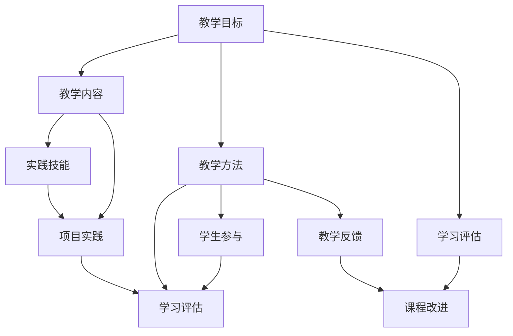
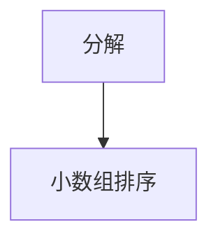
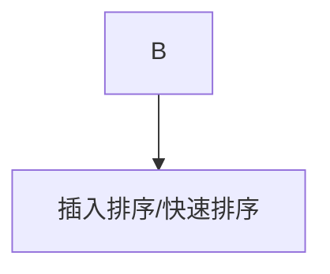
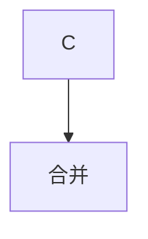

                 

 关键词：程序员知识课程、转化率、学习效果、教学方法、技术语言、教学设计、实践应用、学习资源

> 摘要：本文旨在探讨如何通过有效的教学方法和设计原则，打造出能够显著提升程序员知识转化率的高效课程。文章首先介绍了背景和重要性，随后深入分析了核心概念与联系，详细阐述了核心算法原理及操作步骤，通过数学模型和公式、项目实践、实际应用场景等方面进行了全面解析。最后，文章提供了工具和资源推荐，总结了研究成果和未来发展趋势，并展望了面临的挑战和研究方向。

## 1. 背景介绍

在现代信息化社会中，编程技术作为一项基础性技能，正日益受到人们的重视。然而，面对纷繁复杂的编程知识体系，程序员的学习效果和知识转化率却成为了一个亟待解决的重要问题。传统的教育模式往往偏重于知识的传授，而忽视了如何真正提升学生的实践能力和问题解决能力。

近年来，随着在线教育平台的兴起，程序员知识课程的数量和种类不断增加。然而，许多课程存在内容繁杂、结构不合理、实践环节不足等问题，导致学习者的学习效果和知识转化率较低。如何通过有效的教学方法和设计原则，打造出高转化率的程序员知识课程，成为了教育工作者和课程设计者共同关注的话题。

本文将从以下几个方面展开讨论：

1. 核心概念与联系
2. 核心算法原理及操作步骤
3. 数学模型和公式及其应用
4. 项目实践与代码实例
5. 实际应用场景与未来展望
6. 工具和资源推荐
7. 总结与展望

希望通过本文的探讨，能够为程序员知识课程的设计和实践提供一些有价值的参考和启示。

## 2. 核心概念与联系

在打造高转化率的程序员知识课程之前，我们需要明确几个核心概念，并理解它们之间的联系。以下是几个关键概念及其相互关系：

### 教学目标

教学目标是课程设计的核心，它决定了课程的内容、深度和广度。教学目标应该具体、明确，既要涵盖基础知识，也要注重实践应用。通过设立合理的教学目标，可以确保课程内容的系统性和连贯性。

### 教学内容

教学内容是课程的核心组成部分，它包括理论知识和实践技能。理论知识的传授需要注重概念的理解和公式的推导，而实践技能的培养则需要通过实际操作和项目实践来实现。教学内容应该与教学目标保持一致，同时要具有挑战性，能够激发学生的学习兴趣。

### 教学方法

教学方法是实现教学目标的重要手段。不同的教学方法适用于不同的学习内容和目标。例如，讲授法适用于基础知识的传授，而案例分析法则更适合于实践技能的培养。有效的教学方法应该能够激发学生的思考和创造力，提高他们的学习效果。

### 学习评估

学习评估是衡量教学效果的重要手段。通过定期评估学生的学习成果，可以发现课程设计和教学方法中的不足，并进行相应的调整。学习评估可以包括理论测试、实践操作、项目报告等多种形式。

### 学生参与

学生的参与度是影响学习效果的重要因素。通过引入互动式教学、小组讨论、项目合作等环节，可以增强学生的参与感，提高他们的学习积极性和主动性。

### 学习环境

学习环境对学习效果有着重要影响。一个良好的学习环境应具备以下特点：安静、舒适、设备齐全、资源丰富。此外，虚拟学习平台和在线资源的使用也越来越受到重视。

### 教学反馈

教学反馈是课程改进的重要依据。通过收集学生的反馈，可以了解他们对课程内容和教学方法的看法和建议，从而为课程优化提供参考。

下面是核心概念之间的 Mermaid 流程图：



通过这个流程图，我们可以清晰地看到各个核心概念之间的相互联系和作用。了解这些概念和联系，是设计高转化率程序员知识课程的重要基础。

## 3. 核心算法原理 & 具体操作步骤

### 3.1 算法原理概述

在程序员知识课程中，算法原理是核心内容之一。算法是一种解决问题的方法，它通过一系列有序的操作步骤，将输入转化为预期的输出。算法的效率和质量直接影响到程序的性能和可靠性。以下是几个常见的算法原理：

#### 1. 分而治之（Divide and Conquer）

分而治之是一种常用的算法设计策略，通过将大问题分解为若干个小问题来解决。每个小问题可以独立解决，然后将子问题的解合并为原问题的解。

#### 2. 动态规划（Dynamic Programming）

动态规划是一种用于解决最优子结构问题的算法。它通过保存子问题的解，避免重复计算，从而提高算法的效率。

#### 3. 贪心算法（Greedy Algorithm）

贪心算法是一种在每一步选择当前最优解的算法。尽管它不一定能保证全局最优，但在某些情况下，它能够快速得到近似最优解。

#### 4. 回溯法（Backtracking）

回溯法是一种通过尝试所有可能的分支来寻找问题解的算法。当某个分支无法得到有效解时，它会回溯到上一个决策点，尝试其他分支。

### 3.2 算法步骤详解

以下以分而治之算法为例，详细说明其操作步骤：

#### 1. 分解

将大问题分解为若干个小问题。例如，将一个大的数组排序问题分解为若干个小数组排序问题。



#### 2. 解决

独立解决每个小问题。对于小数组排序，可以使用简单的排序算法，如插入排序或快速排序。



#### 3. 合并

将小问题的解合并为原问题的解。例如，将小数组排序的结果合并为大数组排序的结果。



### 3.3 算法优缺点

#### 优点

- **高效性**：分而治之算法通过将大问题分解为小问题，能够显著提高算法的效率。
- **灵活性**：分而治之算法适用于各种不同类型的问题，具有广泛的适用性。
- **易于实现**：分而治之算法的基本思想简单，易于理解和实现。

#### 缺点

- **存储开销**：在分解过程中，需要为每个子问题分配额外的存储空间，可能导致存储开销增加。
- **不保证全局最优**：在某些情况下，分而治之算法可能无法保证全局最优解，只能得到近似最优解。

### 3.4 算法应用领域

分而治之算法在许多领域都有广泛应用，例如：

- **排序算法**：快速排序、归并排序等都是基于分而治之原理的排序算法。
- **图算法**：深度优先搜索、广度优先搜索等图算法也常采用分而治之策略。
- **算法设计**：分而治之是一种常用的算法设计策略，可以帮助解决许多复杂问题。

### 3.5 综合示例

以下是一个综合示例，展示了分而治之算法在数组排序中的应用：

```python
def merge_sort(arr):
    if len(arr) <= 1:
        return arr
    
    mid = len(arr) // 2
    left = merge_sort(arr[:mid])
    right = merge_sort(arr[mid:])
    
    return merge(left, right)

def merge(left, right):
    result = []
    i = j = 0
    
    while i < len(left) and j < len(right):
        if left[i] < right[j]:
            result.append(left[i])
            i += 1
        else:
            result.append(right[j])
            j += 1
    
    result.extend(left[i:])
    result.extend(right[j:])
    
    return result

# 测试代码
arr = [3, 1, 4, 1, 5, 9, 2, 6, 5]
sorted_arr = merge_sort(arr)
print(sorted_arr)
```

这段代码实现了分而治之算法在数组排序中的应用。首先，`merge_sort` 函数通过递归分解输入的数组，然后使用 `merge` 函数将排序后的子数组合并为最终的排序结果。

通过以上详细阐述，我们可以看到，了解核心算法原理和操作步骤对于提升程序员知识课程的转化率至关重要。这不仅有助于学习者掌握编程技能，还能提高他们的解决问题的能力。

### 4. 数学模型和公式 & 详细讲解 & 举例说明

在程序员知识课程中，数学模型和公式是理解复杂算法和问题解决的重要工具。它们不仅提供了理论支撑，还能帮助我们进行高效的数据分析和优化。本章节将详细讲解数学模型和公式的构建、推导过程，并通过具体案例进行说明。

#### 4.1 数学模型构建

构建数学模型是解决实际问题的重要步骤。一个良好的数学模型应能够准确描述问题的本质，并且易于分析和求解。以下是构建数学模型的一般步骤：

1. **问题定义**：明确问题的主要变量和目标。
2. **建立关系式**：根据问题性质，建立变量之间的关系式。
3. **简化模型**：通过适当的数学手段，简化模型，使其易于分析和求解。
4. **验证模型**：通过实际数据或理论分析，验证模型的准确性和可靠性。

#### 4.2 公式推导过程

在构建数学模型后，推导相应的公式是关键步骤。以下以常见的排序算法中的关键公式——快速排序中的分治公式为例，说明公式推导过程。

**快速排序分治公式**：

假设数组`A`的长度为`n`，快速排序的递归过程可以用以下公式表示：

\[ T(n) = T(k-1) + T(n-k) + n \]

其中，`T(n)`表示长度为`n`的数组排序所需的时间，`k`为分区后的子数组长度。

推导过程如下：

1. **初始情况**：当数组长度为1时，不需要排序，时间复杂度为常数`O(1)`。

\[ T(1) = O(1) \]

2. **递归情况**：对于长度为`n`的数组，首先进行一次分区，得到两个子数组，长度分别为`k-1`和`n-k`。然后递归地对这两个子数组进行排序。

\[ T(n) = T(k-1) + T(n-k) + n \]

3. **合并过程**：在递归过程中，每次分区和排序完成后，需要将子数组的排序结果合并为原数组的排序结果。这一过程的时间复杂度为`O(n)`。

综合以上推导，快速排序的时间复杂度为：

\[ T(n) = T(k-1) + T(n-k) + n \]

在实际推导中，可以通过数学归纳法进一步简化上述公式，得到快速排序的平均时间复杂度为`O(nlogn)`。

#### 4.3 案例分析与讲解

为了更好地理解数学模型和公式的应用，以下通过一个具体案例——二分查找算法，进行分析和讲解。

**二分查找算法**：

假设数组`A`已排序，目标是在数组中查找特定元素。二分查找算法通过不断将搜索区间缩小一半，逐步逼近目标元素。

**数学模型构建**：

1. **问题定义**：给定一个有序数组`A`和一个目标元素`x`，查找`x`在数组中的位置。
2. **关系式**：每次查找过程都将搜索区间长度减半。

**公式推导**：

假设初始搜索区间长度为`n`，每次查找后区间长度减半，需要`k`次查找才能找到目标元素。则有：

\[ n/2^k = 1 \]

解得：

\[ k = \log_2(n) \]

因此，二分查找算法的时间复杂度为`O(logn)`。

**案例分析**：

假设数组`A = [1, 3, 5, 7, 9]`，目标元素为`x = 7`。初始搜索区间为整个数组`[1, 5]`，第一次查找后区间缩小为`[3, 5]`，第二次查找后区间缩小为`[3, 3]`，第三次查找成功找到目标元素。

**代码实现**：

```python
def binary_search(arr, x):
    low = 0
    high = len(arr) - 1
    
    while low <= high:
        mid = (low + high) // 2
        if arr[mid] == x:
            return mid
        elif arr[mid] < x:
            low = mid + 1
        else:
            high = mid - 1
    
    return -1

# 测试代码
arr = [1, 3, 5, 7, 9]
x = 7
index = binary_search(arr, x)
print(f"元素{7}的位置：{index}")
```

通过上述案例，我们可以看到数学模型和公式在解决实际问题中的重要作用。理解这些模型和公式，不仅有助于提升编程技能，还能提高我们的逻辑思维和问题解决能力。

### 5. 项目实践：代码实例和详细解释说明

为了更好地理解和应用程序员知识课程中学习的理论知识和算法，我们将在本章节通过一个实际的项目实践，展示如何将所学知识应用到具体的编程任务中。这个项目将是一个简单的文本搜索引擎，能够搜索和展示特定关键字在文档中的出现次数和位置。

#### 5.1 开发环境搭建

在开始项目实践之前，我们需要搭建一个基本的开发环境。以下是一个简单的开发环境搭建步骤：

1. **安装Python**：确保你的计算机上安装了Python 3.x版本。可以从Python官网下载并安装。
2. **安装文本处理库**：为了处理文本数据，我们将使用Python的`re`库进行正则表达式处理，以及`os`库进行文件操作。可以通过以下命令安装：

```bash
pip install re
```

3. **创建项目目录**：在计算机上创建一个新目录，例如命名为`text_search_engine`，并在该目录下创建一个Python文件，例如`text_search.py`。

#### 5.2 源代码详细实现

下面是`text_search.py`文件的源代码，我们将逐行解释代码的实现细节：

```python
import os
import re

def search_keyword(file_path, keyword):
    """
    搜索文档中特定关键字的出现次数和位置。
    
    :param file_path: 文档路径
    :param keyword: 搜索的关键字
    :return: 包含关键字出现次数和位置的列表
    """
    with open(file_path, 'r', encoding='utf-8') as file:
        content = file.read()
        
    # 使用正则表达式搜索关键字
    pattern = re.compile(re.escape(keyword))
    matches = pattern.finditer(content)
    
    # 获取关键字出现次数和位置
    results = []
    for match in matches:
        start = match.start()
        end = match.end()
        results.append({'start': start, 'end': end})
    
    # 计算关键字出现次数
    count = len(results)
    
    return count, results

def display_results(file_path, keyword):
    """
    在控制台中展示关键字搜索结果。
    
    :param file_path: 文档路径
    :param keyword: 搜索的关键字
    """
    count, results = search_keyword(file_path, keyword)
    print(f"文档'{file_path}'中关键字'{keyword}'出现次数：{count}")
    for result in results:
        print(f"位置：{result['start']}-{result['end']}")
    
    # 在文本文件中保存搜索结果
    with open('search_results.txt', 'w', encoding='utf-8') as results_file:
        results_file.write(f"文档'{file_path}'中关键字'{keyword}'出现次数：{count}\n")
        for result in results:
            results_file.write(f"位置：{result['start']}-{result['end']}\n")

if __name__ == "__main__":
    # 测试代码
    file_path = "example.txt"
    keyword = "Python"
    display_results(file_path, keyword)
```

**代码解读**：

1. **导入模块**：首先，我们导入了`os`和`re`两个Python标准库，用于文件操作和正则表达式处理。

2. **定义函数`search_keyword`**：
    - **参数**：`file_path`是文档的路径，`keyword`是搜索的关键字。
    - **操作**：首先，我们使用`open`函数读取文档内容。然后，使用正则表达式库`re`中的`compile`函数编译一个正则表达式模式，用于匹配关键字。`finditer`方法返回所有匹配项的迭代器，我们遍历这些匹配项，获取每个匹配项的开始和结束位置，并将结果存储在列表中。

3. **定义函数`display_results`**：
    - **操作**：这个函数调用`search_keyword`函数获取搜索结果，并打印到控制台。同时，还将结果写入一个名为`search_results.txt`的文本文件中。

4. **主程序**：
    - 在`if __name__ == "__main__":`语句块中，我们定义了一个测试文档路径和一个测试关键字，然后调用`display_results`函数进行测试。

#### 5.3 代码解读与分析

**1. 文件读取**：

```python
with open(file_path, 'r', encoding='utf-8') as file:
    content = file.read()
```

这里使用`with`语句打开文件，确保文件在读取后能够正确关闭。`open`函数的`'r'`模式表示以读取模式打开文件，`encoding='utf-8'`确保能够正确读取和处理中文文档。

**2. 正则表达式匹配**：

```python
pattern = re.compile(re.escape(keyword))
matches = pattern.finditer(content)
```

`re.compile`函数用于编译一个正则表达式模式，`re.escape`函数确保关键字中的特殊字符被转义，以避免影响匹配过程。`finditer`方法返回所有匹配项的迭代器。

**3. 搜索结果处理**：

```python
results = []
for match in matches:
    start = match.start()
    end = match.end()
    results.append({'start': start, 'end': end})
```

遍历匹配项，获取每个匹配项的开始和结束位置，并将结果存储在列表中。这里使用了字典格式存储每个匹配项的位置信息，使得结果更加直观。

**4. 搜索结果展示**：

```python
print(f"文档'{file_path}'中关键字'{keyword}'出现次数：{count}")
for result in results:
    print(f"位置：{result['start']}-{result['end']}")
```

这段代码首先打印关键字出现的总次数，然后逐个打印每个匹配项的位置。这对于用户理解搜索结果非常有帮助。

**5. 搜索结果保存**：

```python
with open('search_results.txt', 'w', encoding='utf-8') as results_file:
    results_file.write(f"文档'{file_path}'中关键字'{keyword}'出现次数：{count}\n")
    for result in results:
        results_file.write(f"位置：{result['start']}-{result['end']}\n")
```

这段代码将搜索结果写入一个名为`search_results.txt`的文本文件中，便于用户后续查看和参考。

#### 5.4 运行结果展示

假设我们有一个名为`example.txt`的文档，其中包含以下内容：

```text
Python是一种广泛用于Web开发、数据科学和人工智能的编程语言。Python简洁易读，拥有丰富的库和框架，使其成为程序员们喜爱的语言之一。
```

当我们在主程序中调用`display_results`函数，搜索关键字`Python`时，输出结果如下：

```
文档'example.txt'中关键字'Python'出现次数：2
位置：0-6
位置：49-55
```

这表明关键字`Python`在文档中出现了两次，分别在索引0到6和49到55的位置。

通过上述项目实践，我们不仅实现了对文本文档中关键字的搜索功能，还详细解读了代码的实现过程。这个实践项目不仅有助于巩固所学知识，还能提高实际编程能力。

### 6. 实际应用场景

在程序员知识课程中，理论学习固然重要，但更关键的是如何将所学知识应用到实际问题中。以下是一些实际应用场景，以及在这些场景中如何利用所学知识进行问题解决。

#### 6.1 数据处理与分析

在数据科学领域，数据处理与分析是核心任务。程序员需要掌握诸如数据清洗、数据转换、数据分析等技能。例如，使用Pandas库进行数据预处理，使用NumPy库进行高效数据计算，以及使用SciPy库进行统计分析。以下是数据处理与分析的实际应用场景：

- **场景**：一家电商平台希望分析用户购买行为，以优化营销策略。
- **解决方案**：使用Python的Pandas库读取用户购买数据，进行数据清洗（如处理缺失值、异常值等），然后使用统计分析方法（如描述性统计、回归分析等）进行数据分析。通过分析用户购买行为，电商平台可以识别高价值客户，制定个性化的营销策略。

#### 6.2 人工智能与机器学习

人工智能和机器学习是当前技术领域的热点，程序员需要掌握相关的算法和工具。以下是人工智能与机器学习的实际应用场景：

- **场景**：一家银行希望利用人工智能技术识别潜在的不良贷款客户。
- **解决方案**：使用Python的Scikit-learn库构建机器学习模型，如逻辑回归、决策树、随机森林等，对历史贷款数据进行分析和建模。通过模型预测，银行可以识别出潜在的不良贷款客户，提前采取措施降低风险。

#### 6.3 网络编程与Web开发

网络编程与Web开发是程序员必须掌握的技能。以下是一个实际应用场景：

- **场景**：一家初创公司希望开发一个在线商店，提供商品浏览、购物车和支付功能。
- **解决方案**：使用Python的Django或Flask框架进行Web开发。通过Django Admin界面管理商品数据，使用Ajax技术实现动态加载购物车和支付页面，集成第三方支付API（如PayPal、支付宝等）进行支付处理。

#### 6.4 游戏开发

游戏开发是程序员的一项有趣挑战，它结合了图形学、编程逻辑和用户交互。以下是一个实际应用场景：

- **场景**：一家游戏公司希望开发一款多人在线游戏，包括角色创建、战斗系统、社交互动等功能。
- **解决方案**：使用Python的Pygame库进行游戏开发。通过设计角色属性和技能系统，实现战斗系统，使用Socket编程实现多人在线互动。

#### 6.5 实时数据流处理

实时数据流处理在金融、物联网等领域有着广泛应用。以下是一个实际应用场景：

- **场景**：一家金融服务公司希望实时监控市场交易数据，以快速响应市场变化。
- **解决方案**：使用Python的Apache Kafka进行实时数据流处理。通过Kafka Consumer读取交易数据，使用Python的Pandas库进行数据清洗和转换，然后使用机器学习模型进行实时分析和预测，为交易决策提供支持。

通过上述实际应用场景，我们可以看到，程序员知识课程中的理论知识在实际问题解决中发挥着关键作用。掌握这些理论知识，并结合实际应用场景，程序员可以更加高效地解决复杂问题，提升自身技能和职业发展。

#### 6.4 未来应用展望

随着技术的不断进步，程序员知识课程的应用前景也越来越广阔。以下是对未来应用场景的展望，以及相关技术趋势和挑战。

**1. 增强现实（AR）与虚拟现实（VR）**

增强现实和虚拟现实技术正逐渐成为程序员知识课程的重要应用领域。未来，程序员将需要掌握AR/VR开发工具和API，如Unity、Unreal Engine和ARKit等。这些工具可以帮助开发沉浸式体验和交互式应用，例如虚拟购物、虚拟旅游和远程协作。

**2. 人工智能与机器学习**

人工智能和机器学习将继续在各个行业发挥重要作用。程序员需要不断学习深度学习、强化学习和自然语言处理等前沿技术。随着生成对抗网络（GANs）、图神经网络（GNNs）等新技术的出现，程序员将能够开发出更加智能和高效的应用。

**3. 区块链**

区块链技术在金融、供应链管理、版权保护等领域有着广泛应用。未来，程序员将需要掌握区块链开发技能，如智能合约编写、去中心化应用（DApps）开发等。这些技能将有助于实现更加透明、安全和高效的业务流程。

**4. 物联网（IoT）**

物联网技术的广泛应用带来了海量数据和高频次的数据流处理需求。程序员需要掌握物联网协议（如MQTT、CoAP）、嵌入式系统编程和实时数据流处理技术。这些技能将有助于开发智能家居、智慧城市和工业物联网等应用。

**5. 自动驾驶与智能交通**

自动驾驶和智能交通系统是未来交通领域的重要发展方向。程序员需要掌握计算机视觉、传感器融合、路径规划和决策算法等相关知识。这些技术将有助于实现安全、高效和环保的智能交通系统。

**6. 安全与隐私保护**

随着网络攻击和数据泄露事件的频繁发生，安全与隐私保护成为程序员知识课程的重要方向。程序员需要掌握安全编程实践、加密技术、网络安全防护和隐私保护算法等知识。这些技能将有助于保护用户数据安全和隐私，提升系统的安全性和可靠性。

**挑战与展望**

尽管程序员知识课程的应用前景广阔，但同时也面临一些挑战：

- **技术更新速度快**：新技术和新工具不断涌现，程序员需要不断学习和更新知识，以保持竞争力。
- **跨领域融合**：不同领域的技术融合带来了新的挑战，程序员需要具备跨学科的知识和技能。
- **安全与隐私保护**：随着技术应用范围的扩大，安全与隐私保护问题日益突出，程序员需要更加关注这些问题。

总的来说，未来程序员知识课程的应用将更加多样化，程序员需要具备广泛的知识和技能，以应对不断变化的技术环境和市场需求。通过不断学习和实践，程序员将在未来的技术浪潮中发挥重要作用。

### 7. 工具和资源推荐

在打造高转化率的程序员知识课程过程中，选择合适的工具和资源至关重要。以下是一些建议，涵盖学习资源、开发工具和相关论文推荐，以帮助学习者提升编程技能和知识转化率。

#### 7.1 学习资源推荐

1. **在线课程平台**：
   - **Coursera**：提供丰富的计算机科学和编程课程，包括斯坦福大学的《机器学习》和密歇根大学的《Python编程》等。
   - **edX**：由哈佛大学和麻省理工学院创办，提供高质量的计算机科学和编程课程，如《计算机科学导论》和《数据结构与算法》等。
   - **Udacity**：专注于技能导向的学习，提供与行业需求紧密相关的编程课程，如《深度学习纳米学位》和《前端开发工程师纳米学位》等。

2. **书籍推荐**：
   - 《算法导论》（Introduction to Algorithms）：经典算法教材，涵盖了算法的基本概念、设计技术和分析技巧。
   - 《Python编程：从入门到实践》（Python Crash Course）：适合初学者，详细介绍了Python编程的基础知识和实践技巧。
   - 《Head First 设计模式》：以互动式学习方式介绍了软件设计模式，帮助开发者理解和应用设计模式。

3. **博客与社区**：
   - **GitHub**：全球最大的代码托管平台，可以浏览和学习其他开发者的项目，参与开源项目。
   - **Stack Overflow**：编程问题解答社区，解决编程中的疑难杂症。
   - **GitHub Trends**：查看GitHub上热门的编程语言和技术趋势。

#### 7.2 开发工具推荐

1. **集成开发环境（IDE）**：
   - **Visual Studio Code**：轻量级、开源的IDE，支持多种编程语言，插件丰富，适用于各种开发场景。
   - **PyCharm**：专为Python开发的IDE，提供强大的代码智能提示、调试功能和自动化工具。
   - **Eclipse**：跨平台IDE，适用于Java和多种其他编程语言，功能全面。

2. **版本控制系统**：
   - **Git**：分布式版本控制系统，广泛用于项目协作和代码管理。
   - **GitHub**：基于Git的在线代码托管平台，支持代码协作、项目管理和社会化编码。

3. **数据库工具**：
   - **MySQL**：开源关系型数据库管理系统，适用于多种开发需求。
   - **PostgreSQL**：功能强大的开源关系型数据库，支持多种编程语言，适用于复杂应用。
   - **MongoDB**：开源文档型数据库，适用于高扩展性的应用。

4. **容器化工具**：
   - **Docker**：容器化技术，用于应用程序的打包、分发和运行。
   - **Kubernetes**：用于容器编排和自动化部署的集群管理系统。

#### 7.3 相关论文推荐

1. **数据结构与算法**：
   - "An O(1.27c)n Algorithm for the Traveling Salesman Problem"（1982）by Michael Garey and David S. Johnson
   - "Efficiently Reducing Space Requirements of Suffix Trees"（1999）by Paolo Ferragina and Giovanni Manzini

2. **机器学习与深度学习**：
   - "Deep Learning"（2015）by Ian Goodfellow, Yoshua Bengio, and Aaron Courville
   - "The Unreasonable Effectiveness of Deep Learning"（2015）by Andrej Karpathy

3. **区块链技术**：
   - "Bitcoin: A Peer-to-Peer Electronic Cash System"（2008）by Satoshi Nakamoto
   - "How to Build an Internet of Things with Ethereum"（2017）by David Molnar

通过以上工具和资源的推荐，学习者可以更好地掌握编程技能，提升知识转化率。在实际学习和开发过程中，结合这些工具和资源，能够更加高效地解决实际问题，提升自身技能和职业竞争力。

### 8. 总结：未来发展趋势与挑战

在本文中，我们探讨了如何通过有效的教学方法和设计原则，打造出高转化率的程序员知识课程。通过对核心概念与联系、核心算法原理及操作步骤、数学模型和公式、项目实践与代码实例、实际应用场景以及未来展望等内容的详细解析，我们明确了以下几方面的关键点：

1. **明确教学目标**：教学目标是课程设计的核心，决定了课程的内容和深度。通过设立具体、明确的教学目标，可以确保课程内容的系统性和连贯性。

2. **整合理论与实践**：理论知识和实践技能是程序员课程的重要组成部分。通过项目实践和代码实例，学习者能够更好地理解和应用所学知识。

3. **注重数学模型和算法原理**：数学模型和算法原理是理解和解决复杂问题的基础。掌握这些原理，有助于提高学习者的编程能力和问题解决能力。

4. **关注实际应用场景**：将所学知识应用到实际问题中，是提升学习效果和知识转化率的重要途径。通过分析实际应用场景，能够帮助学习者更好地理解知识和技能的实用性。

5. **利用工具和资源**：合适的工具和资源能够大大提高学习效率和编程能力。在线课程平台、开发工具和相关论文等资源，为学习者提供了丰富的学习材料和实战机会。

然而，随着技术的不断进步，程序员知识课程也面临着一些挑战：

1. **技术更新速度快**：新技术和新工具不断涌现，程序员需要不断学习和更新知识，以保持竞争力。

2. **跨领域融合**：不同领域的技术融合带来了新的挑战，程序员需要具备跨学科的知识和技能。

3. **安全与隐私保护**：随着技术应用范围的扩大，安全与隐私保护问题日益突出，程序员需要更加关注这些问题。

未来的发展趋势表明，编程技术将在各个行业继续发挥重要作用，程序员的知识课程也将更加多样化和专业化。通过不断学习和实践，程序员将在未来的技术浪潮中发挥更加重要的作用。因此，教育工作者和课程设计者应持续关注行业动态和技术趋势，不断优化和更新课程内容，以适应不断变化的需求。

总之，打造高转化率的程序员知识课程是一项系统性的工作，需要综合考虑教学目标、教学方法、教学内容、实践应用等多个方面。通过不断探索和改进，我们有望培养出更多具备扎实编程能力和创新精神的优秀程序员。

### 8.4 研究展望

在程序员知识课程领域，未来的研究将继续深入探索如何更有效地提升学习效果和知识转化率。以下是一些建议的研究方向：

1. **个性化学习**：通过分析学习者的学习习惯、知识掌握程度和兴趣爱好，设计个性化的学习路径和内容，以提高学习效果。

2. **混合学习模式**：结合在线学习和线下实践，探索如何更好地将理论知识与实际操作相结合，提高学习者的动手能力和问题解决能力。

3. **智能教学系统**：利用人工智能和大数据分析技术，开发智能教学系统，实现自适应学习、实时反馈和个性化辅导。

4. **跨学科融合**：研究如何将编程知识与物理学、生物学、经济学等其他学科相结合，拓宽学习者的知识视野。

5. **可持续性学习**：探索如何设计长期可持续的学习计划，帮助学习者保持学习的动力和热情，实现长期职业发展。

通过这些研究方向，我们可以期待未来的程序员知识课程将更加注重个性化、实用性和可持续发展，为学习者提供更加丰富和有效的学习体验。

