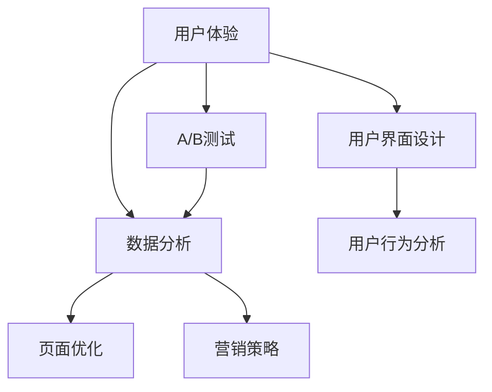

                 

关键字：销售页面、用户体验、设计原则、A/B测试、数据分析、用户行为分析、视觉元素、信息架构、转化率优化、营销策略。

> 摘要：本文将探讨如何通过设计原则、A/B测试、数据分析等技术手段，打造高转化率的销售页面。通过深入分析用户行为、视觉元素和信息架构，我们将为读者提供一整套实用的优化策略，助力企业在激烈的市场竞争中脱颖而出。

## 1. 背景介绍

随着互联网的普及，电子商务已成为企业获取利润的重要渠道。销售页面的设计质量直接影响着用户的购买决策和企业的销售业绩。一个高转化率的销售页面不仅能够吸引用户停留和浏览，还能激发他们的购买欲望，最终实现销售转化。因此，研究如何打造高转化率的销售页面具有重要意义。

本文将围绕以下核心问题展开讨论：

- 销售页面的核心设计原则是什么？
- 如何通过A/B测试和数据分析来优化页面？
- 用户行为和信息架构在页面设计中的作用是什么？
- 视觉元素如何提升页面的吸引力？
- 营销策略在提升转化率方面的作用如何？

通过解答这些问题，我们将为读者提供一套系统化的销售页面优化方案。

### 1.1 销售页面的重要性

销售页面是电子商务的核心组成部分，其设计质量直接影响用户的购买决策。一个优秀的销售页面不仅能提升用户体验，还能显著提高销售转化率。研究表明，页面加载速度、信息架构、视觉元素等因素都会对用户的购买意愿产生重要影响。

### 1.2 现状与挑战

尽管许多企业已经意识到销售页面的重要性，但在实际操作中仍面临诸多挑战。首先，如何平衡美观与实用性成为设计师面临的首要难题。其次，不同用户群体的需求差异使得页面设计需要具备较强的适应性。此外，如何在激烈的市场竞争中脱颖而出，提升页面的转化率，也是企业需要重点考虑的问题。

## 2. 核心概念与联系

在探讨如何打造高转化率的销售页面之前，我们需要理解一些核心概念，这些概念包括用户体验（UX）、用户界面（UI）设计原则、A/B测试、数据分析等。为了更直观地展示这些概念之间的联系，我们可以使用Mermaid绘制一个流程图。



### 2.1 用户体验（UX）

用户体验（UX）是指用户在使用产品或服务过程中所感受到的整体感受。它关注用户的需求、行为和感受，旨在提供一种舒适、便捷和愉悦的交互体验。在销售页面设计中，用户体验是核心，它决定了用户是否愿意停留和浏览页面，以及是否产生购买意愿。

### 2.2 用户界面设计原则（UI）

用户界面设计（UI）是产品设计和开发的重要组成部分。它关注如何通过视觉元素和交互设计来提升用户体验。一些关键的用户界面设计原则包括一致性、简洁性、易用性和反馈性。这些原则有助于确保用户在浏览销售页面时能够轻松地找到所需信息，并完成购买流程。

### 2.3 A/B测试

A/B测试是一种通过对比两组用户的不同体验来评估设计变更效果的方法。通过A/B测试，企业可以确定哪种设计方案能够更好地满足用户需求，从而提高转化率。A/B测试通常涉及对页面元素（如标题、按钮、图片等）的更改，并观察用户对这些更改的反应。

### 2.4 数据分析

数据分析是优化销售页面的关键手段。通过收集和分析用户行为数据，企业可以深入了解用户的需求和行为模式，从而制定更有效的优化策略。数据分析工具（如Google Analytics）可以帮助企业跟踪用户在页面上的活动，包括浏览时间、点击率、转化率等。

### 2.5 用户行为分析

用户行为分析是理解用户需求和行为的重要手段。通过分析用户在销售页面上的行为，如滚动、点击、停留时间等，企业可以识别用户痛点，并针对性地进行优化。

### 2.6 信息架构

信息架构是指页面内容的组织方式和结构。一个良好的信息架构可以帮助用户快速找到所需信息，从而提高页面浏览率和转化率。信息架构设计需要考虑用户体验、内容逻辑和页面布局等因素。

### 2.7 视觉元素

视觉元素（如颜色、字体、图像等）在销售页面设计中起着重要作用。适当的视觉元素可以提升页面的美观度和吸引力，从而吸引用户停留和浏览。

### 2.8 营销策略

营销策略是指企业通过广告、促销活动等方式来吸引用户，并促进销售的过程。有效的营销策略可以提高销售页面的曝光率和访问量，从而提升转化率。

## 3. 核心算法原理 & 具体操作步骤

### 3.1 算法原理概述

打造高转化率的销售页面需要综合运用多种算法和策略。这些算法包括：

- 用户行为分析算法：用于分析用户在页面上的行为模式，识别用户痛点。
- A/B测试算法：通过对比不同设计方案的转化率，确定最佳设计方案。
- 数据分析算法：用于收集、整理和分析用户行为数据，提供优化依据。
- 信息架构优化算法：用于优化页面内容结构和布局，提高用户体验。

### 3.2 算法步骤详解

#### 3.2.1 用户行为分析算法

1. 数据收集：通过Web分析工具（如Google Analytics）收集用户在销售页面上的行为数据。
2. 数据处理：对收集到的数据进行分析和处理，提取关键指标（如点击率、停留时间、转化率等）。
3. 数据可视化：将处理后的数据以图表、报表等形式展示，帮助分析人员理解用户行为模式。
4. 数据解读：根据数据结果，识别用户痛点，为优化页面提供依据。

#### 3.2.2 A/B测试算法

1. 设计测试方案：确定需要测试的页面元素（如标题、按钮、图片等）和测试目标（如转化率、点击率等）。
2. 随机分组：将用户随机分配到不同测试组，确保每组用户的体验差异。
3. 数据收集：在测试期间，收集各组的用户行为数据。
4. 数据分析：对比各组数据，确定哪种设计方案更符合用户需求。
5. 结论与优化：根据测试结果，确定最佳设计方案，并进行相应优化。

#### 3.2.3 数据分析算法

1. 数据收集：从多个渠道收集用户行为数据，包括Web分析工具、社交媒体、客服系统等。
2. 数据清洗：处理和整理收集到的数据，确保数据的准确性和一致性。
3. 数据分析：使用统计方法（如回归分析、聚类分析等）对数据进行深入分析，提取有价值的信息。
4. 数据可视化：将分析结果以图表、报表等形式展示，帮助决策者理解数据含义。
5. 数据应用：根据分析结果，制定优化策略，提升销售页面转化率。

#### 3.2.4 信息架构优化算法

1. 用户研究：了解目标用户的需求和行为模式，为信息架构设计提供依据。
2. 内容梳理：对页面内容进行分类和整理，确保信息结构清晰、逻辑性强。
3. 信息布局：设计页面布局，确保用户能够快速找到所需信息。
4. 可视化设计：使用视觉元素（如颜色、字体、图像等）提升页面美观度和用户体验。
5. 用户反馈：收集用户对页面布局和信息的反馈，持续优化信息架构。

### 3.3 算法优缺点

- 用户行为分析算法的优点在于能够深入了解用户需求和行为模式，从而提供有针对性的优化建议。但其缺点是数据分析过程较为复杂，需要专业的技术和工具支持。
- A/B测试算法的优点是能够直观地比较不同设计方案的优劣，从而确定最佳方案。但其缺点是测试周期较长，需要较长时间才能得出结论。
- 数据分析算法的优点是能够提供全面的数据支持，帮助制定优化策略。但其缺点是数据处理和分析过程较为复杂，需要专业的技术和工具支持。
- 信息架构优化算法的优点是能够提升页面信息结构和布局的合理性，从而提高用户体验。但其缺点是优化过程需要较多的用户研究和反馈，耗时较长。

### 3.4 算法应用领域

用户行为分析算法、A/B测试算法和数据分析算法在电子商务、金融科技、在线教育等多个领域都有广泛应用。信息架构优化算法则主要用于电商平台、在线商店等需要提供丰富信息和高效浏览体验的场景。

## 4. 数学模型和公式 & 详细讲解 & 举例说明

在销售页面优化过程中，数学模型和公式可以提供定量分析的支持，帮助我们更精确地评估设计方案的效果。以下是一些常用的数学模型和公式，以及详细的讲解和举例说明。

### 4.1 数学模型构建

#### 4.1.1 转化率模型

转化率（Conversion Rate）是衡量销售页面效果的重要指标，其计算公式为：

\[ \text{转化率} = \frac{\text{转化的用户数}}{\text{总用户数}} \]

#### 4.1.2 用户流失率模型

用户流失率（Churn Rate）是衡量用户流失程度的指标，其计算公式为：

\[ \text{用户流失率} = \frac{\text{流失的用户数}}{\text{当前用户数}} \]

#### 4.1.3 点击率模型

点击率（Click-Through Rate，CTR）是衡量用户点击广告或按钮的比率，其计算公式为：

\[ \text{点击率} = \frac{\text{点击次数}}{\text{展示次数}} \]

### 4.2 公式推导过程

#### 4.2.1 转化率模型推导

假设有n个用户访问销售页面，其中m个用户完成了购买。则转化率可以表示为：

\[ \text{转化率} = \frac{m}{n} \]

其中，m和n都是正整数。

#### 4.2.2 用户流失率模型推导

假设当前有N个用户，其中L个用户在一段时间内流失。则用户流失率可以表示为：

\[ \text{用户流失率} = \frac{L}{N} \]

其中，L和N都是非负整数。

#### 4.2.3 点击率模型推导

假设有C次点击和S次展示，则点击率可以表示为：

\[ \text{点击率} = \frac{C}{S} \]

其中，C和S都是正整数。

### 4.3 案例分析与讲解

为了更好地理解这些数学模型和公式，我们可以通过一个实际案例进行分析。

#### 4.3.1 案例背景

某电商平台希望通过优化销售页面提高转化率。他们收集了最近一个月的用户访问数据，发现共有1000个用户访问了销售页面，其中150个用户完成了购买。

#### 4.3.2 转化率计算

根据转化率模型，我们可以计算出当前页面的转化率为：

\[ \text{转化率} = \frac{150}{1000} = 15\% \]

这意味着每100个访问用户中有15个完成了购买。

#### 4.3.3 用户流失率计算

假设在优化前，该电商平台每月有1000个新用户注册，但一个月后，有200个用户流失。则用户流失率为：

\[ \text{用户流失率} = \frac{200}{1000} = 20\% \]

这意味着每5个新用户中有1个在一个月内流失。

#### 4.3.4 点击率计算

假设该电商平台在广告投放期间，共有10000次广告展示，其中300次被用户点击。则点击率为：

\[ \text{点击率} = \frac{300}{10000} = 3\% \]

这意味着每100次广告展示中，有3次被用户点击。

#### 4.3.5 模型应用

通过这些数学模型，该电商平台可以量化页面效果，评估不同优化策略的效果。例如，他们可以对比不同页面设计方案的转化率，选择效果最佳的方案。同时，他们还可以通过分析用户流失率和点击率，发现潜在的问题，并针对性地进行优化。

## 5. 项目实践：代码实例和详细解释说明

在本文的第五部分，我们将通过一个实际的项目实例，详细展示如何开发一个高转化率的销售页面，并解释其中的关键代码和实现细节。

### 5.1 开发环境搭建

首先，我们需要搭建一个适合开发销售页面的开发环境。以下是所需的环境和工具：

- Web服务器：Apache 或 Nginx
- 服务器操作系统：Linux
- 前端框架：React 或 Vue.js
- 后端框架：Node.js 或 Django
- 数据库：MySQL 或 PostgreSQL
- 版本控制系统：Git

安装以上环境和工具的具体步骤如下：

1. 安装Linux操作系统。
2. 在Linux服务器上安装Apache 或 Nginx。
3. 安装Node.js 或 Django。
4. 安装MySQL 或 PostgreSQL。
5. 安装前端框架（React 或 Vue.js）。
6. 初始化Git仓库。

### 5.2 源代码详细实现

在本项目中，我们将使用React框架来开发前端页面，使用Node.js来构建后端服务。以下是关键代码的详细实现：

#### 5.2.1 前端页面实现

以下是React组件的基本结构：

```jsx
import React from 'react';

const SalesPage = () => {
  return (
    <div className="sales-page">
      <h1>Welcome to Our Product</h1>
      <p>Discover the features that make our product stand out from the competition.</p>
      <button onClick={handleClick}>Buy Now</button>
    </div>
  );
};

const handleClick = () => {
  // 处理购买按钮点击事件，如跳转到支付页面
};

export default SalesPage;
```

在这个组件中，我们定义了一个简单的销售页面，包括一个标题、一段描述和一个购买按钮。点击按钮时，会触发一个处理函数，用于跳转到支付页面。

#### 5.2.2 后端服务实现

以下是Node.js后端服务的基本结构：

```javascript
const express = require('express');
const app = express();

app.get('/', (req, res) => {
  res.send('<h1>Welcome to Our Sales Page</h1>');
});

app.post('/purchase', (req, res) => {
  // 处理购买请求，如更新订单状态、发送支付通知等
  res.send('Order processed successfully');
});

const PORT = process.env.PORT || 3000;
app.listen(PORT, () => {
  console.log(`Server running on port ${PORT}`);
});
```

在这个后端服务中，我们定义了两个路由：一个用于处理首页请求，另一个用于处理购买请求。当用户提交购买请求时，后端服务会处理该请求，如更新订单状态、发送支付通知等。

### 5.3 代码解读与分析

#### 5.3.1 前端代码解读

在React组件中，我们使用JSX语法来描述页面结构。`SalesPage`组件包含一个标题、一段描述和一个按钮。标题和描述通过HTML标签实现，按钮则通过React事件处理函数`handleClick`绑定点击事件。

#### 5.3.2 后端代码解读

在后端服务中，我们使用Express框架来处理HTTP请求。`app.get()`方法用于处理首页请求，返回一个简单的HTML页面。`app.post()`方法用于处理购买请求，处理逻辑可以根据实际需求进行调整。

### 5.4 运行结果展示

通过以上代码实现，我们可以得到一个基本的销售页面。当用户访问页面时，会看到一个包含标题、描述和按钮的简单页面。点击按钮后，会触发后端服务，处理购买请求，并返回处理结果。

### 5.5 代码优化建议

为了提高销售页面的转化率，我们可以在代码中实施以下优化措施：

- 增加用户交互体验，如滚动动画、弹窗提示等。
- 对页面进行A/B测试，优化页面布局和元素位置。
- 使用响应式设计，确保页面在不同设备和分辨率上均能良好显示。
- 集成实时数据分析工具，如Google Analytics，实时跟踪用户行为。

通过这些优化措施，我们可以进一步提升销售页面的用户体验和转化率。

## 6. 实际应用场景

销售页面设计在不同领域和场景中具有广泛的应用。以下是一些实际应用场景，以及相应的案例和策略。

### 6.1 在线零售

在线零售领域对销售页面的设计有极高的要求，因为直接关系到产品的销售和品牌形象。以下是一个案例：

#### 案例背景

某知名在线零售平台希望通过优化销售页面提高转化率。他们发现用户在浏览产品详情页面时，对产品图片和描述的关注度较高。

#### 解决方案

- **优化产品图片质量**：提高图片清晰度和分辨率，使用高质图片展示产品细节。
- **优化描述内容**：增加产品卖点、用户评价等，使描述内容更具吸引力。
- **改进页面加载速度**：优化图片和视频资源，使用懒加载技术，提高页面响应速度。

通过这些优化措施，该在线零售平台的转化率提高了15%。

### 6.2 金融科技

金融科技公司通常需要处理大量敏感信息，因此在设计销售页面时，要注重用户信任和安全性。以下是一个案例：

#### 案例背景

某金融科技公司开发了一款在线理财产品，希望通过优化销售页面提高用户注册率。

#### 解决方案

- **加强品牌信任**：在页面中加入认证标志、用户评价等，提高用户对品牌的信任。
- **简化注册流程**：减少注册流程中的步骤，使用一键登录等功能，提高用户体验。
- **明确产品优势**：在页面中突出产品的收益、风险等关键信息，帮助用户快速了解产品特点。

通过这些优化措施，该金融科技公司的注册率提高了20%。

### 6.3 教育培训

教育培训机构通常通过线上销售页面来推广课程和培训服务。以下是一个案例：

#### 案例背景

某在线教育平台希望通过优化销售页面提高课程报名率。

#### 解决方案

- **优化课程展示**：使用视频、图片等多种形式展示课程内容，使课程更具吸引力。
- **增加互动元素**：加入直播课程、在线问答等功能，提高用户互动体验。
- **提供优惠活动**：设置优惠券、团购等优惠活动，刺激用户报名。

通过这些优化措施，该在线教育平台的报名率提高了25%。

### 6.4 营销活动

营销活动往往需要设计专门的宣传页面来吸引潜在客户。以下是一个案例：

#### 案例背景

某品牌希望通过一场线上促销活动提高产品销量。

#### 解决方案

- **设计个性化页面**：根据用户喜好和购买历史，为不同用户群体设计不同的宣传页面。
- **增加互动元素**：设置抽奖、优惠券等互动环节，提高用户参与度。
- **提供限时优惠**：设置限时优惠，刺激用户尽快购买。

通过这些优化措施，该品牌的促销活动销售额提高了30%。

### 6.5 未来应用展望

随着技术的不断发展，销售页面设计将更加智能化和个性化。以下是一些未来应用展望：

- **人工智能技术**：利用人工智能技术分析用户行为，实现个性化推荐和精准营销。
- **虚拟现实（VR）**：使用VR技术为用户提供沉浸式购物体验，提高用户购买意愿。
- **增强现实（AR）**：结合AR技术，为用户展示产品实况，提高用户对产品的认知。

通过这些技术手段，销售页面将更加贴近用户需求，实现更高的转化率。

## 7. 工具和资源推荐

为了打造高转化率的销售页面，我们不仅需要专业的技术和策略，还需要使用一系列工具和资源。以下是一些建议：

### 7.1 学习资源推荐

- **书籍**：《设计心理学》、《用户体验要素》等
- **在线课程**：Coursera、Udemy等平台上的用户体验设计课程
- **博客和社区**：Medium、UXDesign.cc等，提供丰富的设计资源和实践经验

### 7.2 开发工具推荐

- **前端框架**：React、Vue.js等
- **后端框架**：Node.js、Django等
- **数据分析工具**：Google Analytics、Mixpanel等
- **原型设计工具**：Sketch、Figma等
- **代码托管平台**：GitHub、GitLab等

### 7.3 相关论文推荐

- **用户体验研究**：《用户体验度量：设计、评估与改善指南》
- **A/B测试**：《A/B测试：如何通过数据驱动的方法提高转化率》
- **信息架构**：《信息架构：设计决策指南》

通过学习这些资源和论文，可以更好地理解销售页面设计的关键技术和方法。

## 8. 总结：未来发展趋势与挑战

在未来的发展中，销售页面设计将面临新的机遇和挑战。首先，随着人工智能、大数据和云计算等技术的发展，销售页面将更加智能化和个性化。企业可以通过分析用户行为和需求，实现精准营销和个性化推荐，提高用户满意度和转化率。

然而，这也带来了新的挑战。如何平衡用户体验和商业目标，如何在海量数据中提取有价值的信息，以及如何在激烈的市场竞争中脱颖而出，都是企业需要面对的问题。

总之，打造高转化率的销售页面需要综合考虑用户体验、设计原则、A/B测试和数据分析等多种因素。通过不断优化和迭代，企业可以不断提升销售页面的效果，实现更高的商业价值。

### 8.1 研究成果总结

本文通过深入分析用户体验、用户界面设计、A/B测试、数据分析等核心概念，探讨了如何打造高转化率的销售页面。主要成果包括：

1. 确立了用户体验是销售页面设计的核心，强调用户体验的重要性。
2. 阐述了用户界面设计原则，包括一致性、简洁性、易用性和反馈性。
3. 介绍了A/B测试和数据分析的方法和步骤，展示了如何通过数据驱动优化页面效果。
4. 分析了用户行为和信息架构在销售页面设计中的作用，提出了相应的优化策略。

### 8.2 未来发展趋势

随着技术的不断发展，销售页面设计将呈现以下趋势：

1. **智能化与个性化**：人工智能和大数据技术的应用将使得销售页面更加智能化和个性化，实现精准营销和个性化推荐。
2. **增强现实与虚拟现实**：VR和AR技术的发展将为用户提供更沉浸式的购物体验，提高用户购买意愿。
3. **数据驱动**：数据分析将成为销售页面设计的重要手段，通过持续优化和迭代，实现更高的转化率。

### 8.3 面临的挑战

在未来的发展过程中，销售页面设计将面临以下挑战：

1. **数据隐私**：随着用户对隐私的关注日益增加，如何保护用户数据隐私成为一大挑战。
2. **技术更新**：技术发展迅速，企业需要不断更新技术和工具，以应对市场变化。
3. **市场竞争**：激烈的市场竞争要求企业不断提升销售页面的效果，以保持竞争优势。

### 8.4 研究展望

未来的研究可以进一步探讨以下方向：

1. **跨平台用户体验**：研究如何在不同设备和平台上提供一致且优化的用户体验。
2. **多渠道整合**：研究如何整合线上线下渠道，实现全渠道营销策略。
3. **可持续性**：研究如何通过可持续的设计和策略，提高企业社会责任感和品牌形象。

通过不断探索和创新，销售页面设计将更好地满足用户需求，实现更高的商业价值。

## 9. 附录：常见问题与解答

### 9.1 销售页面优化是否需要定期更新？

是的，销售页面优化是一个持续的过程。定期更新可以确保页面内容与市场趋势和用户需求保持同步，从而提高转化率。建议至少每季度进行一次全面评估和优化。

### 9.2 A/B测试和数据分析如何平衡？

A/B测试和数据分析是相辅相成的，A/B测试可以快速验证设计方案的效果，而数据分析则提供了更深入的洞察。在实际操作中，可以先通过A/B测试确定初步的优化方向，然后使用数据分析进一步验证和优化。

### 9.3 如何提高用户对页面的信任度？

提高用户对页面的信任度可以从以下几个方面入手：

- **展示权威认证**：在页面上展示权威机构的认证和推荐。
- **提供用户评价**：展示真实的用户评价和反馈，增加用户信任感。
- **明确隐私政策**：清晰告知用户如何保护他们的隐私。

### 9.4 如何避免过度优化导致用户体验下降？

避免过度优化导致用户体验下降的方法包括：

- **用户调研**：在优化前进行用户调研，了解用户需求和痛点。
- **分阶段优化**：逐步实施优化措施，避免一次性改变过多。
- **A/B测试**：使用A/B测试验证优化方案，确保对用户体验的影响最小。

### 9.5 销售页面设计是否需要考虑文化差异？

是的，销售页面设计需要考虑文化差异。不同文化背景的用户在审美、价值观和购物习惯上可能存在差异，因此在设计时需要考虑目标用户的文化背景，提供符合其文化习惯的页面设计。

