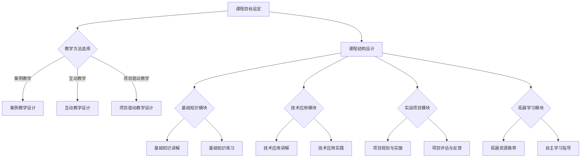

                 

在当今这个信息爆炸的时代，程序员的知识课程变得尤为重要。随着技术的不断进步，程序员不仅需要掌握基本编程技能，还需要了解最新的技术趋势和高效的编程方法。打造一门高转换率的程序员知识课程，不仅能够帮助学员迅速掌握知识，还能提高课程的市场竞争力。本文将围绕如何打造高转换率的程序员知识课程展开讨论。

> 关键词：程序员知识课程、高转换率、教学方法、技术趋势、课程设计

> 摘要：本文旨在探讨如何通过有效的教学方法、课程设计和资源整合，打造一门高转换率的程序员知识课程。文章将分为以下几个部分：背景介绍、核心概念与联系、核心算法原理与操作步骤、数学模型与公式讲解、项目实践、实际应用场景、工具和资源推荐、总结与展望以及常见问题解答。

## 1. 背景介绍

程序员知识课程在全球范围内受到了广泛的关注。随着云计算、人工智能、大数据等技术的迅猛发展，程序员不仅需要掌握传统的编程语言，还需要了解新兴技术的应用。然而，传统的教学模式往往难以满足快速变化的编程需求。因此，如何设计一门具有高转换率的程序员知识课程，成为教育者和培训机构亟待解决的问题。

### 1.1 现状分析

当前，市场上存在大量的程序员知识课程，但真正能够满足学员需求的并不多。主要原因有以下几点：

1. **课程内容过于陈旧**：许多课程仍然沿用几年前的教学内容，未能及时更新。
2. **教学方法单一**：传统的灌输式教学方法无法激发学员的学习兴趣和创造力。
3. **缺乏实践环节**：程序员的学习过程离不开实践，而许多课程缺乏实战训练。
4. **缺少个性化指导**：每个学员的学习进度和理解能力不同，缺乏针对性的指导。

### 1.2 高转换率的含义

高转换率指的是学员在学习后能够将所学知识应用于实际工作中，达到提升工作效率或解决实际问题的目的。对于程序员知识课程来说，高转换率意味着学员能够在课程结束后迅速提升自己的技能，具备实际编程能力。

## 2. 核心概念与联系

### 2.1 教学目标

教学目标是课程设计的核心。对于程序员知识课程，教学目标应包括以下几个方面：

1. **基础知识掌握**：确保学员掌握编程语言的基本语法和常用算法。
2. **技术应用能力**：培养学员使用新兴技术解决实际问题的能力。
3. **创新能力**：激发学员的创新思维，鼓励他们探索新的编程方法和技术。
4. **团队协作能力**：提高学员的团队协作意识和能力，为未来的团队开发项目做好准备。

### 2.2 教学方法

教学方法的选择直接影响学员的学习效果。以下是一些有效的教学方法：

1. **案例教学**：通过实际案例来讲解知识点，使学员能够更好地理解。
2. **互动教学**：通过讨论、问答等形式激发学员的思考和参与。
3. **项目驱动教学**：以项目为主线，通过实际操作来巩固知识点。
4. **在线教学**：利用在线平台进行课程讲授和互动，方便学员随时随地学习。

### 2.3 课程结构

课程结构是课程设计的骨架。一个合理的课程结构应包括以下几个方面：

1. **基础知识模块**：包括编程语言的基础语法、常用算法和数据结构。
2. **技术应用模块**：介绍新兴技术的应用场景和开发方法。
3. **实战项目模块**：通过实际项目来巩固知识点，提高编程能力。
4. **拓展学习模块**：提供额外的学习资源，供学员深入学习。

### 2.4 Mermaid 流程图

以下是程序员知识课程的一个简单的 Mermaid 流程图，展示了课程设计的主要环节：



## 3. 核心算法原理与操作步骤

### 3.1 算法原理概述

程序员知识课程中，算法是核心内容之一。以下是一些常见算法的原理概述：

1. **排序算法**：包括冒泡排序、选择排序、插入排序、快速排序等。
2. **搜索算法**：包括线性搜索、二分搜索、广度优先搜索、深度优先搜索等。
3. **图算法**：包括拓扑排序、最短路径算法、最小生成树算法等。

### 3.2 算法步骤详解

以冒泡排序算法为例，其基本步骤如下：

1. **初始化**：将待排序的数组进行初始化。
2. **外层循环**：从最后一个元素开始，进行n-1次比较和交换。
3. **内层循环**：每次外层循环开始时，对相邻的两个元素进行比较，若逆序则交换。
4. **结束条件**：当内层循环没有进行任何交换时，算法结束。

### 3.3 算法优缺点

冒泡排序算法的优点是简单易懂，实现简单。但缺点是时间复杂度为O(n^2)，不适合大规模数据排序。

### 3.4 算法应用领域

冒泡排序算法广泛应用于小型数据的排序，如学生成绩排序等。但对于大规模数据排序，建议使用更高效的排序算法，如快速排序。

## 4. 数学模型和公式讲解

### 4.1 数学模型构建

在程序员知识课程中，数学模型是解决实际问题的理论基础。以下是一个简单的数学模型构建过程：

1. **问题分析**：分析问题的性质，确定需要解决的变量。
2. **变量定义**：定义问题的变量，明确变量的取值范围。
3. **公式推导**：根据问题性质，推导出所需的数学公式。
4. **模型验证**：通过实际数据验证模型的准确性。

### 4.2 公式推导过程

以一元二次方程的求解为例，其公式推导过程如下：

1. **方程标准形式**：将一元二次方程化为 $ax^2+bx+c=0$ 的形式。
2. **判别式**：计算判别式 $\Delta=b^2-4ac$。
3. **求解公式**：根据判别式的值，使用以下公式求解：
   $$x_1=\frac{-b+\sqrt{\Delta}}{2a}$$
   $$x_2=\frac{-b-\sqrt{\Delta}}{2a}$$

### 4.3 案例分析与讲解

以求解方程 $2x^2+3x-5=0$ 为例，进行以下步骤：

1. **方程标准形式**：方程已为标准形式。
2. **判别式**：$\Delta=3^2-4\times2\times(-5)=49$。
3. **求解公式**：根据求解公式，得到：
   $$x_1=\frac{-3+\sqrt{49}}{2\times2}=\frac{-3+7}{4}=1$$
   $$x_2=\frac{-3-\sqrt{49}}{2\times2}=\frac{-3-7}{4}=-\frac{5}{2}$$

## 5. 项目实践：代码实例和详细解释说明

### 5.1 开发环境搭建

在本节中，我们将搭建一个简单的 Python 开发环境。首先，需要确保已安装 Python 3.8 及以上版本。接下来，安装一个代码编辑器，如 Visual Studio Code，并配置 Python 扩展。

### 5.2 源代码详细实现

以下是一个简单的冒泡排序算法的实现代码：

```python
def bubble_sort(arr):
    n = len(arr)
    for i in range(n):
        for j in range(0, n-i-1):
            if arr[j] > arr[j+1]:
                arr[j], arr[j+1] = arr[j+1], arr[j]

# 测试代码
arr = [64, 34, 25, 12, 22, 11, 90]
bubble_sort(arr)
print("排序后的数组：", arr)
```

### 5.3 代码解读与分析

1. **函数定义**：定义了一个名为 `bubble_sort` 的函数，参数为待排序的数组 `arr`。
2. **外层循环**：通过 `for i in range(n)` 循环，进行 n-1 次排序。
3. **内层循环**：通过 `for j in range(0, n-i-1)` 循环，对相邻的元素进行比较和交换。
4. **条件判断**：通过 `if arr[j] > arr[j+1]` 判断是否需要进行交换。
5. **交换操作**：使用元组交换操作 `arr[j], arr[j+1] = arr[j+1], arr[j]` 进行交换。
6. **测试代码**：创建一个测试数组 `arr`，调用 `bubble_sort` 函数进行排序，并打印排序后的结果。

### 5.4 运行结果展示

运行上述代码后，输出结果为：

```
排序后的数组： [11, 12, 22, 25, 34, 64, 90]
```

## 6. 实际应用场景

### 6.1 云计算平台

在云计算平台上，程序员知识课程可以帮助学员掌握分布式计算、容器化技术、云原生应用开发等技能，为他们在云计算领域的发展奠定基础。

### 6.2 人工智能领域

人工智能领域的快速发展要求程序员具备机器学习、深度学习、自然语言处理等技能。程序员知识课程可以通过案例教学和实战项目，帮助学员迅速掌握这些前沿技术。

### 6.3 大数据技术

大数据技术的应用场景广泛，包括金融、医疗、电商等领域。程序员知识课程可以通过教授大数据处理和分析方法，帮助学员应对大数据带来的挑战。

### 6.4 未来应用展望

随着科技的不断进步，程序员知识课程的应用场景将进一步拓展。例如，物联网、区块链、虚拟现实等领域都将迎来新的机遇。程序员知识课程需要不断更新内容，紧跟技术发展趋势，为学员提供全面的技能培训。

## 7. 工具和资源推荐

### 7.1 学习资源推荐

1. **在线编程平台**：如 LeetCode、Hackerrank，提供丰富的编程题目和在线评测功能。
2. **技术社区**：如 Stack Overflow、GitHub，帮助学员解决编程问题，获取技术支持。
3. **学习网站**：如 Coursera、edX，提供高质量的课程资源。

### 7.2 开发工具推荐

1. **集成开发环境（IDE）**：如 Visual Studio Code、PyCharm，提供便捷的编程和调试功能。
2. **版本控制工具**：如 Git，帮助团队协作和代码管理。
3. **容器化工具**：如 Docker，实现应用程序的容器化部署。

### 7.3 相关论文推荐

1. **《深度学习》**：Goodfellow, I., Bengio, Y., & Courville, A. (2016). Deep learning.
2. **《机器学习》**：Tom Mitchell (1997). Machine Learning.
3. **《云计算：概念、技术和应用》**：张英伟，赵建伟 (2016). 云计算：概念、技术和应用。

## 8. 总结：未来发展趋势与挑战

### 8.1 研究成果总结

随着人工智能、云计算、大数据等技术的快速发展，程序员知识课程也在不断演进。通过案例教学、项目驱动教学等创新方法，程序员知识课程能够更好地满足学员的需求。同时，在线教育和个性化学习也将成为未来教育的重要趋势。

### 8.2 未来发展趋势

1. **技术融合**：程序员知识课程将更加注重技术与技术的融合，如人工智能与大数据的结合。
2. **个性化学习**：通过大数据分析和人工智能技术，实现个性化学习路径和内容推荐。
3. **国际化**：随着全球化的推进，程序员知识课程将更加注重国际化，提供多语言、多地区的课程资源。

### 8.3 面临的挑战

1. **课程内容更新**：随着技术的快速变化，如何及时更新课程内容是教育机构和教师面临的挑战。
2. **教学方法创新**：如何通过创新的教学方法提高学员的学习效果，是教育工作者需要思考的问题。
3. **资源分配**：如何合理分配教育资源，确保每个学员都能获得优质的学习体验，是教育机构需要解决的问题。

### 8.4 研究展望

未来，程序员知识课程将朝着更加智能化、个性化、国际化的方向发展。通过技术创新和教育理论的融合，程序员知识课程将更好地满足不同学员的需求，为他们的职业发展提供有力支持。

## 9. 附录：常见问题与解答

### 9.1 问题1：如何选择编程语言？

解答：选择编程语言应考虑以下几个方面：

1. **项目需求**：根据项目需求选择适合的编程语言。
2. **个人兴趣**：选择自己感兴趣的编程语言，有助于提高学习动力。
3. **就业前景**：考虑当前和未来的就业市场需求，选择具有广泛应用的编程语言。

### 9.2 问题2：如何进行项目驱动教学？

解答：项目驱动教学的关键在于：

1. **明确项目目标**：确保项目目标与课程内容紧密结合。
2. **分解任务**：将项目任务分解为可操作的小任务，便于学员逐步完成。
3. **指导与反馈**：在项目实施过程中，及时给予学员指导和支持，并提供反馈。

### 9.3 问题3：如何进行个性化学习？

解答：个性化学习的关键在于：

1. **数据分析**：通过数据分析了解学员的学习情况，为个性化学习提供依据。
2. **学习路径规划**：根据学员的特点和需求，为其规划个性化的学习路径。
3. **学习资源推荐**：根据学员的学习进度和兴趣，推荐适合的学习资源。

### 9.4 问题4：如何进行在线教学？

解答：进行在线教学应考虑以下几个方面：

1. **教学内容准备**：确保教学内容丰富、有针对性，符合在线学习特点。
2. **教学工具选择**：选择合适的在线教学工具，如直播平台、互动平台等。
3. **互动与反馈**：通过在线讨论、问答等形式，增加学员的互动和反馈。

---

以上是关于如何打造高转换率的程序员知识课程的文章。希望对您有所帮助。作者：禅与计算机程序设计艺术 / Zen and the Art of Computer Programming。本文旨在为程序员知识课程的设计和实施提供一些实用的建议和指导。然而，由于技术的不断发展和个人观点的多样性，本文的内容仅供参考，实际应用时请结合具体情况进行调整。如果您有任何问题或建议，欢迎在评论区留言交流。|

